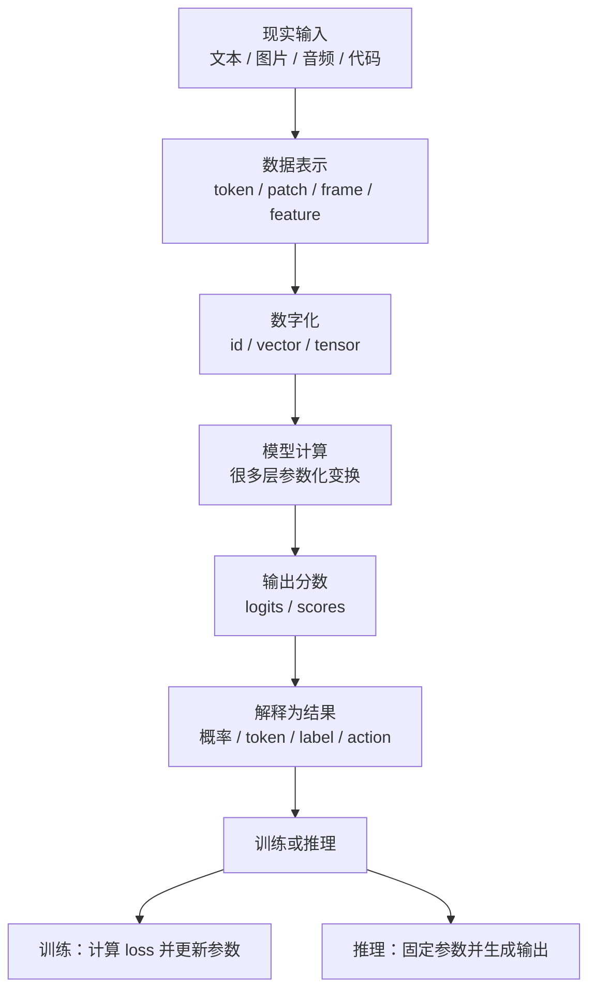

# AI 基础概念

学习 AI 时最容易被一堆术语吓住。

可以先不要急着学公式，也不要急着区分各种模型家族。先抓住一个最小主线：

> AI 模型把现实世界里的输入变成数字，在数字上做很多次计算，再把计算结果变成我们能理解的输出。

对大语言模型来说，这条主线可以再具体一点：

> 模型读入一段文本，把文本切成 token，把 token 变成向量，在向量上做计算，最后预测“下一个 token 更可能是什么”。

本页只讲后面必须用到的基础概念。

目标不是把 AI 理论讲完，而是让新手能看懂后面的 Transformer、训练、推理、Benchmark 和系统优化章节。

## 一张总图



这张图里最重要的不是每个名词，而是方向：

```text
输入 -> 表示 -> 计算 -> 分数 -> 输出
```

AI 系统优化关心的很多问题，都来自这条链路：

- 输入越长，计算和显存越多；
- 模型越大，参数和计算量越多；
- 输出越长，推理时间越长；
- batch 越大，吞吐可能更高，但延迟和显存压力也可能变化；
- precision 越低，计算可能更快，但数值和质量需要验证。

## AI、机器学习和深度学习

先区分三个常见词。

| 词 | 可以怎么理解 |
| --- | --- |
| AI | 让机器表现出某种智能行为的总称。 |
| Machine Learning | 让系统从数据里学规律，而不是人工写死规则。 |
| Deep Learning | 用很多层神经网络从数据里学复杂表示。 |

这三个词不是完全并列的。

可以粗略理解成：

```text
AI 包含 Machine Learning，Machine Learning 里有 Deep Learning。
```

现在的大语言模型、视觉模型、多模态模型，大多属于 deep learning。

它们不是靠人工写一堆 if/else 工作，而是靠大量数据和大量计算把参数训练出来。

## 模型是什么

模型可以先理解成一个函数：

```text
输入 -> 模型 -> 输出
```

普通函数的规则通常由人写死。

例如：

```text
温度 > 30 度 -> 提醒天气炎热
```

AI 模型的规则不是人一条条写出来的，而是从数据里学出来的。

例如它看过很多句子、代码和问答后，会慢慢学到：

- 问句后面通常需要回答；
- “北京是中国的”后面很可能接“首都”；
- `for i in range` 后面经常接循环体；
- 翻译、总结、推理、代码补全有不同的输出格式；
- 一段图片描述和一张图片之间有对应关系。

所以模型不是一个普通数据库。

它通常不是在查“固定答案”，而是在根据输入和训练中学到的规律计算一个输出。

## 参数是什么

参数就是模型内部可以被训练过程调整的数字。

可以把模型想象成一台有很多旋钮的机器。

刚开始这些旋钮位置不合适，模型经常猜错。

训练时，系统会根据错误一点点调整旋钮。

调整很多次以后，模型的预测会越来越符合训练数据里的规律。

这些“旋钮”就是参数。

参数有几个重要特点：

- 参数不是人工写的知识点；
- 参数是训练过程自动学出来的数字；
- 参数越多，模型容量通常越大；
- 参数多不一定代表一定更好，还要看数据、训练方法、架构和推理方式；
- 参数越多，通常也意味着存储、显存、带宽和计算成本更高。

从 AI Infra 视角看，参数直接影响：

| 影响项 | 为什么 |
| --- | --- |
| 模型文件大小 | 参数需要保存到磁盘或对象存储。 |
| 加载时间 | 参数需要从存储读入内存或显存。 |
| 显存占用 | 推理和训练时参数通常要放在加速器可访问的位置。 |
| 计算量 | 每次前向计算都会使用大量参数。 |
| 分布式策略 | 参数太大时，可能需要切分到多张卡或多个节点。 |

入门时不用记住所有系统细节，只要先记住：

> 参数是模型学到的数字，也是模型成本的重要来源。

## 数据是什么

模型不是凭空学会能力的。

训练数据给模型提供例子。

对语言模型来说，训练数据可以是：

- 普通文本；
- 代码；
- 问答；
- 数学推导；
- 表格；
- 网页；
- 文档；
- 多轮对话。

对多模态模型来说，训练数据还可以包括：

- 图片和文字描述；
- 视频帧和字幕；
- 音频和转写；
- 图文问答；
- 传感器数据。

数据决定模型能接触到什么规律。

例如：

- 没见过某类语言，模型就很难熟练处理；
- 代码数据少，代码能力通常会受影响；
- 数据质量差，模型可能学到错误格式、噪声或偏见；
- 数据重复太多，模型可能更容易记忆而不是泛化。

这里先不展开数据治理。

入门时只要知道：

> 数据提供学习材料，参数保存学习结果。

## 样本、特征和标签

在很多传统机器学习任务里，我们会说：

```text
样本 -> 特征 -> 标签
```

例如预测房价：

| 样本 | 特征 | 标签 |
| --- | --- | --- |
| 一套房子 | 面积、位置、楼层、房龄 | 价格 |

模型学习的是：

```text
特征 -> 标签
```

大语言模型看起来不太一样，但仍然可以用类似思路理解。

语言模型的一个训练样本可以是：

```text
前面的 token -> 下一个 token
```

例如：

```text
输入：北京 是 中国 的
标签：首都
```

真实训练会一次处理很多 token。

一个长句子可以被拆成很多个“根据前文预测下一个 token”的小任务。

这就是为什么后面会反复看到：

```text
next-token prediction
```

## Token 是什么

模型不能直接读“文字”。

它只能处理数字。

所以第一步通常是把文本切成 token。

token 可以粗略理解成模型眼里的“文字小块”。

它可能是：

- 一个汉字；
- 一个词；
- 一个词的一部分；
- 一个标点；
- 一个空格；
- 一段常见字符组合；
- 一个特殊控制符号。

例如：

```text
原文：我喜欢 AI
token：我 / 喜欢 / AI
token id：128 / 5632 / 9021
```

真实 tokenizer 会更复杂。

不同模型的 tokenizer 也不一定相同。

同一句话，在不同 tokenizer 下可能切成不同数量的 token。

这件事非常重要，因为很多系统成本按 token 计算。

| 现象 | 系统影响 |
| --- | --- |
| 输入 token 多 | Prefill 计算更多，KV Cache 更大。 |
| 输出 token 多 | Decode 轮数更多，用户等待更久。 |
| 同样文字在某语言下 token 更多 | 该语言的计算成本可能更高。 |
| tokenizer 不一致 | prompt 长度、截断、缓存命中和成本估算都可能变化。 |

入门时先记住：

> 文本先被切成 token，再映射成 token id；模型处理的是这些编号，而不是原始文字。

## 向量和 Embedding 是什么

token id 只是编号，本身没有语义。

比如 `9021` 并不天然表示“AI”。

所以模型会把 token id 转成一串数字，这串数字叫向量。

这个转换过程叫 embedding。

可以这样理解：

```text
token id -> embedding -> vector
```

向量的作用是让模型能用数字表示“含义”和“用法”。

训练之后，意思相近或用法相近的 token，向量关系往往会变得更有规律。

例如模型可能学到：

- “猫”和“狗”都和动物有关；
- “北京”和“上海”都和城市有关；
- `def`、`return`、`class` 都和代码结构有关。

这不是人手工告诉模型的。

它是在训练中通过大量上下文逐渐学到的。

入门时不用关心向量有多少维，只要知道：

> embedding 是把离散 token 编号变成模型可以继续计算的数字表示。

## Tensor 是什么

后面会经常看到 tensor。

可以先把 tensor 理解成“一组有形状的数字”。

| 名字 | 直觉 |
| --- | --- |
| 标量 | 一个数字，例如 `3.14` |
| 向量 | 一排数字，例如一个 token 的 embedding |
| 矩阵 | 二维数字表，例如一批 token 的表示 |
| 高维 tensor | 更多维度的数字块，例如 batch、sequence、hidden dimension 组合 |

语言模型里常见形状是：

```text
batch_size x sequence_length x hidden_size
```

含义可以理解成：

- batch_size：一次处理多少条样本或请求；
- sequence_length：每条样本有多少 token；
- hidden_size：每个 token 用多长的向量表示。

很多性能问题其实都和 tensor shape 有关。

shape 一变，计算量、显存、带宽、kernel 行为都可能变化。

## Logits 和概率是什么

模型最终会给很多候选 token 打分。

例如前文是：

```text
北京是中国的
```

模型可能给下面几个 token 打分：

```text
首都：很高
城市：较高
苹果：很低
```

这些原始分数常叫 logits。

logits 不是概率。

它们只是未归一化的分数。

系统通常会把 logits 转成概率，模型就能知道哪些 token 更可能成为下一个 token。

可以粗略理解成：

```text
最终向量 -> logits -> 概率 -> 选择 token
```

推理时，模型会根据这些概率选择一个 token。

最简单的方式是永远选概率最高的 token。

也可以带一点随机性，让回答不那么死板。

这就是后面推理章节会讲的 temperature、top-k、top-p 等采样策略。

## Loss 是什么

训练时模型会先猜，然后和标准答案比较。

例如训练样本是：

```text
输入：北京是中国的
正确下一个 token：首都
```

如果模型给“首都”的概率很高，loss 就小。

如果模型给“苹果”的概率很高，loss 就大。

可以把 loss 理解成“错误程度”：

```text
猜得越离谱 -> loss 越大
猜得越接近 -> loss 越小
```

训练的目标就是让 loss 逐渐变小。

这里有一个常见误解：

> loss 变小不等于模型在所有真实任务上都更好。

loss 只是在某个数据和目标函数上衡量错误。

所以训练过程中还需要验证集、评估集和真实任务指标。

## 梯度是什么

知道 loss 还不够。

训练还要知道：

> 哪些参数应该往哪个方向改，才能让 loss 更小？

这个方向信息叫梯度。

可以用非常简单的直觉理解：

```text
loss 告诉你错得多严重
gradient 告诉你参数应该往哪里调
optimizer 真正更新参数
```

如果把参数想象成旋钮：

- loss 告诉你当前声音很刺耳；
- 梯度告诉你哪个旋钮应该往左还是往右；
- 优化器决定每次拧多大。

后面的训练章节会继续解释反向传播和优化器。

本页只需要先记住：

> 梯度是训练时用于调整参数的方向信息。

## 训练、推理和评估

训练、推理、评估是三个不同阶段。

| 阶段 | 参数会变吗 | 主要问题 | 典型输出 |
| --- | --- | --- | --- |
| 训练 | 会变 | 怎么让模型学到规律 | 新的模型参数 |
| 推理 | 不变 | 怎么用固定参数生成结果 | 文本、图片、分类、动作 |
| 评估 | 不变 | 怎么判断模型好不好 | 指标、报告、错误样本 |

训练像学习：

```text
看题 -> 答题 -> 对答案 -> 修改参数
```

推理像考试或使用：

```text
读 prompt -> 生成输出 -> 返回结果
```

评估像测验和验收：

```text
固定模型 -> 跑测试集或任务 -> 计算指标
```

这三件事在系统上差别很大。

| 对比项 | 训练 | 推理 |
| --- | --- | --- |
| 是否需要反向传播 | 需要 | 通常不需要 |
| 是否保存梯度 | 需要 | 通常不需要 |
| 是否更新参数 | 会 | 不会 |
| 主要瓶颈 | 计算、通信、显存、数据输入 | 延迟、吞吐、KV Cache、调度 |
| 输出目标 | 模型变好 | 用户得到结果 |

这就是为什么本知识库后面把训练系统和推理系统分开讲。

## Prompt 和上下文

prompt 是用户给模型的输入。

对语言模型来说，prompt 会变成一串 token，进入模型计算。

模型生成时会参考上下文：

```text
系统提示 + 用户问题 + 历史对话 + 已生成 token
```

上下文越长，模型能看到的信息越多。

但上下文变长也会带来成本：

- 输入 token 更多；
- attention 计算更多；
- KV Cache 更大；
- 延迟可能上升；
- 单个请求占用的显存更多；
- 可同时服务的请求数可能下降。

所以“更长上下文”不是免费的。

它既是能力问题，也是系统问题。

## Batch、并发和吞吐

AI 模型计算通常很适合并行。

系统常常会把多个样本或多个请求放在一起处理，这叫 batch。

| 概念 | 直觉 |
| --- | --- |
| batch | 一次放进模型的一组样本或请求 |
| latency | 单个请求等多久 |
| throughput | 单位时间处理多少请求或 token |
| concurrency | 同时有多少请求在系统中 |

batch 变大时，硬件利用率可能更高，吞吐可能上升。

但 batch 也可能带来：

- 单个请求等待更久；
- 显存占用更高；
- 不同长度请求互相拖累；
- 调度更复杂。

所以 AI Infra 经常要在 latency 和 throughput 之间做取舍。

后面的推理系统章节会专门讲 batching、调度和指标体系。

## 模型“知道”什么

新手常问：

> 模型是不是把所有知识都存起来了？

更准确的说法是：

> 模型参数中保存的是从训练数据中学到的统计规律和表示方式，不是一个可以精确查询的数据库。

这有几个后果：

- 模型可能回答正确；
- 模型也可能编造；
- 模型可能记住某些训练样本片段；
- 模型可能不知道训练后发生的新事实；
- 模型可能在不同问法下给出不同答案；
- 模型可能对罕见事实、长尾知识或精确数字不可靠。

因此，很多应用会把模型和外部系统结合：

- 搜索；
- 数据库；
- 文档检索；
- 工具调用；
- RAG；
- Agent。

这些不是因为模型“没用”，而是因为语言模型本身更像概率生成器，不是强一致的事实存储系统。

## 模型能力和系统能力

一个模型“聪明”不等于系统就好用。

实际应用里至少有两层能力：

| 层级 | 关注点 |
| --- | --- |
| 模型能力 | 知识、推理、语言、代码、视觉、工具使用等能力。 |
| 系统能力 | 延迟、吞吐、成本、稳定性、可观测性、安全、扩展性。 |

例如一个模型回答质量很好，但如果：

- 首 token 要等 20 秒；
- 一并发就 OOM；
- p99 延迟不可控；
- 成本太高；
- 出错无法定位；
- 版本升级后性能回退；

那它仍然不是一个可用的工程系统。

本知识库更关注第二层：

> 如何让 AI workload 在硬件、编译器、runtime、网络、存储和调度系统上更快、更稳、更高效。

## 从基础概念到后续章节

下面是本页概念和后续章节的关系。

| 基础概念 | 后续会在哪里继续展开 |
| --- | --- |
| token | Transformer、推理、训练、Benchmark、容量建模 |
| embedding | Transformer、多模态、模型结构 |
| logits | 推理采样、输出层、Cross Entropy |
| loss | 训练过程、稳定性、评估 |
| gradient | 反向传播、优化器、分布式训练 |
| tensor shape | Kernel、Compiler、Benchmark、硬件架构 |
| batch | 推理 batching、训练 batch、吞吐和延迟 |
| context length | Attention、KV Cache、长上下文推理 |
| parameter | 显存、并行策略、加载、存储 |
| evaluation | Benchmark、ADR、质量门禁 |

入门时不需要一次掌握所有细节。

建议先建立下面这条链路：

```text
文字 -> token -> 向量 -> 模型计算 -> logits -> 概率 -> 输出
```

再理解训练和推理的区别：

```text
训练：用 loss 和梯度更新参数
推理：用固定参数逐步生成输出
```

## 常见误解

### 误解一：模型直接理解文字

模型处理的是 token id、向量和 tensor。

“理解”是训练后表现出来的能力，不是模型直接读取自然语言含义。

### 误解二：参数就是知识库条目

参数不是一条条知识。

它们是大量数字，表示模型从数据中学到的规律。

### 误解三：token 等于单词

token 可能是词，也可能是词的一部分、符号、空格或特殊标记。

不同 tokenizer 的切分结果可能不同。

### 误解四：loss 低就一定好

loss 低说明模型在某个训练或验证目标上表现更好。

它不自动代表真实任务更好、事实更准确或用户体验更好。

### 误解五：推理只是“查答案”

推理通常是一次次预测下一个 token。

它不是简单查表，也不是一次性吐出完整答案。

### 误解六：模型大就一定更适合

模型越大通常能力上限更高，但成本、延迟、显存、部署复杂度也更高。

工程上要看 workload、SLO、成本和硬件约束。

## 最小检查清单

读完本页后，应该能用自己的话回答：

- 模型为什么可以理解成一个从输入到输出的函数？
- 参数为什么是模型训练出来的数字？
- 数据和参数分别起什么作用？
- 为什么文本要先切成 token？
- token id 为什么还要变成 embedding 向量？
- logits 和概率有什么关系？
- loss 为什么能表示训练时的错误程度？
- 梯度在训练里做什么？
- 训练、推理、评估有什么区别？
- 为什么 token 数、batch、context length 会影响系统成本？

## 参考资料

- [Google Machine Learning Crash Course](https://developers.google.com/machine-learning/crash-course)
- [Hugging Face LLM Course: Tokenizers](https://huggingface.co/learn/llm-course/chapter6/1)
- [PyTorch: The Fundamentals of Autograd](https://docs.pytorch.org/tutorials/beginner/introyt/autogradyt_tutorial.html)
- [OpenAI Cookbook: How to count tokens with tiktoken](https://developers.openai.com/cookbook/examples/how_to_count_tokens_with_tiktoken)
