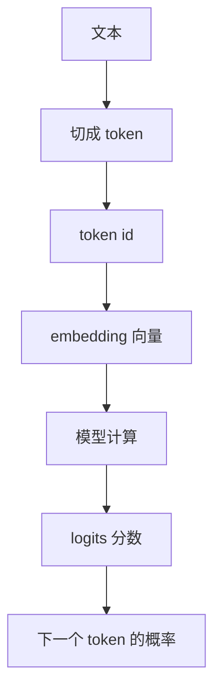

# AI 基础概念

学习 AI 时最容易被一堆术语吓住。先不要急着学公式，可以先把大语言模型理解成一句话：

> 模型读入一段文字，把它变成数字，在数字上做计算，然后预测“下一个最可能出现的 token 是什么”。

本页只解释后面必须用到的最小概念。

## AI 模型是什么

模型可以先理解成一个很大的“函数”：

```text
输入 -> 模型 -> 输出
```

普通函数的规则是人写死的，例如：

```text
温度 > 30 度 -> 提醒天气炎热
```

AI 模型的规则不是人一条条写出来的，而是从大量样本里学出来的。比如它看过很多句子后，会慢慢学到：

- 问句后面通常需要回答。
- “北京是中国的”后面很可能接“首都”。
- 代码、数学、翻译、总结都有不同的语言模式。

所以模型不是在数据库里查固定答案，而是在根据学到的规律做预测。

## 参数是什么

参数就是模型内部可以被调整的数字。

可以把模型想象成一台有很多旋钮的机器。刚开始这些旋钮位置不合适，模型经常猜错。训练时，系统会根据错误一点点调整旋钮。调整很多次以后，模型的预测会越来越接近训练数据里的规律。

这里的“旋钮”就是参数。

参数不是人工写的知识点，而是训练过程自动学出来的数字。模型越大，参数通常越多，但参数多不一定等于一定更好，还要看数据、训练方法和使用方式。

## Token 是什么

模型不能直接读“文字”，它只能处理数字。所以第一步通常是把文本切成 token。

token 可以粗略理解成模型眼里的“文字小块”。它可能是一个字、一个词、一个词的一部分，或者一个符号。

例如：

```text
原文：我喜欢 AI
token：我 / 喜欢 / AI
token id：128 / 5632 / 9021
```

真实 tokenizer 会更复杂，但入门时只要记住：

> 文本先被切成 token，再被映射成数字编号，模型处理的是这些编号。

## 向量和 Embedding 是什么

token id 只是编号，本身没有含义。比如 `9021` 并不天然表示 “AI”。

所以模型会把 token id 转成一串数字，这串数字叫向量。这个转换过程叫 embedding。

可以这样理解：

```text
token id -> embedding -> 一个向量
```

向量的作用是让模型能用数字表示含义。训练之后，意思相近、用法相近的 token，向量关系也会变得更有规律。

入门时不用关心向量有多少维，只要知道：

> embedding 是把离散文字编号变成模型能计算的数字表示。

## Logits 和概率是什么

模型最终会给很多候选 token 打分。例如前文是：

```text
北京是中国的
```

模型可能给下面几个 token 打分：

```text
首都：很高
城市：较高
苹果：很低
```

这些原始分数常叫 logits。把 logits 转成概率后，模型就能知道哪些 token 更可能成为下一个 token。

推理时，模型会根据这些概率选择一个 token。最简单的方式是永远选概率最高的，也可以带一点随机性，让回答不那么死板。

## Loss 是什么

训练时模型会先猜，然后和标准答案比较。

例如训练样本是：

```text
输入：北京是中国的
正确下一个 token：首都
```

如果模型给“首都”的概率很高，loss 就小；如果模型给“苹果”的概率很高，loss 就大。

可以把 loss 理解成“错误程度”：

```text
猜得越离谱 -> loss 越大
猜得越接近 -> loss 越小
```

训练的目标就是让 loss 逐渐变小。

## 训练和推理有什么区别

训练和推理是两个阶段。

| 阶段 | 模型参数会变吗 | 目标 |
| --- | --- | --- |
| 训练 | 会变 | 让模型从错误中调整参数，学到规律。 |
| 推理 | 不变 | 使用已经训练好的参数，根据输入生成输出。 |

训练像学习：看题、答题、对答案、改正。
推理像考试：参数已经固定，只能根据已经学到的规律回答。

## 最小流程



这就是后面 Transformer、训练和推理都会反复用到的基础流程。

## 读完应该能回答

- 为什么模型不能直接处理文字，而要先变成 token 和数字。
- 参数为什么可以理解成模型内部可调整的数字。
- embedding 为什么是把 token 变成可计算的表示。
- logits 和概率为什么能用来选择下一个 token。
- 训练和推理为什么不是一回事。
