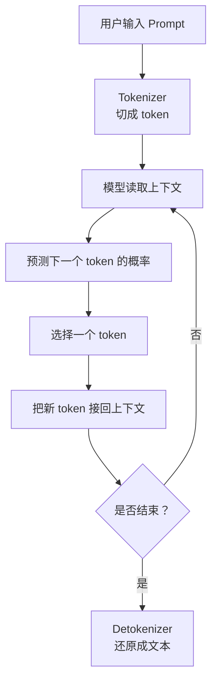

# 推理过程与原理

推理就是使用已经训练好的模型来生成结果。

训练时模型参数会不断变化；推理时参数已经固定。用户输入一段 prompt，模型根据已学到的规律预测输出。

## 推理在做什么

大语言模型最基本的推理方式是：

> 根据已有上下文，预测下一个 token；把这个 token 接回上下文，再预测下一个 token。

所以大模型生成回答不是一次性把整段文字吐出来，而是一个 token 一个 token 生成。

## 总体流程



下面按步骤解释。

## 第一步：输入 prompt

prompt 就是用户给模型的输入。

例如：

```text
请解释什么是 Transformer。
```

prompt 会影响模型后续生成什么内容。你给的信息越清楚，模型越容易生成符合预期的回答。

## 第二步：切成 token

和训练一样，推理时模型也不能直接处理文字。系统会先把 prompt 切成 token，再变成 token id。

```text
请解释什么是 Transformer
-> 请 / 解释 / 什么 / 是 / Transformer
-> 101 / 2389 / 450 / 77 / 9021
```

这些编号会进入模型计算。

## 第三步：模型读取上下文

模型会把 prompt 里的 token 转成向量，并通过 Transformer 读取上下文。

这一步的作用是让模型形成一个内部表示，大概知道：

- 用户在问什么。
- 前文出现了哪些关键词。
- 现在应该接着生成哪类内容。

## 第四步：预测下一个 token

模型不会直接输出一句完整的话。它会先预测下一个 token 的概率。

例如 prompt 是：

```text
Transformer 是一种
```

模型可能认为：

```text
模型：概率高
架构：概率高
水果：概率低
```

然后系统会从候选 token 里选一个。

## 第五步：选择 token

选择 token 有不同方式。

最简单的是永远选概率最高的 token，这叫 greedy。它稳定，但有时回答会比较死板。

也可以按概率随机选择，让结果更有变化。比如：

- temperature 越高，随机性越强。
- top-k 只从概率最高的 k 个候选里选。
- top-p 只从累计概率较高的一组候选里选。

入门时只要知道：

> 模型给出概率，采样策略决定最终选哪个 token。

## 第六步：接回上下文，继续生成

选出的 token 会被接回上下文。

例如：

```text
原上下文：Transformer 是一种
新 token：模型
新上下文：Transformer 是一种 模型
```

然后模型根据新上下文继续预测下一个 token。这个过程不断循环，直到满足停止条件。

## 为什么必须一个 token 一个 token 生成

因为语言模型训练时学的是“根据前文预测下一个 token”。

生成第 2 个 token 时，需要知道第 1 个 token 是什么；生成第 3 个 token 时，又需要知道前两个 token 是什么。

所以输出是逐步展开的：

```text
第 1 步：生成 A
第 2 步：根据 prompt + A 生成 B
第 3 步：根据 prompt + A + B 生成 C
```

这就是自回归生成。

## KV Cache 的直觉

每次生成新 token 时，模型都需要参考前面的上下文。如果每一步都把所有历史 token 从头算一遍，会很浪费。

所以推理系统通常会保存一部分已经算好的中间信息，下一步直接复用。这个保存下来的信息常叫 KV Cache。

入门时可以把它理解成：

> 模型生成时的“上下文计算备忘录”，用来避免每一步都从头重读历史。

这里不展开它的显存、带宽和调度问题，这些属于后续推理系统和性能优化内容。

## 什么时候停止

模型生成会在某些条件下停止，例如：

- 生成了特殊的结束 token。
- 达到最大长度。
- 应用层判断回答已经完整。
- 用户或系统中断。

停止后，系统会把 token 再转换回人能读的文本。

## 推理和训练的区别

| 对比项 | 训练 | 推理 |
| --- | --- | --- |
| 参数 | 会更新 | 固定不变 |
| 目标 | 学规律 | 用规律生成输出 |
| 是否有标准答案 | 通常有 | 通常没有 |
| 核心动作 | 算 loss 并调整参数 | 预测并选择下一个 token |

## 读完应该能回答

- 推理为什么是使用固定参数生成结果。
- prompt 为什么会影响输出。
- 模型为什么通常逐 token 生成。
- logits 和采样策略分别做什么。
- KV Cache 可以先直观理解成什么。
