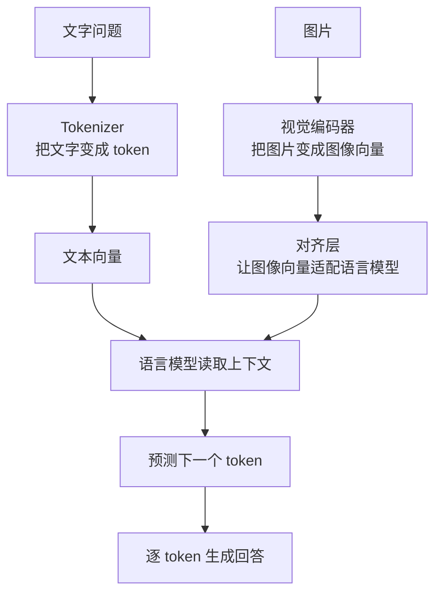

# 多模态原理

多模态模型就是能同时处理多种输入形式的模型。这里的“模态”可以理解成信息的类型，例如：

- 文本
- 图片
- 音频
- 视频
- 表格、网页、代码、传感器数据

入门时可以先记住一句话：

> 多模态模型会把不同形式的信息都变成模型能计算的数字表示，再让它们和语言模型里的文字表示对齐。

本页只讲基本原理和流程，不展开具体模型结构、训练技巧和工程优化。

## 为什么需要多模态

现实世界里的信息不只有文字。

例如：

- 看一张图片，回答“图里有几个人”。
- 听一段语音，转成文字并总结。
- 给一张截图，让模型解释界面哪里出错。
- 看一段视频，回答发生了什么。

如果模型只能读文字，它就无法直接理解图片、语音和视频。多模态模型的目标就是让模型能把这些信息也纳入上下文。

## 核心问题

多模态最核心的问题是：

> 图片、声音、视频和文字长得完全不一样，模型怎么把它们放到一起理解？

答案是：先分别把它们转换成向量，再让这些向量进入同一个模型空间。

可以粗略理解成：

```text
文字 -> 文本向量
图片 -> 图像向量
音频 -> 音频向量
视频 -> 视频向量
```

只要这些向量能被放到相近的表示空间里，模型就可以把它们当作上下文的一部分来处理。

## 总体流程

以“给一张图，问模型图里有什么”为例，流程大致如下：



这个流程里最重要的是三件事：

1. 不同模态先各自变成向量。
2. 这些向量要被对齐到语言模型能理解的空间。
3. 语言模型再像处理文本上下文一样生成回答。

## 图片怎么进入模型

图片本身是像素。像素可以理解成很多颜色数字。

但语言模型不能直接理解一整张图片，所以通常会先用视觉编码器处理图片。视觉编码器的作用是：

> 把图片中的颜色、形状、边缘、物体和空间关系，压缩成一组向量。

例如一张猫的图片，视觉编码器可能提取出：

- 这里有一只动物。
- 有耳朵、眼睛、毛发。
- 形状和常见猫很接近。
- 背景可能是桌子或沙发。

这些不是人工写出来的规则，而是模型从大量图片和文字对应关系中学到的表示。

## 文字问题怎么进入模型

文字仍然按普通语言模型的方式进入：

```text
这张图片里有什么？
-> token
-> embedding 向量
```

所以在图文问答中，模型同时拿到两类信息：

- 图片变成的图像向量。
- 问题变成的文本向量。

接下来要解决的是：图像向量和文本向量怎么放到一起。

## 对齐是什么意思

对齐可以理解成“让不同模态说同一种模型语言”。

图片编码器输出的是图像向量，语言模型习惯处理的是文本向量。如果直接塞进去，语言模型可能不知道这些图像向量代表什么。

所以中间通常需要一个对齐层。它的作用是：

```text
图像向量 -> 调整格式和含义 -> 语言模型能读的向量
```

直观上，对齐层像一个翻译器，把“图片侧的表示”翻译成“语言模型能接收的表示”。

## 为什么模型能回答图片问题

如果训练数据里有很多这样的样本：

```text
图片：一只猫坐在沙发上
问题：图里有什么？
答案：一只猫坐在沙发上。
```

模型会逐渐学到：

- 图片向量里的某些模式对应“猫”。
- 某些空间关系对应“坐在”。
- 用户问题是在要求描述图片。
- 回答应该用文字 token 生成。

所以推理时，模型看到新图片和新问题，也能尝试把视觉信息转成语言回答。

## 音频和视频怎么理解

音频和视频也遵循类似思路。

音频可以先被切成短片段，再变成音频向量。模型可以用这些向量做语音识别、声音理解或语音问答。

视频可以理解成很多帧图片加上时间顺序。视频模型需要同时看：

- 每一帧里有什么。
- 前后帧之间发生了什么变化。
- 哪些动作持续了一段时间。

所以视频比图片多了一个关键点：时间。

## 多模态和纯文本模型的区别

| 对比项 | 纯文本模型 | 多模态模型 |
| --- | --- | --- |
| 输入 | 主要是文字 token | 文字、图片、音频、视频等 |
| 入口 | tokenizer | tokenizer + 各类模态编码器 |
| 关键问题 | 如何理解上下文并生成文字 | 如何把不同模态变成可共同理解的表示 |
| 输出 | 通常是文字 | 可以是文字，也可以扩展到图像、音频等 |

入门阶段先重点理解“输入多了”和“需要对齐”这两点。

## 常见任务

多模态模型常见任务包括：

- 图片描述：看图生成文字说明。
- 图文问答：根据图片回答问题。
- OCR 理解：读取图片里的文字，并结合版面理解。
- 语音识别：把语音转成文字。
- 视频问答：根据视频内容回答问题。
- 图像生成：根据文字生成图片。

这些任务表面不同，但底层都离不开“把不同模态转成向量，并让模型学会它们之间的对应关系”。

## 常见误解

### 多模态不是把图片直接塞进语言模型

通常需要先用视觉编码器把图片变成向量，再通过对齐层适配语言模型。

### 多模态不是只多一个输入框

输入形式变多后，模型需要学习不同模态之间的关系。例如图片里的物体如何对应文字里的词。

### 多模态不等于一定真正理解世界

模型能回答图片问题，是因为它学到了视觉模式和语言描述之间的关系。它可能仍然会看错、漏看或编造。

## 读完应该能回答

- 什么是模态，什么是多模态。
- 图片、音频、视频为什么要先变成向量。
- 视觉编码器大概做什么。
- 对齐层为什么必要。
- 多模态模型为什么能根据图片或音频生成文字回答。
