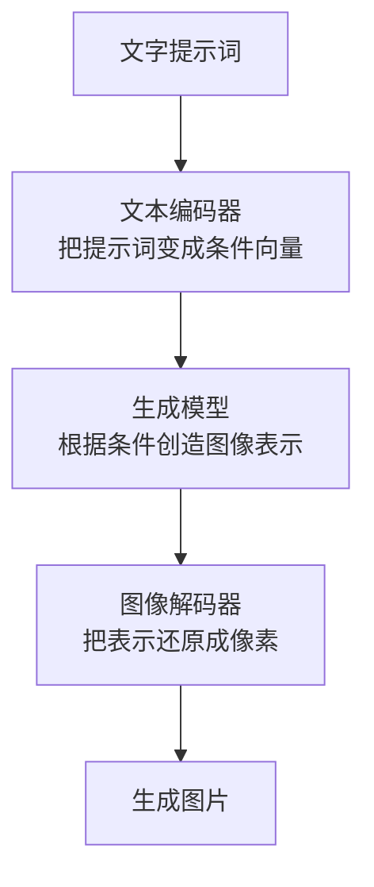

# 多模态原理

多模态模型就是能处理多种信息形式的模型。这里的“模态”可以理解成信息的类型，例如文本、图片、音频、视频、表格、网页和代码。

入门时可以先把多模态分成两件事：

1. **多模态理解**：模型看懂图片、听懂音频、读懂视频，再用文字回答或做判断。
2. **多模态生成**：模型根据文字、图片或其他条件，生成图片、音频、视频等内容。

本页只讲基本原理和流程，不展开具体模型结构、训练技巧和工程优化。

## 核心问题

文字、图片、声音和视频的形式完全不同：

```text
文字：token 序列
图片：像素网格
音频：随时间变化的波形
视频：连续图像 + 时间变化
```

模型要同时处理它们，核心办法是：

> 先把不同模态都变成向量，再让这些向量在模型里互相对齐。

可以粗略理解成：

```text
文字 -> 文本向量
图片 -> 图像向量
音频 -> 音频向量
视频 -> 视频向量
```

向量是模型能计算的数字表示。只要不同模态的向量能对齐，模型就可以把图片、音频、视频和文字放到同一个上下文里处理。

## 第一部分：多模态理解

多模态理解的目标是：**把非文字信息读懂，再转成模型可以推理和回答的上下文。**

常见例子：

- 看一张图片，回答“图里有几个人”。
- 听一段语音，转成文字并总结。
- 看一张截图，解释界面哪里出错。
- 看一段视频，回答发生了什么。

### 理解流程

以“给一张图，问模型图里有什么”为例：


这个流程里有三步最重要：

1. 图片先变成图像向量。
2. 图像向量被对齐到语言模型能理解的空间。
3. 语言模型把图像信息和文字问题一起当作上下文，生成回答。

### 图片怎么被理解

图片本身是很多像素。像素可以理解成颜色数字。

但语言模型不能直接理解一整张图片，所以通常要先用视觉编码器处理图片。视觉编码器的作用是：

> 把图片中的颜色、形状、边缘、物体和空间关系，压缩成一组向量。

例如一张猫的图片，视觉编码器可能提取出：

- 这里有一只动物。
- 有耳朵、眼睛、毛发。
- 形状和常见猫很接近。
- 背景可能是桌子或沙发。

这些不是人工写死的规则，而是模型从大量图片和文字对应关系中学到的表示。

### 对齐是什么意思

对齐可以理解成“让不同模态说同一种模型语言”。

图片编码器输出的是图像向量，语言模型习惯处理的是文本向量。如果直接塞进去，语言模型可能不知道这些图像向量代表什么。

所以中间通常需要一个对齐层：

```text
图像向量 -> 调整格式和含义 -> 语言模型能读的向量
```

直观上，对齐层像一个翻译器，把“图片侧的表示”翻译成“语言模型能接收的表示”。

### 为什么模型能回答图片问题

如果训练数据里有很多这样的样本：

```text
图片：一只猫坐在沙发上
问题：图里有什么？
答案：一只猫坐在沙发上。
```

模型会逐渐学到：

- 图片向量里的某些模式对应“猫”。
- 某些空间关系对应“坐在”。
- 用户问题是在要求描述图片。
- 回答应该用文字 token 生成。

所以推理时，模型看到新图片和新问题，也能尝试把视觉信息转成语言回答。

### 音频和视频怎么被理解

音频也可以先变成向量。模型会从声音里提取语音、节奏、停顿、音色等信息，再用于语音识别、声音理解或语音问答。

视频可以理解成很多帧图片加上时间顺序。视频理解比图片多一个关键点：时间。

视频模型需要同时看：

- 每一帧里有什么。
- 前后帧之间发生了什么变化。
- 哪些动作持续了一段时间。

所以多模态理解的本质是：

> 把不同输入模态编码成向量，并让语言模型能把这些向量当作上下文来读。

## 第二部分：多模态生成

多模态生成的目标是：**根据文字、图片、音频或其他条件，生成新的图片、音频、视频等内容。**

常见例子：

- 输入一段文字，生成一张图片。
- 输入一张图片和修改要求，生成编辑后的图片。
- 输入文字，生成一段语音。
- 输入文字或图片，生成一段视频。

### 生成流程

以“根据一句话生成图片”为例：



这个流程里最重要的是三件事：

1. 提示词先变成模型能理解的条件向量。
2. 生成模型根据条件创造出目标模态的内部表示。
3. 解码器把内部表示还原成人能看到或听到的内容。

### 文字怎么控制生成

提示词不是直接变成图片。它会先被编码成条件向量。

例如提示词是：

```text
一只白色小猫坐在蓝色沙发上
```

文本编码器会把它变成一组数字表示，里面包含一些约束：

- 主体是小猫。
- 颜色是白色。
- 动作是坐着。
- 场景里有蓝色沙发。

生成模型会根据这些条件，尝试生成符合描述的图片。

### 图片生成为什么可行

图像生成模型在训练时看过大量“图片 + 描述”的样本。它逐渐学到：

- “猫”通常有什么形状。
- “白色”对应什么视觉特征。
- “沙发”通常长什么样。
- 文字描述和图像内容之间如何对应。

推理时，模型不是从数据库里复制一张固定图片，而是根据学到的规律生成新的图像。

很多图像生成模型会从一团随机噪声或压缩表示开始，逐步把它变成符合提示词的图像。入门时不用掌握细节，只要记住：

> 生成模型会根据条件，一步步构造出目标模态的内容。

### 音频和视频生成

音频生成和图像生成类似，只是输出不是像素，而是声音。

例如文字转语音：

```text
文字 -> 语音条件 -> 声音表示 -> 音频波形
```

视频生成也类似，但更复杂，因为视频既要生成每一帧画面，又要让前后帧在时间上连贯。

视频生成需要同时满足：

- 每一帧看起来合理。
- 前后动作变化连贯。
- 人物、物体和场景不要频繁变形。
- 整段视频符合提示词描述。

## 理解和生成的区别

| 对比项 | 多模态理解 | 多模态生成 |
| --- | --- | --- |
| 主要方向 | 图片、音频、视频 -> 模型读懂 -> 文字回答或判断 | 文字或条件 -> 模型创造 -> 图片、音频、视频 |
| 关键问题 | 如何把输入模态变成模型能读的上下文 | 如何把条件变成新的目标模态内容 |
| 常见任务 | 图文问答、图片描述、OCR、语音识别、视频问答 | 文生图、图像编辑、文生音频、文生视频 |
| 输出 | 常常是文字 | 常常是图片、音频、视频，也可以是文字 |

一句话区分：

```text
多模态理解：把外部世界读进来。
多模态生成：把模型意图生成出去。
```

## 二者怎么结合

很多真实应用会同时用到理解和生成。

例如：

```text
用户上传一张房间照片
  -> 模型理解房间布局
  -> 用户要求“换成北欧风”
  -> 模型生成修改后的效果图
```

又比如：

```text
用户上传一段会议录音
  -> 模型理解语音内容
  -> 生成会议纪要
  -> 再生成语音播报
```

所以多模态不是单一功能，而是一组“理解输入”和“生成输出”的组合能力。

## 常见误解

### 多模态理解不是把图片直接塞进语言模型

通常需要先用视觉编码器把图片变成向量，再通过对齐层适配语言模型。

### 多模态生成不是简单拼贴素材

生成模型通常是在学习文字条件和目标内容之间的规律，然后根据条件生成新内容。

### 多模态不等于一定真正理解世界

模型能回答图片问题或生成图片，是因为它学到了视觉、声音、视频和语言之间的对应关系。它仍然可能看错、漏看、误解或生成不真实的内容。

## 读完应该能回答

- 什么是模态，什么是多模态。
- 多模态理解和多模态生成有什么区别。
- 图片、音频、视频为什么要先变成向量。
- 对齐层为什么必要。
- 文生图、文生音频、文生视频为什么理论上可行。
