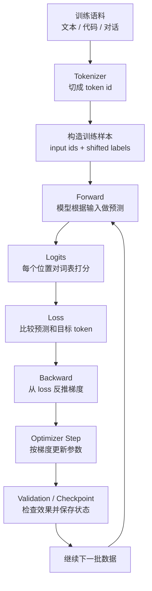

# 训练过程与原理

训练可以先理解成一句话：

> 模型先根据输入做预测，系统计算预测和正确答案的差距，再用这个差距反过来微调模型参数，重复很多次。

这句话里有四个关键点：

- 预测：模型先给出当前答案；
- 差距：loss 衡量模型错得多严重；
- 微调：梯度告诉参数应该往哪个方向改；
- 重复：单次调整很小，很多次以后才形成能力。

本页只讲训练的基本原理和流程。

不展开分布式训练、显存优化、并行策略、混合精度、checkpoint、调参技巧和工程框架。那些内容会放到 `训练系统与优化` 章节。

## 先抓住主线

对大语言模型来说，最常见的基础训练任务是：

> 给定前面的 token，预测下一个 token。

例如：

```text
输入：北京 是 中国 的
目标：首都
```

模型并不是直接“背答案”。

它会把输入变成向量，经过 Transformer 计算，输出词表里每个候选 token 的分数。训练系统再检查：正确 token 的分数够不够高。

如果正确 token 分数低，loss 就高。

loss 高说明当前参数还不合适。反向传播会计算这些参数应该怎样小幅移动，优化器再真正更新参数。

所以训练的最小循环是：

```text
样本 -> 预测 -> loss -> 梯度 -> 更新参数 -> 下一批样本
```

## 一张总图



这张图里最重要的是方向：

1. 数据先变成模型能处理的数字；
2. 模型用当前参数做一次预测；
3. loss 把“预测好不好”变成一个可优化的数字；
4. backward 把 loss 传回每个可训练参数；
5. optimizer 根据梯度更新参数；
6. 重复很多步，模型逐渐更适合训练数据里的规律。

## 训练到底在改变什么

训练改变的是模型参数。

参数可以理解成模型内部大量可调的数字，包括：

- embedding table 里的数字；
- Attention 里的 Q/K/V 和输出投影矩阵；
- MLP 里的线性层权重；
- LayerNorm 等模块的可训练参数；
- LM Head 里把 hidden state 映射到词表分数的权重。

刚初始化时，这些参数大多还没有学到有用规律。

训练过程中，系统会不断调整它们，让模型在训练样本上更容易预测正确 token。

注意：

> 训练不是把知识写进一个数据库，而是把大量统计规律压进一组参数。

参数不会直接保存“北京是中国首都”这样的句子条目。

更准确地说，模型通过大量上下文学习到词语、语法、事实、格式、推理模式和任务模式之间的关联。

## 训练样本从哪里来

语言模型训练通常从大量文本开始。

例如：

```text
北京是中国的首都。
```

经过 tokenizer 后，会变成 token 序列。

为了方便说明，先用空格分词的假想形式表示：

```text
北京 / 是 / 中国 / 的 / 首都 / 。
```

训练时，这一个序列可以产生多个“预测下一个 token”的任务：

| 看到的前文 | 要预测的下一个 token |
| --- | --- |
| 北京 | 是 |
| 北京 是 | 中国 |
| 北京 是 中国 | 的 |
| 北京 是 中国 的 | 首都 |
| 北京 是 中国 的 首都 | 。 |

真实训练不会真的把每个前缀单独跑一遍。

Transformer 可以在一次 forward 里同时对很多位置做预测。

对于一个 token 序列：

```text
北京 / 是 / 中国 / 的 / 首都 / 。
```

模型输入可以看成：

```text
北京 / 是 / 中国 / 的 / 首都
```

训练目标可以看成右移一位后的 labels：

```text
是 / 中国 / 的 / 首都 / 。
```

也就是说：

> 第 1 个位置预测第 2 个 token，第 2 个位置预测第 3 个 token，以此类推。

这就是 causal language modeling 里常见的 shifted labels。

## 为什么说“不需要人工标签”

很多监督学习任务需要人工标注。

例如图片分类需要有人告诉模型：

```text
这张图是猫。
```

语言模型的预训练有一个特殊之处：

> 文本本身就提供了目标答案，因为每个 token 后面的 token 就是要预测的 label。

例如原文是：

```text
机器学习需要大量数据。
```

当模型看到：

```text
机器 学习 需要 大量
```

下一个 token 在原始文本里就是：

```text
数据
```

这不代表训练完全没有数据成本。

相反，大规模训练仍然需要数据清洗、去重、过滤、混合比例、版权和安全治理。

这里只强调一个入门要点：

> 对 next-token prediction 来说，原始文本序列可以自动构造输入和目标。

## Batch、Step 和 Epoch

训练不会一次只看一个样本。

通常会把多个样本组成一个 batch，一起送进模型。

| 术语 | 可以怎么理解 |
| --- | --- |
| sample | 一个训练样本，例如一段文本或一个样本片段。 |
| token | 模型实际处理的基本单位。 |
| batch | 一次送进模型的一组样本。 |
| step | 做一次 forward、loss、backward、optimizer update。 |
| epoch | 通常指完整遍历训练集一遍。 |

大语言模型训练里，大家更常用 token 数来描述训练量。

原因是不同样本长度差别很大。

看了 1 万条短句和看了 1 万篇长文，训练量完全不同。

所以更常见的口径是：

```text
训练了多少 token
每秒处理多少 token
每个 optimizer step 有多少 token
```

## 第一步：前向计算

Forward 就是模型用当前参数做一次预测。

它和推理阶段的模型计算很像：

```text
token id
  -> embedding
  -> Transformer blocks
  -> hidden states
  -> LM Head
  -> logits
```

区别在于训练阶段还知道正确答案。

模型会对每个位置输出一个 logits 向量。

logits 可以理解成：

> 模型对词表里每个候选 token 的原始打分。

例如模型看到：

```text
北京 是 中国 的
```

它可能给出：

| 候选 token | 模型分数 |
| --- | ---: |
| 首都 | 8.2 |
| 城市 | 5.1 |
| 苹果 | -1.4 |

分数越高，模型越认为这个 token 可能接在后面。

这些分数通常会经过 softmax 变成概率分布。

入门时不需要记公式，只要理解：

> logits 是原始分数，概率是把这些分数归一化后的结果。

## 第二步：计算 loss

模型预测之后，需要知道它错得多严重。

这就是 loss 的作用。

对 next-token prediction 来说，常见 loss 是 cross entropy。

它的直觉很简单：

> 如果模型给正确 token 的概率高，loss 小；如果模型给正确 token 的概率低，loss 大。

例如正确答案是“首都”。

| 模型给“首都”的概率 | 直觉结果 |
| ---: | --- |
| 0.90 | 很有把握地猜对，loss 较小。 |
| 0.50 | 有些不确定，loss 中等。 |
| 0.01 | 几乎没猜到，loss 很大。 |

loss 不是只告诉模型“对”或“错”。

它更像一个连续的错误刻度。

这个刻度非常重要，因为训练需要知道：

- 哪些预测错得严重；
- 哪些预测已经不错；
- 参数更新后整体有没有变好；
- 训练是否不稳定或过拟合。

## 一个 batch 的 loss 怎么算

训练通常同时处理多个样本、多个 token 位置。

所以一个 batch 里会有很多个 token-level loss。

可以想象成：

```text
第 1 个样本第 1 个位置的 loss
第 1 个样本第 2 个位置的 loss
第 1 个样本第 3 个位置的 loss
...
第 N 个样本第 M 个位置的 loss
```

系统会把这些 loss 汇总成一个标量。

最常见的是求平均：

```text
batch loss = 所有有效 token loss 的平均值
```

为什么要变成一个标量？

因为 backward 需要从一个明确的训练目标出发。

这个标量越小，表示当前 batch 上的平均预测越好。

实际训练中还会遇到 padding、prompt 部分不计 loss、只训练 answer 部分等情况。

这些通常靠 loss mask 处理。

入门阶段只要先记住：

> loss 是把很多位置上的预测错误汇总成一个可反向传播的数字。

## 第三步：反向传播

有了 loss，还要回答一个更难的问题：

> 模型里有海量参数，loss 变大到底和哪些参数有关？这些参数应该往哪个方向改？

反向传播就是用来回答这个问题的。

它从 loss 出发，沿着 forward 的计算路径反向走一遍，计算每个可训练参数对 loss 的影响。

这个影响叫 gradient，中文通常叫梯度。

可以把梯度理解成：

> 如果稍微改变某个参数，loss 会怎样变化。

如果某个参数朝一个方向移动会让 loss 变小，优化器就倾向于朝那个方向更新。

如果朝一个方向移动会让 loss 变大，优化器就会避开那个方向。

## 为什么 backward 能成立

模型计算看起来很复杂，但它是由很多可微的小操作组成的。

例如：

- 矩阵乘法；
- 加法；
- softmax；
- LayerNorm；
- 激活函数；
- loss 计算。

这些操作在数学上可以计算“输入变化一点，输出会怎么变”。

Forward 时，这些小操作连接成一张计算图。

Backward 时，系统沿着这张计算图反向传播影响。

可以用一个很简化的链路理解：

```text
参数 -> hidden state -> logits -> probability -> loss
```

如果 loss 很高，backward 会反过来看：

```text
loss 对 probability 有什么要求
probability 对 logits 有什么要求
logits 对 hidden state 有什么要求
hidden state 对参数有什么要求
```

这背后的数学叫链式法则。

入门时不需要推导公式，只要知道：

> 只要 forward 是由可微操作连接起来的，系统就能把最终错误反向分摊到中间计算和参数上。

现代深度学习框架会自动记录计算图，并自动完成这件事。

例如 PyTorch 的 `autograd` 会根据 forward 中的张量操作计算 backward 所需的梯度。

## 梯度不是答案，而是方向

梯度不会告诉模型“正确回答是什么”。

它只告诉参数：

> 从当前这个位置出发，怎样小幅移动更可能降低 loss。

这很重要。

训练不是一步到位地找到完美参数。

深度模型的参数空间非常大，loss landscape 也非常复杂。

训练更像不断做局部修正：

1. 当前参数先试着预测；
2. loss 告诉它这次平均错得多严重；
3. 梯度告诉它局部改进方向；
4. 优化器沿这个方向走一小步；
5. 下一批数据再重复。

单步更新可能并不完美。

但大量数据和大量 step 叠加后，模型会逐渐形成更有用的表示。

## 第四步：优化器更新参数

Backward 只负责算梯度。

真正修改参数的是 optimizer。

最简单的直觉是：

```text
新参数 = 旧参数 - 学习率 * 梯度
```

这里的学习率可以理解成步子大小。

| 学习率情况 | 可能结果 |
| --- | --- |
| 太大 | 每次改动过猛，loss 可能震荡甚至发散。 |
| 太小 | 每次改动太慢，训练效率低。 |
| 合理 | 参数逐步往更低 loss 的方向移动。 |

实际大模型训练常用 AdamW、Muon 等优化器，而不是最简单的 SGD。

但入门时先抓住共同点：

> 优化器根据梯度和自己的更新规则，把参数改一点点。

一次 optimizer step 后，模型参数变了。

下一次 forward 时，同样的输入可能会得到稍微不同的 logits。

如果更新方向整体有效，正确 token 的概率会逐渐变高，loss 会逐渐下降。

## 为什么每步更新前要清空梯度

在很多框架里，梯度默认会累加。

这在 gradient accumulation 中有用，但普通训练 step 里，如果不清空旧梯度，新梯度会和旧梯度混在一起。

所以典型训练循环会有这几个动作：

```text
forward
loss
backward
optimizer step
zero gradients
```

也有人把 `zero_grad` 放在 step 开始前。

重点不是位置，而是语义：

> 每次 optimizer update 应该清楚自己使用的是哪些样本贡献的梯度。

## 一个最小训练循环

用伪代码表示，大致是：

```python
for batch in dataloader:
    logits = model(batch.input_ids)
    loss = cross_entropy(logits, batch.labels)
    loss.backward()
    optimizer.step()
    optimizer.zero_grad()
```

这段伪代码背后对应的自然语言是：

1. 从数据集中拿一批样本；
2. 模型用当前参数做预测；
3. 把预测和目标 token 比较，得到 loss；
4. 从 loss 反向计算每个参数的梯度；
5. 优化器用梯度更新参数；
6. 清理梯度，准备下一步。

真实训练系统会复杂得多。

但再复杂的训练系统，也绕不开这条主线。

## 训练为什么理论上可行

训练之所以可行，至少需要五个条件。

第一，模型输出由参数决定。

如果参数完全不影响输出，训练就无从谈起。

第二，训练样本能构造目标。

对语言模型来说，前文预测后文提供了天然训练信号。

第三，loss 能把预测质量变成数字。

没有 loss，就无法判断参数变好还是变差。

第四，计算过程大多可微。

可微意味着可以用 backward 计算参数对 loss 的影响。

第五，优化器可以小步迭代。

每一步只做局部改进，但大量 step 之后，模型会逐渐降低训练目标上的错误。

可以把这五点串起来：

```text
参数影响预测
预测能和目标比较
比较结果形成 loss
loss 能反推出梯度
梯度能推动参数更新
```

这就是深度学习训练的基本闭环。

## 训练学到的是“规律”，不是保证正确

训练让模型更擅长预测训练分布中的模式。

这会带来能力：

- 学会语言结构；
- 学会问答格式；
- 学会代码模式；
- 学会一些事实关联；
- 学会常见推理步骤的表面形式；
- 学会不同任务的输入输出风格。

但这不等于模型一定“真正理解”或“一定正确”。

原因包括：

- 训练数据可能有错误；
- 数据覆盖不到所有场景；
- 模型可能学习到相关性，而不是因果；
- next-token prediction 的目标不等同于真实世界验证；
- 推理时的问题可能超出训练分布。

所以训练可以产生强能力，但不能自动保证可靠性。

后续还需要评估、对齐、检索、工具调用、约束解码、监控和人工验证等系统手段。

## 为什么需要很多数据

单个样本只能提供很少信息。

如果模型只看：

```text
北京 是 中国 的 首都
```

它可能只学到这一个局部模式。

但语言和知识远比这复杂。

模型需要在大量上下文中看到：

- 一个词在不同语境里的用法；
- 同一种事实的多种表达；
- 问答、代码、数学、表格、对话等格式；
- 长距离依赖；
- 稀有词和专有名词；
- 正确表达和低质量表达之间的差异。

数据越丰富，模型越有机会学到更通用的表示。

但数据不是越多越好。

低质量、重复、污染或有偏数据也会被模型学习。

所以训练质量取决于：

```text
模型结构 + 数据质量 + 数据规模 + 训练目标 + 优化过程 + 评估反馈
```

## 为什么需要很多 step

每个 optimizer step 只看一个 batch。

一个 batch 只是训练数据的一小部分。

如果每次都用全量数据来算精确梯度，计算成本会非常高。

所以深度学习通常用 mini-batch 估计梯度：

```text
用一小批样本估计整体改进方向
```

这个估计有噪声，但成本更低。

多次 step 后，来自不同 batch 的训练信号会逐渐累积。

可以这样理解：

> 单个 batch 给模型一个局部反馈，很多 batch 合在一起让模型看到更完整的数据分布。

这也是为什么训练日志通常不是看单个 step 的 loss，而是看一段时间内的趋势。

## 训练集、验证集和测试集

只看训练 loss 不够。

模型可能把训练数据记住了，但对新数据表现不好。

这叫过拟合。

所以通常会把数据分成几类：

| 数据 | 用途 | 是否更新参数 |
| --- | --- | --- |
| 训练集 | 用来计算 loss 和梯度 | 是 |
| 验证集 | 训练过程中检查泛化和选择 checkpoint | 否 |
| 测试集 | 最后评估模型效果 | 否 |

验证集的意义是：

> 用模型没直接训练过的数据，检查它是否真的学到更一般的规律。

如果训练 loss 下降，但验证 loss 上升，就要警惕模型过拟合、数据泄漏或训练配置问题。

## Pretraining、Finetuning 和 Post-training

训练不是只有一种。

可以粗略分成三层。

| 阶段 | 目的 | 简化理解 |
| --- | --- | --- |
| Pretraining | 建立基础语言和世界知识能力 | 在海量数据上预测下一个 token。 |
| Finetuning | 让模型适配具体任务或格式 | 用更小、更有针对性的数据继续训练。 |
| Post-training | 改善指令跟随、偏好和安全性 | 用 SFT、偏好数据、RL 等方法调整行为。 |

这三者都可以看成训练。

它们共享基本闭环：

```text
forward -> loss -> backward -> optimizer step
```

差别主要在：

- 数据来源不同；
- loss 设计不同；
- 哪些参数参与训练不同；
- 评估目标不同；
- 训练成本和风险不同。

本页讲的是最基础的训练原理，后续章节会再展开 SFT、DPO、RLHF、GRPO、LoRA、QLoRA 等后训练和微调工作负载。

## 训练和推理的区别

训练和推理都会跑模型 forward。

但目标完全不同。

| 对比项 | 训练 | 推理 |
| --- | --- | --- |
| 参数 | 会更新 | 固定不变 |
| 是否有 labels | 有，用来算 loss | 通常没有 |
| 是否 backward | 有 | 没有 |
| 是否 optimizer step | 有 | 没有 |
| 主要目标 | 降低训练目标上的错误 | 给用户生成输出 |
| 成本来源 | forward + backward + optimizer + 数据 | prefill + decode + KV Cache + 调度 |

可以记成：

```text
训练：为了改变模型参数
推理：为了使用已有参数
```

训练时要保存更多中间结果，因为 backward 需要它们计算梯度。

推理时通常不需要保存这些训练用中间状态，所以同一个模型在推理和训练阶段的显存、吞吐和系统瓶颈会很不一样。

## Checkpoint 是什么

训练会持续很久。

中间需要定期保存状态。

这个保存下来的状态叫 checkpoint。

入门时可以先把 checkpoint 理解成：

> 某个训练时刻的模型快照。

最基本的 checkpoint 至少包含模型参数。

更完整的训练 checkpoint 还会包含：

- optimizer state；
- scheduler state；
- 当前 step；
- 随机数状态；
- 数据读取位置；
- 训练配置和代码版本。

为什么不仅保存模型参数？

因为如果训练中断后想无缝继续，只保存参数通常不够。

不过本页只需要先记住：

> 训练的最终产物是一组参数；训练过程中的可恢复产物是 checkpoint。

## 训练完成后得到什么

训练完成后，最重要的产物是模型权重。

这些权重会被保存成模型文件。

推理服务加载它们后，就可以用固定参数回答用户输入。

因此可以把生命周期简化成：

```text
训练数据
  -> 训练过程
  -> 模型权重
  -> 推理服务
  -> 用户输出
```

训练阶段越昂贵，越需要认真记录：

- 用了哪些数据；
- 用了哪个 tokenizer；
- 用了哪个模型结构；
- 训练了多少 token；
- loss 和 eval 指标怎么变化；
- 最终选择了哪个 checkpoint；
- 训练是否可复现。

这些会在后续 `训练系统与优化` 和 `知识组织、模板与 AI 可读索引` 中继续展开。

## 常见误解

### 误解一：loss 越低，模型一定越好

不一定。

训练 loss 低，可能只是模型更适合训练数据。

真正要看模型是否在未见过的数据和目标任务上变好。

所以需要 validation、test、benchmark 和实际任务评估。

### 误解二：训练就是让模型记住所有数据

不是。

模型确实可能记忆部分内容，尤其是重复或罕见样本。

但训练的主要目标是学到能泛化的模式。

如果只会记忆，遇到新问题就很难表现好。

### 误解三：梯度告诉模型正确答案

不是。

梯度只告诉参数局部应该往哪个方向移动。

正确答案来自训练样本的 labels。

### 误解四：一次训练 step 应该让模型明显变聪明

不会。

单步更新通常非常小，甚至可能因为 batch 噪声让局部 loss 波动。

模型能力来自大量 step 的累积。

### 误解五：训练和推理只是同一件事的两个名字

不是。

训练会算 loss、backward 并更新参数。

推理使用固定参数生成输出。

两者的目标、资源、指标和系统优化方式都不同。

## 最小检查清单

读完本页，应该能用自己的话回答：

- 为什么语言模型训练可以理解成 next-token prediction；
- 为什么原始文本可以自动构造 labels；
- forward 阶段输出的 logits 是什么；
- loss 为什么能衡量预测错得多严重；
- backward 为什么能把错误反向传到参数；
- gradient 为什么只是局部更新方向；
- optimizer 为什么每次只小步修改参数；
- batch、step、epoch、token 这些词有什么区别；
- validation 为什么不参与参数更新；
- 训练和推理最大的区别是什么。

## 参考资料

- [Hugging Face Transformers: Causal language modeling](https://huggingface.co/docs/transformers/tasks/language_modeling)
- [Hugging Face LLM Course: How do Transformers work?](https://huggingface.co/learn/llm-course/chapter1/4)
- [PyTorch Tutorials: Automatic Differentiation with torch.autograd](https://docs.pytorch.org/tutorials/beginner/basics/autogradqs_tutorial.html)
- [PyTorch Tutorials: Optimizing Model Parameters](https://docs.pytorch.org/tutorials/beginner/basics/optimization_tutorial.html)
- [CS231n: Optimization](https://cs231n.github.io/optimization-1/)
- [Deep Learning Book: Optimization for Training Deep Models](https://www.deeplearningbook.org/contents/optimization.html)
