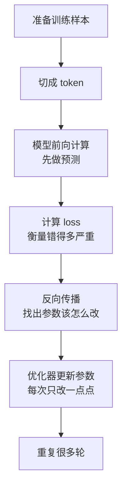

# 训练过程与原理

训练就是让模型从大量例子中学规律。可以先把它理解成：

> 模型先猜答案，系统计算它错得多离谱，再根据错误调整参数，重复很多次。

本页只讲基本原理和流程，不展开分布式训练、显存优化和工程细节。

## 训练要解决什么问题

刚初始化的模型参数几乎是乱的，所以它一开始很容易胡乱预测。

训练的目标是让模型在大量样本上逐渐学会：

- 看到前文，预测合理的后文。
- 看到问题，生成像回答的内容。
- 看到代码上下文，补出更可能的代码。
- 看到一段材料，学会总结、改写或翻译的语言模式。

对大语言模型来说，最基本的训练任务通常是：

> 给定前面的 token，预测下一个 token。

## 单步训练流程



下面逐步解释。

## 第一步：准备训练样本

训练样本可以先理解成很多段文本。模型会从这些文本里学习语言规律。

例如一句话：

```text
北京是中国的首都。
```

训练时可以把它变成“根据前文预测后文”的任务：

```text
看到：北京 是 中国 的
应该预测：首都
```

真实训练会同时处理大量 token，但入门时先理解这个小例子就够了。

## 第二步：模型先做预测

模型拿到输入后，会给所有可能的下一个 token 打分。

例如它可能猜：

```text
首都：0.70
城市：0.20
苹果：0.01
```

如果正确答案是“首都”，这个预测就还不错。如果模型把“苹果”概率给得很高，就说明它错得比较离谱。

## 第三步：用 loss 衡量错误

loss 可以理解成“错误程度”。

```text
正确答案概率高 -> loss 小
正确答案概率低 -> loss 大
```

训练不是只知道“对”或“错”，而是要知道错得有多严重。这样系统才知道是否需要大幅调整。

## 第四步：反向传播找到调整方向

模型里有很多参数。问题是：预测错了以后，到底该改哪些参数？

反向传播就是用来回答这个问题的。它会从 loss 出发，沿着模型计算过程往回看，估计每个参数对错误的影响。

可以用一个直觉理解：

> 如果某些参数让正确答案分数变低了，就应该把它们往相反方向调一点；如果某些参数让正确答案分数变高了，就应该保留或加强这种趋势。

这个“该往哪个方向调”的信息叫梯度。

不需要先掌握微积分，只要知道：

> 梯度告诉模型参数应该朝哪个方向小幅移动，才更可能让下一次 loss 变小。

## 第五步：优化器更新参数

有了梯度，还需要优化器真正修改参数。

优化器不会一次把参数改得特别大，因为改太大可能越改越差。它通常每次只走一小步：

```text
旧参数 -> 按梯度方向小幅调整 -> 新参数
```

然后模型再看下一批样本，再预测、再算 loss、再调整。这个过程会重复非常多次。

## 为什么训练理论上可行

训练之所以可行，核心原因是：

1. 模型的输出由参数决定。
2. loss 能衡量当前输出和正确答案的差距。
3. 反向传播能估计每个参数应该往哪个方向改。
4. 小步多次调整后，模型会逐渐更适合训练数据里的规律。

这不意味着模型真的“像人一样理解世界”。更准确地说，它是在大量数据中学到能帮助预测的统计规律和表示方式。

## 为什么需要很多数据和很多轮

单个样本只能告诉模型很少的信息。模型如果只记住少量样本，就容易变成死记硬背。

大量数据的作用是让模型看到足够多的语言场景：

- 同一个词在不同上下文里的用法。
- 问答、翻译、代码、数学等不同格式。
- 长句、短句、正式语气、口语表达。

很多轮训练的作用是让参数逐步稳定下来。每一步只改一点点，长期累积后才形成有用能力。

## 验证集是什么

训练时不能只看模型在训练样本上表现好不好。因为模型可能只是记住了训练数据，而不是学到一般规律。

所以通常会留出一部分数据作为验证集。模型不直接用验证集更新参数，只用它检查：

- 模型是否真的在变好。
- 是否开始过度记忆训练数据。
- 训练是否出现异常。

## 训练完成后得到什么

训练结束后，最重要的产物是一组模型参数。

推理阶段会加载这些参数，并保持它们固定。也就是说：

```text
训练：不断修改参数
推理：使用固定参数
```

## 读完应该能回答

- 训练为什么可以理解成“先猜、算错、再调整”。
- loss 为什么能表示模型错得多严重。
- 反向传播为什么用于找到参数调整方向。
- 优化器为什么每次只小步更新。
- 为什么训练需要大量数据和反复迭代。
