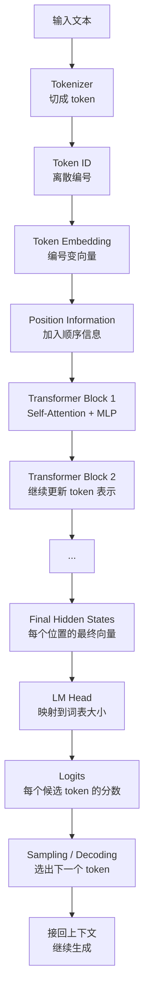

# Transformer 流程与原理

Transformer 是当前大语言模型最常见的核心结构。

入门时可以先把它理解成一句话：

> Transformer 是一种让每个 token 读取上下文、更新自己的数字表示，并最终预测下一个 token 的模型结构。

这句话里有三个关键词：

- token：模型处理的文字小块；
- 上下文：这个 token 前后出现过什么；
- 表示：模型内部用向量保存的“当前理解”。

本页只讲流程和直觉。

不展开复杂公式，不讲 FlashAttention、KV Cache、并行训练、量化或 kernel 优化。

那些内容会放到后续推理系统、训练系统和 Kernel 章节。

## 先抓住主线

大语言模型里的 Transformer 可以先理解成下面这条链路：

```text
文字
  -> token
  -> token id
  -> embedding 向量
  -> 加上位置信息
  -> 多层 Transformer Block
  -> 每个位置得到新的向量
  -> 映射成 logits
  -> 选择下一个 token
```

这条链路有一个核心目标：

> 让模型在看到前文后，能判断下一个 token 更可能是什么。

例如：

```text
北京 是 中国 的
```

模型最终希望给“首都”更高分，而不是给“苹果”更高分。

Transformer 不是凭空知道答案。

它通过大量训练样本学到：在什么上下文里，哪些 token 更可能接在后面。

## 一张总图

下面这张图只画大语言模型常见的 decoder-only 流程。



从系统视角看，这张图说明了几个事实：

- 输入 token 越多，Transformer 要处理的序列越长；
- block 层数越多，计算越多；
- hidden size 越大，每个 token 的向量越长；
- 词表越大，最后输出 logits 的维度越大；
- 生成越长，推理循环次数越多。

所以 Transformer 不只是模型结构，也是 AI 系统成本的来源。

## 为什么需要 Transformer

一句话里的每个词，含义常常取决于上下文。

例如：

```text
苹果发布了新产品。
我吃了一个苹果。
```

同样是“苹果”，第一句更可能指公司，第二句更可能指水果。

如果模型只看单个词，就很难判断真正含义。

它必须看上下文。

再看一个例子：

```text
这只猫跳上桌子，因为它很饿。
```

当模型处理“它”时，需要知道“它”更可能指“猫”，不是“桌子”。

人读这句话时，会自然利用上下文。

Transformer 的关键能力就是让模型也能做一件类似的事：

> 对每个 token，查看其他 token，并判断哪些上下文更重要。

这个机制叫 attention。

如果是 token 自己和同一句话里的其他 token 互相看，就叫 self-attention。

## 第一步：文本变成 token

模型不能直接处理文字。

它只能处理数字。

所以第一步是 tokenization。

```text
原文：我喜欢 AI
token：我 / 喜欢 / AI
token id：128 / 5632 / 9021
```

token id 是离散编号。

它只告诉模型“这是词表里的第几个 token”，还没有表达含义。

这一点很重要：

> Transformer 的输入不是自然语言本身，而是 token id 序列。

## 第二步：token id 变成 embedding

token id 只是编号，不能直接表达语义关系。

所以模型会查一张 embedding table，把每个 token id 变成向量。

```text
9021 -> [0.12, -0.07, 0.33, ...]
```

可以把 embedding 理解成 token 的“数字化表示”。

训练之后，模型会让这些向量逐渐有用。

例如：

- 语义相近的词，向量关系可能更接近；
- 用法相似的 token，向量可能学到相似模式；
- 代码里的关键字、括号、缩进，也会形成某些规律。

这里不用把 embedding 想成固定词典释义。

它只是模型计算的起点。

后面每经过一层 Transformer block，这个 token 的向量都会被更新。

## 第三步：加入位置信息

如果只看一堆 token 向量，模型不知道顺序。

但顺序非常重要。

```text
我 喜欢 AI
AI 喜欢 我
```

这两个句子 token 相同，但顺序不同，含义完全不同。

所以 Transformer 需要位置信息。

位置信息告诉模型：

- 这个 token 在第几个位置；
- 两个 token 相隔多远；
- 当前 token 前面有哪些 token；
- 在 decoder-only 模型里，当前 token 不能偷看未来 token。

早期 Transformer 使用 positional encoding。

现代大语言模型还可能使用 RoPE、ALiBi 或其他位置编码方式。

入门时不需要掌握这些细节，只要记住：

> token embedding 只表示“是什么”，position information 让模型知道“在哪里”。

## 第四步：Self-Attention 读取上下文

Self-attention 是 Transformer 最核心的步骤。

它回答一个问题：

> 当我更新某个 token 的表示时，应该参考上下文里的哪些 token？

例如：

```text
这只猫跳上桌子，因为它很饿。
```

当处理“它”时，模型可能更关注“猫”。

当处理“饿”时，模型也可能更关注“猫”。

当处理“桌子”时，模型可能更关注“跳上”。

注意：这些关注关系不是人手写规则。

模型是在训练中学会哪些上下文关系有助于预测。

## Attention 的三步直觉

可以把 attention 理解成三步：

1. 当前位置提出一个问题；
2. 上下文每个位置给出一个匹配线索；
3. 当前位置按匹配程度读取上下文信息。

例如当前位置是“它”：

```text
当前位置：它
问题：我指的是谁？
上下文候选：这只猫 / 跳上 / 桌子 / 因为 / 它
更相关的信息：这只猫
```

模型实际做的不是中文问答，而是向量计算。

但这个直觉有助于理解：

> attention 不是把所有上下文平均混在一起，而是学会按重要程度读取。

## Q、K、V 是什么

很多教程会说 attention 里有 Q、K、V。

先不要把它们当公式背。

可以这样理解：

| 名字 | 全称 | 直觉 |
| --- | --- | --- |
| Q | Query | 当前位置想找什么信息 |
| K | Key | 每个上下文位置提供什么匹配线索 |
| V | Value | 如果某个位置被关注，真正读走的内容 |

每个 token 的向量会通过三组不同的线性变换，得到 Q、K、V。

同一个 token 会同时产生三种角色：

- 作为 Query：我现在需要什么；
- 作为 Key：别人如果看我，我有什么可匹配线索；
- 作为 Value：别人关注我时，可以从我这里拿走什么信息。

用“它”的例子理解：

```text
Query: 我这个“它”想找指代对象
Key: “猫”这个位置像一个可能被指代的对象
Value: “猫”这个位置携带的上下文信息
```

模型会比较 Query 和所有 Key，得到一组 attention weights。

然后用这些 weights 对 Value 加权求和，得到新的上下文信息。

## 如果看到公式，应该怎么理解

很多资料会写：

```text
Attention(Q, K, V) = softmax(QK^T / sqrt(d_k)) V
```

入门时不需要推导。

只要把它拆成三句话：

1. `QK^T`：计算当前位置和其他位置的匹配程度；
2. `softmax`：把匹配分数变成权重；
3. `乘以 V`：按权重读取真正的信息。

所以公式背后的直觉仍然是：

```text
先判断该看谁，再按比例读取信息。
```

## Causal Mask：为什么不能偷看未来

大语言模型生成文本时，通常是根据前文预测下一个 token。

生成第 5 个 token 时，模型不能看到第 6 个 token 的答案。

训练时虽然整段文本都在数据里，但模型仍要遵守这个规则。

这就需要 causal mask。

它让每个位置只能看自己和前面的 token，不能看后面的 token。

例如序列：

```text
北京 / 是 / 中国 / 的 / 首都
```

预测“首都”时可以看前面：

```text
北京 / 是 / 中国 / 的
```

但预测“中国”时不能提前看到：

```text
的 / 首都
```

可以粗略理解成：

```text
位置 1 只能看 1
位置 2 可以看 1, 2
位置 3 可以看 1, 2, 3
位置 4 可以看 1, 2, 3, 4
```

这个机制让训练任务和推理过程保持一致。

## Multi-Head Attention：多个观察角度

一个 attention head 可以从一种角度看上下文。

Multi-head attention 就是让模型同时用多个角度看。

例如同一句话里：

- 一个 head 可能关注前后相邻 token；
- 一个 head 可能关注代词指向；
- 一个 head 可能关注标点和段落结构；
- 一个 head 可能关注代码里的括号或缩进；
- 一个 head 可能关注长距离依赖。

这只是帮助理解的说法。

真实模型里每个 head 学到什么，不一定能被人清楚命名。

但多头机制的作用可以这样理解：

> 不同 head 并行提取不同上下文关系，再把这些信息合并起来。

## MLP 在做什么

Attention 负责让 token 之间交换信息。

MLP 负责对每个 token 自己的表示做进一步变换。

可以粗略理解成：

```text
Attention：这个 token 应该从上下文读取什么？
MLP：读完上下文后，这个 token 的表示应该怎么加工？
```

注意，MLP 不会像 attention 那样跨 token 看上下文。

它通常对每个位置独立工作。

也就是说：

- attention 负责“横向交流”；
- MLP 负责“本地加工”。

两者合起来，Transformer block 才能既理解上下文关系，又更新每个 token 的内部表示。

## 残差连接和归一化为什么需要

Transformer 会堆很多层。

如果每一层都直接大幅改写信息，模型可能训练不稳定，也可能丢掉原始信息。

残差连接可以理解成：

```text
新表示 = 原表示 + 本层学到的新信息
```

它给模型一条“保留旧信息”的通道。

归一化可以理解成：把每层的数字范围整理得更稳定，避免中间值忽大忽小。

不同模型可能使用不同的 LayerNorm 放置方式，例如 Pre-LN 或 Post-LN。

入门时不用区分这些细节。

只要知道：

> 残差连接和归一化是为了让深层 Transformer 更稳定、更容易训练。

## 一个 Transformer Block 做什么

一个常见的 decoder-only Transformer block 可以理解成：

```text
输入 token 表示
  -> 归一化
  -> Self-Attention 读取上下文
  -> 残差连接，加回原信息
  -> 归一化
  -> MLP 加工每个位置
  -> 残差连接，加回原信息
  -> 输出更新后的 token 表示
```

也可以压缩成一句话：

> Attention 负责读上下文，MLP 负责加工表示，残差和归一化负责稳定传递。

模型会把这个 block 重复很多层。

越往后，每个 token 的表示融合了越多上下文信息。

## 每一层到底在更新什么

初始 embedding 只是 token 的起点表示。

经过第一层后，它会带上一些局部上下文信息。

经过更多层后，它可能逐渐融合：

- 这个 token 附近的词；
- 句子结构；
- 代词关系；
- 格式和段落；
- 代码结构；
- 问题意图；
- 已经生成的回答风格。

这不是说每一层都有明确的人类语义标签。

更准确地说：

> 每层都在把 token 的向量改得更适合当前预测任务。

## 最后如何得到 logits

经过多层 Transformer 后，模型会得到每个位置的最终向量。

对语言模型来说，最后要预测下一个 token。

所以还需要一步：

```text
最终向量 -> LM Head -> logits
```

LM Head 可以理解成一个把 hidden vector 映射到词表大小的线性层。

如果词表有 100,000 个 token，logits 就有 100,000 个分数。

每个分数对应一个候选 token。

例如：

```text
前文：北京 是 中国 的
候选 token 分数：
首都：高
城市：中
苹果：低
```

推理阶段再根据 logits 选择下一个 token。

训练阶段则会把 logits 和正确答案比较，计算 loss。

## 训练时 Transformer 在做什么

训练时，模型看到训练文本，并学习预测下一个 token。

例如训练样本：

```text
北京 是 中国 的 首都
```

可以拆成多个预测任务：

| 输入上下文 | 正确下一个 token |
| --- | --- |
| 北京 | 是 |
| 北京 是 | 中国 |
| 北京 是 中国 | 的 |
| 北京 是 中国 的 | 首都 |

Transformer 前向计算得到 logits。

系统用 logits 和正确答案计算 loss。

然后通过反向传播更新参数。

这就是后面训练章节会讲的：

```text
forward -> loss -> backward -> optimizer step
```

在本页只需要记住：

> Transformer 给出预测，训练过程根据预测错误来调整 Transformer 的参数。

## 推理时 Transformer 在做什么

推理时，参数已经固定。

模型会根据 prompt 逐 token 生成。

例如：

```text
Prompt: Transformer 是一种
```

模型可能先生成：

```text
模型
```

新上下文变成：

```text
Transformer 是一种 模型
```

然后继续生成下一个 token。

这就是自回归生成。

推理时最重要的特点是：

> 每生成一个新 token，都要基于已有上下文再运行一次后续计算。

后续推理系统章节会讲 KV Cache。

现在可以先把它理解成：

> 推理时缓存历史 token 的一部分 attention 中间结果，避免每一步都完全从头计算历史上下文。

## Encoder、Decoder 和 Decoder-only

原始 Transformer 是 encoder-decoder 架构，最早主要用于机器翻译。

现在常见模型大致可以分成三类。

| 架构 | 代表直觉 | 常见用途 |
| --- | --- | --- |
| Encoder-only | 读完整输入，生成输入的表示 | 分类、检索、理解 |
| Decoder-only | 根据前文逐 token 生成 | 大语言模型、聊天、代码生成 |
| Encoder-decoder | encoder 读输入，decoder 生成输出 | 翻译、摘要、文本到文本任务 |

本页主要讲 decoder-only，因为现代聊天模型和文本生成模型常用这种方式。

但 attention、embedding、position、block、logits 这些概念，对理解其他架构也有帮助。

## 为什么 Transformer 适合大规模训练

Transformer 相比早期循环神经网络，一个重要优势是并行性更好。

循环模型通常要按时间步一个接一个处理。

Transformer 在训练时可以同时处理一个序列里的多个位置，然后用 mask 控制哪些位置能看哪些位置。

这让它更适合 GPU、TPU、NPU 这类擅长大规模矩阵计算的硬件。

入门时可以这样理解：

> Transformer 把很多语言问题变成大规模矩阵乘法和向量运算，因此能很好利用现代加速器。

这也是它能成为 AI Infra 核心 workload 的原因。

## Transformer 的系统成本来自哪里

虽然本页不讲优化，但需要提前知道 Transformer 为什么会昂贵。

| 成本来源 | 直觉 |
| --- | --- |
| 参数量 | 参数越多，模型文件、显存和加载成本越大。 |
| 层数 | block 越多，前向计算越多。 |
| hidden size | 向量越长，矩阵计算越大。 |
| attention | token 之间互相看，长上下文时成本上升明显。 |
| MLP | 通常占用大量计算，也是模型参数的重要部分。 |
| 词表输出 | 最后要给很多候选 token 打分。 |
| 生成长度 | 推理时每生成一个 token 都要循环一次。 |
| batch 和并发 | 会影响吞吐、延迟、显存和调度。 |

这些成本会在后续章节展开：

- 推理系统会讲 Prefill、Decode、KV Cache、Batching；
- 训练系统会讲 Forward、Backward、Activation、并行策略；
- Kernel 章节会讲 Attention 计算模式和优化；
- Benchmark 章节会讲如何测这些成本。

## 一个小例子：模型如何处理一句话

假设输入是：

```text
猫 坐在 垫子 上
```

流程可以这样理解：

1. tokenizer 把文本切成 token；
2. 每个 token 变成 token id；
3. embedding table 把 id 变成向量；
4. 加入位置，让模型知道顺序；
5. 第一层 attention 让 token 看上下文；
6. “上”可能关注“垫子”，“猫”可能关注“坐在”；
7. MLP 加工每个 token 的表示；
8. 重复很多层；
9. 最后一个位置的向量被映射成 logits；
10. 模型给“。”、“睡觉”、“看着”等候选 token 打分；
11. 推理系统选择一个 token 接回上下文。

真实模型当然复杂得多。

但主线没有变：

```text
token 表示不断被上下文更新，最后用于预测下一个 token。
```

## 常见误解

### 误解一：Transformer 直接理解文字

Transformer 处理的是 token id、向量和 tensor。

所谓“理解”，是训练后在任务上表现出来的能力。

### 误解二：Attention 就是解释模型为什么这样回答

Attention 权重可以帮助观察模型关注了哪里，但不能简单等同于完整解释。

模型输出还受 MLP、层间组合、训练数据、采样策略等影响。

### 误解三：Q、K、V 是人写好的语言规则

Q、K、V 是从参数中计算出来的向量。

它们不是人工写死的语法规则，而是训练过程中学出来的变换。

### 误解四：Transformer 只有 Attention

完整 block 里还有 MLP、残差连接、归一化、位置机制等。

Attention 很重要，但不是全部。

### 误解五：更长上下文只是多放点文字

更长上下文会增加 attention 计算、KV Cache、显存和调度压力。

它既是模型能力问题，也是系统成本问题。

### 误解六：训练和推理里的 Transformer 完全一样

参数结构相同，但系统行为不同。

训练需要 loss、反向传播、梯度和优化器。

推理通常固定参数，逐 token 生成，并关注延迟、吞吐和缓存。

## 最小检查清单

读完本页后，应该能用自己的话回答：

- Transformer 为什么需要上下文？
- token id 为什么要先变成 embedding？
- 位置信息为什么必要？
- self-attention 在解决什么问题？
- Q、K、V 分别可以怎么理解？
- attention weights 为什么能表示“更该看谁”？
- causal mask 为什么防止模型偷看未来？
- multi-head attention 为什么像多个观察角度？
- MLP 和 attention 分别负责什么？
- 一个 Transformer block 大概由哪些步骤组成？
- logits 如何变成下一个 token 的候选分数？
- 训练和推理中 Transformer 的角色有什么不同？
- Transformer 的主要系统成本来自哪里？

## 参考资料

- [Attention Is All You Need](https://arxiv.org/abs/1706.03762)
- [Hugging Face LLM Course: How do Transformers work?](https://huggingface.co/learn/llm-course/chapter1/4)
- [The Illustrated Transformer](https://jalammar.github.io/illustrated-transformer/)
