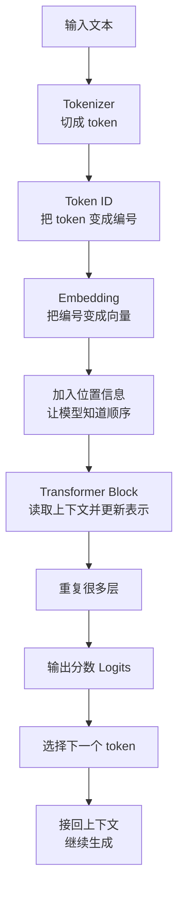

# Transformer 流程与原理

Transformer 是当前大语言模型最常见的核心结构。入门时可以先把它理解成：

> 一种让每个 token 读取上下文、更新自己表示、最后预测下一个 token 的方法。

本页只讲大概流程和为什么可行，不展开复杂公式和工程优化。

## 为什么需要 Transformer

一句话里的每个词，含义常常取决于上下文。

例如：

```text
苹果发布了新产品。
我吃了一个苹果。
```

同样是“苹果”，第一句更可能指公司，第二句更可能指水果。模型如果只看单个词，很难判断真正含义；它必须看上下文。

Transformer 的关键能力就是：

> 让当前位置的 token 能够查看其他位置的 token，并决定哪些上下文更重要。

这个“查看上下文”的机制叫 Attention。

## 总体流程

以大语言模型生成为例，Transformer 的主流程如下：



下面按步骤解释。

## 第一步：文本变成 token

模型不能直接处理文字，所以先把文本切成 token，再把 token 变成数字编号。

```text
我喜欢 AI -> 我 / 喜欢 / AI -> 128 / 5632 / 9021
```

这一步的意义是：把人类文字变成模型可以处理的离散编号。

## 第二步：token 变成向量

编号本身没有语义，所以模型会把每个 token id 转成向量，这叫 embedding。

```text
token id -> embedding vector
```

可以把向量理解成 token 的“数字化含义”。训练之后，模型会学到哪些 token 在语义和用法上更接近。

## 第三步：加入位置信息

Transformer 看到的是一组向量。如果不告诉它顺序，它很难区分：

```text
我 喜欢 AI
AI 喜欢 我
```

这两个句子 token 相同，但顺序不同，含义完全不同。所以模型需要位置信息，让它知道每个 token 在第几个位置。

## 第四步：Attention 读取上下文

Attention 是 Transformer 最核心的直觉。

当模型更新某个 token 的表示时，它会问：

> 我现在这个位置，应该重点看上下文里的哪些 token？

例如句子：

```text
这只猫跳上桌子，因为它很饿。
```

当模型处理“它”时，需要知道“它”更可能指“猫”，不是“桌子”。Attention 就是在帮助模型给上下文分配重要程度。

可以这样理解：

```text
当前位置：它
可看的上下文：这只猫 / 跳上 / 桌子 / 因为 / 它
模型判断：这只猫 更重要
```

为什么这件事可行？因为每个 token 都已经变成了向量。向量之间可以比较相似程度。训练会让模型逐渐学会：什么样的上下文关系应该被关注。

## Q、K、V 是什么

很多教程会说 Attention 里有 Q、K、V。入门时可以先用一个简单类比：

| 名字 | 可以怎么理解 |
| --- | --- |
| Q，Query | 当前位置想找什么信息。 |
| K，Key | 每个上下文位置提供什么匹配线索。 |
| V，Value | 如果某个位置被关注，真正读走的内容。 |

例如处理“它”时：

- Query 像是在问：“我指的是谁？”
- Key 像是每个词挂出的标签：“我是猫”“我是桌子”。
- Value 像是被读走的实际信息。

模型会比较 Query 和各个 Key，决定关注比例，再把对应 Value 加权合起来。

不需要把 Q、K、V 当成人手写的规则。它们本质上仍然是模型训练出来的数字变换。

## Multi-Head Attention 是什么

一个 Attention 头可以从一种角度看上下文。多个头可以理解成“多种观察角度”。

例如同一句话里：

- 一个头可能更关注前后相邻的词。
- 一个头可能更关注代词指向谁。
- 一个头可能更关注标点、结构或格式。

这只是帮助理解的说法。真实模型里每个头学到什么，不一定能被人清楚命名。

入门时只要记住：

> Multi-Head Attention 让模型可以从多个角度同时读取上下文。

## MLP 在做什么

Attention 负责“看上下文”。MLP 负责“消化和变换当前 token 的表示”。

可以粗略理解成：

```text
Attention：这个 token 应该参考哪些上下文？
MLP：参考完之后，这个 token 自己的表示应该怎么更新？
```

Attention 让 token 之间交换信息；MLP 对每个 token 自己的表示做进一步处理。

## 残差连接和归一化为什么需要

Transformer 会堆很多层。如果每一层都直接大幅改写信息，模型可能训练不稳定，也容易丢掉原始信息。

残差连接可以理解成：

```text
新结果 = 原来的信息 + 本层新学到的信息
```

这样模型不会轻易把旧信息完全覆盖。

归一化可以理解成：把每一层的数字范围整理得更稳定，避免数值变得忽大忽小。

入门时不用掌握细节，只要知道它们是为了让深层模型更容易训练、更稳定。

## 一个 Transformer Block 做什么

一个常见的 Transformer Block 可以理解成：

```text
输入 token 表示
  -> 用 Attention 读取上下文
  -> 加回原信息
  -> 用 MLP 做进一步变换
  -> 再加回原信息
  -> 输出更新后的 token 表示
```

模型会把这个 Block 重复很多层。层数越往后，每个 token 的表示就融合了越多上下文信息。

## 最后如何生成下一个 token

经过多层 Transformer 后，模型会得到当前位置的最终表示。然后它会给词表里每个候选 token 打分。

例如：

```text
前文：北京是中国的
候选：首都 / 城市 / 苹果 / 昨天
```

模型会输出一组分数，表示哪个 token 更可能接在后面。推理阶段再从这些候选里选出一个 token，接回上下文，继续生成。

## 常见误解

### Transformer 不是直接“理解文字”

它处理的是 token 编号和向量，不是直接处理人类文字。所谓理解，是训练后形成的统计规律和表示能力。

### Attention 不是固定规则

Attention 不是人手写“代词必须看主语”。模型是在训练中自己学到哪些上下文关系有用。

### Transformer 不只是一层 Attention

完整 Block 里还有 MLP、残差连接、归一化等结构。Attention 很重要，但不是全部。

## 读完应该能回答

- Transformer 为什么需要上下文。
- token 为什么要变成 embedding 向量。
- 位置信息为什么必要。
- Attention 为什么可以理解成“按重要程度读取上下文”。
- Q、K、V 大概分别代表什么。
- 一个 Transformer Block 大致由哪些步骤组成。
