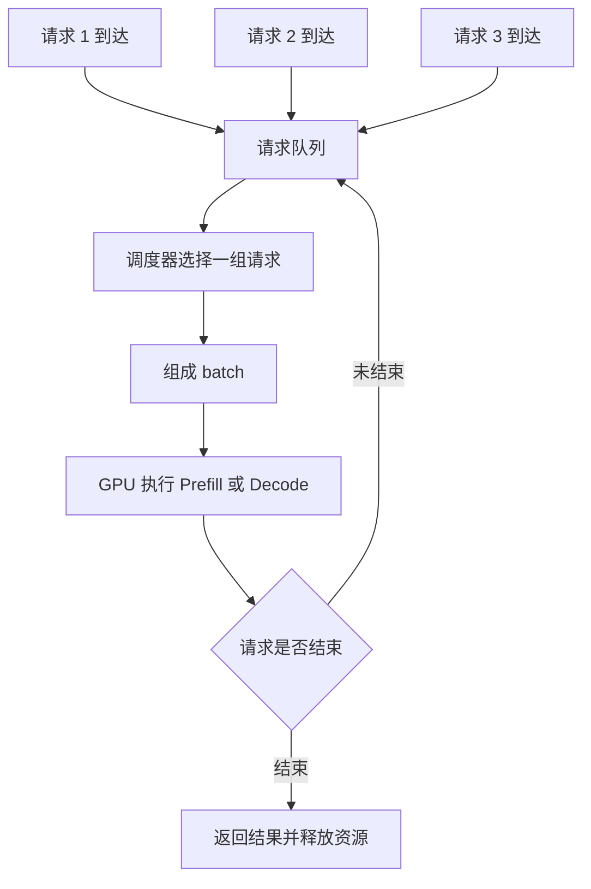

# Batching

Batching 的核心思想是：**不要让 GPU 一次只处理一个很小的请求，而是把多个请求合在一起执行**。这样可以让 GPU 做更大的矩阵计算，减少空转，提高吞吐。

但 Batching 也有代价。请求需要等待其他请求一起组 batch，长请求可能拖慢短请求，batch 太大还会增加显存压力和尾延迟。因此，Batching 不是“越大越好”，而是在吞吐、延迟、显存和公平性之间做取舍。

## 一个简化流程

在线推理服务里的 Batching 大致长这样：

这张图里最重要的是调度器。调度器决定哪些请求一起执行、等待多久、batch 多大、是否让新请求插入、是否优先处理正在 streaming 的请求。

## 为什么 GPU 喜欢 batch

GPU 擅长并行处理大规模矩阵计算。如果一次只处理一个很短的请求，GPU 可能有大量计算单元闲着，kernel launch、调度和内存访问开销占比也会变高。

Batching 能提高吞吐，主要有几个原因：

- **计算更大**：多个请求合在一起后，矩阵乘法规模更大，更容易用满 GPU。
- **开销摊薄**：一次 kernel launch 可以服务多个请求，单请求分摊的调度开销下降。
- **内存访问更规整**：batch 内数据形状更统一时，硬件执行更高效。
- **吞吐更稳定**：高并发下，系统更容易持续给 GPU 喂满工作。

可以把它理解成：一辆大巴一次载 1 个人当然也能跑，但效率很低；等到车上有更多乘客再发车，单位乘客成本会下降。不过，如果等乘客等太久，体验也会变差。

## 训练 batch 和推理 batch 不一样

训练里也有 batch，但训练 batch 和在线推理 batch 的问题不一样。

| 维度 | 训练 batch | 推理 batch |
| --- | --- | --- |
| 数据来源 | 数据集里提前准备好的样本 | 用户请求实时到达 |
| 长度形态 | 可以预处理、分桶、裁剪 | prompt 和输出长度差异大 |
| 目标 | 提高训练吞吐和稳定梯度 | 同时兼顾吞吐、延迟、SLO |
| 是否可等待 | 离线任务通常可以等 | 在线请求等待会影响用户体验 |
| 输出过程 | 一次 forward/backward | Decode 阶段逐 token 循环 |

推理 batch 更难，因为请求是动态到达的。系统不能无限等待“凑够一个大 batch”，否则 TTFT 和尾延迟会变差。

## Static Batching

Static batching 是最简单的方式：先收集固定数量的请求，组成一个 batch 后一起执行。

它适合离线推理或非常规则的 workload，例如：

- 已经有一批固定样本。
- 输入长度比较接近。
- 不关心单个请求的实时延迟。
- 可以接受等待 batch 填满。

Static batching 的问题是在线服务里很容易浪费或拖慢：

- 请求少时，为了凑 batch 会增加等待。
- 请求长度差异大时，短请求会被长请求拖住。
- Decode 阶段不同请求结束时间不同，batch 里会不断出现空位。

所以 static batching 更像离线批处理思路，不适合直接解决高并发在线 LLM serving。

## Dynamic Batching

Dynamic batching 会在一个短时间窗口内收集请求，然后动态组成 batch。它不要求固定 batch，而是根据当前队列、等待时间、token 长度和系统负载决定是否发车。

常见策略包括：

- 等到 batch 请求数达到上限就执行。
- 等到累计 token 数达到上限就执行。
- 等待时间超过阈值就执行。
- 根据请求优先级或 SLO 提前执行。

Dynamic batching 比 static batching 更适合在线服务，因为它能在“多等一点提高吞吐”和“早点执行降低延迟”之间做折中。

但它仍然有问题：如果只在请求开始时组 batch，Decode 阶段不同请求生成长度不同，短请求结束后，batch 里会出现空洞；新请求也不能自然插入正在进行的 Decode 循环。

## Continuous Batching

Continuous batching 也常叫 iteration-level scheduling。它的核心思想是：**每个 Decode step 都可以重新组织 batch**。

也就是说，一个请求结束后，调度器不必等整个 batch 都结束；它可以把新请求插入进来，让 GPU 持续保持较高利用率。

Continuous batching 的价值在 LLM Decode 阶段特别明显：

- 请求输出长度不同，不会因为短请求结束而浪费 batch 位置。
- 新请求可以更快进入系统。
- 正在生成的请求可以和新来的请求交错执行。
- GPU 不容易因为 batch 变小而空转。

它的代价是调度器更复杂，需要维护每个请求的状态、KV Cache、已生成长度、停止条件和优先级。

## Prefill 和 Decode 的 Batching 不同

Prefill 和 Decode 都可以 batch，但它们适合的 batch 方式不同。

Prefill batching 主要处理输入 prompt：

- 一个请求可能有很多 input tokens。
- 长 prompt 会带来大计算和大量 KV Cache 写入。
- batch 太大时，首 token 延迟可能变高。

Decode batching 主要处理逐 token 生成：

- 每个请求每一步通常只生成一个 token。
- 单步计算较小，需要靠并发提高 GPU 利用率。
- 输出长度不同，请求会不断进入和退出 batch。

因此，系统经常要处理 mixed workload：一边有新请求需要 Prefill，一边有老请求需要 Decode。调度器要决定：现在是先处理新的长 prompt，还是先让正在 streaming 的请求继续出 token。

## 为什么 Batching 会增加延迟

Batching 提高吞吐的同时，会增加几类延迟：

- **等待合批**：请求到达后，要等其他请求一起组成 batch。
- **排队延迟**：系统繁忙时，请求可能在队列里等很久。
- **头阻塞**：长请求或大 Prefill 可能拖慢同 batch 的短请求。
- **显存压力**：batch 越大，KV Cache 和中间激活占用越高。
- **调度抖动**：高并发下，Decode step 可能被长 Prefill 插队或阻塞。

所以 Batching 的目标不是把 batch 做到最大，而是在满足 TTFT、TPOT、p95/p99 的前提下提高吞吐。

## Batch Size 不是一个数字

说“batch size = 16”往往不够准确。LLM 推理里至少要区分几种 batch 概念：

| 概念 | 含义 | 影响 |
| --- | --- | --- |
| 请求数 | batch 里有多少个请求 | 调度和并发 |
| input tokens | batch 里一共处理多少输入 token | Prefill 计算量 |
| output tokens | batch 里每轮生成多少 token | Decode 吞吐 |
| active sequences | 当前仍在生成的序列数 | Decode 并发 |
| KV Cache blocks | 当前占用多少 KV Cache 块 | 显存容量 |
| max batched tokens | 单次执行允许的最大 token 数 | 吞吐和显存上限 |

两个 batch 都有 16 个请求，但一个是 16 个短 prompt，另一个是 16 个长上下文请求，系统压力完全不同。

## Padding 和长度分布

Batching 常常需要把不同长度的序列放在一起处理。如果实现方式不够细，短序列可能要被 padding 到长序列长度，造成无效计算。

例如一个 batch 里有 7 个 100 token 的请求和 1 个 4000 token 的请求，如果粗暴按最长长度对齐，短请求会被大量 padding 拖累。

现代推理系统会尽量减少 padding 浪费，例如：

- 按输入长度分桶。
- 用 token 数而不是请求数控制 batch。
- 对长 prompt 做 chunked prefill。
- 用更细粒度的 KV Cache 管理减少碎片。

这也是为什么观察 workload 的长度分布很重要。平均长度相同，不代表系统压力相同。

## Batching 和显存

Batching 会提高 GPU 计算利用率，但也会增加显存压力。

显存主要被几类东西占用：

- 模型权重。
- KV Cache。
- 临时激活和 workspace。
- runtime 管理结构。

batch 越大，同时活跃请求越多，KV Cache 占用越高。如果显存被 KV Cache 填满，系统可能无法接收新请求，甚至触发 OOM。

因此，Batching 必须和 KV Cache 管理一起看。一个吞吐很高的 batch 策略，如果频繁导致显存不足，就不是好策略。

## 该观察哪些指标

调 Batching 时，建议同时观察：

| 指标 | 用途 |
| --- | --- |
| queue time | 看请求是否为了等 batch 排队太久 |
| TTFT | 看合批是否拖慢首 token |
| TPOT / inter-token latency | 看 Decode 输出是否稳定 |
| requests/s | 看请求吞吐 |
| input tokens/s | 看 Prefill 吞吐 |
| output tokens/s | 看 Decode 吞吐 |
| active sequences | 看 Decode 并发规模 |
| batch token count | 看每次 GPU 执行处理多少 token |
| KV Cache usage | 看显存是否被 batch 推高 |
| p95 / p99 latency | 看尾延迟是否恶化 |

如果只看 tokens/s，很容易把 batch 调得过大，最后吞吐看起来很好，但用户等待明显变长。

## 一个调参思路

调 Batching 可以按下面顺序做：

1. 固定模型、硬件、精度和 workload。
2. 先记录 baseline：TTFT、TPOT、tokens/s、p95/p99、显存占用。
3. 调大最大 batch 请求数或最大 batched tokens。
4. 观察吞吐是否上升，TTFT 和 p99 是否恶化。
5. 如果首 token 变慢，检查 queue time 和 prefill time。
6. 如果输出卡顿，检查 Decode batch、KV Cache 和调度。
7. 如果显存接近上限，降低并发或优化 KV Cache。
8. 在满足 SLO 的范围内选择最高 goodput 的配置。

核心原则是：**不是找最大 batch，而是找满足延迟目标下的最大有效吞吐。**

## 常见误区

- **误区一：batch 越大越好。**
  batch 变大可能提高吞吐，但也会增加排队、显存压力和尾延迟。

- **误区二：只用请求数定义 batch。**
  LLM 推理还要看 input tokens、output tokens、active sequences 和 KV Cache 占用。

- **误区三：Prefill 和 Decode 可以用同一种 batch 策略。**
  Prefill 是一次性读输入，Decode 是逐 token 循环，两者调度目标不同。

- **误区四：tokens/s 高就说明 batching 好。**
  如果 p99 很差或者 TTFT 超标，这个 batch 策略可能不适合在线服务。

- **误区五：离线 batch 经验可以直接搬到在线 serving。**
  在线请求动态到达，必须考虑等待、SLO、取消、超时和长尾。

读完这一节，应该能回答五个问题：

- 为什么 Batching 能提高 GPU 吞吐。
- 为什么 Batching 也可能增加延迟和尾延迟。
- static、dynamic、continuous batching 有什么区别。
- Prefill 和 Decode 的 batching 为什么不同。
- 调 Batching 时应该看哪些指标，而不是只看 tokens/s。
