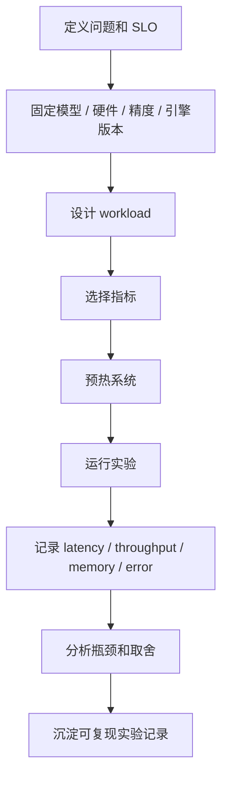

# Benchmark 方法

Benchmark 是用可复现的实验，回答一个推理系统“在什么条件下表现如何”。它不是随手跑一个 tokens/s，也不是只比较谁的数字更大。

一句话理解：

> 推理 Benchmark 的价值，不在于给出一个漂亮数字，而在于说明模型、硬件、负载、并发、延迟和成本之间的关系。

LLM 推理系统很容易被错误 benchmark 误导。同一个服务，在短输入短输出、长输入短输出、短输入长输出、长输入长输出下，瓶颈完全不同。只报告一个平均吞吐，几乎无法指导工程决策。

## Benchmark 要回答什么问题

做 benchmark 之前，先明确问题。

常见问题包括：

- 某个模型在某张 GPU 上能服务多少并发。
- 开启量化后，吞吐提升多少，质量是否下降。
- Prefix Cache 是否改善 TTFT。
- Speculative Decoding 是否降低 TPOT。
- 多机部署是否真的提升 goodput。
- 在 p95 TTFT < 1s 的约束下，最大 QPS 是多少。
- RAG / Agent 负载的端到端瓶颈在哪里。

不同问题需要不同实验设计。没有目标的 benchmark，最后只会得到一堆难以解释的数字。

## Benchmark 的基本流程

一次严谨的推理 benchmark 可以按下面流程组织：



这里每一步都重要。尤其是 workload 设计和指标选择，它们决定 benchmark 结果是否有解释力。

## 必须固定的实验条件

Benchmark 结果必须带上实验条件。否则数字无法比较。

至少要明确：

- 模型名称和版本。
- tokenizer 版本。
- 推理引擎和版本。
- GPU 型号和数量。
- CPU、内存、网络和存储配置。
- 精度和量化格式。
- tensor parallel / pipeline parallel / expert parallel 配置。
- 是否启用 KV Cache 量化。
- 是否启用 Prefix Cache。
- 是否启用 Speculative Decoding。
- batch、scheduler、max_num_seqs 等关键参数。
- input length / output length 分布。
- 并发模式和请求到达方式。
- 采样参数。
- 是否流式返回。

同一个模型，同一张 GPU，只要 input/output length 或并发方式不同，结果就可能完全不同。

## Workload 是核心

推理 benchmark 最核心的是 workload。

Workload 描述请求长什么样、怎么到达、输出多长、是否流式、是否命中缓存、是否包含工具调用。

常见 workload 维度包括：

| 维度 | 说明 |
| --- | --- |
| input length | 输入 prompt token 数 |
| output length | 输出 token 数 |
| request rate | 请求到达速率 |
| concurrency | 同时活跃请求数 |
| sampling params | temperature、top-p、max_tokens 等 |
| cache hit pattern | Prefix Cache、Retrieval Cache 等命中情况 |
| stream mode | 是否流式返回 |
| task type | 问答、代码、摘要、RAG、Agent 等 |

Workload 设计不好，benchmark 结果就会失真。

## Input / Output Length 为什么关键

LLM 推理的成本和输入输出长度强相关。

输入长度主要影响 Prefill。输入越长，Prefill 计算越重，TTFT 通常越高。

输出长度主要影响 Decode。输出越长，Decode step 越多，KV Cache 占用越久，整体生成时间越长。

因此至少要区分四类负载：

| 负载类型 | 特点 | 常见瓶颈 |
| --- | --- | --- |
| 短输入短输出 | 问答、小任务 | 调度、网络、固定开销 |
| 长输入短输出 | 文档问答、检索摘要 | Prefill、TTFT、KV Cache |
| 短输入长输出 | 写作、代码生成 | Decode、TPOT、输出吞吐 |
| 长输入长输出 | 长文档分析、复杂 Agent | Prefill + Decode + 显存 |

只测一种长度，不能代表线上服务。

## Synthetic Workload 和 Production Trace

Benchmark 常用两类 workload：synthetic workload 和 production trace。

Synthetic workload 是人工构造的负载。例如固定 input length = 1024，output length = 256，并发 = 64。

优点是：

- 可控。
- 易复现。
- 适合做横向比较。
- 容易覆盖边界条件。

缺点是：

- 可能不像真实流量。
- 容易忽略长尾请求。
- 不能反映真实缓存命中。
- 不能反映真实任务分布。

Production trace 是从真实线上流量抽样得到的负载。

优点是：

- 更贴近真实场景。
- 能反映长度分布、到达分布和长尾。
- 能暴露真实缓存和调度问题。

缺点是：

- 隐私和脱敏成本高。
- 难以公开复现。
- 线上流量会随时间变化。
- 不容易做跨系统公平比较。

实践中最好两者都做：用 synthetic workload 做可控对比，用 production-like workload 验证真实收益。

## Closed-loop 和 Open-loop

请求到达方式也会影响 benchmark。

Closed-loop 是客户端保持固定并发：一个请求完成后再发下一个。它回答的是“在 N 个并发用户下系统表现如何”。

Open-loop 是按照固定到达率发请求，不管前一个请求是否完成。它回答的是“在每秒 X 个请求到达时系统是否扛得住”。

两者差异很大：

- Closed-loop 不容易把系统压爆，因为请求完成慢时发送速度也会下降。
- Open-loop 更接近真实流量洪峰，能观察队列增长和过载。
- Closed-loop 适合测试并发能力。
- Open-loop 适合测试容量、SLO 和稳定性。

报告 benchmark 时必须说明使用哪种模式。

## 并发和 QPS 不是一回事

并发是同时在系统里的请求数。QPS 是每秒到达或完成的请求数。

LLM 请求的持续时间可能很长，所以并发和 QPS 关系并不简单。

例如输出很长时，即使 QPS 不高，活跃请求也可能很多，因为每个请求在系统里停留时间长。活跃请求多了，KV Cache 占用也会变大。

所以 benchmark 里要同时报告：

- request arrival rate。
- active requests。
- completed requests/s。
- input tokens/s。
- output tokens/s。
- KV Cache usage。

只报告 QPS，会漏掉很多推理系统关键成本。

## 指标选择

推理 benchmark 至少要同时报告延迟、吞吐、资源和错误。

| 指标类型 | 常见指标 |
| --- | --- |
| 延迟 | TTFT、TPOT、end-to-end latency、p50/p95/p99 |
| 吞吐 | requests/s、input tokens/s、output tokens/s、total tokens/s |
| 资源 | GPU utilization、GPU memory、KV Cache usage、CPU utilization |
| 稳定性 | timeout count、error rate、OOM、retry count |
| 成本 | cost/request、cost/token、GPU hour usage |
| 有效吞吐 | goodput、SLO 达成率 |

吞吐和延迟要一起看。一个系统可以通过堆积更大 batch 提高吞吐，但让 TTFT 和 p99 latency 变差。

## TTFT、TPOT 和 E2E 要分开

TTFT、TPOT、end-to-end latency 描述不同体验。

- TTFT：用户等多久看到第一个 token。
- TPOT：后续 token 流式输出是否平稳。
- End-to-end latency：完整回答总耗时。

不同优化影响不同指标：

- Prefix Cache 主要改善 Prefill 和 TTFT。
- Speculative Decoding 主要改善 TPOT。
- Batching 可能提高吞吐，但影响 TTFT。
- KV Cache 优化可能提升并发和长上下文能力。
- 量化可能降低显存和 Decode 成本。

所以 benchmark 不能只报告总耗时，也不能只报告 tokens/s。

## p50、p95、p99 为什么重要

平均值很容易掩盖长尾。

在线推理服务里，用户体验常常由 p95 和 p99 决定。少数长请求、缓存未命中、队列拥塞、网络抖动、最慢 rank，都可能造成尾延迟。

报告延迟时建议至少包含：

- p50。
- p90。
- p95。
- p99。
- max 或异常值说明。

如果只报告平均 TTFT 或平均 TPOT，很难判断系统是否适合线上服务。

## Goodput：SLO 内的有效吞吐

Goodput 是满足 SLO 的有效吞吐。

例如系统每秒能完成 100 个请求，但只有 60 个请求满足 p95 TTFT < 1s 和 p95 TPOT < 50ms，那么有效服务能力不能简单写成 100 requests/s。

Goodput 更适合评估在线推理系统，因为它把吞吐和延迟目标放到一起。

可以这样定义：

```text
goodput = 满足 SLO 的请求数 / 时间
```

不同业务可以定义不同 SLO，例如：

- TTFT < 1s。
- TPOT < 50ms。
- end-to-end latency < 10s。
- error rate < 0.1%。

## 预热和冷启动

推理系统启动后，第一次请求可能很慢。

原因包括：

- 模型权重加载。
- kernel 编译。
- CUDA Graph 捕获。
- memory pool 初始化。
- tokenizer 文件加载。
- cache 尚未命中。

Benchmark 要区分冷启动和稳定运行。

常见做法是：

1. 先启动服务。
2. 跑一段 warmup 请求。
3. 等待指标稳定。
4. 再开始正式采样。

如果研究的是扩容和弹性伸缩，则冷启动本身也应该单独测。

## 采样参数要固定

生成参数会影响输出长度、sampling 开销和结果稳定性。

Benchmark 中要明确：

- max_tokens。
- temperature。
- top_p。
- top_k。
- stop sequence。
- 是否返回 logprobs。
- 是否使用 beam search 或 guided decoding。
- 是否流式返回。

例如返回 logprobs 可能增加额外计算和返回数据量；复杂 stop sequence 会增加 detokenization 和匹配开销；temperature 不同可能导致输出长度变化。

参数不固定，结果不可比。

## 缓存命中要说明

缓存对 benchmark 影响很大。

如果启用了 Prefix Cache、Response Cache、Retrieval Cache、Embedding Cache，必须说明：

- 是否预热缓存。
- 命中率是多少。
- 命中的 prefix 平均多长。
- 是否包含真实缓存 miss。
- cache 是否跨请求共享。
- cache 是否跨租户或 replica 共享。

缓存命中很高时，TTFT 可能明显改善；但这不代表无缓存场景也有同样表现。

所以可以分别报告：

- cold cache。
- warm cache。
- mixed cache。

## 错误和超时不能忽略

Benchmark 不是只统计成功请求。

必须记录：

- timeout。
- HTTP 5xx / 4xx。
- worker error。
- OOM。
- cancellation。
- retry。
- invalid output。
- stream interrupted。

如果系统通过拒绝大量请求来保持低延迟，延迟数字可能看起来很好，但服务能力并不好。

因此 benchmark 报告要同时写出成功率、错误率和拒绝率。

## Benchmark 与质量评估

性能 benchmark 不等于质量评估。

但是某些优化会影响模型输出质量，例如：

- 量化。
- Speculative Decoding 近似实现。
- guided decoding。
- MoE routing 相关改动。
- 更换推理引擎。
- 修改采样参数。

如果优化可能影响输出，就要同时跑质量评估。否则性能提升可能来自模型行为变化。

性能和质量要分开报告，但不能只看其中一个。

## 可复现记录

每次 benchmark 都应该留下实验记录。

建议记录：

- git commit。
- 模型版本。
- 镜像或依赖版本。
- 推理引擎版本。
- 硬件信息。
- 启动命令。
- 服务配置。
- benchmark 命令。
- workload 文件。
- 原始结果。
- 统计脚本。
- 结论和异常说明。

没有这些信息，几周后就很难复现同一个结果。

## 常见 Benchmark 场景

### 1. 单模型单机基准

目标是知道一个模型在一台机器上的基础能力。

重点看：

- 不同 input/output length。
- 不同并发。
- TTFT / TPOT。
- KV Cache 显存。
- 最大稳定并发。

### 2. 优化前后对比

例如比较开启和关闭 Prefix Cache、量化、Speculative Decoding。

要保证除目标变量外，其他条件相同。否则无法判断收益来自哪里。

### 3. 多机扩展性测试

目标是看 GPU 数或 replica 数增加后，吞吐是否提升，尾延迟是否变差。

重点看：

- scaling efficiency。
- 通信开销。
- replica 间负载均衡。
- p95 / p99 latency。

### 4. SLO 容量测试

目标是找到在某个 SLO 下的最大可服务流量。

例如：

```text
p95 TTFT < 1s
p95 TPOT < 50ms
error rate < 0.1%
```

逐步提高 request rate 或 concurrency，直到 SLO 失守。

### 5. RAG / Agent 端到端测试

目标是测完整链路，而不是单次 LLM 调用。

需要包含：

- embedding。
- retrieval。
- rerank。
- prompt construction。
- tool call。
- 多轮 LLM 调用。
- 外部服务错误和超时。

这种 benchmark 要报告端到端指标，也要拆分每个阶段。

## 常见优化方向

Benchmark 方法本身也需要优化，重点是让实验更可信、更可解释。

### 1. 覆盖长度矩阵

至少覆盖短输入短输出、长输入短输出、短输入长输出、长输入长输出。

只测一个长度点，无法代表真实系统。

### 2. 同时报告延迟和吞吐

不要只报告 tokens/s。要同时报告 TTFT、TPOT、p95/p99、requests/s、tokens/s 和显存。

### 3. 区分 Prefill-heavy 和 Decode-heavy

Prefill-heavy workload 和 decode-heavy workload 的瓶颈不同，优化方向也不同。

把它们混成一个平均值，会让结论失真。

### 4. 保留原始数据

不要只保留汇总表。原始请求级记录可以用来分析长尾、错误、超时和不同长度段的表现。

### 5. 使用固定随机种子和固定 workload

如果 workload 每次变化，优化前后很难比较。

固定 workload 文件、随机种子和采样参数，可以提高复现性。

### 6. 单变量对比

比较两个系统时，每次只改一个主要变量。例如只改量化，其他模型版本、引擎版本、batch 参数、硬件都保持一致。

否则结论不可信。

### 7. 报告异常和失败

如果实验中出现 OOM、超时、worker 重启、网络抖动，要写进报告。

异常本身就是系统能力的一部分。

## 该观察哪些指标

评估推理 Benchmark 时，建议观察：

| 指标 | 说明 |
| --- | --- |
| TTFT p50/p95/p99 | 首 token 延迟分布 |
| TPOT p50/p95/p99 | 后续 token 输出间隔 |
| end-to-end latency | 完整请求耗时 |
| requests/s | 请求吞吐 |
| input tokens/s | Prefill 输入吞吐 |
| output tokens/s | Decode 输出吞吐 |
| active requests | 活跃请求数 |
| queue wait time | 队列等待 |
| GPU utilization | GPU 利用率 |
| GPU memory | GPU 显存 |
| KV Cache usage | KV Cache 占用 |
| CPU utilization | CPU 是否成为瓶颈 |
| error rate | 错误率 |
| timeout rate | 超时率 |
| cache hit rate | 缓存命中率 |
| goodput | 满足 SLO 的有效吞吐 |

这些指标要按模型、硬件、并发、input length、output length 和请求类型分组看。

## 一个最小实验设计

假设要评估一个 13B 模型在单机 1 张 GPU 上的服务能力。

可以设计四组 workload：

| 组别 | input tokens | output tokens | 目的 |
| --- | --- | --- | --- |
| A | 128 | 128 | 短问答 |
| B | 4096 | 128 | 长输入文档问答 |
| C | 128 | 1024 | 长输出生成 |
| D | 4096 | 1024 | 长输入长输出 |

每组分别测试并发 1、4、16、64。

报告：

- TTFT p50/p95/p99。
- TPOT p50/p95/p99。
- requests/s。
- input tokens/s。
- output tokens/s。
- peak GPU memory。
- error/timeout。

这样得到的结果比单个 tokens/s 更有用，因为它能看出系统在不同负载下的瓶颈。

## 常见误区

- **误区一：只看 tokens/s。**
  tokens/s 不说明 TTFT、TPOT、尾延迟、错误率和显存压力。

- **误区二：只测固定长度。**
  真实请求长度分布很宽，固定长度只能说明一个点。

- **误区三：并发越高越能代表系统能力。**
  过高并发可能只是把请求堆在队列里，吞吐变高但延迟不可接受。

- **误区四：benchmark 数字可以脱离配置单独比较。**
  模型、硬件、精度、引擎、batch 参数、缓存状态都会影响结果。

- **误区五：成功请求的平均延迟就够了。**
  被拒绝、超时、失败的请求也必须计入系统评估。

读完这一节，应该能回答五个问题：

- 推理 Benchmark 应该先定义什么问题。
- 为什么 input/output length 和请求到达方式会决定结论。
- synthetic workload 和 production trace 各有什么优缺点。
- 为什么必须同时报告 latency、throughput、资源、错误和 goodput。
- 如何设计一个可复现、可解释的推理 Benchmark。
