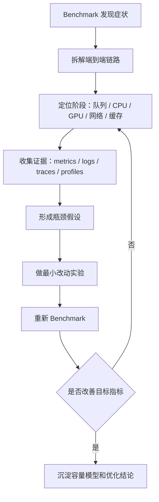

# Benchmark 方法与性能剖析

Benchmark 告诉我们系统“表现如何”，性能剖析解释系统“为什么这样表现”。两者必须放在一起看。只有 benchmark，没有 profiling，很容易停留在现象层；只有 profiling，没有稳定 benchmark，又很难判断优化是否真的改善了用户体验。

一句话理解：

> Benchmark 是体检报告，profiling 是诊断过程；推理系统优化需要先量化症状，再用证据定位瓶颈，最后把结果沉淀成容量模型。

前面的 [Benchmark 方法](benchmark-methodology.md) 重点讲如何设计可复现实验。这篇进一步回答：当实验结果出来以后，如何判断瓶颈在队列、CPU、GPU、显存、KV Cache、网络、调度、缓存还是外部工具。

## 为什么 Benchmark 之后还要性能剖析

一次 benchmark 可能告诉你：

- p95 TTFT 太高。
- TPOT 不稳定。
- output tokens/s 低于预期。
- 并发一高就 OOM。
- GPU utilization 不高。
- p99 latency 长尾严重。

但这些数字本身并不说明原因。

例如 TTFT 高，可能是：

- 请求排队太久。
- tokenizer 慢。
- Prefill 太重。
- 长 prompt 太多。
- Prefix Cache 没命中。
- GPU 被 Decode 请求占满。
- CPU 到 GPU 数据传输慢。
- 调度策略限制了 Prefill 进入。

同一个症状，对应的优化方向完全不同。因此 benchmark 后必须进一步拆解。

## 基本流程

推理系统的性能剖析可以按下面流程做：



这个流程的关键是“证据闭环”。不要因为看到 GPU utilization 低，就立刻断定 GPU 没吃满；也不要因为 tokens/s 低，就立刻换模型或换框架。先拆解，再验证。

## 从端到端链路拆起

推理请求的端到端延迟可以拆成多个阶段：

```text
E2E latency =
  network / gateway
+ request validation
+ tokenizer
+ queue waiting
+ scheduler delay
+ prefill
+ first token sampling
+ decode loop
+ streaming / postprocess
+ cleanup / metrics
```

RAG / Agent 还要加上：

```text
+ embedding
+ retrieval
+ rerank
+ context packing
+ tool calls
+ retries
```

性能剖析的第一步，是把总耗时拆到这些阶段。否则只能看到“慢”，看不到慢在哪里。

建议每个请求至少记录：

- request id。
- arrival time。
- enqueue time。
- scheduled time。
- prefill start/end。
- first token time。
- decode step timestamps。
- final token time。
- input/output tokens。
- cache hit/miss。
- GPU worker id。
- error/timeout/OOM。

有了这些事件，TTFT、TPOT 和 E2E latency 才能被解释。

## TTFT 如何剖析

TTFT 是用户等到第一个 token 的时间。它通常包含排队、调度、Prefill 和第一个 token sampling。

可以拆成：

```text
TTFT =
  queue waiting
+ scheduler delay
+ tokenizer / preprocessing
+ prefill execution
+ first token sampling
+ network flush
```

如果 TTFT 高，先看它是哪一段高。

| 现象 | 可能原因 | 优先检查 |
| --- | --- | --- |
| queue waiting 高 | 系统过载、准入控制不足、batch 太满 | 队列长度、active requests、arrival rate |
| scheduler delay 高 | token budget 限制、Prefill 被 Decode 压制 | scheduler trace、每轮调度决策 |
| tokenizer 慢 | CPU 瓶颈、长 prompt、tokenizer 单线程 | CPU profile、tokenizer time |
| prefill 高 | input length 长、attention 计算重、cache miss | input tokens、prefill tokens/s、GPU kernel timeline |
| first token sampling 慢 | logits 处理、约束输出、采样参数复杂 | sampling time、structured output constraints |
| network flush 慢 | streaming server 或客户端慢 | server send time、connection metrics |

TTFT 优化不能只盯 GPU。很多线上 TTFT 问题其实发生在排队、CPU tokenization 或 RAG 前处理。

## TPOT 如何剖析

TPOT 是后续每个 token 的生成间隔。它主要反映 Decode 阶段是否稳定。

可以拆成：

```text
TPOT =
  scheduler iteration delay
+ decode forward
+ KV Cache read/write
+ logits processing
+ sampling
+ streaming flush
```

TPOT 不稳定，常见原因包括：

- batch 内请求数量波动大。
- Prefill 插入太多，干扰 Decode。
- KV Cache 显存压力高。
- 长上下文请求导致 attention 读取变重。
- 多 GPU 通信拖慢最慢 rank。
- structured output 约束增加 logits 处理时间。
- streaming server 发送阻塞。

Decode 是逐 token 循环，微小开销会被重复很多次。因此 TPOT 剖析要看 per-iteration timeline，而不是只看总耗时。

## 吞吐如何剖析

推理吞吐不能只看 requests/s，也不能只看 tokens/s。至少要拆成：

- input tokens/s。
- output tokens/s。
- total tokens/s。
- completed requests/s。
- goodput。

不同吞吐指标对应不同瓶颈：

| 指标低 | 可能说明 |
| --- | --- |
| input tokens/s 低 | Prefill 算力不足、长 prompt、batch 不够、CPU 前处理慢 |
| output tokens/s 低 | Decode 不饱和、KV Cache 访存瓶颈、通信瓶颈 |
| requests/s 低 | 请求太长、排队严重、外部依赖慢 |
| goodput 低 | 虽然吞吐高，但 SLO 违约或错误率高 |

吞吐优化要和延迟一起看。提高 batch 可能提升 tokens/s，但让 TTFT 和 p99 latency 变差。在线服务最终要看 SLO 内的有效吞吐。

## 队列与调度剖析

很多推理系统瓶颈不是 GPU kernel，而是队列和调度。

需要观察：

- waiting queue length。
- active requests。
- scheduled requests per iteration。
- tokens scheduled per iteration。
- prefill tokens / decode tokens 比例。
- 被拒绝或延后的请求数量。
- preemption 次数。
- 每类请求的等待时间。

队列问题常见表现：

- 平均延迟还可以，但 p99 很差。
- 短请求被长请求拖住。
- 高并发时 TTFT 急剧上升。
- GPU utilization 看似很高，但 goodput 下降。
- 负载稍微超过容量后，队列快速膨胀。

调度剖析要回答三个问题：

1. 谁在等。
2. 为什么等。
3. 等待是否换来了更高有效吞吐。

如果系统为了提高吞吐把 batch 堆得很大，但导致大量请求超出 SLO，这不是有效优化。

## CPU 侧剖析

LLM 推理不只是 GPU 工作。CPU 侧也可能成为瓶颈。

常见 CPU 工作包括：

- HTTP / gRPC 处理。
- JSON 解析。
- 鉴权。
- tokenizer。
- prompt 模板拼接。
- sampling 后处理。
- structured output 约束状态更新。
- streaming。
- logging。
- metrics。

CPU 瓶颈常见表现：

- GPU utilization 不高，但请求仍然排队。
- tokenizer time 占比高。
- 高并发下 API server CPU 打满。
- streaming 连接数多时延迟上升。
- 日志或 metrics 写入拖慢请求。

CPU 侧剖析可以用应用 trace、runtime profiler、系统 CPU 指标和事件日志结合看。不要只打开 GPU profiler 就认为看到了完整系统。

## GPU 侧剖析

GPU 侧剖析重点看 kernel timeline、显存、访存、通信和同步。

常见问题包括：

- GPU 上有大量空白时间。
- kernel launch 过多且很碎。
- Attention kernel 占比高。
- GEMM 没有达到预期吞吐。
- KV Cache 读取成为访存瓶颈。
- CPU/GPU 同步频繁。
- H2D/D2H copy 阻塞计算。
- 多 GPU AllReduce / AllGather 拖慢。

GPU timeline 要结合 workload 看。

Prefill 阶段通常更像大矩阵计算，可能偏 compute-bound。Decode 阶段每次只生成少量 token，经常更受访存、KV Cache 读取和调度开销影响。

因此，一个系统可能在 Prefill 时 GPU 很忙，在 Decode 时 GPU 利用率不高，但整体用户体验仍然被 Decode TPOT 决定。

## KV Cache 与显存剖析

推理系统里，显存不只是模型权重。KV Cache 往往决定真实并发能力。

需要观察：

- model weights memory。
- KV Cache allocated memory。
- KV Cache used blocks。
- free blocks。
- block fragmentation。
- prefix cache 命中率。
- eviction 次数。
- preemption 次数。
- OOM 或 allocation failure。

常见问题包括：

- 并发升高后 KV Cache 耗尽。
- 长上下文请求挤占短请求。
- Prefix Cache 命中率低，重复 Prefill 高。
- block size 设置不合适，内部碎片多。
- KV Cache 量化降低显存，但影响质量或性能。

如果显存瓶颈来自 KV Cache，换更快 kernel 不一定有用。可能需要限制最大上下文、优化 context packing、提高 prefix cache 命中率、使用 paged KV cache、做 KV Cache 量化，或分离 Prefill/Decode。

## 网络与多机通信剖析

多机推理和 RAG / Agent 负载里，网络经常被低估。

需要区分两类网络：

第一类是模型执行网络，例如多 GPU、多节点之间的 NCCL 通信。它影响 tensor parallel、pipeline parallel、expert parallel 和 KV Cache 传输。

第二类是服务链路网络，例如 API gateway、retrieval service、tool service、数据库和客户端 streaming。

多机通信常见表现：

- 单机性能正常，多机扩展效率差。
- 最慢 rank 决定整体 step 时间。
- p99 latency 出现周期性尖峰。
- 网络抖动导致 decode iteration 不稳定。
- MoE expert dispatch/combine 阶段拖慢。

服务链路网络常见表现：

- LLM 本身很快，但 RAG / Agent E2E 很慢。
- 工具调用 p99 拖慢整体请求。
- streaming 客户端慢导致 server 资源被占用。
- retrieval service 成为独立瓶颈。

网络剖析不能只看平均延迟，要看 p95/p99 和失败率。

## Profile 工具怎么配合

常见工具可以按层次理解：

| 工具类型 | 适合回答的问题 |
| --- | --- |
| Application metrics | TTFT、TPOT、QPS、错误率、队列长度 |
| Distributed tracing | 一个请求每个阶段花了多久 |
| PyTorch Profiler | PyTorch 层算子、CPU/GPU 时间、kernel 对应关系 |
| Nsight Systems | CPU 线程、CUDA API、GPU kernel、copy、同步的时间线 |
| Nsight Compute | 单个 CUDA kernel 的更细粒度性能分析 |
| DCGM / nvidia-smi | GPU 利用率、显存、功耗、温度、ECC 等设备指标 |
| perf / eBPF | Linux CPU、系统调用、网络和内核路径 |
| Engine-specific metrics | vLLM、TensorRT-LLM、SGLang 等 runtime 内部状态 |

工具不是越多越好。推荐顺序是：

1. 先用 metrics 找到症状。
2. 用 trace 确定慢在哪个阶段。
3. 再用 profiler 深入具体阶段。
4. 最后用最小实验验证优化。

直接上 kernel profiler 往往太早。很多线上问题在队列、缓存、RAG、工具或网络层。

## Trace 设计

推理系统应该把每个请求做成可追踪的 trace。

一个 trace 至少包含：

- API receive。
- enqueue。
- schedule。
- tokenize。
- prefill start/end。
- first token。
- decode iterations。
- final token。
- response close。
- cleanup。

RAG / Agent trace 还应包含：

- query rewrite。
- embedding。
- retrieval。
- rerank。
- context packing。
- tool call start/end。
- retry。
- structured output validation。

每个 span 建议记录：

- input tokens。
- output tokens。
- model name。
- worker id。
- batch size。
- cache hit/miss。
- error code。
- retry reason。

Trace 的价值是把“慢请求”还原成证据链。没有 trace，p99 问题通常很难定位。

## 从症状到瓶颈的判断表

下面是一张粗略排查表。

| 症状 | 优先怀疑 | 需要证据 |
| --- | --- | --- |
| TTFT 高 | 排队、Prefill、tokenizer、cache miss | queue time、input tokens、prefill time、prefix hit |
| TPOT 高 | Decode、KV Cache、通信、sampling | decode iteration timeline、KV usage、NCCL time |
| GPU 利用率低 | CPU、调度、batch 不足、I/O | CPU profile、active requests、GPU gaps |
| GPU 利用率高但延迟差 | batch 过大、过载、SLO 违约 | queue growth、p95/p99、goodput |
| OOM | 权重、KV Cache、长上下文、并发过高 | memory breakdown、KV blocks、active seqs |
| 多机扩展差 | 通信、负载不均、最慢 rank | NCCL time、rank timeline、network metrics |
| RAG E2E 慢 | retrieval、rerank、context 太长 | retrieval span、rerank span、input tokens |
| Agent p99 差 | 工具尾延迟、重试、循环 | tool p99、retry count、step count |

这张表不是结论，而是排查起点。最终必须回到 profile 和 trace 证据。

## 优化实验怎么设计

找到瓶颈假设后，不要一次改很多东西。每次实验只改一个主要变量。

例如：

- 如果怀疑 input length 过长，就固定其他条件，只减少 context tokens。
- 如果怀疑 Prefix Cache 没命中，就只改变 prompt 模板或 cache 配置。
- 如果怀疑 batch 太大影响 TTFT，就只调整 batch/token budget。
- 如果怀疑多 GPU 通信瓶颈，就只改变 tensor parallel size 或部署拓扑。
- 如果怀疑 tokenizer 慢，就只替换 tokenizer 并发或 CPU 配置。

每个实验记录：

- 改了什么。
- 为什么改。
- 预期影响哪个指标。
- 实际影响 TTFT、TPOT、吞吐、显存、错误率和 goodput。
- 是否有副作用。

优化实验不是为了证明自己想法正确，而是为了缩小不确定性。

## 容量模型

性能剖析的最终产物不应该只是“调了一个参数”。更好的产物是容量模型。

容量模型回答：

- 在给定模型、硬件、精度和 workload 下，系统能承载多少请求。
- 在给定 SLO 下，最大 arrival rate 是多少。
- input/output length 变化会如何影响容量。
- 并发升高时，瓶颈先出现在 GPU、KV Cache、CPU、网络还是外部服务。
- 多增加一张 GPU 或一个节点，容量如何变化。

一个简化容量模型可以从这些变量开始：

| 变量 | 说明 |
| --- | --- |
| request rate | 每秒到达请求数 |
| input tokens/request | 每个请求平均输入 token |
| output tokens/request | 每个请求平均输出 token |
| active requests | 同时在系统中的请求数 |
| prefill throughput | input tokens/s |
| decode throughput | output tokens/s |
| KV memory/request | 每个请求 KV Cache 占用 |
| SLO | TTFT、TPOT 或 E2E 目标 |
| goodput | 满足 SLO 的有效吞吐 |

容量模型不需要一开始很复杂，但必须能解释实验结果。它的价值是帮助做规划，而不是每次靠临时压测猜。

## 常见误区

### 1. 只看平均值

平均延迟经常掩盖长尾。在线推理要看 p95、p99 和 timeout。

### 2. 只看 tokens/s

tokens/s 高不等于体验好。如果 TTFT 很高或 goodput 很低，tokens/s 再高也可能不适合线上服务。

### 3. 把 GPU utilization 当作唯一目标

GPU utilization 高可能意味着系统过载。优化目标是 SLO 下的有效吞吐，不是让 GPU 指标看起来满。

### 4. 不固定 workload

input/output length、并发、采样参数、缓存命中率一变，性能结论就可能变。没有固定 workload 的 profile 很难比较。

### 5. 没有冷启动和热身区分

模型加载、JIT 编译、kernel autotune、cache warmup 都会影响前几轮请求。Benchmark 要区分 warmup 和正式测量。

### 6. 忽略错误率

一个系统可以通过更激进的配置提高吞吐，但同时增加 OOM、timeout 或重试。错误率必须和性能一起报告。

## 一次完整剖析示例

假设 benchmark 发现：并发从 32 提高到 128 后，output tokens/s 上升，但 p95 TTFT 从 800ms 变成 5s。

不要立刻下结论。可以这样拆：

1. 查 trace，发现 TTFT 主要增加在 queue waiting。
2. 查 scheduler metrics，发现 active requests 接近上限。
3. 查 GPU timeline，发现 GPU 一直很忙。
4. 查 request length，发现长 prompt 请求比例升高。
5. 查 KV Cache，发现显存接近上限，调度器限制新 Prefill。
6. 做实验 A：降低 max active requests，p95 TTFT 改善但吞吐下降。
7. 做实验 B：限制最大 context tokens，p95 TTFT 改善且 goodput 上升。
8. 做实验 C：启用 Prefix Cache，短重复 prompt 的 TTFT 改善。

最后结论不是“GPU 不够”，而是：

- 高并发下长 prompt 与 KV Cache 占用导致新请求排队。
- 单纯增加 active requests 会提高吞吐但破坏 SLO。
- 当前 workload 下，需要 context token 控制、Prefix Cache 和准入策略共同优化。

这样的结论才可执行。

## 应该沉淀什么

每次性能剖析结束后，建议沉淀：

- workload 描述。
- benchmark 配置。
- 指标结果。
- trace 截图或摘要。
- profiler 证据。
- 瓶颈判断。
- 做过的实验。
- 有效优化和无效优化。
- 副作用。
- 容量边界。
- 后续风险。

这些内容可以写进 benchmark report、ADR 或系统案例。否则下一次遇到相似问题，团队又会重新猜一遍。

## 小结

Benchmark 方法与性能剖析的核心，是把性能优化从“看数字”和“调参数”变成证据驱动的工程过程。

它的关键步骤包括：

- 用 benchmark 固定 workload 和症状。
- 用 trace 拆解端到端链路。
- 用 profiler 定位具体瓶颈。
- 区分 TTFT、TPOT、吞吐、显存、队列和错误率。
- 用最小实验验证假设。
- 把结论沉淀成容量模型和工程记录。

对关注高效计算的人来说，真正有价值的不是某次 benchmark 数字，而是能解释这些数字、复现实验、定位瓶颈，并把优化结论变成可复用方法。

## 参考资料

- [NVIDIA Nsight Systems User Guide](https://docs.nvidia.com/nsight-systems/UserGuide/index.html)
- [PyTorch Profiler documentation](https://docs.pytorch.org/docs/stable/profiler.html)
- [NVIDIA Data Center GPU Manager documentation](https://docs.nvidia.com/datacenter/dcgm/latest/user-guide/index.html)
