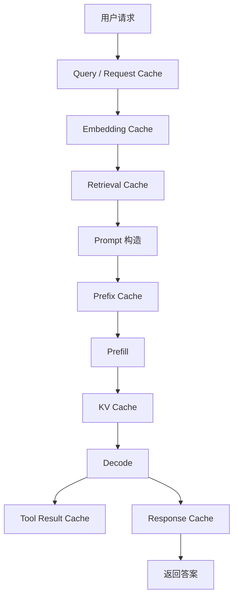

# 缓存体系

推理系统里的缓存不只有 KV Cache。一个真实在线服务里，可能同时存在 query cache、embedding cache、retrieval cache、prefix cache、KV Cache、tool result cache、response cache 和 model artifact cache。

一句话理解：

> 缓存体系是在推理链路的不同位置复用已经算过、查过或加载过的结果，用空间换时间、用一致性和隔离设计换性能。

缓存能降低延迟、减少 GPU/CPU/网络/存储开销，也能提升系统吞吐。但缓存不是越多越好。缓存会带来命中率、过期、污染、安全隔离、一致性和显存占用问题。

## 缓存出现在推理链路哪里

从一个请求进入服务到输出答案，很多环节都可能缓存。



这张图不是说每个系统都要有所有缓存，而是说明缓存可以出现在多个层次。不同缓存节省的是不同开销。

例如：

- Query cache 可能直接省掉一次完整请求。
- Embedding cache 省掉 embedding 模型调用。
- Retrieval cache 省掉向量检索和 rerank。
- Prefix cache 省掉重复 Prefill。
- KV Cache 省掉 Decode 中重复计算历史上下文。
- Tool result cache 省掉外部工具调用。
- Response cache 省掉整次生成。

理解缓存体系的关键，是先问清楚“缓存的是什么”和“命中后跳过哪段链路”。

## 常见缓存类型总览

| 缓存类型 | 缓存内容 | 命中后节省什么 | 主要风险 |
| --- | --- | --- | --- |
| Query Cache | 规范化后的请求或查询结果 | 业务逻辑、检索或完整推理 | 语义变化、权限差异 |
| Embedding Cache | 文本对应的 embedding | embedding 模型调用 | 模型版本变化 |
| Retrieval Cache | 检索结果或 rerank 结果 | 向量检索、rerank | 索引更新后过期 |
| Prefix Cache | prompt 前缀对应的 KV | 重复 Prefill | 前缀一致性和隔离 |
| KV Cache | 当前请求历史 token 的 key/value | Decode 重算历史上下文 | 显存占用大 |
| Tool Result Cache | 工具调用结果 | 外部 API、数据库或代码执行 | 数据新鲜度和副作用 |
| Response Cache | 完整请求对应的最终答案 | 完整模型生成 | 个性化和正确性 |
| Model Artifact Cache | 模型权重、engine、tokenizer 文件 | 下载、加载、编译 | 版本和一致性 |

同一个请求可能同时命中多类缓存。例如 RAG 请求可能命中 embedding cache、retrieval cache、prefix cache 和 KV Cache。

## Query Cache

Query Cache 缓存的是某类查询或请求的结果。

它可以用在几个层次：

- 缓存用户问题的标准化结果。
- 缓存某个业务查询结果。
- 缓存某个检索 query 的候选文档。
- 缓存某个完整请求的中间状态。

Query Cache 的难点是 key 设计。两个看起来相似的问题，不一定可以共用缓存；两个文字完全一样的问题，也可能因为用户权限、时间、上下文不同而不能共用。

例如：

```text
查询今天的订单状态
```

这句话对不同用户、不同日期、不同权限含义都不同。缓存 key 如果只用文本，就可能返回错误结果。

Query Cache 适合相对稳定、可规范化、权限边界清楚的查询。

## Embedding Cache

Embedding Cache 缓存文本到 embedding 向量的结果。

它常用于 RAG 系统。相同文档、相同 query、相同 embedding 模型下，向量结果可以复用。

Embedding Cache 命中后可以省掉：

- embedding 模型前向。
- CPU/GPU 推理开销。
- embedding 服务网络调用。
- 批量文档重复向量化。

但 embedding cache 必须包含版本信息：

- embedding model id。
- tokenizer 或预处理版本。
- 文本规范化规则。
- chunking 规则。
- 向量维度和格式。

如果 embedding 模型换了，旧 embedding 通常不能继续混用。否则检索空间会不一致。

## Retrieval Cache

Retrieval Cache 缓存检索结果。

例如一个 RAG 请求中，系统先把 query 转成 embedding，再去向量库查 top-k 文档，可能还会 rerank。Retrieval Cache 可以缓存：

- 向量检索 top-k 结果。
- rerank 后结果。
- 文档片段列表。
- query rewrite 后的检索 query。

它命中后可以省掉向量数据库查询、rerank 模型调用和部分网络开销。

主要风险是索引更新。一旦文档库发生变化，旧检索结果可能过期：

- 文档新增后，旧 top-k 可能漏掉新文档。
- 文档删除后，缓存可能返回不存在内容。
- 权限变更后，缓存可能返回无权访问内容。
- rerank 模型升级后，排序可能变化。

所以 Retrieval Cache 需要 TTL、索引版本、权限信息和失效机制。

## Prefix Cache

Prefix Cache 缓存 prompt 前缀对应的 KV Cache。

它适合固定 system prompt、工具说明、few-shot 示例、固定 RAG 模板、多轮对话公共历史等场景。

命中后可以跳过重复 Prefill 的一部分 token，从而降低 TTFT 和 GPU 计算量。

Prefix Cache 的关键不是文本“差不多”，而是 token 前缀一致，并且模型、tokenizer、adapter、位置编码、租户隔离等上下文兼容。

常见风险包括：

- 模板版本变化导致错误复用。
- 不同租户之间不该共享前缀。
- 动态字段放在 prompt 开头导致命中率下降。
- 缓存占用显存，挤压活跃请求 KV Cache。

Prefix Cache 是推理引擎层很重要的优化，但它需要业务 prompt 规范配合。

## KV Cache

KV Cache 是 LLM Decode 的基础缓存。它保存当前请求历史 token 的 key/value，让模型生成下一个 token 时不用重新计算所有历史 token。

KV Cache 和其他缓存不同：

- 它通常是请求生命周期内的在线状态。
- 它主要占用 GPU 显存。
- 它随生成 token 增长。
- 请求完成或取消后要释放。

KV Cache 命中不是“跨请求复用答案”，而是当前请求内部复用历史上下文。

它对系统影响很大：

- 决定长上下文能否跑。
- 决定单机最大并发。
- 影响调度和准入控制。
- 影响 PagedAttention、Prefix Cache、KV Cache 量化等优化。

KV Cache 是推理系统里最核心、也最昂贵的一类缓存。

## Tool Result Cache

Agent 系统经常调用工具，例如搜索、数据库查询、代码执行、文件读取、HTTP API。

Tool Result Cache 缓存工具调用结果。它可以减少外部系统访问、降低端到端延迟、减少失败概率。

适合缓存的工具结果通常有几个特点：

- 无副作用。
- 输入明确。
- 结果短时间内稳定。
- 权限边界清楚。
- 可以设置合理 TTL。

不适合缓存的工具调用包括：

- 会修改状态的操作。
- 依赖当前时间的查询。
- 依赖用户实时权限的数据。
- 需要强一致性的数据库读取。
- 结果包含一次性 token 或敏感凭据。

Tool Result Cache 必须把“工具是否有副作用”放在第一位。不能为了性能缓存会改变世界状态的操作。

## Response Cache

Response Cache 缓存完整请求对应的最终答案。

如果完全命中，可以直接返回答案，不再调用模型。它的收益最大，但限制也最多。

适合 Response Cache 的场景：

- FAQ。
- 文档固定问答。
- 确定性参数生成。
- 温度为 0 的稳定回答。
- 公共内容、不涉及用户隐私。
- 离线批处理的重复任务。

风险包括：

- prompt 中隐藏了用户上下文。
- 模型版本变化后答案应该更新。
- 文档或知识库更新后答案过期。
- 个性化或权限导致答案不同。
- 随机采样参数导致答案本来就不唯一。

Response Cache 要非常谨慎。它缓存的是最终输出，一旦错命中，用户会直接看到错误答案。

## Model Artifact Cache

Model Artifact Cache 缓存模型部署所需的文件和构建产物。

包括：

- 模型权重。
- tokenizer 文件。
- TensorRT engine。
- 编译后的 kernel。
- LoRA adapter。
- quantized checkpoint。
- model config。

它不直接影响单次请求计算路径，但影响服务启动、扩容、弹性伸缩和故障恢复。

例如新 worker 启动时，如果要从远程存储下载大模型权重，冷启动会很慢。Model Artifact Cache 可以让节点本地保留常用模型文件，加快启动。

主要风险是版本一致性。模型权重、tokenizer、engine、adapter 必须匹配，否则可能出现难以定位的输出错误。

## Cache Key 设计

缓存 key 决定能否正确命中。

一个好的 cache key 不是只包含原始文本，还要包含影响结果的上下文。

常见字段包括：

- model id / model revision。
- tokenizer id / tokenizer revision。
- adapter / LoRA id。
- prompt template version。
- generation parameters。
- tenant id / user permission scope。
- tool name 和 tool version。
- retrieval index version。
- embedding model version。
- document version。
- locale、time range、业务上下文。

不同缓存需要的 key 不同。Response Cache 的 key 通常最复杂，因为它直接决定最终答案是否可以复用。

一个实用原则是：

> 宁愿少命中，也不要错误命中。

性能损失可以再优化，错误复用可能直接造成质量、安全或权限事故。

## TTL、失效和驱逐

缓存必须考虑生命周期。

常见机制包括：

- TTL：超过时间自动过期。
- Version：模型、索引、模板、文档版本变化后失效。
- Manual invalidation：业务主动清理。
- LRU：最近最少使用驱逐。
- LFU：低频使用驱逐。
- Cost-aware eviction：按重算成本和命中概率驱逐。
- Memory pressure eviction：显存或内存紧张时驱逐。

不同缓存适合不同策略。

例如：

- KV Cache 随请求完成释放。
- Prefix Cache 适合按显存压力和重算成本驱逐。
- Retrieval Cache 适合绑定索引版本和 TTL。
- Response Cache 更依赖业务版本和权限边界。
- Model Artifact Cache 适合按磁盘容量和使用频率驱逐。

驱逐策略不能只看“最近有没有用”。一个很长公共前缀虽然最近没命中，但重算成本可能很高；一个短 response 虽然常命中，但节省的成本可能有限。

## 一致性问题

缓存带来的最大风险之一是一致性。

一致性问题包括：

- 文档更新后，检索缓存还返回旧内容。
- 模型升级后，response cache 还返回旧模型答案。
- 权限变更后，缓存还返回旧权限下的数据。
- 工具结果变化后，tool cache 没有失效。
- prompt 模板更新后，prefix cache 仍命中旧模板。

不需要所有缓存都强一致。很多推理服务可以接受短暂过期，但必须明确哪些内容可以过期、过期多久、对用户有什么影响。

对于权限、隐私、支付、状态变更类内容，要更保守。

## 安全隔离

缓存很容易引入安全问题。

典型风险包括：

- 不同租户共享了不该共享的 prefix cache。
- Response Cache 返回了另一个用户的答案。
- Retrieval Cache 返回了无权限文档。
- Tool Result Cache 暴露了私有 API 结果。
- cache key 日志记录了敏感 prompt。

安全隔离通常需要：

- cache key 包含 tenant 或权限域。
- 私有数据默认不跨用户共享。
- 日志中不要记录完整敏感输入。
- cache value 加密或限制访问范围。
- 对可共享内容做显式标记。
- 对跨租户缓存做审计。

缓存是性能优化，不能突破权限边界。

## 缓存污染

缓存污染是指缓存里存了大量低价值、低复用、甚至有害的数据，导致真正有价值的缓存被挤出。

常见原因包括：

- 大量一次性请求写入缓存。
- 随机 prompt 前缀导致 prefix cache 命中率低。
- 用户私有请求进入公共 response cache。
- 工具结果缓存没有 TTL。
- 长尾 query 占满 retrieval cache。

防止缓存污染的做法包括：

- 只缓存满足条件的请求。
- 设置最小重算成本阈值。
- 设置最小命中概率预估。
- 分租户、分业务、分模型限制容量。
- 对大对象设置单独策略。
- 使用 admission policy 决定是否写入缓存。

不是所有结果都值得缓存。缓存写入也需要策略。

## RAG / Agent 为什么更依赖缓存

RAG 和 Agent 不是一次模型调用，而是多个步骤组成的链路。

一个 RAG 请求可能包括：

1. query rewrite。
2. embedding。
3. vector search。
4. rerank。
5. prompt construction。
6. LLM generation。

一个 Agent 请求可能包括：

1. planning。
2. tool selection。
3. tool call。
4. observation processing。
5. 多轮 LLM 调用。

每一步都可能慢、贵、失败。缓存能减少重复工作，降低端到端尾延迟。

但 RAG / Agent 的缓存也更复杂，因为它涉及外部数据、权限、工具副作用、多轮状态和不断变化的上下文。

## 缓存与指标

缓存优化不能只看 hit rate。

命中率高不一定收益高。命中一个 5 token prefix 和命中一个 2000 token prefix，价值完全不同。缓存一个很便宜的 tool result，也可能没有意义。

更应该看：

- 节省了多少时间。
- 节省了多少 GPU token 计算。
- 节省了多少外部调用。
- 占用了多少显存或内存。
- 是否影响质量和一致性。
- 是否提高 goodput。

缓存的目标不是让 hit rate 数字好看，而是让系统更快、更稳、更便宜。

## 常见优化方向

缓存体系优化要从链路、成本和风险一起看。

### 1. 先画出请求链路

先把一次请求经过哪些步骤画出来，再判断哪些步骤重复多、成本高、结果稳定。

不要一开始就加缓存。先找到最值得缓存的位置。

### 2. 分清缓存对象

明确缓存的是文本、embedding、检索结果、KV Cache、工具结果还是最终答案。

不同对象的 key、TTL、隔离和驱逐策略完全不同。

### 3. 先保守设计 cache key

把模型版本、模板版本、租户、权限、工具版本、索引版本等影响结果的字段纳入 key。

早期可以牺牲一些命中率，换取正确性和安全性。

### 4. 防止缓存污染

只缓存高成本、高复用、可安全复用的结果。对低复用请求、随机 prompt、私有结果设置更严格写入条件。

### 5. 按成本驱逐

驱逐策略不要只看最近访问。可以结合对象大小、重算成本、命中概率、租户配额和显存压力。

### 6. 分层缓存

热数据可以放 GPU 显存，次热数据放 CPU 内存，再冷的数据放本地磁盘或远程存储。

但层级越多，迁移和一致性越复杂。不要为不明显的收益过度分层。

### 7. 把缓存指标接入调度

调度器和路由器可以利用缓存信息，例如把请求路由到有 prefix cache 的 worker。

但要避免为了缓存命中把流量集中到少数 worker，造成热点。

## 该观察哪些指标

评估缓存体系时，建议观察：

| 指标 | 说明 |
| --- | --- |
| cache hit rate | 缓存命中率 |
| cache hit tokens | 命中的 token 数，特别是 prefix / KV 场景 |
| saved latency | 命中后节省的时间 |
| saved GPU time | 节省的 GPU 计算时间 |
| saved external calls | 节省的检索、工具或 API 调用 |
| cache memory usage | 缓存占用内存或显存 |
| eviction count | 驱逐次数 |
| stale hit count | 过期或错误命中次数 |
| cache write rate | 写入频率 |
| cache object size | 缓存对象大小分布 |
| per-tenant hit rate | 不同租户命中率 |
| p95 / p99 latency | 尾延迟是否改善 |
| goodput | SLO 内完成的有效吞吐 |
| error rate | 缓存是否引入错误 |

这些指标要按缓存类型、模型、租户、业务路径和请求长度分组看。

## 一个最小例子

假设一个 RAG 问答服务经常回答同一批内部文档的问题。

一次请求可能是：

```text
用户问题 -> embedding -> vector search -> rerank -> prompt -> LLM generation
```

可以设计几类缓存：

1. 文档 embedding cache：文档不变时复用 embedding。
2. query embedding cache：相同 query 复用 query embedding。
3. retrieval cache：相同 query 和索引版本下复用 top-k 文档。
4. prefix cache：固定 system prompt 和引用格式说明复用 Prefill。
5. KV Cache：单次生成中复用历史上下文。

但不一定要直接上 response cache。因为用户权限、文档更新、提问上下文和生成参数都可能影响最终答案。

这个例子说明：缓存体系通常是多层的，而且越靠近最终答案，正确性风险越高。

## 常见误区

- **误区一：缓存越多越好。**
  缓存会占用显存、内存或磁盘，也会引入一致性和安全风险。

- **误区二：hit rate 高就说明缓存有效。**
  要看节省了多少真实成本。命中低成本对象不一定有价值。

- **误区三：相同文本就可以共用缓存。**
  还要看模型版本、权限、模板、时间、工具状态和业务上下文。

- **误区四：Response Cache 最省成本，所以应该优先做。**
  Response Cache 风险最高，错误命中会直接返回错误答案。

- **误区五：缓存只是业务层问题。**
  推理系统里的 Prefix Cache、KV Cache、PagedAttention 和路由策略都和缓存有关。

读完这一节，应该能回答五个问题：

- 推理系统里常见缓存类型有哪些。
- 每类缓存缓存的是什么，命中后节省哪段开销。
- cache key、TTL、驱逐和安全隔离为什么关键。
- RAG / Agent 为什么更依赖缓存，也更容易缓存出错。
- 应该用哪些指标判断缓存体系是否真的有效。
