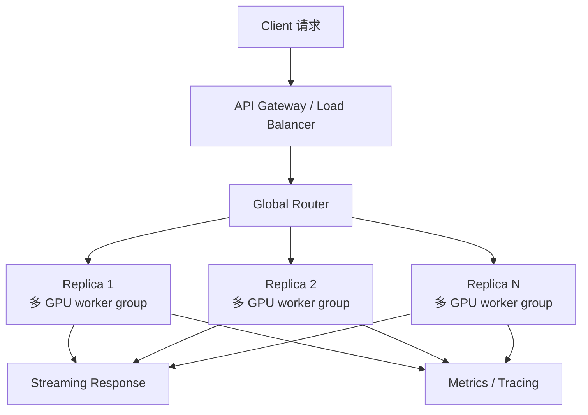

# 多机分布式推理

多机分布式推理，是把一个 LLM 推理服务扩展到多张 GPU、多台服务器，甚至多个资源池上运行。它的目标通常是部署更大的模型、服务更高吞吐、支持更长上下文，或隔离不同类型的在线流量。

一句话理解：

> 多机分布式推理不是简单“多加几台机器”，而是把模型、请求、KV Cache 和通信路径组织成可控的系统。

单机推理服务已经包含 API、tokenizer、scheduler、GPU executor、KV Cache 和 streaming。多机系统是在这些单机 worker 之上，再增加路由、并行、跨节点通信、全局调度、故障恢复和容量规划。

## 为什么需要多机

单机推理会遇到几个上限。

第一是模型太大。模型权重、KV Cache、临时 buffer 加起来可能超过一台机器或一张 GPU 的显存。

第二是吞吐不够。单个 replica 可以服务的 tokens/s 有限，高并发在线服务需要多个 replica 分担流量。

第三是上下文太长。长上下文会让 KV Cache 占用快速增加，单机可承载并发下降。

第四是流量类型复杂。交互式请求、批量任务、RAG、Agent、长文档分析可能需要不同资源池。

多机推理就是为了解决这些问题，但它会引入新的成本：

- GPU 间通信。
- 跨节点网络延迟。
- 分布式调度。
- KV Cache 放置和迁移。
- 节点故障恢复。
- 容量和拓扑规划。

## 多机推理的总体形态

一个多机推理服务通常由入口层、路由层、多个推理 worker 或模型 replica 组成。

这里的 replica 不一定是一张 GPU。对于大模型，一个 replica 可能是一组 GPU，内部使用 tensor parallel、pipeline parallel 或 expert parallel。

所以多机推理有两个层次：

- replica 之间：多个副本分摊请求。
- replica 内部：多 GPU 协作执行同一个模型。

理解这两个层次很重要。前者主要影响吞吐和负载均衡，后者主要影响单个请求能不能跑、跑得多快。

## Data Parallel：多副本服务

Data Parallel 在推理服务里最直观：复制多个模型副本，每个副本处理不同请求。

例如有 8 张 GPU，每张 GPU 都能放下一个模型，就可以启动 8 个 replica。路由器把不同请求分配给不同 replica。

优点是：

- 架构简单。
- 副本之间通信少。
- 容易水平扩展吞吐。
- 一个 replica 故障时可以摘除。

缺点是：

- 每个 replica 都要保存完整模型权重。
- 如果模型单卡放不下，需要其他并行方式。
- 负载均衡会影响缓存命中率和尾延迟。

Data Parallel 适合模型能被单个 worker group 放下，并且主要目标是提高请求吞吐的场景。

## Tensor Parallel：切模型矩阵

Tensor Parallel 把模型中的大矩阵切到多张 GPU 上一起计算。

例如一个线性层权重太大，单张 GPU 放不下或计算太慢，就可以把矩阵按列或按行切分。每张 GPU 算一部分结果，然后通过通信合并。

优点是：

- 可以部署单卡放不下的大模型。
- 单层计算分散到多张 GPU。
- 对大矩阵计算比较有效。

缺点是：

- 每层都可能需要通信。
- 通信延迟直接影响单请求 latency。
- GPU 之间需要高速互联。
- 跨节点 tensor parallel 成本很高。

Tensor Parallel 常见通信包括 all-reduce、all-gather、reduce-scatter。它适合在同节点高速互联 GPU 之间使用，跨节点时要非常谨慎。

## Pipeline Parallel：切模型层

Pipeline Parallel 把模型不同层放到不同 GPU 或不同节点上。

例如一个 80 层模型，可以前 20 层放在 GPU 0，中间 20 层放在 GPU 1，后面层继续放到其他 GPU。请求按层顺序流过这些 GPU。

优点是：

- 可以把超大模型按层切开。
- 每张 GPU 只存一部分层权重。
- 适合模型层数很多、单节点放不下的场景。

缺点是：

- 单个请求必须按 pipeline 顺序经过各阶段。
- 如果 batch 或 micro-batch 不合适，容易出现 pipeline bubble。
- 流式 Decode 中每步都要走完整 pipeline，延迟可能变高。
- 故障和调度更复杂。

Pipeline Parallel 在训练中很常见，推理中也可用，但在线低延迟服务要仔细评估。

## Expert Parallel：切 MoE 专家

Expert Parallel 常用于 MoE 模型，把不同专家放在不同 GPU 上。

它的目标是让一个 MoE 模型的专家参数分布到多张卡，而不是每张卡保存所有专家。

优点是：

- 能部署专家参数量很大的 MoE 模型。
- 每个 token 只访问部分专家。
- 专家计算可以分散。

缺点是：

- 需要 dispatch/combine。
- 通常涉及 all-to-all 通信。
- 专家负载可能不均。
- 跨节点专家通信会显著影响尾延迟。

Expert Parallel 通常要和 MoE 专家负载观测、通信优化、专家放置一起考虑。

## Sequence / Context Parallel

长上下文会让 attention 和 KV Cache 压力变大。某些系统会使用 sequence parallel 或 context parallel，把序列维度或上下文分到多个 GPU 上。

它的目标是处理更长上下文或降低单卡 KV Cache 压力。

这类并行的难点在于 attention 需要看到上下文信息，跨 GPU 会引入额外通信。实现方式和收益强依赖 attention 算法、模型结构和推理引擎。

对于刚入门读者，可以先记住：

- Tensor Parallel 切矩阵。
- Pipeline Parallel 切层。
- Expert Parallel 切专家。
- Data Parallel 切请求。
- Sequence / Context Parallel 切序列或上下文。

不同并行方式解决不同瓶颈，也引入不同通信。

## 通信为什么是核心瓶颈

多机推理的核心代价是通信。

单机单卡推理中，模型计算主要在一张 GPU 内完成。多 GPU 或多节点后，GPU 之间需要交换中间结果、KV Cache、专家输入、并行计算结果。

常见通信模式包括：

| 通信模式 | 常见场景 | 直观含义 |
| --- | --- | --- |
| all-reduce | tensor parallel | 多张 GPU 计算部分结果后求和同步 |
| all-gather | tensor/context parallel | 收集各 GPU 的分片 |
| reduce-scatter | tensor parallel | 汇总后再分发分片 |
| all-to-all | MoE expert parallel | 每张 GPU 向其他 GPU 发送 token |
| point-to-point | pipeline parallel / KV transfer | 一个 stage 发给下一个 stage |

通信慢会直接影响 latency。尤其 Decode 每生成一个 token 都要走一轮计算，任何每步通信都会被重复放大。

所以多机推理常常不是 GPU 算不动，而是网络和同步拖慢了整体。

## 节点内和节点间差异

同一台服务器内的 GPU 通常通过 NVLink、NVSwitch 或 PCIe 连接。不同服务器之间依赖 InfiniBand、RoCE 或以太网。

一般来说：

- 节点内通信更快、更稳定。
- 节点间通信延迟更高，带宽更有限。
- 跨节点同步更容易造成尾延迟。
- 拓扑不合理会让通信绕远路。

因此并行策略要尽量利用拓扑：

- Tensor Parallel 尽量放在同节点高速互联内。
- 跨节点更适合放多个 replica 或较粗粒度并行。
- MoE 专家跨节点时要关注 all-to-all 成本。
- Prefill/Decode 分离部署要关注 KV 传输路径。

多机系统不能只数 GPU 数量，还要看 GPU 之间怎么连。

## 多机中的 KV Cache

KV Cache 在多机推理里更复杂。

如果一个请求只在一个 replica 内执行，KV Cache 可以留在该 replica 上。后续 Decode 必须继续路由到同一个 replica，否则就需要迁移 KV Cache 或重新 Prefill。

这带来几个问题：

- 请求和 KV Cache 要绑定到某个 worker group。
- 路由器要知道请求当前在哪里。
- worker 失败时，KV Cache 可能丢失。
- 如果迁移请求，KV Cache 传输成本很高。
- Prefix Cache 的命中和 worker 选择有关。

所以多机推理中，路由不只是负载均衡，也要考虑状态放置。

无状态 HTTP 服务可以随便换机器处理请求，但 LLM Decode 是有状态的：KV Cache 就是这个状态。

## 路由策略

多机推理需要全局路由器，把请求分配给合适的 replica 或 worker group。

路由器可能考虑：

- 哪个 replica 队列短。
- 哪个 replica 显存余量多。
- 哪个 replica 有 prefix cache 命中。
- 哪个 replica 已经保存该会话的 KV Cache。
- 请求属于哪个租户或优先级。
- 请求 input/output length 预估。
- 当前 SLO 是否紧张。
- 节点是否健康。

简单 round-robin 容易实现，但对 LLM 服务不一定够用。因为不同请求成本差异很大，一个长上下文请求和一个短问答请求不能当作同等负载。

更好的路由通常要结合队列长度、token 数、KV Cache、缓存命中和健康状态。

## 全局调度和本地调度

多机系统通常有两层调度：

- 全局调度：决定请求去哪个 replica 或资源池。
- 本地调度：单个 worker 内部决定请求何时进入 GPU。

全局调度看集群状态，本地调度看单机队列、batch、KV Cache 和 GPU 执行。

两层调度必须协同。如果全局路由只看请求数，可能把很多长请求打到同一台机器；如果本地调度只优化 GPU 利用率，可能让某些租户尾延迟很差。

一个实用原则是：

> 全局调度决定“去哪里”，本地调度决定“什么时候算”。

## 分布式推理中的失败

多机系统一定要考虑失败。

常见失败包括：

- 单个 GPU 报错。
- 某个 worker 进程退出。
- 节点网络抖动。
- NCCL 或通信库卡住。
- 某个 rank 慢或失联。
- KV Cache 状态丢失。
- API gateway 到 worker 的连接中断。

对于 Data Parallel replica，某个副本失败后可以摘除，流量切到其他副本。对于 Tensor Parallel 或 Pipeline Parallel 组成的 worker group，只要一个 rank 失败，整个 replica 往往都不可用。

这就是分布式推理的一个现实问题：并行组越大，任意一个组件失败影响越大。

## 故障恢复

故障恢复要回答几个问题：

- 正在执行的请求怎么办。
- 已经生成的 token 是否还能继续。
- KV Cache 是否可以恢复。
- 是否重新 Prefill。
- worker group 是否重启。
- 上游是否重试。
- 是否会重复输出或破坏流式响应。

多数在线系统会把 worker 级故障视为请求失败，让客户端或上游重试。对于长上下文请求，重试成本很高，因为可能要重新 Prefill。

如果业务对可靠性要求很高，可以考虑：

- 请求级 checkpoint。
- prefix cache 降低重算成本。
- worker 健康探测和快速摘除。
- replica 冗余。
- 对长任务做异步任务化。

但这些都会增加系统复杂度。

## 容量规划

多机推理容量规划不能只问“需要多少 GPU”。

至少要估算：

- 模型权重占用。
- 每个请求的 KV Cache 占用。
- 平均 input length。
- 平均 output length。
- 请求并发。
- TTFT / TPOT / end-to-end SLO。
- 每种并行方式的通信成本。
- replica 数量。
- 失败冗余。
- 峰值流量和突发流量。

一个简单思路是先从单机 benchmark 得到：

- 单 replica 的 Prefill tokens/s。
- 单 replica 的 Decode tokens/s。
- 单 replica 在 SLO 下的最大并发。
- 每请求 KV Cache 显存占用。

再结合目标流量，估算需要多少 replica 和每个 replica 需要多少 GPU。

## 多机和 Prefill/Decode 分离

Prefill/Decode 分离部署经常和多机推理结合。

例如：

- 一组 GPU 专门做 Prefill。
- 另一组 GPU 专门做 Decode。
- Prefill 完成后把 KV Cache 传给 Decode worker。

这种方式能隔离 Prefill 和 Decode 的资源竞争，但会引入 KV transfer。

在多机环境中，要特别关注：

- Prefill worker 和 Decode worker 的拓扑距离。
- KV Cache 传输带宽。
- Decode worker 的 KV Cache 容量。
- Prefill 注入速度是否压垮 Decode queue。
- 网络是否和模型并行通信争抢带宽。

分离部署不是免费扩展，它把一部分计算干扰换成了网络和调度问题。

## 多机和缓存

缓存会影响多机路由。

例如 Prefix Cache 只在某些 worker 上存在。一个请求如果路由到有缓存的 worker，TTFT 可能更低；如果路由到队列更短但没有缓存的 worker，可能需要重新 Prefill。

多机缓存要考虑：

- cache 是本地的还是共享的。
- cache key 是否包含模型、租户、adapter 和模板版本。
- cache 命中是否值得等待。
- cache 是否会造成热点 worker。
- cache eviction 是否影响尾延迟。

多机系统里，缓存命中率和负载均衡经常冲突。

## 多机和 Benchmark

分布式推理 Benchmark 必须包含通信和调度。

只测单卡 kernel 或单机 tokens/s，不能代表多机线上效果。

需要明确：

- 模型版本。
- 并行策略。
- GPU 型号和数量。
- 节点内互联。
- 节点间网络。
- replica 数量。
- input/output length 分布。
- 并发和请求到达分布。
- 是否启用 Prefix Cache、量化、speculative decoding。
- 是否跨节点。

多机 Benchmark 还要报告尾延迟，因为网络抖动和最慢 rank 经常影响 p95/p99。

## 常见优化方向

多机分布式推理优化，重点是减少不必要通信、提高负载均衡、控制状态放置和保护 SLO。

### 1. 先选合适并行策略

如果模型单卡能放下，优先用多 replica 提高吞吐。只有模型放不下或单 replica 性能不足时，再引入 tensor parallel、pipeline parallel 或 expert parallel。

并行越复杂，通信和故障面越大。

### 2. 拓扑感知部署

把通信频繁的 GPU 放在高速互联范围内。Tensor Parallel 尽量在同节点内，跨节点通信要谨慎。

部署时要知道 GPU、NIC、NUMA、PCIe、NVLink 或网络拓扑。

### 3. 路由要理解 token 成本

请求数不是负载。一个长 prompt、长输出请求可能比多个短请求更重。

路由器应该尽量参考 input length、max_tokens、队列等待、KV Cache 使用和缓存命中。

### 4. 避免跨节点状态迁移

KV Cache 很大，迁移成本高。尽量让一个请求在同一个 worker group 内完成。

如果必须迁移，要明确是否值得，以及失败时如何回退。

### 5. 控制并行组大小

并行组越大，单个请求可能使用更多 GPU，但通信和失败概率也增加。

要用 benchmark 找到合适的 tensor parallel size、pipeline stages 和 replica 数量，而不是盲目把 GPU 都绑成一个大组。

### 6. 分离不同流量类型

交互式短请求、长文档分析、批量任务、Agent 任务可以使用不同资源池。

这样可以避免批量任务占满资源，影响交互式请求 SLO。

### 7. 做故障隔离

多机服务要能快速摘除异常 worker，避免一个慢节点拖垮整个集群。

需要关注健康检查、超时、通信错误、rank hang、自动重启和流量切换。

## 该观察哪些指标

评估多机分布式推理时，建议观察：

| 指标 | 说明 |
| --- | --- |
| replica utilization | 各 replica 利用率是否均衡 |
| queue wait by replica | 每个 replica 的排队时间 |
| TTFT | 首 token 是否受路由、Prefill 和通信影响 |
| TPOT | Decode 是否受通信和最慢 rank 影响 |
| p95 / p99 latency | 尾延迟是否恶化 |
| tokens/s per replica | 每个 replica 的 token 吞吐 |
| GPU utilization by rank | 各 GPU rank 是否均衡 |
| GPU memory by rank | 各 rank 显存是否均衡 |
| interconnect bandwidth | 节点内/节点间通信带宽 |
| collective latency | all-reduce、all-gather、all-to-all 等耗时 |
| KV Cache usage | 各 worker 的 KV Cache 占用 |
| cache hit rate | Prefix Cache 等缓存命中率 |
| worker failure count | worker 或 rank 失败次数 |
| retry count | 请求重试次数 |
| goodput | SLO 内完成的有效吞吐 |

这些指标要按 replica、节点、GPU rank、请求类型、输入长度和输出长度分组看。

## 一个最小例子

假设一个 70B 模型单张 GPU 放不下，一台机器有 8 张 GPU。可以选择：

1. 用 8 张 GPU 做一个 tensor parallel replica。
2. 用 4 张 GPU 做一个 replica，一台机器放 2 个 replica。
3. 跨两台机器做更大的并行组。

如果 4 张 GPU 能放下模型，并且性能满足单请求延迟，方案 2 可能更适合在线服务，因为它有两个 replica，可以同时服务更多请求，也更容易做负载均衡。

如果必须 8 张 GPU 才放下模型，方案 1 更直接，但单机只有一个 replica，请求之间只能在这个 replica 内排队。

如果跨两台机器做一个 replica，模型可能更容易放下，但每层通信跨节点，TPOT 和尾延迟可能变差。

这个例子说明：多机推理不是 GPU 越多越好，而是要在显存、通信、并发、延迟和故障面之间取舍。

## 常见误区

- **误区一：多机就是加机器，吞吐会线性增长。**
  通信、调度、KV Cache 和负载不均都会让扩展效率下降。

- **误区二：请求数均衡就代表负载均衡。**
  LLM 请求成本取决于 input length、output length、KV Cache 和采样参数。

- **误区三：模型并行越大越好。**
  并行组越大，通信越多，失败面越大，不一定更快。

- **误区四：KV Cache 是本地细节，路由不用关心。**
  Decode 是有状态的，KV Cache 放在哪里会直接影响路由和迁移成本。

- **误区五：单机 benchmark 好，多机一定好。**
  多机会引入网络、collective、最慢 rank、全局调度和故障恢复问题。

读完这一节，应该能回答五个问题：

- 多机分布式推理要解决哪些单机上限。
- Data Parallel、Tensor Parallel、Pipeline Parallel、Expert Parallel 分别切分什么。
- 通信为什么会影响 latency、throughput 和尾延迟。
- KV Cache、路由和缓存为什么让多机推理变成有状态系统。
- 应该用哪些指标判断多机推理瓶颈。
