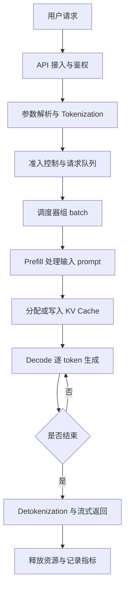

# 推理系统与优化

本目录关注模型进入在线服务后的系统问题：如何降低延迟、提高吞吐、控制显存、隔离租户、处理长尾请求，并让服务行为可测、可复现。

## 本章内容安排

推理系统的学习顺序可以按一条完整链路展开：

1. 先理解一个请求从进入服务到输出 token 的生命周期。
2. 再拆开 Prefill 和 Decode，理解两类计算为什么瓶颈不同。
3. 然后学习指标、Batching、KV Cache、调度和显存管理。
4. 接着进入量化、Speculative Decoding、MoE、分离部署和分布式推理。
5. 最后用 vLLM、TensorRT-LLM、SGLang、RAG / Agent 和 Benchmark 把概念落到工程系统上。

| 顺序 | 主题 | 本章中的作用 |
| --- | --- | --- |
| 1 | 推理请求生命周期 | 建立端到端视角，知道请求经过哪些系统环节。 |
| 2 | Prefill 与 Decode | 理解 LLM 推理的两阶段结构和不同瓶颈。 |
| 3 | 指标体系 | 用 TTFT、TPOT、吞吐、尾延迟、显存和成本描述优化目标。 |
| 4 | Batching | 理解为什么合批能提高吞吐，以及为什么会影响延迟。 |
| 5 | KV Cache | 解释 Decode 阶段为什么需要缓存历史上下文。 |
| 6 | PagedAttention | 理解块式 KV Cache 管理如何降低显存浪费。 |
| 7 | Prefix Cache | 理解共享 prompt 前缀如何减少重复 Prefill。 |
| 8 | 调度策略 | 研究请求队列、优先级、准入控制、抢占和公平性。 |
| 9 | 量化推理 | 用更低精度减少显存、带宽和计算开销。 |
| 10 | Speculative Decoding | 用草稿模型或多 token 预测减少串行解码等待。 |
| 11 | Prefill/Decode 分离部署 | 将两类阶段放到不同资源池，缓解互相干扰。 |
| 12 | MoE 模型推理优化 | 处理专家路由、负载均衡、通信和显存问题。 |
| 13 | 单机推理服务架构 | 梳理一台机器上的模型加载、执行、队列和 API 服务。 |
| 14 | 多机分布式推理 | 扩展到多 GPU、多节点和跨节点并行。 |
| 15 | 缓存体系 | 统一理解 query、embedding、prefix、KV、tool result 等缓存。 |
| 16 | Benchmark 方法 | 设计可复现实验，避免只看单个吞吐数字。 |
| 17 | vLLM | 作为现代开源推理引擎的主线案例。 |
| 18 | TensorRT-LLM | 作为 NVIDIA 高性能推理栈案例。 |
| 19 | SGLang | 作为结构化生成和高性能 runtime 案例。 |
| 20 | RAG / Agent 推理负载 | 研究复合推理链路如何改变延迟、吞吐和可靠性。 |
| 21 | Benchmark 方法与性能剖析 | 把压测、profiling 和容量分析连接起来。 |

## 推理请求生命周期

推理请求不是一次简单的模型函数调用，而是一条端到端系统链路。用户看到的是“输入一句话，模型返回回答”，系统内部实际要完成接入、解析、排队、调度、计算、缓存、流式返回、清理和指标记录。

先用一个简化流程看全貌：

这张图里最重要的点是：**一次请求会在 CPU、GPU、显存、网络和队列之间来回流动**。优化推理系统时，不能只问“模型算得快不快”，还要问“请求在哪里等、显存是否够、batch 是否合理、token 是否及时返回”。

### 1. API 接入与鉴权

请求首先进入网关或推理服务 API。这里通常会做协议处理、鉴权、限流、租户识别、参数校验和 trace id 生成。

这一层主要在 CPU 和网络侧工作。它本身不做大规模矩阵计算，但会影响系统稳定性。如果没有限流和鉴权，高峰期请求可能直接冲垮后端队列；如果没有 trace id，后面就很难定位一次慢请求到底慢在哪里。

### 2. 参数解析与 Tokenization

模型不能直接读取自然语言字符串，需要先把 prompt 变成 token id。服务会解析请求里的模型名、prompt、max tokens、temperature、stop words、stream 等参数，然后调用 tokenizer。

Tokenization 通常在 CPU 上完成。它看起来不像 GPU 计算那样显眼，但在高并发、小模型、短请求场景下也可能成为瓶颈。对于多模态请求，这一步还可能包括图片、音频或视频输入的预处理。

### 3. 准入控制与请求队列

服务不能把所有请求都立刻送进 GPU。系统需要先判断当前显存、队列长度、并发数和 SLO 是否允许接收新请求。

准入控制决定“这个请求能不能进系统”，请求队列决定“它什么时候被处理”。这一步常见策略包括：

- 超过最大队列长度就拒绝或降级。
- 超过最大上下文长度就直接返回错误。
- 根据租户、优先级或付费等级决定排队顺序。
- 对超长 prompt 或超大输出上限设置更严格限制。

如果没有这一步，系统在压力过大时可能不是慢一点，而是进入显存不足、请求超时、整体雪崩。

### 4. 调度器组 batch

调度器负责把多个请求组合成适合 GPU 执行的 batch。它会决定哪些请求一起做 Prefill，哪些请求一起做 Decode，哪些请求继续等待。

这一步是推理系统和普通离线推理脚本最大的差异之一。离线脚本可以一次处理一个固定输入；在线服务面对的是不断到来的请求，而且每个请求的输入长度、输出长度、到达时间都不同。

调度器要在两个目标之间取舍：

- batch 大一些，GPU 利用率更高，总吞吐更好。
- 等待时间短一些，单个用户的延迟更低。

所以推理调度不是简单地“越快执行越好”，而是要在吞吐、延迟、显存和公平性之间做权衡。

### 5. Prefill：处理输入 prompt

Prefill 阶段会把输入 prompt 一次性送入模型，计算每个输入 token 的中间表示，并生成后续 Decode 需要的 KV Cache。

可以把 Prefill 理解成“模型先读完题目”。如果 prompt 很长，Prefill 会比较重，因为模型要处理大量输入 token。用户感受到的首 token 延迟通常和 Prefill 密切相关。

在系统层面，Prefill 的特点是：

- 输入 token 多时计算量大。
- 更容易形成大矩阵计算，GPU 算力利用率通常较高。
- 会一次性写入较多 KV Cache，占用显存。
- 长 prompt 请求可能拖慢同 batch 里的其他请求。

### 6. KV Cache：保存历史上下文

模型生成第一个 token 后，后续每生成一个 token 都需要参考前面的上下文。如果每次都重新计算全部历史 token，成本会非常高。

KV Cache 的作用是把历史 token 在 Attention 中需要复用的 key/value 保存下来。这样 Decode 阶段只需要处理新生成的 token，并读取已有 KV Cache。

KV Cache 是推理系统的核心资源之一，因为它会随着下面几个因素增长：

- batch 里同时服务的请求数量。
- 每个请求的输入长度。
- 每个请求已经生成的输出长度。
- 模型层数、hidden size、注意力头数和精度。

很多推理系统优化，本质上都是在解决 KV Cache 的分配、复用、压缩、迁移和释放问题。

### 7. Decode：逐 token 生成

Decode 阶段会不断重复同一个动作：模型根据已有上下文预测下一个 token，把这个 token 追加回上下文，再继续预测下一个 token。

这也是大语言模型推理最有代表性的地方：**输出不是一次性生成完，而是一个 token 一个 token 生成出来的。**

Decode 的系统特点是：

- 单步计算可能不大，但必须串行重复很多次。
- 每一步都要读取模型权重和 KV Cache。
- 输出越长，Decode 循环次数越多。
- 并发越高，KV Cache 显存压力越大。

因此，Prefill 和 Decode 虽然都调用同一个模型，但系统瓶颈并不完全相同。Prefill 更像“读输入”，Decode 更像“边查历史边写答案”。

### 8. Detokenization 与流式返回

模型输出的是 token id，服务需要把 token id 转回文本，这一步叫 detokenization。对于开启 streaming 的请求，服务会边生成边返回，而不是等完整回答结束后一次性返回。

流式返回的价值是降低用户感知延迟。即使总生成时间没有变，只要首 token 更早返回，用户就会感觉系统更快。

这里需要注意两点：

- streaming 不等于模型算得更快，它主要改变返回方式。
- 网络、客户端读取速度、代理缓冲策略也会影响 token 返回节奏。

### 9. 停止条件与资源释放

Decode 不会无限继续。请求会在满足某个停止条件后结束，例如：

- 生成了 EOS token。
- 达到 max tokens。
- 命中了 stop words。
- 用户取消请求。
- 请求超时。
- 服务端触发安全或策略限制。

请求结束后，系统需要释放占用的 KV Cache、更新队列状态、关闭 stream、记录日志和指标。如果资源释放不及时，显存会被“已经结束的请求”占住，后续请求就会变慢甚至失败。

### 10. 日志、指标与 Trace

一次请求结束后，推理系统应该留下可分析的数据。常见记录包括：

- input tokens、output tokens、总 token 数。
- queue time、prefill time、decode time、total latency。
- TTFT、TPOT、p50/p95/p99。
- batch size、显存占用、GPU 利用率。
- cache hit rate、错误码、取消原因、租户信息。

没有这些数据，就无法判断优化是否真的有效。比如总延迟上升，可能是排队变长，也可能是 Prefill 变慢，还可能是 Decode token 太多。只看一个总耗时，无法定位问题。

### CPU、GPU、显存和网络分别负责什么

| 环节 | 主要资源 | 常见瓶颈 |
| --- | --- | --- |
| API 接入、鉴权、参数解析 | CPU、网络 | 网关限流、连接数、协议开销 |
| Tokenization | CPU | tokenizer 吞吐、线程池、短请求高并发 |
| 排队与调度 | CPU、内存 | 队列过长、调度策略不合理、锁竞争 |
| Prefill | GPU、显存 | 长 prompt、batch 组织、Attention 计算 |
| KV Cache 管理 | 显存、内存 | 显存容量、碎片、复用率、释放不及时 |
| Decode | GPU、显存带宽 | 逐 token 串行、KV Cache 读取、低 batch 利用率 |
| Streaming 返回 | 网络、CPU | 客户端读取慢、代理缓冲、连接保持 |
| 指标与日志 | CPU、存储 | 日志过多、trace 缺失、指标粒度不够 |

### 一个最小例子

假设用户请求：“解释一下 Transformer 是什么”，并要求最多生成 200 个 token。系统大致会这样处理：

1. API 收到请求，确认用户有权限调用这个模型。
2. 服务把 prompt 转成 token id，比如得到几十个输入 token。
3. 请求进入队列，等待调度器把它和其他请求组成 batch。
4. GPU 执行 Prefill，模型读完整个 prompt，并写入 KV Cache。
5. 模型开始 Decode，先生成第一个 token。
6. 服务把第一个 token 转回文字并通过 stream 返回。
7. Decode 持续进行，每生成一个 token 都追加到上下文里。
8. 生成到 EOS、stop words 或 200 token 上限后停止。
9. 系统释放 KV Cache，记录 TTFT、TPOT、总延迟和 token 数。

从用户角度看，只是“模型回答了问题”。从系统角度看，这是一次跨 CPU、GPU、显存、网络、队列和缓存的协作。

### 常见误区

- **误区一：推理慢就是模型算得慢。**
  实际上慢可能来自排队、tokenization、KV Cache 显存不足、网络返回、日志系统或客户端读取。

- **误区二：GPU 利用率高就代表服务效率高。**
  GPU 忙不代表用户体验好。如果队列太长、首 token 太慢、尾延迟太高，服务仍然不可用。

- **误区三：streaming 能降低总计算量。**
  streaming 主要降低用户感知等待时间，不会自动减少模型需要生成的 token 数。

- **误区四：只优化 Decode 就够了。**
  长 prompt、RAG、Agent、多模态输入会让 Prefill 和输入预处理也变得很重要。

读完这一节，应该能回答三个问题：

- 一个推理请求从进入服务到结束，大致经过哪些阶段。
- 每个阶段主要消耗 CPU、GPU、显存、网络还是队列时间。
- 为什么在线推理系统优化必须看端到端链路，而不能只看模型 forward 本身。

## Prefill 与 Decode

LLM 推理通常分成两个阶段：Prefill 负责一次性处理输入 prompt，Decode 负责一个 token 一个 token 生成输出。Prefill 更像大矩阵计算，Decode 更容易受显存带宽、KV Cache 读取和调度影响。

本节后续重点回答：

- 为什么 Prefill 和 Decode 的计算形态不同。
- TTFT 为什么主要受 Prefill 影响，TPOT 为什么主要受 Decode 影响。
- 长 prompt、长输出、高并发分别会放大哪类瓶颈。

## 指标体系

推理优化必须先定义目标。常见指标包括 TTFT、TPOT、end-to-end latency、p50/p95/p99、tokens/s、requests/s、GPU memory、GPU utilization、cost per token 和 goodput。

本节后续重点回答：

- 延迟、吞吐、成本和稳定性之间如何取舍。
- 为什么平均延迟不够，必须看尾延迟。
- Benchmark 报告里哪些指标能说明问题，哪些指标容易误导。

## Batching

Batching 的核心是把多个请求合在一起执行，让 GPU 一次处理更多工作。传统 static batching 会被最慢请求拖住，现代推理系统更多使用 dynamic batching、continuous batching 或 iteration-level scheduling。

本节后续重点回答：

- 为什么 batch 变大通常能提高吞吐。
- 为什么合批会增加排队等待和尾延迟。
- Prefill-heavy、decode-heavy 和 mixed workload 该如何合批。

## KV Cache

KV Cache 保存历史 token 的 key/value 表示，让 Decode 阶段不用每生成一个 token 都重新计算全部上下文。它是 LLM 推理显存占用和调度复杂度的核心来源之一。

本节后续重点回答：

- KV Cache 为什么随着 batch size 和 sequence length 增长。
- KV Cache 如何影响最大并发、长上下文和显存容量。
- cache eviction、offload、quantization 和复用分别解决什么问题。

## PagedAttention

PagedAttention 把 KV Cache 管理成固定大小的块，类似操作系统里的分页思想。它的价值在于减少显存碎片和重复复制，让系统能容纳更多并发请求。

本节后续重点回答：

- 连续 KV Cache 分配为什么容易浪费显存。
- block table、physical block、copy-on-write 分别解决什么问题。
- PagedAttention 与 continuous batching、prefix cache 如何配合。

## Prefix Cache

Prefix Cache 复用不同请求之间相同的 prompt 前缀，例如 system prompt、工具说明、few-shot 示例或固定 RAG 模板。命中后可以跳过重复 Prefill，降低 TTFT 和 GPU 计算量。

本节后续重点回答：

- 哪些业务场景容易产生可复用前缀。
- prefix cache 命中率如何影响收益。
- prefix cache 与 KV Cache、路由策略、模板规范有什么关系。

## 调度策略

推理调度决定哪些请求先进入 GPU、哪些请求等待、哪些请求被拒绝、哪些请求被迁移或拆分。调度策略会直接影响吞吐、尾延迟、公平性和资源利用率。

本节后续重点回答：

- FCFS、priority、SLO-aware、cache-aware routing 适合什么场景。
- admission control、rate limit、queueing、backpressure 如何保护系统。
- 高并发下如何避免少数长请求拖慢所有请求。

## 量化推理

量化推理用更低精度表示权重、激活或 KV Cache，目标是减少显存占用、内存带宽压力和计算开销。常见方向包括 FP8、INT8、INT4、AWQ、GPTQ 和 weight-only quantization。

本节后续重点回答：

- 权重量化、激活量化和 KV Cache 量化分别影响什么。
- 量化为什么可能提升吞吐，也可能影响质量或稳定性。
- 不同硬件和推理引擎对量化格式有什么限制。

## Speculative Decoding

Speculative Decoding 用一个更快的草稿模型或额外预测头先猜多个 token，再由目标模型验证，从而减少严格逐 token 解码带来的串行等待。

本节后续重点回答：

- draft、verify、acceptance rate 是什么。
- 为什么接受率、草稿模型速度和目标模型 batch 形态共同决定收益。
- Medusa、EAGLE、ngram speculation 等变体解决什么问题。

## Prefill/Decode 分离部署

Prefill/Decode 分离部署把 Prefill 和 Decode 放到不同 GPU 池或不同服务角色中，避免计算密集型 Prefill 与带宽敏感型 Decode 混在一起互相干扰。

本节后续重点回答：

- 分离部署为什么可能提高 goodput 和 SLO 达成率。
- KV Cache 如何从 Prefill worker 传给 Decode worker。
- 分离带来的网络传输、调度复杂度和容量规划问题。

## MoE 模型推理优化

MoE 模型每个 token 只激活部分专家，但系统上会引入专家路由、负载不均、跨卡通信和专家权重放置问题。MoE 推理优化的关键不只是算力，还包括通信和调度。

本节后续重点回答：

- expert parallel、routing、dispatch、combine 的系统代价是什么。
- 热门专家和冷门专家如何导致负载不均。
- MoE 推理中显存、通信和 batch 形态如何影响吞吐。

## 单机推理服务架构

单机推理服务关注一台服务器内的完整执行链路，包括模型加载、tokenizer、请求队列、scheduler、GPU executor、streaming server、metrics 和健康检查。

本节后续重点回答：

- 一个推理服务进程通常由哪些模块组成。
- CPU scheduler 与 GPU executor 如何协作。
- 单机服务如何处理并发、超时、取消请求和显存保护。

## 多机分布式推理

当模型过大、吞吐要求过高或上下文过长时，推理需要扩展到多 GPU、多节点。常见方式包括 tensor parallel、pipeline parallel、expert parallel、data parallel 和分离式 serving。

本节后续重点回答：

- 多 GPU 推理为什么会引入通信瓶颈。
- 不同并行方式如何影响 latency、throughput 和显存。
- 多机推理中网络、调度、失败恢复和容量规划如何处理。

## 缓存体系

推理系统里的缓存不只有 KV Cache。实际服务还可能包含 query cache、embedding cache、retrieval cache、prefix cache、tool result cache、model artifact cache 和 response cache。

本节后续重点回答：

- 每类缓存缓存的是什么，命中后节省哪段开销。
- 缓存命中率、过期策略、一致性和安全隔离如何设计。
- RAG、Agent 和长上下文服务为什么更依赖缓存体系。

## Benchmark 方法

Benchmark 方法关注如何设计实验，让性能数字可解释、可复现、可比较。推理 Benchmark 需要明确模型、硬件、精度、input length、output length、并发、请求分布和 SLO。

本节后续重点回答：

- synthetic workload 和 production trace 各有什么问题。
- 如何区分 prefill-heavy、decode-heavy、mixed workload。
- 为什么必须同时报告 latency、throughput、显存和成本。

## vLLM

vLLM 是现代开源 LLM serving 的重要案例，适合用来学习 PagedAttention、continuous batching、prefix caching、quantization、speculative decoding 和 OpenAI-compatible serving。

本节后续重点回答：

- vLLM 的核心设计如何围绕 KV Cache 和调度展开。
- vLLM 适合哪些在线服务场景，限制在哪里。
- 如何用 vLLM 做基准测试、服务部署和性能调优。

## TensorRT-LLM

TensorRT-LLM 是 NVIDIA 面向高性能 LLM 推理的优化栈，覆盖引擎构建、量化、并行、KV Cache、guided decoding、speculative decoding 和多种硬件优化。

本节后续重点回答：

- TensorRT-LLM 与通用 PyTorch runtime 的差异。
- engine build、kernel optimization、CUDA Graph 和量化如何影响性能。
- 在 NVIDIA GPU 上如何做高吞吐和低延迟部署。

## SGLang

SGLang 同时关注高性能 serving runtime 和结构化生成。它适合学习 RadixAttention、prefix reuse、structured outputs、continuous batching、prefill-decode disaggregation 和多模态 serving。

本节后续重点回答：

- SGLang 如何把生成程序和 runtime 优化结合起来。
- RadixAttention 与 prefix cache 的关系是什么。
- 结构化输出、工具调用和多轮生成如何影响推理系统。

## RAG / Agent 推理负载

RAG / Agent 不是单次模型调用，而是检索、rerank、上下文拼接、工具调用、多轮规划和多次 LLM 调用组成的复合 workload。它会放大尾延迟、缓存复杂度和失败概率。

详见：[RAG 与 Agent 推理负载](rag-agent-workloads.md)

本节后续重点回答：

- RAG / Agent 的端到端延迟如何拆解。
- 检索、工具调用和多轮 LLM 调用如何影响系统容量。
- 如何同时评估质量、延迟、成本和可靠性。

## Benchmark 方法与性能剖析

性能剖析是 Benchmark 之后的解释过程。Benchmark 告诉我们系统表现如何，profiling、trace、kernel timeline、memory profile 和 queue analysis 才能解释为什么。

本节后续重点回答：

- 如何从端到端指标定位到队列、CPU、GPU、网络或缓存瓶颈。
- 如何用 profiling 证据解释 TTFT、TPOT 和尾延迟。
- 如何把实验结果沉淀成容量模型和优化决策。
