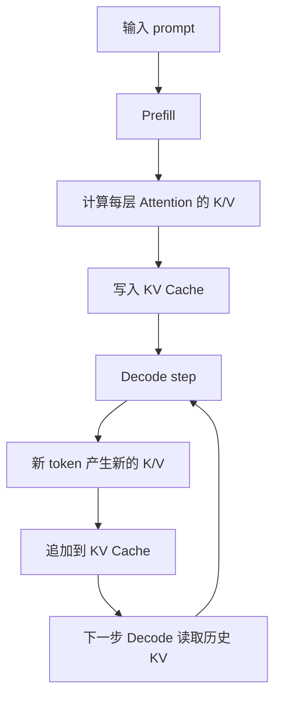

# KV Cache

KV Cache 是 LLM 推理系统里最重要的缓存之一。它保存历史 token 在 Attention 里会反复用到的 key 和 value，让 Decode 阶段不用每生成一个 token 都重新计算全部上下文。

一句话理解：

> KV Cache 用显存换计算时间，让模型在逐 token 生成时可以复用已经读过的上下文。

它的价值很大，但代价也很明显：KV Cache 会随着并发数、输入长度和输出长度增长，占用大量显存，并直接影响最大并发、长上下文能力、调度策略和服务稳定性。

## KV Cache 在哪里出现

KV Cache 出现在 Transformer 的 Attention 里。模型处理 token 时，会把每个 token 的表示变成 query、key、value。当前 token 用 query 去和历史 token 的 key 做匹配，再根据匹配结果读取 value。

简化流程如下：



Prefill 阶段会一次性为输入 prompt 写入 KV Cache。Decode 阶段每生成一个新 token，就会把这个新 token 对应的 key/value 追加到 KV Cache 里。

## 如果没有 KV Cache 会怎样

假设用户输入了 1000 个 token，模型要继续生成 200 个 token。

如果没有 KV Cache：

1. 生成第 1 个输出 token 时，模型处理 1000 个输入 token。
2. 生成第 2 个输出 token 时，模型重新处理 1000 个输入 token 和第 1 个输出 token。
3. 生成第 200 个输出 token 时，模型重新处理前面 1199 个 token。

这样会重复计算大量历史上下文。

有了 KV Cache 后：

1. Prefill 先处理 1000 个输入 token，并保存它们的 KV。
2. Decode 第 1 步只处理新生成位置，同时读取已有 1000 个 token 的 KV。
3. Decode 第 2 步继续读取历史 KV，并追加第 1 个输出 token 的 KV。
4. 后续每一步都只追加新 KV，不重新计算全部历史 token。

所以 KV Cache 的核心收益是减少重复计算，让 Decode 可以持续生成。

## K、V 到底缓存了什么

在每一层 Transformer 里，Attention 会为 token 计算三类向量：

- **Q（Query）**：当前 token 用来“提问”的向量。
- **K（Key）**：历史 token 用来“被匹配”的向量。
- **V（Value）**：历史 token 被读取出来的信息。

Decode 时，当前 token 的 query 会去看历史 token 的 key，然后根据匹配权重读取 value。历史 token 的 key/value 每一步都会用到，所以适合缓存。

需要注意：

- KV Cache 通常按层保存。
- 每一层都有自己的 K 和 V。
- 每个请求都有自己的上下文和 KV Cache。
- 输出越长，KV Cache 会继续增长。

这也是为什么 KV Cache 不只是一个小缓存，而是推理显存管理的核心对象。

## KV Cache 为什么占显存

KV Cache 保存的是模型中间状态，不是原始文本。它的大小和几个因素相关：

| 因素 | 影响 |
| --- | --- |
| batch size / 并发请求数 | 同时服务的请求越多，总 KV Cache 越大 |
| sequence length | 输入越长、输出越长，每个请求缓存越大 |
| 模型层数 | 每层都要保存 K 和 V，层数越多越大 |
| hidden size / attention heads | 每个 token 的 K/V 向量越大，缓存越大 |
| precision | FP16、BF16、FP8、INT8 等精度会影响每个元素占用 |

一个直观估算是：

```text
KV Cache 大小
  约等于 batch 中的总 token 数
  × 模型层数
  × 每层 K/V 的向量大小
  × 2（K 和 V）
  × 每个元素的字节数
```

这个估算不需要死记，重要的是理解增长方向：**并发越高、上下文越长、模型越大，KV Cache 越容易成为显存瓶颈。**

## KV Cache 和 Prefill / Decode 的关系

Prefill 和 Decode 都会使用 KV Cache，但方式不同。

| 阶段 | KV Cache 行为 | 系统影响 |
| --- | --- | --- |
| Prefill | 为输入 prompt 一次性生成并写入 KV Cache | 长 prompt 会带来大规模写入和显存占用 |
| Decode | 每生成一个 token，读取历史 KV，并追加新 token 的 KV | 输出越长，读取和追加越多 |

Prefill 更像“初始化缓存”，Decode 更像“不断读取和扩展缓存”。

如果输入很长，Prefill 会一次性写入大量 KV Cache。如果输出很长，Decode 会不断追加 KV Cache。如果并发很高，很多请求的 KV Cache 会同时驻留在显存里。

## KV Cache 如何影响最大并发

在线服务里，最大并发通常不只由模型计算速度决定，还受 KV Cache 显存容量限制。

假设 GPU 显存里已经放了：

- 模型权重。
- runtime workspace。
- 当前 batch 的临时计算空间。

剩下的显存才能给 KV Cache 使用。每多接一个请求，系统就要为它的上下文预留或分配 KV Cache。请求越多、上下文越长，剩余显存越少。

如果 KV Cache 占满显存，系统可能出现：

- 新请求无法进入。
- 长上下文请求被拒绝。
- batch size 被迫降低。
- Decode 并发下降。
- 触发 OOM 或频繁驱逐。

因此，KV Cache 管理直接决定“同一块 GPU 能同时服务多少请求”。

## KV Cache 如何影响长上下文

长上下文推理不只是 Attention 计算更贵，也会让 KV Cache 更大。

例如：

- 4K 上下文需要缓存几千个 token 的 KV。
- 32K 上下文需要缓存几万个 token 的 KV。
- 如果还有多轮对话、RAG 文档和工具调用记录，KV Cache 会继续增长。

长上下文场景常见问题包括：

- 首 token 慢，因为 Prefill 要处理更多输入。
- 显存占用高，因为输入 token 的 KV 都要保存。
- Decode 每步读取的历史 KV 更多。
- 少数超长请求会挤占大量显存，拖累其他请求。

所以长上下文服务通常需要更严格的 max context length、请求准入、prefix cache、PagedAttention、KV Cache offload 或 KV Cache quantization。

## KV Cache 生命周期

从系统角度看，一个请求的 KV Cache 有生命周期：

1. **创建**：请求进入 Prefill，开始为输入 prompt 生成 KV。
2. **增长**：Decode 每生成一个 token，就追加新 token 的 KV。
3. **读取**：每个 Decode step 都会读取历史 KV。
4. **复用**：如果有 prefix cache，相同前缀的 KV 可能被多个请求复用。
5. **释放**：请求结束、取消、超时或失败后，KV Cache 必须释放。

如果释放不及时，已经结束的请求还占着显存，就会造成隐性容量下降。系统看起来没有很多活跃请求，但显存却很紧张。

## KV Cache 分配为什么困难

KV Cache 管理难，不只是因为它大，还因为请求形态很不规则。

在线请求有几个特点：

- 到达时间不同。
- 输入长度不同。
- 输出长度无法提前准确知道。
- 有些请求会很快结束，有些请求会生成很久。
- 有些请求会被用户取消或超时中断。

如果系统给每个请求预留一大块连续显存，短请求可能浪费很多空间；如果按需增长，又可能造成显存碎片。连续空间不够时，即使总剩余显存看起来还不少，也可能无法放下新的 KV Cache。

这就是后面要讲 PagedAttention 的原因：它把 KV Cache 分成块，减少连续分配带来的浪费和碎片问题。

## KV Cache 和 Batching 的关系

Batching 会让多个请求同时执行，也会让多个请求的 KV Cache 同时驻留。

Batching 的收益是 GPU 吞吐更高，但代价是显存压力更高：

- batch 里请求越多，总 KV Cache 越大。
- batch 里长上下文越多，KV Cache 越大。
- Decode 并发越高，活跃序列越多。
- 输出越长，每个请求的 KV Cache 越长。

因此，调 batch size 时不能只看 tokens/s，也要看 KV Cache usage、OOM、拒绝率、p95/p99 和 active sequences。

一个 batch 策略如果让吞吐提高 20%，但显存长期接近上限、尾延迟恶化、超长请求频繁失败，它就不一定是好策略。

## KV Cache 和调度的关系

调度器不只是决定谁先算，还要考虑谁占多少 KV Cache。

常见调度问题包括：

- 是否允许超长上下文请求进入。
- 是否优先服务快要完成的请求，释放 KV Cache。
- 是否限制单个租户占用过多 KV Cache。
- 是否把长 prompt 请求和短请求分开调度。
- 是否根据剩余生成长度预测未来 KV Cache 占用。

如果调度器只看请求数量，不看 KV Cache 占用，就可能让少数长上下文请求占满显存，导致大量短请求排队。

## 常见优化方向

KV Cache 优化通常不是单点技巧，而是一组围绕“显存容量、访问速度、复用率、稳定性”展开的系统策略。可以先用一张表建立全局视角：

| 方向 | 作用 | 代价或风险 |
| --- | --- | --- |
| PagedAttention / block 管理 | 减少显存碎片，提高容量利用率 | runtime 更复杂 |
| Prefix cache | 复用相同 prompt 前缀的 KV | 需要前缀匹配和缓存管理 |
| KV Cache quantization | 用更低精度保存 KV | 可能影响输出质量或稳定性 |
| KV Cache offload | 把部分 KV 放到 CPU 或其他存储 | 可能增加访问延迟 |
| Context length limit | 限制最大上下文 | 会限制应用能力 |
| Cache eviction | 驱逐低价值或过期缓存 | 可能导致重新计算 |
| Request admission | 拒绝超出容量的请求 | 需要明确策略和用户反馈 |

这些优化不是互斥的。实际系统通常会组合使用，例如用 PagedAttention 管理显存块，用 prefix cache 复用公共前缀，用准入控制限制超长请求，用量化或 offload 扩大可承载上下文。

### PagedAttention / block 管理

最直接的问题是：KV Cache 很大，而且每个请求长度不同。如果系统要求每个请求都占用一段连续显存，就容易产生两类浪费。

第一类是预留浪费。系统不知道请求最终会生成多少 token，如果一开始给它预留太多空间，短请求会浪费显存。

第二类是碎片浪费。请求不断开始和结束后，显存里会留下很多大小不一的空洞。即使总剩余显存不少，也可能找不到一段足够大的连续空间放新的 KV Cache。

PagedAttention 的思想是把 KV Cache 切成固定大小的块。请求不再需要一整段连续空间，而是持有一组 block。逻辑上它还是一条连续上下文，物理上可以分散在不同 block 里。

它解决的核心问题是：

- 减少连续显存分配带来的碎片。
- 让请求按需增长 KV Cache，而不是一次性预留过多。
- 请求结束后可以回收 block，供其他请求复用。
- 支持更灵活的 batching 和调度。

代价是 runtime 更复杂。系统要维护 block table、空闲 block、引用关系、释放逻辑和可能的 copy-on-write。后面单独写 PagedAttention 时会展开这些细节。

### Prefix cache

Prefix cache 解决的是“很多请求前缀相同，为什么还要重复 Prefill”的问题。

在线服务里，经常会出现大量相同或高度相似的 prompt 前缀，例如：

- 固定 system prompt。
- 固定工具说明。
- 固定安全策略说明。
- 固定 few-shot 示例。
- 固定 RAG 模板。
- 多轮对话里的历史前缀。

如果这些前缀每次都重新 Prefill，就会重复计算，也会重复生成相同的 KV Cache。Prefix cache 会把公共前缀对应的 KV Cache 保存下来。新请求命中相同前缀时，可以直接复用这段 KV。

它的收益主要体现在：

- 降低 Prefill 计算量。
- 降低 TTFT。
- 提高固定模板类业务的吞吐。
- 减少重复写入 KV Cache。

但 prefix cache 也有几个注意点：

- 前缀必须能可靠匹配，不能因为空格、模板版本、tokenization 差异导致误判。
- 缓存需要过期和淘汰策略，否则会占用大量显存或内存。
- 多租户场景要注意隔离，不能把一个租户的上下文错误复用给另一个租户。
- prefix cache 命中率低时，管理成本可能大于收益。

所以 prefix cache 适合前缀稳定、请求量大、模板复用明显的场景。

### KV Cache quantization

KV Cache quantization 是用更低精度保存 KV Cache，例如从 FP16/BF16 降到 FP8、INT8 或其他低比特格式。它的目标是降低显存占用和显存带宽压力。

它能解决的问题包括：

- 同样显存下容纳更多并发请求。
- 支持更长上下文。
- 降低 Decode 阶段读取 KV Cache 的带宽压力。
- 减少因为 KV Cache 过大导致的 OOM。

但 KV Cache 量化和权重量化不完全一样。KV Cache 是运行时动态产生的中间状态，会直接参与后续 Attention 计算。量化误差可能影响模型对历史上下文的读取，尤其是长上下文、复杂推理或对细节敏感的任务。

使用 KV Cache quantization 时要重点评估：

- 输出质量是否下降。
- 长上下文任务是否更容易丢失细节。
- 不同模型结构对 KV 量化是否敏感。
- 硬件和推理引擎是否原生支持对应格式。
- 量化和反量化开销是否抵消收益。

它适合显存压力明显、质量验证充分、硬件支持较好的场景。

### KV Cache offload

KV Cache offload 是把一部分 KV Cache 从 GPU 显存移到 CPU 内存、其他 GPU、远端内存或更低层级存储。它的目标是扩大可承载上下文和并发。

它通常用于下面几类场景：

- GPU 显存不足，但 CPU 内存相对充足。
- 请求上下文很长，不是每一段 KV 都会频繁访问。
- 希望用更低成本资源承载冷 KV。
- 多机或分离式 serving 中需要在节点间移动 KV。

Offload 的核心代价是访问延迟和带宽。Decode 每一步都需要读取历史 KV，如果需要频繁从慢速设备搬回 GPU，TPOT 会变差，输出可能卡顿。

因此，offload 不能简单理解为“把 KV 放到 CPU 就好了”。它需要配合策略：

- 哪些 KV 是热的，必须留在 GPU。
- 哪些 KV 是冷的，可以 offload。
- 什么时候预取回 GPU。
- 传输是否能和计算重叠。
- offload 失败或带宽拥塞时如何降级。

Offload 更像容量扩展手段，不是免费的性能优化。

### Context length limit

限制上下文长度是最简单、最有效、也最容易被忽视的优化。

每个请求允许的最大上下文越长，最坏情况下的 KV Cache 占用就越高。一个 128K 上下文请求可能占用大量显存，导致许多短请求排队甚至被拒绝。

Context length limit 可以按多种方式做：

- 设置全局最大上下文长度。
- 按模型设置不同上限。
- 按租户、优先级或套餐设置上限。
- 对 RAG 文档数量和 chunk 总 token 数设置上限。
- 对输出 max tokens 设置上限。
- 对异常长请求走单独队列。

它的代价是限制应用能力。用户可能确实需要长文档、长对话或长代码上下文。工程上通常不是一刀切，而是把长上下文当作更昂贵的资源来管理。

更合理的做法是：

- 默认限制普通请求长度。
- 对长上下文请求设置更高成本或更低并发。
- 对超长输入做压缩、摘要或检索筛选。
- 用指标观察长请求对 p95/p99 和 KV Cache usage 的影响。

### Cache eviction

Cache eviction 是在容量不足时驱逐低价值缓存。这里的缓存可能包括 prefix cache，也可能包括被 offload 或暂存的 KV。

驱逐策略要回答一个问题：**显存不够时，谁应该被踢出去？**

常见考虑因素包括：

- 最近是否使用过。
- 命中频率高不高。
- 重新计算成本高不高。
- 属于哪个租户或优先级。
- 是否正在服务活跃请求。
- 占用空间是否过大。

简单的 LRU 可以作为起点，但不一定总是合适。例如一个很大的 prefix 最近刚用过，但命中概率很低，保留它可能不如保留多个小而高频的 prefix。

驱逐的风险是重新计算。如果驱逐了后续马上要用的 KV，系统可能需要重新 Prefill，导致 TTFT 上升。驱逐策略不好时，系统会出现 cache thrashing：反复驱逐、反复重算，吞吐和延迟都变差。

所以 eviction 需要和 cache hit rate、recompute cost、显存压力一起观察。

### Request admission

Request admission 是在请求进入系统前判断：当前资源是否允许接收它。

KV Cache 相关的准入控制通常会看：

- 当前剩余 KV Cache 容量。
- 请求 input tokens。
- 请求 max output tokens。
- 当前 active sequences。
- 租户配额和优先级。
- 目标 TTFT / TPOT / p99。

如果系统明知接收一个请求会导致 OOM 或严重拖慢其他请求，最好的策略可能不是硬接，而是拒绝、排队、降级或路由到其他资源池。

常见策略包括：

- 超过最大上下文直接拒绝。
- 超过当前容量则排队。
- 对低优先级长请求限流。
- 对高价值请求保留容量。
- 对可能产生大量 KV 的请求提前估算成本。

准入控制的难点在于用户体验。拒绝请求需要明确反馈，排队需要可控等待，降级需要说明策略。否则系统虽然保护住了 GPU，却让用户感到不可预测。

### 组合使用：一条实际优化路径

实际排查 KV Cache 问题时，可以按下面顺序思考：

1. 先看 KV Cache used memory、active sequences、context length distribution，确认是不是 KV 压力。
2. 如果显存碎片和利用率差，优先考虑 block 管理或 PagedAttention。
3. 如果大量请求共享固定前缀，考虑 prefix cache。
4. 如果长上下文和高并发都需要保留，评估 KV Cache quantization。
5. 如果显存容量仍然不足，再评估 offload，但要重点测试 TPOT。
6. 如果少数超长请求拖垮系统，先做 context length limit 和 admission control。
7. 如果缓存命中率低且占用大，补 eviction 策略。

核心原则是：**先定位 KV Cache 问题的来源，再选择优化手段**。碎片、容量、复用率、带宽和长尾请求，对应的解决方法并不一样。

## 该观察哪些指标

分析 KV Cache 问题时，建议观察：

| 指标 | 说明 |
| --- | --- |
| KV Cache used memory | 当前 KV Cache 占用多少显存 |
| KV Cache utilization | 分配出去的 KV 块是否被有效使用 |
| active sequences | 当前活跃生成序列数量 |
| total context tokens | 当前系统里所有请求的上下文 token 总量 |
| max context length | 当前请求是否接近上下文上限 |
| cache hit rate | prefix cache 或其他缓存命中率 |
| eviction count | KV 或 prefix cache 被驱逐次数 |
| OOM count | 是否因为 KV Cache 触发显存不足 |
| rejection rate | 是否因为容量限制拒绝请求 |
| p95 / p99 latency | KV 压力是否导致尾延迟变差 |

KV Cache 的问题经常不是单个指标能说明的。比如显存占用高可能是正常高并发，也可能是长请求过多、释放不及时、碎片严重或 cache 策略不合理。

## 一个最小例子

假设一个服务同时处理 3 个请求：

| 请求 | 输入长度 | 已生成输出 | 当前 KV Cache 长度 |
| --- | --- | --- | --- |
| A | 500 tokens | 20 tokens | 520 tokens |
| B | 4000 tokens | 10 tokens | 4010 tokens |
| C | 200 tokens | 200 tokens | 400 tokens |

虽然只有 3 个请求，但 B 的 KV Cache 远大于 A 和 C。调度器如果只看请求数，会低估 B 对显存和 Decode 的影响。

如果 B 是 RAG 请求，带了大量检索上下文，它可能显著拉高显存占用和尾延迟。系统可能需要对这类请求做单独队列、上下文压缩、prefix cache 或更严格的准入控制。

## 常见误区

- **误区一：KV Cache 只是一个小优化。**
  实际上它决定 Decode 是否能高效运行，也决定长上下文和高并发能否承载。

- **误区二：有了 KV Cache，Decode 就没有历史上下文成本。**
  KV Cache 避免重复计算历史 token，但每步 Decode 仍然要读取历史 KV。

- **误区三：显存够放模型权重就够了。**
  在线推理还需要大量 KV Cache。很多时候显存瓶颈来自 KV Cache，而不是权重。

- **误区四：只限制请求数就能控制容量。**
  不同请求上下文长度差异巨大，控制请求数不等于控制 KV Cache 占用。

- **误区五：请求结束后系统自然就没压力了。**
  如果 KV Cache 释放、复用或驱逐做不好，结束请求也可能留下显存管理问题。

读完这一节，应该能回答五个问题：

- KV Cache 保存的是什么，为什么 Decode 需要它。
- KV Cache 为什么会随着并发、输入长度和输出长度增长。
- KV Cache 如何影响最大并发、长上下文和显存容量。
- KV Cache 管理为什么会遇到碎片、释放和调度问题。
- PagedAttention、prefix cache、quantization、offload 分别在解决什么方向的问题。
