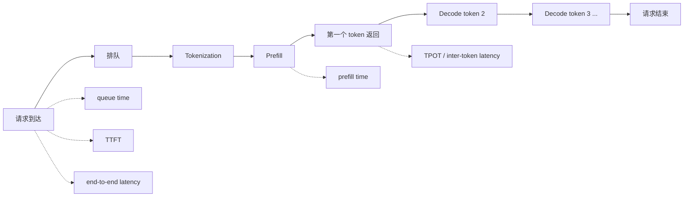

# 指标体系

推理系统优化必须先定义指标。没有指标，优化就会变成凭感觉调参数：看到 GPU 利用率高就以为系统好，看到平均延迟低就以为用户体验好，看到 tokens/s 高就以为成本低。

推理系统的指标不能只看一个数字，而要同时回答四类问题：

- **用户体验**：用户多久看到第一个 token，输出是否稳定。
- **系统吞吐**：单位时间能服务多少请求、生成多少 token。
- **资源效率**：GPU、显存、CPU、网络是否被合理使用。
- **成本与稳定性**：每个 token 花多少钱，尾延迟和失败率是否可控。

## 一条请求上的指标位置

先把指标放回请求生命周期里看：

这张图说明一个关键点：**同一个“慢”字，可能慢在不同位置**。慢在排队、慢在 Prefill、慢在 Decode、慢在网络返回，对应的优化方法完全不同。

## 延迟指标

延迟指标描述“一个请求要等多久”。推理服务里常见的延迟指标有：

| 指标 | 含义 | 主要说明什么 |
| --- | --- | --- |
| End-to-end latency | 从请求到达到完整回答结束的总时间 | 用户完整等待时间 |
| Queue time | 请求进入系统后等待被调度的时间 | 系统是否过载、调度是否拥塞 |
| TTFT | Time To First Token，第一个 token 返回前的时间 | 用户多久看到模型开始回答 |
| TPOT | Time Per Output Token，平均每个输出 token 的生成时间 | Decode 阶段持续生成速度 |
| Inter-token latency | 相邻两个 token 返回之间的间隔 | 输出是否稳定、是否卡顿 |
| Prefill time | 处理输入 prompt 的时间 | 长 prompt 和上下文处理成本 |
| Decode time | 生成所有输出 token 的时间 | 长输出和逐 token 生成成本 |

如果用户说“模型很慢”，系统工程师不能只看总耗时。应该先拆成 queue time、prefill time、TTFT、TPOT 和 decode time。只有拆开以后，才知道问题出在请求太多、输入太长、KV Cache 压力太大，还是 Decode 调度不顺。

## TTFT：首 token 延迟

TTFT 是用户从发出请求到看到第一个 token 的时间。它通常包含：

1. 请求进入服务和排队。
2. tokenization。
3. Prefill。
4. 第一个 token 的采样和返回。

TTFT 很重要，因为它决定用户是否感觉“系统有响应”。对于聊天类应用，即使完整回答需要十几秒，只要第一个 token 很快出来，用户体验也会明显好很多。

TTFT 常见瓶颈包括：

- 请求排队过久。
- prompt 太长，Prefill 太慢。
- RAG 拼接了大量上下文。
- Prefix cache 命中率低。
- 流式返回路径被网关或代理缓冲。

优化 TTFT 时，重点通常不是“让所有输出 token 都更快”，而是减少排队和 Prefill 的等待。

## TPOT：每 token 生成时间

TPOT 描述 Decode 阶段平均生成一个 token 需要多久。它更关注模型开始回答之后，后续 token 是否能稳定流出。

TPOT 常见瓶颈包括：

- Decode step 串行执行，无法一次性生成完整回答。
- KV Cache 读取压力大。
- batch 组织不好，GPU 利用率低。
- 显存带宽不足。
- 高并发下调度切换和队列等待增加。

如果 TTFT 很低但用户看到输出一顿一顿，通常要看 TPOT 和 inter-token latency。对于长输出任务，TPOT 比 TTFT 更能决定总耗时。

## 尾延迟：p50、p95、p99

平均延迟经常会掩盖问题。在线服务更关心尾延迟，也就是最慢的一批请求。

常见分位数指标：

- **p50**：一半请求比这个值快，一半请求比这个值慢。
- **p95**：95% 请求比这个值快，剩下 5% 更慢。
- **p99**：99% 请求比这个值快，剩下 1% 更慢。

例如 1000 个请求里，绝大多数 2 秒返回，但有 10 个请求需要 30 秒。平均值可能看起来还能接受，但 p99 会暴露严重的长尾问题。

推理系统容易出现尾延迟的原因包括：

- 少数长 prompt 或长输出请求占用 GPU。
- 某些请求触发很大的 KV Cache 占用。
- queue 中混入超大请求，拖慢其他请求。
- RAG / Agent 请求有检索、工具调用、重试等额外步骤。
- 显存碎片、OOM 重试、网络抖动或日志阻塞。

所以性能报告不能只写“平均延迟”。至少应该同时报告 p50、p95、p99，并说明 workload 的输入长度、输出长度和并发分布。

## 吞吐指标

吞吐指标描述“单位时间能完成多少工作”。推理服务常见吞吐指标包括：

| 指标 | 含义 | 注意点 |
| --- | --- | --- |
| requests/s | 每秒完成多少请求 | 不同请求 token 数不同，不能单独比较 |
| output tokens/s | 每秒生成多少输出 token | 常用于衡量 Decode 吞吐 |
| input tokens/s | 每秒处理多少输入 token | 常用于衡量 Prefill 吞吐 |
| total tokens/s | 输入 token 和输出 token 的总吞吐 | 要区分 input/output，否则容易误导 |
| concurrent requests | 同时在系统中的请求数 | 并发高不代表吞吐高 |
| batch size | 每次执行合入多少请求或 token | 影响吞吐、延迟和显存 |

吞吐和延迟往往有冲突。batch 更大时，GPU 通常更忙，tokens/s 可能更高；但请求等待合批的时间也可能变长，TTFT 和尾延迟会变差。

因此，不能只问“tokens/s 最高是多少”，还要问“在满足 TTFT、TPOT、p99 要求时，tokens/s 还能有多少”。

## Goodput：有用吞吐

Goodput 可以理解成“满足服务目标的有效吞吐”。它比原始 throughput 更接近真实业务价值。

例如系统 A 每秒能处理 100 个请求，但只有 60 个请求满足 p99 延迟目标；系统 B 每秒处理 80 个请求，但 78 个请求都满足目标。单看 throughput，A 更高；看 goodput，B 可能更好。

在推理服务里，goodput 通常需要结合 SLO 定义：

- TTFT 是否小于目标值。
- TPOT 是否小于目标值。
- end-to-end latency 是否小于目标值。
- 请求是否成功完成。
- 输出 token 数是否达到任务要求。

Goodput 的价值在于提醒我们：**系统不是为了制造漂亮的吞吐数字，而是为了在约定质量下稳定完成请求。**

## Token 长度指标

LLM 推理的成本强烈依赖 token 数。比较两个推理系统时，如果不说明输入和输出长度，很多性能数字都没有意义。

至少应该记录：

- input tokens：输入 prompt 的 token 数。
- output tokens：实际生成的 token 数。
- max output tokens：请求允许生成的最大 token 数。
- context length：输入加输出的上下文长度。
- input/output length distribution：长度分布，而不只是平均值。

为什么长度分布重要？因为一个系统处理 100 个短请求，和处理 100 个长上下文请求，压力完全不同。平均 input tokens 相同，也可能因为少数超长请求导致 p99 明显变差。

## 资源指标

资源指标描述系统在消耗什么。常见资源指标包括：

| 资源 | 常见指标 | 说明 |
| --- | --- | --- |
| GPU | GPU utilization、SM utilization、tokens/s/GPU | GPU 是否有足够计算工作 |
| 显存 | used memory、KV Cache usage、fragmentation | 能否容纳更多并发和长上下文 |
| CPU | tokenizer CPU、scheduler CPU、API CPU | 是否被预处理、调度或网关卡住 |
| 网络 | bandwidth、connection、stream flush latency | 多机推理和流式返回是否受网络影响 |
| 存储 | log write、trace write、model load time | 日志、模型加载和观测系统是否拖慢服务 |

需要注意：GPU utilization 高不一定代表系统好。GPU 可能在处理低价值请求，也可能因为排队太多导致用户体验变差。资源指标必须和延迟、吞吐、SLO 一起看。

## 成本指标

成本指标描述“服务一个请求或生成一个 token 要花多少钱”。常见指标包括：

- cost/request：每个请求平均成本。
- cost/output token：每个输出 token 成本。
- cost/1M tokens：每百万 token 成本。
- tokens/GPU-hour：每 GPU 小时能处理多少 token。
- SLO-satisfied tokens/GPU-hour：满足 SLO 的有效 token 产出。

成本不只由模型大小决定，还受下面因素影响：

- GPU 单价和利用率。
- batching 策略。
- 量化精度。
- KV Cache 显存占用。
- 请求长度分布。
- 空闲容量和冗余部署。
- 失败、超时、重试和取消请求。

工程上最有用的成本指标通常不是“理论峰值 tokens/s”，而是“在真实请求分布和 SLO 下，每 GPU 小时能稳定产出多少有效 token”。

## 稳定性与可靠性指标

推理服务不仅要快，还要稳。常见稳定性指标包括：

- error rate：错误率。
- timeout rate：超时率。
- cancellation rate：用户取消率。
- OOM count：显存不足次数。
- retry count：重试次数。
- admission reject rate：准入拒绝率。
- queue overflow count：队列溢出次数。
- cache hit rate：缓存命中率。

这些指标可以解释性能变化。比如 p99 突然升高，可能不是模型变慢，而是 OOM 后请求重试、缓存命中率下降、队列满了，或者某个租户发来了大量长上下文请求。

## 一份推理 Benchmark 至少应该报告什么

一份有用的推理 Benchmark，不应该只给一个 tokens/s。至少要说明：

| 类别 | 应该报告 |
| --- | --- |
| 模型 | 模型名、参数量、上下文长度、是否 MoE |
| 硬件 | GPU 型号、数量、显存、CPU、网络 |
| 软件 | 推理引擎、版本、CUDA / driver、量化格式 |
| Workload | input tokens、output tokens、并发、请求到达分布 |
| 延迟 | TTFT、TPOT、end-to-end latency、p50/p95/p99 |
| 吞吐 | requests/s、input tokens/s、output tokens/s |
| 资源 | GPU utilization、显存占用、KV Cache 占用 |
| 成本 | tokens/GPU-hour、cost/token 或 cost/request |
| 稳定性 | error rate、timeout rate、OOM、拒绝率 |

如果缺少 workload 信息，性能数字就很难复现；如果缺少尾延迟，无法判断用户体验；如果缺少资源和成本，无法判断这个结果是否值得部署。

## 常见误区

- **误区一：平均延迟低就说明系统快。**
  平均值可能掩盖少数非常慢的请求，在线服务必须看 p95 和 p99。

- **误区二：tokens/s 高就说明服务好。**
  tokens/s 高可能来自大 batch，但用户 TTFT 和尾延迟可能变差。

- **误区三：GPU 利用率越高越好。**
  GPU 忙不代表请求满足 SLO，也不代表成本最低。

- **误区四：只比较 requests/s 就够了。**
  不同请求 token 数差异很大，requests/s 不能独立说明推理负载。

- **误区五：Benchmark 数字可以脱离 workload。**
  没有 input/output 长度、并发和请求分布，Benchmark 很难解释。

读完这一节，应该能回答五个问题：

- TTFT、TPOT、end-to-end latency 分别衡量什么。
- 为什么 p95、p99 比平均值更能暴露在线服务问题。
- 为什么 throughput、goodput 和 cost/token 要放在一起看。
- 为什么性能报告必须说明 token 长度和请求分布。
- 如何判断一个 Benchmark 数字是否足够可信。
