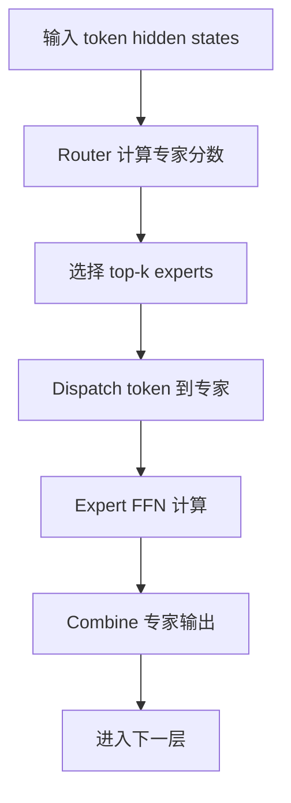

# MoE 模型推理优化

MoE 是 Mixture of Experts 的缩写，通常翻译为混合专家模型。它的核心思想是：模型里有很多个专家网络，但每个 token 只激活其中一小部分专家。

一句话理解：

> MoE 用“很多专家参数 + 每个 token 只走少数专家”的方式扩大模型容量，但把推理系统变成了路由、通信和负载均衡问题。

对推理系统来说，MoE 的难点不是“会不会调用模型”，而是：每个 token 会被路由到不同专家，专家可能分布在不同 GPU 上。于是一次前向不再只是规整的矩阵计算，还包含 token 分发、跨卡通信、专家计算、结果合并和负载均衡。

## Dense 模型和 MoE 模型的区别

Dense 模型里，每个 token 通常经过同一套层和同一套 FFN 参数。所有 token 的计算路径比较规整。

MoE 模型里，某些 FFN 层被替换成多个专家。每个 token 经过路由器选择其中 top-k 个专家，然后只在这些专家上计算。

可以简单对比：

| 模型类型 | 每个 token 使用多少参数 | 系统特点 |
| --- | --- | --- |
| Dense 模型 | 基本使用所有层参数 | 计算路径规整，调度相对简单 |
| MoE 模型 | 只激活部分专家参数 | 参数量大，路径动态，通信和负载均衡更复杂 |

MoE 的优势是模型总参数可以很大，但每个 token 的激活计算量相对可控。

它的代价是系统复杂度更高：

- 专家权重要放在哪里。
- token 要发给哪个专家。
- 专家负载是否均衡。
- 跨 GPU 通信是否成为瓶颈。
- 每个专家拿到的 token 数是否足够形成高效 GEMM。

## MoE 推理的数据流

一个 MoE layer 的典型流程如下：

1. 输入 token hidden states。
2. Router 为每个 token 计算专家分数。
3. 选择 top-k 个专家。
4. Dispatch：把 token 发给对应专家。
5. Expert FFN：每个专家处理分到自己的 token。
6. Combine：按 router 权重把专家输出合并。
7. 继续进入下一层。



这条链路里，Router 通常不是最重的计算。真正影响系统性能的是 dispatch/combine 通信、专家上的 GEMM 形态、专家权重放置和负载均衡。

## Router 做了什么

Router 是一个小网络，负责决定每个 token 应该发给哪些专家。

常见做法是：

- 对每个 token 计算一个 expert score。
- 选择分数最高的 top-k 个专家。
- 用 score 或 softmax 权重合并专家输出。

例如 top-2 routing 表示每个 token 会被发给 2 个专家。这样一个 token 会产生两份专家计算结果，再按权重合并。

对系统来说，top-k 越大：

- 每个 token 计算更多专家，质量可能更稳。
- 通信和计算量增加。
- combine 更复杂。
- 专家负载可能更分散，也可能更难调度。

top-k 通常是模型结构的一部分，推理系统不能随便改。除非模型和算法明确支持，否则修改 routing 规则可能改变输出质量。

## Dispatch 和 Combine 为什么重要

Dispatch 是把 token hidden states 发给对应专家。Combine 是把专家输出送回原 token 位置，并按 router 权重合并。

在单 GPU 上，这主要是数据重排问题。在多 GPU 上，专家可能分布在不同卡或不同节点，dispatch/combine 就会变成通信问题。

MoE 推理里常见的通信模式是 all-to-all：

- 每张 GPU 上都有一批 token。
- 每个 token 可能被路由到其他 GPU 上的专家。
- 各 GPU 互相发送 token hidden states。
- 专家计算后，再把结果发回原位置。

这会带来两个系统问题：

- 通信量可能很大。
- 通信延迟会卡住后续层执行。

如果网络或互联带宽不足，MoE 的推理性能可能主要受通信限制，而不是受算力限制。

## Expert Parallel：专家并行

Expert Parallel 是 MoE 推理中常见的并行方式。它把不同专家放到不同 GPU 上。

例如有 64 个专家、8 张 GPU，可以每张 GPU 放 8 个专家。每个 token 被 router 选中后，系统把它发送到对应专家所在的 GPU。

Expert Parallel 的好处是：

- 单张 GPU 不必存所有专家。
- 可以部署更大参数量的 MoE 模型。
- 专家计算可以分散到多张 GPU。

它的代价是：

- 需要跨 GPU dispatch/combine。
- 热门专家所在 GPU 可能成为热点。
- 小 batch 时每个专家拿到的 token 太少，GEMM 效率低。
- 跨节点 expert parallel 对网络要求很高。

Expert Parallel 解决的是专家权重放置和容量问题，但会引入通信和负载均衡问题。

## Tensor Parallel 与 Expert Parallel

MoE 模型可能同时使用多种并行方式。

Tensor Parallel 把一个大矩阵切到多张 GPU 上一起算。Expert Parallel 把不同专家放到不同 GPU 上。

两者区别是：

| 并行方式 | 切分对象 | 主要解决什么 |
| --- | --- | --- |
| Tensor Parallel | 单个层或矩阵 | 单层太大，一张 GPU 算不下或算不快 |
| Expert Parallel | 不同专家 | 专家太多，总参数放不下 |
| Data Parallel | 请求或 batch 副本 | 增加服务吞吐 |

实际部署中，一个 MoE 模型可能是：

```text
Attention 用 Tensor Parallel
MoE experts 用 Expert Parallel
不同 replica 用 Data Parallel
```

并行方式越多，通信路径越复杂。性能调优时必须知道当前瓶颈来自哪一种通信。

## 负载不均：MoE 的核心问题

MoE 推理中，不同 token 会被路由到不同专家。问题是，router 不一定把 token 均匀分给所有专家。

可能出现：

- 少数专家特别热门。
- 某些专家几乎没人用。
- 某个 batch 内 token 集中到同一组专家。
- 不同请求类型激活不同专家。
- 多租户流量导致专家负载分布变化。

如果某个专家收到大量 token，它所在 GPU 就会变慢。其他 GPU 即使空闲，也要等这个热点专家完成，整层才能继续。

这就是 MoE 的 straggler 问题：最慢专家决定整层耗时。

## 热门专家和冷门专家

热门专家是经常被 router 选中的专家。冷门专家很少被选中。

热门专家会带来几个问题：

- 所在 GPU 计算压力大。
- 通信流量向该 GPU 集中。
- batch 内等待时间变长。
- 尾延迟上升。

冷门专家也有问题：

- 权重占用显存，但利用率低。
- 专家并行资源不均衡。
- 某些 GPU 可能空闲。

训练阶段通常会用 load balancing loss 让专家更均衡。但推理阶段面对真实流量时，仍然可能出现专家热点。

系统优化不能假设专家天然均衡。要实际观测 expert load。

## MoE 和 Batching 的关系

Batching 对 MoE 很重要，但也更复杂。

Dense 模型里，一个 batch 的 token 通常走相同计算路径。MoE 模型里，同一个 batch 中的 token 会分散到不同专家。每个专家实际拿到的是一个子 batch。

如果总 batch 很小，每个专家拿到的 token 可能更少：

```text
总 batch 有 64 个 token
分到 16 个专家后
每个专家可能只有几个 token
```

小专家 batch 会导致 GEMM 形态不饱满，GPU 利用率下降。

所以 MoE 推理常常需要：

- 更大的全局 batch。
- 更好的 token grouping。
- 按专家聚合 token。
- grouped GEMM 或 fused kernel。
- 调度器理解专家负载。

Batch 越大，专家计算越容易高效；但 batch 太大又会影响延迟。因此 MoE 推理更依赖调度取舍。

## Prefill 和 Decode 中的 MoE 差异

Prefill 和 Decode 对 MoE 的压力不同。

Prefill 一次处理很多输入 token，专家上更容易形成较大的 token batch，GEMM 效率可能较好。但 Prefill token 数多，dispatch/combine 通信量也大。

Decode 每轮通常每个请求只产生一个 token。即使有 continuous batching，单轮专家子 batch 仍然可能比较碎。

因此：

- Prefill 中 MoE 的主要压力可能是大规模 dispatch/combine 和专家计算。
- Decode 中 MoE 的主要压力可能是小 batch、频繁通信和尾延迟。
- 长输出请求会反复触发 MoE layer，网络和专家热点影响会被放大。

优化 MoE 推理时，要分别看 Prefill 和 Decode，而不是只看整体 tokens/s。

## 显存问题：参数不小，只是激活稀疏

MoE 常被描述为“每个 token 只激活少数专家”，但这不代表模型显存占用小。

模型总专家参数可能非常大。即使每个 token 只用 top-2 专家，部署时仍然要把专家权重放在某处：

- 放在 GPU 显存里，速度快，但占用大。
- 放在 CPU 内存里，需要频繁搬运，延迟高。
- 按专家分布到多张 GPU，需要通信。
- 对热门专家做复制，可以降低热点，但增加显存。

所以 MoE 的系统优势不是“模型小”，而是“每个 token 的激活计算量比总参数量小”。

部署时仍然要认真规划专家权重放置。

## 专家权重放置

专家权重放置决定每个专家在哪些 GPU 上。

常见策略包括：

- 均匀放置：每张 GPU 放相同数量专家。
- 热点复制：热门专家在多张 GPU 上复制。
- 拓扑感知放置：通信频繁的专家放在互联更近的 GPU 上。
- 分层放置：常用专家在 GPU，冷门专家可能在较慢存储层。

均匀放置简单，但不一定均衡。如果专家访问分布不均，热门专家所在 GPU 会更忙。

热点复制可以缓解这个问题，但要付出显存代价。复制后，调度器还要决定 token 发给哪个副本。

## 通信优化

MoE 通信优化通常围绕 dispatch/combine 展开。

常见方向包括：

- 优化 all-to-all 实现。
- 合并小消息，减少通信启动开销。
- 使用拓扑感知通信路径。
- 通信和专家计算重叠。
- 减少跨节点专家访问。
- 压缩或低精度传输中间激活。
- 让 token grouping 更连续，减少重排成本。

通信优化必须和并行策略一起看。同一节点内 NVLink、跨 PCIe、跨节点网络的性能差异很大。

如果专家跨节点分布，网络可能成为 MoE 推理的第一瓶颈。

## 计算优化

每个专家通常是 FFN。专家计算看起来像普通 MLP，但因为 token 被分散到多个专家，每个专家的 micro-batch 可能很小。

计算优化常见方向包括：

- grouped GEMM：把多个小专家 GEMM 组织成更高效的执行。
- fused kernel：融合 dispatch、专家计算或 combine 中的部分操作。
- padding 优化：减少为了对齐造成的无效计算。
- token sorting：按专家整理 token，提升内存访问连续性。
- persistent kernel：降低频繁小 kernel 启动开销。
- quantization：用低精度专家权重减少显存和带宽压力。

MoE 计算优化的重点不是单个大 GEMM，而是大量不均匀小 GEMM 如何组织得更高效。

## 路由策略能不能改

推理系统通常不能随便改模型的 router。

原因是 router 是模型行为的一部分。强行把 token 分给负载更低的专家，可能改变模型输出质量。

但系统可以做一些不改变语义或低风险的事情：

- 在多个等价专家副本之间做负载均衡。
- 按已有 router 结果做更好的 dispatch 排序。
- 对不同 replica 做请求级负载均衡。
- 基于专家负载选择更合适的模型实例。
- 在支持的前提下使用模型提供的 capacity 或 routing 配置。

要区分两件事：

- 改变 router 决策：可能影响模型质量。
- 改善 router 决策后的执行：主要是系统优化。

大多数推理系统优化应该集中在后者。

## Capacity 和 Dropless

训练 MoE 时常见 capacity factor，用来限制每个专家最多处理多少 token。超过容量的 token 可能被丢弃或走备用路径。

推理时通常更希望 dropless，也就是不要因为专家容量限制丢 token。因为丢 token 可能直接影响输出质量和稳定性。

但 dropless 会带来系统压力：

- 热门专家必须处理所有分给它的 token。
- 最慢专家拖住整层。
- batch latency 更受负载不均影响。

所以推理系统要在“不丢 token”和“控制尾延迟”之间做工程优化，而不是简单依赖丢弃机制。

## 和量化的关系

MoE 模型总参数大，量化对部署很有价值。

量化可以用于：

- 专家权重量化，降低显存和权重带宽。
- 非专家层量化，降低整体模型成本。
- 激活量化或通信低精度，减少中间数据传输量。

但 MoE 量化要注意：

- 不同专家对量化敏感度可能不同。
- 热门专家质量影响更大。
- 低精度通信可能影响 combine 结果。
- 推理引擎必须支持 MoE 量化 kernel。

如果只压缩专家权重，但 dispatch/combine 通信才是瓶颈，整体收益可能有限。

## 和调度的关系

MoE 推理调度比 dense 模型更复杂，因为调度器不仅要看请求数量和 token 数，还要看专家负载。

一个调度器可能需要考虑：

- 当前 batch 的专家分布。
- 哪些 GPU 上的专家已经过载。
- 请求是否会激活相似专家。
- 是否需要更大的 batch 来提高专家 GEMM 效率。
- 是否要把某类流量路由到特定 replica。
- 是否要限制会造成专家热点的突发请求。

如果调度器完全不知道专家负载，只看 GPU 平均利用率，可能会误判系统状态：平均利用率不高，但某个专家已经成为长尾瓶颈。

## 和多机分布式推理的关系

MoE 模型常常需要多机部署，因为专家参数量大。

多机 MoE 推理的主要挑战包括：

- 跨节点 all-to-all 延迟高。
- 专家权重和路由结果跨节点分布。
- 网络带宽和 GPU 计算不匹配。
- 节点间负载不均会放大尾延迟。
- 故障恢复更复杂。

如果专家跨节点分布，系统要特别关注网络拓扑。一个不合理的专家放置，可能让每一层都产生大量跨节点通信。

实际部署中，常见目标是尽量把高频通信限制在同节点或高速互联域内。

## 适合观察的工作负载

MoE 推理性能强烈依赖流量分布。

测试时至少要覆盖：

- 短输入短输出。
- 长输入短输出。
- 短输入长输出。
- 长输入长输出。
- 单租户高并发。
- 多租户混合流量。
- 代码、数学、对话、RAG 等不同任务。
- prefill-heavy、decode-heavy 和 mixed workload。

不同任务可能激活不同专家。只用单一 benchmark，可能看不到真实专家热点。

## 常见优化方向

MoE 推理优化的重点是同时控制专家负载、通信、GEMM 形态和显存。

### 1. 先观测专家负载

先统计每个专家收到多少 token、每个专家耗时多少、每张 GPU 的专家负载如何。

没有 expert-level metrics，很难判断瓶颈是某个专家、某张 GPU、通信还是整体 batch 太小。

### 2. 提高专家子 batch 效率

通过更大的 batch、continuous batching、token grouping、grouped GEMM 和 fused kernel，让每个专家拿到的 token 更容易形成高效计算。

但要注意延迟目标。为了提高专家 batch 而无限等请求，会损害 TTFT 和 TPOT。

### 3. 减少跨节点通信

尽量把频繁交互的专家和 token 放在同节点或高速互联范围内。

跨节点 all-to-all 成本高，容易成为尾延迟来源。

### 4. 复制热门专家

如果少数专家长期热门，可以复制这些专家，把 token 分散到多个副本。

这能降低热点，但会增加显存占用，并要求调度器支持副本选择。

### 5. 通信计算重叠

在可能的情况下，把 token dispatch、专家计算和 combine 做流水化或重叠，减少等待。

这通常依赖推理引擎、通信库和 kernel 设计。

### 6. 分离不同流量类型

如果某些任务会稳定激活特定专家，可以考虑按业务类型或模型 replica 做流量隔离，避免互相干扰。

这不是改变 router，而是在请求级别做资源隔离。

### 7. 结合量化和缓存

专家权重量化可以降低显存和带宽压力。Prefix Cache 可以减少重复 Prefill。调度器可以结合这些优化一起看整体瓶颈。

单独一个优化不一定足够，MoE 系统通常需要组合优化。

## 该观察哪些指标

评估 MoE 推理时，建议观察：

| 指标 | 说明 |
| --- | --- |
| expert load | 每个专家收到多少 token |
| expert load skew | 热门专家和冷门专家差异 |
| expert latency | 每个专家计算耗时 |
| dispatch latency | token 分发耗时 |
| combine latency | 专家结果合并耗时 |
| all-to-all latency | 跨 GPU/跨节点通信耗时 |
| expert batch size | 每个专家实际处理的 token 数 |
| dropped token count | 如果存在容量限制，是否有 token 被丢弃 |
| GPU utilization by rank | 每张 GPU 利用率是否均衡 |
| network bandwidth | MoE 通信占用网络带宽 |
| TTFT | Prefill 是否受 MoE 通信影响 |
| TPOT | Decode 是否被专家热点拖慢 |
| p95 / p99 latency | 尾延迟是否受最慢专家影响 |
| quality score | 优化是否影响模型输出质量 |

这些指标要按 MoE layer、专家、GPU rank、请求类型和输入输出长度分组看。

## 一个最小例子

假设一个 MoE 模型有 32 个专家，部署在 4 张 GPU 上，每张 GPU 放 8 个专家。每个 token 使用 top-2 routing。

某个 batch 中有 1024 个 token。理想情况下，每个专家大约收到：

```text
1024 * 2 / 32 = 64 个 token
```

但真实路由可能不均匀：

- 专家 3 收到 180 个 token。
- 专家 7 收到 150 个 token。
- 一些专家只收到 10 个 token。

这时专家 3 和专家 7 所在 GPU 会更忙，其他 GPU 可能等待。整层耗时由最慢专家决定。

可选优化包括：

1. 统计专家热点，确认是否长期存在。
2. 优化 token grouping 和 grouped GEMM。
3. 对长期热门专家做副本复制。
4. 调整专家放置，让热门专家分散到不同 GPU。
5. 确认 all-to-all 是否成为主瓶颈。

这个例子说明：MoE 推理不是只看总 token 数，还要看 token 被路由到哪里。

## 常见误区

- **误区一：MoE 每个 token 只用少数专家，所以推理一定便宜。**
  激活计算量降低不代表系统成本低。专家权重、通信、负载不均和调度复杂度都可能很高。

- **误区二：专家平均分布就代表系统均衡。**
  需要看真实流量下的专家分布。平均值可能掩盖热门专家导致的尾延迟。

- **误区三：只要 GPU 利用率高就说明 MoE 跑得好。**
  可能某些 GPU 很忙、某些 GPU 空闲，整体尾延迟仍然很差。

- **误区四：推理系统可以随便改 router 来均衡负载。**
  Router 是模型行为的一部分，随意改变可能影响质量。系统优化应优先改善执行路径。

- **误区五：MoE 优化只看 expert parallel。**
  还要看 tensor parallel、batching、all-to-all、专家放置、量化、调度和网络拓扑。

读完这一节，应该能回答五个问题：

- MoE 推理为什么比 dense 模型更复杂。
- router、dispatch、expert compute、combine 分别做什么。
- expert parallel 如何解决专家参数放置，又引入什么通信问题。
- 负载不均、热门专家、小专家 batch 为什么会影响吞吐和尾延迟。
- 应该用哪些指标判断 MoE 推理瓶颈。
