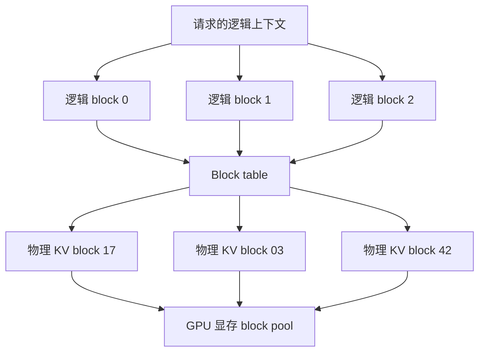

# PagedAttention

PagedAttention 是一种面向 LLM 推理的 KV Cache 管理方法。它的核心思想是把每个请求的 KV Cache 切成固定大小的 block，让逻辑上连续的上下文可以存放在物理上不连续的显存块里。

一句话理解：

> PagedAttention 把 KV Cache 管理得像操作系统管理虚拟内存一样，用 block table 把“逻辑 token 位置”映射到“物理 KV block”。

它主要解决的是 KV Cache 显存浪费和碎片问题。没有这类机制时，在线推理系统很容易因为请求长度不确定、并发请求进出频繁、输出长度不同而浪费大量显存。

## 为什么需要 PagedAttention

KV Cache 的难点不是“保存 K 和 V”本身，而是在线服务里的请求形态非常不规则：

- 请求到达时间不同。
- 输入 prompt 长短不同。
- 输出长度无法提前准确知道。
- 有些请求很快结束，有些请求生成很久。
- 用户可能中途取消，系统也可能超时中断。

如果系统要求每个请求的 KV Cache 占用一段连续显存，就会遇到两个问题。

第一是**预留浪费**。为了避免后面空间不够，系统可能要按最大上下文长度预留显存。但很多请求实际不会生成到上限，这部分预留空间就浪费了。

第二是**碎片浪费**。请求不断开始和结束后，显存里会出现很多大小不同的空洞。即使总剩余显存还不少，也可能找不到足够大的连续空间给新请求。

PagedAttention 的目标就是把这种“必须连续分配”的压力拆开，让 KV Cache 可以按 block 逐步增长和回收。

## 操作系统分页类比

理解 PagedAttention 最好的类比是操作系统的虚拟内存。

| 操作系统虚拟内存 | PagedAttention |
| --- | --- |
| 虚拟地址 | 请求里的逻辑 token 位置 |
| 物理页框 | 物理 KV block |
| 页表 | block table |
| 按需分配页面 | 按需分配 KV block |
| 进程结束释放页面 | 请求结束释放 KV block |
| copy-on-write | 共享前缀分叉时复制 block |

一个请求在逻辑上有一段连续上下文：第 0 个 token、第 1 个 token、第 2 个 token……但这些 token 对应的 KV Cache 不一定要连续放在显存里。系统只需要维护一张映射表，知道第几个逻辑 block 对应哪个物理 block。

## 一个简化结构

逻辑 block 的顺序是连续的，但物理 block 可以分散在显存池里的不同位置。Attention kernel 在计算时会通过 block table 找到对应的物理 KV block。

## 核心概念

PagedAttention 里有几个概念需要分清。

### KV block

KV block 是固定大小的一段 KV Cache。它通常保存若干个 token 在若干层 Attention 中的 key/value。这里的 block 是 KV Cache 管理单位，不是 CUDA thread block。

block 大小会影响系统行为：

- block 太大：最后一个 block 可能浪费更多空间。
- block 太小：block table 更大，管理开销更高，kernel 访问更复杂。

所以 block size 是一个工程权衡，不是越小越好。

### Physical block

Physical block 是实际占用显存的 KV block。系统会维护一个全局 block pool，从里面分配和回收物理 block。

当请求需要更多上下文空间时，系统从 block pool 取一个空闲 block；请求结束后，再把 block 还回 pool。

### Logical block

Logical block 是请求自己的上下文视角。对请求来说，它的上下文是连续增长的；第一个 block、第二个 block、第三个 block按顺序对应 token 位置。

请求不需要知道物理 block 在显存里的真实位置。它只需要通过 block table 找到映射。

### Block table

Block table 是逻辑 block 到物理 block 的映射表。

例如：

| 逻辑 block | 物理 block |
| --- | --- |
| 0 | 17 |
| 1 | 03 |
| 2 | 42 |

当 Attention 需要读取某个 token 的 KV 时，runtime 会先确定它属于哪个逻辑 block，再查 block table，找到实际物理 block。

### Reference count

如果多个请求共享同一个前缀，它们可以共享相同的物理 block。为了知道一个 block 是否还被使用，系统需要维护引用计数。

当引用计数变成 0，说明没有请求再使用它，block 可以回收到空闲池。

## 请求生命周期中的 PagedAttention

一个请求使用 PagedAttention 的过程可以这样理解：

1. 请求进入系统，先做 Prefill。
2. Prefill 产生输入 prompt 对应的 KV。
3. 系统为这些 KV 分配若干物理 block。
4. 请求的 block table 记录逻辑 block 到物理 block 的映射。
5. Decode 每生成新 token，就继续写入当前 block。
6. 当前 block 写满后，再分配新的物理 block。
7. 请求结束后，释放它引用的 block。

这个过程中，KV Cache 是按需增长的。系统不需要一开始就按最大输出长度分配完整空间。

## 它如何减少显存浪费

PagedAttention 减少显存浪费主要来自三点。

### 1. 按需分配

请求实际生成多少 token，就逐步分配多少 block。系统不用为每个请求预留最大上下文长度。

这对在线服务很重要，因为很多请求实际输出很短。如果一开始按最大长度预留，会浪费大量显存。

### 2. 非连续存储

请求的 KV Cache 不必占用连续显存。只要 block table 能找到每个逻辑 block 对应的物理 block，物理位置可以分散。

这样可以显著缓解碎片问题。显存池里只要有足够数量的空闲 block，就能继续服务请求。

### 3. 及时回收

请求结束后，系统可以按 block 回收显存。短请求释放的 block 能很快给新请求复用。

相比整段连续内存，block 级回收更细粒度，更适合请求不断进出的在线场景。

## Copy-on-write

Copy-on-write 用来处理“多个请求先共享，后面又分叉”的情况。

典型场景包括：

- parallel sampling：同一个 prompt 采样多个不同回答。
- beam search：多个 beam 共享相同前缀，后续路径不同。
- prefix cache：多个请求共享相同 system prompt 或模板前缀。

在这些场景里，多个序列的前缀 KV 是一样的，可以共享相同物理 block。只要它们只是读取，就不需要复制。

当某个序列要写入会修改共享 block 的内容时，系统才复制一个新的物理 block，让这个序列写自己的副本。原来的 block 仍然给其他序列使用。

这就是 copy-on-write 的意义：

- 共享相同前缀时节省显存。
- 分叉时保持不同序列互不影响。
- 避免一开始就为每个分支复制完整 KV Cache。

## 和 Prefix Cache 的关系

PagedAttention 是底层 KV block 管理机制，Prefix Cache 是更上层的复用策略。

Prefix Cache 发现某个请求的前缀已经计算过，于是希望复用这段前缀对应的 KV。PagedAttention 提供 block 级共享能力，让这些前缀 KV 可以作为物理 block 被多个请求引用。

可以这样理解：

- Prefix Cache 负责判断“这个前缀能不能复用”。
- PagedAttention 负责让“这段 KV 怎么被多个请求共享和管理”。

两者配合时，公共 system prompt、工具说明、few-shot 示例、RAG 模板都可能减少重复 Prefill。

## 和 Continuous Batching 的关系

Continuous batching 让请求可以在 Decode 过程中动态进入和退出 batch。PagedAttention 让这种动态进出更容易管理 KV Cache。

没有 block 级管理时，请求结束会留下大小不一的空洞，新请求进入又需要找连续空间。这样调度越动态，显存越容易碎。

有了 PagedAttention：

- 新请求可以按需分配 block。
- 结束请求可以按 block 释放。
- 不同长度请求可以共存。
- batch 中 active sequences 动态变化时，KV Cache 管理更稳定。

所以 PagedAttention 和 continuous batching 经常一起出现：一个解决显存布局，一个解决调度和吞吐。

## 它没有解决什么

PagedAttention 很重要，但不是万能的。

它不能消除 KV Cache 本身的规模增长。上下文越长、并发越高，总 KV Cache 仍然越大。

它也不能消除 Decode 读取历史 KV 的成本。PagedAttention 管理的是 KV Cache 的存放方式，不是让模型不再读取历史上下文。

它还会带来工程复杂度：

- Attention kernel 需要支持 paged KV layout。
- runtime 要维护 block table 和 block pool。
- copy-on-write 要维护引用关系。
- block size 需要权衡。
- 元数据和间接寻址可能带来额外开销。

因此，PagedAttention 主要解决显存管理问题，而不是独立解决所有推理性能问题。

## 该观察哪些指标

分析 PagedAttention 效果时，可以关注：

| 指标 | 说明 |
| --- | --- |
| KV Cache used memory | 总 KV Cache 显存占用 |
| block utilization | 已分配 block 内部实际使用比例 |
| free block count | 空闲 block 是否充足 |
| allocation failure | 是否因 block 不足无法接收请求 |
| block table size | 元数据规模和管理开销 |
| shared block count | prefix 或分支共享了多少 block |
| copy-on-write count | 共享 block 分叉复制频率 |
| cache hit rate | prefix cache 命中情况 |
| p95 / p99 latency | 显存压力是否影响尾延迟 |
| tokens/s | block 管理是否影响吞吐 |

如果 block utilization 很低，可能 block size 过大或请求长度分布不合适。如果 copy-on-write 频繁，可能共享策略收益没有想象中高。如果 free block 长期很低，系统接近容量上限。

## 一个最小例子

假设 block size 是 4 个 token，一个请求当前有 10 个 token 的上下文。

逻辑上它需要 3 个 block：

| 逻辑 block | 保存 token | 物理 block |
| --- | --- | --- |
| 0 | token 0-3 | block 17 |
| 1 | token 4-7 | block 03 |
| 2 | token 8-9 | block 42 |

最后一个 block 只用了 2 个 token 位置，所以有一点内部浪费。但浪费最多只发生在最后一个 block，不需要为最大上下文长度预留整段空间。

当请求继续生成 token 10 和 token 11，它们会写入逻辑 block 2。等 block 2 写满，再分配新的物理 block。

当请求结束时，block 17、03、42 的引用计数减少。如果没有其他请求引用它们，就回收到 block pool。

## 常见误区

- **误区一：PagedAttention 是一种新的模型结构。**
  它不是模型结构改造，而是 KV Cache 显存管理和 attention 执行方式的系统优化。

- **误区二：PagedAttention 会减少模型需要关注的历史 token。**
  它主要改变 KV Cache 的存储布局，不等于稀疏注意力或丢弃历史 token。

- **误区三：用了 PagedAttention 就不会显存不足。**
  它减少碎片和预留浪费，但上下文和并发过大时，KV Cache 总量仍然会超过显存。

- **误区四：block 越小越好。**
  block 小能减少最后一个 block 的浪费，但会增加 block table、调度和 kernel 管理开销。

- **误区五：PagedAttention 和 Prefix Cache 是同一件事。**
  PagedAttention 是底层 block 管理；Prefix Cache 是复用相同前缀的策略，二者可以配合。

读完这一节，应该能回答五个问题：

- PagedAttention 为什么借鉴操作系统分页思想。
- block table、logical block、physical block 分别是什么。
- PagedAttention 如何减少 KV Cache 显存碎片和预留浪费。
- copy-on-write 为什么能支持共享前缀和分叉生成。
- PagedAttention 的收益和代价分别是什么。

## 延伸阅读

- [Efficient Memory Management for Large Language Model Serving with PagedAttention](https://arxiv.org/abs/2309.06180)
- [vLLM Paged Attention kernel documentation](https://docs.vllm.ai/en/latest/design/kernel/paged_attention.html)
