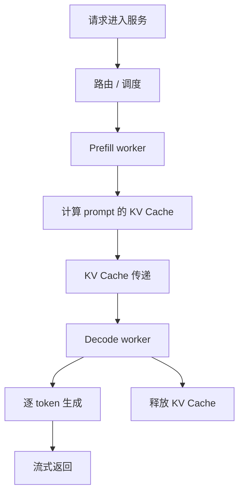

# Prefill/Decode 分离部署

Prefill/Decode 分离部署，是把 LLM 推理中的 Prefill 阶段和 Decode 阶段放到不同 worker、不同 GPU 池，甚至不同节点上执行。它的目标是减少两类阶段之间的资源干扰，让系统更容易分别优化 TTFT、TPOT、吞吐和资源利用率。

一句话理解：

> Prefill/Decode 分离部署把“读输入”和“生成输出”拆成两个服务角色，用不同资源池处理不同瓶颈。

在普通部署里，一个推理 worker 同时负责 Prefill 和 Decode。请求进入 worker 后，先 Prefill 输入 prompt，再持续 Decode 输出 token。这个方式简单，但当线上流量复杂时，Prefill 和 Decode 很容易互相干扰。

分离部署的核心问题是：Prefill 算完以后，Decode 还需要继续使用这段上下文的 KV Cache。因此系统必须把 KV Cache 或相关状态，从 Prefill worker 交给 Decode worker。

## 为什么要分离

Prefill 和 Decode 的资源特征不同。

Prefill 阶段一次处理完整输入 prompt，输入 token 多，矩阵乘法规模大，更偏计算密集。Decode 阶段每次生成一个或少量 token，但要不断读取历史 KV Cache，更偏延迟敏感和显存带宽敏感。

如果两者混在同一批 GPU 上，常见问题包括：

- 大 prompt 的 Prefill 抢占计算资源，让正在流式输出的 Decode 变慢。
- Decode 请求长期占用 KV Cache，让新请求很难进入 Prefill。
- 短请求和长请求混在一起，尾延迟变差。
- Prefill-heavy 流量突增时，TPOT 被拖慢。
- Decode-heavy 流量堆积时，TTFT 变差。

分离部署试图把这两个阶段拆开管理：

- Prefill worker 专注快速读入 prompt，降低 TTFT。
- Decode worker 专注稳定生成 token，降低 TPOT。
- 调度器可以分别控制两个资源池的容量和队列。

## 普通部署与分离部署

普通部署中，一个 worker 完成完整推理链路：

```text
请求 -> Prefill -> Decode -> 返回输出
```

分离部署中，链路变成：

```text
请求 -> Prefill worker -> KV 传递 -> Decode worker -> 返回输出
```



这个结构看起来只是多了一步传输，但它改变了整个推理系统的资源组织方式。

## 分离后分别优化什么

Prefill worker 和 Decode worker 的优化目标不同。

| 角色 | 主要工作 | 主要瓶颈 | 典型优化目标 |
| --- | --- | --- | --- |
| Prefill worker | 处理输入 prompt | 计算、长输入、排队 | 降低 TTFT，提高 Prefill tokens/s |
| Decode worker | 持续生成输出 token | KV Cache、显存带宽、流式延迟 | 降低 TPOT，提高稳定 tokens/s |

Prefill worker 可以更关注大 batch、高算力利用和输入 token 吞吐。Decode worker 可以更关注低延迟、KV Cache 管理、连续调度和流式输出稳定性。

如果硬件资源异构，也可以让不同阶段使用不同类型的 GPU 或不同配置的实例。但这要求调度、网络和 KV 传输能力足够强。

## AFD：Attention-FFN 分离

Prefill/Decode 分离部署通常缩写为 PDD，它按时间阶段拆分：先读 prompt，再逐 token 生成。另一个更细的方向是 AFD，也就是 Attention-FFN Disaggregation，把 Transformer block 内部的 attention 路径和 FFN/MLP 路径按资源角色拆开。

AFD 的动机来自一个观察：attention 和 FFN 的资源形态并不完全一样。

| 子模块 | 主要压力 | 常见系统关注点 |
| --- | --- | --- |
| Attention | KV Cache 访问、sequence length、显存带宽、上下文状态 | KV layout、cache locality、通信和状态迁移 |
| FFN / MLP | 大矩阵乘、MoE expert、计算吞吐 | GEMM/Grouped GEMM、专家放置、算力利用 |

在同构部署里，这两个子模块通常在同一批 worker 上顺序执行。AFD 会尝试让 attention worker 和 FFN worker 变成不同角色，甚至放在不同硬件池上。这样做的目标是让带宽敏感和计算密集的工作分别匹配更合适的资源。

异构下的 AFD 更进一步：attention 可以放在显存容量、KV 带宽或网络路径更适合的资源上，FFN 可以放在矩阵吞吐更强的资源上。对 MoE 模型，还可能把 FFN/expert 层和 attention 层的扩缩容策略分开。

AFD 比 PDD 更难，因为它不仅要传递 Prefill 后的 KV，还要在每一层或每一组层之间维护中间 hidden states、执行顺序和跨 worker 通信。需要重点评估：

- Attention worker 和 FFN worker 之间传什么数据，是 hidden states、partial output 还是更细粒度 tile。
- 传输数据量是否超过节省的计算/带宽收益。
- 不同硬件池的速度不一致时，哪一侧成为瓶颈。
- 调度器是否能同时感知 request、layer、token、KV 状态和 worker role。
- 失败恢复时，跨角色状态如何回滚或重算。

因此，AFD 更适合在大规模、异构、强 SLO 约束或需要模拟验证的 serving 系统里研究。对于普通单机或小规模部署，先把 PDD、batching、KV Cache、Prefix Cache 和调度做好，通常更现实。

## KV Cache 为什么是核心

分离部署最难的地方不是把请求分成两段，而是如何传递 KV Cache。

Prefill 阶段算完输入 prompt 后，会得到每一层、每个 token 的 key/value。Decode 阶段必须基于这些 key/value 继续生成。如果 Decode worker 拿不到这段 KV Cache，就只能重新 Prefill，分离部署就失去意义。

所以系统要解决几个问题：

- KV Cache 存在哪里。
- 从 Prefill worker 到 Decode worker 如何传输。
- 传输是否走 GPU 内存、CPU 内存、RDMA 或网络。
- KV Cache 的 layout 是否和 Decode worker 兼容。
- 传输过程中如何管理 block table、引用计数和生命周期。
- 如果传输失败，是否重试、回退或重新 Prefill。

KV 传输成本决定分离部署是否划算。如果传输比节省的干扰成本还高，分离可能反而变慢。

## KV 传递的几种方式

不同系统可以选择不同 KV 传递方式。

### 1. 直接 GPU 到 GPU 传输

Prefill worker 把 KV Cache 从自己的 GPU 显存传到 Decode worker 的 GPU 显存。

如果两块 GPU 在同一节点内，可以使用 NVLink、PCIe P2P 等方式。如果跨节点，可能需要 RDMA 或高速网络。

优点是路径直接，Decode worker 收到后可以立刻继续生成。缺点是对硬件拓扑和通信实现要求高。

### 2. 经 CPU 内存中转

Prefill worker 先把 KV Cache 拷到 CPU 内存，再由 Decode worker 拉取或接收。

这种方式实现可能更通用，但传输路径更长，延迟更高，也更容易受 PCIe 和内存带宽影响。

它适合对性能要求没那么极致，或者硬件不支持更直接传输的场景。

### 3. 共享 KV 存储或缓存层

系统可以把 Prefill 结果写入某个共享缓存层，Decode worker 再读取。

这在架构上更解耦，但对延迟、带宽和一致性要求很高。KV Cache 数据量很大，不能像普通业务缓存一样随意放到低速存储。

### 4. 同节点内逻辑分离

也可以先不跨节点，只在同一台机器内把 Prefill 和 Decode 作为不同 worker 或不同进程管理。

这种方式能降低网络复杂度，适合作为工程演进的第一步。但它的资源隔离能力不如跨资源池部署。

## 分离部署如何改善 TTFT

TTFT 主要受排队、tokenization、Prefill 和首 token Decode 影响。

在普通部署中，如果 Decode 请求占满 worker，新请求即使只是想做 Prefill，也可能要等 Decode step 让出资源。

分离部署后，新请求可以进入专门的 Prefill 资源池。只要 Prefill worker 有容量，它就不必和大量正在 Decode 的长输出请求竞争同一批 GPU。

这可能带来：

- 新请求更快完成 Prefill。
- 长输出请求对首 token 的影响下降。
- Prefill-heavy 请求可以集中批处理。
- TTFT 更容易单独扩容优化。

但 TTFT 也可能因为 KV 传输增加一段额外延迟。所以是否改善，要看 Prefill 等待减少了多少，以及 KV 传输增加了多少。

## 分离部署如何改善 TPOT

TPOT 主要描述流式输出阶段每个 token 的间隔。

在普通部署中，大 Prefill 任务可能插入执行，占用大量计算资源，让 Decode step 变慢。用户看到的效果就是流式输出突然卡顿。

分离部署后，Decode worker 可以尽量只处理 Decode。这样它的执行节奏更稳定，不容易被长 prompt 的 Prefill 打断。

可能收益包括：

- 流式输出更平滑。
- Decode batch 更稳定。
- 长输出请求的 TPOT 更可控。
- p95 / p99 TPOT 下降。

不过如果 Decode worker 资源不足，或者 KV 传输完成后 Decode 队列太长，TPOT 仍然会变差。

## Goodput 为什么可能提高

Goodput 关注在 SLO 内完成的有效工作量。

普通部署在高负载下可能出现一个问题：GPU 很忙，但请求大量超时，真正满足 SLO 的请求不多。

分离部署可以让系统分别控制：

- Prefill 队列是否过长。
- Decode 队列是否过长。
- Prefill worker 和 Decode worker 的比例。
- 哪类请求应该进入哪个资源池。
- 过载时拒绝新请求还是保护已有 Decode。

这种控制能力可能让更多请求在目标延迟内完成，从而提高 goodput。

但它不是自动发生的。分离部署必须配合调度、准入控制、负载均衡和容量规划。

## 资源池比例怎么设

分离部署后，一个关键问题是：多少 GPU 给 Prefill，多少 GPU 给 Decode？

比例取决于工作负载。

如果输入很长、输出较短，Prefill 压力大，需要更多 Prefill 资源。如果输入较短、输出很长，Decode 压力大，需要更多 Decode 资源。

影响因素包括：

- 平均 prompt length。
- 平均 output length。
- 并发请求数。
- 是否有长上下文任务。
- 是否有 RAG 或 Agent 工具说明。
- 是否启用 Prefix Cache。
- 是否启用 Speculative Decoding。
- 模型大小和并行方式。
- GPU 显存和网络带宽。

一个固定比例通常很难长期适配所有流量。实际系统可能需要动态调整资源池，或按业务类型准备不同部署组。

## 调度器要做什么

分离部署需要更复杂的调度。

普通调度器主要决定请求什么时候进入一个 worker。分离部署中，调度器还要决定：

- 请求进入哪个 Prefill worker。
- Prefill 完成后交给哪个 Decode worker。
- 哪些 Decode worker 有足够 KV Cache 空间。
- 哪个路径的 KV 传输成本最低。
- 是否应该等一个更合适的 Decode worker。
- 是否要把长请求和短请求分开。
- 是否要按租户、优先级或 SLO 分资源池。

调度器还需要理解两个队列：

- Prefill queue：影响 TTFT。
- Decode queue：影响 TPOT 和流式稳定性。

如果只优化 Prefill queue，可能导致大量请求快速完成 Prefill 后挤爆 Decode queue。如果只保护 Decode queue，新请求的 TTFT 会变差。

## 网络会成为新瓶颈

分离部署把一部分本地显存访问问题，变成了跨 worker 传输问题。

KV Cache 数据量很大。它和普通 API 请求体不同，不能假设网络传输成本很小。

需要关注：

- 每个请求 Prefill 后产生多少 KV 数据。
- KV 传输是否占用主业务网络。
- 同一时间有多少请求在传 KV。
- 网络带宽是否影响 TTFT。
- 网络拥塞是否造成尾延迟。
- 跨节点传输是否比同节点传输慢很多。

如果网络不足，分离部署可能从“Prefill 和 Decode 互相干扰”变成“KV 传输排队和拥塞”。

## 和 Chunked Prefill 的关系

Chunked Prefill 是把长 prompt 的 Prefill 切成小块，穿插在 Decode step 之间执行。它的目标也是减少 Prefill 对 Decode 的干扰。

它和分离部署是两种不同思路：

- Chunked Prefill：仍在同一资源池里执行，但把 Prefill 切小。
- 分离部署：把 Prefill 和 Decode 放到不同资源池。

两者可以结合。例如 Prefill worker 内部也可以用 chunked prefill，避免少数超长输入垄断 Prefill 资源。

如果系统规模较小，先做 chunked prefill 可能比直接分离部署简单。如果系统规模较大，分离部署能带来更强的资源隔离。

## 和 Prefix Cache 的关系

Prefix Cache 会减少重复 Prefill。如果大量请求命中 Prefix Cache，Prefill 压力会下降，分离部署的收益也会变化。

例如固定 system prompt、工具说明、few-shot 示例都能命中缓存时，新请求实际需要 Prefill 的 token 变少。此时瓶颈可能从 Prefill 转向 Decode 或 KV Cache。

分离部署下还要考虑 cache 放在哪里：

- Prefix Cache 在 Prefill worker 上，命中后生成更少新 KV。
- Decode worker 是否能复用已有前缀 KV。
- 如果 cache 只在某个 worker 上，路由是否要 cache-aware。
- 跨 worker 复用是否会增加传输成本。

Prefix Cache 和分离部署都能降低 Prefill 对系统的压力，但它们解决问题的角度不同。

## 和 Speculative Decoding 的关系

Speculative Decoding 主要优化 Decode。它可能让 Decode worker 每轮前进更多 token，从而改变 Decode 资源需求。

如果 Speculative Decoding 效果很好，Decode 阶段压力下降，系统可能需要更少 Decode worker 或能承载更多请求。

但它也可能增加临时 KV、draft 计算和调度复杂度。分离部署下需要决定：

- draft model 放在 Decode worker 还是独立 worker。
- speculative verify 是否影响 Decode worker 的稳定节奏。
- 临时 KV 是否和普通 Decode KV 共用显存池。
- 低接受率时是否回退普通 Decode。

两者可以互补，但必须一起做容量评估。

## 和多机分布式推理的关系

Prefill/Decode 分离部署不等于多机分布式推理，但经常和它一起出现。

一个模型可能本身就需要 tensor parallel 或 pipeline parallel，Prefill worker 和 Decode worker 内部又各自是多 GPU 组。

这会让链路变成：

```text
Prefill GPU 组 -> KV 传输 -> Decode GPU 组
```

此时系统不仅要处理跨 worker 传输，还要处理每个 worker 内部的并行通信。

需要关注：

- Prefill 组和 Decode 组的 parallel size 是否一致。
- KV Cache layout 是否能跨并行策略转换。
- tensor parallel 下 KV 分片如何传输。
- pipeline parallel 下层间状态如何处理。
- 跨节点网络是否能承受并行通信和 KV 传输。

并行策略越复杂，分离部署的工程成本越高。

## 适合哪些场景

Prefill/Decode 分离部署更适合以下场景：

- 输入和输出长度差异大。
- 流量中既有长 prompt，又有长输出。
- TTFT 和 TPOT 都有严格 SLO。
- Prefill 突增会明显影响流式输出。
- Decode 长请求会明显阻塞新请求 Prefill。
- 服务规模足够大，值得维护两个资源池。
- 网络和 KV 传输能力较强。
- 调度器已经具备较好的队列和容量控制。

不太适合的场景包括：

- 服务规模小，单机或少量 GPU 已能满足需求。
- 请求都很短，KV 传输收益不明显。
- 网络带宽不足或跨节点延迟高。
- 推理引擎不支持高效 KV transfer。
- 运维团队还无法管理更复杂的资源池。
- 当前瓶颈主要在 tokenizer、业务后处理或外部工具调用。

## 常见优化方向

分离部署的优化重点，不是简单拆服务，而是控制 KV 传输、队列平衡和资源比例。

### 1. 先做负载画像

要先知道请求是 prefill-heavy、decode-heavy 还是 mixed workload。

需要统计 input length、output length、TTFT、TPOT、Prefill tokens/s、Decode tokens/s、KV Cache 占用和请求类型分布。

没有负载画像，很难决定资源池比例。

### 2. 控制 KV 传输路径

优先让 Prefill worker 和 Decode worker 之间的 KV 传输走低延迟、高带宽路径。

可以考虑同节点优先、拓扑感知调度、RDMA、GPU direct、KV layout 对齐和批量传输。

### 3. 平衡 Prefill 队列和 Decode 队列

不能只让 Prefill 跑得快。Prefill 太快但 Decode 跟不上，会导致 Decode queue 堆积，甚至浪费已经传好的 KV。

调度器要同时看 TTFT 和 TPOT，必要时限制 Prefill 准入。

### 4. 动态调整资源池比例

流量形态会变化。白天交互请求多，夜间批处理多；RAG、Agent、代码任务的输入输出长度也不同。

可以按时间、业务类型或实时指标调整 Prefill 和 Decode 资源比例。

### 5. 做拓扑感知路由

如果 Prefill worker 和 Decode worker 跨节点传输成本不同，调度器应该优先选择低成本路径。

不考虑拓扑的路由，可能让 KV Cache 在网络中绕远路，增加尾延迟。

### 6. 明确失败和回退策略

KV 传输失败、Decode worker 满载、Prefill worker 异常时，系统要有明确行为：

- 重试传输。
- 换 Decode worker。
- 重新 Prefill。
- 返回可恢复错误。
- 回退到非分离部署路径。

没有回退策略，分离部署会增加线上故障面。

### 7. 配合准入控制

当 Decode 资源已经饱和时，继续让新请求 Prefill 可能没有意义。它们会完成 Prefill 后卡在 Decode queue，占用 KV 和网络。

准入控制应该同时考虑 Prefill 容量和 Decode 容量。

## 该观察哪些指标

评估 Prefill/Decode 分离部署时，建议观察：

| 指标 | 说明 |
| --- | --- |
| prefill queue wait | 请求等待 Prefill 的时间 |
| decode queue wait | 请求等待 Decode 的时间 |
| TTFT | 首 token 是否改善 |
| TPOT | 流式输出是否更稳定 |
| prefill tokens/s | Prefill 资源池吞吐 |
| decode tokens/s | Decode 资源池吞吐 |
| KV transfer latency | KV 从 Prefill 到 Decode 的传输耗时 |
| KV transfer bandwidth | KV 传输占用带宽 |
| KV transfer failure count | KV 传输失败次数 |
| decode worker KV usage | Decode worker 显存占用 |
| prefill/decode utilization | 两类资源池利用率是否均衡 |
| p95 / p99 latency | 尾延迟是否改善 |
| goodput | SLO 内完成的有效吞吐 |
| fallback count | 回退普通 Decode 或重新 Prefill 的次数 |

这些指标要按请求长度、业务类型、租户、模型和 worker 拓扑分组看。

## 一个最小例子

假设一个在线服务同时有两类请求：

- A 类：短 prompt、长输出的聊天请求。
- B 类：长 prompt、短输出的文档问答请求。

普通部署中，B 类长 prompt 的 Prefill 会周期性占用大量 GPU 计算，让 A 类聊天请求的流式输出卡顿。A 类长输出又会持续占用 KV Cache，让 B 类新请求 TTFT 变差。

分离部署可以这样设计：

1. B 类请求先进入 Prefill worker，快速处理长输入。
2. Prefill 完成后，把 KV Cache 传给 Decode worker。
3. Decode worker 专注服务 A 类和 B 类的输出 token。
4. 调度器限制 Prefill worker 向 Decode worker 注入请求的速度。
5. 当 Decode queue 过长时，准入控制延后或拒绝新的长 prompt 请求。

这样做的目标不是让每个阶段都单独最快，而是让首 token、流式输出和整体 SLO 更稳定。

## 常见误区

- **误区一：分离部署一定更快。**
  如果 KV 传输成本很高，或者系统规模不大，分离可能反而增加延迟。

- **误区二：只要 Prefill 快了，系统就好了。**
  Prefill 太快但 Decode 跟不上，会把压力转移到 Decode queue 和 KV Cache。

- **误区三：KV Cache 可以像普通数据一样随便传。**
  KV 数据量大、格式复杂、和模型并行策略相关，传输成本和兼容性都很关键。

- **误区四：分离部署只是多拆一个服务。**
  它会影响调度、网络、显存、故障恢复、容量规划和监控体系。

- **误区五：资源池比例可以固定不变。**
  流量形态变化后，固定比例容易让某一侧资源空闲，另一侧排队。

读完这一节，应该能回答五个问题：

- Prefill/Decode 分离部署要解决什么干扰问题。
- Prefill worker 和 Decode worker 分别优化什么。
- KV Cache 为什么是分离部署的核心难点。
- 网络、调度和资源池比例为什么会决定收益。
- 应该用哪些指标判断分离部署是否值得上线。
