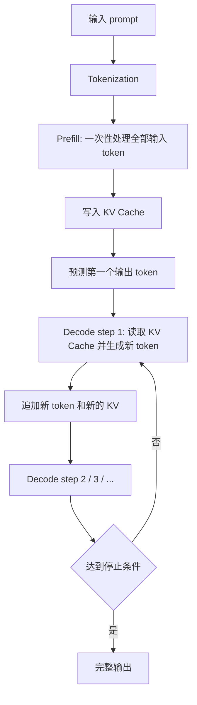

# Prefill 与 Decode

LLM 推理通常分成两个阶段：**Prefill** 和 **Decode**。这两个阶段都在跑同一个 Transformer 模型，但计算形态、资源瓶颈和优化手段明显不同。

简单说：

- **Prefill**：模型先把用户输入的 prompt 读完，建立上下文表示，并写入 KV Cache。
- **Decode**：模型根据已有上下文，一个 token 一个 token 继续生成输出。

这张图里有一个关键点：**Prefill 只做一次，Decode 会重复很多次**。如果 prompt 很长，Prefill 会重；如果输出很长，Decode 会重；如果并发很高，两者还会互相抢 GPU 和显存资源。

## Prefill 在做什么

Prefill 的输入是用户已经给出的所有 token。模型会把这些 token 一次性送进 Transformer，计算每一层的 Attention 和 MLP，最后得到“读完 prompt 之后”的上下文状态。

可以把 Prefill 理解成：

> 模型先把题目、背景材料、系统提示词、RAG 检索内容和历史对话全部读一遍。

Prefill 阶段会产生两个重要结果：

1. **第一个输出 token 的概率分布**：模型读完 prompt 后，就可以预测回答的第一个 token。
2. **KV Cache**：模型把输入 token 在每一层 Attention 里会反复用到的 key/value 保存下来，供 Decode 阶段复用。

如果没有 KV Cache，后续每生成一个 token，都要重新计算整个 prompt 和已经生成的所有 token。这样会非常浪费。

## Decode 在做什么

Decode 的输入不是完整 prompt，而是“当前新生成的那一个 token”和之前保存好的 KV Cache。模型每次只预测下一个 token，但这个过程会循环很多次。

可以把 Decode 理解成：

> 模型一边看已经读过的上下文，一边每次往答案后面接一个新词。

例如模型要生成 200 个 token，就大致需要执行 200 次 Decode step。每一步都会：

1. 读取已有 KV Cache。
2. 处理当前最新 token。
3. 预测下一个 token。
4. 把新 token 对应的 KV 追加进 KV Cache。
5. 判断是否结束。

所以 Decode 的核心困难不是“单步特别大”，而是“必须串行重复很多次”。上一个 token 没出来，下一个 token 通常就不能开始。

## 两个阶段为什么瓶颈不同

Prefill 和 Decode 的计算形态不同，导致它们对系统资源的压力也不同。

| 维度 | Prefill | Decode |
| --- | --- | --- |
| 输入形态 | 一次处理很多输入 token | 每次处理新生成的 1 个 token |
| 执行次数 | 每个请求通常只执行一次 | 输出多少 token 就执行多少次 |
| 主要影响 | 首 token 延迟、KV Cache 初始化 | 持续生成速度、总输出耗时 |
| 常见瓶颈 | 长 prompt、Attention 计算、batch 组织 | KV Cache 读取、显存带宽、串行 step、调度 |
| GPU 利用率 | 通常更容易做成大计算 | 单步小，需要靠并发和 batching 提高利用率 |
| 显存压力 | 一次性写入 prompt 的 KV Cache | 随输出 token 不断追加 KV Cache |

粗略地说，Prefill 更像“批量读入一大段材料”，Decode 更像“每次查上下文再写一个字”。这就是为什么同一个模型，在长 prompt 和长输出场景下表现会很不一样。

## 和 TTFT、TPOT 的关系

两个常用推理指标会直接对应到这两个阶段：

- **TTFT（Time To First Token）**：从请求进入到第一个 token 返回的时间。
- **TPOT（Time Per Output Token）**：Decode 阶段平均每生成一个输出 token 的时间。

TTFT 通常包含排队、tokenization、Prefill 和第一个 token 返回。prompt 越长，Prefill 越重，TTFT 往往越高。

TPOT 主要看 Decode 循环。输出越长，Decode step 越多；并发越高，KV Cache 越多；调度越差，token 间隔越不稳定。

这也解释了一个常见现象：

- 用户发了一个很长的 RAG prompt，可能等很久才看到第一个 token。
- 第一个 token 出来后，如果 Decode 很顺，后续 token 会稳定流出。
- 如果 Decode 阶段拥塞，用户会看到输出一顿一顿的。

## 长 prompt、长输出、高并发分别放大什么问题

不同 workload 会放大不同阶段的压力。

| 场景 | 更容易放大的问题 | 原因 |
| --- | --- | --- |
| 长 prompt | Prefill 时间、首 token 延迟、初始 KV Cache 显存 | 输入 token 多，需要一次性读完并写入 KV |
| 长输出 | Decode 总耗时、TPOT、KV Cache 增长 | 每多生成一个 token，就多一次 Decode step |
| 高并发短请求 | 调度、batching、tokenization、队列延迟 | 单请求不重，但请求到达频繁 |
| 高并发长上下文 | 显存容量、KV Cache 管理、尾延迟 | 每个请求都占很多 KV Cache |
| RAG / Agent | Prefill、缓存、端到端尾延迟 | 检索内容和多轮调用会拉长输入链路 |

因此，优化前要先问：现在的瓶颈到底是 Prefill-heavy，Decode-heavy，还是队列和调度造成的 mixed workload 问题。

## 为什么 Prefill 和 Decode 会互相干扰

在线服务里，Prefill 请求和 Decode 请求通常会共享同一批 GPU。问题在于，两者对 GPU 的使用方式不一样。

Prefill 往往是比较大的计算块，适合吃满 GPU；Decode 单步比较小，但对节奏敏感，因为用户正在等待下一个 token。

如果一个很长 prompt 的 Prefill 占住 GPU，正在 streaming 的 Decode 请求可能就要等，用户会感觉输出突然卡住。反过来，如果系统一直优先服务 Decode，新的长 prompt 请求可能迟迟拿不到首 token。

这就是为什么现代推理系统会引入：

- continuous batching：让 Decode step 和新请求更灵活地插入执行。
- chunked prefill：把长 Prefill 切成小块，减少对 Decode 的阻塞。
- prefill/decode disaggregation：把 Prefill 和 Decode 放到不同资源池。
- SLO-aware scheduling：根据首 token 和持续 token 的目标延迟调度。

这些机制后面会分别展开。这里先记住一句话：**Prefill 和 Decode 不是两个孤立步骤，而是在同一套在线系统里争夺资源的两类 workload。**

## 一个例子：1000 token 输入，200 token 输出

假设一个请求有 1000 个输入 token，最多生成 200 个输出 token。

系统会先做一次 Prefill：

1. 处理 1000 个输入 token。
2. 写入这 1000 个 token 对应的 KV Cache。
3. 预测第一个输出 token。

然后进入 Decode：

1. 第 1 次 Decode 生成第 1 个输出 token。
2. 第 2 次 Decode 生成第 2 个输出 token。
3. 持续循环，最多到第 200 次 Decode。
4. 每生成一个 token，KV Cache 都会追加一小段。

如果这个请求首 token 很慢，多半要看排队和 Prefill。如果首 token 出来以后每个 token 间隔都很大，多半要看 Decode、KV Cache、batching 和 GPU 调度。

## 观察和定位时应该拆开的时间

做推理系统优化时，不应该只记录一个 total latency。至少应该拆成：

| 时间段 | 含义 | 常见优化方向 |
| --- | --- | --- |
| queue time | 请求进入后等待调度的时间 | 准入控制、调度策略、扩容 |
| tokenization time | 文本转 token 的时间 | tokenizer 并行、CPU 线程池、缓存 |
| prefill time | 处理输入 prompt 的时间 | prefix cache、chunked prefill、Attention kernel |
| first token time | 到第一个 token 返回的总时间 | 队列、Prefill、streaming 路径 |
| decode time | 生成所有输出 token 的时间 | continuous batching、KV Cache、speculative decoding |
| inter-token latency | 相邻输出 token 的间隔 | Decode 调度、GPU 利用率、网络 flush |

只有拆开这些时间，才能知道该优化哪一段。否则看到“请求慢”，很容易误判。

## 常见优化方向

Prefill 侧常见优化：

- 限制或压缩输入 prompt。
- 对固定 system prompt、工具说明、few-shot 示例使用 prefix cache。
- 对超长 prompt 使用 chunked prefill，减少对 Decode 的阻塞。
- 优化 Attention kernel，提高长输入处理效率。
- 把 Prefill-heavy 请求路由到更适合的资源池。

Decode 侧常见优化：

- 使用 continuous batching 提高 Decode 阶段 GPU 利用率。
- 管好 KV Cache，减少显存碎片和无效占用。
- 使用 speculative decoding 减少串行 token 生成等待。
- 对权重或 KV Cache 做量化，降低显存和带宽压力。
- 根据输出长度、优先级和 SLO 做更细的调度。

这些优化不是越多越好。每种优化都会引入新的复杂度，比如缓存一致性、调度开销、质量风险或调试难度。工程上要先定位瓶颈，再选手段。

## 常见误区

- **误区一：Prefill 和 Decode 只是名字不同，本质一样。**
  它们都调用 Transformer，但输入形态、执行次数和资源瓶颈不同。

- **误区二：长上下文只影响 Prefill。**
  长上下文还会让 Decode 每一步读取更多 KV Cache，并持续占用更多显存。

- **误区三：batch 越大，Prefill 和 Decode 都越好。**
  batch 变大通常提高吞吐，但也可能增加等待时间、显存压力和尾延迟。

- **误区四：首 token 快就代表推理快。**
  首 token 只说明 TTFT 好。长输出场景还要看 TPOT 和 inter-token latency。

读完这一节，应该能回答四个问题：

- Prefill 和 Decode 分别在做什么。
- 为什么 TTFT 更容易受 Prefill 影响，TPOT 更容易受 Decode 影响。
- 长 prompt、长输出和高并发分别会放大什么瓶颈。
- 为什么现代推理系统要专门设计 batching、KV Cache 和调度策略。
