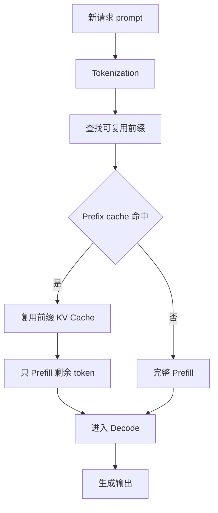

# Prefix Cache

Prefix Cache 是一种复用 prompt 前缀计算结果的推理优化。它的核心思想是：如果多个请求开头一大段 token 完全相同，就不必每次都重新 Prefill 这段前缀，可以直接复用已经算好的 KV Cache。

一句话理解：

> Prefix Cache 复用“已经读过的公共开头”，减少重复 Prefill，从而降低 TTFT、GPU 计算量和成本。

它特别适合固定 system prompt、工具说明、few-shot 示例、RAG 模板、多轮对话公共历史等场景。

## 为什么会有相同前缀

在线 LLM 服务里，很多请求看起来问题不同，但 prompt 开头其实高度相似。

例如一个代码助手可能总是带着同一段 system prompt：

```text
你是一个严谨的代码助手。
回答时先说明原因，再给出代码。
不要编造不存在的 API。

用户问题：……
```

一个 Agent 服务可能总是带着同一段工具说明：

```text
你可以调用以下工具：
1. search(query)
2. read_file(path)
3. run_test(command)

当前任务：……
```

一个 RAG 服务可能总是带着固定模板：

```text
请只根据下面的资料回答问题。
如果资料不足，请说明不知道。

资料：
...

问题：……
```

这些固定开头每次都重新 Prefill，会浪费 GPU 计算。Prefix Cache 的目标就是识别这些公共前缀，并复用它们的 KV Cache。

## Prefix Cache 在请求链路中的位置

Prefix Cache 发生在 Prefill 之前或 Prefill 过程中。系统会先判断当前请求的 token 前缀是否已经缓存过。如果命中，就只需要从未命中的位置继续 Prefill。



如果前缀完全命中，Prefill 可以跳过大量 token。如果只命中一部分，系统可以复用已命中的前半段，对后半段继续计算。

## Prefix Cache 缓存的是什么

Prefix Cache 缓存的不是原始文本，也不是最终回答，而是某段前缀 token 经过模型 Prefill 后产生的 KV Cache。

这意味着：

- 同一段文本必须 tokenization 后 token id 一样，才是真正相同。
- 同一个模型、tokenizer、LoRA/adapter、位置编码配置下的 KV 才能安全复用。
- Prefix Cache 命中后，后续 Decode 仍然会根据当前请求继续生成，不是直接返回旧答案。

它和几类常见缓存不同：

| 缓存类型 | 缓存内容 | 命中后节省什么 |
| --- | --- | --- |
| Prefix Cache | prompt 前缀对应的 KV Cache | 节省重复 Prefill |
| Response Cache | 完整请求对应的最终回答 | 节省整次模型调用 |
| Query Cache | 用户问题或检索查询结果 | 节省业务查询或检索 |
| Embedding Cache | 文本 embedding | 节省 embedding 模型调用 |
| Retrieval Cache | 检索结果 | 节省向量检索或 rerank |

Prefix Cache 不是回答缓存。即使前缀相同，只要用户后半段问题不同，模型仍然需要继续 Prefill 剩余 token，并重新 Decode 输出。

## 和 KV Cache 的关系

KV Cache 是更底层的概念：它保存历史 token 的 key/value。

Prefix Cache 是一种使用 KV Cache 的策略：发现多个请求有相同前缀时，把这段前缀的 KV Cache 复用起来。

可以这样理解：

- KV Cache 回答“历史上下文如何保存”。
- Prefix Cache 回答“哪些历史上下文可以跨请求复用”。

没有 KV Cache，就没有 Prefix Cache。Prefix Cache 的收益来自少算一段 Prefill，而不是改变 Decode 的基本方式。

## 和 PagedAttention 的关系

PagedAttention 负责把 KV Cache 切成 block，并通过 block table 管理逻辑上下文和物理 block 的映射。

Prefix Cache 可以利用这种 block 级管理：如果多个请求共享相同前缀，它们可以引用同一批物理 KV block，而不必复制一份。

两者的分工是：

- Prefix Cache 判断“这个前缀能不能复用”。
- PagedAttention 管理“这段前缀 KV 如何被多个请求共享、引用和释放”。

如果请求后续内容不同，系统可以让共享前缀继续共享，后续分叉部分各自分配新的 block。

## 命中条件

Prefix Cache 能不能命中，取决于“前缀是否真的一致”。这里的一致通常不是字符串层面的相似，而是 token 序列和执行上下文的一致。

常见命中条件包括：

- 模型相同。
- tokenizer 相同。
- token id 前缀完全一致。
- LoRA / adapter / prompt adapter 相同。
- 多模态输入对应的前缀表示一致。
- 位置编码、上下文设置和相关 runtime 配置兼容。
- 租户、权限和隔离策略允许复用。

注意：两个字符串看起来一样，不一定 token 序列完全一样；两个 prompt 语义相似，也不能复用 Prefix Cache。Prefix Cache 需要的是确定性的前缀一致。

## 适合哪些场景

Prefix Cache 适合“前缀长、复用多、请求频繁”的场景。

典型场景包括：

- 固定 system prompt 很长。
- 工具调用 schema 很长。
- few-shot 示例固定。
- Agent 框架每次都带大量工具说明。
- RAG 模板固定，问题部分变化。
- 多轮对话共享较长历史。
- 同一个文档被很多用户反复提问。
- 批量任务中大量请求有相同任务说明。

它不适合前缀很短或高度随机的场景。如果每个请求开头都不同，cache hit rate 很低，维护缓存可能得不偿失。

## 命中率为什么关键

Prefix Cache 的收益由命中率决定。命中率高时，系统可以少做很多 Prefill；命中率低时，系统只是多维护了一套缓存结构。

影响命中率的因素包括：

- prompt 模板是否稳定。
- system prompt 是否频繁变更。
- 工具 schema 是否每次都重新排序。
- RAG 文档是否放在前缀位置。
- 用户历史对话是否能形成公共前缀。
- 是否按租户、模型、adapter 分开缓存。
- tokenization 是否稳定。

如果业务层 prompt 模板经常插入时间戳、随机 id、动态状态，前缀很快就分叉，Prefix Cache 就难以命中。

所以要提高命中率，往往需要业务层配合：

- 固定 system prompt 顺序。
- 固定工具 schema 顺序。
- 避免把随机字段放在 prompt 开头。
- 把高复用内容放在前面。
- 把用户变化内容尽量放在后面。
- 对模板版本做明确管理。

## Prefix Cache 如何降低 TTFT

TTFT 里通常包含排队、tokenization、Prefill 和首 token 返回。Prefix Cache 主要降低的是 Prefill 部分。

假设一个请求有 3000 个输入 token，其中前 2000 个 token 是固定 system prompt、工具说明和 few-shot 示例。如果这 2000 个 token 命中 Prefix Cache，新请求只需要 Prefill 剩余 1000 个 token。

这会带来几个效果：

- 首 token 更快出现。
- Prefill GPU 计算减少。
- Prefill-heavy workload 的吞吐提高。
- 长公共前缀请求对 Decode 的阻塞减少。

但 Prefix Cache 不能解决所有 TTFT 问题。如果请求主要慢在排队、tokenization、网络返回或剩余非缓存 token 很长，Prefix Cache 的收益就有限。

## 内存代价

Prefix Cache 要保存可复用前缀的 KV Cache，因此会占用显存或内存。

这带来一个取舍：

- 缓存更多前缀，可以提高命中率。
- 缓存占用太多，会挤压正在服务请求的 KV Cache。
- 缓存放在 CPU 内存，命中后搬回 GPU 可能有传输延迟。
- 缓存放在 GPU 显存，命中快，但显存更紧张。

所以 Prefix Cache 不能无限增长。系统需要控制容量、过期时间和驱逐策略。

## Eviction：缓存满了怎么办

Prefix Cache 容量有限，满了就要驱逐一部分缓存。驱逐策略决定哪些前缀应该留下。

常见考虑因素包括：

- 最近是否被使用。
- 命中频率是否高。
- 这段前缀有多长。
- 重新 Prefill 的成本有多高。
- 属于哪个租户或优先级。
- 是否仍有活跃请求引用。

简单 LRU 可以作为起点，但不一定总是最优。比如一个很长的公共工具说明虽然最近没用，但重新计算成本很高；一个短前缀虽然常命中，但节省的 Prefill 很少。

更合理的策略通常要结合“命中概率”和“重算成本”。

## 多租户和安全隔离

Prefix Cache 涉及跨请求复用 KV Cache，因此多租户场景必须小心。

需要避免几类问题：

- 一个租户的私有 system prompt 被另一个租户复用。
- 带用户隐私的前缀被错误共享。
- 不同权限、不同策略版本的 prompt 被混用。
- 调试或日志里暴露 cache key 中的敏感信息。

安全做法通常包括：

- cache key 中包含 tenant id 或隔离域。
- 私有 prompt 默认不跨租户复用。
- 对可共享前缀做显式标记。
- 模板版本和权限策略进入 cache key。
- 日志中避免记录完整 prompt。

Prefix Cache 是性能优化，不应该突破安全边界。

## Cache key 设计

Cache key 用来判断某段前缀是否可复用。设计不好会造成两类问题：该命中的没有命中，不该命中的错误命中。

一个较完整的 cache key 通常需要包含：

- model id / model revision。
- tokenizer id / tokenizer revision。
- LoRA / adapter id。
- prefix token ids。
- prompt template version。
- 租户或隔离域。
- multimodal encoder state or media hash。
- position encoding / context settings。

如果只用原始字符串做 key，可能忽略 tokenizer 差异、模板版本、模型版本或权限隔离，风险较高。

工程上通常会把 token id 前缀作为核心，而不是只比较文本。

## Partial Prefix：部分命中

Prefix Cache 不一定只能完整命中。很多时候，一个请求可以命中前半段公共前缀，然后从分叉点继续 Prefill。

例如：

```text
公共 system prompt
工具说明
固定 few-shot 示例
用户 A 的问题
```

另一个请求是：

```text
公共 system prompt
工具说明
固定 few-shot 示例
用户 B 的问题
```

两者前面三段相同，最后用户问题不同。系统可以复用前三段 KV Cache，只计算后面的用户问题。

支持 partial prefix 需要更复杂的数据结构，例如 trie、radix tree 或 block 级前缀索引。它的价值在于让缓存不局限于“整个 prompt 完全相同”，而是能复用最长公共前缀。

## 和 RAG / Agent 的关系

RAG 和 Agent 很容易受 Prefix Cache 影响。

Agent 请求通常有大量固定工具说明。如果每次都重新 Prefill 工具 schema，会浪费很多计算。Prefix Cache 可以复用这些固定说明。

RAG 请求则要看资料放在哪里。如果每个请求检索到的文档不同，而且文档被放在 prompt 前面，公共前缀可能很短，命中率会下降。如果固定指令、格式约束和引用规则放在前面，至少这部分可以复用。

一个实用原则是：

- 高复用、低变化内容尽量放在前面。
- 用户问题、检索结果、动态状态尽量放在后面。
- 工具列表、输出格式、固定规则保持稳定顺序。

这样有利于 Prefix Cache 命中。

## 该观察哪些指标

评估 Prefix Cache 时，建议观察：

| 指标 | 说明 |
| --- | --- |
| prefix cache hit rate | 前缀命中率 |
| matched prefix length | 平均命中的前缀 token 数 |
| saved prefill tokens | 节省了多少 Prefill token |
| TTFT before/after | 首 token 是否明显改善 |
| prefill tokens/s | Prefill 吞吐是否提高 |
| cache memory usage | Prefix Cache 占用多少显存或内存 |
| eviction count | 缓存是否频繁驱逐 |
| recompute count | 驱逐后是否频繁重算 |
| tenant-level hit rate | 不同租户命中率是否差异很大 |
| p95 / p99 latency | 尾延迟是否改善 |

只看 hit rate 也不够。命中 10 个 token 和命中 2000 个 token 的价值完全不同，所以还要看 saved prefill tokens。

## 一个最小例子

假设有两个请求：

请求 A：

```text
系统提示：你是一个数据库助手。
工具说明：你可以调用 explain_sql、run_query。
用户问题：解释这条 SQL 为什么慢。
```

请求 B：

```text
系统提示：你是一个数据库助手。
工具说明：你可以调用 explain_sql、run_query。
用户问题：帮我优化这个索引。
```

前两段完全相同。第一次请求 A 到来时，系统完整 Prefill，并缓存前两段对应的 KV。请求 B 到来时，系统复用前两段 KV，只需要 Prefill 用户问题部分。

这样做不会让 B 直接得到 A 的回答，因为两者后半段不同，Decode 仍然根据 B 的完整上下文生成。

## 常见误区

- **误区一：Prefix Cache 就是 Response Cache。**
  Prefix Cache 复用的是前缀 KV，不是最终回答。命中后仍然要继续计算和生成。

- **误区二：语义相似就能命中。**
  Prefix Cache 需要 token 前缀一致，不是语义相似。

- **误区三：Prefix Cache 没有安全风险。**
  跨请求复用上下文状态必须处理租户、权限和隐私隔离。

- **误区四：命中率高就一定收益高。**
  还要看命中的前缀长度和节省的 Prefill token 数。

- **误区五：缓存越多越好。**
  缓存占用显存或内存，可能挤压活跃请求的 KV Cache。

读完这一节，应该能回答五个问题：

- Prefix Cache 缓存的是什么，不是什么。
- 它如何降低 Prefill 成本和 TTFT。
- 为什么 token 前缀一致比字符串相似更重要。
- Prefix Cache 和 KV Cache、PagedAttention、Response Cache 的区别。
- 命中率、前缀长度、隔离策略和驱逐策略为什么都会影响收益。
