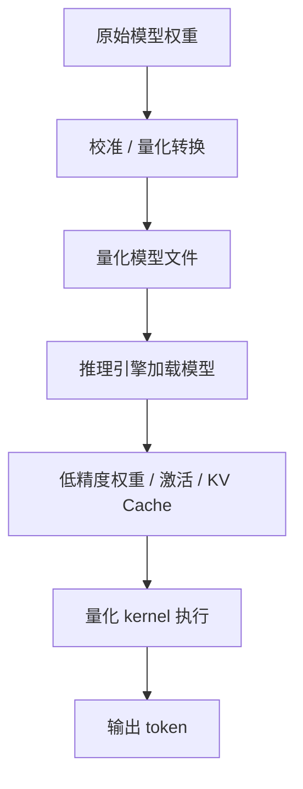

# 量化推理

量化推理是把模型推理中的一部分数据从高精度表示，换成更低精度表示。它的目标通常是减少显存占用、降低内存带宽压力、提高吞吐，并让同样硬件可以服务更大的模型或更多并发请求。

一句话理解：

> 量化不是让模型“少思考”，而是用更省空间、更适合硬件执行的数字格式来表示权重、激活或 KV Cache。

例如，一个模型原本用 FP16 保存权重，每个参数 2 字节。如果改成 INT8，每个参数约 1 字节；如果改成 INT4，每个参数约 0.5 字节。权重变小后，模型加载占用更少显存，读取权重时需要搬运的数据也更少。

但量化不是免费午餐。精度变低后，模型输出质量可能下降，某些任务可能更不稳定，推理引擎也必须有对应 kernel 才能真正变快。

## 量化在推理链路中的位置

量化通常发生在模型部署前，也可能发生在推理运行时。

部署前，系统会把原始模型权重转换成某种低精度格式，并保存成量化后的模型文件。运行时，推理引擎加载这些低精度权重，并用支持该格式的 kernel 执行矩阵乘法。



不同量化方案的差别，主要在于：

- 量化哪些数据。
- 使用什么数值格式。
- 量化粒度有多细。
- 是否需要校准数据。
- 是否需要重新训练或微调。
- 推理时是否需要 dequantize。
- 硬件和推理引擎是否真正支持。

## 为什么量化能提升推理效率

LLM 推理通常受到两个因素限制：计算能力和数据搬运能力。

权重、激活和 KV Cache 都需要在显存中存储和读取。模型越大，上下文越长，并发越高，显存和内存带宽压力越明显。

量化主要从三个方向带来收益。

### 1. 减少模型权重显存

权重占用更小后，同一张 GPU 可以放下更大的模型，或者为 KV Cache 留出更多显存。

例如一个 70B 参数模型：

- FP16 权重约 140 GB。
- INT8 权重约 70 GB。
- INT4 权重约 35 GB。

这只是粗略估算，实际还要加上 scale、zero point、metadata、KV Cache、临时 workspace 和推理引擎开销。但这个量级能说明为什么大模型部署非常依赖量化。

### 2. 降低内存带宽压力

Decode 阶段每生成一个 token，都要读取大量模型权重。很多时候，系统不是算力不够，而是权重从显存搬到计算单元的速度跟不上。

权重变小后，每步需要搬运的数据减少，Decode 的 TPOT 可能下降，tokens/s 可能提高。

### 3. 使用更快的低精度计算单元

现代 AI 加速器通常对低精度计算有专门支持，例如 FP8、INT8 或 INT4 tensor core / matrix engine。

如果量化格式能被硬件和 kernel 高效利用，矩阵乘法本身也可能更快。

但这里有一个关键前提：推理引擎必须真的使用了高效 kernel。否则量化权重虽然更小，但运行时 dequantize 和额外转换可能抵消收益。

## 量化哪些数据

推理量化不只一种。按照量化对象，可以分成权重量化、激活量化和 KV Cache 量化。

| 量化对象 | 量化内容 | 主要收益 | 主要风险 |
| --- | --- | --- | --- |
| 权重量化 | 模型参数 | 减少模型显存和权重读取带宽 | 输出质量下降，kernel 支持受限 |
| 激活量化 | 层间中间结果 | 减少计算和激活带宽 | 对校准和数值范围更敏感 |
| KV Cache 量化 | Decode 历史上下文的 key/value | 降低长上下文和高并发显存 | 长上下文质量和稳定性受影响 |

不同方案可以组合使用。例如常见的 weight-only quantization 只量化权重，运行时激活仍然用 FP16/BF16；W8A8 会同时使用 8 bit 权重和 8 bit 激活；KV Cache 量化则专门针对上下文缓存。

## 权重量化

权重量化是最常见、最容易理解的量化形式。它把模型权重从 FP16/BF16 压缩到 INT8、INT4 或其他格式。

权重量化的直接收益是模型更小：

- 显存占用下降。
- 权重加载更快。
- Decode 读取权重的带宽压力下降。
- 单卡或少卡部署更容易。

常见形式包括：

- W8A16：权重 INT8，激活 FP16/BF16。
- W4A16：权重 INT4，激活 FP16/BF16。
- FP8 weight：权重使用 FP8 表示。
- group-wise INT4 / INT8：按一组权重共享 scale。

Weight-only quantization 的好处是工程风险相对较低，因为激活仍然保留较高精度。它常用于降低显存和 Decode 成本。

## 激活量化

激活是模型每一层计算过程中产生的中间结果。激活量化会把这些中间结果也转换成低精度格式。

如果权重和激活都能用低精度，矩阵乘法可能真正进入高效低精度路径。例如 W8A8 表示权重 8 bit、激活 8 bit。

激活量化通常比权重量化更敏感，原因是激活的数值范围会随输入变化：

- 不同 prompt 会产生不同激活分布。
- 长上下文可能改变激活范围。
- 某些层或通道可能出现 outlier。
- 校准数据不代表真实流量时，误差会变大。

因此激活量化常常需要校准数据，并需要对 scale、outlier、层选择做更细处理。

## KV Cache 量化

KV Cache 保存历史 token 的 key/value。上下文越长、并发越高，KV Cache 占用越大。

KV Cache 量化的目标是降低 Decode 阶段的显存压力，尤其适合：

- 长上下文服务。
- 高并发在线推理。
- 显存主要被 KV Cache 占满的场景。
- 需要提高最大并发或最大上下文长度的场景。

KV Cache 量化的风险在于，它会影响后续所有 token 的注意力计算。如果误差积累明显，模型可能在长上下文、精确引用、代码、数学或多轮对话中表现下降。

所以 KV Cache 量化不能只看显存下降，还要重点评估长上下文质量和输出稳定性。

## 常见数值格式

不同数值格式的表达能力不同。推理系统里常见的是 FP16、BF16、FP8、INT8 和 INT4。

| 格式 | 大致特点 | 常见用途 |
| --- | --- | --- |
| FP16 | 半精度浮点，范围和精度有限 | 传统推理和训练常用 |
| BF16 | 指数范围更大，精度略低 | 训练和推理常用 |
| FP8 | 更低精度浮点，依赖硬件支持 | 新硬件上的高性能推理/训练 |
| INT8 | 8 bit 整数，工程成熟度较高 | 权重/激活量化 |
| INT4 | 4 bit 整数，压缩率高 | weight-only 量化常见 |

浮点格式能表示小数和较大动态范围，整数格式通常需要 scale 把真实数值映射到整数范围。

可以简单理解为：

- FP16/BF16 更稳，但更占空间。
- INT8 压缩适中，质量通常较稳。
- INT4 压缩更强，但更依赖量化方法和模型特性。
- FP8 依赖硬件和软件栈支持，适合追求更高性能的场景。

## Scale 和 Zero Point

整数本身不能直接表示任意小数，所以量化需要一个映射关系。

最常见的形式是：

```text
真实数值 ≈ scale * (整数值 - zero_point)
```

其中：

- scale 决定整数单位对应多大的真实数值。
- zero_point 决定真实 0 映射到哪个整数。

如果一整层共享一个 scale，元数据少，但误差可能大。如果每个 channel 或每个 group 有自己的 scale，误差更小，但元数据更多，kernel 也更复杂。

这就是量化粒度的取舍。

## 量化粒度

量化粒度决定多少数值共享一组 scale。

常见粒度包括：

- per-tensor：整个张量共享 scale。
- per-channel：每个输出通道单独 scale。
- per-group：每组权重共享 scale。
- per-token：某些激活量化中按 token 计算 scale。

粒度越细，越能贴合不同位置的数值分布，质量通常越好。但粒度越细，metadata 越多，kernel 实现越复杂，运行时开销也可能更高。

工程上经常会选择 group-wise 量化作为折中。比如 INT4 权重量化中，几十或上百个权重共享一组 scale。

## PTQ 与 QAT

按照是否重新训练，量化可以分成 PTQ 和 QAT。

PTQ 是 post-training quantization，即训练完成后直接量化。它不需要重新训练完整模型，部署成本低，是推理系统里更常见的方式。

PTQ 通常流程是：

1. 准备原始模型。
2. 选择量化格式和粒度。
3. 用校准数据估计数值范围。
4. 生成量化权重。
5. 跑质量评估和性能评估。
6. 如果不达标，调整方案或回退。

QAT 是 quantization-aware training，即训练或微调时就模拟量化误差，让模型适应低精度表示。QAT 质量可能更好，但成本更高，工程流程更重。

对于已有大模型的推理部署，通常先考虑 PTQ；只有质量损失无法接受、业务价值足够高时，才考虑 QAT 或定制微调。

## 常见量化方法

不同量化方法解决的问题不同。这里先给直观理解，不展开数学细节。

### Weight-only Quantization

Weight-only quantization 只量化权重，激活仍然用 FP16/BF16。

它适合先降低模型显存和 Decode 权重读取压力。常见 W4A16、W8A16 都属于这个方向。

优点是部署相对简单，质量风险较低；缺点是计算过程中仍然需要把权重还原或用特殊 kernel 处理，收益依赖推理引擎实现。

### SmoothQuant

SmoothQuant 主要面向 weight-activation quantization。它的直观思想是把激活中的 outlier 压力转移到权重上，让激活更容易被 INT8 表示。

它解决的是“激活分布不稳定，直接量化容易出错”的问题。

### GPTQ

GPTQ 是一种常见的 post-training weight quantization 方法。它会利用校准数据和近似误差补偿，让低 bit 权重量化后尽量保持模型输出接近原模型。

它常用于 INT4 权重量化。

### AWQ

AWQ 关注激活感知的权重量化。它的核心直觉是：不是所有权重同等重要，和激活交互更关键的部分应该被更好地保护。

它也常用于低 bit 权重量化，尤其是面向部署的 weight-only 场景。

### FP8 Quantization

FP8 使用 8 bit 浮点格式。相比 INT8，它仍然保留浮点动态范围的特点，但需要硬件和软件栈支持。

FP8 的价值通常体现在新一代 GPU 或 AI 加速器上。如果硬件不支持高效 FP8，单纯保存成 FP8 不一定能带来推理加速。

## Prefill 和 Decode 中的收益差异

量化对 Prefill 和 Decode 的影响不完全一样。

Prefill 一次处理大量输入 token，矩阵乘法规模较大，可能更容易利用计算单元。Decode 每次只生成少量 token，更容易受权重读取和 KV Cache 读取影响。

因此：

- 权重量化常常对 Decode 很有价值，因为 Decode 会反复读取权重。
- 激活量化对大 batch 或 Prefill-heavy 场景可能更明显。
- KV Cache 量化对长上下文和高并发 Decode 更明显。
- 如果 batch 很小，kernel 启动和 dequantize 开销可能影响收益。

评估量化时，不能只跑一个固定 input/output 长度。要分别观察 prefill-heavy、decode-heavy 和 mixed workload。

## 量化为什么可能不变快

量化后模型更小，但不一定更快。

常见原因包括：

- 推理引擎没有使用高效量化 kernel。
- 低精度权重运行时需要频繁 dequantize。
- batch 太小，kernel 开销占比高。
- 瓶颈不在权重读取，而在调度、网络、tokenization 或后处理。
- 量化格式和硬件不匹配。
- KV Cache 或通信才是真正瓶颈。
- 量化降低了单请求延迟，但系统因为调度策略没有提高并发。

所以量化评估必须同时看性能 profile。只看模型文件变小，没有意义。

## 对输出质量的影响

量化会引入数值误差。误差不一定导致明显问题，但需要评估。

容易受影响的场景包括：

- 数学推理。
- 代码生成。
- 长上下文引用。
- 多轮对话一致性。
- 严格格式输出。
- 工具调用参数生成。
- 小语种或领域术语。
- safety classifier 或拒答边界。

质量评估不能只看一两个样例。至少要包含：

- 通用问答。
- 目标业务任务。
- 长上下文任务。
- 代码或结构化输出任务。
- 边界和异常输入。
- 与原始 FP16/BF16 模型的对比。

如果服务依赖 function calling、JSON 输出或 Agent tool use，还要评估格式错误率和工具调用成功率。

## 硬件和推理引擎限制

量化是否有收益，强依赖硬件和推理引擎。

需要确认的问题包括：

- 当前 GPU 是否支持目标格式的高效计算。
- 推理引擎是否支持该量化格式。
- 是否有 fused kernel，避免频繁反量化和额外搬运。
- Tensor Parallel / Pipeline Parallel 是否支持该格式。
- LoRA、MoE、Speculative Decoding 是否兼容。
- KV Cache 量化是否支持当前 attention backend。
- 多卡通信是否会因为数据格式转换增加开销。

同一个 INT4 模型，在不同推理引擎、不同 GPU、不同 batch shape 下，性能可能差异很大。

## 与其他优化的关系

量化不是孤立优化，它会和很多推理系统机制互相影响。

### 与 Batching

量化可能让单卡显存更宽裕，从而容纳更大 batch 或更多并发。但如果调度器没有扩大 batch，吞吐不一定明显提高。

### 与 KV Cache

权重量化减少模型权重显存，间接给 KV Cache 留出空间。KV Cache 量化则直接降低上下文缓存显存。

两者结合时，系统可能同时提高最大并发和最大上下文长度。

### 与 PagedAttention

PagedAttention 管理 KV Cache block。KV Cache 量化后，每个 block 占用更少显存，但 block 管理、alignment、kernel 访问方式也要适配。

### 与 Prefix Cache

Prefix Cache 复用前缀 KV。若 KV Cache 被量化，复用的也是量化后的 KV 或相关表示。需要确认精度、格式和 cache key 是否兼容。

### 与 Speculative Decoding

Speculative Decoding 可能使用 draft model。draft model 可以更小或更低精度，但如果质量太差，acceptance rate 会下降，反而影响收益。

## 常见优化方向

量化优化的重点是同时控制性能、质量和工程复杂度。

### 1. 先明确瓶颈

如果瓶颈是模型权重显存或 Decode 权重读取，权重量化很可能有效。如果瓶颈是 KV Cache 显存，KV Cache 量化更直接。如果瓶颈是网络、排队或 tokenizer，量化不一定能解决。

先 profile，再选择方案。

### 2. 从保守精度开始

可以先从 INT8 或 FP8 这类相对保守方案开始，再尝试 INT4。这样更容易定位质量损失来自哪里。

如果一上来直接用强压缩方案，质量问题和性能问题会混在一起。

### 3. 使用代表性校准数据

校准数据应该接近真实流量，包括常见输入长度、领域术语、格式输出、多轮对话和长上下文。

校准数据太简单，量化后的模型在线上可能表现不稳定。

### 4. 保护敏感层或敏感通道

有些层、通道或权重对输出更敏感。可以让它们保留更高精度，或使用更细的量化粒度。

混合精度常常比全模型一刀切更稳。

### 5. 同时评估质量和系统指标

量化不能只看 benchmark 分数，也不能只看 tokens/s。

至少要同时比较：

- 输出质量。
- TTFT。
- TPOT。
- 吞吐。
- 峰值显存。
- 最大并发。
- p95 / p99 latency。
- 成本每 token。

### 6. 做可回退发布

量化模型上线后，应该保留回退到高精度模型的路径。可以先灰度一部分流量，观察质量指标、错误率、投诉、格式失败率和延迟。

量化是部署策略的一部分，不只是离线转换模型文件。

## 该观察哪些指标

评估量化推理时，建议观察：

| 指标 | 说明 |
| --- | --- |
| model memory | 模型权重占用显存 |
| peak GPU memory | 峰值显存，包括 KV Cache 和 workspace |
| TTFT | 首 token 是否改善 |
| TPOT | 每 token 生成时间是否改善 |
| tokens/s | 总 token 吞吐 |
| requests/s | 请求吞吐 |
| max concurrency | 同等 SLO 下最大并发 |
| p95 / p99 latency | 尾延迟是否变化 |
| quality score | 任务评估分数是否下降 |
| format error rate | JSON、工具调用等格式错误率 |
| acceptance rate | 如果结合 speculative decoding，需要看接受率 |
| cost per token | 单 token 成本是否下降 |

这些指标要和未量化模型对比，并且要在相同硬件、相同推理引擎、相同 workload 下测量。

## 一个最小例子

假设一个 13B 模型用 FP16 部署，权重大约占 26 GB 显存。某张 GPU 显存 40 GB，除去 runtime 和临时 buffer 后，留给 KV Cache 的空间有限，因此并发上不去。

如果使用 INT4 weight-only quantization，权重可能降到约 6.5 GB 加少量 scale 元数据。这样系统可以给 KV Cache 留出更多空间。

可能带来的效果是：

- 单卡能服务更多并发请求。
- Decode 读取权重带宽下降。
- TPOT 改善。
- 成本每 token 下降。

但仍然需要确认：

- 输出质量是否可接受。
- 当前引擎 INT4 kernel 是否高效。
- 长上下文下是否稳定。
- p99 latency 是否真的改善。
- 是否影响工具调用和结构化输出。

所以量化评估的结论不能只写“模型变小 4 倍”，还要写“在什么 workload 下，质量下降多少，延迟和吞吐改善多少”。

## 常见误区

- **误区一：量化一定会让推理更快。**
  如果 kernel 不支持、瓶颈不在权重读取，或 dequantize 开销很大，量化可能只省显存，不明显提速。

- **误区二：模型文件小几倍，显存就省几倍。**
  实际显存还包括 KV Cache、临时 buffer、metadata、runtime workspace 和通信缓冲。

- **误区三：INT4 一定比 INT8 更好。**
  INT4 压缩更强，但质量风险和 kernel 要求更高。INT8 可能更稳、更容易部署。

- **误区四：只评估平均质量就够了。**
  量化问题常出现在长上下文、数学、代码、格式输出和边界样例中，平均分可能掩盖风险。

- **误区五：量化只是模型算法问题。**
  量化能不能落地，取决于硬件、kernel、推理引擎、调度、缓存和发布策略。

读完这一节，应该能回答五个问题：

- 量化推理量化的是什么，不是什么。
- 权重量化、激活量化和 KV Cache 量化分别解决什么问题。
- INT8、INT4、FP8 的收益和风险有什么不同。
- 为什么量化后不一定变快。
- 应该如何同时评估量化后的性能、显存、质量和稳定性。
