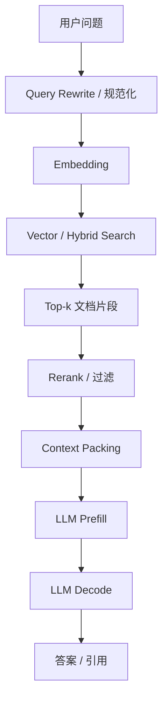
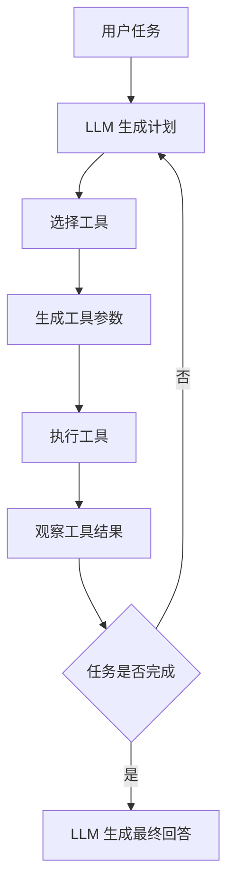
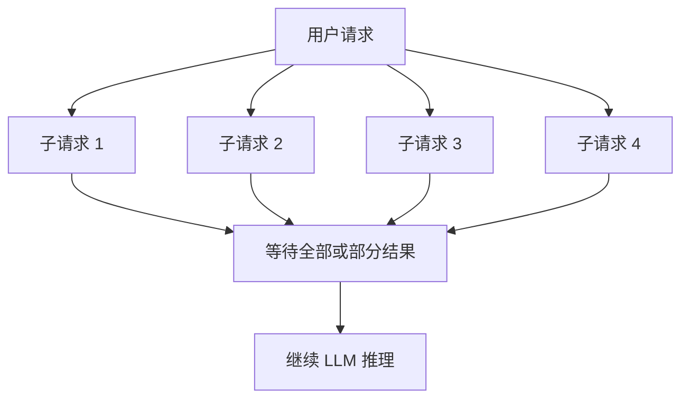

# RAG 与 Agent 推理负载

RAG 与 Agent 不是单次模型调用，而是由检索、rerank、上下文拼接、工具调用、多轮规划和多次 LLM 推理组成的复合 workload。它们最值得关注的不是“提示词怎么写”，而是这些额外环节如何改变延迟、吞吐、显存、成本和可靠性。

一句话理解：

> RAG / Agent 把一次推理请求变成一条小型流水线：模型不再只是生成答案，还要读外部知识、调用工具、等待外部系统、处理失败，并把多个阶段串成一个端到端结果。

所以在推理系统里，RAG / Agent 不能只按“LLM tokens/s”理解。真正影响用户体验的，往往是检索延迟、rerank 延迟、Prefill 成本、工具超时、重试次数、缓存命中率和尾延迟放大。

## 它适合学习什么

RAG / Agent 推理负载适合把前面学过的推理系统概念连起来。

| 相关主题 | 在 RAG / Agent 中对应的问题 |
| --- | --- |
| 推理请求生命周期 | 一个用户请求会拆成多个内部阶段 |
| Prefill 与 Decode | 检索内容和工具结果会拉长 prompt，增加 Prefill 成本 |
| KV Cache | 多轮上下文和长上下文会持续占用显存 |
| Prefix Cache | system prompt、工具说明、RAG 模板可以复用 |
| Batching / 调度 | 多个短调用和长调用混合，调度更复杂 |
| 缓存体系 | query、embedding、retrieval、rerank、tool result 都可能缓存 |
| Benchmark | 不能只测单次模型调用，要测端到端链路 |
| 可靠性 | 检索失败、工具超时、格式错误和重试会放大失败概率 |

因此，RAG / Agent 是理解“真实 LLM 应用如何给推理系统施压”的关键章节。

## RAG 是什么

RAG 是 Retrieval-Augmented Generation，核心思想是：模型回答问题前，先从外部知识库检索相关材料，再把这些材料放进上下文，让模型基于检索结果生成答案。

最简单的 RAG 流程如下：



这条链路里，LLM 只是后半段。前半段的检索和上下文构造会显著影响后半段的推理性能。

例如，检索返回的文档越多，上下文越长，Prefill 越重，TTFT 可能越高。检索结果质量越差，模型越可能答错或需要更多重试。rerank 越复杂，LLM 前面的等待时间越长。

## Agent 是什么

Agent 通常指模型不只是回答问题，还会根据任务状态进行计划、选择工具、调用外部系统、观察结果，再决定下一步。

一个简化 Agent 流程如下：



这类负载的系统特点是“循环”。一次用户请求可能触发多次 LLM 调用、多次工具调用、多次解析和多次重试。

和普通聊天相比，Agent 更容易出现：

- 端到端延迟很长。
- 外部工具超时。
- 某一步失败导致整体失败。
- 多轮上下文不断变长。
- 重试导致成本不可控。
- p95 / p99 延迟明显放大。

因此 Agent 系统必须有超时、预算、最大步数、错误恢复和观测指标，不能只相信模型会自己完成任务。

## 端到端延迟如何拆解

RAG / Agent 的延迟不是一个数，而是多个阶段相加。

一个 RAG 请求的端到端延迟可以粗略拆成：

```text
E2E latency =
  API / queue
+ query rewrite
+ embedding
+ retrieval
+ rerank
+ context packing
+ LLM prefill
+ LLM decode
+ postprocess / citation
```

一个 Agent 请求可能更复杂：

```text
E2E latency =
  initial LLM call
+ tool call 1
+ observation parsing
+ LLM call 2
+ tool call 2
+ ...
+ final LLM call
+ retries / timeouts
```

系统优化时必须知道时间花在哪里。

如果瓶颈在 retrieval，换更快的 LLM 没有用。如果瓶颈在 LLM Prefill，减少检索片段或提高 Prefix Cache 命中率可能更有效。如果瓶颈在工具调用，GPU 利用率再高也不能解决端到端等待。

## Fan-out 与尾延迟放大

RAG / Agent 很容易出现 fan-out。Fan-out 是指一个用户请求会并行或串行触发多个子请求。

例如：

- 同时查询多个向量库。
- 同时调用多个搜索引擎。
- 同时调用多个工具。
- 对多个候选文档做 rerank。
- 对多个候选答案做 self-consistency。

Fan-out 会放大尾延迟。原因是：端到端请求常常要等最慢的子请求返回。

假设一个请求并行调用 5 个工具，只要其中一个工具 p99 很差，整体 p99 就可能很差。即使每个子系统平均延迟都不高，组合起来的尾延迟也可能很糟。

这就是 RAG / Agent 系统里常见的 tail amplification。



优化 fan-out 的关键不是“所有子请求都尽量多发”，而是控制依赖关系、超时策略、返回条件和降级路径。

## 检索阶段的系统成本

RAG 的检索阶段通常包含 embedding、向量检索、关键词检索、hybrid search 和 rerank。

这些组件都会影响系统性能。

| 阶段 | 主要成本 | 常见问题 |
| --- | --- | --- |
| Query rewrite | 一次额外 LLM 调用或规则处理 | 增加延迟，但可能提高召回 |
| Embedding | 模型推理或缓存查询 | 高 QPS 下可能成为独立瓶颈 |
| Vector search | ANN 查询、索引访问 | 受索引规模、维度、top-k 影响 |
| Hybrid search | 向量 + 关键词融合 | 系统复杂度更高 |
| Rerank | 交叉编码器或 LLM rerank | 质量好但延迟高 |
| Context packing | 拼接、去重、裁剪 | 直接影响 Prefill 长度 |

检索不是越多越好。检索更多片段可能提高召回，但也会增加 rerank 成本和 LLM Prefill 成本。

RAG 的核心取舍是：

- 召回更多，质量可能更好，但上下文更长。
- 上下文更长，Prefill 更慢，KV Cache 更大。
- rerank 更强，排序更准，但前置延迟更高。
- 缓存更多，速度更快，但一致性和失效管理更复杂。

## Context Packing 为什么重要

Context Packing 是把检索结果、用户问题、系统提示词、引用格式和工具说明组织成最终 prompt 的过程。

它对推理系统影响很大，因为最终 prompt 长度直接决定 Prefill 成本。

常见问题包括：

- 把太多无关片段塞进 prompt。
- 多个片段重复，浪费上下文。
- 引用信息过长，挤占有效内容。
- 固定模板太长，所有请求都背负额外 Prefill。
- 文档顺序不合理，重要信息被放得太靠后。

Context Packing 的优化方向包括：

- 去重相似片段。
- 控制 top-k。
- 使用 rerank 保留高价值片段。
- 把固定 system prompt 和工具说明做 Prefix Cache。
- 对长文档做分层摘要或局部截取。
- 记录实际 input tokens 分布，而不是只看字符数。

从系统角度看，Context Packing 是连接检索质量和推理成本的关键环节。

## Agent 工具调用的系统问题

Agent 的工具调用会把 LLM 服务变成分布式系统问题。

工具可能是：

- 搜索引擎。
- 数据库。
- 代码执行环境。
- 文件系统。
- 浏览器。
- 内部 API。
- 外部 SaaS。

这些工具有自己的延迟、错误率、权限和安全边界。

常见系统问题包括：

- 工具超时导致整体请求卡住。
- 工具返回格式不稳定，模型无法解析。
- 工具结果太长，导致下一轮 prompt 变长。
- 工具调用失败后模型反复重试。
- 外部 API 限流，导致请求堆积。
- 工具有副作用，重复调用会造成错误。
- 沙箱隔离不足，带来安全风险。

因此 Agent 系统必须设计工具层策略：

- 每个工具有 timeout。
- 每个请求有总预算。
- 每个 Agent 有最大步数。
- 工具有幂等性标记。
- 失败后有明确降级策略。
- 高风险工具需要权限检查。
- 工具输入输出要结构化。

这些策略看起来不是“推理优化”，但会直接决定端到端可靠性。

## 缓存体系

RAG / Agent 系统里的缓存比普通 LLM serving 更多。

常见缓存包括：

| 缓存类型 | 缓存内容 | 主要收益 |
| --- | --- | --- |
| Query cache | 用户问题或规范化 query | 跳过重复查询 |
| Embedding cache | query / document embedding | 降低 embedding 推理成本 |
| Retrieval cache | query 对应的 top-k 文档 | 降低向量库查询 |
| Rerank cache | query-doc 排序结果 | 降低 rerank 成本 |
| Prefix Cache | system prompt、工具说明、模板 KV | 降低 LLM Prefill |
| Tool result cache | 工具调用结果 | 降低外部系统等待 |
| Response cache | 完整回答 | 适合确定性高的重复请求 |

缓存不是越多越好。每种缓存都要考虑：

- key 如何设计。
- TTL 多长。
- 数据更新后如何失效。
- 是否包含用户权限信息。
- 是否会泄露租户数据。
- 命中率是否足以抵消维护成本。

对 RAG 来说，缓存尤其要注意知识更新。如果文档库更新了，但 retrieval cache 没失效，模型可能继续引用旧内容。

对 Agent 来说，tool result cache 要注意副作用。查询天气可以缓存，提交订单不能随便缓存。

## 对推理系统容量的影响

RAG / Agent 会改变容量模型。

普通 LLM 服务可以粗略按 QPS、input tokens、output tokens 和并发数估算。但 RAG / Agent 里，一个用户请求可能放大成多个内部请求。

例如一个 Agent 请求平均执行：

- 3 次 LLM 调用。
- 2 次检索。
- 2 次工具调用。
- 1 次 rerank。

那么用户侧 10 QPS 可能意味着：

- LLM 侧 30 calls/s。
- 检索侧 20 queries/s。
- 工具侧 20 calls/s。
- rerank 侧 10 calls/s。

如果只按用户侧 QPS 规划容量，就会低估后端压力。

容量规划时建议记录：

- 每个用户请求平均 LLM 调用次数。
- 每个用户请求 p95 LLM 调用次数。
- 每次 LLM 调用 input/output token 分布。
- 平均工具调用次数。
- 工具调用 p95/p99 延迟。
- 检索 top-k 和 rerank 候选数。
- 缓存命中率。
- 重试率。

这些指标比单个 tokens/s 更能解释真实容量。

## 可靠性与失败模式

RAG / Agent 的失败模式比普通聊天更多。

RAG 常见失败包括：

- 没检索到相关文档。
- 检索到相关但过时的文档。
- rerank 排序错误。
- context packing 丢掉关键证据。
- 模型忽略检索结果，凭记忆回答。
- 引用和答案不一致。

Agent 常见失败包括：

- 工具选择错误。
- 工具参数格式错误。
- 工具超时。
- 工具结果被误读。
- 陷入循环。
- 重复执行有副作用的操作。
- 最终答案没有反映工具结果。

这些失败不能只靠“模型更聪明”解决。系统需要：

- 可观测 trace。
- 每步输入输出日志。
- 工具调用状态。
- 检索命中文档记录。
- 引用证据记录。
- 最大步数和超时。
- 重试和降级策略。

没有 trace 的 RAG / Agent 很难调试。用户只看到最终答案错了，但系统不知道错在检索、rerank、prompt、工具还是生成。

## Benchmark 应该怎么设计

RAG / Agent Benchmark 必须同时看质量、延迟、成本和稳定性。

如果只看答案正确率，可能得到一个又慢又贵的系统。如果只看延迟，可能得到一个很快但答不准的系统。

RAG benchmark 至少要记录：

- query 集合。
- 文档库版本。
- embedding 模型和索引配置。
- top-k。
- 是否 rerank。
- context token 数。
- 检索召回率。
- answer faithfulness。
- citation accuracy。
- TTFT、TPOT、E2E latency。
- 每请求成本。

Agent benchmark 至少要记录：

- 任务集合。
- 可用工具集合。
- 最大步数。
- 工具超时。
- 工具成功率。
- 任务完成率。
- 平均工具调用次数。
- 平均 LLM 调用次数。
- 重试次数。
- E2E latency p50/p95/p99。
- 每任务成本。

对 RAG / Agent 来说，goodput 可以定义为：在 SLO 内完成，并且答案质量、引用或工具执行结果满足要求的请求吞吐。

## 质量指标与系统指标要一起看

RAG / Agent 的评价指标可以分成两类。

第一类是质量指标：

- answer correctness。
- faithfulness。
- citation accuracy。
- retrieval recall。
- tool success rate。
- structured output validity。
- task completion rate。

第二类是系统指标：

- TTFT。
- TPOT。
- E2E latency。
- p95/p99 latency。
- LLM calls/request。
- tool calls/request。
- input/output tokens/request。
- cache hit rate。
- error rate。
- timeout rate。
- cost/request。

两类指标必须一起看。

例如，提高 top-k 可能提升 retrieval recall，但也会增加 context tokens，导致 Prefill 变慢。增加 rerank 可能提高答案质量，但会增加前置延迟。让 Agent 多思考几步可能提高任务完成率，但会增加成本和失败概率。

## 常见优化方向

### 1. 减少不必要的 LLM 调用

先检查 Agent 是否把简单逻辑也交给 LLM。

可以优化：

- 用规则处理确定性分支。
- 合并相邻 LLM 步骤。
- 避免生成不必要的中间自然语言。
- 对工具选择使用更轻量的分类器或约束输出。

每少一次 LLM 调用，就少一次排队、Prefill、Decode 和失败机会。

### 2. 控制上下文长度

RAG 的上下文长度直接影响 Prefill。

可以优化：

- 降低 top-k。
- 增加 rerank 精度，减少无关片段。
- 去重相似 chunk。
- 压缩引用格式。
- 对长工具结果做摘要。
- 使用 Prefix Cache 复用固定模板。

目标不是上下文越短越好，而是在足够质量下减少无效 token。

### 3. 用缓存减少重复工作

RAG / Agent 很多工作是重复的。

可以缓存：

- embedding。
- retrieval 结果。
- rerank 结果。
- 固定 prompt 前缀。
- 工具结果。
- 最终 response。

但缓存必须带上权限、版本和失效策略。错误缓存会让系统快但不可信。

### 4. 限制 Agent 自由度

Agent 越自由，系统越难控。

可以增加：

- 最大步数。
- 总 token 预算。
- 总耗时预算。
- 工具白名单。
- 参数 schema。
- 失败后降级策略。
- 幂等性检查。

这些限制可以显著降低尾延迟和不可预测成本。

### 5. 拆解端到端 trace

没有 trace 就没有优化。

每个请求至少记录：

- 每一步开始和结束时间。
- 每次 LLM 调用的 input/output tokens。
- 每次检索的 top-k 和耗时。
- 每次工具调用的耗时和状态。
- 每次重试的原因。
- 最终结果质量标记。

这样才能判断瓶颈在哪，而不是猜。

## 应该观察哪些指标

RAG / Agent 服务建议至少观察这些指标：

| 指标 | 说明 |
| --- | --- |
| E2E latency | 用户侧完整耗时 |
| TTFT / TPOT | LLM 流式体验 |
| retrieval latency | 检索阶段耗时 |
| rerank latency | rerank 阶段耗时 |
| tool latency | 工具调用耗时 |
| LLM calls/request | 每个用户请求触发多少次模型调用 |
| tool calls/request | 每个用户请求触发多少次工具调用 |
| input tokens/request | 上下文构造带来的 Prefill 压力 |
| output tokens/request | Decode 成本 |
| cache hit rate | 缓存是否有效 |
| retry count | 失败和格式错误是否频繁 |
| timeout rate | 外部系统是否拖慢链路 |
| answer quality | 答案是否正确 |
| citation accuracy | 引用是否支持答案 |
| task success rate | Agent 是否真正完成任务 |
| cost/request | 单个用户请求成本 |

RAG / Agent 里最重要的是端到端视角。不要只看 LLM engine 的指标，也不要只看应用层成功率。

## 一个最小理解例子

假设有一个企业知识库问答系统。

用户问：“上季度某产品线的毛利变化原因是什么？”

系统可能会执行：

1. 改写 query。
2. 生成 embedding。
3. 检索财报、会议纪要和销售记录。
4. rerank 文档片段。
5. 拼接上下文和引用。
6. 调用 LLM 生成答案。
7. 检查引用是否存在。
8. 如果引用不足，重新检索或补充生成。

从用户看，这是一次问答。从系统看，这是多阶段 pipeline。

瓶颈可能出现在任何地方：

- 检索慢。
- rerank 慢。
- 上下文太长导致 Prefill 慢。
- 引用检查失败导致重试。
- LLM 输出太长导致 Decode 慢。

这就是为什么 RAG / Agent 必须作为复合 workload 来分析。

## 学习路径建议

如果刚开始学习 RAG / Agent 推理负载，可以按这个顺序：

1. 先理解普通 LLM 推理请求生命周期。
2. 再理解 RAG 的 retrieval、rerank、context packing 和 generation。
3. 接着理解 Agent 的 plan、act、observe、retry 循环。
4. 学习 Prefill 为什么会被长上下文放大。
5. 学习缓存如何作用于 query、embedding、retrieval、prefix 和 tool result。
6. 最后学习如何用端到端 trace 和 benchmark 评估质量、延迟、成本和可靠性。

这个顺序能避免只把 RAG / Agent 当成应用层技巧，而能看到它对推理系统的真实压力。

## 小结

RAG / Agent 推理负载的核心，是把一次用户请求变成多阶段、多依赖、多失败点的系统链路。

它的关键特征包括：

- 检索、rerank 和 context packing 会改变 Prefill 成本。
- Agent 的多轮工具调用会放大端到端延迟和失败概率。
- Fan-out 会放大尾延迟。
- 缓存体系比普通 LLM serving 更复杂。
- 容量规划必须按内部调用放大倍数计算。
- Benchmark 必须同时评估质量、延迟、成本和稳定性。

对关注高效计算的人来说，RAG / Agent 的启发是：真实 AI 应用的瓶颈经常不在单次模型 forward，而在一整条复合推理链路如何被组织、调度、缓存和观测。

## 参考资料

- [Retrieval-Augmented Generation for Knowledge-Intensive NLP Tasks](https://arxiv.org/abs/2005.11401)
- [ReAct: Synergizing Reasoning and Acting in Language Models](https://arxiv.org/abs/2210.03629)
- [RAGAS: Automated Evaluation of Retrieval Augmented Generation](https://arxiv.org/abs/2309.15217)
