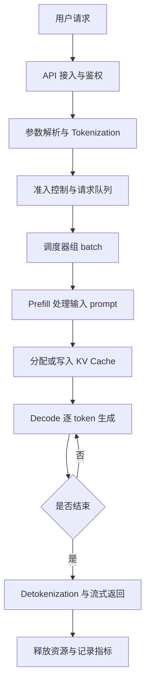

# 推理请求生命周期

推理请求不是一次简单的模型函数调用，而是一条端到端系统链路。用户看到的是“输入一句话，模型返回回答”，系统内部实际要完成接入、解析、排队、调度、计算、缓存、流式返回、清理和指标记录。

先用一个简化流程看全貌：

这张图里最重要的点是：**一次请求会在 CPU、GPU、显存、网络和队列之间来回流动**。优化推理系统时，不能只问“模型算得快不快”，还要问“请求在哪里等、显存是否够、batch 是否合理、token 是否及时返回”。

## 1. API 接入与鉴权

请求首先进入网关或推理服务 API。这里通常会做协议处理、鉴权、限流、租户识别、参数校验和 trace id 生成。

这一层主要在 CPU 和网络侧工作。它本身不做大规模矩阵计算，但会影响系统稳定性。如果没有限流和鉴权，高峰期请求可能直接冲垮后端队列；如果没有 trace id，后面就很难定位一次慢请求到底慢在哪里。

## 2. 参数解析与 Tokenization

模型不能直接读取自然语言字符串，需要先把 prompt 变成 token id。服务会解析请求里的模型名、prompt、max tokens、temperature、stop words、stream 等参数，然后调用 tokenizer。

Tokenization 通常在 CPU 上完成。它看起来不像 GPU 计算那样显眼，但在高并发、小模型、短请求场景下也可能成为瓶颈。对于多模态请求，这一步还可能包括图片、音频或视频输入的预处理。

## 3. 准入控制与请求队列

服务不能把所有请求都立刻送进 GPU。系统需要先判断当前显存、队列长度、并发数和 SLO 是否允许接收新请求。

准入控制决定“这个请求能不能进系统”，请求队列决定“它什么时候被处理”。这一步常见策略包括：

- 超过最大队列长度就拒绝或降级。
- 超过最大上下文长度就直接返回错误。
- 根据租户、优先级或付费等级决定排队顺序。
- 对超长 prompt 或超大输出上限设置更严格限制。

如果没有这一步，系统在压力过大时可能不是慢一点，而是进入显存不足、请求超时、整体雪崩。

## 4. 调度器组 batch

调度器负责把多个请求组合成适合 GPU 执行的 batch。它会决定哪些请求一起做 Prefill，哪些请求一起做 Decode，哪些请求继续等待。

这一步是推理系统和普通离线推理脚本最大的差异之一。离线脚本可以一次处理一个固定输入；在线服务面对的是不断到来的请求，而且每个请求的输入长度、输出长度、到达时间都不同。

调度器要在两个目标之间取舍：

- batch 大一些，GPU 利用率更高，总吞吐更好。
- 等待时间短一些，单个用户的延迟更低。

所以推理调度不是简单地“越快执行越好”，而是要在吞吐、延迟、显存和公平性之间做权衡。

## 5. Prefill：处理输入 prompt

Prefill 阶段会把输入 prompt 一次性送入模型，计算每个输入 token 的中间表示，并生成后续 Decode 需要的 KV Cache。

可以把 Prefill 理解成“模型先读完题目”。如果 prompt 很长，Prefill 会比较重，因为模型要处理大量输入 token。用户感受到的首 token 延迟通常和 Prefill 密切相关。

在系统层面，Prefill 的特点是：

- 输入 token 多时计算量大。
- 更容易形成大矩阵计算，GPU 算力利用率通常较高。
- 会一次性写入较多 KV Cache，占用显存。
- 长 prompt 请求可能拖慢同 batch 里的其他请求。

## 6. KV Cache：保存历史上下文

模型生成第一个 token 后，后续每生成一个 token 都需要参考前面的上下文。如果每次都重新计算全部历史 token，成本会非常高。

KV Cache 的作用是把历史 token 在 Attention 中需要复用的 key/value 保存下来。这样 Decode 阶段只需要处理新生成的 token，并读取已有 KV Cache。

KV Cache 是推理系统的核心资源之一，因为它会随着下面几个因素增长：

- batch 里同时服务的请求数量。
- 每个请求的输入长度。
- 每个请求已经生成的输出长度。
- 模型层数、hidden size、注意力头数和精度。

很多推理系统优化，本质上都是在解决 KV Cache 的分配、复用、压缩、迁移和释放问题。

## 7. Decode：逐 token 生成

Decode 阶段会不断重复同一个动作：模型根据已有上下文预测下一个 token，把这个 token 追加回上下文，再继续预测下一个 token。

这也是大语言模型推理最有代表性的地方：**输出不是一次性生成完，而是一个 token 一个 token 生成出来的。**

Decode 的系统特点是：

- 单步计算可能不大，但必须串行重复很多次。
- 每一步都要读取模型权重和 KV Cache。
- 输出越长，Decode 循环次数越多。
- 并发越高，KV Cache 显存压力越大。

因此，Prefill 和 Decode 虽然都调用同一个模型，但系统瓶颈并不完全相同。Prefill 更像“读输入”，Decode 更像“边查历史边写答案”。

## 8. Detokenization 与流式返回

模型输出的是 token id，服务需要把 token id 转回文本，这一步叫 detokenization。对于开启 streaming 的请求，服务会边生成边返回，而不是等完整回答结束后一次性返回。

流式返回的价值是降低用户感知延迟。即使总生成时间没有变，只要首 token 更早返回，用户就会感觉系统更快。

这里需要注意两点：

- streaming 不等于模型算得更快，它主要改变返回方式。
- 网络、客户端读取速度、代理缓冲策略也会影响 token 返回节奏。

## 9. 停止条件与资源释放

Decode 不会无限继续。请求会在满足某个停止条件后结束，例如：

- 生成了 EOS token。
- 达到 max tokens。
- 命中了 stop words。
- 用户取消请求。
- 请求超时。
- 服务端触发安全或策略限制。

请求结束后，系统需要释放占用的 KV Cache、更新队列状态、关闭 stream、记录日志和指标。如果资源释放不及时，显存会被“已经结束的请求”占住，后续请求就会变慢甚至失败。

## 10. 日志、指标与 Trace

一次请求结束后，推理系统应该留下可分析的数据。常见记录包括：

- input tokens、output tokens、总 token 数。
- queue time、prefill time、decode time、total latency。
- TTFT、TPOT、p50/p95/p99。
- batch size、显存占用、GPU 利用率。
- cache hit rate、错误码、取消原因、租户信息。

没有这些数据，就无法判断优化是否真的有效。比如总延迟上升，可能是排队变长，也可能是 Prefill 变慢，还可能是 Decode token 太多。只看一个总耗时，无法定位问题。

## CPU、GPU、显存和网络分别负责什么

| 环节 | 主要资源 | 常见瓶颈 |
| --- | --- | --- |
| API 接入、鉴权、参数解析 | CPU、网络 | 网关限流、连接数、协议开销 |
| Tokenization | CPU | tokenizer 吞吐、线程池、短请求高并发 |
| 排队与调度 | CPU、内存 | 队列过长、调度策略不合理、锁竞争 |
| Prefill | GPU、显存 | 长 prompt、batch 组织、Attention 计算 |
| KV Cache 管理 | 显存、内存 | 显存容量、碎片、复用率、释放不及时 |
| Decode | GPU、显存带宽 | 逐 token 串行、KV Cache 读取、低 batch 利用率 |
| Streaming 返回 | 网络、CPU | 客户端读取慢、代理缓冲、连接保持 |
| 指标与日志 | CPU、存储 | 日志过多、trace 缺失、指标粒度不够 |

## 一个最小例子

假设用户请求：“解释一下 Transformer 是什么”，并要求最多生成 200 个 token。系统大致会这样处理：

1. API 收到请求，确认用户有权限调用这个模型。
2. 服务把 prompt 转成 token id，比如得到几十个输入 token。
3. 请求进入队列，等待调度器把它和其他请求组成 batch。
4. GPU 执行 Prefill，模型读完整个 prompt，并写入 KV Cache。
5. 模型开始 Decode，先生成第一个 token。
6. 服务把第一个 token 转回文字并通过 stream 返回。
7. Decode 持续进行，每生成一个 token 都追加到上下文里。
8. 生成到 EOS、stop words 或 200 token 上限后停止。
9. 系统释放 KV Cache，记录 TTFT、TPOT、总延迟和 token 数。

从用户角度看，只是“模型回答了问题”。从系统角度看，这是一次跨 CPU、GPU、显存、网络、队列和缓存的协作。

## 常见误区

- **误区一：推理慢就是模型算得慢。**
  实际上慢可能来自排队、tokenization、KV Cache 显存不足、网络返回、日志系统或客户端读取。

- **误区二：GPU 利用率高就代表服务效率高。**
  GPU 忙不代表用户体验好。如果队列太长、首 token 太慢、尾延迟太高，服务仍然不可用。

- **误区三：streaming 能降低总计算量。**
  streaming 主要降低用户感知等待时间，不会自动减少模型需要生成的 token 数。

- **误区四：只优化 Decode 就够了。**
  长 prompt、RAG、Agent、多模态输入会让 Prefill 和输入预处理也变得很重要。

读完这一节，应该能回答三个问题：

- 一个推理请求从进入服务到结束，大致经过哪些阶段。
- 每个阶段主要消耗 CPU、GPU、显存、网络还是队列时间。
- 为什么在线推理系统优化必须看端到端链路，而不能只看模型 forward 本身。
