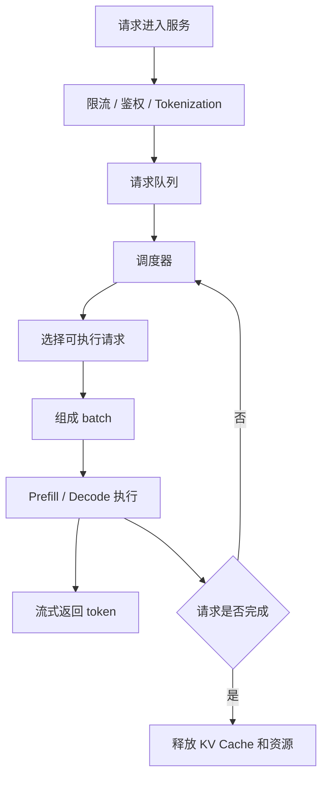

# 调度策略

推理系统里的调度策略，决定请求什么时候进入 GPU、和谁一起执行、占用多少显存、是否需要等待、是否应该被拒绝，以及是否应该从一个 worker 迁移到另一个 worker。

一句话理解：

> 调度是在有限 GPU 计算、显存和服务时间之间做分配，让系统尽量同时满足吞吐、延迟、公平性和稳定性。

如果没有调度，推理服务很容易出现几类问题：

- 短请求被长请求拖慢。
- 高优先级请求和普通请求混在一起排队。
- GPU 显存被少数长上下文请求占满。
- Prefill 请求突然增多，Decode 请求的流式输出变慢。
- 系统过载后仍然继续接请求，最后所有请求一起变慢。

所以调度不是“把请求排成队”这么简单。它是推理系统的交通控制层。

## 调度发生在哪里

一个请求进入推理服务后，通常会先经过 API 接入、鉴权、限流、tokenization，然后进入队列。调度器从队列中选择请求，组成 batch，分配 GPU 执行资源，并在每一步 Decode 后继续决定下一轮执行哪些请求。

注意这个循环：Decode 不是只调度一次。LLM 每生成一个 token，系统都可能重新考虑 batch 组成、请求优先级、显存占用和是否插入新请求。

这就是为什么现代推理系统常常使用 iteration-level scheduling 或 continuous batching。调度的粒度从“整个请求”变成了“每一轮生成步骤”。

## 调度到底在调什么

推理调度器关心的不只是计算顺序。它至少要同时管理几类资源和约束。

| 调度对象 | 需要决定什么 |
| --- | --- |
| 请求队列 | 哪些请求先等，哪些请求先执行 |
| GPU 计算 | 当前 step 执行哪些请求 |
| 显存 | 谁可以占用 KV Cache，谁需要等待 |
| batch 形态 | batch 多大，输入输出长度是否合适 |
| 优先级 | 重要请求是否插队，低优先级请求是否被延后 |
| SLO | 请求是否还能在目标延迟内完成 |
| 缓存 | 是否优先执行能命中 Prefix Cache / KV Cache 的请求 |
| 过载保护 | 系统满了以后是排队、降级还是拒绝 |

所以一个好的调度策略不是只追求 GPU utilization。GPU 很忙不等于服务体验好。如果 GPU 一直满载，但 p99 latency 很差、流式输出卡顿、请求大量超时，这不是好的调度。

## 请求级调度与 step 级调度

最容易理解的是请求级调度：一个请求来了，排队，轮到它后执行，执行完释放资源。

这种方式简单，但对 LLM 不够友好。原因是 LLM 推理有两个特点：

- 请求输入长度不同，Prefill 成本不同。
- 输出长度不可预知，Decode 会持续很多轮。

如果一个 batch 里有请求很快结束，传统 batch 可能要等其他请求继续跑，GPU 利用率会下降。现代推理系统更常见的是 step 级调度：

1. 每一轮 Decode 前，调度器选择一组活跃请求。
2. 已完成请求退出 batch。
3. 新请求可以插入 batch。
4. 每轮只生成一个或少量 token。
5. 下一轮重新调度。

这种方式能让 batch 持续保持较高利用率，也能让新请求更快进入系统。

## FCFS：先来先服务

FCFS 是最直观的策略：谁先到，谁先执行。

它的优点是简单、公平、容易解释：

- 不需要复杂优先级。
- 用户很容易理解等待顺序。
- 实现和调试都比较直接。

但 FCFS 在 LLM 推理中有明显问题：

- 长 prompt 的 Prefill 可能挡住后面的短请求。
- 长输出请求会持续占用 KV Cache。
- 高优先级请求无法自然插队。
- 过载时队列会越来越长，尾延迟快速恶化。

FCFS 可以作为基础策略，但通常不能单独支撑复杂在线服务。

## Priority Scheduling：优先级调度

优先级调度会给请求分等级，例如交互式请求优先于离线批处理请求，付费用户优先于免费用户，内部调试请求低于线上生产请求。

它解决的是“请求价值不同”的问题。

常见优先级来源包括：

- 用户套餐或租户等级。
- API 路由类型。
- 交互式任务或后台任务。
- 是否有明确 deadline。
- 是否来自系统内部关键链路。

优先级调度的问题是容易造成低优先级请求饥饿。如果高优先级请求持续很多，低优先级请求可能一直等不到执行。

所以实际系统里通常会加入保护：

- 每类优先级保留最低资源份额。
- 等待时间越久，优先级逐渐提高。
- 对高优先级流量也设置配额。
- 分租户或分队列做公平调度。

优先级不是越多越好。优先级层级太复杂，会让系统行为难以预测。

## SLO-aware Scheduling：面向目标延迟调度

SLO-aware scheduling 会把延迟目标纳入调度决策。

例如一个请求要求 2 秒内返回首 token，另一个请求是后台总结任务，可以等待 30 秒。它们不应该用完全相同的排队策略。

这种策略通常关注：

- 请求已经等待多久。
- TTFT 是否即将超标。
- 当前队列长度。
- 估计 Prefill 成本。
- 估计 Decode 输出长度。
- 当前 GPU 是否还有显存和计算余量。

SLO-aware 的核心不是“永远优先最急的请求”，而是尽量让更多请求在目标内完成。

这会带来一个重要概念：goodput。吞吐只是系统处理了多少 token，goodput 更关注“有多少请求在 SLO 内完成”。当系统过载时，盲目追求吞吐可能让所有请求都变慢；SLO-aware 调度可能会拒绝一部分请求，从而保护剩余请求的体验。

## Length-aware Scheduling：长度感知调度

LLM 请求的成本和长度强相关。输入 token 越多，Prefill 越重；输出 token 越多，Decode 占用时间和 KV Cache 越久。

长度感知调度会考虑：

- prompt token 数。
- max_tokens 设置。
- 已生成 token 数。
- 预计剩余输出长度。
- KV Cache 当前占用。

一个常见目标是避免少数长请求拖慢大量短请求。比如可以把长上下文请求放入独立队列，或限制一个 batch 里长请求的比例。

但长度感知调度也有风险：如果总是优先短请求，长请求会饥饿。所以它通常需要和公平性策略一起使用。

## Cache-aware Scheduling：缓存感知调度

Prefix Cache、PagedAttention 和 KV Cache 让推理系统的调度不再只看请求长度，还要看缓存状态。

Cache-aware scheduling 会考虑：

- 请求是否能命中 Prefix Cache。
- 命中的前缀有多长。
- 当前 worker 上是否已有可复用 KV block。
- 把请求路由到某个 worker 是否能减少重复 Prefill。
- 迁移请求是否会带来 KV Cache 复制成本。

例如两个 worker 都能处理新请求，但只有其中一个 worker 已经缓存了相同 system prompt 和工具说明。把请求调度到这个 worker，可能明显降低 TTFT。

这类策略的收益来自减少重复计算，但也有代价：

- 调度器需要知道缓存状态。
- 请求可能为了命中缓存而等待更久。
- 热门前缀可能集中到少数 worker，造成负载不均。
- 多租户隔离会限制缓存共享范围。

所以 cache-aware 不应该只追求命中率，还要同时看负载均衡和尾延迟。

## Prefill 与 Decode 的调度冲突

Prefill 和 Decode 的资源特征不同。

Prefill 通常计算密集，一次处理大量输入 token；Decode 通常每轮只生成少量 token，但需要反复读取 KV Cache，对延迟和带宽更敏感。

如果调度不当，会出现两类问题：

- 大量 Prefill 请求插入，导致正在 Decode 的流式输出变慢。
- 一直保护 Decode，请求迟迟不能 Prefill，TTFT 变差。

因此推理系统常常需要在 Prefill 和 Decode 之间做平衡。

常见做法包括：

- 限制每轮可插入的 Prefill token 数。
- 给 Decode step 保留固定时间片。
- 把 Prefill-heavy 和 Decode-heavy 请求分开调度。
- 使用 Prefill/Decode 分离部署。
- 根据 TTFT 和 TPOT 目标动态调整 Prefill 插入量。

这里的关键不是让某一类阶段永远优先，而是避免两类阶段互相挤压到不可接受。

## Admission Control：准入控制

准入控制决定一个请求能不能进入系统。

很多人会误以为请求来了就应该先进队列。但在过载时，无限制排队会让体验更差：

- 队列越来越长。
- 用户等很久后仍然超时。
- GPU 一直忙，但有效完成请求变少。
- 系统无法快速恢复。

准入控制会根据当前负载决定：

- 接受请求。
- 让请求排队。
- 返回繁忙错误。
- 降级到较小模型。
- 限制 max_tokens 或上下文长度。
- 引导客户端稍后重试。

它保护的是系统整体稳定性。一个健康的推理服务应该能在过载时清楚地拒绝部分请求，而不是让所有请求一起变慢。

## Backpressure：反压

Backpressure 是把系统压力向上游传递。

如果 GPU 队列已经很长，API 层还继续无限接请求，压力会越积越多。反压机制会告诉上游：“现在处理能力不足，请慢一点、少发一点或重试。”

常见反压方式包括：

- 返回 429 / 503。
- 在响应中携带 retry-after。
- 降低客户端并发。
- 对特定租户限速。
- 暂停低优先级任务。
- 动态调小请求的 max_tokens。

反压不是失败，而是控制系统不失控的一种手段。

## Preemption：抢占

抢占是指一个请求已经占用了资源，但系统决定暂停它，把资源让给另一个更重要或更紧急的请求。

在 LLM 推理里，抢占比普通服务更复杂，因为请求可能已经生成了一部分 token，并且占用了 KV Cache。

抢占时需要考虑：

- 被抢占请求的 KV Cache 是否保留。
- 如果释放 KV Cache，后续是否需要重算。
- 抢占是否会破坏流式输出体验。
- 哪些请求允许被抢占。
- 抢占频率是否过高。

抢占可以改善高优先级请求延迟，但也可能降低整体效率。因为被抢占请求恢复时，可能需要重新排队、重新加载上下文，甚至重新 Prefill。

所以抢占通常只用于明确需要保护的场景，例如高优先级交互请求、即将超 SLO 的请求，或资源紧急回收。

## Fairness：公平性

公平性关注不同用户、租户、业务或任务类型之间是否被合理对待。

没有公平性时，一个大客户或一个高并发任务可能占满所有 GPU，让其他请求无法服务。

常见公平性目标包括：

- 每个租户有独立配额。
- 每类任务有最低资源保障。
- 单个用户不能占满队列。
- 长请求不能永久压制短请求。
- 高优先级请求不能让低优先级请求永远饥饿。

公平性和效率经常冲突。最有效率的调度可能会把资源集中给最容易处理、最能提高吞吐的请求；但公平的系统必须保留隔离和配额。

在线服务通常宁愿牺牲一部分峰值吞吐，也要保证行为可预测。

## Routing 与 Scheduling 的区别

Routing 和 scheduling 经常一起出现，但它们不是同一件事。

- Routing 决定请求去哪个实例、哪个节点、哪个 GPU worker。
- Scheduling 决定请求在某个 worker 内什么时候执行、和哪些请求一起执行。

例如 cache-aware routing 会把请求路由到有 Prefix Cache 的 worker；worker 内部的 scheduler 再决定它何时进入 Prefill 或 Decode。

在多机推理系统中，两者会互相影响：

- 路由影响缓存命中率。
- 路由影响每台机器负载。
- 调度影响队列长度。
- 队列长度又会影响后续路由选择。

所以大型推理服务通常需要全局路由策略和本地调度策略协同工作。

## 常见优化方向

调度策略的优化，通常不是换一个算法名，而是围绕业务目标和系统瓶颈做取舍。

### 1. 限制队列长度

无限队列会隐藏过载。更好的方式是设置最大队列长度、最大等待时间和明确的拒绝策略。

当请求已经不可能在 SLO 内完成时，继续排队意义不大。及时拒绝能保护系统，也能让客户端更快重试或降级。

### 2. 控制 Prefill 插入量

Prefill 请求太多会影响 Decode 流式输出。可以限制每轮调度中 Prefill token 的总量，或给 Decode 保留执行窗口。

这类策略通常需要同时观察 TTFT 和 TPOT。如果 TTFT 很好但 TPOT 很差，说明 Decode 可能被干扰；如果 TPOT 很好但 TTFT 很差，说明 Prefill 进入太慢。

### 3. 按任务类型分队列

交互式问答、批量摘要、Agent 工具调用、长文档分析，负载形态不同。把所有请求放在一个队列里，容易互相影响。

可以按任务类型、租户、优先级或长度范围拆队列，然后给不同队列配置权重和资源份额。

### 4. 做长度与显存预测

调度器如果不知道请求大概会占多少 KV Cache，就很难做准入控制。

可以用 prompt length、max_tokens、历史输出长度分布来估算显存需求。估算不需要完美，但要能避免明显超卖。

### 5. 利用缓存信息

如果系统支持 Prefix Cache 或 KV block 复用，调度器可以优先安排高收益命中的请求，或把请求路由到更容易命中缓存的 worker。

但要避免缓存热点导致负载倾斜。缓存收益和负载均衡要一起看。

### 6. 保护低优先级请求

优先级调度需要防止低优先级请求饥饿。可以给低优先级队列保留少量资源，或让等待时间逐渐提升请求优先级。

否则系统在高峰期可能看起来高优先级体验很好，但后台任务永远无法完成。

### 7. 把调度指标暴露出来

调度问题很难只靠端到端延迟定位。需要把队列长度、等待时间、准入拒绝数、抢占次数、每类队列资源占比、Prefill/Decode token 调度量暴露出来。

没有这些指标，就很难判断问题是 GPU 算慢了、排队太久、显存不足，还是调度策略不合理。

## 该观察哪些指标

评估调度策略时，建议至少观察：

| 指标 | 说明 |
| --- | --- |
| queue length | 当前等待请求数 |
| queue wait time | 请求进入执行前等待了多久 |
| admission reject count | 准入控制拒绝了多少请求 |
| TTFT | 首 token 是否被排队和 Prefill 影响 |
| TPOT | Decode 流式输出是否平稳 |
| p95 / p99 latency | 尾延迟是否恶化 |
| GPU utilization | GPU 是否空闲或过载 |
| KV Cache usage | 显存是否被上下文占满 |
| prefill tokens per step | 每轮插入多少 Prefill 工作 |
| decode tokens per step | 每轮服务多少 Decode token |
| preemption count | 抢占是否过于频繁 |
| per-tenant throughput | 不同租户是否公平 |
| timeout count | 请求是否在队列或执行中超时 |

这些指标要按请求类型、租户、模型、输入长度和输出长度分组看。全局平均值经常会掩盖问题。

## 一个最小例子

假设一个推理服务同时接收两类请求：

- A 类：在线聊天，请求短，希望 1 秒内返回首 token。
- B 类：批量文档总结，prompt 长，可以等待 20 秒。

如果使用简单 FCFS，B 类请求一旦排在前面，就可能让 A 类请求等待很久。

更合理的策略可以是：

1. A 类和 B 类分队列。
2. A 类优先进入 Prefill。
3. B 类使用较低优先级，但保留最低资源份额。
4. 每轮限制 B 类 Prefill token 数，避免影响 A 类 Decode。
5. 当队列太长时，优先拒绝或延后 B 类请求。

这样系统不是简单地追求最大吞吐，而是让不同任务按不同目标被服务。

## 常见误区

- **误区一：GPU 利用率越高越好。**
  GPU 忙不代表用户体验好。如果排队时间和尾延迟很差，高利用率可能只是过载的表现。

- **误区二：FCFS 最公平。**
  FCFS 在到达顺序上公平，但可能让短请求、高优先级请求或即将超时的请求受到不合理影响。

- **误区三：优先级越多越精细。**
  优先级太多会让系统行为难以预测，也容易造成低优先级饥饿。

- **误区四：缓存命中率越高越好。**
  为了命中缓存而把请求集中到少数 worker，可能导致负载不均和尾延迟恶化。

- **误区五：过载时多排队就能扛住。**
  无限排队只会把失败延后。准入控制和反压是稳定系统的一部分。

读完这一节，应该能回答五个问题：

- 推理调度为什么不是简单排队。
- 请求级调度和 step 级调度有什么区别。
- FCFS、优先级、SLO-aware、length-aware、cache-aware 分别解决什么问题。
- 准入控制、反压和抢占为什么能保护系统。
- 调度策略应该用哪些指标来判断效果。
