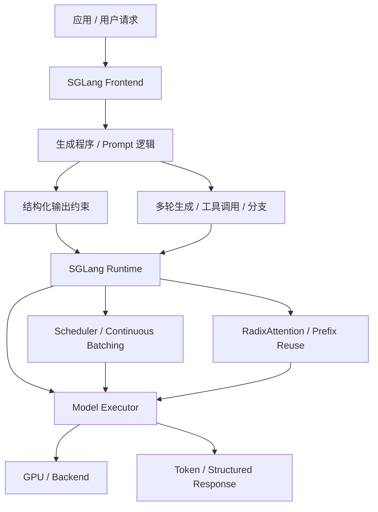
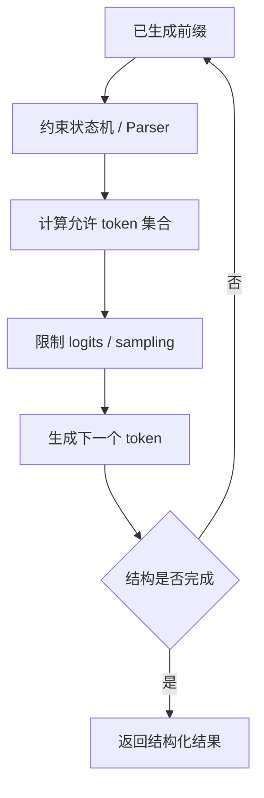
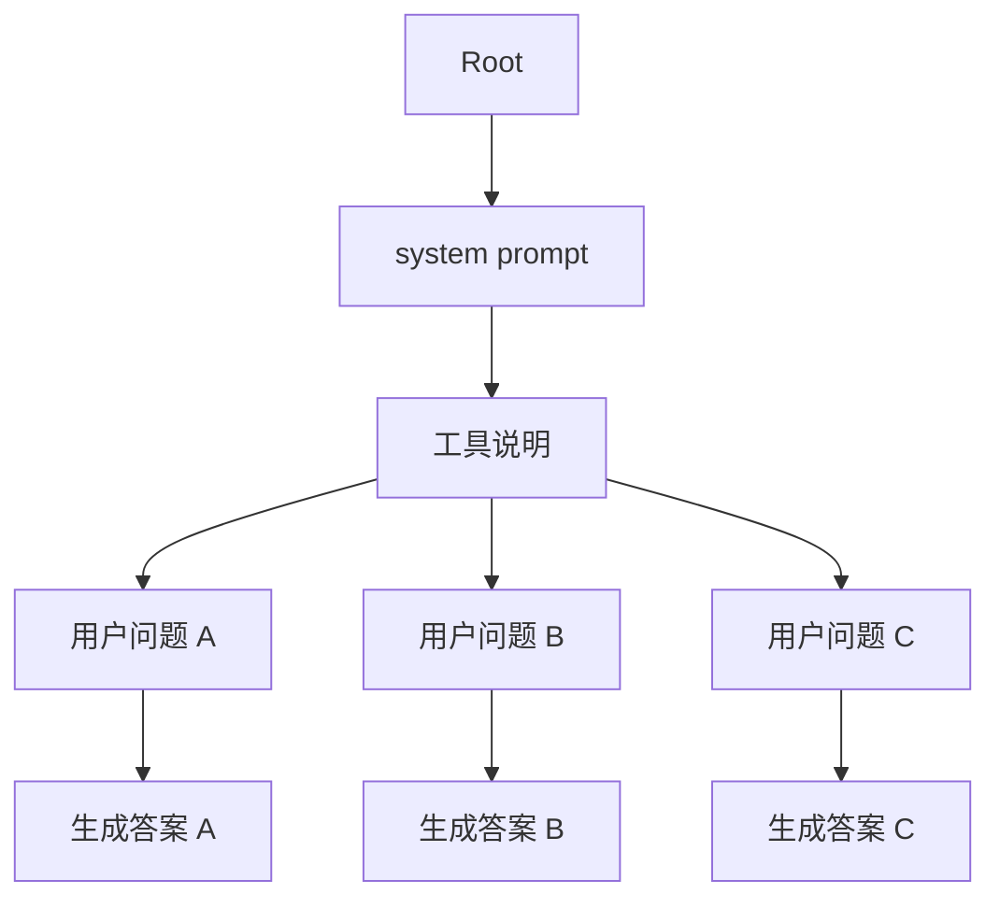

# SGLang

SGLang 是一个面向大语言模型和多模态模型的 serving framework。它同时关注两件事：一是让复杂生成任务更容易表达，二是让这些生成任务在 runtime 里更高效地执行。

一句话理解：

> SGLang 的特点是把“生成流程”和“推理系统优化”放在一起考虑：不仅要让模型生成 token，还要让多轮生成、结构化输出、共享前缀和缓存复用更容易被系统优化。

vLLM 更适合从 PagedAttention、continuous batching 和通用 LLM serving 角度学习；TensorRT-LLM 更适合从 NVIDIA GPU 高性能执行栈角度学习；SGLang 则很适合学习“复杂 LLM 应用如何变成可优化的推理 workload”。

## 它适合学习什么

SGLang 可以作为结构化生成和高性能 runtime 结合的案例。

| 相关主题 | 在 SGLang 中对应的问题 |
| --- | --- |
| 生成程序 | 如何表达多轮 prompt、分支、约束输出和工具调用 |
| Structured Outputs | 如何约束模型输出 JSON、正则、schema 或特定格式 |
| RadixAttention | 如何用 radix tree 复用共享前缀的 KV Cache |
| Prefix Reuse | 如何避免重复 Prefill 相同前缀 |
| Continuous Batching | 如何把多个活跃请求动态合批执行 |
| Prefill / Decode | 如何处理长输入和逐 token 输出的不同瓶颈 |
| RAG / Agent | 如何处理多次 LLM 调用、工具调用和多轮上下文 |
| 多模态 Serving | 如何服务文本、图像等多模态输入输出 |
| Benchmark | 如何评估结构化生成和复杂 workload 的端到端性能 |

因此，SGLang 不只是另一个模型服务框架。它的学习价值在于：它把上层生成逻辑和下层 runtime 优化连接起来。

## 为什么需要 SGLang 这类框架

很多 LLM 应用不是“一次 prompt，一次回答”。

真实应用经常包含：

- 多轮对话。
- RAG 检索后再生成。
- 先生成计划，再调用工具。
- 多个候选答案并行生成。
- 输出必须是 JSON 或特定格式。
- 同一个 system prompt 或工具说明被大量请求复用。
- 同一个上下文里有多个连续的模型调用。

如果每一步都由应用层手写，然后把每次模型调用当成独立请求发给后端，系统很容易浪费：

- 相同前缀被重复 Prefill。
- 多轮调用之间的 KV Cache 无法复用。
- 结构化输出约束在应用层反复解析和重试。
- runtime 看不到完整生成流程，难以整体调度。
- RAG / Agent 的端到端延迟被多次小调用放大。

SGLang 的核心动机之一，就是让复杂生成流程变得更可表达，也更可优化。

## 在请求链路中的位置

从系统分层看，SGLang 可以同时覆盖“生成程序表达层”和“高性能 runtime 层”。

这张图可以这样读：

1. 应用把请求交给 SGLang。
2. SGLang frontend 表达 prompt、生成步骤、约束和控制逻辑。
3. runtime 根据这些生成任务做调度、缓存复用和执行。
4. model executor 调用底层模型和 GPU backend。
5. 最终返回普通文本或结构化结果。

关键点是：runtime 不再只看到一堆孤立 prompt，而能看到更多生成结构。这为缓存复用和调度优化创造了空间。

## 生成程序：把复杂生成流程显式表达出来

普通推理接口通常是这样的：给模型一个 prompt，模型返回文本。

但复杂任务可能是这样的：

1. 先让模型理解用户问题。
2. 再生成检索关键词。
3. 调用检索工具。
4. 把检索结果拼进上下文。
5. 让模型生成答案。
6. 要求答案必须符合 JSON schema。
7. 如果格式不合法，还要修正或重试。

如果这些逻辑完全散落在应用代码里，推理系统只能看到很多零散调用。SGLang 的生成程序思想，是把这些步骤以更明确的方式组织起来，让系统有机会识别：

- 哪些 prompt 前缀相同。
- 哪些生成步骤可以共享上下文。
- 哪些输出必须满足约束。
- 哪些分支可以并行。
- 哪些中间结果会被后续步骤使用。

这对系统优化很重要。因为 LLM serving 的性能瓶颈不只在模型 forward，也在“生成流程怎么组织”。

## Structured Outputs：为什么结构化输出影响推理系统

很多应用不希望模型随便生成自然语言，而是希望它输出可被程序解析的结构。

常见约束包括：

- JSON。
- JSON schema。
- 正则表达式。
- 固定选项。
- 函数调用参数。
- 特定语法或 DSL。

结构化输出看起来像应用层问题，但它会影响推理系统。

原因是：模型每一步生成 token 时，候选 token 空间可能需要被约束。系统需要根据当前已经生成的内容，判断哪些 token 仍然合法，哪些 token 必须被屏蔽。

简化流程如下：

这带来几个系统问题：

- 约束检查会增加每步生成开销。
- 不同请求的约束不同，会影响 batching。
- JSON/schema 越复杂，状态管理越复杂。
- 结构化输出减少重试，但可能降低单步生成自由度。

SGLang 的价值在于把结构化输出作为 runtime 需要理解的工作负载，而不是完全丢给应用层事后修正。

## RadixAttention：面向前缀复用的缓存机制

SGLang 的代表性设计之一是 RadixAttention。

它的核心思想是：许多请求或生成分支会共享相同前缀，系统可以用 radix tree 记录这些前缀，并复用对应的 KV Cache。

普通 Prefix Cache 也能复用相同前缀，但 RadixAttention 更强调把多个 prompt / 生成路径的共享前缀组织成树状结构。

可以用下面的简化图理解：

在这棵树里，`system prompt` 和 `工具说明` 是共享前缀。如果每个请求都重新 Prefill 这部分，就会重复计算。RadixAttention 可以让这些共享前缀对应的 KV Cache 被复用。

这种机制特别适合：

- 多个请求共享同一 system prompt。
- Agent 工具说明很长且重复。
- Few-shot 示例固定。
- 同一上下文下做多个分支生成。
- Tree-of-thought、beam search、parallel sampling 等分叉生成。
- RAG 模板固定，只是检索内容或用户问题变化。

它解决的是一个很现实的问题：LLM 应用越复杂，共享前缀和分支生成越常见；如果 runtime 不理解这些结构，就会浪费大量 Prefill 计算。

## RadixAttention 与 Prefix Cache 的关系

可以把 Prefix Cache 理解为“发现请求前缀相同，就复用缓存”。

RadixAttention 则更像“把大量共享前缀组织成可查询、可复用、可回收的数据结构”。

两者关系可以这样看：

| 维度 | Prefix Cache | RadixAttention |
| --- | --- | --- |
| 基本目标 | 复用相同 prompt 前缀 | 系统化管理共享前缀树 |
| 适合场景 | 固定 system prompt、RAG 模板 | 多分支、多轮、多请求共享前缀 |
| 核心结构 | cache key / block reuse | radix tree + KV Cache reuse |
| 系统意义 | 减少重复 Prefill | 让复杂生成流程可被 runtime 优化 |

简单场景下，二者看起来很接近。复杂场景下，RadixAttention 更强调结构化地管理前缀共享关系。

## Continuous Batching 与调度

SGLang runtime 也需要处理在线 serving 的基本问题：请求持续到达，输出长度不确定，Decode 逐 token 进行，KV Cache 会持续占用显存。

因此它需要类似 continuous batching 的能力：每个执行 iteration 都可以动态调整活跃请求集合，而不是等一个固定 batch 全部结束。

调度器需要同时考虑：

- 新请求的 Prefill。
- 老请求的 Decode。
- 结构化输出的约束开销。
- Prefix/Radix cache 的命中情况。
- KV Cache 显存占用。
- 多轮生成和分支生成的依赖关系。
- 不同请求的延迟目标。

这和普通 serving 的区别在于：SGLang 的请求可能不是一个单独 prompt，而是一段生成程序。调度器要面对的不只是“请求队列”，还有“生成步骤之间的依赖”。

## Prefill / Decode 分离和复杂生成流程

复杂生成程序会放大 Prefill 和 Decode 的差异。

例如，一个 Agent 请求可能包含很长工具说明和历史对话。这部分主要影响 Prefill。随后模型可能多次生成短输出，用来选择工具、生成参数、总结结果。这些步骤又会反复进入 Decode。

如果 runtime 能复用前缀 KV Cache，就可以减少重复 Prefill。如果 runtime 能把多个短 Decode 步骤合批，就可以提高 GPU 利用率。

SGLang 的意义在于：它让这些生成步骤更容易被 runtime 看到和优化，而不是每一步都变成彼此无关的 HTTP 请求。

## 多模态 Serving

SGLang 也关注多模态模型 serving。多模态请求通常比纯文本请求更复杂，因为它可能包含：

- 文本 token。
- 图像 patch 或视觉 token。
- 视频帧。
- 音频特征。
- 多模态 encoder 输出。
- 文本 decoder 生成。

多模态 serving 的系统问题包括：

- 图像或视频预处理会增加 CPU/GPU 前处理成本。
- 视觉 token 会拉长上下文，增加 Prefill 成本。
- 多模态 encoder 和语言 decoder 可能瓶颈不同。
- batch 内不同模态输入形状差异较大。
- 缓存复用比纯文本更复杂。

因此，多模态 serving 不能只套用纯文本 LLM 的经验。需要分别观察预处理、Prefill、Decode、显存和端到端延迟。

## RAG / Agent 场景中的价值

RAG 和 Agent 是 SGLang 很值得关注的场景。

RAG 负载通常包含：

- 用户问题理解。
- query rewrite。
- embedding。
- retrieval。
- rerank。
- 上下文拼接。
- 最终生成。

Agent 负载还会包含：

- 计划生成。
- 工具选择。
- 工具参数生成。
- 工具执行。
- 结果总结。
- 多轮循环。

这些 workload 的特点是：单个用户请求会拆成多次模型调用、检索调用和工具调用。端到端延迟不是一次 Decode 决定的，而是多个阶段串起来的结果。

SGLang 的生成程序和 runtime 优化可以帮助系统更清楚地组织这些阶段，尤其是：

- 复用固定 system prompt 和工具说明。
- 管理多轮上下文。
- 减少结构化输出重试。
- 对多个短生成步骤做更好的调度。
- 在分支生成中复用共享前缀。

## 和 vLLM、TensorRT-LLM 的关系

SGLang、vLLM、TensorRT-LLM 都和 LLM 推理相关，但侧重点不同。

| 维度 | vLLM | TensorRT-LLM | SGLang |
| --- | --- | --- | --- |
| 核心定位 | 通用高性能 LLM serving engine | NVIDIA GPU 高性能推理优化栈 | 结构化生成 + 高性能 runtime |
| 代表能力 | PagedAttention、continuous batching | engine/runtime、量化、kernel、多 GPU | RadixAttention、structured outputs、生成程序 |
| 学习重点 | 请求调度和 KV Cache 管理 | 硬件优化和执行计划 | 复杂生成流程如何被优化 |
| 典型场景 | 通用开源模型服务 | NVIDIA 平台高性能部署 | RAG、Agent、结构化输出、多分支生成 |
| 主要问题 | 如何高效服务大量请求 | 如何榨干硬件执行性能 | 如何让复杂生成 workload 更可控 |

这三者不是简单替代关系。严肃选型时，应在自己的模型、硬件、输入输出长度、结构化输出比例、RAG/Agent 调用模式下做 benchmark。

## 适合哪些场景

SGLang 适合这些场景：

- 应用包含复杂 prompt 流程。
- 需要 JSON、schema、正则等结构化输出。
- 多个请求共享大量 prompt 前缀。
- 存在多轮生成、分支生成或 parallel sampling。
- RAG / Agent 请求占比较高。
- 需要同时关注 serving 性能和应用生成逻辑。
- 希望减少重复 Prefill 和结构化输出重试。
- 希望研究 RadixAttention 这类前缀复用机制。

特别是当“生成流程复杂度”已经成为性能和可靠性问题时，SGLang 比单纯 API wrapper 更有学习价值。

## 不适合哪些误用

也要避免几个误解。

第一，SGLang 不是让模型能力变强的训练方法。它主要优化生成流程表达和推理执行。

第二，结构化输出不是免费能力。约束解码会影响 sampling、batching 和每步 token 选择开销。

第三，RadixAttention 的收益依赖共享前缀。如果请求之间几乎没有相同前缀，收益就会有限。

第四，复杂生成程序不能替代系统观测。RAG / Agent 的瓶颈可能在检索、工具、网络、数据库或外部 API，而不一定在 LLM runtime。

## 常见优化方向

围绕 SGLang 做优化，可以按下面几个方向排查。

### 1. 前缀复用

先看请求之间是否存在共享前缀：

- system prompt 是否固定。
- 工具说明是否重复。
- few-shot 示例是否重复。
- RAG 模板是否固定。
- 多分支生成是否共享上游上下文。

如果共享前缀多，应重点观察 RadixAttention / prefix reuse 的命中率和 TTFT 改善。

### 2. 结构化输出

结构化输出要看约束复杂度：

- JSON schema 是否过深。
- 正则是否复杂。
- 输出字段是否可以简化。
- 是否有大量格式失败重试。
- 约束解码是否影响 TPOT。

有时一个更简单、更稳定的输出 schema，比复杂 schema 更利于性能和可靠性。

### 3. 生成程序拆分

复杂 Agent 流程要看是否拆得太碎：

- 是否每一步都调用一次 LLM。
- 是否可以合并相邻生成步骤。
- 是否有不必要的中间自然语言输出。
- 是否可以缓存工具说明和固定上下文。
- 是否可以并行化无依赖分支。

推理优化不只在 runtime，也在生成流程设计。

### 4. KV Cache 和显存

高并发下仍然要关注 KV Cache：

- 长上下文是否挤占显存。
- 多分支生成是否复制太多 KV。
- 前缀复用是否降低了显存和 Prefill。
- 请求结束后缓存是否及时回收。
- 是否需要限制最大上下文或最大输出。

### 5. Benchmark Workload

SGLang 的 benchmark 不能只测普通单轮问答。应该覆盖真实生成流程：

- 结构化输出比例。
- RAG / Agent 调用链长度。
- 共享前缀命中率。
- 分支生成数量。
- input/output length 分布。
- streaming 是否开启。
- 工具调用延迟是否计入端到端指标。

否则 benchmark 会低估复杂 workload 的系统成本。

## 应该观察哪些指标

使用 SGLang 做服务或实验时，建议至少观察：

| 指标 | 说明 |
| --- | --- |
| TTFT | Prefill、排队、前缀复用对首 token 的影响 |
| TPOT | Decode 和约束解码的稳定性 |
| end-to-end latency | 生成程序完整耗时 |
| output tokens/s | 输出吞吐 |
| prefix cache hit rate | 前缀复用是否有效 |
| structured output success rate | 结构化输出一次成功率 |
| retry count | 格式失败、工具失败或解析失败后的重试次数 |
| KV Cache usage | 高并发和多分支下的显存压力 |
| GPU utilization | runtime 是否让 GPU 持续有活干 |
| tool / retrieval latency | RAG / Agent 外部阶段耗时 |
| p95/p99 latency | 复杂流程的长尾体验 |
| goodput | 满足 SLO 且输出合法的有效吞吐 |

对 SGLang 来说，`structured output success rate` 和 `prefix cache hit rate` 很关键。因为它的很多收益来自减少重试和复用前缀。

## 一个最小理解例子

假设有一个 Agent 服务，所有请求都共享一段很长的 system prompt 和工具说明。每个用户请求都要：

1. 判断是否需要工具。
2. 以 JSON 形式生成工具参数。
3. 调用工具。
4. 根据工具结果生成最终回答。

普通做法可能会把这拆成多次互相独立的 LLM 调用。这样每次都可能重复 Prefill system prompt 和工具说明，还要在应用层检查 JSON 格式，失败后重试。

SGLang 的思路是：

1. 用生成程序表达这条流程。
2. 用结构化输出约束工具参数格式。
3. 用 RadixAttention 复用 system prompt 和工具说明的 KV Cache。
4. 用 runtime 调度多个用户请求和多个生成步骤。
5. 用指标观察端到端延迟、前缀命中率和结构化输出成功率。

这个例子体现了 SGLang 的核心：它不是只优化一次模型 forward，而是优化一整段生成流程。

## 学习路径建议

如果刚开始学习 SGLang，可以按这个顺序：

1. 先理解 Prefill、Decode、KV Cache 和 Prefix Cache。
2. 再理解 RAG / Agent 为什么会产生多次 LLM 调用。
3. 学习结构化输出为什么会影响 decoding。
4. 学习 RadixAttention 如何用 radix tree 复用前缀。
5. 学习 continuous batching 如何服务持续到达的请求。
6. 最后用真实 RAG / Agent workload 做 benchmark。

这样能避免只把 SGLang 看成一个 API 工具，而能看到它背后的系统设计。

## 小结

SGLang 是结构化生成和高性能 runtime 结合的代表性系统。它最值得学习的地方是：如何把复杂 LLM 应用中的生成流程，变成 runtime 可以理解和优化的 workload。

它的关键思想包括：

- 用生成程序表达多轮、分支、工具调用和约束输出。
- 用 structured outputs 降低格式错误和应用层重试。
- 用 RadixAttention 复用共享前缀的 KV Cache。
- 用 continuous batching 提高在线 serving 吞吐。
- 用 runtime 调度复杂生成步骤，而不只是孤立 prompt。
- 在 RAG / Agent 和多模态场景中观察端到端性能。

对关注高效计算的人来说，SGLang 的启发是：推理优化不只发生在 kernel、batch 和显存里，也发生在“我们如何表达和组织生成任务”这件事上。

## 参考资料

- [SGLang Documentation](https://docs.sglang.ai/)
- [SGLang GitHub Repository](https://github.com/sgl-project/sglang)
- [SGLang: Efficient Execution of Structured Language Model Programs](https://arxiv.org/abs/2312.07104)
