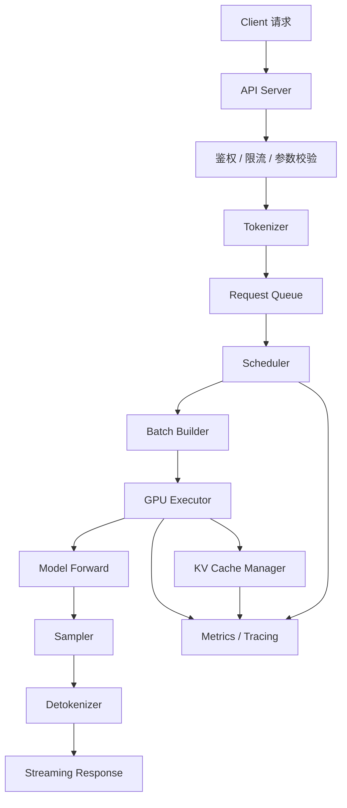

# 单机推理服务架构

单机推理服务架构，关注一台服务器内部如何把 LLM 模型变成可在线访问的服务。它不是只把模型加载到 GPU 上，还要处理 API 接入、参数校验、tokenization、排队、调度、Batching、KV Cache、GPU 执行、流式返回、取消请求、指标和健康检查。

一句话理解：

> 单机推理服务是把“模型前向计算”包进一个能稳定处理并发请求的系统。

很多推理优化最终都会落到单机服务内部。即使后面扩展到多机，多机系统里的每个 worker 也仍然需要一个清晰的单机架构。

## 为什么先理解单机

单机是推理系统的最小完整单元。

如果不理解一台机器内发生了什么，就很难理解多机分布式推理、Prefill/Decode 分离部署、缓存路由和容量规划。

单机服务至少要回答这些问题：

- 请求从 API 进入后放在哪里。
- tokenizer 在 CPU 还是单独进程里执行。
- scheduler 如何决定哪些请求进入 GPU。
- GPU executor 如何执行 Prefill 和 Decode。
- KV Cache 如何分配和释放。
- 流式 token 如何返回给客户端。
- 用户取消请求后如何释放资源。
- 显存不足时如何保护服务。
- 监控指标从哪里采集。

这些问题处理不好，模型再快也很难成为稳定服务。

## 总体数据流

一个典型单机 LLM serving 进程可以抽象成下面的数据流：

这个图里，真正跑模型的是 GPU executor，但它不是系统的全部。在线服务的稳定性，往往取决于 GPU 之外的队列、调度、缓存和返回链路。

## 主要模块

可以把单机推理服务拆成几个模块：

| 模块 | 主要职责 |
| --- | --- |
| API Server | 接收 HTTP/gRPC/OpenAI-compatible 请求 |
| 参数校验 | 检查模型、prompt、max_tokens、temperature、stop 等参数 |
| Tokenizer | 把文本转成 token id，把输出 token 转回文本 |
| Request Queue | 保存等待执行的请求 |
| Scheduler | 决定哪些请求进入 Prefill 或 Decode |
| Batch Builder | 把多个请求组织成可执行 batch |
| GPU Executor | 调用模型 forward、attention、sampling 等 GPU 计算 |
| KV Cache Manager | 分配、复用、释放 KV Cache |
| Sampler | 根据 logits 选择下一个 token |
| Streamer | 把生成 token 按流式协议返回 |
| Metrics / Tracing | 记录延迟、吞吐、显存、队列和错误 |
| Health Check | 判断服务是否可接流量 |

这些模块不一定都是独立进程。有些系统在一个进程内用线程、协程或事件循环组织；有些系统会把 tokenizer、engine、API server 拆开。但逻辑职责大体相同。

## API Server

API Server 是请求入口。它负责接收客户端请求，并把请求转换成内部格式。

常见工作包括：

- 解析请求体。
- 校验 model name。
- 处理鉴权和租户信息。
- 执行 rate limit。
- 校验 generation parameters。
- 建立 streaming response。
- 处理客户端断开连接。
- 返回错误码和错误信息。

API Server 不应该无限接收请求。如果后端队列已经满，它应该配合准入控制返回繁忙错误，而不是把请求堆到内存里。

## 参数校验

生成参数会直接影响性能和资源使用。

常见参数包括：

- `max_tokens`：最多生成多少 token。
- `temperature`：采样随机性。
- `top_p` / `top_k`：采样截断策略。
- `stop`：停止序列。
- `stream`：是否流式返回。
- `logprobs`：是否返回 token 概率。
- `seed`：是否需要可复现采样。

系统要限制参数范围。例如 `max_tokens` 太大，会占用更久 Decode 时间和更多 KV Cache；prompt 太长，会增加 Prefill 开销；大量 stop sequence 会增加后处理复杂度。

参数校验不是纯业务逻辑，它也是资源保护的一部分。

## Tokenizer 和 Detokenizer

Tokenizer 把文本 prompt 转成 token id。Detokenizer 把输出 token id 转回文本。

它们通常在 CPU 上执行，但会影响整体延迟：

- prompt 很长时，tokenization 可能变成 TTFT 的一部分。
- 高并发时，CPU tokenizer 可能成为瓶颈。
- 流式输出时，detokenizer 要处理不完整字符和子词边界。
- 多模型服务时，不同模型可能使用不同 tokenizer。

Tokenizer 输出的 token 数还会影响调度决策。Scheduler 需要知道 input length，才能估算 Prefill 成本和 KV Cache 占用。

## Request Queue

Request Queue 保存已经通过校验、等待执行的请求。

队列不是一个简单列表。它通常需要记录：

- 请求到达时间。
- 优先级。
- prompt token 数。
- max output tokens。
- 当前状态。
- 已生成 token 数。
- tenant 或用户信息。
- deadline 或 timeout。
- 是否已取消。

队列策略会影响 TTFT、尾延迟和公平性。如果队列无限增长，系统过载时会把所有请求拖慢。

所以队列通常需要：

- 最大长度。
- 最大等待时间。
- 超时清理。
- 按优先级或租户分队列。
- 和 admission control 联动。

## Scheduler

Scheduler 是单机推理服务的核心控制模块。它决定每一轮 GPU 执行哪些请求。

它通常要同时考虑：

- 哪些请求需要 Prefill。
- 哪些请求正在 Decode。
- 当前 GPU 还能容纳多少 KV Cache。
- batch 大小是否合适。
- 是否有高优先级请求。
- 是否有请求即将超时。
- 是否要插入新的 Prefill。
- 是否要保护已有 Decode 的 TPOT。

现代推理服务通常使用 continuous batching 或 iteration-level scheduling。也就是说，每一轮 Decode 后，调度器都会重新组织活跃请求，而不是等整个 batch 全部完成。

Scheduler 的好坏，直接决定 GPU 是否高效、TTFT 是否可控、TPOT 是否稳定。

## Batch Builder

Batch Builder 把 scheduler 选出的请求组织成 GPU 可以执行的 batch。

它需要处理：

- Prefill batch。
- Decode batch。
- 混合 Prefill/Decode 的 batch。
- 不同请求的 sequence length。
- attention mask 或 position 信息。
- KV Cache block 映射。
- padding 和对齐。

Batch Builder 的目标是让 GPU 执行尽量规整，同时减少无效计算和内存搬运。

如果 batch 组织不好，可能出现 GPU 利用率低、padding 浪费大、KV Cache 访问不连续等问题。

## GPU Executor

GPU Executor 负责真正执行模型计算。

它通常包含：

- 模型 forward。
- attention kernel。
- MLP / MoE kernel。
- sampling kernel。
- CUDA Graph 或类似执行优化。
- tensor parallel 通信。
- kernel launch 管理。

对单机服务来说，GPU Executor 不只是调用一次模型。它要在每轮调度中反复执行，并和 KV Cache Manager、Scheduler、Sampler 协作。

常见目标包括：

- 减少 kernel launch 开销。
- 使用高效 attention kernel。
- 让 batch shape 更稳定。
- 避免频繁 CPU/GPU 同步。
- 减少不必要的数据拷贝。

## KV Cache Manager

KV Cache Manager 管理 Decode 阶段需要的历史 key/value。

它负责：

- 为新请求分配 KV Cache。
- 为每个 token 追加 KV。
- 在请求完成或取消时释放 KV。
- 处理长上下文的显存占用。
- 支持 PagedAttention 或 block 管理。
- 支持 Prefix Cache 时复用前缀 KV。
- 监控显存使用和碎片。

KV Cache 往往是推理服务显存压力的主要来源。模型权重加载后，剩余显存能支持多少并发，很大程度取决于 KV Cache 管理。

如果 KV Cache 分配失败，系统应该拒绝或延后请求，而不是让进程崩溃。

## Sampler

Sampler 根据模型输出 logits 选择下一个 token。

常见采样策略包括：

- greedy decoding。
- temperature sampling。
- top-p。
- top-k。
- repetition penalty。
- min/max tokens 约束。
- stop token 或 stop sequence。

Sampler 也会影响性能。返回 logprobs、做复杂约束解码、处理大量 stop sequence，都会增加每步 Decode 的开销。

在高性能服务里，部分 sampling 可以放到 GPU 上执行，减少 CPU/GPU 数据往返。

## Streaming Response

LLM 服务通常需要流式返回。用户希望模型一边生成，一边看到输出。

Streaming 模块要处理：

- token 到文本的增量 detokenize。
- SSE、WebSocket 或 gRPC streaming。
- 客户端断开连接。
- backpressure。
- stop sequence 截断。
- 最终 usage 统计。

流式返回看起来是 API 问题，但会影响资源释放。如果客户端断开连接，服务要尽快取消请求并释放 KV Cache。

否则已经没人接收输出的请求仍然占用 GPU，会浪费资源。

## 取消、超时和失败处理

在线服务必须处理请求生命周期异常。

常见情况包括：

- 客户端主动取消。
- 网络断开。
- 请求超过最大执行时间。
- 请求在队列里等待太久。
- 显存不足。
- tokenizer 失败。
- GPU executor 报错。
- worker 进入不健康状态。

系统需要清楚地区分：

- 请求级失败：只影响某个请求。
- worker 级失败：需要从负载均衡中摘除。
- 进程级失败：需要重启。

取消请求时，最重要的是释放资源：队列项、streaming handle、KV Cache、临时 buffer 和相关指标状态。

## 健康检查

Health Check 用来告诉上游负载均衡器：这个 worker 是否还能接流量。

常见检查包括：

- 进程是否存活。
- 模型是否加载完成。
- GPU 是否可用。
- 显存是否还有余量。
- 队列是否过长。
- 最近是否出现连续执行错误。
- tokenizer 是否正常。
- event loop 或调度线程是否卡住。

可以区分两种状态：

- liveness：进程是否应该被重启。
- readiness：进程是否应该接新请求。

一个 worker 可能还活着，但队列很满或显存很紧，这时应该暂时不接新请求。

## Metrics、Logging 和 Tracing

没有指标，就无法优化推理服务。

单机服务至少要记录：

- 请求数。
- token 数。
- TTFT。
- TPOT。
- end-to-end latency。
- queue wait time。
- prefill time。
- decode time。
- tokens/s。
- requests/s。
- GPU memory。
- KV Cache usage。
- batch size。
- error count。
- timeout count。
- cancellation count。

Logging 用来解释单个请求发生了什么。Tracing 用来把请求从 API、queue、scheduler、GPU executor 到 streaming 的路径串起来。

指标负责发现问题，日志和 trace 负责解释问题。

## 并发模型

单机推理服务通常同时有 CPU 并发和 GPU 并发。

CPU 侧负责：

- API 请求处理。
- tokenization。
- queue 管理。
- scheduling。
- detokenization。
- streaming。
- metrics。

GPU 侧负责：

- model forward。
- attention。
- sampling。
- KV Cache 写入。

常见架构是 CPU 侧使用异步事件循环或线程池，GPU 侧由一个 engine loop 统一调度。这样可以避免多个请求同时直接抢 GPU，导致执行形态混乱。

一个实用原则是：请求可以并发进入系统，但 GPU 执行应该由统一调度器控制。

## 显存保护

显存是单机推理服务最重要的资源之一。

显存主要被几类东西占用：

- 模型权重。
- KV Cache。
- 临时 activation。
- CUDA workspace。
- 通信 buffer。
- 量化 metadata。

显存保护要做几件事：

- 启动时预估模型权重和可用 KV Cache 容量。
- 请求进入前估算最大 KV 需求。
- 队列中避免超卖显存。
- 请求完成或取消后及时释放 KV。
- 显存不足时拒绝请求，而不是 OOM 崩溃。
- 监控碎片和 peak memory。

很多线上事故不是模型算错，而是显存保护不足导致 worker OOM。

## 多 GPU 单机

一台服务器可能有多张 GPU。单机服务可以有几种部署方式：

- 每张 GPU 启动一个独立 worker。
- 一个模型 replica 使用多张 GPU 做 tensor parallel。
- 多个 replica 分布在多张 GPU 上。
- Attention、MoE 或 pipeline 使用不同并行策略。

选择取决于模型大小和流量目标。

如果模型单卡放得下，多 replica 可以提高请求吞吐和隔离能力。如果模型单卡放不下，需要 tensor parallel 或其他模型并行。

多 GPU 单机要额外关注：

- GPU 间通信。
- NCCL 初始化和错误处理。
- 每张 GPU 的显存余量。
- 请求路由到哪个 replica。
- 单个 rank 失败后的恢复。

## 常见优化方向

单机推理服务优化，通常不是只改一个 kernel，而是从请求链路上逐段定位。

### 1. 拆分 TTFT

把 TTFT 拆成 API 排队、tokenization、queue wait、Prefill、首 token sampling 和 streaming flush。

只有知道 TTFT 慢在哪里，才知道该优化 tokenizer、scheduler、Prefill kernel 还是队列。

### 2. 拆分 TPOT

TPOT 慢可能来自 Decode kernel、KV Cache 访问、batch 形态、sampling、CPU/GPU 同步或 streaming backpressure。

不要只看平均 TPOT，要看 p95/p99 和不同请求长度下的 TPOT。

### 3. 优化 Scheduler

Scheduler 要在新请求 TTFT 和已有请求 TPOT 之间取舍。

常见策略包括 dynamic batching、continuous batching、限制 Prefill 插入量、优先级队列、SLO-aware 调度和显存感知准入。

### 4. 优化 KV Cache

KV Cache 优化包括 PagedAttention、Prefix Cache、KV Cache 量化、及时释放取消请求、减少碎片和显存预留。

KV Cache 管得好，单机并发能力会明显提高。

### 5. 减少 CPU 瓶颈

Tokenizer、detokenizer、JSON 序列化、日志和 metrics 都可能成为 CPU 瓶颈。

高并发下要关注 CPU utilization、event loop lag、线程池排队和锁竞争。

### 6. 控制返回链路

Streaming 太频繁会增加网络和序列化开销；flush 太慢又会影响用户感知延迟。

可以按 token、时间窗口或客户端状态控制 flush 策略。

### 7. 做灰度和回退

单机服务通常会承载真实线上流量。优化 scheduler、KV Cache 或 kernel 时，要有灰度、指标对比和回退机制。

## 该观察哪些指标

评估单机推理服务时，建议观察：

| 指标 | 说明 |
| --- | --- |
| request rate | 每秒请求数 |
| input tokens/s | 输入 token 吞吐 |
| output tokens/s | 输出 token 吞吐 |
| TTFT | 首 token 延迟 |
| TPOT | 每 token 输出间隔 |
| queue wait time | 请求排队等待时间 |
| prefill time | Prefill 执行时间 |
| decode step time | Decode 单步耗时 |
| active requests | 当前活跃请求数 |
| batch size | 每轮执行 batch 大小 |
| KV Cache usage | KV Cache 显存占用 |
| GPU memory usage | GPU 总显存占用 |
| GPU utilization | GPU 利用率 |
| tokenizer latency | tokenizer 耗时 |
| streaming latency | token 到客户端的返回耗时 |
| cancellation count | 取消请求数量 |
| timeout count | 超时请求数量 |
| error count | 错误数量 |

这些指标要按模型、请求类型、输入长度、输出长度和是否流式返回分组看。

## 一个最小例子

假设一台 8 卡服务器部署一个 LLM 服务。模型单卡放不下，所以使用 4 张 GPU 做一个 tensor parallel replica，一台机器上放 2 个 replica。

一个请求进入服务后：

1. API Server 接收请求并校验参数。
2. Tokenizer 把 prompt 转成 token ids。
3. 请求进入队列。
4. Scheduler 根据队列、显存和优先级选择请求。
5. Batch Builder 组织 Prefill batch。
6. GPU Executor 在 4 张 GPU 上执行模型 forward。
7. KV Cache Manager 为请求分配并记录 KV block。
8. Decode 阶段每轮生成 token。
9. Sampler 选择输出 token。
10. Detokenizer 转成文本。
11. Streaming 模块返回给客户端。
12. 请求结束后释放 KV Cache 并记录 metrics。

如果用户中途断开，系统应该取消请求，停止后续 Decode，并释放 KV Cache。否则这个请求会继续占用显存和 GPU。

## 常见误区

- **误区一：单机服务就是模型 forward。**
  在线服务还包括 API、队列、调度、KV Cache、streaming、取消、指标和健康检查。

- **误区二：GPU 利用率高就代表服务健康。**
  队列过长、TTFT 很差、用户大量超时，也可能让 GPU 看起来很忙。

- **误区三：请求来了都先进队列。**
  队列无限增长会让过载更严重。准入控制和拒绝策略是服务稳定性的一部分。

- **误区四：取消请求只是停止返回。**
  取消请求还必须释放 KV Cache 和调度状态，否则会浪费 GPU 资源。

- **误区五：单机架构不重要，多机才复杂。**
  多机系统由很多单机 worker 组成。单机内部不清楚，多机只会放大问题。

读完这一节，应该能回答五个问题：

- 一个单机 LLM 推理服务通常由哪些模块组成。
- CPU scheduler 和 GPU executor 如何协作。
- KV Cache Manager 在单机服务中为什么关键。
- 取消、超时、健康检查和显存保护为什么影响稳定性。
- 应该用哪些指标定位单机推理服务瓶颈。
