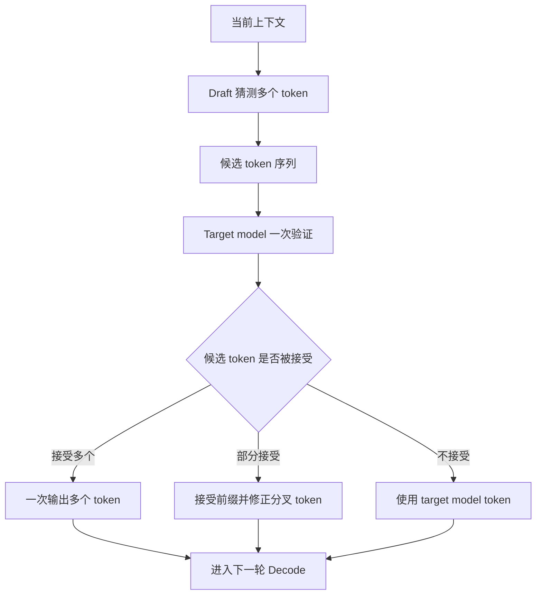

# Speculative Decoding

Speculative Decoding 是一种降低 LLM Decode 串行等待的推理优化。它的核心思想是：先用一个更快的方式“猜”出后面几个 token，再让目标模型一次性验证这些 token，能接受多少就一次输出多少。

一句话理解：

> Speculative Decoding 用便宜的预测换取更少的目标模型 Decode 步数，从而提高生成速度。

它要解决的问题不是 Prefill 慢，而是 Decode 慢。Decode 阶段通常必须一个 token 一个 token 生成：第 10 个 token 生成后，才能知道第 11 个 token 的输入是什么。这种严格串行结构会限制吞吐和单请求生成速度。

Speculative Decoding 的目标就是把“每次只走一步”尽量变成“猜几步、验证后多走几步”。

## 为什么 Decode 难以并行

LLM 生成回答时，每个新 token 都依赖前面所有 token。

例如模型要生成：

```text
AI 推理系统 需要 优化 延迟
```

它通常要按顺序做：

1. 根据 prompt 预测 `AI`。
2. 根据 prompt + `AI` 预测 `推理`。
3. 根据 prompt + `AI 推理` 预测 `系统`。
4. 继续预测下一个 token。

这个过程天然串行。即使 GPU 很强，也不能在不知道第一个 token 的情况下直接计算第十个 token。

这就是 Decode 的核心瓶颈：每一步计算可能不大，但步骤很多，而且步骤之间存在依赖。

## Speculative Decoding 的基本思路

Speculative Decoding 引入两个角色：

- Draft：负责快速猜测接下来几个 token。
- Verify：由目标模型检查这些 token 是否可以接受。

Draft 可以是一个小模型、一个额外预测头、一个 n-gram 规则，或者目标模型内部的某种快速近似。Verify 通常是原本真正要部署的目标模型。

基本流程是：

1. 当前上下文已经生成到某个位置。
2. draft 先猜出后面 k 个 token。
3. target model 一次性计算这些候选 token 的概率。
4. 系统按规则接受其中一段前缀。
5. 被接受的 token 一次性加入输出。
6. 如果某个 token 不被接受，就回退到目标模型给出的 token。
7. 继续下一轮。



如果 draft 猜得准，target model 一次验证就能推进多个 token。这样目标模型调用次数减少，Decode 速度就可能提高。

## 为什么目标模型能一次验证多个 token

这里容易产生一个疑问：既然 Decode 是串行的，为什么目标模型能一次验证多个候选 token？

关键在于“生成”和“验证”不同。

生成下一个 token 时，模型不知道后面的 token 是什么，所以只能一步一步来。但验证候选序列时，候选 token 已经给出来了，目标模型可以像训练时 teacher forcing 一样，一次性计算多个位置的 logits。

例如 draft 猜了：

```text
需要 优化 延迟
```

target model 可以一次性看这三个候选位置，并分别判断：

- 在当前上下文后，`需要` 是否合理。
- 在当前上下文 + `需要` 后，`优化` 是否合理。
- 在当前上下文 + `需要 优化` 后，`延迟` 是否合理。

这仍然遵守因果注意力。第 3 个位置只看前面上下文和前两个候选 token，不偷看未来。

所以 Speculative Decoding 并不是打破自回归因果关系，而是利用“候选已经给出”来并行验证。

## Draft、Verify、Accept

理解 Speculative Decoding，要先理解三个关键词。

### Draft

Draft 是候选 token 的来源。它要足够快，否则猜测本身会成为新的瓶颈。

常见 draft 来源包括：

- 一个更小的 draft model。
- 目标模型的轻量预测头。
- 目标模型中间层的提前预测。
- n-gram 或 prompt 中已有文本匹配。
- 针对代码、模板或重复文本的启发式预测。

Draft 不需要完全正确，但要经常猜中。猜得太差，验证时大部分 token 都被拒绝，收益会消失。

### Verify

Verify 是目标模型对候选 token 的检查。最终输出必须由目标模型认可。

在严格的 speculative sampling 中，接受/拒绝规则会保证输出分布和目标模型一致。工程系统中也可能使用更近似的变体，但原则上都要控制质量偏差。

Verify 的成本通常比 draft 高得多，所以优化目标是：尽量让一次 verify 接受更多 token。

### Accept

Accept 表示候选 token 被接受。

如果 draft 猜了 4 个 token，target model 接受了前 3 个，那么这一轮就相当于目标模型前进了 3 个 token。如果只接受 0 个或 1 个，收益就很有限。

acceptance rate 是评估 Speculative Decoding 的核心指标。

## Acceptance Rate 为什么关键

Acceptance rate 表示 draft 猜出的 token 有多少被 target model 接受。

它影响收益的方式很直接：

- 接受率高：一次 target verify 可以推进多个 token。
- 接受率低：draft 计算和验证开销大多浪费。
- 接受长度稳定：调度和延迟更容易预测。
- 接受长度波动大：batch 和流式输出会更复杂。

但只看接受率还不够。还要看 draft 的成本。

一个 draft model 如果非常准，但和 target model 一样慢，就没有意义。一个 draft model 如果非常快但几乎猜不中，也没有意义。

真正有用的是：

```text
draft 足够快 + acceptance rate 足够高 + verify 能高效并行
```

三者缺一项，收益都会下降。

## Speculation Length：一次猜几个 token

Speculation length 是 draft 每轮猜测的 token 数，常用 k 表示。

k 太小，单轮最多只能接受很少 token，潜在加速有限。

k 太大，可能出现几个问题：

- draft 计算变多。
- target verify 的一次输入变长。
- 后面 token 越难猜，接受率下降。
- 被拒绝的候选越多，浪费越多。
- batch 内不同请求的候选长度差异更难调度。

所以 k 不是越大越好。系统通常会根据接受率、请求类型、输出阶段和当前负载动态调整。

例如模型刚开始回答时不确定性较高，可以猜短一点；进入模板化、列表化或代码重复片段后，可以猜长一点。

## 一个最小例子

假设 target model 原本要逐 token 生成：

```text
推理 系统 的 瓶颈
```

普通 Decode 需要 4 次 target model step：

1. 生成 `推理`。
2. 生成 `系统`。
3. 生成 `的`。
4. 生成 `瓶颈`。

Speculative Decoding 中，draft 先猜：

```text
推理 系统 的 优化
```

target model 一次验证后发现：

- `推理` 接受。
- `系统` 接受。
- `的` 接受。
- `优化` 不接受，target 更倾向 `瓶颈`。

那么这一轮可以输出：

```text
推理 系统 的 瓶颈
```

这一轮 target model 通过一次 verify 推进了多个位置，而不是一步一步调用四次。

这是加速的来源。

## 它和 Batching 的关系

Batching 是把多个请求合在一起执行。Speculative Decoding 是让单个请求每轮尽量前进多个 token。

两者可以结合，但会带来调度复杂度。

例如一个 batch 里有 16 个请求，每个请求 draft 的候选长度不同，接受长度也不同。下一轮时，有的请求已经前进 4 个 token，有的只前进 1 个 token。调度器需要重新组织 batch，避免 GPU 空转或 padding 浪费。

Speculative Decoding 可能提升单请求生成速度，但如果实现不好，也可能破坏 continuous batching 的稳定形态。

所以在线推理系统里要同时观察：

- 单请求 TPOT 是否下降。
- 整体 tokens/s 是否上升。
- batch 形态是否更碎。
- p95 / p99 latency 是否改善。
- 调度器是否出现额外开销。

## 它和 KV Cache 的关系

Speculative Decoding 会改变 KV Cache 的使用方式。

Draft 生成候选 token 时可能需要自己的 KV Cache。Target verify 时也会为候选位置计算 KV。被接受的 token 可以保留下来，被拒绝的候选通常需要丢弃或回滚。

这带来几个工程问题：

- draft model 的 KV Cache 是否单独管理。
- target verify 中未接受 token 的 KV 是否要释放。
- 回滚和释放是否会造成显存碎片。
- PagedAttention block table 是否支持高效追加和撤销。
- 多请求并发时，候选 token 的临时 KV 是否会挤压显存。

如果 KV Cache 管理成本过高，Speculative Decoding 的收益会被抵消一部分。

## 它和量化的关系

Draft model 通常可以比 target model 更小、更快，也可以使用更激进的量化。

这很自然：draft 只是提候选，最终仍由 target model 验证。只要 draft 的候选足够常被接受，它不必和 target model 一样强。

但量化 draft 也有风险：

- draft 质量下降会降低 acceptance rate。
- draft 太弱会产生大量无效候选。
- 如果 draft 输出分布偏差太大，verify 浪费会增加。

所以 draft 的量化不能只看 draft 自己的速度，还要看它对整体 acceptance rate 和 end-to-end latency 的影响。

## 常见变体

Speculative Decoding 有很多实现方式。这里先按直觉分类。

### 小模型 Draft

最经典的方式是用一个小模型作为 draft model，用大模型作为 target model。

优点是概念清楚，draft 可以很快。缺点是需要额外加载一个模型，增加显存、调度和部署复杂度。

如果小模型和大模型分布差异太大，接受率会下降。

### Medusa 类方法

Medusa 类方法给目标模型增加多个预测头，让模型在一次前向中预测后续多个 token 的候选。

直观上，它不是再部署一个完整小模型，而是在目标模型上加“多步预测头”。

优点是可以减少独立 draft model 的部署复杂度。缺点是通常需要额外训练这些 heads，并且要看推理引擎是否支持。

### EAGLE 类方法

EAGLE 类方法利用模型中间特征来预测后续 token，目标是让 draft 更接近 target model 的内部状态，从而提高接受率。

可以粗略理解为：不是只用一个外部小模型瞎猜，而是借助目标模型特征做更高质量的猜测。

这类方法通常更复杂，对实现和模型适配要求更高。

### N-gram Speculation

N-gram speculation 不一定需要神经网络 draft。它可以从 prompt、已生成文本或历史片段中寻找重复模式，猜测接下来可能出现的 token。

它在代码、模板、日志、表格、重复文本中可能有效。

优点是便宜、简单；缺点是适用场景有限，遇到开放式生成时接受率可能不高。

## 哪些场景更适合

Speculative Decoding 更适合以下场景：

- 输出较长。
- Decode 是主要瓶颈。
- 目标模型较大，单步 Decode 成本高。
- draft 明显更快。
- 文本模式较稳定，接受率高。
- 代码、结构化文本、模板化回答或重复文本较多。
- 在线服务希望降低 TPOT，提高流式输出速度。

不太适合的场景包括：

- 输出很短。
- 主要瓶颈在 Prefill、排队、网络或 tokenizer。
- draft 和 target 差距太大。
- 生成高度开放，候选难以命中。
- 系统 batch 已经很高效，speculation 破坏调度形态。
- 显存很紧，无法容纳 draft model 或临时 KV。

## 对 TTFT 和 TPOT 的影响

Speculative Decoding 通常更直接影响 TPOT，也就是生成过程中每个 token 的平均等待时间。

它对 TTFT 的影响不一定明显，因为首 token 前仍然需要 Prefill，并且 draft/verify 机制通常在 Decode 开始后发挥作用。

可能的影响是：

- 输出较长时，整体生成时间下降。
- 流式返回后续 token 更快。
- TPOT 改善明显。
- TTFT 可能变化不大，甚至因为额外初始化略有增加。

因此评估时不能只看首 token。对于 Speculative Decoding，更重要的是后续 token 的生成速度和 end-to-end latency。

## 对输出质量的影响

严格实现的 speculative sampling 可以保持 target model 的输出分布。也就是说，draft 只是加速候选提出，最终输出仍由 target model 的概率规则决定。

但实际工程中仍然要评估质量，因为可能存在：

- 实现使用近似接受规则。
- draft 或 target 的采样参数处理不一致。
- top-k、top-p、temperature 等策略集成不正确。
- 量化、并行和 kernel 差异带来数值偏差。
- 结构化输出或工具调用边界更敏感。

所以即使理论上可以无损，也不能跳过回归测试。

## 在线系统中的调度问题

Speculative Decoding 会让请求每轮前进的 token 数变得不固定。

这对调度器有影响：

- 每个请求下一轮所需计算量不同。
- draft 和 verify 可能需要不同资源。
- 接受长度不同，请求完成时间更难预测。
- 候选 token 的临时 KV 需要额外显存。
- batch 内请求不再整齐同步。

如果系统已经使用 continuous batching，还需要设计 spec decode 和 iteration-level scheduling 的协同方式。

常见策略包括：

- 限制每轮最大 speculation length。
- 对不同请求动态调整 k。
- 按接受率选择是否启用 speculation。
- 为 draft 和 target 分别设定资源池。
- 在过载时关闭 speculation，回退普通 Decode。

## 常见优化方向

Speculative Decoding 的优化，核心是让 draft 成本低、接受率高、verify 高效、调度稳定。

### 1. 选择合适的 draft

Draft 不是越强越好，也不是越小越好。

太强可能太慢，抵消收益；太弱可能接受率低，浪费 verify。合适的 draft 应该在速度和接受率之间取得平衡。

### 2. 动态调整 speculation length

固定 k 不一定适合所有请求。系统可以根据历史接受率、当前生成阶段、请求类型和系统负载动态调整。

接受率高时增加 k，接受率低时减小 k，甚至关闭 speculation。

### 3. 按流量类型选择性启用

代码补全、模板化文本、长回答可能收益高；短问答或开放式创作可能收益低。

可以按 route、模型、任务类型、输出长度预估来决定是否启用。

### 4. 控制临时 KV 开销

候选 token 可能产生临时 KV。系统要能快速保留被接受部分、释放被拒绝部分。

如果释放和回滚成本高，显存管理会变成瓶颈。

### 5. 保持采样参数一致

Speculative Decoding 要和 temperature、top-p、top-k、repetition penalty、stop sequence 等生成参数正确配合。

参数处理不一致，可能导致质量偏差或输出分布变化。

### 6. 和 batching 一起评估

单请求加速不代表服务整体变快。要在真实并发下评估，观察 batch 形态、GPU utilization、tokens/s、p95/p99 latency 和 goodput。

### 7. 保留回退路径

当接受率低、系统过载、显存紧张或 draft 异常时，系统应该能回退到普通 Decode。

Speculative Decoding 应该是可控优化，而不是不可关闭的复杂路径。

## 该观察哪些指标

评估 Speculative Decoding 时，建议观察：

| 指标 | 说明 |
| --- | --- |
| acceptance rate | draft token 被接受的比例 |
| accepted tokens per verify | 每次 target verify 平均推进几个 token |
| draft latency | draft 生成候选的耗时 |
| verify latency | target model 验证候选的耗时 |
| TPOT | 后续 token 生成是否更快 |
| end-to-end latency | 完整回答耗时是否下降 |
| tokens/s | 总 token 吞吐是否提高 |
| requests/s | 请求吞吐是否提高 |
| p95 / p99 latency | 尾延迟是否改善 |
| GPU utilization | draft 和 target 是否有效利用 GPU |
| temporary KV usage | 候选 token 临时 KV 占用 |
| rollback count | 候选被拒绝和回滚的次数 |
| quality score | 输出质量是否保持 |
| format error rate | 结构化输出或工具调用是否受影响 |

这些指标要按任务类型、输出长度、采样参数、batch size 和模型组合分开看。

## 一个简单判断框架

可以用四个问题判断是否值得尝试 Speculative Decoding：

1. 当前瓶颈是不是 Decode，而不是 Prefill 或排队？
2. 是否有足够快、接受率足够高的 draft？
3. 推理引擎是否能高效 verify 多个候选 token？
4. 在线调度和 KV Cache 管理是否能承受额外复杂度？

如果四个问题大多回答“是”，Speculative Decoding 值得做 benchmark。

如果瓶颈不在 Decode，或者 draft 接受率很低，优先做 batching、KV Cache、调度或量化可能更有效。

## 常见误区

- **误区一：Speculative Decoding 是让小模型代替大模型。**
  不是。draft 只是提出候选，最终仍然要由 target model 验证。

- **误区二：一次猜越多越快。**
  k 太大可能降低接受率，增加无效计算和临时 KV 开销。

- **误区三：只要单请求变快，服务整体就一定变快。**
  在线服务还受 batching、调度、显存和尾延迟影响。

- **误区四：接受率高就一定收益高。**
  还要看 draft 成本、verify 成本和实现开销。

- **误区五：理论无损就不用测质量。**
  工程实现可能引入采样参数、量化、kernel 或并行差异，仍然需要回归测试。

读完这一节，应该能回答五个问题：

- Speculative Decoding 为什么能缓解 Decode 串行等待。
- draft、verify、acceptance rate 分别是什么。
- target model 为什么能一次验证多个候选 token。
- acceptance rate、draft 成本和 speculation length 如何共同决定收益。
- 它和 batching、KV Cache、量化、在线调度有什么关系。
