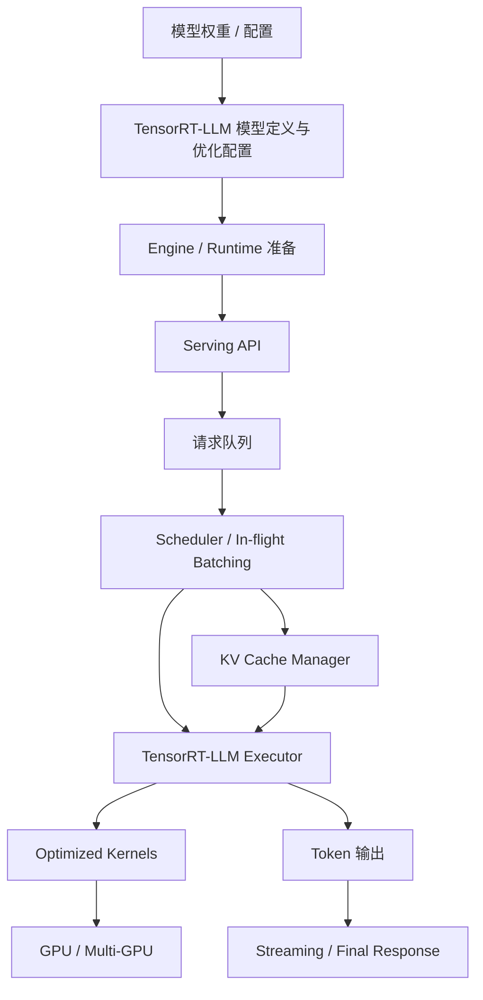
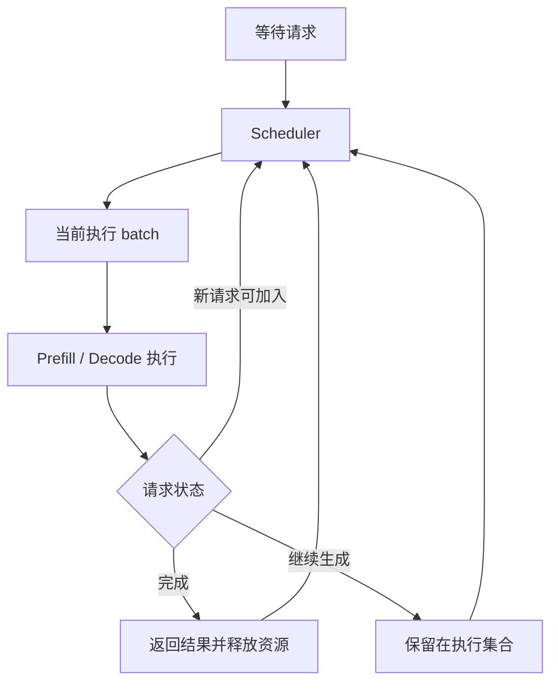
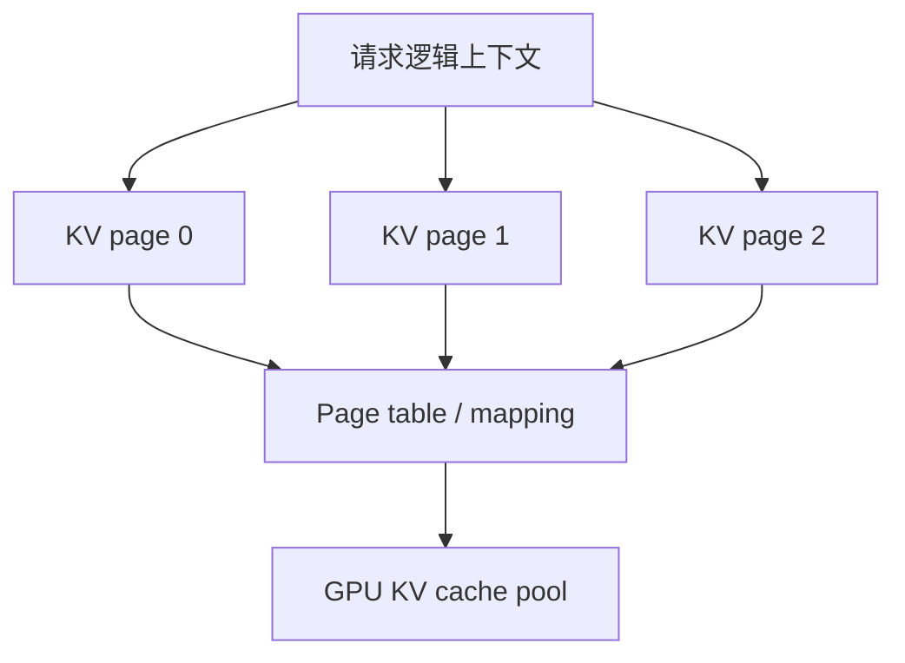

# TensorRT-LLM

TensorRT-LLM 是 NVIDIA 面向大语言模型推理的高性能优化栈。它的目标不是训练模型，也不是让模型变“更聪明”，而是在 NVIDIA GPU 上把 LLM 推理跑得更快、更省显存、更稳定。

一句话理解：

> TensorRT-LLM 把 LLM 推理看成一个系统优化问题：模型结构、精度、kernel、KV Cache、batching、并行通信和 serving runtime 都要一起优化。

如果说 vLLM 很适合学习现代开源 serving engine 如何管理请求和 KV Cache，那么 TensorRT-LLM 更适合学习“在特定硬件平台上，如何把模型执行本身压榨到更高性能”。

## 它适合学习什么

TensorRT-LLM 可以作为 NVIDIA GPU 高性能推理栈的主线案例。

| 相关主题 | 在 TensorRT-LLM 中对应的问题 |
| --- | --- |
| Engine / Runtime | 如何把模型转换成更适合 GPU 执行的形态 |
| Kernel 优化 | 如何用 fused kernel、attention kernel、GEMM 和通信 kernel 降低开销 |
| 量化推理 | 如何用 FP8、INT8、INT4 等格式降低显存和带宽压力 |
| KV Cache | 如何管理长上下文和高并发下的缓存显存 |
| Paged KV Cache | 如何用分页式管理减少 KV Cache 浪费 |
| In-flight Batching | 如何让新请求和老请求在生成过程中动态混合执行 |
| Chunked Prefill | 如何把长 prompt 的 Prefill 拆开，减少对 Decode 的干扰 |
| Speculative Decoding | 如何减少逐 token Decode 的等待 |
| 多 GPU 并行 | 如何用 tensor parallel、pipeline parallel、expert parallel 扩展大模型推理 |
| Benchmark | 如何用 `trtllm-bench` 等工具评估吞吐、延迟和容量 |

学习 TensorRT-LLM 时，重点不是背命令，而是理解它为什么能快：它把模型部署、kernel、显存、调度和硬件特性绑定得更紧。

## 和通用 PyTorch Runtime 的差异

最简单的模型推理方式，是直接用 PyTorch 加载模型，然后调用 forward 生成 token。这种方式灵活，适合研究和调试，但在线 serving 时会遇到很多性能问题：

- Python 调度开销较高。
- 通用算子不一定最适合 LLM 推理。
- kernel fusion 不充分。
- 量化、KV Cache、并行通信和 batching 需要额外系统支持。
- 高并发时很难靠简单脚本稳定管理请求。

TensorRT-LLM 的思路是把这些问题前移到优化栈里处理：

- 用更适合推理的模型表示和执行计划。
- 使用面向 NVIDIA GPU 的高性能 kernel。
- 在 runtime 中支持 KV Cache、batching、调度和并行。
- 通过量化降低显存和访存压力。
- 用 benchmark 和 serving 工具连接实际部署。

所以它和“直接 PyTorch 推理”的关系，不是功能多一点，而是系统目标不同：PyTorch 优先灵活性，TensorRT-LLM 优先推理性能和部署效率。

## 在请求链路中的位置

TensorRT-LLM 通常会出现在两个阶段：部署准备阶段和在线执行阶段。

部署准备阶段关注模型如何被优化成适合执行的形式；在线执行阶段关注请求如何被服务、调度和返回。

这条链路说明：TensorRT-LLM 不只是一个 API server，也不只是一个 kernel 库。它覆盖从模型优化到 runtime 执行的一段完整路径。

不同版本和部署方式的具体命令会变化，但系统问题基本不变：

- 模型如何准备。
- 精度和量化如何选择。
- KV Cache 如何管理。
- 请求如何合批和调度。
- 多 GPU 如何并行。
- 服务指标如何测量。

## 核心思想：把推理变成可优化的执行计划

LLM 推理表面上是“输入 prompt，输出 token”。但从系统角度看，它包含很多重复结构：

- Attention。
- MLP。
- LayerNorm / RMSNorm。
- RoPE。
- GEMM。
- AllReduce / AllGather。
- Sampling。
- KV Cache 读写。

通用框架会把这些操作按模型图执行。TensorRT-LLM 更进一步：它会尽量把这些操作映射成适合 NVIDIA GPU 的高效执行路径。

这类优化包括：

- 使用 fused kernel，减少 kernel launch 和中间读写。
- 使用优化 attention kernel，降低 attention 计算和 KV 读取成本。
- 使用更低精度格式，降低显存占用和内存带宽。
- 使用 CUDA Graph 等技术减少重复调度开销。
- 使用多 GPU 并行，把大模型拆到多张卡上。
- 使用 runtime 调度策略提高在线服务吞吐。

因此，TensorRT-LLM 的“快”通常来自多层叠加，而不是某一个单独技巧。

## Engine / Runtime：为什么需要准备阶段

很多 TensorRT-LLM 部署会涉及模型准备、构建或运行时优化配置。这个过程可以粗略理解为：把原始模型权重和结构，转换成更适合推理执行的形式。

这一步可能涉及：

- 模型结构适配。
- 权重格式转换。
- 精度选择。
- 量化配置。
- 并行策略配置。
- 最大 batch、最大 sequence length 等容量参数。
- attention、GEMM、通信等 kernel 选择。

准备阶段的意义在于：很多性能决策不能等请求来了再临时决定。比如权重用 FP16、FP8 还是 INT4，多 GPU 怎么切分，最大上下文长度是多少，这些都会影响显存布局和执行计划。

代价是灵活性下降。相比直接 PyTorch 加载模型，TensorRT-LLM 往往需要更多前置配置，也更依赖硬件、驱动、CUDA、TensorRT-LLM 版本和模型支持情况。

## In-flight Batching：生成过程中的动态合批

LLM 在线推理的一个难点是：请求不会整齐地一起开始、一起结束。

如果使用传统 static batching，一个 batch 中短请求结束后，GPU 可能还要陪着长请求继续跑；新请求也可能要等当前 batch 结束才能加入。这会降低吞吐，也会增加排队时间。

TensorRT-LLM 支持 in-flight batching。它的核心思想和 continuous batching 接近：在生成过程中动态调整 batch，让完成的请求退出，让新请求进入。

简化流程如下：

In-flight batching 的收益是：

- 提高 GPU 利用率。
- 减少 batch 内请求长短不齐带来的浪费。
- 让在线流量更自然地进入执行集合。
- 在吞吐和延迟之间提供更多调度空间。

但它也要求 runtime 更复杂。系统必须同时管理请求状态、KV Cache、token budget、显存容量和不同请求的输出进度。

## Paged KV Cache：让长上下文更可控

TensorRT-LLM 也支持分页式 KV Cache 管理。它和前面讲过的 PagedAttention 思想相似：不要把每个请求的 KV Cache 都当成一段必须连续的大显存，而是按 block/page 管理。

这样做的原因很直接：

- 每个请求输入长度不同。
- 输出长度无法提前准确知道。
- 高并发下 KV Cache 显存可能超过权重显存。
- 长上下文请求会占用大量缓存。
- 请求完成后需要快速回收缓存空间。

分页式 KV Cache 的作用是减少预留浪费和碎片，提高并发容量。

在 TensorRT-LLM 里，Paged KV Cache 与 in-flight batching、长上下文、chunked prefill 和多 GPU 并行共同影响性能。只看模型权重显存是不够的，必须把 KV Cache 当成在线 serving 的核心资源。

## Chunked Prefill：减少长输入对 Decode 的干扰

Prefill 负责读取 prompt。长 prompt 的 Prefill 计算量很大，容易占用 GPU 很长时间。

在线服务里，如果一个超长 prompt 一次性占用执行资源，正在 Decode 的请求可能被拖慢，用户看到的流式输出就会变卡。Chunked Prefill 的思想是把长 Prefill 拆成多个较小块，让系统有机会在块之间穿插 Decode 或其他请求。

它的价值是：

- 避免长 prompt 独占 GPU。
- 改善 Decode 请求的 TPOT 稳定性。
- 让调度器更容易平衡新请求和老请求。
- 在长上下文场景中减少尾延迟风险。

代价是调度更复杂，某些场景下也可能带来额外开销。因此是否启用、如何配置，需要结合 workload 做 benchmark。

## 量化：TensorRT-LLM 的重要能力

TensorRT-LLM 非常重视量化，因为 NVIDIA GPU 上的推理性能常常受到显存容量、内存带宽和矩阵计算吞吐限制。

常见量化方向包括：

- FP8。
- INT8。
- INT4。
- weight-only quantization。
- AWQ / GPTQ 等权重量化路径。
- KV Cache 量化。

不同量化方式解决的问题不同：

| 量化方式 | 主要目标 | 需要注意 |
| --- | --- | --- |
| FP8 | 在新一代 GPU 上提高吞吐并降低显存 | 依赖硬件和 kernel 支持 |
| INT8 | 降低权重或激活成本 | 需要校准或模型适配 |
| INT4 | 大幅降低权重显存 | 更容易影响质量或受 kernel 限制 |
| Weight-only | 主要减少权重占用和访存 | 对 Decode 访存瓶颈有帮助 |
| KV Cache 量化 | 降低长上下文和高并发显存 | 可能影响长上下文质量 |

量化不能只看“模型能不能跑”。真正要看：

- 输出质量是否可接受。
- TTFT 是否改善。
- TPOT 是否改善。
- tokens/s 是否提升。
- 显存是否明显下降。
- p95/p99 是否稳定。
- 是否出现不支持的模型结构或 kernel fallback。

在 TensorRT-LLM 中，量化经常和 engine/runtime 配置绑定，因此要把量化当作部署决策，而不是一个临时开关。

## Kernel 优化：为什么它依赖硬件

TensorRT-LLM 的性能优势很大一部分来自面向 NVIDIA GPU 的 kernel 优化。

LLM 推理里常见瓶颈包括：

- 大矩阵乘。
- Attention 计算。
- KV Cache 读写。
- 多 GPU 通信。
- Sampling 和 logits 处理。
- 小算子频繁 launch。

针对这些问题，优化栈会尽量使用更高效的 kernel 或 fused kernel。例如把多个小操作合并，减少中间结果写回；使用更适合当前 GPU 架构的 GEMM；在 tensor parallel 中优化通信；在 attention 中减少对全量上下文的重复读取。

这也解释了为什么 TensorRT-LLM 很依赖硬件环境。同一个模型，在不同 GPU 架构、不同 CUDA/TensorRT-LLM 版本、不同精度格式下，性能可能差异很大。

因此写 benchmark 报告时必须记录：

- GPU 型号。
- GPU 数量。
- CUDA / driver / TensorRT-LLM 版本。
- 精度和量化格式。
- 并行配置。
- 是否使用特定优化 kernel。
- input/output length 和并发模式。

没有这些条件，性能数字很难比较。

## 多 GPU 与分布式推理

大模型常常无法放进单张 GPU，或者单卡吞吐不够。TensorRT-LLM 支持多 GPU 推理，常见方式包括 tensor parallel、pipeline parallel、expert parallel 等。

### Tensor Parallel

Tensor parallel 把模型中的大矩阵切到多张 GPU 上计算。它的优势是可以服务更大的模型，并提升部分计算吞吐。

代价是每层之间需要通信，例如 AllReduce。通信如果太慢，就会抵消多卡带来的收益。

### Pipeline Parallel

Pipeline parallel 把不同层放到不同 GPU 上。它可以降低单卡权重压力，但会引入流水线气泡和跨阶段传输。

对于 batch 较小或请求不稳定的在线推理，pipeline 是否合适要具体测。

### Expert Parallel

MoE 模型里，不同专家可以放在不同 GPU 上。Expert parallel 的难点是路由后的 token 分布可能不均匀，某些专家过载会导致整体等待。

MoE 推理里，通信、专家放置、负载均衡和 batch 形态常常比单纯算力更重要。

## Speculative Decoding 与 Guided Decoding

TensorRT-LLM 也支持面向生成过程的优化能力，例如 speculative decoding 和 guided decoding。

Speculative Decoding 的目标是减少逐 token Decode 的串行等待。它通常用较快的 draft 机制先预测多个 token，再由目标模型验证。收益取决于 draft 命中率、额外显存、验证开销和 workload。

Guided decoding 更关注输出约束，例如 JSON schema、特定格式、受限词表或结构化输出。它的价值在于提高输出可控性，但也会影响 sampling、logits 处理和生成路径。

在高性能 serving 中，这些能力都不只是算法选项，还会影响 runtime：

- 每步生成多少 token。
- batch 形态如何变化。
- logits 处理是否变重。
- KV Cache 如何写入和回退。
- latency 指标如何解释。

因此启用这些能力后，应重新做 benchmark，而不是沿用原来的容量结论。

## Serving 与 Benchmark 工具

TensorRT-LLM 提供了面向服务和压测的工具链，例如用于服务部署的 `trtllm-serve` 和用于性能测试的 `trtllm-bench`。具体命令和参数会随版本变化，但它们代表了两个重要角色。

`trtllm-serve` 关注如何把模型作为服务暴露出来，常见需求包括：

- OpenAI-compatible API。
- streaming 输出。
- 多模型或多 worker 部署。
- 请求参数解析。
- 服务进程管理。

`trtllm-bench` 关注如何评估性能，常见实验包括：

- 固定并发下的 TTFT、TPOT 和吞吐。
- 固定 request rate 下的 SLO 达成率。
- 不同 input/output length 的性能曲线。
- 不同 batch、精度、并行配置的对比。
- 多 GPU 扩展效率。

学习这些工具时，要避免只看单个 tokens/s。更有价值的是建立可复现实验：同一个模型、硬件、精度、workload 和版本下，比较不同配置的延迟、吞吐、显存和错误率。

## 和 vLLM 的关系

vLLM 和 TensorRT-LLM 都是重要的 LLM serving 技术，但侧重点不同。

| 维度 | vLLM | TensorRT-LLM |
| --- | --- | --- |
| 核心定位 | 通用开源 LLM serving engine | NVIDIA GPU 高性能推理优化栈 |
| 代表设计 | PagedAttention、continuous batching | TensorRT engine/runtime、优化 kernel、量化、并行 |
| 灵活性 | 通常更容易快速接入多种模型 | 更依赖支持矩阵和构建/配置 |
| 性能取向 | 高效 serving 和易用性平衡 | 更强调 NVIDIA 平台极致性能 |
| 部署复杂度 | 相对较低 | 通常更高 |
| 适合学习 | 请求调度、KV Cache、在线 serving | 硬件优化、kernel、量化、多 GPU 执行 |

这不是简单的谁替代谁。更合理的理解是：

- 如果要快速搭一个通用开源模型服务，vLLM 往往更容易上手。
- 如果要在 NVIDIA GPU 上追求更高吞吐、更低延迟或更强量化/并行优化，TensorRT-LLM 值得深入。
- 如果要做严肃选型，应在自己的模型、硬件和 workload 上 benchmark，而不是根据宣传数字判断。

## 适合哪些场景

TensorRT-LLM 适合这些场景：

- NVIDIA GPU 是主要部署平台。
- 对吞吐、延迟和 GPU 成本很敏感。
- 模型规模较大，需要多 GPU 推理。
- 需要 FP8、INT8、INT4 等量化优化。
- 长上下文或高并发下需要精细 KV Cache 管理。
- 希望把模型执行性能推到接近硬件上限。
- 有能力维护 CUDA、驱动、TensorRT-LLM、模型和 benchmark 版本矩阵。

它尤其适合系统工程团队做性能攻关，而不是只做一次简单 demo。

## 不适合哪些误用

也要避免几个误解。

第一，TensorRT-LLM 不是通用训练框架。它关注推理，不负责训练模型参数。

第二，它不一定是所有模型、所有场景的最快方案。模型结构、硬件架构、精度、batch、上下文长度和部署方式都会改变结论。

第三，它不适合没有 benchmark 的“盲目上生产”。如果没有固定 workload 和指标，很难知道配置是否真的带来收益。

第四，它的复杂度比简单 runtime 更高。版本兼容、构建配置、模型支持和硬件依赖都需要工程投入。

## 常见优化方向

围绕 TensorRT-LLM 做优化，可以按下面顺序排查。

### 1. 模型和精度

先确认模型是否适合当前优化路径：

- 模型结构是否被支持。
- 权重格式是否正确。
- FP16/BF16/FP8/INT8/INT4 哪种更合适。
- 量化是否影响质量。
- 是否存在 kernel fallback。

精度选择会同时影响显存、吞吐、质量和稳定性。

### 2. Engine / Runtime 配置

然后看执行配置：

- 最大 batch 是否过大或过小。
- 最大 sequence length 是否合理。
- 是否启用 paged KV cache。
- 是否启用 in-flight batching。
- 是否需要 chunked prefill。
- 是否使用 CUDA Graph 等降低调度开销的能力。

配置过保守会浪费硬件，配置过激进可能导致 OOM 或尾延迟变差。

### 3. KV Cache

高并发和长上下文下，KV Cache 经常是核心瓶颈。

需要观察：

- KV Cache 使用率。
- 是否发生 cache 分配失败。
- 长请求是否挤占短请求。
- KV Cache 量化是否可接受。
- 分页配置是否减少了浪费。

不要只看模型权重占多少显存。在线 serving 中，KV Cache 常常决定真实并发容量。

### 4. 并行策略

多 GPU 推理要重点看通信。

需要确认：

- tensor parallel size 是否合理。
- pipeline parallel 是否引入气泡。
- MoE expert parallel 是否负载均衡。
- GPU 间互联是否足够。
- 跨节点网络是否拖慢 p99。

卡数增加不代表线性加速。性能瓶颈可能从计算转移到通信。

### 5. Workload 和 SLO

最后回到 workload：

- input length 分布是什么。
- output length 分布是什么。
- 请求到达是 closed-loop 还是 open-loop。
- 是否需要 streaming。
- 是否有 RAG / Agent 多次调用。
- SLO 是 TTFT、TPOT、E2E 还是 goodput。

没有 workload，就没有可解释的优化。

## 应该观察哪些指标

使用 TensorRT-LLM 做服务或实验时，建议至少观察：

| 指标 | 说明 |
| --- | --- |
| TTFT | Prefill、排队和调度对首 token 的影响 |
| TPOT | Decode 稳定性和逐 token 生成效率 |
| output tokens/s | 生成吞吐 |
| input tokens/s | Prefill 吞吐 |
| p95/p99 latency | 线上长尾体验 |
| GPU memory | 权重、KV Cache 和中间状态占用 |
| KV Cache usage | 高并发和长上下文容量压力 |
| GPU utilization | GPU 是否被充分利用 |
| kernel time | 主要算子耗时分布 |
| communication time | 多 GPU 通信开销 |
| error / timeout / OOM | 稳定性 |
| goodput | 满足 SLO 的有效吞吐 |

对 TensorRT-LLM 来说，kernel time 和 communication time 尤其重要。因为它的优化重点之一，就是把模型执行和多 GPU 通信做得更高效。

## 一个最小理解例子

假设要在 8 张 NVIDIA GPU 上部署一个大模型，目标是服务很多在线请求。

用普通 PyTorch runtime 时，可能会遇到：

- 模型权重占满显存。
- Decode 阶段 tokens/s 不高。
- 长 prompt 把流式输出请求拖慢。
- 多卡通信效率不稳定。
- batch 形态变化导致吞吐波动。

TensorRT-LLM 的处理思路大致是：

1. 选择合适精度，例如 FP16、FP8 或 INT4。
2. 配置 tensor parallel / pipeline parallel，把模型放到多张 GPU。
3. 使用优化 kernel 执行 Attention、GEMM 和通信。
4. 用 paged KV cache 管理长上下文和高并发。
5. 用 in-flight batching 动态混合请求。
6. 必要时用 chunked prefill 减少长 prompt 对 Decode 的影响。
7. 用 `trtllm-bench` 在目标 workload 下测 TTFT、TPOT、吞吐和显存。

这个例子说明，TensorRT-LLM 的核心不是某个单独功能，而是把部署、执行、显存和调度放在一起优化。

## 学习路径建议

如果刚开始学习 TensorRT-LLM，可以按这个顺序：

1. 先理解 Prefill、Decode 和 KV Cache。
2. 再理解为什么通用 PyTorch runtime 难以做到高性能 serving。
3. 学习 TensorRT-LLM 的 engine/runtime 思想。
4. 学习 in-flight batching 和 paged KV cache。
5. 学习 FP8、INT8、INT4 等量化方式的收益和风险。
6. 学习 tensor parallel、pipeline parallel 和 expert parallel。
7. 最后用 benchmark 把不同配置放到同一 workload 下比较。

这样能避免一开始就陷入复杂参数，而是先建立系统模型。

## 小结

TensorRT-LLM 是 NVIDIA GPU 上非常重要的 LLM 推理优化栈。它最值得学习的地方是：如何把模型推理从“框架调用”变成“面向硬件和 workload 的执行计划”。

它的关键思想包括：

- 用优化 engine/runtime 降低通用框架开销。
- 用高性能 kernel 提升 Attention、GEMM 和通信效率。
- 用 in-flight batching 提高在线请求吞吐。
- 用 paged KV cache 管理长上下文和高并发显存。
- 用量化降低显存、带宽和计算成本。
- 用多 GPU 并行服务更大模型和更高吞吐。
- 用 benchmark 在真实 workload 下验证收益。

对于关注“怎么更快、更高效”的读者，TensorRT-LLM 是理解硬件相关推理优化的核心案例之一。

## 参考资料

- [NVIDIA TensorRT-LLM Documentation](https://docs.nvidia.com/tensorrt-llm/)
- [TensorRT-LLM GitHub Repository](https://github.com/NVIDIA/TensorRT-LLM)
- [TensorRT-LLM documentation site](https://nvidia.github.io/TensorRT-LLM/)
