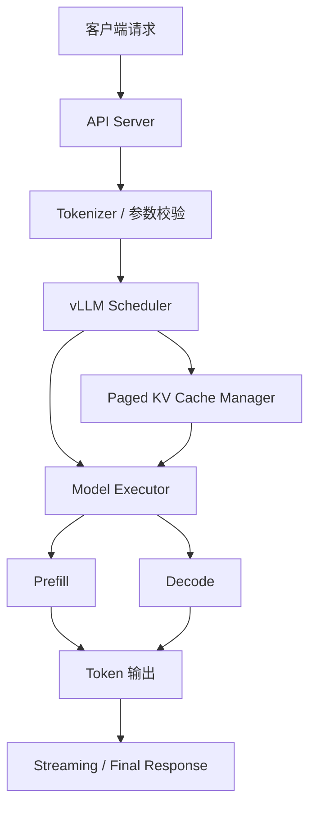
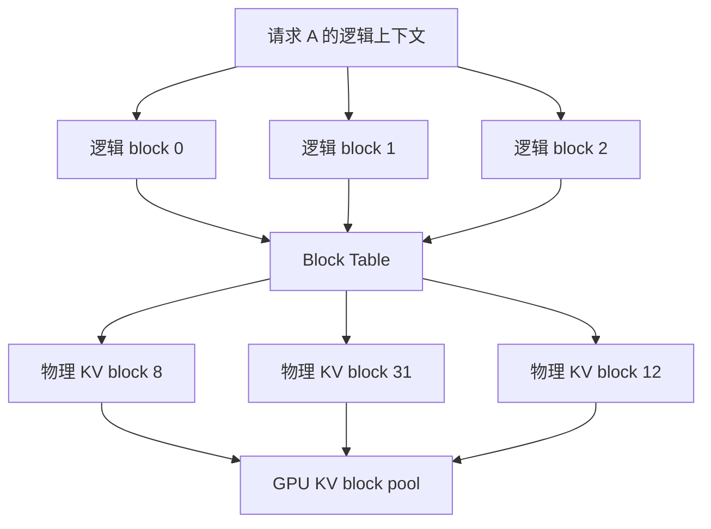
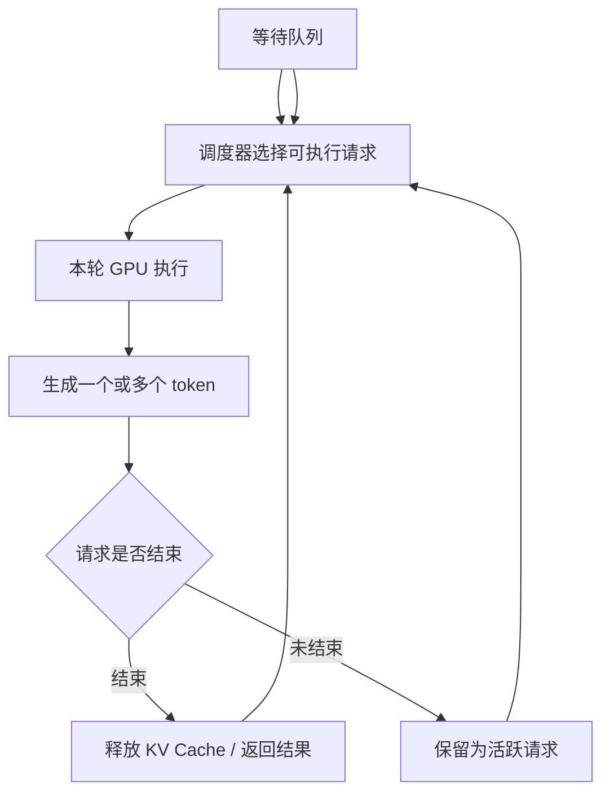
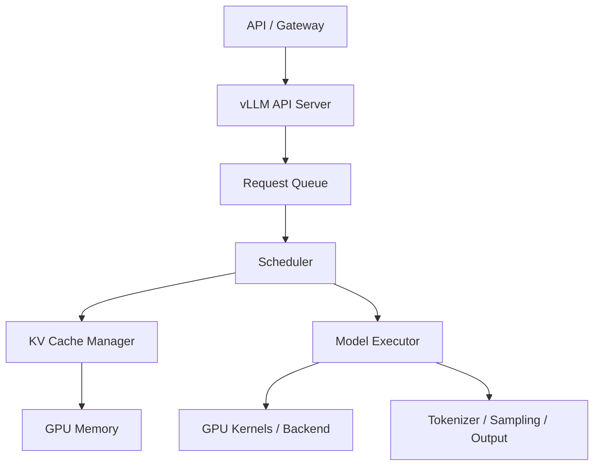

# vLLM

vLLM 是一个面向大语言模型在线推理的开源 serving engine。它的价值不只是“能把模型跑起来”，而是把 KV Cache 管理、continuous batching、调度、并行执行、OpenAI-compatible API 和多种推理优化放到一个工程系统里。

一句话理解：

> vLLM 是学习现代 LLM serving 的很好案例：它把“如何更高效地服务很多不规则请求”这个问题，具体落到了 KV Cache、调度和执行引擎上。

学习 vLLM 时，不建议一开始就陷入命令行参数和版本细节。更重要的是理解它为什么这样设计：LLM 在线推理的瓶颈，通常不是单个请求能不能算，而是很多请求一起进来时，系统如何尽量少浪费显存、少等待 GPU、少重复计算，并稳定满足延迟目标。

## 它适合学习什么

vLLM 可以作为前面多篇推理系统知识的综合案例。

| 相关主题 | 在 vLLM 中对应的问题 |
| --- | --- |
| KV Cache | 如何保存和管理每个请求的历史上下文 |
| PagedAttention | 如何用块式 KV Cache 管理减少显存浪费 |
| Batching | 如何把多个活跃请求放在一起执行 |
| 调度策略 | 哪些请求先执行、哪些等待、哪些被抢占或限制 |
| Prefill 与 Decode | 如何处理长输入和逐 token 输出的不同瓶颈 |
| Prefix Cache | 如何复用相同 prompt 前缀，减少重复 Prefill |
| 量化推理 | 如何降低权重、激活或 KV Cache 的显存和带宽成本 |
| Speculative Decoding | 如何减少目标模型逐 token 解码等待 |
| Benchmark 方法 | 如何用 workload、延迟、吞吐和显存指标评价 serving 系统 |

因此，vLLM 不是一个孤立工具，而是推理系统概念的一个集中实现。

## 在请求链路中的位置

从服务链路看，vLLM 通常位于 API 层之后、GPU 执行层之上。它既要接收外部请求，也要负责把请求组织成适合 GPU 执行的形态。

这张图可以这样读：

1. API server 接收请求，解析模型、prompt、采样参数和输出长度限制。
2. tokenizer 把文本变成 token，并做基本校验。
3. scheduler 决定请求什么时候进入 GPU 执行。
4. KV Cache manager 分配、复用和回收 KV block。
5. model executor 在 GPU 上执行 Prefill 和 Decode。
6. 输出 token 被流式返回或一次性返回给客户端。

vLLM 的核心工作，主要发生在第 3 到第 5 步：调度请求、管理 KV Cache、组织 GPU 执行。

## 核心思想：围绕 KV Cache 和调度优化 serving

传统深度学习推理系统更像“输入一个 batch，模型算完，输出结果”。但 LLM 在线推理不是这样。

LLM 请求有几个特点：

- 输入长度差异很大。
- 输出长度无法提前准确知道。
- 请求会不断到达，也会不断结束。
- Decode 是逐 token 进行的，很多请求会长期停留在系统里。
- KV Cache 会随着上下文增长持续占用显存。

这意味着系统要同时处理两个问题：

第一，显存不能被少数长请求或预留空间浪费掉。否则并发一高就 OOM。

第二，GPU 不能因为请求长短不齐而空等。否则吞吐上不去。

vLLM 的许多设计都围绕这两个问题展开：

- 用 PagedAttention 管理 KV Cache，减少碎片和预留浪费。
- 用 continuous batching 让 GPU 每个 decode step 都尽量有活干。
- 用 scheduler 管理活跃请求、等待请求、资源限制和抢占。
- 用 prefix cache、speculative decoding、量化等能力进一步优化特定场景。

## PagedAttention：vLLM 的代表性设计

vLLM 最有代表性的思想之一是 PagedAttention。它把每个请求的 KV Cache 切成固定大小的 block，再通过 block table 记录逻辑位置和物理显存 block 的映射。

普通思路可能会把一个请求的 KV Cache 当作连续数组来分配。问题是在线请求长度不固定：有的请求只生成几十个 token，有的请求生成几千个 token。如果每个请求都预留最大长度，会浪费大量显存；如果要求连续显存，又容易产生碎片。

PagedAttention 的做法是：

对请求来说，上下文仍然是连续的；对显存来说，KV block 可以分散存放。只要 block table 能找到对应 block，Attention 计算就能读到正确的历史 K/V。

这样做带来几个直接好处：

- 请求实际需要多少上下文，就逐步分配多少 block。
- 请求结束后，可以按 block 回收显存。
- 不要求每个请求占用连续大块显存。
- 多个请求共享相同前缀时，可以复用部分 block。

所以，PagedAttention 不是单纯的 attention 数学变化，而是一个围绕 KV Cache 的内存管理方案。

## Continuous Batching：持续合批

vLLM 的另一个关键点是 continuous batching，也常被理解为 iteration-level scheduling。

传统 static batching 是“凑一批请求，一起跑完”。这在 LLM 场景里效率很低，因为每个请求输出长度不同。一个 batch 里如果有请求很快结束，剩下请求还在继续生成，空出来的位置不能及时放入新请求，就会浪费 GPU 执行机会。

Continuous batching 的思路是：不要等一整批请求全部结束，而是在每个 decode iteration 动态调整活跃请求集合。

简化流程如下：

它的关键是“每一轮都可以重新安排”。当某些请求完成后，scheduler 可以把新请求加入下一轮执行；当某些请求变长、显存紧张或系统过载时，scheduler 也可以限制进入执行的请求数。

这带来的收益是：

- GPU 更少空转。
- 不同长度的请求可以更自然地混合执行。
- 系统吞吐通常比 static batching 更好。
- 在线请求不必等一个固定 batch 填满才开始。

代价是调度和 KV Cache 管理更复杂。系统必须随时知道哪些请求活跃、每个请求需要多少 KV block、下一轮能不能放入更多请求。

## Prefill 与 Decode 在 vLLM 中如何体现

LLM 推理分为 Prefill 和 Decode 两类阶段。

Prefill 是读取完整 prompt，建立初始上下文表示和 KV Cache。它通常计算量大，特别是输入很长时，会明显影响 TTFT。

Decode 是在已有 KV Cache 基础上逐 token 生成。它每步计算量相对小，但会重复很多轮，常常受内存带宽、KV Cache 读取和调度效率影响。

在 vLLM 这样的 serving engine 中，scheduler 需要同时面对两类工作：

- 新请求需要做 Prefill，可能很重。
- 老请求需要继续 Decode，要求稳定输出 token。

如果只追求吞吐，系统可能会把很多长 Prefill 塞进 GPU，导致正在流式输出的请求 TPOT 变差。如果只保护 Decode，新请求 TTFT 又可能过高。

因此，Prefill 和 Decode 的调度不是简单“谁先到谁先算”，而是一个资源分配问题：

- 一轮里放多少 Prefill。
- 一轮里保留多少 Decode。
- 长 prompt 是否需要分块处理。
- 是否限制每轮 token budget。
- 显存不足时是否抢占或延后某些请求。

理解 vLLM 时，要把它看成一个同时管理 Prefill 和 Decode 的系统，而不是只看一次模型 forward。

## Prefix Cache：复用相同前缀

很多线上请求会共享相同的 prompt 前缀。例如：

- 固定 system prompt。
- 相同工具说明。
- 相同 few-shot 示例。
- 相同 RAG 模板。
- 同一轮对话前面的历史消息。

如果每个请求都重新 Prefill 这些相同前缀，就会浪费计算。Prefix Cache 的目标是：当系统发现新请求的前缀已经算过，就复用已有 KV Cache，跳过重复部分。

在 vLLM 里，Prefix Cache 和 PagedAttention 的关系很自然：既然 KV Cache 已经被组织成 block，就可以在 block 粒度上共享和复用前缀。

它适合的场景包括：

- 多用户共享同一个 system prompt。
- RAG 模板固定，只有检索内容或用户问题变化。
- Agent 工具描述很长，但每次调用都重复。
- 批量任务有相同任务说明。

它不适合被误解为“任何请求都能加速”。如果请求之间没有共享前缀，或者 prompt 每次都差异很大，Prefix Cache 命中率就不会高。

## OpenAI-compatible serving

vLLM 常用于提供 OpenAI-compatible API。它的意义是让上层应用可以用类似 Chat Completions 或 Completions 的接口访问本地或私有部署模型，而不需要直接关心底层 GPU 执行细节。

从系统分层看，可以把它理解为：

| 层次 | 关注点 |
| --- | --- |
| API 层 | 请求格式、鉴权、streaming、错误码、客户端兼容性 |
| Serving engine | 调度、KV Cache、batching、执行计划 |
| Model executor | 模型 forward、并行、kernel、显存 |
| Hardware | GPU、CPU、网络、存储 |

OpenAI-compatible API 的价值在于降低应用接入成本。但性能优化时，不能只看 API 是否兼容，还要看底层 serving engine 的参数、模型结构、硬件和 workload 是否匹配。

## 量化支持：降低显存和带宽压力

vLLM 支持多种量化路径，但具体可用能力会随模型、硬件、后端和版本变化。学习时更重要的是理解量化在 serving 里的作用。

量化主要解决三个问题：

- 权重显存占用过大。
- Decode 阶段访存压力高。
- 单卡或多卡部署成本过高。

常见形式包括 weight-only quantization、INT8、INT4、FP8、KV Cache 量化等。不同量化方式影响不同：

| 量化对象 | 主要收益 | 主要风险 |
| --- | --- | --- |
| 权重量化 | 降低模型权重显存和访存 | 可能影响质量或 kernel 支持 |
| 激活量化 | 降低计算与中间表示成本 | 校准和算子支持更复杂 |
| KV Cache 量化 | 降低长上下文和高并发显存 | 可能影响长上下文质量 |

对 vLLM 这类 serving engine 来说，量化是否有效要通过 benchmark 判断。只看模型加载成功没有意义，还要看 TTFT、TPOT、吞吐、显存、质量和错误率是否整体改善。

## Speculative Decoding：减少逐 token 等待

Speculative Decoding 的目标是减少目标模型严格逐 token 生成带来的串行等待。

它的基本思路是：

1. 用更快的 draft model 或额外预测机制先猜多个 token。
2. 用目标模型一次性验证这些 token。
3. 验证通过的 token 可以直接接受。
4. 验证失败的位置再回退到目标模型正常生成。

在 serving engine 里，Speculative Decoding 不是一个孤立算法。它会影响：

- 每轮 decode 的 token 数。
- draft 和 target 的调度。
- KV Cache 写入和回退。
- batch 形态。
- 指标解释。

如果 workload 适合，它可以降低 TPOT 或提升输出 tokens/s。如果 draft 命中率低、额外开销高、显存紧张，效果可能不明显，甚至变差。

所以在 vLLM 中评估 Speculative Decoding 时，必须同时看：

- 接受率。
- TPOT。
- 输出 tokens/s。
- GPU utilization。
- 额外显存。
- 端到端延迟。
- 输出质量是否保持一致。

## 分布式推理

当模型太大或吞吐要求太高时，单张 GPU 不够。vLLM 可以作为多 GPU、多节点推理的一部分，使用 tensor parallel、pipeline parallel 等方式扩展执行。

从学习角度看，分布式 vLLM 需要关注三个问题。

第一，模型参数如何切分。模型太大时，需要把权重放到多张 GPU 上。Tensor parallel 会把某些矩阵计算拆到多卡，通常需要频繁通信。

第二，KV Cache 如何放置。并发和上下文越大，KV Cache 越可能成为显存瓶颈。多卡后不仅要考虑权重，还要考虑每个请求的 KV Cache 分布。

第三，通信是否抵消收益。多 GPU 带来更多算力和显存，但也带来 NCCL 通信、跨节点网络、同步等待和故障面扩大。

因此，多卡不等于性能线性增长。分布式 serving 的评价必须结合：

- 模型大小。
- input/output length。
- 并发数。
- tensor parallel size。
- pipeline parallel size。
- GPU 间互联。
- 节点间网络。
- p95/p99 延迟。

## 与单机推理服务架构的关系

如果把单机推理服务拆开看，vLLM 覆盖了其中很大一部分核心组件。

但它不是完整生产平台的全部。真实线上系统通常还需要：

- 鉴权和租户隔离。
- 限流和配额。
- 模型版本管理。
- 灰度发布。
- 日志脱敏。
- 监控告警。
- 请求追踪。
- 自动扩缩容。
- 容灾和回滚。

也就是说，vLLM 更接近“高性能推理引擎 + API server”，而不是完整企业级 AI 平台。学习时要区分 serving engine 和上层平台能力。

## Benchmark 和调优思路

评估 vLLM 时，不应只跑一个简单 demo。更合理的方式是把问题拆成实验。

例如：

- 在固定模型和 GPU 下，最大可承载并发是多少。
- 在 p95 TTFT 目标下，能支持多少 QPS。
- input length 从 512 增加到 8192 时，TTFT 如何变化。
- output length 增大时，TPOT 和 KV Cache 占用如何变化。
- Prefix Cache 命中率提高后，TTFT 是否下降。
- 开启量化后，显存、吞吐、质量是否都能接受。
- Speculative Decoding 是否真的改善 TPOT。
- tensor parallel size 增大后，吞吐是否增长，尾延迟是否变差。

调优时建议先固定变量：

1. 固定模型、硬件、精度和 vLLM 版本。
2. 固定 input/output length 分布。
3. 固定并发或到达率。
4. 分别观察 TTFT、TPOT、吞吐、显存和错误率。
5. 每次只改变一个关键参数。

这样才能知道收益来自哪里，而不是把多个变化混在一起。

## 适合哪些场景

vLLM 适合用在这些场景：

- 需要部署开源 LLM 的在线服务。
- 请求长度和输出长度差异较大。
- 需要较高并发和吞吐。
- 希望使用 OpenAI-compatible API 接入上层应用。
- 需要学习或验证 PagedAttention、continuous batching、prefix cache 等 serving 技术。
- 需要在 benchmark 中对比不同模型、精度、并行配置和 workload。

特别是当你关心“怎么让模型服务更快、更省显存、更能扛并发”时，vLLM 是一个很适合研究的系统。

## 不适合哪些误用

也要避免几个误解。

第一，vLLM 不是让模型变聪明的工具。它主要优化服务效率，不改变模型本身能力。

第二，vLLM 不是所有场景都最快。不同模型结构、硬件、精度、batch 形态和上下文长度下，TensorRT-LLM、SGLang、原生框架或定制 runtime 可能有不同表现。

第三，开启更多优化不一定更好。量化、Speculative Decoding、Prefix Cache 都依赖 workload 和实现细节。错误开启可能带来质量、显存或延迟副作用。

第四，demo 成功不代表生产可用。生产环境还要考虑监控、限流、错误恢复、安全、模型版本、容量规划和发布流程。

## 常见优化方向

围绕 vLLM 做性能优化时，可以按下面几个方向排查。

### 1. Workload 形态

先看请求本身：

- input length 是否过长。
- output length 是否过长。
- 是否有大量长尾请求。
- 是否存在可复用的 system prompt。
- 是否有 RAG 或 Agent 多次调用。

很多性能问题不是引擎参数造成的，而是 workload 本身给系统带来了很高成本。

### 2. KV Cache 容量

观察 KV Cache 使用情况：

- 高并发下是否接近显存上限。
- 长上下文是否挤占其他请求。
- 是否频繁抢占或拒绝请求。
- block size 和 max context 设置是否合理。
- 是否需要 KV Cache 量化。

如果 KV Cache 成为瓶颈，单纯提高 batch 可能反而让系统更不稳定。

### 3. 调度参数

调度参数会影响 TTFT、TPOT 和吞吐。

需要关注：

- 每轮允许处理多少 token。
- 同时活跃请求数量。
- Prefill 是否压制 Decode。
- 长请求是否影响短请求。
- 是否需要更严格的准入控制。

调度优化的目标不是最大化某一个瞬时吞吐数字，而是在 SLO 下提高有效吞吐。

### 4. 模型和精度

模型大小、精度和量化方式直接决定显存和计算成本。

常见问题包括：

- 权重是否占用过多显存。
- 量化后质量是否可接受。
- 当前 GPU 是否支持对应高效 kernel。
- FP8/INT4 等格式是否真的带来端到端收益。
- KV Cache 精度是否影响长上下文效果。

### 5. 并行和部署

多卡部署需要关注：

- tensor parallel size 是否过大。
- 跨卡通信是否成为瓶颈。
- 多节点网络是否稳定。
- 请求是否需要路由到固定 worker。
- 负载均衡是否考虑上下文长度和 KV Cache 状态。

分布式系统里，最慢 rank、网络抖动和资源不均都会放大尾延迟。

## 应该观察哪些指标

使用 vLLM 做服务或实验时，建议至少观察这些指标：

| 指标 | 说明 |
| --- | --- |
| TTFT | 用户等到第一个 token 的时间 |
| TPOT | 后续 token 生成间隔 |
| end-to-end latency | 完整请求耗时 |
| p95/p99 latency | 长尾体验 |
| requests/s | 请求吞吐 |
| input tokens/s | Prefill 侧输入吞吐 |
| output tokens/s | Decode 侧输出吞吐 |
| GPU memory | 权重、KV Cache 和中间状态占用 |
| KV Cache usage | 并发和长上下文容量压力 |
| GPU utilization | GPU 是否持续有活干 |
| error / timeout / OOM | 稳定性 |
| cache hit rate | Prefix Cache 等缓存是否有效 |

其中最容易误读的是 tokens/s。tokens/s 高不一定代表用户体验好，因为它可能伴随很高 TTFT 或 p99 延迟。在线服务要看 SLO 下的 goodput。

## 一个最小理解例子

假设有 100 个用户同时请求同一个 7B 模型：

- 有的 prompt 只有几十个 token。
- 有的 prompt 有几千个 token。
- 有的只要输出一句话。
- 有的要输出长段代码。
- 很多请求共享同一个 system prompt。

如果系统按传统 static batching 处理，短请求可能等长请求，GPU 也可能因为 batch 形态不稳定而浪费。

vLLM 的处理思路大致是：

1. 用 scheduler 接收这些请求，并决定哪些先进入执行。
2. 对新请求做 Prefill，生成初始 KV Cache。
3. 用 PagedAttention 把 KV Cache 切成 block 管理。
4. 对共享前缀的请求尝试复用已有 KV。
5. 在 Decode 阶段持续把活跃请求合在一起执行。
6. 请求结束后及时释放它占用的 KV block。

这个例子体现了 vLLM 的核心：它不只是“跑模型”，而是在不断变化的请求集合中，动态管理计算和显存。

## 学习路径建议

如果刚开始学习 vLLM，可以按这个顺序看：

1. 先理解 Prefill 与 Decode。
2. 再理解 KV Cache 为什么占显存。
3. 然后看 PagedAttention 如何管理 KV Cache。
4. 接着看 continuous batching 如何提高 GPU 利用率。
5. 再学习 OpenAI-compatible server 如何接入应用。
6. 最后用 benchmark 验证量化、Prefix Cache、Speculative Decoding 和并行部署的收益。

这样的顺序比直接阅读所有参数更清晰。

## 小结

vLLM 是现代 LLM 推理系统的一个重要案例。它的核心不在于某个单独命令，而在于一组系统设计：

- 用 PagedAttention 管理 KV Cache。
- 用 continuous batching 提高吞吐。
- 用 scheduler 平衡 Prefill、Decode、显存和延迟。
- 用 OpenAI-compatible API 降低应用接入成本。
- 用量化、Prefix Cache、Speculative Decoding 和并行能力覆盖更多 workload。

对关注高效计算的人来说，vLLM 最值得学习的是它如何把模型推理变成一个资源管理问题：请求、token、显存 block、GPU 时间片和延迟目标，都要被统一调度。

## 参考资料

- [vLLM Documentation](https://docs.vllm.ai/)
- [vLLM GitHub Repository](https://github.com/vllm-project/vllm)
- [vLLM PagedAttention design documentation](https://docs.vllm.ai/en/latest/design/kernel/paged_attention.html)
- [Efficient Memory Management for Large Language Model Serving with PagedAttention](https://arxiv.org/abs/2309.06180)
