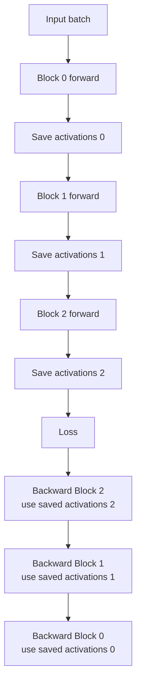
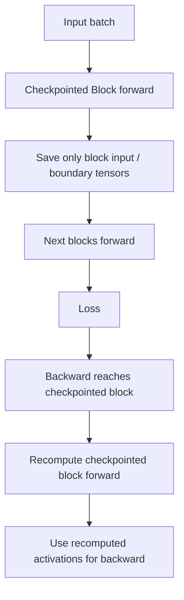

# Activation Checkpointing

大模型训练最常见的显存问题，不一定是参数放不下。

很多时候，参数可以通过 FSDP / ZeRO / Tensor Parallel 切开，但 activation 仍然会随着下面这些因素快速增长：

- micro-batch size。
- sequence length。
- hidden size。
- layer 数。
- attention 实现。
- MLP intermediate size。
- 是否保存 dropout / norm / residual 中间结果。
- pipeline schedule。
- context parallel / sequence parallel 布局。

Activation Checkpointing 的核心思想是：

> forward 时少保存一部分中间 activation，backward 真正需要它们时再重新计算，用额外计算换显存。

它也常被叫作：

- activation recomputation。
- gradient checkpointing。
- rematerialization。

这些名字关注点不同，但在训练系统里通常指同一类技术：

```text
减少 forward 保存的中间结果
在 backward 中重算需要的 forward 片段
```

本篇关注 Activation Checkpointing 的系统视角：它为什么省显存，代价在哪里，如何选粒度，如何和 FSDP/TP/PP/EP/SP/CP 组合，RNG 正确性怎么处理，以及如何 benchmark。

## 先给结论

Activation Checkpointing 是一个显存-计算交换。

| 收益 | 代价 |
| --- | --- |
| 降低 activation peak memory。 | 增加 backward 阶段重算。 |
| 支持更长 sequence length。 | step time 可能变长。 |
| 支持更大 micro-batch。 | profiler timeline 会变化。 |
| 降低 OOM 风险。 | RNG、状态、控制流不当会导致梯度错误。 |
| 让 FSDP/TP/PP 更容易组合。 | 可能改变通信 overlap 和 pipeline bubble。 |

最实用的原则是：

```text
只 checkpoint 那些 activation 大、重算代价可接受、语义稳定的区域。
```

不要把 checkpointing 当成“越多越好”。

它的目标不是最小显存，而是：

```text
刚好把训练放进显存，同时不过度牺牲吞吐。
```

## 为什么训练要保存 Activation

训练 forward 不只是算出 loss。

为了 backward，autograd 需要知道某些中间值。

例如：

```text
y = sin(x)
```

backward 需要：

```text
dy/dx = cos(x)
```

因此 forward 时可能要保存 `x`。

Transformer 里类似的中间值很多：

- attention input。
- Q/K/V。
- attention mask / position 相关中间状态。
- softmax 或 attention kernel 所需 metadata。
- MLP intermediate。
- dropout mask。
- layernorm 输入或统计量。
- residual branch。
- loss 需要的 logits / labels / mask。

默认训练流程可以粗略理解为：

```text
forward:
  compute layer 0 -> save activations
  compute layer 1 -> save activations
  ...
  compute layer N -> save activations

backward:
  use saved activations from layer N
  free layer N activations
  ...
  use saved activations from layer 0
  free layer 0 activations
```

activation memory 的峰值通常出现在：

```text
forward 结束、backward 刚开始之前
```

因为此时大部分需要 backward 的 activation 都还活着。

## 不使用 Checkpoint 的数据流

默认方式可以画成这样：



特点：

- forward 快。
- backward 不需要重算 forward。
- activation 显存高。
- sequence length 和 micro-batch 增大时容易 OOM。

这种方式适合：

- 模型较小。
- sequence length 较短。
- activation 显存不是瓶颈。
- 更关注 step time。

## 使用 Checkpoint 的数据流

使用 Activation Checkpointing 后，checkpoint 区域内部的中间 activation 不长期保存。

只保存 checkpoint 边界输入或少量必要状态。

backward 到达该区域时，重新跑一遍该区域的 forward，恢复 backward 所需中间值。



特点：

- forward 保存的 activation 少。
- backward 多了一段 recompute。
- 显存峰值下降。
- step time 上升。
- RNG、状态和控制流必须一致。

## 显存到底省在哪里

Activation Checkpointing 不减少：

- model parameters。
- gradients。
- optimizer states。
- master weights。
- optimizer temporary buffers。

它主要减少：

```text
需要从 forward 一直活到 backward 的 activation。
```

粗略看，一个 activation tensor 大小是：

```text
num_elements * bytes_per_element
```

对于 Transformer 常见张量：

```text
[micro_batch, sequence_length, hidden_size]
```

它的大小和 sequence length 线性相关。

如果 attention 中还保存 `[batch, heads, seq, seq]` 这类中间值，显存会对 sequence length 更敏感。

现代 FlashAttention / memory-efficient attention 会减少 attention 中间值保存，但不代表 activation 压力消失。MLP、norm、residual、dropout、输出层和分布式 layout 仍然会占显存。

## 显存与计算的直觉公式

假设一个 block 的 forward 成本是：

```text
F
```

不 checkpoint 时：

```text
forward compute = F
backward compute = B
total compute ≈ F + B
```

checkpoint 整个 block 时：

```text
forward compute = F
recompute during backward = F_recompute
backward compute = B
total compute ≈ F + F_recompute + B
```

如果 `F_recompute` 接近 `F`，训练 step 会明显变慢。

但真实开销还取决于：

- checkpoint 区域大小。
- 重算是否能 early stop。
- 是否 selective recompute。
- 重算区域里是否有 expensive GEMM / attention。
- 是否和 communication overlap 互相影响。
- 是否改变 kernel launch / compile graph。
- 是否引发额外 all-gather / reshard。

因此不要只用公式判断，必须用 profiler 验证。

## Checkpoint 粒度

checkpoint 粒度决定省多少显存和多大重算代价。

### 1. Transformer Block 粒度

最常见做法是按 Transformer block checkpoint：

```text
checkpoint(Block 0)
checkpoint(Block 1)
checkpoint(Block 2)
...
```

优点：

- 简单。
- 语义清晰。
- 和模型结构一致。
- 容易和 FSDP wrap、PP stage 对齐。

缺点：

- 整个 block 内部都要重算。
- 可能重算昂贵 attention / MLP。
- 对某些小 block 收益不明显。

这是大多数训练系统的首选起点。

### 2. Segment 粒度

也可以把多个层包成一个 checkpoint region：

```text
checkpoint(layers 0-3)
checkpoint(layers 4-7)
checkpoint(layers 8-11)
```

优点：

- checkpoint 数量少。
- 边界更少。
- 对简单 sequential 模型容易使用。

缺点：

- 粒度更粗。
- backward 到达 segment 时可能需要重算更多层。
- 对 pipeline stage 和 FSDP wrap 更敏感。

### 3. 子模块粒度

也可以只 checkpoint block 内部的大模块：

```text
checkpoint(attention)
checkpoint(mlp)
```

优点：

- 可针对 activation 大户。
- 不必重算整个 block。
- 可以保留某些昂贵模块输出。

缺点：

- 模型代码侵入更强。
- 边界更多。
- 需要更清楚知道哪些 activation 真正占显存。

### 4. Selective Activation Checkpointing

Selective Activation Checkpointing 不是“整个区域全部不保存”。

它允许更细粒度地决定：

```text
哪些 op 的输出保存
哪些 op 的输出重算
```

典型策略：

- 保存 matmul / attention 这类重算昂贵的结果。
- 重算 dropout、activation、pointwise 这类较便宜的结果。
- 对部分 memory-heavy 但 compute-light 的中间值优先重算。

PyTorch 的 newer API 支持通过 policy function 指定哪些 op 保存、哪些 op 重算。

系统直觉是：

```text
不要为了省一点 activation，重算最贵的 GEMM。
```

## Selective Recomputation 的取舍

Selective recomputation 适合下面场景：

- plain checkpoint 变慢太多。
- 显存仍需要下降。
- 你知道哪些 op 重算便宜。
- 模型结构稳定。
- 可以接受更复杂的配置和测试。

例子：

| Op 类型 | 常见策略 | 原因 |
| --- | --- | --- |
| large matmul | 倾向保存 | 重算成本高。 |
| flash attention | 谨慎选择 | 计算贵，且可能有特殊 kernel metadata。 |
| layernorm | 可重算 | 相对便宜，但也要看 shape。 |
| activation function | 可重算 | 通常 pointwise。 |
| dropout | 可重算但要处理 RNG | mask 必须一致。 |
| residual add | 可重算 | 通常便宜。 |

Selective 不是越复杂越好。

如果 profiler 显示 plain block checkpoint 已经满足显存且吞吐可接受，就没有必要过早引入 selective policy。

## Reentrant 与 Non-reentrant

PyTorch 的 `torch.utils.checkpoint.checkpoint` 有 reentrant 和 non-reentrant 两种实现，当前官方文档推荐显式传入 `use_reentrant=False`。

从系统角度理解：

| 维度 | `use_reentrant=False` | `use_reentrant=True` |
| --- | --- | --- |
| 当前推荐 | 推荐 | 有限制，需谨慎。 |
| recompute early stop | 可以在所需 activation 重算完成后停止 | 通常重算整个 function。 |
| forward autograd graph | 会记录 | 在 `torch.no_grad()` 下运行，不记录。 |
| backward API | 支持更多 backward 用法 | 支持较受限。 |
| nested structures | 支持更好 | 限制更多。 |
| detached tensor | 支持更好 | checkpoint 区域里更容易出问题。 |
| `context_fn` / determinism check / debug | 支持 | 支持较少。 |

工程建议：

```python
out = torch.utils.checkpoint.checkpoint(
    block,
    x,
    use_reentrant=False,
)
```

不要依赖默认值。

原因是：

- 默认行为可能随版本变化。
- 显式配置更容易审计。
- run manifest 能记录真实行为。
- 排查 checkpoint 问题时更清楚。

## RNG 与 Dropout 正确性

Checkpointing 最容易出错的地方是随机性。

假设 checkpoint 区域里有 dropout。

原始 forward 产生一个 dropout mask：

```text
mask_original
```

backward 时重算 forward，必须产生语义上匹配的 mask：

```text
mask_recompute == mask_original
```

否则 backward 看到的不是原 forward 的计算，梯度就不对应。

PyTorch checkpoint 默认会保存和恢复 RNG state，以便 dropout 这类随机 op 的重算尽量和原 forward 对齐。

但这有代价：

- 保存/恢复 RNG state 有开销。
- 多设备场景更复杂。
- 如果 checkpointed function 内部把 tensor 移到新设备，确定性可能无法保证。
- 复杂模型并行 RNG tracker 需要额外处理。

如果你设置：

```python
preserve_rng_state=False
```

可能更快，但要明确接受数值路径变化。

对于预训练大模型，建议默认不要关闭，除非你已经通过短训练和梯度对比验证影响可接受。

## Checkpointed Function 应该尽量“纯”

checkpoint 区域在 forward 和 backward recompute 时会被调用两次。

因此它最好像纯函数：

```text
same inputs + same state -> same outputs
```

危险行为包括：

- 依赖会变化的全局变量。
- 修改全局状态。
- forward 和 recompute 走不同分支。
- 使用未受控随机数。
- 在内部改变 device。
- 在内部做不可重复 I/O。
- 依赖外部缓存的 mutable 状态。
- 对输入做 in-place 修改。
- 在 checkpoint 区域内部 detach tensor。

这些问题可能导致：

- 显式报错。
- silent wrong gradients。
- loss 曲线异常。
- resume 后难以复现。

工程原则：

```text
checkpointed region 应该是稳定、可重放、无副作用的计算片段。
```

## Activation Checkpointing 与 Sequence Length

长上下文训练是 activation checkpointing 最典型的场景。

原因是很多 activation 和 sequence length 成正相关：

```text
[batch, seq, hidden]
```

attention 相关中间值还可能对 seq 更敏感。

当 sequence length 从 4K 到 8K，再到 32K 或更长时，activation 压力会显著上升。

常见策略：

- 先使用 memory-efficient attention / FlashAttention。
- 再使用 activation checkpointing。
- 需要时引入 sequence parallel / context parallel。
- 最后再调整 micro-batch 和 gradient accumulation。

不要只靠减小 micro-batch。

因为 micro-batch 过小会影响：

- GEMM shape。
- Tensor Core 利用率。
- pipeline bubble。
- batch normalization 类模块，如果存在。
- 吞吐和 tokens/s/GPU。

Activation checkpointing 能让你在可接受重算代价下保留更合理的 micro-batch。

## 与 Micro-batch / Gradient Accumulation 的关系

显存不够时，常见选择有两个：

1. 减小 micro-batch。
2. 开启 activation checkpointing。

减小 micro-batch 的效果直接：

```text
activation memory ↓
```

但也可能带来：

- GEMM 变小。
- pipeline 利用率变差。
- gradient accumulation steps 增加。
- step latency 增加。
- tokens/s/GPU 下降。

Activation checkpointing 的效果是：

```text
activation memory ↓
compute ↑
```

选择时要比较：

```text
方案 A：micro-batch 小，无 checkpoint
方案 B：micro-batch 大，有 checkpoint
```

不要只比较显存。

要比较：

- tokens/s。
- MFU。
- peak memory。
- communication overlap。
- pipeline bubble。
- stability。

相关内容见：[Batch、Micro-batch 与 Gradient Accumulation](batch-gradient-accumulation.md)

## 与 FSDP / ZeRO 的关系

FSDP / ZeRO 和 activation checkpointing 解决的问题不同。

| 技术 | 主要减少 |
| --- | --- |
| ZeRO-1 | optimizer state 重复。 |
| ZeRO-2 | optimizer state + gradient 重复。 |
| ZeRO-3 / FSDP | parameters + gradients + optimizer states 重复。 |
| Activation Checkpointing | activation 保存。 |

因此即使使用 FSDP / ZeRO-3，长上下文训练仍可能需要 activation checkpointing。

组合时要关注：

- checkpoint region 是否包住 FSDP wrapped module。
- recompute 时是否触发额外 parameter all-gather。
- forward/backward prefetch 是否被重算打乱。
- reshard timing 是否导致重复通信。
- activation 节省是否被 communication buffer 抵消。
- FSDP wrap 粒度和 checkpoint 粒度是否对齐。

一个常见原则：

```text
FSDP wrap boundary 和 checkpoint boundary 尽量匹配 Transformer block。
```

这样更容易理解参数生命周期、activation 生命周期和重算范围。

相关内容见：[ZeRO 与 FSDP](zero-fsdp.md)

## 与 Tensor Parallel 的关系

Tensor Parallel 会改变 activation layout。

例如：

- hidden 维度切分。
- head 维度切分。
- sequence parallel 进一步切分 sequence 维度。
- 某些层输出是 sharded，某些层输出需要 gather。

checkpoint 重算时，必须复现相同 layout。

需要关注：

- recompute 是否使用相同 TP group。
- 重算时 tensor layout 是否和原 forward 一致。
- checkpoint 区域是否跨越 AllGather / ReduceScatter。
- 重算是否重复触发昂贵 TP communication。
- vocab parallel CE 或 LM head 是否在 checkpoint 区域内。

如果 checkpoint 区域跨过多个 TP communication 边界，重算成本可能不仅是本地 compute，还包括重复通信。

相关内容见：[Tensor Parallel](tensor-parallel.md)

## 与 Pipeline Parallel 的关系

Pipeline Parallel 把模型层切到不同 stage。

Activation checkpointing 会影响 pipeline：

- 每个 stage 的 activation 显存。
- backward 时的 recompute 时间。
- stage balance。
- pipeline bubble。
- 1F1B schedule 的内存峰值。
- interleaved schedule 的重算位置。

一个 stage 如果 checkpoint 太多，可能变成慢 stage。

原本平衡的 pipeline：

```text
stage0 time ≈ stage1 time ≈ stage2 time
```

开启 checkpoint 后可能变成：

```text
stage1 recompute heavy -> stage1 becomes bottleneck
```

因此 PP 里不能只看单 stage 显存。

要看：

- 每个 stage forward/backward/recompute time。
- bubble。
- stage idle。
- activation peak。
- micro-batch 数量。
- checkpoint 边界是否和 stage 边界对齐。

相关内容见：[Pipeline Parallel](pipeline-parallel.md)

## 与 Sequence Parallel / Context Parallel 的关系

Sequence Parallel 和 Context Parallel 主要降低长序列下的 activation 或 attention 压力。

它们和 checkpointing 可以组合：

| 技术 | 做什么 |
| --- | --- |
| Sequence Parallel | 把部分 activation 按 sequence 维度切分。 |
| Context Parallel | 把长上下文 attention 所需上下文切到多个 GPU。 |
| Activation Checkpointing | 不保存部分 activation，backward 时重算。 |

组合时要关注：

- recompute 是否需要重新执行 CP/SP 通信。
- position id / RoPE / mask 是否一致。
- packed sequence 边界是否一致。
- checkpoint region 是否跨过 sequence layout 转换。
- 长上下文 attention kernel 是否支持重算路径。

长上下文训练中，通常需要多种技术一起用：

```text
FlashAttention + Sequence/Context Parallel + Activation Checkpointing
```

相关内容见：[Sequence Parallel 与 Context Parallel](sequence-context-parallel.md)

## 与 MoE / Expert Parallel 的关系

MoE 层有额外复杂性：

- router。
- top-k routing。
- token dispatch。
- grouped GEMM。
- token combine。
- load balance loss。
- dropped token / capacity。
- AllToAll。

如果 checkpoint 包住 MoE layer，recompute 时必须保证：

- router 输出语义一致。
- top-k 选择一致。
- token dispatch 顺序一致。
- dropped token 规则一致。
- expert parallel group 一致。
- combine 权重一致。

如果 router 使用 jitter noise 或其他随机策略，RNG 正确性更重要。

MoE checkpoint 的收益和代价也更难估计。

它可能省下：

- router activation。
- expert input/output activation。
- MLP intermediate。

但可能重算：

- router。
- token permutation。
- AllToAll。
- grouped GEMM。
- combine。

因此 MoE 里要单独 benchmark，不要把 dense block 的 checkpoint 策略直接搬过去。

相关内容见：[Expert Parallel 与 MoE 训练](expert-parallel-moe-training.md)

## 与 Mixed Precision / FP8 的关系

混合精度训练中，checkpoint 重算要保持 dtype 策略一致。

需要关注：

- autocast 上下文。
- BF16 / FP16 compute dtype。
- FP8 scale / amax state。
- dropout / norm 是否在高精度执行。
- recompute 是否进入相同 precision context。
- loss scaling 是否受重算异常影响。

FP8 尤其需要谨慎。

如果 forward 记录 amax 或更新 scale，而 recompute 又重复更新，就可能改变训练状态。

合理做法通常是把 FP8 scale / amax 更新和 recompute 路径区分清楚，确保 recompute 不污染训练状态。

不同框架实现会不同，必须查看具体库的文档和测试结果。

相关内容见：[混合精度训练](mixed-precision-training.md)

## 与 torch.compile / Min-cut 的关系

PyTorch `torch.compile` 可以把 forward 和 backward 形成 joint graph，并通过 partitioner 做一定程度的 recomputation。

这和手写 activation checkpointing 的目标有交集：

```text
减少 backward 需要保存的 tensor
```

但它们不完全一样。

从系统角度看：

| 方法 | 直觉 |
| --- | --- |
| 手动 checkpoint | 人指定哪些 region 重算。 |
| selective checkpoint | 人指定哪些 op 保存或重算。 |
| compile min-cut | 编译器根据图和代价模型选择保存/重算。 |
| memory budget API | 给定内存预算，让系统自动选择 tradeoff。 |

当前工程实践中，手动 checkpoint 仍然常见，因为大规模分布式训练有很多编译器难以完全掌握的信息：

- process group。
- FSDP wrap。
- TP/PP/EP layout。
- NCCL communication。
- pipeline schedule。
- MoE token routing。
- 框架自定义 kernel。

但 compile / min-cut / memory budget 提供了重要方向：activation memory 管理会越来越自动化。

## 常见实现方式

### PyTorch checkpoint

常见写法：

```python
from torch.utils.checkpoint import checkpoint

def forward(self, x):
    for block in self.blocks:
        x = checkpoint(block, x, use_reentrant=False)
    return x
```

如果 block 需要额外参数：

```python
x = checkpoint(
    lambda hidden: block(hidden, attention_mask=mask, position_ids=pos),
    x,
    use_reentrant=False,
)
```

注意：

- `function` 要能稳定重放。
- 不要在 checkpoint region 内依赖变化的全局状态。
- `use_reentrant` 建议显式传入。
- 有 dropout 时要处理 RNG。

### checkpoint_sequential

对于简单 sequential 模型，可以按 segment checkpoint：

```python
from torch.utils.checkpoint import checkpoint_sequential

out = checkpoint_sequential(
    model.layers,
    segments=4,
    input=x,
    use_reentrant=False,
)
```

它适合结构简单的模型。

对于复杂 Transformer、MoE、带多输入输出或分布式 layout 的模型，通常更倾向手动控制 block 粒度。

### Selective Checkpoint Context

Selective checkpoint 可以通过 policy 指定某些 op 必须保存。

简化示意：

```python
import functools
import torch
from torch.utils.checkpoint import (
    checkpoint,
    create_selective_checkpoint_contexts,
    CheckpointPolicy,
)

ops_to_save = [
    torch.ops.aten.mm.default,
]

def policy_fn(ctx, op, *args, **kwargs):
    if op in ops_to_save:
        return CheckpointPolicy.MUST_SAVE
    return CheckpointPolicy.PREFER_RECOMPUTE

context_fn = functools.partial(
    create_selective_checkpoint_contexts,
    policy_fn,
)

out = checkpoint(
    fn,
    x,
    use_reentrant=False,
    context_fn=context_fn,
)
```

实际使用时要以当前 PyTorch 版本 API 为准，并在小模型上验证 forward/backward 正确性。

## Benchmark 应该怎么做

Activation checkpointing 的 benchmark 不能只看 OOM 是否消失。

至少要看：

| 指标 | 说明 |
| --- | --- |
| peak allocated memory | PyTorch allocator 记录的峰值分配。 |
| peak reserved memory | CUDA caching allocator 保留显存。 |
| activation memory estimate | 根据 profiler / memory snapshot 估算 activation。 |
| step time | 端到端训练 step 时间。 |
| forward time | forward 是否变化。 |
| backward time | backward + recompute 增加多少。 |
| recompute time | checkpoint 区域重算成本。 |
| communication time | 重算是否影响 overlap。 |
| tokens/s | 实际训练吞吐。 |
| MFU | 有效算力利用率。 |
| OOM rate | 长时间训练是否仍有显存尖峰。 |
| correctness | loss / gradient / eval 是否正常。 |

建议比较矩阵：

| 实验 | 目的 |
| --- | --- |
| no checkpoint | baseline。 |
| block checkpoint | 最常用方案。 |
| segment checkpoint | 看粒度变化。 |
| attention-only checkpoint | 针对 attention activation。 |
| MLP-only checkpoint | 针对 MLP activation。 |
| selective checkpoint | 保存昂贵 op，重算便宜 op。 |
| smaller micro-batch no checkpoint | 和“减 batch”方案比较。 |

不要只报告：

```text
显存下降 30%
```

还要报告：

```text
step time 增加多少？
tokens/s 是否下降？
是否允许更大 micro-batch 或更长 sequence？
最终 tokens/day 是否更高？
```

## Profiler 里怎么看

使用 profiler 时重点看：

- forward 是否少保存 activation。
- backward 中是否出现 recompute forward kernels。
- recompute 是否和 communication 交错。
- recompute 是否让 AllReduce / ReduceScatter 暴露更多。
- FSDP all-gather 是否重复出现。
- PP stage 是否因 recompute 变慢。
- TP communication 是否被重算触发。
- memory peak 是否从 forward 末尾下降。

典型现象：

```text
activation checkpointing 开启后：
  peak memory ↓
  backward time ↑
  forward time 变化较小
  recompute kernels 出现在 backward timeline 中
```

如果 peak memory 没下降，常见原因是：

- checkpoint 区域太小。
- 真正瓶颈不是 activation。
- attention kernel 已经不保存大量中间值。
- 其他对象如 optimizer state / params / logits 占主导。
- checkpoint 区域边界导致仍保存大 tensor。

## 常见优化方向

### 1. 先找 Activation 大户

不要盲目 checkpoint 全模型。

先分析：

- attention。
- MLP。
- output logits / loss。
- long sequence 相关 tensor。
- pipeline stage 局部峰值。
- MoE expert activation。

如果 activation peak 来自 logits 或 loss，checkpoint Transformer block 不一定解决根因。

相关内容见：[大词表输出层、Logits 与 Cross Entropy 系统优化](vocab-output-cross-entropy.md)

### 2. 从 Block 粒度开始

Transformer block 粒度通常是最稳起点。

它容易：

- 实现。
- 解释。
- benchmark。
- 和 FSDP wrap 对齐。
- 和 PP stage 对齐。

确认收益后，再考虑 attention-only、MLP-only 或 selective checkpoint。

### 3. 保持 Boundary 清晰

checkpoint boundary 不要随意跨过太多分布式通信。

特别是：

- TP AllGather / ReduceScatter。
- FSDP all-gather / reshard。
- PP send / recv。
- MoE AllToAll。

跨过通信边界可能让 recompute 成本明显放大。

### 4. 处理 RNG 与 Determinism

有 dropout、router noise、data augmentation 或随机 mask 时，要明确：

- 是否 preserve RNG state。
- 每个 rank 的 RNG tracker 如何处理。
- checkpoint resume 是否保存 RNG。
- recompute 是否使用相同 dtype/device。

相关内容见：[训练可复现性、随机性与 Run Manifest](training-reproducibility-randomness-run-manifest.md)

### 5. 和 Micro-batch 联合调

checkpointing 的价值不只是让当前配置不 OOM。

更重要的问题是：

```text
开启 checkpoint 后，能不能使用更优 micro-batch / sequence / parallelism？
```

有时：

```text
checkpoint + bigger micro-batch
```

比：

```text
no checkpoint + tiny micro-batch
```

吞吐更好。

### 6. 记录到 Run Manifest

checkpointing 会影响速度、显存、数值和复现。

manifest 应记录：

```yaml
activation_checkpointing:
  enabled: true
  granularity: transformer_block
  use_reentrant: false
  preserve_rng_state: true
  selective_policy: null
  checkpoint_attention: false
  checkpoint_mlp: false
```

这样后续比较实验时，才能解释显存和 step time 差异。

## 常见误区

### 误区一：Activation Checkpointing 会减少总计算量

不会。

它通常增加计算量，因为 backward 中要重算 forward 片段。

它减少的是保存的 activation，不是 FLOPs。

### 误区二：Checkpoint 越多越好

不一定。

checkpoint 太多可能导致：

- recompute 过多。
- kernel launch 增加。
- communication overlap 变差。
- PP stage imbalance。
- debug 难度上升。

目标是合适，不是最多。

### 误区三：只要能跑通，梯度就一定正确

不一定。

如果 checkpointed function 在 recompute 时和原 forward 不一致，可能产生 silently incorrect gradients。

尤其要小心：

- dropout。
- global state。
- control flow。
- device movement。
- in-place mutation。
- detach。

### 误区四：用了 FSDP 就不需要 Checkpointing

不对。

FSDP 主要减少模型状态重复。

Activation checkpointing 主要减少 activation 保存。

长上下文、大 micro-batch、多模态输入、MoE 层仍可能需要 checkpointing。

### 误区五：显存下降就代表训练系统更好

不够。

如果显存下降 20%，但 tokens/s 下降 40%，并且没有换来更大 batch 或更长 context，这个配置可能不划算。

训练系统要看：

- tokens/day。
- cost per token。
- MFU。
- stability。
- OOM 风险。
- 长期吞吐。

### 误区六：Selective Checkpoint 一定优于普通 Checkpoint

不一定。

Selective 策略更灵活，但也更复杂。

如果策略不合理，可能保存了太多 tensor，显存收益不足；也可能重算了昂贵 op，速度下降明显。

## 落地检查表

开启前：

- [ ] 当前 OOM 或显存瓶颈是否主要来自 activation？
- [ ] 是否已经估算 parameters / gradients / optimizer states / activations 占比？
- [ ] 目标 sequence length 和 micro-batch 是多少？
- [ ] 是否有 FlashAttention / memory-efficient attention？
- [ ] 是否已固定 baseline step time 和 peak memory？

配置时：

- [ ] checkpoint 粒度是 block、segment、attention、MLP，还是 selective？
- [ ] 是否显式设置 `use_reentrant=False`？
- [ ] 是否需要 preserve RNG state？
- [ ] checkpoint region 是否包含 dropout、router noise 或随机 mask？
- [ ] checkpoint region 是否跨 FSDP / TP / PP / EP 通信边界？
- [ ] mixed precision / FP8 context 在 recompute 时是否一致？
- [ ] 是否记录到 Run Manifest？

验证时：

- [ ] forward output 是否和 baseline 对齐？
- [ ] backward gradient 是否在合理误差内？
- [ ] 短训练 loss 曲线是否正常？
- [ ] peak memory 是否确实下降？
- [ ] step time 增加多少？
- [ ] tokens/s 是否可接受？
- [ ] communication overlap 是否被破坏？
- [ ] PP stage balance 是否变化？
- [ ] resume 后 RNG / loss 是否连续？

上线前：

- [ ] 保留 no-checkpoint fallback。
- [ ] 记录支持和不支持的模型结构。
- [ ] 记录支持的 dtype / GPU / framework 版本。
- [ ] 监控 OOM、NaN、tokens/s regression。
- [ ] 在 benchmark report 中明确 checkpoint 策略。

## 小结

Activation Checkpointing 是大模型训练中最常用的显存优化方法之一。

它的核心不是“神奇省显存”，而是一个清晰交换：

```text
少保存 activation
多做 recompute
```

理解它要抓住几件事：

- activation peak 通常出现在 forward 结束、backward 开始前。
- checkpoint region 内部 activation 不长期保存。
- backward 到达 region 时重算 forward。
- 粒度决定显存收益和重算代价。
- RNG、状态、控制流和 device movement 会影响正确性。
- FSDP/TP/PP/EP/SP/CP 组合会改变重算成本。
- benchmark 要同时看 peak memory、step time、tokens/s、MFU 和 correctness。

实践中，合理策略通常是：

```text
从 Transformer block 粒度开始
验证显存和 step time
再根据 profiler 选择是否做 attention/MLP/selective checkpoint
```

## 参考资料

- [PyTorch: torch.utils.checkpoint](https://docs.pytorch.org/docs/2.12/checkpoint.html)
- [PyTorch Blog: Current and New Activation Checkpointing Techniques in PyTorch](https://pytorch.org/blog/activation-checkpointing-techniques/)
- [训练可复现性、随机性与 Run Manifest](training-reproducibility-randomness-run-manifest.md)
- [显存组成与优化总览](memory-composition-optimization.md)
