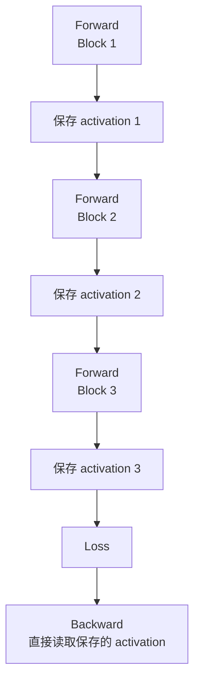
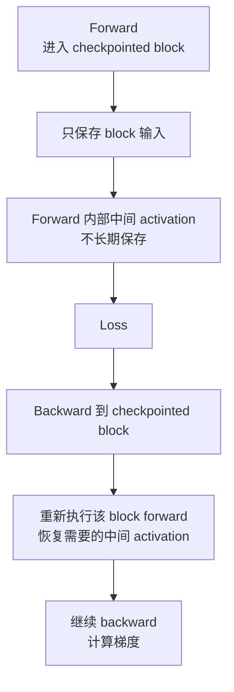

# Activation Checkpointing

训练时显存不只被模型参数占用。很多时候，真正顶住显存上限的是 activation。

一句话理解：

> Activation Checkpointing 的核心目标，是 forward 时少保存一部分中间 activation，等 backward 真正需要它们时再重新计算，用额外计算换显存。

它不是减少参数量，也不是减少数学计算总量。恰恰相反，它会增加计算量。它的价值在于：如果 activation 显存是瓶颈，重算一部分 forward 可能比买更多显存或减小 batch 更划算。

## 为什么训练必须保存 activation

普通训练流程是：

```text
forward -> loss -> backward -> optimizer step
```

Backward 需要计算梯度。很多梯度公式依赖 forward 期间的中间结果。

例如一个简化链路：

```text
x -> linear -> gelu -> linear -> y
```

反向传播时，系统可能需要：

- `linear` 的输入，用来计算权重梯度。
- `gelu` 的输入或输出，用来计算激活函数梯度。
- attention softmax 的结果，用来计算 attention backward。
- dropout mask，用来保持 backward 和 forward 一致。
- layer norm 的均值、方差或相关中间量。

如果 forward 完全不保存这些信息，backward 就不知道该怎么计算正确梯度。

所以默认情况下，深度学习框架会把 backward 需要的 tensor 保留下来，直到对应 backward 用完。

## Activation 为什么会很大

Transformer 训练里的 activation 大小通常和这些因素相关：

```text
micro_batch_size * sequence_length * hidden_size * layers * dtype_size
```

这只是粗略直觉，真实情况还包括 attention、MLP、norm、dropout、临时 buffer 等。

显存压力会在以下场景迅速变大：

- sequence length 增大。
- micro-batch 增大。
- hidden size 增大。
- layer 数增多。
- attention 保存中间结果。
- pipeline parallel 中多个 micro-batch activation 同时存活。
- activation 不能及时释放。

参数显存通常和模型大小相关；activation 显存则强烈依赖 batch 和 sequence。长上下文训练里，activation 往往比很多人直觉中更可怕。

## 不使用 checkpoint 的执行方式

不使用 activation checkpointing 时，forward 会保存许多中间结果：



优点：

- backward 不需要额外 forward 重算。
- 速度通常更快。
- 实现和调试简单。

缺点：

- activation 存活时间长。
- 深层模型、长序列、大 batch 时显存很高。

## 使用 checkpoint 的执行方式

使用 activation checkpointing 后，系统只保存 checkpoint 边界的输入或少量必要状态。checkpoint 区域内部的中间 activation 不长期保存。

Backward 到这个区域时，再重新执行一遍 forward，把缺失的中间 activation 重新算出来，然后继续 backward。



这就是“用重计算换显存”。

## checkpoint 粒度

checkpoint 可以按不同粒度做。

### 按 Transformer block checkpoint

最直观的做法是每个 Transformer block 一个 checkpoint：

```text
checkpoint(Block 0)
checkpoint(Block 1)
checkpoint(Block 2)
...
```

优点：

- 容易理解和实现。
- 显存下降明显。
- 和模型结构对应清楚。

缺点：

- backward 时可能重算整个 block。
- 如果 block 内某些 activation 很小或重算代价很高，粗粒度 checkpoint 不一定最优。

### 按多个 layer 一个 segment

也可以把连续多个 layer 放成一个 segment：

```text
checkpoint(layers 0-3)
checkpoint(layers 4-7)
checkpoint(layers 8-11)
```

segment 越大，保存的边界越少，显存越省，但重算范围越大。

segment 越小，重算更细，保存点更多，显存节省较少。

### Selective Activation Checkpointing

Selective checkpointing 不是“整个区域都不保存”，而是选择性保存某些重算很贵或不适合重算的操作输出，其他操作重算。

这在 Transformer 中很重要。因为不同 activation 的“显存大小”和“重算成本”不同：

- 有些 tensor 很大但重算便宜，适合不保存。
- 有些 tensor 不大但重算很贵，可能应该保存。
- 有些随机操作或状态相关操作需要小心处理。

Selective recomputation 的目标是：不要为了省一点显存，把大量昂贵计算全部重做。

## 重计算代价如何理解

假设一个 block 的 forward 成本是 `F`，backward 成本粗略是 `B`。

不 checkpoint：

```text
总成本 ≈ F + B
```

checkpoint 整个 block：

```text
总成本 ≈ F + F_recompute + B
```

如果 `F_recompute` 接近 `F`，那训练时间会增加。增加多少取决于：

- checkpoint 区域大小。
- forward/backward 计算比例。
- 是否 selective recompute。
- 重算是否能和其他通信/计算重叠。
- kernel 是否仍然高效。
- pipeline 和 micro-batch 调度。

所以 activation checkpointing 不是免费省显存。它是显存和 step time 的交换。

## 随机性和正确性

Checkpointing 有一个容易被忽略的问题：重算 forward 必须和原 forward 在数学上等价。

如果 checkpoint 区域里有 dropout，那么 backward 时重算 forward 需要使用同样的随机 mask。否则 backward 看到的计算图和原 forward 不一致，梯度就会错。

因此框架通常会处理 RNG state，例如保存和恢复随机数状态。但这也可能带来额外开销。

还要避免：

- checkpoint 区域依赖会变化的全局状态。
- forward 和 recompute 走不同控制流。
- checkpoint 区域内部有不受控的随机操作。
- 在 recompute 中使用不同 device 或不同 dtype。
- 对需要梯度的 tensor 做不合适的 detach。

一句话：checkpointed function 应该尽量是纯粹、可重复的计算片段。

## 和 Pipeline Parallel 的关系

Pipeline Parallel 中，多个 micro-batch 会同时处于不同 stage。每个 stage 可能持有多个 micro-batch 的 activation。

如果使用 GPipe 风格调度，forward 先跑完一批 micro-batch，backward 后来才开始，activation 存活时间可能很长。

1F1B 能更早开始 backward，activation 压力会低一些。但对于大模型和长上下文，仍可能需要 activation checkpointing。

组合时要注意：

- checkpoint 粒度是否与 pipeline stage 边界对齐。
- 重算是否增加某个 stage 的时间，使 pipeline 更不平衡。
- micro-batch 数量增加时，activation 峰值如何变化。
- checkpoint 是否影响 pipeline bubble 和 stage idle。

## 和 Tensor Parallel / Sequence Parallel 的关系

Tensor Parallel 会切分部分 hidden/intermediate/head 维度。Sequence Parallel 会切分部分 sequence 维度。

它们和 activation checkpointing 的关系是：

- TP/SP 可以减少某些 activation 在单卡上的大小。
- checkpointing 可以减少 activation 的存活数量。
- 二者可以叠加，但也可能引入更多通信和 layout 转换。

例如 Sequence Parallel 已经把某些 activation 按 sequence 切开，checkpointing 再重算整个 block 时，必须保证重算过程中的 parallel layout 和原 forward 一致。

## 和 FSDP / ZeRO 的关系

FSDP/ZeRO 主要切 parameters、gradients、optimizer states。Activation checkpointing 主要处理 activations。

它们经常一起用：

```text
FSDP / ZeRO:
  降低模型状态显存

Activation Checkpointing:
  降低 activation 显存
```

组合时的系统问题：

- 重算 forward 时，FSDP 是否需要再次 all-gather 参数？
- 参数 all-gather 是否和重算计算重叠？
- checkpoint 区域是否包住 FSDP wrapped module？
- prefetch 和 reshard 策略是否放大通信？
- peak memory 是 activation 还是 gathered parameters？

如果配置不当，checkpointing 省下的 activation 显存可能被额外参数 all-gather 或通信 buffer 抵消一部分。

## 什么时候该用

Activation checkpointing 适合这些场景：

- activation 是主要显存瓶颈。
- 想增大 sequence length。
- 想增大 micro-batch。
- 想减少 pipeline 中多 micro-batch activation 峰值。
- 参数状态已经被 FSDP/ZeRO 处理，但显存仍不够。
- 愿意接受一定 step time 增加换取可训练规模。

不一定适合这些场景：

- 显存瓶颈主要来自 optimizer states。
- 模型已经 compute-bound 且算力非常紧。
- checkpoint 区域包含复杂随机或状态相关逻辑。
- 重算引入的 FSDP all-gather 过重。
- micro-batch 太小，重算进一步降低效率。

## 常见优化方向

### 从粗粒度开始

先按 Transformer block 或固定 layer segment 做 checkpoint，确认显存收益和 step time 代价，再考虑 selective checkpointing。不要一开始就把策略做得很复杂。

### 只 checkpoint activation 大的区域

优先关注 attention、MLP 和长序列下的大 activation。对很小或重算很贵的区域，checkpoint 收益可能不明显。

### 使用 selective recomputation

对 Transformer 来说，完整重算整个 layer 可能浪费。可以选择保存某些代价高的中间结果，只重算显存大且便宜的部分。

### 观察 FSDP/TP/PP 组合效应

checkpointing 会改变 backward timeline。它可能让通信 overlap 变好，也可能让某些 all-gather、AllReduce 或 pipeline stage 等待更暴露。必须看整体 trace。

### 处理 RNG 和 determinism

如果模型里有 dropout，要确认 checkpoint 处理 RNG state 的方式符合预期。关闭 RNG preserve 可能更快，但要明确是否允许数值路径改变。

## Benchmark 时看什么

评估 activation checkpointing 至少看：

| 指标 | 作用 |
| --- | --- |
| Peak memory | 是否真正降低显存峰值 |
| Step time | 重算带来的时间代价 |
| Recompute time | checkpoint 区域重算成本 |
| MFU | 重算后整体计算利用率 |
| Activation memory | activation 是否仍是主瓶颈 |
| Communication time | 重算是否暴露更多通信 |
| FSDP all-gather time | FSDP 组合时尤其重要 |
| Pipeline bubble | PP 组合时看 stage 是否更不均 |
| Determinism check | dropout 等随机操作是否一致 |

实验要固定：

- global batch。
- micro-batch。
- sequence length。
- precision。
- TP/PP/DP/FSDP 配置。
- checkpoint 粒度。
- 是否 selective recompute。
- 是否 preserve RNG state。

## 常见误区

### 误区一：checkpointing 会减少总计算量

不会。它通常增加计算量，因为 backward 前要重算部分 forward。它减少的是保存的 activation 显存。

### 误区二：checkpoint 越多越好

checkpoint 越多不一定越好。过细可能增加调度开销，过粗可能重算太多。最佳粒度要看显存收益和 step time。

### 误区三：只要能跑就说明正确

如果 checkpointed function 有随机性、全局状态或不同控制流，可能跑得通但梯度不等价。正确性需要额外小心。

### 误区四：FSDP 后就不需要 checkpoint

FSDP 主要省模型状态显存，不直接消除 activation 压力。长上下文或大 micro-batch 下仍可能需要 checkpointing。

### 误区五：只看显存不看吞吐

checkpointing 让模型能放下，但也可能让 step time 明显变长。要同时看 tokens/s、MFU 和训练成本。

## 设计检查表

使用 activation checkpointing 前，可以逐项检查：

- 当前显存瓶颈是否真的是 activation？
- activation 峰值来自哪些层或哪些 micro-batch？
- checkpoint 粒度是 block、segment，还是 selective？
- 重算增加了多少 step time？
- 是否存在 dropout 或随机操作？RNG state 如何处理？
- 是否和 FSDP all-gather、TP 通信、PP stage 调度冲突？
- 是否影响 torch.compile、autograd 或自定义 backward？
- profiler 中重算时间是否符合预期？
- 显存节省是否换来了更大的 batch/sequence 或更稳定的训练？

## 小结

Activation Checkpointing 是大模型训练中最常用的显存优化方法之一。它不减少参数，也不减少总计算；它通过少保存 activation、在 backward 时重算 forward 中间结果，换取更低显存峰值。

理解它要抓住三点：

- activation 是训练显存的重要组成，尤其受 sequence length、batch 和 pipeline micro-batch 影响。
- checkpoint 粒度决定显存节省和重算代价。
- 与 FSDP、TP、PP 组合后，必须看整体 timeline，而不是只看某个 API 是否开启。

实践中，合理的 activation checkpointing 往往是“刚好省到能训练，同时不过度牺牲吞吐”的平衡点。

## 参考资料

- [PyTorch: torch.utils.checkpoint](https://docs.pytorch.org/docs/2.12/checkpoint.html)
- [Training Deep Nets with Sublinear Memory Cost](https://arxiv.org/abs/1604.06174)
- [Reducing Activation Recomputation in Large Transformer Models](https://arxiv.org/abs/2205.05198)
- [Megatron Core: transformer package](https://docs.nvidia.com/megatron-core/developer-guide/latest/api-guide/transformer.html)
