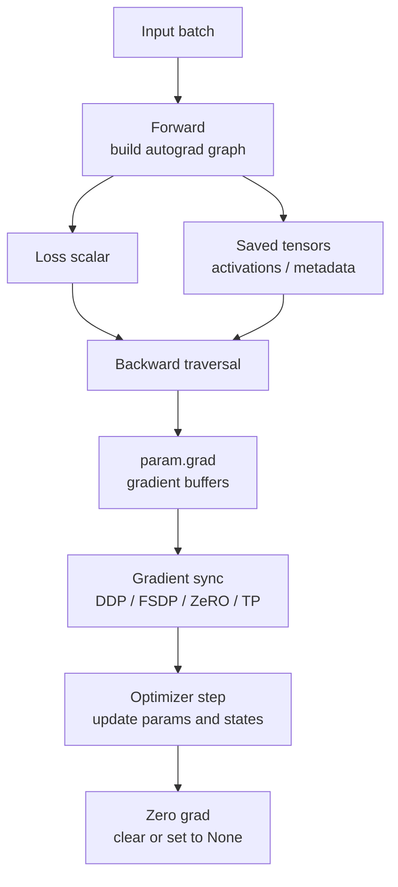
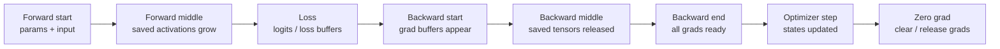

# Backward、Autograd Graph 与梯度生命周期

训练系统里，forward 只是前半段。loss 算出来以后，系统还要执行 backward，把 loss 对参数的影响一路传回去，得到每个参数的梯度，再交给 optimizer 更新参数。

很多训练性能问题都藏在 backward 里：

- activation 为什么要保存，为什么 backward 前不能随便释放。
- gradient tensor 什么时候产生，什么时候累积，什么时候清零。
- gradient accumulation 为什么可以模拟更大的 global batch。
- DDP 为什么在 backward 过程中触发梯度通信。
- FSDP / ZeRO 为什么要在 backward 里做 reduce-scatter、reshard 或 offload。
- activation checkpointing 为什么会让 backward 变慢。
- mixed precision 为什么要 unscale gradient 后再做 clipping。

本篇不做复杂数学推导，而是从训练系统角度解释 backward、autograd graph 和梯度生命周期。

## 先给结论

一个训练 step 可以看成：

```text
forward
-> loss
-> backward
-> gradient sync / reduce
-> optimizer step
-> zero grad
```

从系统角度，backward 的关键不是“公式求导”，而是：

1. forward 会构建 autograd graph，并保存 backward 需要的中间状态。
2. backward 从 loss 出发，沿 graph 反向遍历。
3. 每个参数的梯度会写入 `param.grad`。
4. 如果多次 backward 不清零，梯度会累积。
5. 分布式训练通常把 gradient communication 挂在 backward 过程中。
6. optimizer step 消费 gradients，并更新 parameters / optimizer states。
7. zero grad 决定下一轮是否复用、清零或释放 gradient buffer。

这些机制直接影响显存、step time、通信重叠、数值稳定和训练正确性。

## 一次 Step 的 Autograd 视角

训练脚本里常见代码如下：

```python
optimizer.zero_grad(set_to_none=True)

for micro_batch in micro_batches:
    outputs = model(micro_batch["input_ids"])
    loss = loss_fn(outputs, micro_batch["labels"])
    loss = loss / grad_accum_steps
    loss.backward()

optimizer.step()
```

从 autograd 视角，这段代码发生了几件事：

1. `model(...)` 执行 forward，同时记录产生输出的计算关系。
2. `loss_fn(...)` 把模型输出和 labels 变成标量 loss。
3. `loss.backward()` 从 loss 开始反向传播。
4. autograd 调用每个算子的 backward rule。
5. 参数叶子节点的梯度被累积到 `param.grad`。
6. optimizer 读取 `param.grad`，更新参数。
7. `zero_grad` 清理或释放梯度，准备下一个 step。

图示如下：



这张图要记住两点：

- forward 保存的东西，是为了 backward 用。
- backward 产生的 gradients，是为了 optimizer 用。

## Autograd Graph 是什么

Autograd graph 可以理解为一张“这个 tensor 是怎么计算出来的”的记录。

例如：

```python
y = x @ w
z = gelu(y)
loss = z.sum()
```

autograd 会知道：

```text
loss 来自 z.sum()
z 来自 gelu(y)
y 来自 matmul(x, w)
```

当执行：

```python
loss.backward()
```

系统就能按相反方向计算梯度：

```text
loss -> z -> y -> x / w
```

实际模型里，这张 graph 包含大量算子：

- Linear / Matmul。
- Attention。
- LayerNorm / RMSNorm。
- Activation。
- Dropout。
- Residual add。
- Loss。
- 自定义 fused kernel。

每个算子如果参与梯度计算，都需要有对应的 backward 规则。

## Leaf Tensor 与 Parameter

模型参数通常是 autograd graph 的 leaf tensor，也就是用户直接创建、需要训练的 tensor。

例如：

```python
weight = torch.nn.Parameter(...)
```

当 `weight.requires_grad = True` 时，backward 会为它计算梯度，并把结果放到：

```python
weight.grad
```

对训练系统来说，`param.grad` 是 optimizer 和 distributed gradient sync 的核心接口。

要注意：

- 中间 activation 也可能有 gradient，但默认不会保存在 `.grad` 里。
- 只有 leaf parameter 的 `.grad` 通常会被 optimizer 使用。
- 如果手动调用 `retain_grad()`，中间 tensor 也可以保留 `.grad`，但会增加显存。
- 如果某个 parameter 没有参与当前 loss，它的 `.grad` 可能是 `None`。

## Saved Tensors：Backward 为什么需要 Activation

很多 backward 计算需要 forward 的中间结果。

例如一个简单乘法：

```text
y = x * w
```

如果要计算：

```text
dLoss/dw
```

就需要知道 forward 时的 `x`。

矩阵乘、attention、normalization、activation 也是类似道理。backward 不是凭空算出来的，它需要 forward 保存的一部分中间 tensor 和 metadata。

这些被保存的内容常叫：

- saved tensors。
- activations。
- ctx saved variables。
- backward state。

这就是训练显存中 activation 大的根本原因：

```text
forward 输出中间状态
-> backward 需要它们
-> 不能立刻释放
-> 显存随层数、sequence length、batch size 增长
```

activation checkpointing 的本质就是改变这件事：少保存一部分 activation，backward 时重新跑对应 forward，把需要的中间结果再算出来。

## Backward 遍历的基本过程

执行 `loss.backward()` 时，autograd 从 loss 节点开始。

概念流程如下：

```text
1. loss 的梯度初始为 1。
2. 找到产生 loss 的上游算子。
3. 调用这个算子的 backward。
4. 得到它输入 tensor 的梯度。
5. 继续沿 graph 往前传播。
6. 如果一个 tensor 被多个路径使用，来自不同路径的梯度要相加。
7. 最终把参数梯度累积到 param.grad。
```

这解释了几个系统现象：

- backward 的执行顺序大体与 forward 相反。
- 越靠后的层越早开始 backward。
- DDP 可以在某些参数梯度 ready 后马上开始通信，而不用等整个 backward 完成。
- 如果某条路径有分支，梯度需要等待所有分支贡献汇总。
- 如果 graph 里有未使用参数，某些 `.grad` 可能不会出现。

## 梯度是累积的

PyTorch 的默认语义是：backward 会把新梯度加到已有的 `param.grad` 上。

也就是说：

```python
loss1.backward()
loss2.backward()
```

如果中间没有 `zero_grad()`，最终：

```text
param.grad = grad_from_loss1 + grad_from_loss2
```

这就是 gradient accumulation 能成立的基础。

如果想每个 step 从零开始，必须清理上一步的 gradients：

```python
optimizer.zero_grad()
```

或者：

```python
optimizer.zero_grad(set_to_none=True)
```

忘记清梯度是非常常见的训练错误。它不会一定导致程序崩溃，但会让实际 batch size、更新幅度和 loss 曲线都变得不可解释。

## Gradient Accumulation 的系统语义

Gradient accumulation 是把一个大 batch 拆成多个 micro-batch，分别 forward/backward，但先不 optimizer step。

概念上：

```text
micro-batch 1 -> backward -> grad += g1
micro-batch 2 -> backward -> grad += g2
micro-batch 3 -> backward -> grad += g3
micro-batch 4 -> backward -> grad += g4
optimizer step with accumulated grad
```

如果希望等价于一个大 batch，通常要把每个 micro-batch 的 loss 除以 accumulation steps：

```python
loss = loss / grad_accum_steps
loss.backward()
```

否则梯度会变成大 batch 平均梯度的 `grad_accum_steps` 倍。

如果每个 micro-batch 的有效 loss token 数不同，更严格的做法是按全局有效 token 数归一化，而不是简单除以 micro-batch 数。

## Zero Grad：清零还是设为 None

`optimizer.zero_grad()` 有两类常见语义：

```python
optimizer.zero_grad(set_to_none=False)
```

把已有 `.grad` tensor 填 0。

```python
optimizer.zero_grad(set_to_none=True)
```

把 `.grad` 设为 `None`。

两者区别很重要：

| 方式 | 行为 | 系统影响 |
| --- | --- | --- |
| set to zero | 保留 grad buffer，只把值清零 | 可能复用内存，但会写一遍 grad buffer。 |
| set to None | 释放 `.grad` 引用，下次 backward 再创建 | 可降低显存占用和清零开销，但某些代码要能处理 `grad is None`。 |

现代训练脚本常用：

```python
optimizer.zero_grad(set_to_none=True)
```

但前提是 optimizer、gradient clipping、logging 和自定义 hook 都能正确处理 `None` gradient。

## Retain Graph 与多次 Backward

默认情况下，backward 结束后 autograd graph 会被释放。

如果你尝试对同一个 graph 再 backward 一次，可能会遇到错误，因为 saved tensors 已经释放。

可以用：

```python
loss.backward(retain_graph=True)
```

保留 graph，但这会增加显存生命周期。

常见需要多次 backward 的场景包括：

- 多个 loss 分别 backward。
- 一些复杂的 higher-order gradient。
- GAN / RL / meta-learning 中多阶段优化。

但在大模型训练里，随意使用 `retain_graph=True` 往往是显存泄漏或 OOM 的来源。多数情况下，更好的方式是把多个 loss 加起来，对总 loss backward 一次：

```python
loss = loss_a + loss_b
loss.backward()
```

## Backward 与显存生命周期

训练显存的峰值经常出现在 forward 结束、backward 刚开始附近。

原因是：

- 参数还在。
- optimizer state 还在。
- forward 保存的 activation 还在。
- loss 和 logits temporary 可能还在。
- backward 即将产生 gradient buffer。

随着 backward 从后往前执行，某些 saved tensors 可以释放，gradient buffer 逐渐产生。

用时间线表示：



优化显存时要问清楚：

- 峰值发生在 forward、loss、backward 还是 optimizer step？
- activation 是否是主因？
- gradients 是否在 accumulation 期间长期驻留？
- logits / loss temporary 是否形成额外峰值？
- optimizer state 是否在 step 阶段导致峰值？

不同阶段对应不同优化手段。

## DDP 为什么在 Backward 中通信

Data Parallel 里，每个 rank 处理不同数据，但模型参数要保持一致。

做法是：

1. 每个 rank 本地 forward/backward。
2. 每个 rank 得到本地 gradient。
3. 对同一个参数的 gradient 做 AllReduce。
4. 每个 rank 得到平均后的 global gradient。
5. 每个 rank 执行相同 optimizer step。

DDP 通常不会等所有梯度都算完才开始通信。它会把参数组织成 buckets。当某个 bucket 里的 gradient 都 ready 后，就可以启动 AllReduce。

这样可以把通信和后续 backward 计算重叠：

```text
Layer N gradient ready
-> bucket ready
-> start AllReduce
-> backward continues on Layer N-1, N-2, ...
```

这就是 backward overlap 的基础。

如果 bucket 太大，通信启动晚，overlap 差。

如果 bucket 太小，kernel / collective 启动开销变多，通信效率也可能差。

## Gradient Hook

很多分布式训练能力通过 gradient hook 实现。

hook 可以在某个 tensor 的 gradient 产生时被调用。例如：

- DDP gradient bucket ready 后触发 AllReduce。
- FSDP 在参数梯度 ready 后做 reduce-scatter。
- 自定义压缩或量化 gradient。
- 记录 gradient norm / overflow。
- 对某些参数做特殊处理。

hook 的好处是能嵌入 backward 流程，尽早处理 gradient。

坏处是系统行为更难排查：

- backward timeline 里会混入通信和 hook 逻辑。
- hook 可能改变梯度值。
- hook 的同步点可能破坏 overlap。
- 自定义 hook 出错时，表面上看像 autograd 或 NCCL 问题。

## FSDP / ZeRO 中的 Backward

FSDP / ZeRO 不只是“节省显存的包装器”。它们会改变 backward 里的参数和梯度生命周期。

以 FSDP / ZeRO-3 为例：

```text
forward 前：参数可能是 sharded
forward 时：需要 all-gather 当前模块完整参数
forward 后：可选择释放完整参数
backward 时：再次需要参数参与梯度计算
gradient ready：reduce-scatter 梯度
optimizer step：只更新本 rank 负责的 shard
```

这带来几个系统问题：

- 参数 all-gather 是否能和计算重叠。
- backward prefetch 是否提前拉取下一个模块参数。
- gradient reduce-scatter 是否能尽早发生。
- reshard 时机如何影响显存峰值。
- CPU/NVMe offload 是否把瓶颈转移到 PCIe / 存储。
- checkpoint 保存的是 full state dict 还是 sharded state dict。

所以 FSDP / ZeRO 的性能不能只看“显存少了多少”，还要看 backward 里新增的通信和等待。

## Tensor Parallel 中的 Backward

Tensor Parallel 把单层矩阵切到多个 rank。forward 里有 collective，backward 里同样有 collective。

例如 Column Parallel Linear：

```text
Y_i = X @ W_i
```

每个 rank 计算一部分输出。backward 时：

- 对本地 `W_i` 计算梯度。
- 对输入 `X` 的梯度需要汇总各 rank 的贡献。

Row Parallel Linear 则有另一组通信位置。

这说明：

- TP 的通信不是只发生在 forward。
- backward 通信可能与 matmul backward 交错。
- layout 如果切换频繁，会增加 AllReduce / ReduceScatter / AllGather。
- vocab parallel output 和 distributed cross entropy 也会影响 backward 通信。

分析 TP 性能时，必须同时看 forward 和 backward 的 collective。

## Pipeline Parallel 中的 Backward

Pipeline Parallel 把模型层切到不同 stage。每个 stage 在 backward 时不只算本地参数梯度，还要把 activation gradient 传给前一个 stage。

典型流程是：

```text
last stage receives loss gradient
-> backward local layers
-> send activation gradient to previous stage
-> previous stage continues backward
```

这带来 pipeline bubble 和调度问题：

- micro-batch 太少，流水线填不满。
- stage 计算不均衡，某些 stage 等待。
- activation send/recv 与 backward compute 是否能重叠。
- interleaving 是否减少 bubble。
- loss / LM head 在最后 stage 是否造成额外负担。

Pipeline Parallel 的 backward 是理解 1F1B 调度的核心。

## MoE 中的 Backward

MoE 训练里，forward 会把 token dispatch 到不同 expert，backward 要把梯度沿相同路径传回。

系统上要关注：

- router logits 的 gradient。
- expert weights 的 gradient。
- token dispatch/combine 的 backward。
- AllToAll 的反向通信。
- load balance loss / auxiliary loss 的 gradient。
- expert token count 不均导致 backward 时间不均。

MoE backward 的难点不只是通信大，还包括负载不均。某些 expert 接收 token 多，它的 forward/backward 都会更慢，影响整个 step。

## Mixed Precision 与 GradScaler

FP16 训练里，梯度可能 underflow。常见做法是 loss scaling：

```text
scaled_loss = loss * scale
scaled_loss.backward()
```

这样 backward 产生的是放大后的 scaled gradients。

在 optimizer step 前，需要：

```text
unscale gradients
check inf / nan
clip gradients if needed
optimizer step
update scale
```

顺序很重要：

```text
backward scaled loss
-> unscale gradients
-> gradient clipping
-> optimizer step
```

如果在 unscale 前做 clipping，clip 的是被 scale 放大的梯度，结果会错。

BF16 通常不需要 loss scaling，但仍然要关注：

- 梯度极值。
- loss spike。
- optimizer state 精度。
- fused backward kernel 的数值稳定性。

FP8 训练还会引入 amax、scale、delayed scaling 等更多状态，backward 的数值路径更复杂。

## Gradient Clipping

Gradient clipping 常用于防止梯度爆炸。

最常见的是 global norm clipping：

```text
global_norm = sqrt(sum(||grad_i||^2))
if global_norm > max_norm:
    grad_i = grad_i * max_norm / global_norm
```

分布式训练里，global norm 必须覆盖所有 rank 上的参数梯度。如果只算本 rank 的 norm，会得到错误 clipping scale。

常见顺序是：

```text
backward
-> gradient sync / reduce
-> unscale if AMP
-> compute global grad norm
-> clip
-> optimizer step
```

FSDP / ZeRO 中，梯度是 sharded 的，因此框架通常要提供 sharded global norm 计算方法。

## Optimizer 如何消费 Gradients

optimizer step 会读取每个参数的 `param.grad`。

以 AdamW 为例，它会维护：

- 参数本身。
- gradient。
- first moment。
- second moment。
- 有时还有 master weight。

step 过程概念上是：

```text
read param.grad
update optimizer states
compute parameter update
write parameter
```

如果某个参数的 `grad is None`，optimizer 通常会跳过它。这个行为在 `set_to_none=True`、冻结参数、LoRA adapter、MoE sparse expert、条件分支模型中都很重要。

要区分：

```text
grad = 0
```

和：

```text
grad is None
```

前者表示参与了 optimizer step，但梯度为零。后者表示没有梯度，很多 optimizer 会跳过对应状态更新。

## 常见训练循环顺序

一个较完整的训练 step 顺序通常是：

```python
optimizer.zero_grad(set_to_none=True)

for i, batch in enumerate(micro_batches):
    with autocast_context:
        output = model(batch)
        loss = compute_loss(output, batch)
        loss = normalize_loss(loss, batch)

    scaled_or_normal_loss = maybe_scale(loss)
    scaled_or_normal_loss.backward()

maybe_unscale_grads()
maybe_clip_grads()
optimizer.step()
maybe_update_loss_scale()
scheduler.step()
```

在 DDP gradient accumulation 中，还可能出现：

```python
with model.no_sync():
    loss.backward()
```

只在最后一个 micro-batch 同步 gradients。

在 FSDP / ZeRO 中，很多通信、prefetch、reshard、offload 动作由框架插入。

## Benchmark 应该看什么

分析 backward 和梯度生命周期时，建议记录：

| 指标 | 含义 |
| --- | --- |
| forward time | 纯 forward 计算与保存 activation 的成本。 |
| backward time | autograd backward、kernel backward、recompute 和 hooks 的总时间。 |
| exposed communication time | backward 中未被计算覆盖的通信时间。 |
| grad ready time | 每个 bucket 或参数梯度 ready 的时间。 |
| optimizer step time | 更新参数和 optimizer state 的时间。 |
| peak memory | forward/loss/backward/optimizer 哪个阶段形成峰值。 |
| grad memory | gradient buffers 占用。 |
| activation memory | saved tensors 占用。 |
| recompute time | activation checkpointing 引入的额外 forward。 |
| grad norm | 梯度健康度和 clipping 触发情况。 |
| unused parameters | 是否存在没有 gradient 的参数。 |

Profiler 里要特别看：

- backward kernel 是否比 forward kernel 明显慢。
- DDP AllReduce 是否在 backward 中提前启动。
- FSDP all-gather / reduce-scatter 是否暴露。
- activation checkpointing 是否导致重复 forward。
- gradient clipping 是否成为 CPU/GPU 同步点。
- `zero_grad` 是否产生大规模 memset。

## 常见故障

### 忘记清梯度

现象：

- loss 曲线异常。
- 梯度 norm 越来越大。
- 实际更新幅度不像配置里的 batch size。

原因：

- step 之间没有调用 `zero_grad`。
- gradient accumulation 边界写错。
- 异常跳过 optimizer step 后没有明确处理 gradients。

排查：

- 记录每个 optimizer step 前的 grad norm。
- 确认每个 update cycle 只清一次梯度。
- 明确 accumulation step 计数。

### Loss 没有正确归一化

现象：

- 改变 gradient accumulation steps 后，训练行为明显变化。
- 改变 sequence packing / padding 后，loss 和 grad norm 不可比。

原因：

- 每个 micro-batch loss 没除以 accumulation steps。
- 按样本数平均，而不是按有效 loss token 平均。
- DDP 中只使用本地 loss token count。

排查：

- 记录 global loss token count。
- 对比单大 batch 与多个 micro-batch accumulated gradients。
- 对 padding 比例不同的 batch 做对照。

### Retain Graph 导致 OOM

现象：

- 每个 step 显存持续增长。
- backward 后 activation 没释放。
- 第二次 backward 相关逻辑复杂。

原因：

- 不必要地使用 `retain_graph=True`。
- 把 loss tensor 或 graph 相关 tensor 存到 Python list。
- logging 保存了未 detach 的 tensor。

排查：

- 搜索 `retain_graph=True`。
- logging 时使用 `loss.detach()` 或 `loss.item()`。
- 检查是否跨 step 保存了 graph tensor。

### Gradient 是 None

现象：

- 某些参数没有更新。
- optimizer state 缺失。
- clipping 或 logging 代码因为 `grad is None` 报错。

原因：

- 参数没有参与当前 loss。
- 参数被冻结。
- 条件分支没有走到该模块。
- `set_to_none=True` 后还没 backward。
- FSDP / ZeRO sharding 下本 rank 不持有完整 gradient。

排查：

- 打印 parameter name 和 `requires_grad`。
- 检查 forward 是否使用该参数。
- 检查 loss 是否依赖对应输出。
- 分布式下用框架提供的 grad inspection 方法。

### Backward 通信没有重叠

现象：

- backward 结束后出现大段 AllReduce。
- GPU 计算和 NCCL 通信串行。
- 多机 scaling efficiency 差。

原因：

- bucket 太大或顺序不合适。
- backward graph 中某些梯度很晚才 ready。
- 自定义 hook 引入同步。
- gradient accumulation 配置导致通信集中发生。
- 网络慢，通信无法被计算完全覆盖。

排查：

- 用 profiler 看 bucket ready 和 NCCL timeline。
- 调整 bucket size。
- 分析大参数层的 backward 顺序。
- 检查是否使用 `no_sync`。

## 常见优化方向

### 降低 Activation 保存压力

方法包括：

- activation checkpointing。
- selective recomputation。
- fused attention / FlashAttention，减少保存 attention matrix。
- sequence parallel / context parallel。
- 更小 micro-batch。

核心取舍是：

```text
少保存 activation
-> backward 时多重算
-> 显存下降
-> step time 可能上升
```

### 提高 Backward 通信重叠

方法包括：

- 合理设置 DDP bucket。
- 保持参数注册顺序与 backward ready 顺序匹配。
- 避免无意的同步点。
- 使用 reduce-scatter 替代 all-reduce where appropriate。
- 让通信 group 和硬件拓扑匹配。

### 减少 Gradient Buffer 压力

方法包括：

- `zero_grad(set_to_none=True)`。
- sharded gradients。
- gradient accumulation 边界清晰。
- 对冻结参数关闭 `requires_grad`。
- LoRA / adapter 只训练少量参数。

### 控制 Optimizer Step 成本

方法包括：

- fused optimizer。
- foreach optimizer。
- sharded optimizer state。
- offload 需要谨慎评估 PCIe / CPU 瓶颈。
- 减少不必要的参数组碎片。

## 实践检查清单

写训练脚本或调训练系统时，至少检查：

1. 每个 optimizer step 前是否正确累计了目标 micro-batch 数。
2. loss 是否按有效 token 或目标样本正确归一化。
3. gradients 是否在正确边界清零。
4. `grad is None` 是否是预期行为。
5. AMP 下是否先 unscale 再 clipping。
6. DDP / FSDP 通信是否发生在预期 group。
7. profiler 中 backward 是否有明显同步空洞。
8. activation checkpointing 的显存收益是否值得额外 recompute。
9. logging 是否 detach，避免跨 step 持有 graph。
10. 单卡、小 batch baseline 是否能和分布式配置对齐。

## 与本章其他主题的关系

建议把本篇和这些内容连起来读：

- [训练任务生命周期](training-lifecycle.md)：把 backward 放回完整 step。
- [Batch、Micro-batch 与 Gradient Accumulation](batch-gradient-accumulation.md)：理解 accumulation 的 batch 语义。
- [显存组成与优化总览](memory-composition-optimization.md)：理解 activation、gradient、temporary buffer 的显存来源。
- [Data Parallel 与梯度同步](data-parallel-gradient-sync.md)：理解 DDP gradient bucket 和 AllReduce。
- [ZeRO 与 FSDP](zero-fsdp.md)：理解 sharded parameter / gradient / optimizer state 生命周期。
- [Activation Checkpointing](activation-checkpointing.md)：理解 backward 重算如何换显存。
- [混合精度训练](mixed-precision-training.md)：理解 loss scaling、unscale 和 gradient overflow。

## 参考资料

- [PyTorch Autograd mechanics](https://docs.pytorch.org/docs/stable/notes/autograd.html)
- [PyTorch `torch.Tensor.backward`](https://docs.pytorch.org/docs/stable/generated/torch.Tensor.backward.html)
- [PyTorch `Optimizer.zero_grad`](https://docs.pytorch.org/docs/stable/generated/torch.optim.Optimizer.zero_grad.html)
- [PyTorch Automatic Mixed Precision examples](https://docs.pytorch.org/docs/stable/notes/amp_examples.html)
