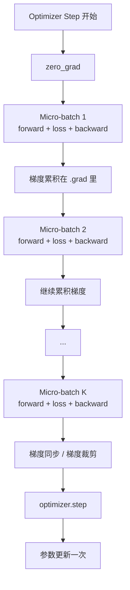

# Batch、Micro-batch 与 Gradient Accumulation

训练系统里经常会看到很多和 batch 相关的词：batch size、micro-batch、per-device batch、global batch、gradient accumulation。这些词如果混在一起，很容易把显存、吞吐、通信和训练稳定性都算错。

一句话理解：

> Micro-batch 决定一次 forward/backward 塞进 GPU 多少数据；gradient accumulation 决定累积多少次 backward 后才更新参数；global batch 决定一次参数更新等价用了多少数据。

这篇先不深入优化理论，只把系统里的流程和成本讲清楚。

## 为什么 batch 概念很重要

训练不是每看到一个样本就更新一次参数。通常做法是：取一批样本组成 batch，模型对整个 batch 做 forward/backward，然后 optimizer 用这批数据产生的梯度更新参数。

Batch 直接影响四件事：

- 显存：一次塞进 GPU 的样本越多，activation 越多。
- 吞吐：batch 太小，GPU 算不满；batch 太大，可能 OOM 或通信变慢。
- 通信：多 GPU 训练时，每次梯度同步和 batch 结构有关。
- 优化：global batch 变大后，梯度噪声和学习率设置都可能变化。

所以 batch 不是一个单纯的“配置参数”。它是连接系统效率和训练行为的核心变量。

## 几个容易混淆的概念

先把词定义清楚。

| 概念 | 含义 | 影响重点 |
| --- | --- | --- |
| sample | 一个训练样本，例如一条文本、一张图片、一段音频 | 数据语义 |
| sequence | 文本模型里的一段 token 序列 | attention 计算和 activation |
| token | 语言模型处理的基本离散单位 | LLM 训练吞吐 |
| micro-batch | 一次 forward/backward 实际处理的数据量 | 单次显存和算子效率 |
| per-device batch | 每张 GPU 每次处理的数据量 | 单卡显存和单卡吞吐 |
| gradient accumulation steps | 累积多少个 micro-batch 后更新一次参数 | global batch 和 optimizer step 频率 |
| data parallel size | 有多少个数据并行副本一起训练 | global batch 和梯度同步范围 |
| global batch | 一次 optimizer step 等价使用的数据总量 | 训练动态和有效吞吐 |

在很多代码里，`batch_size` 这个名字并不精确。它可能指 per-device micro-batch，也可能指 global batch。看训练配置时，必须确认它到底是哪一个。

## 最基本的公式

样本级训练里，常见关系是：

```text
global batch size =
  micro-batch size per GPU
* gradient accumulation steps
* data parallel size
```

例如：

```text
micro-batch size per GPU = 2
gradient accumulation steps = 4
data parallel size = 8
```

那么：

```text
global batch size = 2 * 4 * 8 = 64 samples
```

也就是说，每次参数更新等价于用了 64 个样本。

对语言模型，更推荐用 token 来算：

```text
global tokens per optimizer step =
  tokens per micro-batch per GPU
* gradient accumulation steps
* data parallel size
```

如果每张 GPU 每个 micro-batch 有 2 条序列，每条 4096 tokens：

```text
tokens per micro-batch per GPU = 2 * 4096 = 8192
```

如果 data parallel size 是 16，gradient accumulation steps 是 8：

```text
global tokens per optimizer step =
  8192 * 8 * 16
= 1,048,576 tokens
```

这表示每次参数更新约使用 100 万 token。

## 一个 optimizer step 里发生了什么

Gradient accumulation 的流程可以画成这样：



注意，micro-batch 会做多次 forward/backward，但 optimizer 只更新一次参数。

伪代码大概是：

```python
optimizer.zero_grad()

for i in range(gradient_accumulation_steps):
    loss = model(micro_batch[i])
    loss = loss / gradient_accumulation_steps
    loss.backward()

optimizer.step()
```

真实系统还要处理混合精度、梯度同步、梯度裁剪、scheduler、日志和异常恢复，但主干逻辑就是这样。

## 为什么要 Gradient Accumulation

Gradient accumulation 最常见的用途是：显存放不下大 batch，但又希望 global batch 足够大。

假设目标 global batch 是 256，但每张 GPU 显存只能放下 2 个样本。你有 16 张 GPU：

```text
2 samples/GPU * 16 GPUs = 32 samples
```

如果不做 accumulation，每次参数更新只有 32 个样本。

如果设置：

```text
gradient accumulation steps = 8
```

那么：

```text
2 * 16 * 8 = 256 samples
```

这样就能用较小 micro-batch 模拟较大的 global batch。

它的本质是用更多时间换更大的有效 batch。

## Gradient Accumulation 解决了什么，没解决什么

它解决的是 global batch 不够大的问题。

它没有让单次 forward/backward 的 activation 显存变小。单次显存主要还是由 micro-batch size、sequence length、hidden size、layer 数、activation checkpointing 等决定。

它也没有减少总计算量。累积 8 个 micro-batch，就要做 8 次 forward/backward。

它更不是免费的吞吐优化。它可能让每次参数更新用更多数据，但 wall-clock time 也会增加。

简单说：

| 问题 | Gradient Accumulation 是否解决 |
| --- | --- |
| 显存放不下更大的 micro-batch | 不直接解决，只能维持小 micro-batch |
| 想要更大的 global batch | 可以解决 |
| 想让单次 forward 更快 | 不解决 |
| 想减少 optimizer step 频率 | 可以减少 |
| 想减少每个有效 batch 的同步次数 | 需要正确配置 DDP 同步 |
| 想提升最终模型质量 | 不保证，需要训练实验验证 |

## Micro-batch 决定 activation 显存

训练显存里，activation 通常和 micro-batch 关系很大。

Micro-batch 越大，一次 forward 要保存的中间结果越多，backward 时要用这些中间结果计算梯度。

影响 activation 显存的常见因素包括：

- micro-batch size。
- sequence length。
- hidden size。
- layer 数。
- attention pattern。
- 是否使用 activation checkpointing。
- 是否使用 mixed precision。

Gradient accumulation steps 增大，不会让某一次 micro-batch 的 activation 变大。因为每次 forward/backward 仍然只处理一个 micro-batch。

这也是它有用的地方：可以保持 micro-batch 小，从而不爆显存，同时通过多次累积获得更大的 global batch。

## Micro-batch 太小也有代价

Micro-batch 小可以省显存，但不一定快。

太小的 micro-batch 可能带来：

- 矩阵乘规模太小，GPU 算不满。
- kernel launch overhead 占比变高。
- pipeline parallel 的 bubble 变大。
- 每个 micro-step 的调度开销更明显。
- DataLoader 和 H2D copy 更难摊薄。

所以调参时不能只追求最小显存。通常要找到一个平衡点：micro-batch 尽量大到让 GPU 算子效率还不错，但不能 OOM，也不能让通信和长尾变差。

## Global batch 决定一次更新用了多少数据

Optimizer 每更新一次参数，看到的数据量就是 global batch。

Global batch 太小，梯度噪声大，训练可能不稳定，吞吐也可能低。

Global batch 变大，梯度估计更稳定，但也可能带来：

- 学习率需要重新调整。
- warmup 可能需要重新设计。
- 每个 epoch 的 optimizer step 数减少。
- 过大的 batch 可能影响泛化或收敛行为。
- 保存、评估、日志如果按 step 触发，实际样本间隔也会变化。

系统工程里经常需要保持 global batch 不变，以便公平比较硬件、并行策略和框架。

例如，从 8 张 GPU 扩到 16 张 GPU，如果 micro-batch 和 accumulation 不变：

```text
global batch 会翻倍
```

这时你测到的速度变化，不只是系统扩展效率变化，也混入了训练配置变化。

## 样本 batch 和 token batch 不一样

在语言模型训练里，“多少条样本”不一定等于“多少训练量”。

一条样本可能有 128 tokens，也可能有 4096 tokens。按样本数算 global batch，容易误导。

更可靠的是记录：

- nominal tokens。
- effective tokens。
- padding tokens。
- loss tokens。

例如一个 batch 里有 4 条序列，都 padding 到 1024：

```text
总 token slots = 4 * 1024 = 4096
```

但真实有效 token 可能只有：

```text
600 + 800 + 1000 + 200 = 2600
```

如果 loss mask 只训练其中一部分，真正参与 loss 的 token 可能更少。

所以 LLM 训练里，global batch 最好用有效 token 来表达：

```text
global effective tokens per optimizer step
```

这比单纯写 `batch_size = 8` 更有信息量。

## Loss 应该怎么缩放

Gradient accumulation 的一个常见错误是 loss 缩放不正确。

假设你累积 4 个 micro-batch。如果每个 micro-batch 的 loss 都直接 backward，最后累积的梯度会比单个 micro-batch 大约大 4 倍。

常见做法是：

```python
loss = loss / gradient_accumulation_steps
loss.backward()
```

这样累积后的梯度近似等于“把这些 micro-batch 合成一个大 batch 后求平均”的结果。

但语言模型里还要注意 token 数。如果每个 micro-batch 的有效 token 数不同，简单对每个 micro-batch loss 平均，可能让短样本和长样本权重不一致。

更稳妥的思路是按有效 token 数归一化：

```text
total_loss =
  sum(loss over valid tokens)
/ total_valid_tokens
```

多 GPU 时，还要确保不同 rank 的有效 token 数统计一致。否则某些 rank 的短 batch 可能被赋予过高权重。

## Gradient Sync：什么时候同步梯度

在 Data Parallel 训练中，每个 GPU 处理不同 micro-batch。为了让模型副本保持一致，梯度需要同步。

如果使用 DDP，默认每次 backward 都可能触发梯度同步。

但做 gradient accumulation 时，通常不希望每个 micro-batch 都同步一次。更常见的做法是：

1. 前几个 micro-batch 只在本地累积梯度，不做跨卡同步。
2. 最后一个 micro-batch backward 时再同步梯度。
3. 同步完成后执行 optimizer step。

这样可以减少不必要的通信。

流程可以理解为：

```text
micro-step 1: backward, no sync
micro-step 2: backward, no sync
micro-step 3: backward, no sync
micro-step 4: backward, sync
optimizer step
```

如果每个 micro-step 都同步，gradient accumulation 仍然能得到更大的 global batch，但通信开销会明显更高。

PyTorch DDP 里常用 `no_sync()` 控制中间 micro-step 不同步梯度。框架如 DeepSpeed、Megatron-LM、Accelerate、Trainer 通常会帮你封装这件事，但理解它很重要。

## 通信和计算的取舍

Gradient accumulation 对通信有两个影响。

第一，它减少 optimizer step 频率。假设总 token 数不变，accumulation steps 变大后，参数更新次数会减少。

第二，如果正确推迟梯度同步，它可以减少跨卡同步频率。

但它也有代价：

- 每个 optimizer step 包含更多 micro-step，wall-clock step time 更长。
- 梯度在本地累积期间会占用显存。
- 日志、评估、checkpoint 的 step 语义更容易混乱。
- 过大的 accumulation 可能降低参数更新频率，使训练反馈变慢。

所以它不是“accumulation 越大越好”。它是显存、通信、吞吐和优化动态之间的折中。

## Scheduler、Logging 和 Checkpoint 的 step 语义

训练日志里常见两个 step：

- micro-step：一次 micro-batch forward/backward。
- optimizer step 或 global step：一次参数更新。

很多框架里的 `global_step` 指的是 optimizer step，不是 micro-step。

这会影响：

- 学习率 scheduler。
- warmup steps。
- logging interval。
- evaluation interval。
- checkpoint interval。

如果把这些间隔理解错，会出现实际训练进度和预期不一致。

例如：

```text
gradient_accumulation_steps = 8
logging_steps = 100
```

如果 `logging_steps` 按 optimizer step 计数，那么一次日志之间实际经历：

```text
100 * 8 = 800 micro-steps
```

所以配置训练任务时，必须确认框架的 step 计数语义。

## Mixed Precision 下的注意点

混合精度训练里，gradient accumulation 还要处理 loss scaling。

核心原则是：一个 effective batch 没累积完之前，不要破坏已经累积的梯度尺度。

常见要求包括：

- 每个 micro-batch 的 loss 要按 accumulation 正确缩放。
- GradScaler 的 `step()` 和 `update()` 应该在完整 effective batch 后执行。
- 如果要 gradient clipping，通常要在所有 micro-batch 累积完成后，对 unscaled gradient 裁剪。
- 不要在 accumulation 中间清空梯度。

否则可能出现梯度尺度不一致、裁剪阈值错误、NaN 检查粒度错误等问题。

## 和 Pipeline Parallel 的关系

Pipeline Parallel 里也有 micro-batch，但含义更偏流水线调度。

Pipeline Parallel 把模型层切成多个 stage。为了让不同 stage 同时工作，需要把一个 batch 切成多个 micro-batch，在流水线里交错执行。

这和 gradient accumulation 的 micro-batch 经常放在一起配置，但关注点不同：

- Pipeline micro-batch 主要影响 pipeline bubble 和 stage 利用率。
- Gradient accumulation 主要影响 global batch 和参数更新频率。

真实训练系统里，两者会耦合。你可能需要同时考虑：

```text
global batch =
  micro-batch size
* gradient accumulation steps
* data parallel size
```

而 pipeline 调度还会关心：

```text
num micro-batches per pipeline step
```

后续讲 Pipeline Parallel 时会单独展开。

## 和 Data Parallel 扩展的关系

Data Parallel size 增加时，如果其他参数不变，global batch 会变大。

例如：

| DP size | micro-batch/GPU | accumulation | global batch |
| --- | --- | --- | --- |
| 8 | 2 | 8 | 128 |
| 16 | 2 | 8 | 256 |
| 32 | 2 | 8 | 512 |

如果你想保持 global batch = 128，那么扩 GPU 数时就要调整 micro-batch 或 accumulation：

| DP size | micro-batch/GPU | accumulation | global batch |
| --- | --- | --- | --- |
| 8 | 2 | 8 | 128 |
| 16 | 2 | 4 | 128 |
| 32 | 2 | 2 | 128 |

这就是为什么训练系统 benchmark 必须写清楚 global batch。否则 scaling efficiency 的比较没有意义。

## 一个配置例子

假设你有 32 张 GPU，训练一个语言模型。

配置如下：

```text
sequence length = 4096
micro-batch size per GPU = 1 sequence
gradient accumulation steps = 16
data parallel size = 32
```

每个 micro-batch 每张 GPU 的 token 数：

```text
1 * 4096 = 4096 tokens
```

每次 optimizer step 的 global tokens：

```text
4096 * 16 * 32 = 2,097,152 tokens
```

如果训练目标是每次更新约 2M tokens，这个配置是合理的。

如果想把 GPU 数扩到 64，但保持每次更新仍然约 2M tokens，可以把 accumulation steps 降到 8：

```text
4096 * 8 * 64 = 2,097,152 tokens
```

这样 global tokens 不变，训练动态更可比。

## 常见调参思路

调 batch 相关参数时，可以按这个顺序：

1. 先确定训练希望的 global batch 或 global tokens。
2. 根据显存找到单卡能承受的最大 micro-batch。
3. 根据 GPU 利用率判断 micro-batch 是否太小。
4. 用 data parallel size 和 accumulation steps 凑出目标 global batch。
5. 检查 DDP 中间 micro-step 是否避免了不必要同步。
6. 检查 loss 缩放、token 归一化和 gradient clipping 是否正确。
7. 记录 step time、tokens/s、optimizer steps/s 和有效 tokens/s。
8. 如果扩 GPU，决定是保持 global batch 不变，还是有意增大 global batch。

这套顺序比直接猜 `batch_size` 更可靠。

## 应该观测哪些指标

| 指标 | 说明 |
| --- | --- |
| micro-batch size per GPU | 单次 forward/backward 的数据量 |
| gradient accumulation steps | 每次更新前累积多少个 micro-step |
| global batch / global tokens | 一次 optimizer step 的有效训练量 |
| step time | 一个 optimizer step 的 wall-clock 时间 |
| micro-step time | 单个 micro-batch 的 forward/backward 时间 |
| optimizer steps/s | 参数更新频率 |
| tokens/s | token 处理吞吐 |
| effective tokens/s | 去掉 padding 和 mask 后的有效 token 吞吐 |
| peak memory | 峰值显存 |
| communication time | 梯度同步耗时 |
| data loading wait | 数据是否拖慢 micro-step |

只看 tokens/s 不够。你还要知道这些 token 对应多大的 global batch，以及每秒更新了多少次参数。

## 常见误区

### 1. Gradient accumulation 等价于真正的大 batch，完全没有差别

不完全等价。数学上它可以接近“大 batch 求平均梯度”，但系统上它要多次 forward/backward，涉及同步、loss scaling、随机性、BatchNorm、dropout、scheduler 等细节。

### 2. Accumulation steps 越大越好

不一定。太大的 accumulation 会降低参数更新频率，增加一个 optimizer step 的耗时，也可能让日志、评估和 checkpoint 间隔变得不直观。

### 3. Micro-batch 越小越省显存，所以越好

不一定。太小的 micro-batch 可能让 GPU 算不满，kernel launch 和调度开销占比变大。

### 4. 多 GPU 扩容后不用改 batch 配置

不一定。如果 DP size 增加而其他参数不变，global batch 会变大。除非这是有意为之，否则应该调整 accumulation 或 per-device batch。

### 5. 每个 micro-step 都同步梯度也没关系

能训练，但通信成本更高。gradient accumulation 通常应该避免中间 micro-step 的不必要梯度同步。

### 6. Loss 平均一下就一定正确

不一定。LLM 训练中有效 token 数可能不同。按 micro-batch 平均和按 token 平均会得到不同权重。

### 7. Scheduler step 可以随便按 micro-step 走

不应该随便。大多数训练配置希望 scheduler 跟 optimizer step 对齐。如果按 micro-step 走，学习率变化速度会快 `gradient_accumulation_steps` 倍。

## 排查清单

配置 batch 和 gradient accumulation 时，建议逐项确认：

1. `batch_size` 在当前框架里到底是 per-device batch 还是 global batch。
2. global batch 公式是否写清楚。
3. LLM 训练是否记录 global effective tokens。
4. loss 是否按 accumulation 或有效 token 正确归一化。
5. DDP 中间 micro-step 是否跳过梯度同步。
6. gradient clipping 是否在累积完成后执行。
7. mixed precision 的 scaler 是否在 effective batch 粒度更新。
8. scheduler、logging、eval、checkpoint 是否按正确 step 计数。
9. 扩 GPU 后 global batch 是否发生了非预期变化。
10. benchmark 是否同时记录 micro-batch、accumulation、DP size、sequence length 和有效 tokens/s。

## 小结

Batch 相关配置的核心不是记住某个参数名，而是分清三个层次：

- Micro-batch：一次 GPU 实际计算多少数据，主要影响 activation 显存和算子效率。
- Gradient accumulation：累积多少次 backward 后更新参数，主要影响 global batch 和同步频率。
- Global batch：一次参数更新等价使用多少数据，主要影响训练动态和 benchmark 可比性。

理解这三者之后，训练配置才不会变成靠经验猜数值。你可以明确地回答：为什么这个配置放得下、为什么这个吞吐可信、为什么扩 GPU 后训练行为仍然可比。

## 参考资料

- [DeepSpeed Configuration JSON: Batch Size Related Parameters](https://www.deepspeed.ai/docs/config-json/#batch-size-related-parameters)
- [Hugging Face Transformers Trainer: `gradient_accumulation_steps`](https://huggingface.co/docs/transformers/en/main_classes/trainer)
- [PyTorch DistributedDataParallel `no_sync()`](https://docs.pytorch.org/docs/2.12/generated/torch.nn.parallel.DistributedDataParallel.html)
- [PyTorch Automatic Mixed Precision examples: Gradient accumulation](https://docs.pytorch.org/docs/2.12/notes/amp_examples.html)
