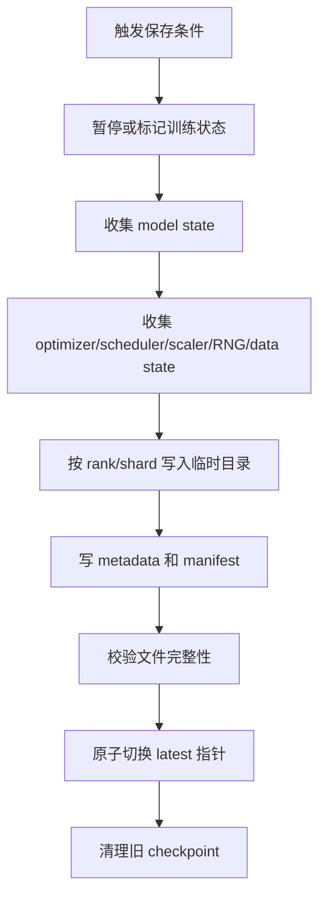
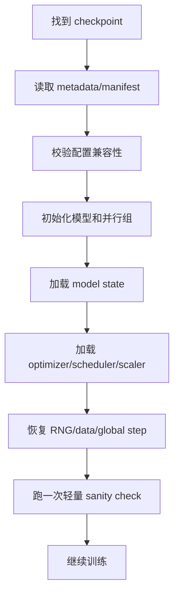

# Checkpoint、Resume 与容错

训练系统不能只追求每一步跑得快。大模型训练可能持续数天、数周甚至更久，中间一定会遇到机器故障、网络抖动、作业抢占、存储异常、代码升级、配置修改和人工误操作。

Checkpoint 的目标不是“保存一个模型文件”，而是：

> 在训练中断后，系统能尽量少丢进度，并且用可验证的状态恢复训练。

这篇重点讨论训练系统里的 checkpoint、resume 和容错设计。它不讲推理模型导出，也不讲怎么把模型上传到模型仓库。这里关心的是长期训练如何活下来。

## Checkpoint 不是一个文件，而是一套恢复协议

刚开始看 checkpoint，很容易把它理解成“把权重保存到磁盘”。这个理解只适合小模型推理导出，不适合长期训练。

训练系统里的 checkpoint 更接近一套恢复协议：

```text
保存什么状态
-> 状态如何分片
-> 文件如何提交
-> 哪个版本可以被恢复
-> 恢复后如何验证
-> 失败后最多丢多少进度
```

因此，一个可靠 checkpoint 方案至少要回答五个问题。

| 问题 | 设计含义 |
| --- | --- |
| 保存完整吗 | 权重、optimizer、scheduler、RNG、data cursor、并行元数据是否都在 |
| 写入安全吗 | 写到一半失败时，不会污染上一个可用 checkpoint |
| 能重组吗 | 分布式 shard 是否能按全局 tensor 语义重新加载 |
| 能迁移吗 | world size、TP/PP/DP/EP 配置变化后是否能 reshard |
| 能验证吗 | resume 后能否确认 step、tokens、loss、LR、数据位置连续 |

如果只保存文件，但没有协议，就会出现一种危险状态：系统“看起来能恢复”，但恢复出来的是错误训练状态。

训练平台做 checkpoint 时，真正追求的不是“目录里有文件”，而是“任何时刻都能找到最后一个已提交、可验证、语义完整的恢复点”。

## Checkpoint 保存的到底是什么

最小的模型 checkpoint 可能只保存参数：

```text
model weights
```

这对推理可能够用，但对继续训练远远不够。训练 checkpoint 至少要保存：

| 状态 | 为什么需要 |
| --- | --- |
| model parameters | 恢复模型权重 |
| optimizer state | 恢复 AdamW 的 `m/v`、Muon momentum、master weights 等 |
| scheduler state | 恢复学习率曲线位置 |
| scaler state | FP16 AMP 需要恢复 loss scaling |
| RNG state | 让 dropout、数据增强、随机采样尽量连续 |
| dataloader / sampler state | 避免重复或跳过数据 |
| global step | 决定日志、eval、scheduler、checkpoint cadence |
| consumed samples / tokens | 大模型训练通常按 token 计进度 |
| parallelism metadata | TP/PP/DP/EP/FSDP/ZeRO 配置 |
| code/config metadata | 记录这份状态属于哪个训练配置 |

所以完整训练 checkpoint 更像一个目录：

```text
checkpoint-00012000/
  metadata.json
  model/
  optimizer/
  scheduler/
  scaler/
  rng/
  dataloader/
  trainer_state.json
```

分布式训练里还会有每个 rank 或每个 shard 的文件。

## Checkpoint 状态分层

不是所有状态的重要性都一样。工程上可以把 checkpoint 状态分成四层。

| 层级 | 例子 | 没有它会怎样 |
| --- | --- | --- |
| 必须恢复 | model weights、optimizer state、global step、parallelism metadata | 不能算严格 resume，可能只能 warm-start |
| 强烈建议恢复 | scheduler、scaler、RNG、data cursor、consumed tokens | loss、LR、数据顺序或随机轨迹可能不连续 |
| 可重新推导但要记录 | config hash、code commit、framework version、hardware topology | 当恢复异常时，很难判断原因 |
| 诊断辅助 | profiler marker、last eval score、grad norm、throughput snapshot | 不影响继续训练，但影响排障和回滚决策 |

这个分层很实用。它能帮助团队决定：

- 什么状态缺失时必须拒绝 resume。
- 什么状态缺失时允许 warning 后继续。
- 哪些状态可以不影响训练，但必须进入 run manifest。
- 什么 checkpoint 只能用于 warm-start，不能用于严格恢复。

例如只保存模型权重和 tokenizer config 的文件，可以用于推理或微调起点。但如果它没有 optimizer state、scheduler state 和 data cursor，就不应该被训练系统标记为 `resumable=true`。

## 为什么只保存权重不够

假设一个 AdamW 训练在 step 10000 中断。如果只保存模型权重，然后重新初始化 optimizer，从 step 10000 接着跑，会发生什么？

- AdamW 的一阶矩 `m` 丢失。
- AdamW 的二阶矩 `v` 丢失。
- 学习率 scheduler 可能回到 warmup 起点或错误位置。
- loss scaler 可能回到默认值。
- dataloader 可能从错误位置继续。
- dropout 和随机增强轨迹会变化。

训练当然可能还能跑，但它不再是同一条训练轨迹。

对于研究和系统调优，这会带来两个问题：

1. 实验不可复现。
2. resume 后 loss 曲线可能出现异常，但很难判断是模型问题、数据问题还是状态缺失。

所以需要区分两种 checkpoint：

| 类型 | 目的 | 内容 |
| --- | --- | --- |
| training checkpoint | 继续训练 | model + optimizer + scheduler + scaler + RNG + data state |
| inference/export checkpoint | 部署或评测 | 通常只需要模型权重和必要配置 |

不要用 inference checkpoint 当作长期训练容错方案。

## 一次保存的生命周期

一次 checkpoint save 通常经历：



这里有几个关键点：

- 不应该先覆盖旧的 latest。
- 不应该写一半就让系统认为 checkpoint 可用。
- metadata 和 manifest 要能描述每个 shard。
- 失败时要么保留旧 checkpoint，要么明确标记新 checkpoint 不完整。

## Checkpoint 提交协议

可靠保存的核心是提交协议，而不是 `save()` 调用本身。

可以把一个 checkpoint 的生命周期分成几个状态：

| 状态 | 含义 | 是否可 resume |
| --- | --- | --- |
| planned | 训练循环决定要保存一个新 checkpoint | 否 |
| writing | 各 rank 正在写入 shard 或本地 staging 文件 | 否 |
| validating | 文件已写完，正在校验 manifest、size、checksum、rank 数量 | 否 |
| committed | manifest 完整，latest 已指向这个 checkpoint | 是 |
| failed | 保存失败或校验失败 | 否 |
| garbage_collectable | 不再被 latest、best、milestone 引用，可删除 | 否 |

这就是为什么 checkpoint 目录最好不要只靠目录名判断是否可用。更稳妥的方式是显式写入 manifest：

```json
{
  "checkpoint_id": "checkpoint-00012000",
  "status": "committed",
  "global_step": 12000,
  "consumed_tokens": 251658240000,
  "world_size": 256,
  "created_at": "2026-06-12T10:00:00Z",
  "shards": [
    {
      "path": "model/rank-00000-of-00256.bin",
      "logical_tensors": ["layers.0.attn.q_proj.weight"],
      "size_bytes": 1073741824,
      "checksum": "..."
    }
  ]
}
```

Resume 入口只接受 `status=committed` 的 checkpoint。这样即使保存过程中作业被杀、节点断电或对象存储上传失败，下次启动也不会误读半成品。

### Two-phase Save

一个常见实现是两阶段保存：

```text
phase 1: write staging checkpoint
phase 2: validate and commit
```

第一阶段只写临时目录，例如：

```text
checkpoint-00012000.tmp/
```

第二阶段完成后才做原子切换：

```text
checkpoint-00012000.tmp/ -> checkpoint-00012000/
latest -> checkpoint-00012000/
```

这个过程的关键不是“文件名好看”，而是让系统始终满足一个不变量：

> `latest` 永远指向最后一个完整可恢复的 checkpoint。

只要这个不变量成立，checkpoint save 失败最多损失本次保存，不会破坏上一次可恢复状态。

## 一次恢复的生命周期

一次 resume 通常经历：



恢复时最危险的不是 load 报错，而是 load 成功但状态错位。

比如：

- 参数名对上了，但 shape 对不上。
- 参数 shape 对上了，但 optimizer state 对错参数。
- scheduler 加载了，但 global step 不一致。
- 数据恢复了，但 consumed tokens 不一致。
- world size 变化了，但 checkpoint 格式不支持 reshard。

所以 resume 后要做验证，而不是只看程序能继续跑。

## 完整性：哪些状态必须保存

### Model State

模型参数是最基本部分。

需要记录：

- 参数名。
- shape。
- dtype。
- sharding 信息。
- tied weights 关系。
- embedding / lm_head 是否共享。
- FP8 / quantized training 的额外 scale 状态，如果有。

FSDP、ZeRO、TP、PP 下，模型参数可能是 sharded state，而不是单个完整 `state_dict`。

### Optimizer State

Optimizer state 往往比模型权重更大。

AdamW 可能包括：

- first moment `m`。
- second moment `v`。
- FP32 master weights。
- step counter。
- parameter group hyperparameters。

Muon 可能包括：

- momentum buffer。
- master weights，如果有。
- parameter group 信息。
- Newton-Schulz / update scaling 相关配置。

训练 checkpoint 如果不保存 optimizer state，只能算 warm-start，不能算严格 resume。

### Scheduler State

Scheduler 看似很小，但语义非常关键。

必须知道学习率处在：

- warmup 第几步。
- cosine decay 第几步。
- token-based schedule 的哪个 token 位置。
- gradient accumulation 后第几个 optimizer step。

如果 scheduler 按 micro-step 计数，但 resume 按 optimizer step 恢复，学习率曲线会漂移。

### AMP / GradScaler State

FP16 训练常用 dynamic loss scaling。GradScaler 保存当前 scale 和调整历史。

如果恢复时丢失 scaler state，可能出现：

- resume 后短期 overflow。
- scale 重新从默认值爬升，影响吞吐。
- NaN/Inf 处理行为和中断前不同。

BF16 通常不需要 loss scaling，但仍要保存其他 mixed precision 配置。

### RNG State

RNG state 包括：

- Python random。
- NumPy random。
- PyTorch CPU RNG。
- CUDA RNG。
- 每个 rank 的 CUDA RNG。
- model/tensor parallel 相关 RNG tracker。

它影响：

- dropout。
- data augmentation。
- masked language modeling mask。
- MoE routing 中的随机策略，如果有。
- sequence packing 的随机性。

严格复现需要保存 RNG。工程容错至少要知道是否保存了 RNG。

### Data State

数据状态经常被忽略，但长期训练很重要。

需要保存：

- epoch。
- dataset shard。
- sampler position。
- consumed samples。
- consumed tokens。
- packing buffer 状态。
- shuffle seed。
- streaming dataset cursor。
- tokenizer / data version。

如果训练按 token budget 管理，`consumed_tokens` 比 `global_step` 更重要。

## Sharded Checkpoint

单机小模型可以保存一个文件。大模型训练通常不能这样做。

原因：

- 单 rank 聚合完整模型可能 OOM。
- 单文件写入速度慢。
- optimizer state 太大。
- 多节点网络会把 rank0 打成瓶颈。
- 恢复时再广播完整 state 很慢。

Sharded checkpoint 的思路是：

```text
rank 0 writes shard 0
rank 1 writes shard 1
rank 2 writes shard 2
...
metadata describes all shards
```

PyTorch Distributed Checkpoint 的 `save` 会处理 `ShardedTensor` 和 `DTensor`，让每个 rank 保存本地 shard。DeepSpeed 也强调训练 checkpoint 下所有进程都要调用保存接口，因为每个进程都有自己的 master weights、scheduler 和 optimizer states。

### Sharded Checkpoint 的关键元数据

一个 shard 文件本身不够，还需要 metadata：

- checkpoint version。
- world size。
- rank layout。
- TP/PP/DP/EP size。
- 每个 tensor 的 global shape。
- 每个 shard 的 offsets。
- 每个 shard 的 dtype。
- 每个 shard 对应的 parameter FQN。
- optimizer state 与 parameter 的映射。
- 保存时的 framework/runtime 版本。

没有这些元数据，shard 只是一堆难以重组的 tensor。

### Coordinator Metadata 与 Rank-local Metadata

大规模训练里，metadata 可以分成两类。

| 类型 | 记录什么 | 谁读取 |
| --- | --- | --- |
| coordinator metadata | checkpoint id、global step、world size、并行配置、manifest、shard 列表 | resume 控制面和所有 rank |
| rank-local metadata | 当前 rank 写了哪些 tensor slice、本地文件路径、local RNG、local data cursor | 当前 rank 或重分片加载器 |

这两类不要混在一起。

如果所有信息都塞到 rank-local 文件里，恢复时要先猜每个 rank 文件代表什么，控制面会很脆弱。如果所有 rank-local 细节都塞进一个巨大 central metadata，metadata 本身又会变成单点瓶颈。

更稳妥的设计是：

- central manifest 描述全局 checkpoint 语义。
- rank-local manifest 描述本 rank 或本 shard 的物理文件。
- central manifest 引用 rank-local manifest。
- resume 时先读取 central manifest，再决定每个 rank 需要加载哪些 shard。

这样 checkpoint 才能支持 rank 变化、world size 变化和跨集群恢复。

### Shard 命名不要只依赖 Rank

很多训练脚本会写出这样的文件：

```text
mp_rank_00_model_states.pt
mp_rank_01_model_states.pt
...
```

这在固定并行布局下可以工作，但它表达的是“保存时哪个 rank 写了文件”，不是“这个文件包含全局 tensor 的哪一段”。

更好的 metadata 语义应该接近：

```text
tensor: layers.12.mlp.up_proj.weight
global_shape: [28672, 8192]
shard:
  offsets: [0, 0]
  sizes: [7168, 8192]
  dtype: bf16
  storage: model/tensor-000153-shard-0000.bin
```

Rank 可以变化，但 tensor slice 的语义不能变化。

## Resharding：并行度变化后的恢复

真实训练中，经常需要从一个并行配置恢复到另一个并行配置。

例如：

```text
原训练:
  TP=4, PP=8, DP=16

新训练:
  TP=8, PP=4, DP=16
```

或者从 64 张 GPU 扩到 128 张 GPU。

这时 checkpoint 需要 reshard：

```text
old shards -> global tensor view -> new shards
```

Resharding 的难点：

- 每个 tensor 的切分维度不同。
- TP 切线性层，PP 切 layer，DP 切 optimizer state，EP 切 expert。
- optimizer state 也要同步 reshard。
- tied weights 不能被拆坏。
- 大规模 all-gather / redistribute 会很慢。

Megatron Core 的 distributed checkpoint 文档明确区分了不同 optimizer checkpoint format：有的保存加载快，但不能改变 model parallelism；有的 fully reshardable，支持任意改变 model parallelism，但更慢。

工程选择很直接：

- 平时高频保存，用快格式。
- 需要迁移并行度时，保存一份可重分片格式。
- 不要等故障后才发现 checkpoint 不能在新资源上恢复。

## 保存频率怎么定

Checkpoint 太频繁，会拖慢训练。太不频繁，故障后丢失太多进度。

保存频率要考虑：

- 平均故障间隔。
- 单次 checkpoint 保存时间。
- checkpoint 对 step time 的影响。
- 可接受的最大丢失 token。
- 存储容量。
- 恢复时间。
- 是否有异步保存。

可以用一个简单公式估算：

```text
lost_work_time <= checkpoint_interval
```

如果每 2 小时保存一次，故障最坏丢 2 小时，平均可能丢 1 小时。

大模型训练更常按 token 设计：

```text
checkpoint every N tokens
```

因为 global step 会受 batch size、sequence length、gradient accumulation 影响，而 token 是训练预算的真实单位。

## RPO 与 RTO：用恢复指标定义保存策略

可靠性设计里常用两个指标：

| 指标 | 在训练系统里的含义 |
| --- | --- |
| RPO, Recovery Point Objective | 故障后最多允许丢多少训练进度 |
| RTO, Recovery Time Objective | 从故障到恢复训练最多允许花多久 |

训练 checkpoint 的保存间隔主要影响 RPO。

例如每 2 小时保存一次：

```text
worst-case lost work ~= 2 hours
average lost work ~= 1 hour
```

如果按 token 计：

```text
lost_tokens <= tokens_per_second * checkpoint_interval_seconds
```

而 RTO 由多个部分组成：

```text
RTO = failure_detection_time
    + scheduler_restart_time
    + environment_boot_time
    + checkpoint_load_time
    + resume_sanity_check_time
```

这两个指标经常互相冲突。为了降低 RPO，可以更频繁保存 checkpoint；但更频繁保存会增加 I/O 压力，可能降低训练吞吐，也可能让异步保存队列堆积。为了降低 RTO，可以优化 load path、本地缓存和并行读取；但这可能要求更复杂的分片格式和存储布局。

因此保存频率不要只写成固定值，例如“每 1000 step 保存一次”。更好的写法是把它绑定到可靠性目标：

```yaml
checkpoint_policy:
  max_lost_tokens: 50_000_000_000
  max_recovery_minutes: 30
  min_interval_minutes: 20
  max_interval_minutes: 120
```

这样系统可以根据实际吞吐、保存时间和故障率动态调整 checkpoint cadence。

## 同步保存与异步保存

### 同步保存

同步保存简单：

```text
stop training -> write checkpoint -> continue training
```

优点：

- 语义清楚。
- 容易调试。
- 失败边界明确。

缺点：

- 保存期间 GPU 可能等待。
- 大 checkpoint 会造成明显 step time spike。

### 异步保存

异步保存试图把 checkpoint 写入和训练重叠：

```text
stage data -> background thread/process writes -> training continues
```

PyTorch DCP 提供 `async_save`，会先把 state_dict staging 到存储位置或 CPU，再在后台执行保存路径。

异步保存的工程问题：

- staging 会占 CPU 内存或 GPU/CPU 带宽。
- 后台写入失败要能上报。
- 退出训练前必须等待最后一次保存完成。
- 不能覆盖仍在后台写入的数据。
- checkpoint metadata 只能在所有 shard 成功后标记可用。

异步保存不是“免费保存”，只是把部分时间挪到后台。必须 benchmark。

### 异步保存的 Backpressure

异步保存最容易被误解成“后台慢慢写就行”。实际上，后台写入如果跟不上训练速度，会反过来压垮训练进程。

例如：

```text
每 30 分钟触发一次 checkpoint
单次异步上传需要 45 分钟
```

这意味着第二次 checkpoint 触发时，第一次还没写完。系统如果继续 staging 新 checkpoint，CPU 内存、本地 NVMe、网络带宽和对象存储请求都会堆积。

所以异步保存必须有 backpressure 策略。

| 策略 | 含义 | 适用场景 |
| --- | --- | --- |
| block training | 前一个 checkpoint 没提交前，训练暂停等待 | 更重视恢复点完整性 |
| skip checkpoint | 如果后台保存未完成，本轮保存跳过 | 更重视吞吐，但 RPO 变差 |
| keep latest only | 新 checkpoint 到来时取消或丢弃旧 staging | 只关心最近恢复点 |
| bounded queue | 最多允许 K 个后台保存任务 | 需要平衡吞吐和恢复能力 |
| priority upload | milestone/best checkpoint 优先上传 | 有评估选择或阶段边界 |

Backpressure 不是异常情况，而是异步保存设计的一部分。训练系统至少要监控：

- 当前后台 checkpoint 数量。
- staging 目录占用。
- CPU 内存峰值。
- 本地 NVMe 剩余空间。
- 远端上传延迟。
- 最旧未提交 checkpoint 的年龄。

如果这些指标没有暴露，异步保存会从“隐藏 I/O 延迟”变成“隐藏系统风险”。

## 原子性与 latest 指针

Checkpoint 的目录命名常见：

```text
checkpoint-00010000/
checkpoint-00011000/
checkpoint-00012000/
latest
```

`latest` 可以是文件，也可以是软链接，指向最近完整 checkpoint。

正确流程应类似：

1. 写入临时目录 `checkpoint-00012000.tmp/`。
2. 所有 rank 写完自己的 shard。
3. 写 manifest。
4. 校验 manifest。
5. rename 为 `checkpoint-00012000/`。
6. 原子更新 `latest`。

错误流程是：

1. 先更新 `latest`。
2. 再慢慢写文件。
3. 写到一半作业失败。

这样下次 resume 会读到半成品。

## 容错：故障发生时系统怎么恢复

分布式训练常见故障：

- 某个 worker 进程崩溃。
- 某台节点宕机。
- NCCL collective hang。
- GPU Xid / ECC error。
- 网络短暂不可用。
- 存储写入超时。
- 作业被调度系统抢占。
- 代码抛异常。

这些故障可以按恢复方式进一步分类。

| 故障类型 | 典型表现 | checkpoint 设计关注点 |
| --- | --- | --- |
| process failure | 单个 rank crash、Python exception | launcher 能否重启 worker group，latest 是否可用 |
| node failure | 整机宕机、本地 NVMe 丢失 | checkpoint 是否已持久化到远端 |
| network failure | collective hang、通信超时 | 写入协议是否能区分训练失败和 checkpoint 失败 |
| storage failure | 写入超时、空间不足、对象上传失败 | staging、retry、manifest 状态和报警 |
| preemption | 调度系统提前通知或直接杀作业 | 是否有 preemption hook 和快速 checkpoint |
| data failure | 数据 shard 读不到、样本损坏 | data cursor 是否能跳过或回滚到安全位置 |
| corruption | checkpoint 文件损坏或不完整 | checksum、manifest 校验、dry-run load |
| user error | 配置改错、误删、误覆盖 latest | retention、不可变 checkpoint、删除审计 |

不同故障对应不同恢复边界。比如 process failure 可能只需要从 latest 重启；node failure 需要确保 latest 不只在本地盘；storage failure 则要求新 checkpoint 失败时不能破坏旧 checkpoint。

容错策略大致分三层。

### 训练脚本层

训练脚本需要：

- 定期保存 checkpoint。
- 启动时自动查找 latest。
- 支持从指定 checkpoint 恢复。
- 恢复后校验 global step / consumed tokens。
- 遇到可恢复异常时退出给外层重启。

### 分布式 launcher 层

例如 `torchrun` elastic 会在 worker failure 时停止并重启 worker group。PyTorch 文档也提醒，failure 或 membership change 发生时，存活 workers 也会被杀掉，脚本需要 checkpoint 进度；rank 不稳定，不能硬编码 rank 与数据或文件的固定关系。

这意味着：

- checkpoint 不能依赖“rank 0 永远是同一台机器”。
- 数据 shard 不能只靠 rank 编号恢复。
- world size 变化时，脚本不能假设旧 world size 仍然成立。

### 调度系统层

Kubernetes、Slurm、Ray、内部调度系统等要负责：

- 重启作业。
- 分配新节点。
- 注入 checkpoint path。
- 控制最大重启次数。
- 报告失败原因。
- 清理不完整输出。

训练代码不应该把调度系统行为写死，但要暴露足够清晰的 resume 接口。

## Rank 不稳定带来的问题

Elastic training 中，重启后 rank 可能变化。PyTorch 文档明确提醒 `RANK` 不是稳定身份。

如果代码这样保存：

```text
rank_0.pt
rank_1.pt
rank_2.pt
```

并且假设恢复时同一个 rank 读同一个文件，就会有风险。

更稳妥的方式是：

- metadata 描述 shard，而不是只描述 rank。
- shard 与 global tensor range 绑定。
- rank 恢复时根据当前并行布局读取需要的 shard。
- 数据进度按 global sample/token cursor 保存，而不是按 rank 私有计数保存。

Rank 是运行时角色，不应该是 checkpoint 的长期身份。

## 存储系统设计

Checkpoint 是典型的大规模写入 workload。

要考虑：

- 写入带宽。
- 小文件数量。
- 元数据服务压力。
- 多节点并发写。
- 对象存储一致性。
- 本地 NVMe staging。
- 远端持久化。
- 删除旧 checkpoint 的速度。

存储设计可以先分层，再选择具体后端。

### 分层 Checkpoint 存储

训练平台通常不应该只有一种 checkpoint。

更常见的设计是分层：

| 层级 | 目的 | 保存位置 | 特点 |
| --- | --- | --- | --- |
| fast local checkpoint | 快速从短暂故障恢复 | 本地 NVMe 或近端文件系统 | 保存/加载快，但节点丢失风险高 |
| durable training checkpoint | 长期训练恢复 | 共享文件系统或对象存储 | 可跨节点恢复，I/O 代价更高 |
| reshardable milestone | 并行度迁移、扩容、换集群 | 远端持久存储 | 格式更通用，保存/加载可能更慢 |
| export checkpoint | 评测、后训练、推理导出 | 模型仓库或 artifact store | 通常不包含 optimizer/data/RNG |

这四类不要混用。

例如：

- 最近几次故障恢复，用 fast local checkpoint。
- 节点丢失或作业迁移，用 durable training checkpoint。
- 从 256 GPU 迁移到 512 GPU，用 reshardable milestone。
- 给推理系统加载，用 export checkpoint。

如果所有场景都用一种格式，通常会出现两类问题：要么格式太重，导致高频保存很慢；要么格式太轻，真正迁移或恢复时发现状态不够。

### 本地 NVMe + 后台上传

先写本地 NVMe，尽快释放训练进程，再异步上传对象存储。

风险：

- 节点坏了，本地 checkpoint 丢失。
- 后台上传失败必须报警。
- latest 指针要以远端完整 checkpoint 为准。

### 直接写共享文件系统

实现简单，但要关注：

- 元数据瓶颈。
- 并发小文件。
- 单目录文件数量。
- 写入抖动影响训练。

### 对象存储

适合持久化和跨集群恢复，但要关注：

- multipart upload。
- 最终一致性或 list 延迟。
- manifest 原子性。
- 大量小对象成本。

不管哪种方式，都要把 checkpoint save/load 时间纳入训练 benchmark。

## Checkpoint 容量模型

Checkpoint 不是“顺手写几个文件”，它会变成真实存储成本。

可以先估算单个训练 checkpoint 的大小：

```text
checkpoint_size =
  model_weights
  + optimizer_state
  + scheduler/scaler/rng/data_state
  + metadata
```

对 AdamW 类优化器，optimizer state 往往比模型权重大。粗略估算：

```text
bf16 model weights: 2 bytes / parameter
AdamW m:            4 bytes / parameter
AdamW v:            4 bytes / parameter
master weights:     4 bytes / parameter, if used
```

所以一个 `P` 参数模型的训练 checkpoint 可能接近：

```text
2P + 4P + 4P + 4P = 14P bytes
```

如果是 70B 参数模型，这只是粗略模型/optimizer 状态就可能接近 TB 级。再乘以保留数量、milestone、best checkpoint 和临时 staging，存储压力会非常明显。

容量规划至少要估算：

```text
required_storage =
  checkpoint_size
  * retained_checkpoint_count
  * replication_factor
  + staging_budget
  + upload_buffer
```

还要预留删除延迟。对象存储或共享文件系统上，删除大量 checkpoint 不一定立即释放空间。

如果容量模型没有提前算清楚，训练系统最常见的失败之一就是：训练本身没问题，但 checkpoint 写满磁盘，最后既拖慢训练又失去恢复点。

## Checkpoint 保留策略

不能无限保留所有 checkpoint。

常见保留策略：

- 最近 N 个 checkpoint 全保留。
- 每隔 M 个 checkpoint 保留一个长期点。
- 关键阶段结束保留。
- eval 最优保留。
- 出现异常前后的 checkpoint 保留。
- 不完整 `.tmp` checkpoint 定期清理。

示例：

```text
keep:
  latest 5 checkpoints
  every 100B tokens
  stage boundary checkpoints
  best validation checkpoint
delete:
  tmp older than 24h
  failed manifests
```

长期训练还要记录删除操作，避免误删唯一可恢复点。

### 删除前的引用检查

保留策略不能只按时间排序删除目录。一个旧 checkpoint 可能仍然被其他系统引用。

常见引用包括：

- `latest`。
- `best_validation`。
- `last_good_checkpoint`。
- 某个 eval job 正在读取。
- 某个 reshard/export job 正在转换。
- 某篇实验报告或 run manifest 引用。
- 某个下游后训练任务作为 warm-start 起点。

删除前应该做引用检查：

```text
candidate checkpoint
-> check latest/best/milestone pointers
-> check active jobs
-> check manifest references
-> mark tombstone
-> delayed delete
```

`tombstone` 的作用是先把 checkpoint 标成待删除，但短时间内不立即物理删除。如果发现误删或仍有任务引用，可以快速恢复指针。

对于大型训练平台，checkpoint 删除也应该有审计日志：

```json
{
  "checkpoint_id": "checkpoint-00008000",
  "deleted_by": "retention_policy",
  "reason": "older_than_latest_5_and_not_milestone",
  "deleted_at": "2026-06-12T12:00:00Z"
}
```

这类日志不直接提升训练速度，但能显著降低误删造成的工程风险。

## Resume 后如何验证

恢复不是 load 成功就结束。

建议做以下检查：

### 静态检查

- checkpoint version 是否支持。
- model config 是否一致。
- tokenizer / vocab 是否一致。
- parallelism config 是否兼容。
- parameter names 是否匹配。
- missing/unexpected keys 是否为 0，或在白名单内。
- optimizer state 数量是否匹配。
- dtype 是否符合预期。

### 动态检查

- resume 后第一步 loss 是否连续。
- learning rate 是否连续。
- grad norm 是否连续。
- scaler scale 是否合理。
- consumed tokens 是否继续增加。
- dataloader 是否没有回退到开头。
- eval 小样本结果是否接近中断前。

### 分布式检查

- 所有 rank 都加载到对应 shard。
- TP/PP/DP/EP group 重新构建正确。
- rank-local checkpoint 文件不是错读。
- optimizer state sharding 与当前 world size 匹配。
- all ranks 的 global step 一致。

最好把这些检查做成 resume sanity check，而不是人工看日志。

## Resume Sanity Protocol

一个实用的 resume sanity check 可以分成四步。

### 第一步：加载前拒绝明显错误

在真正加载大 tensor 前，先检查 manifest：

- checkpoint status 必须是 `committed`。
- checkpoint version 必须被当前代码支持。
- model config hash 必须匹配，或命中兼容规则。
- tokenizer/data version 必须匹配，或明确允许 warm-start。
- parallelism metadata 必须能映射到当前运行配置。
- shard 数量、大小、checksum 必须完整。

这一阶段应该很快，失败也应该早失败。不要等所有 GPU 都分配好、所有 shard 都读完才发现配置不兼容。

### 第二步：加载后检查状态一致性

加载完成后，检查运行时状态：

```text
all ranks global_step equal
all ranks consumed_tokens equal or globally consistent
optimizer param groups match model params
scheduler step matches trainer global step
AMP scaler state valid, if FP16
RNG state loaded, if exact resume required
```

这里重点是“状态之间是否一致”，而不是单个对象是否存在。

### 第三步：试跑一个小步或 dry-run

在长期训练里，最好支持一种 dry-run resume：

```text
load checkpoint
build dataloader
run one forward/backward with small batch or next real batch
check loss/lr/grad norm
do not commit optimizer step, or run in validation mode
```

这可以提前暴露：

- tensor shape 对错。
- optimizer state 与参数映射错位。
- data cursor 失效。
- collective group 构建错误。
- mixed precision scaler 异常。

### 第四步：恢复后观察窗口

真正恢复训练后，前几十个 step 应该进入观察窗口。

重点看：

- loss 是否突然跳变。
- learning rate 是否连续。
- grad norm 是否异常。
- step time 是否明显变化。
- data throughput 是否回到正常范围。
- checkpoint save 是否仍然可用。

如果观察窗口失败，系统应该能自动回滚到上一个 `last_good_checkpoint`，而不是继续污染 optimizer state。

这个协议不要求每次都做昂贵检查。高频自动重启可以做轻量检查，阶段性迁移或换并行度时做完整检查。

## Checkpoint 损坏与校验

Checkpoint 损坏比 load 报错更麻烦。最危险的是文件能读，但内容不完整或语义错位。

建议把校验分成三层：

| 层级 | 检查项 | 发现什么问题 |
| --- | --- | --- |
| 文件层 | size、checksum、文件数量、manifest 是否完整 | 写入中断、对象丢失、传输损坏 |
| Tensor 层 | dtype、shape、offset、global tensor coverage | shard 缺失、切片错位、格式不兼容 |
| 训练语义层 | step、tokens、LR、optimizer mapping、data cursor | load 成功但训练状态错误 |

对于重要 checkpoint，可以定期做后台验证：

```text
select committed checkpoint
-> read manifest
-> sample or full verify checksum
-> dry-run load on small job
-> mark verified_at
```

这样做有成本，但它能提前发现“看起来存在，实际无法恢复”的 checkpoint。

长期训练里，未验证 checkpoint 的价值要打折。只有经过校验和演练的 checkpoint，才真正算恢复能力。

## 配置变更与兼容性

训练过程中可能修改配置，例如：

- batch size。
- gradient accumulation。
- sequence length。
- TP/PP/DP size。
- optimizer 参数。
- scheduler。
- tokenizer。
- model architecture。

不是所有变化都能安全 resume。

| 配置变化 | 风险 |
| --- | --- |
| global batch 变化 | optimizer/scheduler 语义改变 |
| sequence length 变化 | consumed tokens、position embedding、data packing 变化 |
| TP/PP 变化 | 需要 reshard |
| optimizer 改变 | optimizer state 不兼容 |
| scheduler 改变 | LR 曲线不连续 |
| tokenizer 改变 | 数据语义改变 |
| vocab size 改变 | embedding/lm_head shape 改变 |
| model layer 数改变 | checkpoint 不能直接匹配 |

建议将配置分成：

- resume-compatible。
- warm-start-only。
- forbidden unless conversion script exists。

这比在运行时临时猜更可靠。

## Warm-start 和 Resume 的区别

很多系统把两者混在一起，实际差别很大。

| 行为 | Resume | Warm-start |
| --- | --- | --- |
| model weights | 加载 | 加载 |
| optimizer state | 加载 | 通常不加载 |
| scheduler state | 加载 | 重新设置 |
| RNG/data state | 尽量恢复 | 通常不恢复 |
| 目标 | 延续同一次训练 | 从已有权重开始新训练 |
| loss 曲线 | 应连续 | 可以不连续 |

如果只加载模型权重继续训练，应明确叫 warm-start，不要叫 resume。

## Checkpoint 性能指标

训练 benchmark 里应记录：

- checkpoint size。
- save time。
- load time。
- save bandwidth。
- load bandwidth。
- checkpoint interval。
- training stall time。
- async staging time。
- CPU memory peak。
- storage error rate。
- failed checkpoint count。
- resume success rate。

Checkpoint 的代价可以折算到训练吞吐：

```text
effective_training_time = compute_time + checkpoint_stall_time + recovery_time
```

如果每小时训练 55 分钟、保存 checkpoint 卡 5 分钟，理论上已经损失约 8.3% 时间。

## 常见优化方向

### Sharded Save/Load

避免 rank0 聚合完整模型。每个 rank 保存自己的 shard，并用 manifest 记录全局视图。

### 异步保存

把写入放到后台，但必须处理 staging 内存、失败上报和最终一致性。

### 降低小文件数量

大量小文件会压垮元数据服务。可以按 rank 合并、按 tensor group 合并，或使用适合对象存储的格式。

### 本地缓存和分层存储

短期恢复用本地或近端存储，长期归档用远端对象存储。

### 可重分片格式

当训练资源经常变化时，优先支持 resharding。代价是保存/加载可能更慢。

### 保存轻重分层

高频保存轻量 checkpoint，低频保存完整可重分片 checkpoint。

例如：

```text
every 1B tokens:
  fast sharded training checkpoint

every 20B tokens:
  fully reshardable checkpoint

stage boundary:
  export/inference checkpoint
```

### 加速 Load Path

很多系统只优化 save，却忘了故障发生后真正影响 RTO 的是 load。

Load 优化可以从几处入手：

- 每个 rank 只读取自己需要的 shard。
- 避免所有 rank 同时读取同一个 metadata 热点文件。
- 对大 tensor 顺序读，对小 metadata 批量读。
- 在本地 NVMe 缓存最近 checkpoint。
- 恢复时并行读取 model 和 optimizer shard。
- 优先加载能构建第一步训练所需的状态，诊断信息延后读取。

Load path 也要 benchmark。一个 checkpoint 保存快但加载慢，仍然可能导致故障恢复时间过长。

### Preemption-aware Checkpoint

在云调度或共享集群里，作业可能被抢占。很多调度系统会给一个短暂通知窗口，例如几十秒到几分钟。

训练系统可以支持 preemption hook：

```text
receive preemption signal
-> stop launching new long-running eval/checkpoint
-> flush metrics
-> save fast checkpoint if possible
-> mark run as preempted
-> exit with retryable code
```

这里不一定能保存完整 checkpoint，所以要区分：

- 正常 cadence checkpoint。
- 抢占前快速 checkpoint。
- 已提交 durable checkpoint。

抢占前快速 checkpoint 如果只在本地 NVMe 上，就不能替代 durable checkpoint。它只是降低短时损失的一层优化。

### 恢复演练

没有演练过的恢复能力，通常不可靠。

训练平台应该定期做故障演练：

- kill 一个 rank，看 launcher 是否能重启。
- kill 一台节点，看是否能从 durable checkpoint 恢复。
- 人为制造不完整 checkpoint，看 latest 是否仍指向旧版本。
- 改变 world size，验证 reshard 是否正确。
- 模拟对象存储写入失败，看是否报警并保留旧 checkpoint。

这些演练不应该只在事故后做。它们应该进入训练平台的回归测试或周期性健康检查。

## 常见误区

### 误区一：只保存 rank0 就够了

DDP 下也许可以，但 ZeRO/FSDP/TP/PP/MoE 下通常不行。DeepSpeed 文档明确说明训练 checkpoint 要所有进程都调用保存接口。

### 误区二：load 成功就说明恢复正确

不够。Load 成功只说明文件能读，不说明 optimizer、scheduler、data cursor、RNG 和 parallelism 都正确。

### 误区三：checkpoint 越频繁越安全

过于频繁会拖慢训练，也可能给存储系统造成压力。频率要由故障率、保存时间、可接受丢失进度共同决定。

### 误区四：rank 编号是稳定身份

Elastic training 下 rank 会变化。Checkpoint 应按全局 tensor/shard metadata 恢复，而不是按旧 rank 假设恢复。

### 误区五：换 world size 后一定能恢复

不一定。要看 checkpoint 格式是否支持 resharding，optimizer state 是否支持迁移。

## 设计检查清单

设计训练 checkpoint 时，可以逐项确认：

- 是否保存 model weights？
- 是否保存 optimizer state？
- 是否保存 scheduler state？
- 是否保存 AMP scaler？
- 是否保存 RNG？
- 是否保存 data cursor / consumed tokens？
- 是否记录 TP/PP/DP/EP/FSDP/ZeRO 配置？
- 是否记录代码版本、配置 hash、数据版本？
- 是否支持 sharded checkpoint？
- 是否支持 world size 改变后的 reshard？
- 是否有 manifest？
- 是否区分 `writing`、`validating`、`committed`、`failed` 状态？
- 是否有 atomic latest 更新？
- 是否定义 RPO/RTO？
- 是否有异步保存 backpressure 策略？
- 是否有分层 checkpoint：local、durable、reshardable、export？
- 是否估算 checkpoint 容量、staging 空间和保留成本？
- 是否清理不完整 checkpoint？
- 删除旧 checkpoint 前是否做引用检查？
- 是否校验 size、checksum、shard 数量和 tensor coverage？
- 是否测试过从最新 checkpoint resume？
- 是否测试过从旧 checkpoint resume？
- 是否测试过 dry-run resume？
- 是否测试过某个 rank 失败后的恢复？
- 是否测试过 checkpoint 写满磁盘或对象存储失败？
- 是否测试过调度系统抢占？
- 是否定期做恢复演练？
- 是否监控 save/load time？

## 小结

Checkpoint、Resume 与容错是训练系统的可靠性基础。

关键结论：

- 训练 checkpoint 必须保存完整训练状态，不只是模型权重。
- Sharded checkpoint 是大模型训练的常态。
- Checkpoint 要有提交协议，不能让半成品污染 latest。
- Resume 要验证 optimizer、scheduler、RNG、data cursor 和 parallelism metadata。
- RPO/RTO 决定保存频率、存储层级和恢复路径。
- 异步保存必须设计 backpressure，否则会把 I/O 风险藏到后台。
- Elastic 环境下 rank 和 world size 可能变化，checkpoint 不能依赖旧 rank 身份。
- 保存频率、保存格式和存储后端都会影响有效训练吞吐。
- 可重分片 checkpoint 更灵活，但可能更慢；快速 checkpoint 更高效，但迁移能力有限。
- 只有经过校验和恢复演练的 checkpoint，才真正算恢复能力。

真正可靠的训练系统，不是永远不失败，而是失败后能用清楚、可验证、低损失的方式继续。

## 参考资料

- [PyTorch: Distributed Checkpoint](https://docs.pytorch.org/docs/2.12/distributed.checkpoint.html)
- [PyTorch: torchrun Elastic Launch](https://docs.pytorch.org/docs/2.12/elastic/run.html)
- [DeepSpeed: Model Checkpointing](https://deepspeed.readthedocs.io/en/latest/model-checkpointing.html)
- [Megatron Core: dist_checkpointing package](https://docs.nvidia.com/megatron-core/developer-guide/latest/api-guide/dist_checkpointing.html)
