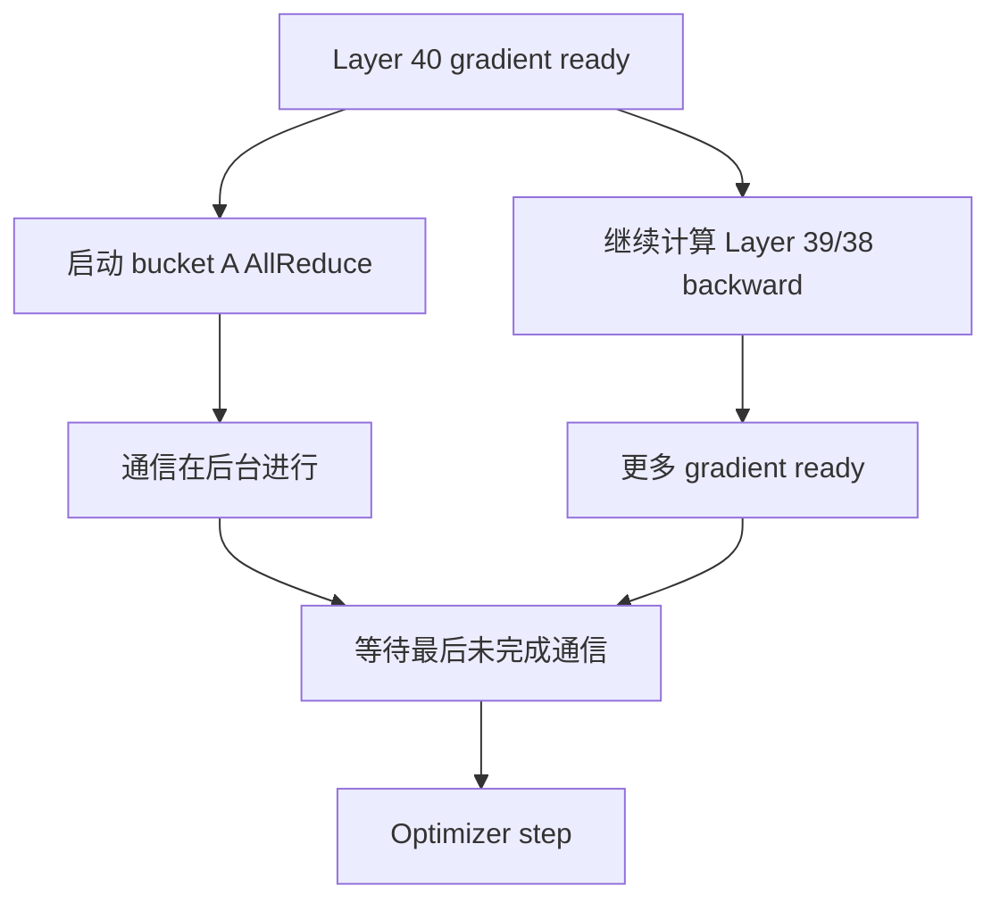
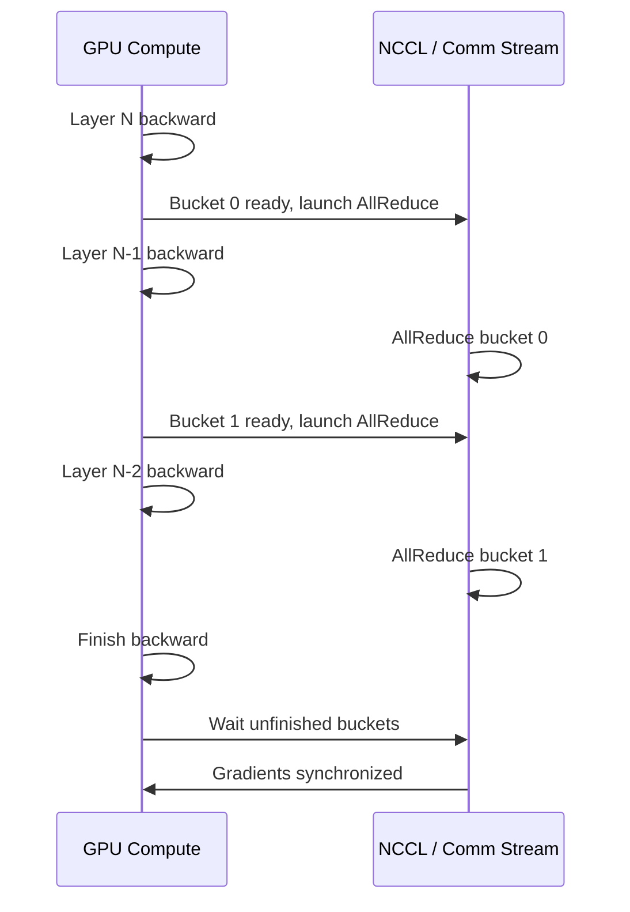

# 通信与计算重叠

分布式训练不只是“多张 GPU 一起算”。只要跨 GPU，就会有通信：AllReduce、ReduceScatter、AllGather、AllToAll、send/recv。通信如果完全暴露在关键路径上，GPU 就会边等网络边空转。

一句话理解：

> 通信与计算重叠的核心目标，是把原本要等待的通信放到仍有计算可做的时间段里，让通信时间尽量被计算时间遮住。

注意这里的关键词是“遮住”。通信并没有消失，通信量也不一定减少。优化目标是减少 exposed communication time，也就是真正挡住下一步计算的通信时间。

## 什么叫通信暴露在关键路径上

假设 backward 结束后才开始梯度 AllReduce：

```text
backward compute: [====================]
allreduce:                            [----------]
optimizer:                                       [====]
```

这时 AllReduce 完全暴露。GPU 做完 backward 后等通信，等完才能 optimizer step。

如果能在 backward 中后段就启动部分梯度通信：

```text
backward compute: [====================]
allreduce bucket A:       [------]
allreduce bucket B:             [------]
allreduce bucket C:                   [------]
optimizer:                                [====]
```

通信仍然发生了，但一部分被 backward compute 覆盖。真正暴露出来的只剩最后没被覆盖的尾巴。

这就是 overlap 的基本直觉。

## 为什么 backward 天然适合 overlap

Transformer backward 是从后往前执行的。

例如：

```text
Layer 40 backward
Layer 39 backward
Layer 38 backward
...
Layer 1 backward
```

当后面某些层的梯度已经算出来时，前面层的 backward 还在继续。这就给梯度通信提供了空间：



如果 bucket 划分合理，通信库和 GPU stream 调度得当，部分 AllReduce 可以在 backward compute 仍在运行时完成。

## Gradient bucket 是什么

如果每个参数一产生梯度就单独通信，会产生大量小通信，延迟开销很高。

因此 DDP 通常把多个参数梯度打包成 bucket：

```text
bucket 0: layer 40-35 gradients
bucket 1: layer 34-28 gradients
bucket 2: layer 27-20 gradients
...
```

当一个 bucket 里的所有梯度都 ready，就可以启动一次通信。

bucket 的作用：

- 减少小通信数量。
- 让通信粒度足够大，带宽利用率更好。
- 让早 ready 的 bucket 可以尽早通信。
- 为 backward overlap 创造机会。

bucket 太小，通信次数太多，latency 占比高。bucket 太大，要等很久才 ready，overlap 空间减少。bucket size 是重要调参项。

## DDP overlap 的简化流程

一个简化 DDP backward overlap：



关键点：

- bucket ready 的时机由 autograd 依赖决定。
- 通信启动不代表通信已经完成。
- optimizer step 前必须确保所有需要的梯度同步完成。
- profiler 里要看 wait 时间，而不是只看通信 API 调用时间。

## FSDP / ZeRO 的 overlap

FSDP/ZeRO 不只是同步完整梯度，还涉及：

- 参数 AllGather。
- 梯度 ReduceScatter。
- 参数 prefetch。
- reshard。
- optimizer state shard。

它们的 overlap 形态更复杂。

### Forward 参数预取

FSDP/ZeRO-3 中，某个模块 forward 前需要 all-gather 参数。系统可以尝试在当前模块计算时预取后续模块参数。

目标：

```text
compute current module
  overlap with all-gather next module parameters
```

如果预取太早，会增加 live parameters，显存上升。如果预取太晚，forward 等参数通信。

### Backward 梯度 ReduceScatter

Backward 中，当某些参数梯度 ready 后，可以 reduce-scatter，把规约后的梯度 shard 分发到对应 rank。

目标和 DDP 类似：让部分 gradient communication 藏在剩余 backward compute 后面。

### Reshard 和 release

FSDP 会在合适时机释放完整参数，回到 shard 状态。释放太早可能后续又要 all-gather，释放太晚则显存峰值高。

因此 FSDP overlap 不是单个开关，而是 prefetch、reshard、bucket、wrap 粒度和显存预算的组合。

## Tensor Parallel 的 overlap

Tensor Parallel 通信更频繁，因为它发生在层内部。

典型通信：

- Row Parallel 后的 AllReduce / ReduceScatter。
- Column Parallel 输出需要完整 tensor 时的 AllGather。
- Sequence Parallel 的 ReduceScatter / AllGather。

TP overlap 更难，因为很多通信在算子依赖路径上：

```text
GEMM partial result -> AllReduce -> residual/norm/next op
```

如果下一步必须等 AllReduce 结果，就很难通过普通 stream-level async 完全隐藏。

优化方向通常包括：

- 把 tensor 切成更细的 chunk。
- 先到的 chunk 先继续计算。
- 把通信和 GEMM 做更细粒度调度。
- 使用 fused communication-computation kernel。
- 调整 TP size，降低通信暴露。

后面的 FLUX 会专门讲 kernel-level overlap。

## Pipeline Parallel 的 overlap

Pipeline Parallel 里 stage 之间传 activation 和 activation gradient。

可能的 overlap：

- Stage 0 发送 micro-batch 0 activation 时，继续计算 micro-batch 1。
- Stage 1 接收 activation 时，准备前一个 micro-batch backward。
- 1F1B 调度让 forward/backward 与 send/recv 交错。

但 PP overlap 受 pipeline 调度约束。某个 stage 如果必须等前一个 stage 的 activation，通信就暴露；如果某个 stage 很慢，其他 stage 即使通信很快也会等它。

所以 PP 中要同时看：

- stage balance。
- send/recv time。
- pipeline bubble。
- micro-batch 数量。
- 跨节点 stage 边界。

## MoE 的 AllToAll overlap

MoE 的 token dispatch/combine 通常用 AllToAll。

MoE overlap 难点：

- token 分布动态。
- 每个 rank 发送量可能不同。
- AllToAll 前后有 permute/unpermute。
- expert GEMM 形状不一致。
- 最忙 expert 决定尾部时间。

可能的优化：

- token 分块，先到先算。
- dispatch 与本地 expert compute 重叠。
- combine 与后续计算重叠。
- 优化 expert placement 和 EP size。

但 MoE overlap 的效果必须用 trace 验证。AllToAll 看似异步，实际可能因为依赖、buffer、stream 或最慢 rank 阻塞。

## 为什么 async 不等于 overlap

很多通信 API 都可以异步启动。但异步启动只是前提，不是结果。

真正 overlap 至少需要：

1. 通信启动后，还有独立计算可做。
2. 计算不依赖通信结果。
3. 通信和计算能在硬件资源上并行推进。
4. 通信不会因为默认 stream、event、内存拷贝等被隐式同步。
5. 最后等待通信的时间比不 overlap 更短。

如果通信启动后马上 wait：

```text
allreduce(async)
wait()
next compute
```

这几乎没有 overlap。

如果通信和计算争用同一瓶颈资源，例如都被内存带宽限制，也可能看起来重叠但性能没提升。

## 常见失败原因

### Bucket 太大

bucket 太大时，必须等很多梯度都 ready 才能启动通信。结果通信启动太晚，无法覆盖。

### Bucket 太小

bucket 太小时，通信次数太多，latency 和 kernel launch 开销上升，网络带宽利用率差。

### backward 计算太短

如果剩余 backward compute 不够长，就没有足够时间隐藏通信。小模型、小 micro-batch、过强 TP 切分都可能让单段计算变短。

### 参数顺序和 backward 顺序不匹配

bucket 里的参数如果 ready 时间分散，一个早 ready 的梯度也要等同 bucket 里最后一个梯度。参数注册顺序、bucket rebuild 和动态图都会影响。

### 动态图或 unused parameters

动态图、条件分支、MoE 路由、activation checkpointing 可能让梯度 ready 顺序不稳定，DDP/FSDP 更难高效 overlap。

### 通信流被隐式同步

某些 tensor copy、stream wait、host sync、日志读取、`.item()`、debug 检查可能把异步通信变成同步等待。

### 网络已经饱和

多种并行叠加时，DP、TP、PP、EP 可能同时争用网络。即使每种都尝试 overlap，总网络带宽仍然可能成为瓶颈。

## 如何用 profiler 判断是否真的 overlap

不要只看配置项。要看 timeline。

一个好的 overlap trace 通常有这些特征：

- backward compute 期间穿插通信 kernel。
- 通信开始时间早于 backward 结束。
- backward 结束后的 wait tail 较短。
- GPU idle gap 变少。
- step time 下降。
- tokens/s 或 MFU 提升。

一个坏的 overlap trace 可能是：

```text
backward compute: [====================]
communication:                        [-------------]
wait:                                 [-------------]
```

通信虽然被异步调用了，但实际都堆在 backward 之后。

还要区分：

- communication duration：通信本身持续多久。
- exposed communication：真正导致等待多久。

优化目标是后者。

## Benchmark 时看什么

评估通信重叠至少看：

| 指标 | 作用 |
| --- | --- |
| Step time | 最终是否变快 |
| Exposed communication time | 通信真实暴露时间 |
| Total communication time | 通信总量是否变化 |
| GPU idle time | 是否减少等待 |
| Bucket ready time | bucket 是否太晚 ready |
| Wait time before optimizer | backward 后尾部等待 |
| Network bandwidth | 网络是否饱和 |
| MFU | 计算利用率是否提升 |
| Peak memory | overlap buffer 是否增加显存 |

实验要固定：

- batch 和 sequence。
- gradient accumulation。
- TP/PP/DP/FSDP/EP 配置。
- bucket size。
- precision。
- activation checkpointing。
- rank mapping。
- profiler 采样 step。

## 常见优化方向

### 调 bucket size

bucket size 决定通信粒度。需要在“尽早启动”和“通信足够大”之间平衡。默认值不一定适合所有模型。

### 静态图优化

如果模型图稳定，尽量让 DDP/FSDP 利用静态图信息，减少每步图搜索和 bucket 不稳定。动态控制流和 unused parameters 会增加复杂度。

### 调整 wrap / shard 粒度

FSDP wrap 太细会产生很多小 all-gather/reduce-scatter；太粗又可能显存高、overlap 空间少。wrap 粒度影响通信和计算交错。

### 拓扑感知 rank mapping

不要让高频通信域跨慢链路。TP 尽量节点内；DP/FSDP/EP 要结合网络拓扑安排。rank mapping 错误会让 overlap 效果被网络拖垮。

### 减少同步点

避免在训练 step 中频繁 `.item()`、同步日志、强制 memory stats、阻塞式 debug。很多看似无害的操作会让异步执行失去意义。

### 细粒度 overlap

对于 TP 和 MoE 这类通信在依赖路径上的场景，普通 bucket overlap 不够，可能需要 chunk-level、kernel-level 或 fused comm-compute 方法。

## 常见误区

### 误区一：打开 overlap_comm 就一定有效

不一定。配置项只能尝试重叠，是否有效取决于依赖、bucket、compute 长度、网络和 stream 调度。

### 误区二：通信时间下降才算 overlap 成功

通信总时间不一定下降。Overlap 成功的表现是 exposed communication time 下降，step time 下降。

### 误区三：所有通信都能隐藏

不能。依赖路径上的通信、最后一个 bucket、最慢 rank、pipeline 边界、AllToAll 尾部都可能暴露。

### 误区四：bucket 越小越好

太小会导致大量小通信，延迟占比上升。太大又启动太晚。需要实验。

### 误区五：单看一张 GPU 的 trace 就够

分布式训练要看多 rank。一个 rank 看起来忙，另一个 rank 可能在等。straggler 才决定整体 step。

## 设计检查表

做通信重叠优化时，可以逐项检查：

- 当前瓶颈是通信总量，还是通信暴露时间？
- backward 后是否有长 wait tail？
- bucket ready 时间是否足够早？
- bucket size 是否合适？
- 是否有动态图、unused parameters 或 checkpointing 影响 ready 顺序？
- FSDP all-gather / reduce-scatter 是否和计算重叠？
- TP 通信是否处在强依赖路径上？
- PP stage 是否因为 send/recv 或 stage imbalance 等待？
- MoE AllToAll 是否有 straggler 或 token 不均？
- 是否存在 `.item()`、日志、debug、memory stats 等同步点？
- 多 rank trace 是否一致？最慢 rank 是谁？

## 小结

通信与计算重叠的目标不是让通信消失，而是让通信尽量不挡住训练主路径。

关键判断包括：

- DDP 利用 gradient bucket 在 backward 中提前通信。
- FSDP/ZeRO 通过参数预取、梯度 reduce-scatter 和 reshard 调度创造 overlap。
- TP、PP、MoE 的通信更受依赖和拓扑限制。
- async collective 只是必要条件，不是 overlap 的证据。
- profiler timeline 上的 exposed communication time 才是核心指标。

真正有效的 overlap 优化，一定要通过 step time、GPU idle、wait tail、bucket ready 和多 rank trace 来验证。

## 参考资料

- [PyTorch: DistributedDataParallel](https://docs.pytorch.org/docs/2.12/generated/torch.nn.parallel.DistributedDataParallel.html)
- [DeepSpeed Configuration JSON: communication options](https://www.deepspeed.ai/docs/config-json/#communication-options)
- [Efficient Large-Scale Language Model Training on GPU Clusters Using Megatron-LM](https://arxiv.org/abs/2104.04473)
- [Oases: Efficient Large-Scale Model Training on Commodity Servers via Overlapped and Automated Tensor Model Parallelism](https://arxiv.org/abs/2305.16121)
