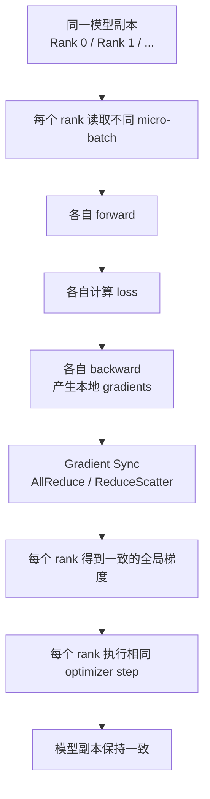

# Data Parallel 与梯度同步

Data Parallel 是最常见的大模型训练并行方式之一。它的核心思想很直观：每张 GPU 放一份相同模型，处理不同数据，然后把各自算出来的梯度同步起来，让所有模型副本保持一致。

一句话理解：

> Data Parallel 提高吞吐的方式是“多张 GPU 同时看不同数据”；梯度同步保证这些 GPU 虽然看了不同数据，但每次参数更新后仍然得到同一个模型。

Data Parallel 概念简单，但真正跑快并不简单。难点在于 backward 过程中要同步大量 gradient，而这些通信必须和计算、bucket、网络拓扑、batch 配置配合好。

## Data Parallel 解决什么问题

单张 GPU 每次只能处理有限数据。Data Parallel 把数据切到多张 GPU 上并行处理。

例如有 8 张 GPU，每张 GPU 处理 2 条样本：

```text
per-device batch = 2
data parallel size = 8
```

一次 micro-step 等价处理：

```text
2 * 8 = 16 samples
```

如果再做 gradient accumulation：

```text
global batch =
  per-device micro-batch
* data parallel size
* gradient accumulation steps
```

Data Parallel 主要提升的是数据吞吐。它不把模型层切开，也不天然降低每张 GPU 上的模型权重显存。

## Data Parallel 不解决什么问题

Data Parallel 很容易被误解成“加 GPU 就能训练更大模型”。这不完全对。

在普通 Data Parallel 中，每张 GPU 都有：

- 一份完整 parameters。
- 一份完整 gradients。
- 一份完整 optimizer states。
- 当前 micro-batch 的 activations。

所以普通 Data Parallel 不会降低单卡模型状态显存。它能让每张 GPU 处理更小的一部分数据，或者让 global batch 变大，但模型副本本身仍然完整存在。

如果模型状态单卡放不下，需要 ZeRO、FSDP、Tensor Parallel、Pipeline Parallel 等方法，而不是普通 Data Parallel。

## 基本流程

Data Parallel 的一个训练 step 可以画成这样：



关键点有两个。

第一，每个 rank 的输入数据不同。

第二，每个 rank 在 optimizer step 前必须得到一致的梯度，否则模型副本会逐渐分叉。

## Rank、World Size 和 Process Group

分布式训练里常见几个词：

| 概念 | 含义 |
| --- | --- |
| rank | 一个分布式进程的编号 |
| local rank | 单节点内部的 GPU / 进程编号 |
| world size | 当前通信组里的总 rank 数 |
| process group | 一组需要互相通信的 rank |
| data parallel group | 用于数据并行梯度同步的一组 rank |

如果有 4 台机器，每台 8 张 GPU，通常会启动 32 个训练进程：

```text
world size = 4 * 8 = 32
```

在纯 Data Parallel 中，这 32 个 rank 都属于同一个 data parallel group。

在更复杂的 3D 并行里，一个 rank 可能同时属于：

- data parallel group。
- tensor parallel group。
- pipeline parallel group。
- expert parallel group。

这篇先只看 Data Parallel。

## 为什么梯度要同步

假设有两张 GPU：

- GPU 0 看到样本 A。
- GPU 1 看到样本 B。

它们 forward/backward 后会得到不同的本地梯度：

```text
grad_0 = gradient(loss_A)
grad_1 = gradient(loss_B)
```

如果不同步，GPU 0 会按 `grad_0` 更新模型，GPU 1 会按 `grad_1` 更新模型。下一步开始时，两张 GPU 的模型参数就不一样了。

Data Parallel 希望等价于“把样本 A 和样本 B 合成一个大 batch 训练”。所以要先求平均梯度：

```text
global_grad = (grad_0 + grad_1) / 2
```

然后所有 GPU 都用同一个 `global_grad` 更新参数。

多张 GPU 时也是同理：

```text
global_grad =
  sum(local_grad_i for i in data_parallel_ranks)
/ data_parallel_size
```

梯度同步的目的就是让每个 rank 拿到同一个 global gradient。

## AllReduce：最常见的梯度同步

AllReduce 是普通 DDP 最常见的梯度同步方式。

它做两件事：

1. 对所有 rank 的输入 tensor 做规约，例如求和。
2. 把规约后的结果发回每个 rank。

简单例子：

```text
Rank 0 gradient: [1, 2]
Rank 1 gradient: [3, 4]

AllReduce SUM 后：
Rank 0 receives [4, 6]
Rank 1 receives [4, 6]
```

如果要平均梯度，再除以 world size：

```text
[4, 6] / 2 = [2, 3]
```

AllReduce 的结果是：每个 rank 都拿到完整同步后的 gradient。

这很适合普通 Data Parallel，因为每个 rank 都有完整模型副本，也需要完整梯度来执行 optimizer step。

## ReduceScatter 和 AllGather

除了 AllReduce，还有两个重要 collective：

- ReduceScatter。
- AllGather。

ReduceScatter 可以理解为：先做 reduce，再把结果切片分给不同 rank。

AllGather 可以理解为：每个 rank 拿出一片数据，最后每个 rank 都收集到所有片段。

一个重要关系是：

```text
AllReduce ≈ ReduceScatter + AllGather
```

普通 DDP 通常使用 AllReduce。ZeRO、FSDP 等 sharding 方法更常使用 ReduceScatter 和 AllGather，因为它们不希望每个 rank 永远保存完整梯度或完整参数。

这也是 Data Parallel 和 ZeRO/FSDP 的分界：

- DDP：每个 rank 保留完整模型状态，用 AllReduce 同步完整梯度。
- ZeRO/FSDP：把部分状态切片，使用 ReduceScatter / AllGather 在需要时分发和回收。

后续讲 ZeRO 与 FSDP 时会展开。

## DDP 的基本机制

以 PyTorch DistributedDataParallel 为例，一个 DDP iteration 的内部机制大致是：

1. 初始化时，每个 rank 构建相同模型。
2. DDP 从 rank 0 broadcast 参数和 buffer，确保初始副本一致。
3. DDP 创建 Reducer，把参数梯度组织成 buckets。
4. DDP 给每个参数的 gradient accumulator 注册 autograd hook。
5. forward 在每个 rank 本地执行。
6. backward 开始后，某个参数的梯度一旦 ready，对应 hook 被触发。
7. 当某个 bucket 里的梯度都 ready 后，启动异步 AllReduce。
8. backward 继续计算前面层的梯度。
9. 所有 bucket 同步完成后，平均梯度写回 `.grad`。
10. 每个 rank 执行相同 optimizer step。

这个机制的重点是：DDP 不等整个 backward 全部结束再通信，而是尽量在 backward 过程中启动通信。

## Gradient Bucket 是什么

模型可能有很多参数。如果每个参数一算出梯度就单独 AllReduce，会产生大量小通信，开销很高。

DDP 会把多个参数的梯度合并成 bucket：

```text
bucket 0: layer 10, layer 9 gradients
bucket 1: layer 8, layer 7 gradients
bucket 2: layer 6, layer 5 gradients
...
```

一个 bucket 里的梯度都 ready 后，就可以对这个 bucket 启动 AllReduce。

Bucket 的好处：

- 减少 collective 调用次数。
- 让通信粒度更适合网络带宽。
- 提供 backward compute 和 communication overlap 的机会。

Bucket 太小，通信次数多，latency 开销大。

Bucket 太大，等待 bucket ready 的时间长，overlap 机会变少。

所以 bucket size 是延迟和带宽之间的折中。

## Backward Overlap：为什么能边算边通信

Transformer backward 是从后往前算的。靠后的层先产生梯度，靠前的层后产生梯度。

如果某些靠后层的梯度已经 ready，系统可以先同步它们，同时继续计算靠前层的 backward。

时间线可以理解为：

```text
time ───────────────────────────────>

Backward layer 24  [compute]
AllReduce bucket A        [comm........]
Backward layer 23          [compute]
Backward layer 22                   [compute]
AllReduce bucket B                 [comm........]
Backward layer 21                            [compute]
```

如果通信完全被后续 backward 计算盖住，暴露出来的通信时间就少。

如果通信太慢，或者 bucket ready 太晚，backward 结束后还要等待通信完成。这部分等待就是 exposed communication time。

Data Parallel 优化的核心之一，就是尽量减少 exposed communication time。

## 为什么 overlap 会失败

理论上可以边算边通信，但实际经常失败。

常见原因包括：

- bucket 太大，直到 backward 快结束才 ready。
- bucket 太小，通信调用太多，latency 开销高。
- 参数顺序和 backward ready 顺序不匹配。
- 模型存在动态控制流，梯度 ready 顺序不稳定。
- `find_unused_parameters=True` 带来额外 autograd graph traversal。
- 计算太快，通信没有足够时间被隐藏。
- 网络带宽不足，跨节点通信暴露出来。
- 编译器把 backward 融成大图，导致 DDP hook 触发变晚。
- gradient accumulation 中间 micro-step 同步策略错误。

所以看到 DDP 通信慢，不能只说“网络不行”。要看 bucket、ready time、计算通信重叠和拓扑。

## Gradient Accumulation 下的同步时机

如果使用 gradient accumulation，通常不希望每个 micro-batch 都同步梯度。

例如：

```text
gradient_accumulation_steps = 4
```

更合理的同步方式是：

```text
micro-step 1: backward, no sync
micro-step 2: backward, no sync
micro-step 3: backward, no sync
micro-step 4: backward, sync
optimizer step
```

这样可以减少 3 次不必要通信。

在 PyTorch DDP 里，常用 `no_sync()` 包住中间 micro-step：

```python
for i, batch in enumerate(batches):
    if i < accumulation_steps - 1:
        with ddp_model.no_sync():
            loss = ddp_model(batch)
            loss.backward()
    else:
        loss = ddp_model(batch)
        loss.backward()
        optimizer.step()
        optimizer.zero_grad()
```

注意，forward 也要在 `no_sync()` 上下文里。否则可能仍然触发同步逻辑。

框架通常会封装这件事，但系统工程师要知道同步到底发生在第几个 micro-step。

## 梯度平均和 Loss 归一化

梯度同步通常做平均或等效平均。你还要确认 loss 的归一化方式。

常见目标是：分布式训练结果接近单机大 batch 训练。

如果每个 rank 的 loss 都是本地 micro-batch 平均，再做梯度平均，那么在每个 rank 有相同样本数、相同有效 token 数时，结果通常合理。

但 LLM 训练常有变长序列和 loss mask。如果不同 rank 的有效 token 数差异很大，只按 rank 平均可能让短 batch 权重过高。

更稳妥的方式是按全局有效 token 数归一化：

```text
global_loss =
  sum(loss over valid tokens across all ranks)
/ sum(valid tokens across all ranks)
```

这意味着有时不仅要同步梯度，还要同步有效 token 计数。

## 数据切分也必须正确

Data Parallel 要求不同 rank 看到不同数据。梯度同步只解决模型副本一致，不解决数据切分正确性。

常见错误包括：

- 所有 rank 用同一个随机种子和同一个 sampler，读到相同 batch。
- 没有使用 DistributedSampler 或等价切分逻辑。
- 每个 epoch 没有调用 `set_epoch`，shuffle 不符合预期。
- IterableDataset 没有按 rank 切分。
- 数据量不能整除 world size，最后几个 batch 不一致。
- resume 后不同 rank 的数据位置不一致。

这些错误不一定会报错，但会降低有效数据吞吐，甚至改变训练结果。

Data Parallel 的正确性有两条线：

- 梯度同步保证模型副本一致。
- 数据 sharding 保证每个 rank 处理不同且合理的数据。

两条线都要正确。

## 多机 Data Parallel 为什么更难

单机 8 卡通常有 NVLink、NVSwitch 或 PCIe。多机训练还要经过节点间网络，例如 InfiniBand、RoCE 或以太网。

多机 Data Parallel 的主要挑战：

- 跨节点带宽低于节点内互联。
- 跨节点延迟更高。
- 网络拥塞和拓扑不均会带来抖动。
- rank 到 GPU / NIC 的映射会影响通信路径。
- 某个慢节点会拖住所有 rank。
- 数据读取如果也走网络，会和梯度同步抢带宽。

因此，多机 Data Parallel 的扩展效率往往不如单机扩展。

如果模型计算量很大，通信容易被 backward 盖住。

如果模型计算量较小，或者 batch 太小，通信占比会上升，扩展效率下降。

## 通信量怎么粗略估算

普通 DDP 每个 optimizer step 需要同步所有参与训练参数的梯度。

如果模型有 `N` 个参数，gradient dtype 是 BF16：

```text
gradient size ≈ N * 2 bytes
```

例如 7B 参数模型：

```text
7B * 2 bytes = 14GB gradients
```

每次 optimizer step 都要同步约 14GB 梯度数据。实际网络传输量取决于 AllReduce 算法、world size、拓扑和分层通信策略，不等于简单的 14GB，但这个数字能帮助建立量级直觉。

通信压力和下面因素有关：

- 模型参数量。
- gradient dtype。
- optimizer step 频率。
- data parallel size。
- bucket size。
- 网络带宽和延迟。
- overlap 程度。

增大 gradient accumulation steps 会降低 optimizer step 频率，但每次 optimizer step 仍然要同步完整梯度。

## Strong Scaling 和 Weak Scaling

分析 Data Parallel 扩展时，要区分 strong scaling 和 weak scaling。

Strong scaling：

```text
global batch 固定，增加 GPU 数
```

这时每张 GPU 的 per-device batch 或 accumulation 往往要下降。目标是同样训练量更快完成。

Weak scaling：

```text
per-device batch 固定，增加 GPU 数，global batch 增大
```

这时系统吞吐更容易提高，但训练动态也变了。

如果 benchmark 不说明是哪种 scaling，很容易误读结果。

例如 8 卡到 64 卡，如果 per-device batch 不变，global batch 增大 8 倍。吞吐提升不完全等价于“同一个训练任务快了 8 倍”，因为每次参数更新看到的数据也变多了。

## Data Parallel 与显存

普通 Data Parallel 的显存特点：

- 每个 rank 有完整 parameters。
- 每个 rank 有完整 gradients。
- 每个 rank 有完整 optimizer states。
- 每个 rank 的 activation 只对应本地 micro-batch。
- 通信 bucket 会带来额外显存。

所以 Data Parallel 对显存的主要帮助是：你可以让每张 GPU 只处理较小 micro-batch，同时 global batch 仍然较大。

它不解决 optimizer state 复制问题，也不解决单卡放不下模型权重的问题。

如果显存瓶颈来自完整模型状态，应该看 ZeRO/FSDP。

如果显存瓶颈来自 activation，可以调整 micro-batch、sequence length 或 activation checkpointing。

## Buffer 和 BatchNorm

模型里除了 parameters，还有 buffers。例如 BatchNorm 的 running mean / running variance。

DDP 通常会在 forward 前同步 buffer，确保不同 rank 的 buffer 状态一致。

大语言模型里 BatchNorm 不常见，但其他模型、视觉模型、多模态模型中仍然可能遇到。

需要注意：

- parameters 通过 gradient sync 保持一致。
- buffers 通常不是通过 gradient 更新，而是通过 broadcast 或其他同步方式保持一致。
- 如果关闭 buffer broadcast，要确保这些 buffer 的语义不会让 rank 分叉。

这类问题不一定影响 LLM 主干，但在多模态或视觉训练中值得关注。

## DDP 参数和常见影响

一些 DDP 参数会影响性能和正确性。

| 参数 | 作用 | 风险 |
| --- | --- | --- |
| `bucket_cap_mb` | 控制 gradient bucket 大小 | 太小调用多，太大 overlap 差 |
| `find_unused_parameters` | 处理部分参数未参与 loss 的情况 | 不必要开启会增加开销 |
| `gradient_as_bucket_view` | 让 gradient 成为 bucket view，减少拷贝和峰值显存 | 对 `.grad.detach_()` 等操作有限制 |
| `static_graph` | 告诉 DDP 训练图稳定 | 动态图误用可能出错 |
| `broadcast_buffers` | forward 前同步 buffers | 某些模型需要，某些模型可关闭 |
| `no_sync()` | accumulation 中跳过中间同步 | 使用不当会造成同步频率错误 |

调这些参数时，要先理解模型图是否固定、是否有 unused parameters、是否做 gradient accumulation，以及 profiler 里通信是否暴露。

## 通信 Hook 和压缩

DDP 支持 communication hook，用于自定义 gradient bucket 的通信逻辑。

典型用途包括：

- gradient compression。
- gossip / decentralized training。
- error feedback。
- 延迟同步。
- 自定义 allreduce 或 reduce-scatter 流程。

这些方法可以降低通信成本，但通常会引入新的风险：

- 收敛行为改变。
- 数值误差增加。
- debug 难度提高。
- 和 mixed precision、optimizer、sharding 组合复杂。

对入门训练系统来说，先把标准 DDP 跑稳，再考虑 communication hook。

## Data Parallel 的性能指标

评估 Data Parallel 不能只看 GPU utilization。

至少要记录：

| 指标 | 说明 |
| --- | --- |
| per-device batch | 每张 GPU 处理多少数据 |
| global batch / global tokens | 每次 optimizer step 的总训练量 |
| step time | 一个 optimizer step 的耗时 |
| micro-step time | 单个 forward/backward 的耗时 |
| compute time | 主要 GPU 计算耗时 |
| communication time | AllReduce / ReduceScatter 等通信耗时 |
| exposed communication time | 没有被 backward 盖住的通信等待 |
| overlap ratio | 通信被计算覆盖的程度 |
| scaling efficiency | 扩 GPU 后效率保持程度 |
| network bandwidth | 节点内和节点间通信利用率 |
| straggler gap | 最快 rank 和最慢 rank 的差距 |

如果只看平均 step time，可能掩盖某个 rank 的数据读取慢、网络慢或通信等待。

## 如何看 Timeline

一个好的 DDP timeline 通常应该看到：

- backward 过程中陆续出现 AllReduce。
- AllReduce 和 backward compute 有重叠。
- backward 结束后剩余通信等待不长。
- 不同 rank 的 bucket 顺序一致。
- 没有大段 GPU idle。
- 数据加载没有拖住 micro-step。

一个不好的 timeline 可能是：

```text
forward -> backward compute -> backward compute -> backward compute -> allreduce 等很久
```

这说明通信没有和 backward 有效重叠。

另一个不好的 timeline：

```text
rank 0 backward 完成
rank 1 backward 完成
rank 2 等数据 / 慢算子
所有 rank 等 rank 2 进入 collective
```

这说明有 straggler，通信本身可能不是根因。

## 常见优化方向

### 1. 确认数据并行配置正确

先确认：

- 每个 rank 使用不同 GPU。
- 每个 rank 读不同数据。
- world size、rank、local rank 正确。
- 初始权重一致。
- global batch 公式正确。

配置错误时，谈性能优化没有意义。

### 2. 调整 bucket size

如果通信暴露明显，可以尝试调整 bucket size。

思路：

- bucket 太大：ready 太晚，overlap 差。
- bucket 太小：collective 调用太多，latency 高。
- 合适 bucket：能较早启动通信，同时单次通信足够大。

需要用 profiler 看，而不是盲调。

### 3. 保持梯度同步和 accumulation 对齐

如果做 gradient accumulation，要避免中间 micro-step 的不必要同步。

检查：

- `no_sync()` 是否正确包住 forward 和 backward。
- optimizer step 是否只在完整 accumulation 后执行。
- loss scaling 和 gradient clipping 是否在正确时机。

### 4. 降低跨节点通信暴露

多机训练中可以考虑：

- 增大 per-device compute，让通信更容易被盖住。
- 合理设置 bucket。
- 检查 rank 到 GPU/NIC 的映射。
- 使用高性能 NCCL backend。
- 避免数据读取和梯度同步争抢同一网络。
- 监控 IB/RoCE counters、重传和拥塞。

跨节点通信不是只看理论带宽，还要看拓扑、拥塞和 rank placement。

### 5. 减少不必要的图遍历和动态性

如果模型图稳定，尽量避免不必要的 `find_unused_parameters=True`。

如果模型有动态分支，DDP 可能需要更多图分析，也可能让 bucket ready 顺序更差。

训练系统越稳定，DDP 越容易高效重叠通信。

### 6. 必要时进入 sharded data parallel

如果普通 DDP 的显存被完整 gradients 和 optimizer states 压住，继续调 AllReduce 没有根本帮助。

这时应考虑：

- ZeRO-1：切 optimizer states。
- ZeRO-2：切 optimizer states 和 gradients。
- ZeRO-3 / FSDP：切 parameters、gradients、optimizer states。

这已经从普通 Data Parallel 进入 sharded data parallel 范畴。

## 常见误区

### 1. Data Parallel 会降低单卡模型显存

普通 Data Parallel 不会。每张 GPU 仍然有完整模型副本、梯度和 optimizer state。

### 2. GPU 越多训练一定越快

不一定。GPU 增加后，通信开销和同步等待也增加。模型计算量不够大时，扩展效率会下降。

### 3. AllReduce 时间就是全部通信成本

不完全。还要看通信是否被 backward 盖住。真正影响 step time 的是 exposed communication time。

### 4. 每个 rank loss 差不多就说明数据切分正确

不一定。不同 rank 可能读到了重复数据，也可能 loss 恰好相近。要检查 sampler、sharding 和数据位置。

### 5. Gradient accumulation 只是变大 batch，不影响通信

不对。同步时机如果配置正确，中间 micro-step 可以不通信；如果配置错误，每个 micro-step 都同步，通信成本会高很多。

### 6. `find_unused_parameters=True` 总是更安全

它能处理 unused parameters，但会带来额外开销。不需要时不应默认打开。

### 7. 多机慢一定是 NCCL 问题

不一定。可能是数据读取、rank placement、straggler、bucket ready 顺序、网络拥塞或模型计算太少。

## 排查清单

遇到 Data Parallel 性能或正确性问题，可以按下面顺序排查：

1. 确认 world size、rank、local rank、device mapping 正确。
2. 确认每个 rank 初始参数一致。
3. 确认每个 rank 读取不同数据。
4. 确认 global batch / global tokens 公式正确。
5. 记录每个 rank 的 step time，而不是只看平均。
6. 用 profiler 看 backward 和 AllReduce 是否重叠。
7. 检查 backward 结束后是否仍有长时间通信等待。
8. 检查 bucket size 和 bucket ready 顺序。
9. 检查 gradient accumulation 是否跳过中间同步。
10. 检查 `find_unused_parameters`、`static_graph`、`broadcast_buffers` 等配置。
11. 多机时检查 rank 到 GPU/NIC 的映射和网络 counters。
12. 如果显存瓶颈来自完整模型状态，转向 ZeRO/FSDP，而不是继续调 DDP。

## 小结

Data Parallel 的核心是三件事：

- 数据切分：每个 rank 处理不同数据。
- 梯度同步：每个 rank 在 optimizer step 前得到一致梯度。
- 副本一致：所有 rank 从相同参数出发，用相同同步梯度更新参数。

普通 DDP 的性能关键在于：

- gradient bucket 是否合适。
- AllReduce 是否能和 backward compute 重叠。
- gradient accumulation 是否避免了不必要同步。
- 多机网络和 rank placement 是否拖慢 collective。
- 数据侧是否产生 straggler。

理解 Data Parallel 后，再看 ZeRO/FSDP 会更清楚：它们不是否定 Data Parallel，而是在 Data Parallel 的基础上，把 parameters、gradients、optimizer states 进一步切片，解决普通 DDP 的显存复制问题。

## 参考资料

- [PyTorch DistributedDataParallel](https://docs.pytorch.org/docs/2.12/generated/torch.nn.parallel.DistributedDataParallel.html)
- [PyTorch Distributed Data Parallel Design Note](https://docs.pytorch.org/docs/2.12/notes/ddp.html)
- [PyTorch Distributed Communication Package](https://docs.pytorch.org/docs/2.12/distributed.html)
- [NVIDIA NCCL Collective Operations](https://docs.nvidia.com/deeplearning/nccl/user-guide/docs/usage/collectives.html)
