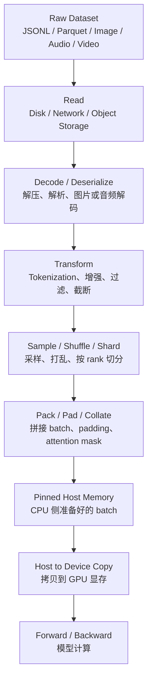
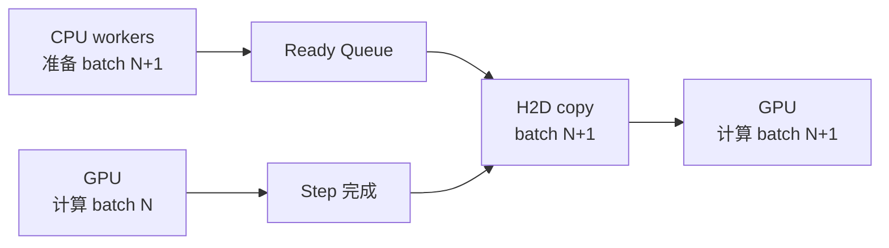

# 数据输入与 Data Pipeline

数据输入与 Data Pipeline 解决的是一个很朴素的问题：GPU 做训练前，训练样本要先被准备好。

一句话理解：

> Data Pipeline 的目标不是“把数据读出来”这么简单，而是让每一次训练 step 开始时，GPU 都已经拿到形状正确、内容有效、能直接计算的 batch。

训练系统里，很多性能问题看起来像 GPU 不够快，实际上是 GPU 没有持续吃到数据。模型 forward/backward 可能很快，但如果每个 step 前都要等数据读取、解压、tokenization、batch 拼接或 host-to-device copy，GPU 就会空转。

## 为什么数据输入会影响训练速度

一次训练 step 可以简单理解为：

1. 准备一批数据。
2. 把数据拷贝到 GPU。
3. 模型做 forward。
4. 计算 loss。
5. 做 backward。
6. 同步梯度。
7. optimizer 更新参数。

如果第 1 步和第 2 步太慢，后面的 GPU 计算就启动不了。

所以 Data Pipeline 的核心指标不是“数据集能不能加载”，而是：

- 每个 step 前 GPU 有没有等数据。
- 数据准备能不能和 GPU 计算重叠。
- batch 里有多少是真正有效的训练 token 或样本。
- 多 GPU / 多节点时，每个 rank 是否能稳定拿到不同且足量的数据。

对训练系统来说，数据慢就是训练慢。

## 一批数据从哪里来

一个 batch 进入模型前，通常经历下面这条链路：



这张图里，真正的模型计算只在最后。前面每一步都可能成为瓶颈。

如果你只看训练代码，可能只看到一行：

```python
for batch in dataloader:
    loss = model(batch)
```

但系统实际做了很多事：读文件、解析格式、把文本变成 token id、把不同长度样本拼成同样形状、把 CPU 内存里的 tensor 拷贝到 GPU。Data Pipeline 优化就是让这些事情又快又稳。

## Data Pipeline 的基本目标

一个好的 Data Pipeline 通常满足四点。

第一，供给要稳定。GPU 计算完一个 step 后，下一批数据已经准备好，不能每一步都现等。

第二，数据要有效。batch 里 padding 不能太多，重复样本不能太多，过滤逻辑不能让大部分样本白读。

第三，多 GPU 要正确。每个 rank 应该拿到自己的数据切片，不能所有 GPU 都训练同一批样本，也不能因为切分不均导致某些 rank 等其他 rank。

第四，训练可恢复。长期训练发生中断后，恢复时要知道数据读到了哪里、shuffle 状态是什么、随机种子是什么，否则复现实验会很困难。

## 读取：先把样本从存储里拿出来

数据读取是 pipeline 的第一步。数据可能来自：

- 本地 NVMe。
- 网络文件系统。
- 对象存储。
- 数据库或消息队列。
- 远程数据集服务。

读取慢的常见原因包括：

- 小文件太多，每个文件打开和关闭都有额外开销。
- 数据压缩很重，读取后还要大量 CPU 解压。
- 数据在网络存储上，带宽和延迟都不稳定。
- 多个训练节点同时读同一份数据，存储后端被打满。
- 每个 worker 随机读，破坏了顺序读带宽。

所以大规模训练常会把数据预处理成更适合顺序读取的大 shard。例如很多文本训练会使用 JSONL、Parquet、Arrow 或自定义二进制格式；图像和多模态训练也常把大量小样本打包成较大的 shard。

这里的原则是：训练时不要让文件系统为每个小样本付出一次随机访问成本。

## Decode 和 Deserialize：读到字节不等于能训练

从磁盘读出来的通常只是字节。模型不能直接吃这些字节，它需要 tensor。

不同数据类型的解析成本不同：

| 数据类型 | 常见处理 | 可能的瓶颈 |
| --- | --- | --- |
| 文本 | 解压、JSON 解析、字段选择、tokenization | CPU 解析和 tokenizer |
| 图像 | 读取、JPEG/PNG 解码、resize、crop、normalize | 图片解码和增强 |
| 音频 | 解码、重采样、切片、特征提取 | 解码和频谱特征计算 |
| 视频 | 解码多帧、采样、resize、时序拼接 | 解码成本和 I/O 带宽 |
| 多模态 | 多种模态对齐、缺失字段处理 | 对齐逻辑和样本过滤 |

很多新手会低估 decode 的成本。例如图像训练里，GPU 可能很强，但 CPU JPEG 解码跟不上；语言模型训练里，Transformer 计算很重，但如果每一步都在线 tokenization，CPU 也可能拖慢训练。

## Tokenization：文本训练最常见的数据侧瓶颈

语言模型训练里，文本必须先变成 token id。

原始文本：

```text
AI systems need data pipelines.
```

经过 tokenizer 后，可能变成：

```text
[1234, 567, 89, 3456, 7890]
```

模型真正读取的是 token id，不是字符串。

Tokenization 可能出现在两个位置。

第一种是离线 tokenization。提前把训练语料转成 token id，训练时直接读取 token 序列。

第二种是在线 tokenization。训练时读取原始文本，再在 DataLoader worker 里实时 tokenize。

两种方式的取舍是：

| 方式 | 优点 | 代价 |
| --- | --- | --- |
| 离线 tokenization | 训练时更快，step time 更稳定 | 预处理时间和存储成本更高，tokenizer 变更要重做 |
| 在线 tokenization | 数据更灵活，便于调试和动态处理 | CPU 容易成为瓶颈，step time 波动更大 |

大规模预训练通常更偏向离线 tokenization。小规模实验、数据探索、指令微调或复杂动态拼接场景，在线 tokenization 更常见。

判断标准不是哪种方式更高级，而是训练时 CPU 能不能稳定供给 GPU。

## Transform：预处理、增强和过滤

Transform 是对样本做加工。

文本任务里可能包括：

- 清洗异常字符。
- 截断过长文本。
- 拼接 prompt 和 answer。
- 构造 label 和 loss mask。
- 做 sequence packing。

图像任务里可能包括：

- decode。
- resize。
- random crop。
- color jitter。
- normalize。

多模态任务里可能包括：

- 图文对齐。
- 采样视频帧。
- 音频切片。
- 构造跨模态 attention mask。

Transform 的风险在于它可能很重，而且不一定容易被 profiler 直观看到。模型算子在 GPU 上有清晰 timeline，但 Python 里的数据处理常常分散在 worker 进程中。

优化 transform 的常见方向包括：

- 把固定处理提前到离线阶段。
- 减少 Python 层逐样本逻辑。
- 使用向量化或批量处理。
- 对图像、视频等任务使用更高效的 decode 和增强库。
- 避免在训练热路径里做复杂字符串处理。

## Shuffle、Sampling 和 Sharding

训练不是简单按文件顺序读取所有样本。通常需要打乱、采样和切分。

Shuffle 的作用是让每个 batch 的数据分布更随机，避免模型连续看到高度相似的数据。

Sampling 决定从哪些数据源取样。例如多数据集混合训练时，可能希望代码数据占 20%，数学数据占 30%，普通网页文本占 50%。

Sharding 决定多 GPU / 多节点时每个 rank 读哪一部分数据。假设有 8 张 GPU，不能让 8 张 GPU 都读同一个 batch，否则等价于重复训练，浪费 7/8 的算力。

分布式训练里的数据切分要满足：

- 不同 rank 尽量读不同样本。
- 每个 rank 的 batch 数量尽量相同。
- 每个 epoch 或训练阶段的 shuffle 可复现。
- 恢复训练时能恢复到合理的数据位置。

如果 sharding 做错，训练可能不会报错，但效率和数据有效性会出问题。

## Collate：把样本拼成 batch

模型通常按 batch 计算，而原始样本往往长度不同。

例如有 4 条文本，长度分别是：

```text
120 tokens
300 tokens
512 tokens
80 tokens
```

如果模型要求 batch 里所有序列长度一样，就要 padding 到同样长度。最简单做法是都补到 512：

```text
512 tokens
512 tokens
512 tokens
512 tokens
```

这样 batch 总长度是 2048 tokens，但真实有效 token 只有：

```text
120 + 300 + 512 + 80 = 1012 tokens
```

有效 token 比例只有：

```text
1012 / 2048 = 49.4%
```

这意味着接近一半计算浪费在 padding 上。

Collate 阶段常见工作包括：

- 把多个样本堆成 tensor。
- padding 到同一长度。
- 生成 attention mask。
- 生成 label。
- 生成 loss mask。
- 按长度做 bucketing。
- 做 sequence packing。

在语言模型训练里，应该尽量关注有效 token，而不是只看 batch size。

## Packing：减少 padding 浪费

Packing 的目标是把多个短样本拼到同一个固定长度序列里，减少 padding。

例如训练长度是 1024 tokens，有三个样本：

```text
样本 A: 200 tokens
样本 B: 300 tokens
样本 C: 400 tokens
```

如果分别 padding，会用掉：

```text
1024 * 3 = 3072 token slots
```

如果 packed 到同一条序列里，可能只用：

```text
200 + 300 + 400 = 900 token slots
```

再补少量 padding 到 1024。

Packing 的收益很直接：同样的 GPU 计算，处理更多有效 token。

但 packing 也带来复杂性：

- 不同样本之间不能互相泄漏 attention。
- loss mask 要正确，只在需要训练的位置计算 loss。
- 样本边界要保留，便于调试和统计。
- packing 算法本身不能太慢。

所以 packing 是典型的系统取舍：提高有效 token 比例，但增加数据处理复杂度。

## Host-to-Device Copy：CPU 到 GPU 的最后一段路

即使 batch 已经在 CPU 内存里准备好，GPU 仍然不能直接计算。数据还要从 host memory 拷贝到 device memory，也就是 GPU 显存。

这一步常被写成：

```python
batch = batch.to(device)
```

或者：

```python
batch = batch.cuda(non_blocking=True)
```

但这行代码背后涉及 PCIe、NVLink、内存页锁定和 CUDA stream。

常见优化包括：

- 使用 pinned memory，减少 H2D copy 开销。
- 使用 non-blocking copy，让拷贝有机会和计算重叠。
- 提前预取下一批 batch。
- 避免把大量无用字段拷贝到 GPU。
- 尽量让 tensor 布局和 dtype 在 CPU 侧就准备好。

Pinned memory 不是魔法。它能帮助 CPU 到 GPU 拷贝更快、更容易异步，但也会占用不可分页内存。过度使用会给系统内存带来压力。

## DataLoader worker 在做什么

以 PyTorch 为例，DataLoader 通常负责把 Dataset、Sampler、Collate 和多进程 worker 组织起来。它提供的是一个 iterable，每次迭代返回一个 batch。

几个常见参数的含义可以这样理解：

| 参数 | 直觉含义 | 主要影响 |
| --- | --- | --- |
| `num_workers` | 有多少个子进程并行准备数据 | CPU 并行度、内存占用、进程开销 |
| `prefetch_factor` | 每个 worker 提前准备多少个 batch | 队列深度、内存占用、等待概率 |
| `persistent_workers` | epoch 之间是否保留 worker | 减少 worker 重启开销 |
| `pin_memory` | 是否把 batch 放入 pinned host memory | H2D copy 性能 |
| `collate_fn` | 如何把样本拼成 batch | padding、packing、mask、数据格式 |
| `sampler` | 按什么顺序取样本 | shuffle、分布式切分、采样权重 |

调这些参数时，不能只看单个参数。`num_workers` 增加后，CPU 可能更忙，内存占用更高，存储压力也会更大。超过某个点后，worker 更多不一定更快。

一个合理目标是：DataLoader 队列大部分时间不空，GPU step 之间没有明显等待。

## 数据 pipeline 和训练 step 如何重叠

理想情况下，数据准备和 GPU 计算应该像流水线一样重叠。

当 GPU 正在计算第 N 个 batch 时，CPU worker 已经在准备第 N+1 个 batch：



如果 Ready Queue 经常为空，GPU 就会等数据。

如果 Ready Queue 总是堆满，但 GPU 仍然慢，瓶颈可能不在数据侧，而在模型计算、通信或显存。

这就是为什么优化 Data Pipeline 要看时间线，而不是凭感觉调 `num_workers`。

## 如何判断瓶颈在数据侧

数据瓶颈通常有一些明显信号。

| 现象 | 可能原因 |
| --- | --- |
| GPU utilization 周期性掉到很低 | step 之间在等数据 |
| 第一个 batch 很慢，后面正常 | 缓存、worker 启动、首次编译或首次读取 |
| 每个 epoch 开头都卡 | worker 重启、shuffle、重新打开文件 |
| CPU 很忙，GPU 不忙 | tokenization、decode、transform 过重 |
| 磁盘或网络带宽打满 | 数据读取瓶颈 |
| step time 波动很大 | 数据样本大小差异、远程存储抖动、动态处理过重 |
| 多卡训练有些 rank 等待 | 数据切分不均、某些 rank 读得慢 |
| tokens/s 高但 loss 进展慢 | padding 太多，有效 token 比例低 |

最直接的验证方法是做对照实验：

1. 用 synthetic data 替代真实 DataLoader。
2. 如果训练明显变快，数据 pipeline 很可能是瓶颈。
3. 如果速度差不多，主要瓶颈可能在模型计算、通信或 optimizer。

Synthetic data 不代表真实训练性能，但它可以帮你分离“模型计算上限”和“真实数据 pipeline 成本”。

## 应该观测哪些指标

Data Pipeline 不应该只靠主观感觉优化。至少应该记录这些指标。

| 指标 | 说明 |
| --- | --- |
| data loading time | 每个 step 等待 DataLoader 的时间 |
| H2D copy time | CPU 到 GPU 拷贝耗时 |
| step time | 完整 step 耗时 |
| GPU utilization | GPU 是否持续有活干 |
| CPU utilization | CPU 是否被 tokenization / decode 打满 |
| disk throughput | 存储读取是否到达瓶颈 |
| network throughput | 远程存储或数据服务是否到达瓶颈 |
| queue depth | DataLoader 预取队列是否经常为空 |
| effective tokens/s | 去掉 padding 后的真实有效 token 吞吐 |
| padding ratio | padding 占总 token slot 的比例 |

其中 `effective tokens/s` 对语言模型尤其重要。

一个训练系统可能报告：

```text
tokens/s = 1,000,000
```

但如果 padding ratio 是 50%，有效训练 token 只有：

```text
effective tokens/s = 500,000
```

这两者对模型训练效率的意义完全不同。

## 常见优化方向

Data Pipeline 优化通常从证据出发，而不是一次性上复杂方案。

### 1. 先确认是不是数据瓶颈

先用 synthetic data、profiler、step time breakdown 判断 GPU 是否在等数据。

如果真实数据和 synthetic data 差距很小，说明数据侧不是当前主要瓶颈。继续优化 DataLoader 可能收益有限。

### 2. 减少训练热路径里的重处理

固定不变的处理尽量提前做。

例如：

- 大规模文本预训练可以预先 tokenize。
- 固定格式转换可以离线完成。
- 复杂清洗可以在数据构建阶段完成。
- 常用字段可以预先抽取，训练时少解析无用字段。

原则是：不要让每个训练 step 重复做本可以提前做完的工作。

### 3. 改善数据布局

很多数据瓶颈来自数据格式和存储方式。

常见优化包括：

- 把大量小文件合并成较大的 shard。
- 使用适合顺序读和列裁剪的格式。
- 把热数据缓存到本地 NVMe。
- 避免所有节点同时从同一个远程位置随机读。
- 对多模态数据保持索引和内容的一致性。

数据布局优化经常比改几行 DataLoader 参数更有效。

### 4. 调整并行读取和预取

增加 `num_workers`、调整预取深度、使用 persistent workers，可能减少 GPU 等待。

但 worker 不是越多越好。worker 增加会带来：

- 更多 CPU 占用。
- 更多内存占用。
- 更多文件句柄。
- 更高存储并发压力。
- 更复杂的随机种子和复现问题。

正确做法是逐步调参，并观察 data loading time 和系统资源。

### 5. 降低 padding，提高有效 token 比例

对文本和多模态序列训练，padding 浪费经常很大。

常见方法包括：

- 按长度 bucket。
- 使用 sequence packing。
- 控制最大长度。
- 统计不同数据源的长度分布。
- 分开处理长样本和短样本。

目标不是让 nominal tokens/s 最大，而是让 effective tokens/s 最大。

### 6. 优化 H2D copy

如果 timeline 显示 CPU 到 GPU 拷贝暴露在 step 关键路径上，可以考虑：

- 打开 `pin_memory`。
- 使用 `non_blocking=True`。
- 只拷贝模型真正需要的字段。
- 避免在训练循环里做多次小 tensor 拷贝。
- 把 batch 组织成更少、更连续的 tensor。

H2D copy 优化的本质是减少拷贝时间，或者让拷贝和计算重叠。

### 7. 对图像、视频使用专门 pipeline

图像和视频训练里，decode、resize、crop、增强可能非常重。

如果 CPU 处理跟不上，可以考虑：

- 使用更高效的图像解码库。
- 把部分增强放到 GPU。
- 使用 DALI 这类专门的数据处理 pipeline。
- 减少训练时动态增强复杂度。
- 离线生成部分特征或中间格式。

这类优化要谨慎评估。把预处理放到 GPU 可能加快数据侧，但也可能和模型计算抢 GPU 资源。

## 一个 LLM 预训练例子

假设要训练一个语言模型，原始数据是网页文本。

一个低效 pipeline 可能是：

1. 每个 step 从大量 gzip JSONL 小文件里随机读。
2. Python 解析 JSON。
3. 在线运行 tokenizer。
4. 随机取若干短文本。
5. padding 到固定长度。
6. 把 input、label、mask 分多次拷贝到 GPU。

这个 pipeline 可能有几个问题：

- 小文件随机读慢。
- gzip 解压和 JSON 解析吃 CPU。
- tokenizer 成为 CPU 瓶颈。
- 短文本 padding 浪费大。
- 多次小 tensor copy 增加 H2D 开销。

更系统的做法可能是：

1. 离线清洗和去重。
2. 离线 tokenize 成 token id。
3. 把 token 序列写成较大的 shard。
4. 每个 rank 按 shard 切分读取。
5. 训练时按长度或连续 token stream 做 packing。
6. collate 阶段生成紧凑 tensor。
7. 使用 pinned memory 和异步 H2D copy。
8. 记录 effective tokens/s、padding ratio 和 data wait time。

这不是唯一正确方案，但它体现了训练系统的基本思路：把重复、慢、难并行的工作前移，把训练热路径留给必须实时做的事情。

## 分布式训练里的额外问题

单卡训练只要一张 GPU 有数据即可。多卡训练更复杂。

Data Parallel 训练中，每个 rank 处理不同数据，再同步梯度。如果某个 rank 数据准备慢，其他 rank 可能在通信同步点等待它。

常见问题包括：

- rank 之间样本数量不一致。
- 某些 shard 比其他 shard 更慢。
- 某些节点本地缓存命中，其他节点没有命中。
- 数据源按文件切分后，文件大小差异很大。
- shuffle 或 sampling 在不同 rank 上不一致。
- resume 后重复读取或跳过样本。

所以分布式训练的 Data Pipeline 还要关注 straggler。不是平均读取速度够快就行，而是最慢 rank 不能拖住整个 step。

## Checkpoint 也要保存数据状态吗

长期训练中，checkpoint 通常保存模型参数、optimizer state 和 scheduler state。但数据状态也很重要。

如果训练中断后恢复，系统需要知道：

- 当前训练到第几个 step。
- 当前 epoch 或全局样本位置。
- shuffle 随机种子。
- sampler 状态。
- 数据混合比例。
- 每个 rank 当前读取位置。

如果这些状态不一致，恢复后可能重复训练一大段数据，或者跳过一部分数据。对小实验影响可能不大，对长期大规模训练会影响复现和数据配比。

所以可靠训练系统会把 data pipeline 状态纳入恢复设计。

## 常见误区

### 1. GPU utilization 低就一定是模型太小

不一定。GPU utilization 低可能是模型计算太少，也可能是数据供给慢。先用 synthetic data 做对照。

### 2. `num_workers` 越大越好

不一定。worker 太多会增加 CPU、内存、文件系统和进程调度压力。正确做法是观察 data wait time，逐步调参。

### 3. 在线 tokenization 更灵活，所以总是更好

不一定。在线 tokenization 会把 CPU 工作放到训练热路径里。大规模预训练中，它很容易成为瓶颈。

### 4. tokens/s 高就代表训练效率高

不一定。如果 padding 很多，nominal tokens/s 高也可能只是处理了大量无效 token。应该看 effective tokens/s。

### 5. 单卡 DataLoader 跑得快，多卡就一定没问题

不一定。多卡训练会引入 sharding、远程存储并发、rank 间负载不均和同步等待。单卡测试不能覆盖这些问题。

### 6. 数据问题只影响性能，不影响正确性

不一定。重复样本、错误 sharding、错误 loss mask、错误 packing 边界，都可能影响训练结果。

## 排查清单

遇到训练吞吐不理想时，可以按下面顺序排查：

1. 用 synthetic data 跑一次，估计模型计算上限。
2. 记录真实数据下的 data loading time 和 H2D copy time。
3. 看 GPU timeline，确认 step 之间是否有空洞。
4. 看 CPU、磁盘、网络是否有资源打满。
5. 统计 padding ratio 和 effective tokens/s。
6. 检查 DataLoader 队列是否经常为空。
7. 检查每个 rank 的 step time 是否一致。
8. 分别关闭 tokenization、augmentation、packing 等阶段做 ablation。
9. 调整 worker、prefetch、pin memory，并记录变化。
10. 如果数据侧确认是瓶颈，再考虑格式重构、本地缓存或专门的数据处理框架。

## 小结

Data Pipeline 是训练系统的入口。它决定 GPU 能不能持续工作，也决定 batch 里有多少内容是真正有效的训练信号。

理解 Data Pipeline 时，要抓住三条主线：

- 数据从存储到 GPU 会经过读取、解析、变换、拼接、拷贝多个阶段。
- 优化目标是减少 GPU 等数据，并提高有效 token 或有效样本比例。
- 多 GPU 训练里，最慢的数据读取 rank 也会拖慢整个训练 step。

对训练系统工程来说，Data Pipeline 不是外围代码。它是 step time、扩展效率和长期稳定性的基础。

## 参考资料

- [PyTorch `torch.utils.data` Documentation](https://docs.pytorch.org/docs/2.12/data.html)
- [PyTorch Performance Tuning Guide](https://docs.pytorch.org/tutorials/recipes/recipes/tuning_guide.html)
- [Hugging Face Datasets Streaming](https://huggingface.co/docs/datasets/stream)
- [NVIDIA DALI Documentation](https://docs.nvidia.com/deeplearning/dali/user-guide/docs/)
