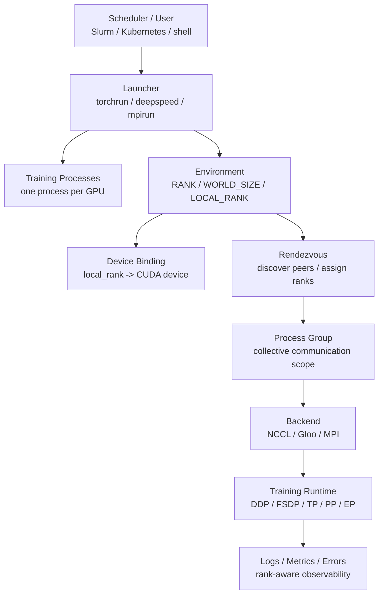

# 分布式训练启动与运行时：torchrun、Rank、Process Group 与 NCCL

很多人第一次接触多 GPU 训练时，会先看到 DDP、FSDP、Tensor Parallel、Pipeline Parallel、ZeRO 这些并行策略。

但在这些策略真正工作之前，系统必须先解决一个更基础的问题：

```text
如何在多张 GPU、多台机器上启动一组训练进程，
让这些进程知道自己是谁、和谁通信、使用哪张 GPU、如何同步？
```

这就是分布式训练启动与运行时要解决的问题。

本篇不深入讲某个并行算法，而是讲分布式训练运行起来所需的基础部件：

- launcher。
- rank。
- world size。
- local rank。
- rendezvous。
- process group。
- backend。
- NCCL。
- 环境变量。
- 日志、错误和排查。

理解这些内容后，再看 DDP、FSDP、TP、PP、EP 和训练框架，会清楚很多。

## 一张总图



这张图的核心是：

```text
分布式训练不是一个 Python 进程变大了，
而是一组进程通过 process group 协作完成一次训练任务。
```

## 为什么不是一个进程控制所有 GPU

单机单卡训练通常是：

```text
python train.py
```

多卡训练常见形式是：

```text
torchrun --nproc-per-node=8 train.py
```

这不是让一个 Python 进程同时控制 8 张 GPU，而是启动 8 个训练进程。

通常是：

```text
1 个 GPU 对应 1 个 Python 进程
```

这样做有几个好处：

- 每个进程负责一张 GPU，逻辑清晰。
- CUDA context、模型副本、数据 batch 更容易隔离。
- 通信通过 NCCL collective 完成。
- 多机扩展时，每台机器启动若干本地进程即可。

代价是：

- 每个进程都要正确知道自己的 rank。
- 日志会来自多个进程。
- 错误可能只在某个 rank 上出现。
- 任意一个关键 rank 挂掉，整个训练任务可能失败。

## Launcher 做了什么

Launcher 是负责启动训练进程的工具。

常见 launcher：

- `torchrun`。
- `deepspeed` launcher。
- `mpirun` / `mpiexec`。
- Slurm 的 `srun`。
- Kubernetes operator。
- Ray / Volcano / Kubeflow Training Operator 等更上层系统。

Launcher 通常负责：

- 在每个节点启动若干进程。
- 给每个进程设置环境变量。
- 指定主节点地址和端口。
- 指定 world size。
- 指定 rank / local rank。
- 管理 rendezvous。
- 收集进程退出状态。

训练脚本本身不应该猜测自己是第几个进程，而应该从 launcher 提供的信息中读取。

## Rank、World Size、Local Rank

分布式训练里最常见的三个概念：

| 概念 | 含义 |
| --- | --- |
| `WORLD_SIZE` | 全部训练进程数量 |
| `RANK` | 当前进程在全局进程集合里的编号 |
| `LOCAL_RANK` | 当前进程在本节点内的编号，通常用于绑定本地 GPU |

例如 2 台机器，每台 8 张 GPU：

```text
WORLD_SIZE = 16
```

全局 rank：

```text
node0: rank 0..7
node1: rank 8..15
```

本地 rank：

```text
node0: local_rank 0..7
node1: local_rank 0..7
```

注意：

```text
RANK 不是 GPU 编号。
LOCAL_RANK 通常才用于选择本节点上的 GPU。
```

最常见的设备绑定是：

```python
torch.cuda.set_device(local_rank)
```

如果把 `RANK` 当作本地 GPU 编号，多机训练时很容易让 rank 8 去访问本机不存在的 GPU 8。

## Node Rank

多机训练还会有 node rank。

例如：

```text
node_rank = 0
node_rank = 1
```

它表示当前节点在所有节点中的编号。

在很多启动方式里：

```text
global_rank = node_rank * nproc_per_node + local_rank
```

但不要把这个公式写死到训练逻辑里。

更稳妥的做法是：

- 由 launcher 设置 rank。
- 训练脚本读取环境变量。
- 框架负责初始化 process group。

## 单机多卡启动示例

单机 8 卡常见命令：

```bash
torchrun --standalone --nproc-per-node=8 train.py
```

含义：

- `--standalone`：单机模式，简化 rendezvous。
- `--nproc-per-node=8`：本节点启动 8 个进程。
- `train.py`：每个进程都会执行这份脚本。

注意：

```text
train.py 会被执行 8 次。
```

所以训练脚本里要避免所有 rank 同时做不该重复做的事。

例如：

- 所有 rank 同时下载大数据集。
- 所有 rank 同时写同一个日志文件。
- 所有 rank 同时保存同一个 checkpoint。
- 所有 rank 同时打印大量日志。

通常只有 rank 0 做主日志、主 checkpoint、主报告。

## 多机启动示例

假设 2 台机器，每台 8 张 GPU。

node 0：

```bash
torchrun \
  --nnodes=2 \
  --nproc-per-node=8 \
  --node-rank=0 \
  --master-addr=10.0.0.1 \
  --master-port=29500 \
  train.py
```

node 1：

```bash
torchrun \
  --nnodes=2 \
  --nproc-per-node=8 \
  --node-rank=1 \
  --master-addr=10.0.0.1 \
  --master-port=29500 \
  train.py
```

这里 `master-addr` 和 `master-port` 用于让所有进程找到 rendezvous 入口。

它不是说训练只在 master 上运行。

所有节点都会运行训练进程。

## Rendezvous 是什么

Rendezvous 可以理解为：

```text
所有训练进程集合、发现彼此、确认 world size、拿到 rank 的过程。
```

它解决几个问题：

- 哪些进程属于同一个训练任务。
- 总共有多少进程。
- 每个进程的 rank 是多少。
- 初始化通信时去哪里找其他进程。

如果 rendezvous 配置错，常见现象是：

- 训练卡在初始化。
- 部分 rank 连接不上 master。
- world size 不匹配。
- 有的节点启动了，有的节点没有加入。
- 端口被占用。

这类问题发生在训练开始之前，和模型本身通常无关。

## init_process_group

在 PyTorch 中，训练脚本通常会调用：

```python
torch.distributed.init_process_group(backend="nccl")
```

它会初始化默认 process group。

初始化后，当前进程就能参与 collective communication。

常见 backend：

| Backend | 常见用途 |
| --- | --- |
| NCCL | GPU 训练最常用 |
| Gloo | CPU 通信、部分调试场景 |
| MPI | 特定 HPC 环境 |

GPU 训练通常选 NCCL。

如果 process group 没初始化，DDP/FSDP/collective 都无法正常工作。

## Process Group 是什么

Process group 是一组能互相通信的进程。

默认 process group 通常包含全部 rank。

例如 16 个进程：

```text
default group = rank 0..15
```

Data Parallel 可以用这个 group 同步梯度。

但复杂并行策略会创建多个 group。

例如：

- Data Parallel group。
- Tensor Parallel group。
- Pipeline Parallel group。
- Expert Parallel group。
- Context Parallel group。

每个 group 对应不同通信范围。

这就是为什么 hybrid parallelism 不只是配置几个 size，还要正确创建 rank group。

## Process Group 和并行策略的关系

不同并行策略依赖不同 group。

| 并行策略 | 常见 group | 通信 |
| --- | --- | --- |
| DDP / DP | data parallel group | all-reduce |
| FSDP / ZeRO | sharded data parallel group | all-gather / reduce-scatter |
| Tensor Parallel | tensor parallel group | all-reduce / all-gather / reduce-scatter |
| Pipeline Parallel | pipeline group | send / recv |
| Expert Parallel | expert parallel group | all-to-all |
| Context Parallel | context parallel group | K/V exchange / P2P / all-gather |

一个 rank 可能同时属于多个 group。

例如 rank 7 可能同时属于：

- TP group A。
- PP stage 1。
- DP group 2。
- EP group 0。

这就是 rank mapping 复杂的来源。

## NCCL 做了什么

NCCL 是 NVIDIA GPU 上最常用的 collective communication library。

训练中很多通信最终会落到 NCCL：

- all-reduce。
- reduce-scatter。
- all-gather。
- broadcast。
- all-to-all。
- send / recv。

NCCL 负责在 GPU 之间、节点之间尽可能高效地搬数据。

它会利用：

- PCIe。
- NVLink。
- NVSwitch。
- InfiniBand。
- RoCE。
- GPUDirect RDMA。

训练框架通常不会让你直接写 NCCL API，但 NCCL 的行为会强烈影响训练性能和稳定性。

## NCCL 为什么经常成为排查重点

NCCL 问题常见，因为分布式训练高度依赖通信。

常见现象：

- 初始化卡住。
- 某个 collective 卡住。
- 训练跑一段时间后 timeout。
- 多机比单机慢很多。
- GPU 利用率周期性掉到 0。
- 某个 rank 报 connection reset。
- 某些节点组合能跑，某些节点组合不能跑。

可能原因：

- 网卡或路由配置错误。
- 防火墙或端口问题。
- IB/RoCE 配置问题。
- NCCL 选择了错误网卡。
- GPU/NIC NUMA 拓扑差。
- 某个节点硬件异常。
- rank mapping 跨了慢链路。
- 进程数、world size、rank 配置不一致。

排查 NCCL 时，要同时看：

- NCCL 日志。
- 节点网络。
- GPU 拓扑。
- rank mapping。
- 训练 timeline。
- 系统错误日志。

## 关键环境变量

训练任务启动时，环境变量很重要。

常见变量：

| 变量 | 含义 |
| --- | --- |
| `MASTER_ADDR` | rendezvous / master 地址 |
| `MASTER_PORT` | rendezvous / master 端口 |
| `WORLD_SIZE` | 全局进程数 |
| `RANK` | 当前全局 rank |
| `LOCAL_RANK` | 当前节点内 rank |
| `LOCAL_WORLD_SIZE` | 当前节点内进程数 |
| `CUDA_VISIBLE_DEVICES` | 当前进程可见 GPU 列表 |
| `NCCL_DEBUG` | NCCL 日志级别 |
| `NCCL_SOCKET_IFNAME` | NCCL 使用的网卡接口 |
| `TORCH_DISTRIBUTED_DEBUG` | PyTorch distributed 调试级别 |

不要在训练脚本里随意覆盖这些变量。

如果必须设置，要把它们写进 run manifest 或启动脚本，保证可复现。

## CUDA_VISIBLE_DEVICES 和 LOCAL_RANK

很多集群环境会通过 `CUDA_VISIBLE_DEVICES` 控制进程看到哪些 GPU。

例如：

```text
CUDA_VISIBLE_DEVICES=4,5,6,7
```

在这个进程里，CUDA 看到的本地设备编号会变成：

```text
cuda:0 -> physical GPU 4
cuda:1 -> physical GPU 5
cuda:2 -> physical GPU 6
cuda:3 -> physical GPU 7
```

因此训练脚本通常应该使用 local rank 绑定“可见 GPU 列表中的本地编号”。

例如：

```python
local_rank = int(os.environ["LOCAL_RANK"])
torch.cuda.set_device(local_rank)
```

不要自己假设物理 GPU 编号。

## 一个最小训练脚本骨架

下面是一个极简结构，不是完整训练代码。

```python
import os
import torch
import torch.distributed as dist
from torch.nn.parallel import DistributedDataParallel as DDP


def main():
    local_rank = int(os.environ["LOCAL_RANK"])
    torch.cuda.set_device(local_rank)

    dist.init_process_group(backend="nccl")

    rank = dist.get_rank()
    world_size = dist.get_world_size()

    model = build_model().cuda()
    model = DDP(model, device_ids=[local_rank])

    dataloader = build_dataloader(rank=rank, world_size=world_size)
    optimizer = build_optimizer(model)

    for batch in dataloader:
        batch = move_to_gpu(batch, local_rank)
        loss = model(batch)
        loss.backward()
        optimizer.step()
        optimizer.zero_grad(set_to_none=True)

    dist.destroy_process_group()


if __name__ == "__main__":
    main()
```

真实工程还要处理：

- seed。
- sampler。
- gradient accumulation。
- mixed precision。
- checkpoint。
- logging。
- failure handling。
- profiler。

但主干逻辑就是：

```text
绑定 GPU -> 初始化 process group -> 包装模型 -> 分布式训练 -> 清理
```

## 数据采样必须分布式

多进程训练时，每个 rank 不应该读取完全相同的数据 batch。

否则 8 张 GPU 可能只是在重复训练同一批数据。

常见做法是使用 distributed sampler。

核心目标：

```text
不同 rank 读取不同数据分片，
但共同构成一个 global batch。
```

还要注意：

- 每个 epoch 是否调用 `set_epoch`。
- shuffle seed 是否一致。
- drop_last 是否影响 global batch。
- 数据量不能整除 world size 时怎么处理。
- resume 后 dataloader 状态是否恢复。

分布式训练正确性不仅是通信正确，数据切分也必须正确。

## 日志应该 rank-aware

多进程训练会产生多份日志。

如果所有 rank 都打印同样内容，日志会很乱。

常见策略：

- rank 0 打主日志。
- 每个 rank 写独立 debug log。
- 错误日志保留 rank、node、local rank、GPU id。
- 关键指标按 rank 聚合。
- profiler 只采样部分 rank 或短窗口。

日志至少要包含：

```text
rank
local_rank
world_size
node_id
hostname
cuda_device
process_id
```

否则排查时很难知道是哪张 GPU、哪个节点出问题。

## Checkpoint 谁来保存

普通 DDP 里，常见做法是 rank 0 保存 checkpoint。

但 FSDP/ZeRO/TP/PP/EP 中，checkpoint 可能是 sharded 的。

这时每个 rank 可能都要保存自己的一部分状态。

不要简单假设：

```text
只要 rank 0 保存就够了。
```

要根据训练策略决定：

- full checkpoint。
- sharded checkpoint。
- distributed checkpoint。
- rank-local checkpoint。
- consolidated checkpoint。

同时记录：

- world size。
- rank mapping。
- parallelism config。
- model shard metadata。
- optimizer shard metadata。

否则恢复时会很麻烦。

## 常见启动失败

### 端口问题

现象：

```text
Address already in use
Connection refused
```

可能原因：

- `MASTER_PORT` 被占用。
- 节点之间端口不通。
- 上一次训练残留进程未退出。

### World Size 不一致

现象：

```text
部分 rank 卡住等待
```

可能原因：

- 某些节点没有启动。
- `--nnodes` 配错。
- `--nproc-per-node` 配错。
- launcher 和 scheduler 分配资源不一致。

### Local Rank 绑定错误

现象：

```text
invalid device ordinal
多个进程占用同一张 GPU
```

可能原因：

- 用 `RANK` 当成本地 GPU 编号。
- `CUDA_VISIBLE_DEVICES` 和 local rank 理解错。
- scheduler 分配的 GPU 数和启动进程数不一致。

### NCCL 初始化失败

现象：

```text
NCCL error
timeout
connection reset
```

可能原因：

- 网卡选择错误。
- IB/RoCE 配置问题。
- 防火墙。
- 节点间网络不可达。
- 驱动、CUDA、NCCL 版本不匹配。

### 某个 Rank 静默退出

现象：

```text
其他 rank 卡住
```

可能原因：

- OOM killer。
- CUDA error。
- 数据读取异常。
- Python exception 只在某个 rank 上发生。
- 节点硬件问题。

所以排查时不能只看 rank 0 日志。

## 常见性能问题

### 问题一：启动慢

可能原因：

- 每个 rank 重复加载大模型或大数据。
- 镜像拉取慢。
- Python import 慢。
- 数据集 metadata 扫描慢。
- rendezvous 等待慢。

优化方向：

- 缓存模型和数据 metadata。
- 避免所有 rank 重复下载。
- 本地 NVMe staging。
- 启动阶段分层日志。

### 问题二：训练初期卡住

可能原因：

- 第一次 collective 卡住。
- dataloader 某个 rank 没数据。
- barrier 等待某个 rank。
- 某个 rank 在编译或 autotune。

优化方向：

- 打印每个 rank 到达关键阶段的日志。
- 缩短首次 profiler 窗口。
- 检查 sampler 和 batch 数。

### 问题三：GPU 利用率周期性掉零

可能原因：

- 数据输入等待。
- checkpoint 同步保存。
- evaluation 阻塞。
- collective 等 straggler。
- 网络拥塞。

优化方向：

- timeline 分析。
- rank-level step time。
- 分开看 data wait、compute、communication、checkpoint。

### 问题四：多机比单机扩展差

可能原因：

- 跨节点通信过多。
- NCCL 选择了错误网卡。
- TP/EP 跨了慢网络。
- batch 太小，通信占比太高。
- 网络拥塞或拓扑不匹配。

优化方向：

- 检查 rank mapping。
- 把高频通信 group 放在节点内。
- 调整 bucket、micro-batch、gradient accumulation。
- 用 NCCL tests 验证网络基线。

## Barrier 要谨慎使用

`dist.barrier()` 可以让所有 rank 等待到同一点。

它适合用于：

- 初始化阶段同步。
- checkpoint 前后同步。
- debug 阶段定位。

但滥用 barrier 会带来问题：

- 掩盖真正的慢 rank。
- 增加等待。
- 某个 rank 异常时所有 rank 卡住。
- 让 timeline 变得更难分析。

不要用 barrier 解决所有 race condition。

应该先理解为什么需要同步。

## Error Handling

分布式训练的错误处理比单进程复杂。

一个 rank 出错后，其他 rank 可能还在 collective 里等待。

良好的运行时应该：

- 捕获每个 rank 的异常。
- 将 rank、node、local rank 写入错误日志。
- 让所有 rank 尽快退出。
- 保存必要诊断信息。
- 避免只留下一个 timeout。

调试阶段可以提高日志级别，但生产长期训练不能无限打开大量 debug 日志，否则会影响性能和存储。

## 和 Slurm 的关系

在 HPC 或训练集群中，Slurm 常用于分配节点和启动任务。

Slurm 负责：

- 分配节点。
- 分配 GPU。
- 设置作业环境。
- 启动多个 task。
- 收集退出状态。

PyTorch / torchrun 负责：

- 初始化分布式进程。
- 设置 rank。
- 建立 process group。
- 让训练脚本运行。

有些环境用 `srun` 直接启动每个 rank，有些环境用 Slurm 分配节点后再在节点上调用 `torchrun`。

关键是不要让两个 launcher 重复创建进程，导致进程数量翻倍。

## 和 Kubernetes 的关系

Kubernetes 场景里，分布式训练通常由 operator 或调度系统管理。

例如：

- PyTorchJob。
- Kubeflow Training Operator。
- Volcano。
- Kueue。
- 自研 training controller。

它们负责：

- 创建多个 pod。
- 分配 GPU。
- 设置 master 地址。
- 设置 rank 相关环境变量。
- 处理 pod 失败和重启。

训练脚本仍然要遵守同样原则：

- 读取环境变量。
- 绑定 local rank。
- 初始化 process group。
- rank-aware logging。
- checkpoint 可恢复。

## 和 DeepSpeed / Megatron / FSDP 的关系

DeepSpeed、Megatron-LM、PyTorch FSDP 都建立在分布式 runtime 之上。

它们会帮你管理很多细节，但底层概念仍然存在：

- rank。
- local rank。
- world size。
- process group。
- communication backend。
- checkpoint shard。
- rank mapping。

例如 Megatron 会创建 TP/PP/DP/EP group。

DeepSpeed 会管理 ZeRO partition、通信和 optimizer state。

FSDP 会在 group 内做 parameter all-gather 和 gradient reduce-scatter。

如果不了解 runtime 基础，遇到 NCCL timeout、rank mismatch、checkpoint shard 错误时会很难排查。

## 运行记录应该保存什么

一次分布式训练至少保存：

```yaml
distributed:
  launcher: torchrun
  nnodes: 4
  nproc_per_node: 8
  world_size: 32
  backend: nccl
  master_addr: "node-0"
  master_port: 29500

rank_mapping:
  strategy: "tp_within_node_dp_across_nodes"
  local_world_size: 8
  visible_devices: "0,1,2,3,4,5,6,7"

software:
  pytorch: "..."
  cuda: "..."
  nccl: "..."
  driver: "..."

debug:
  torch_distributed_debug: "..."
  nccl_debug: "..."
```

如果一次 benchmark 或训练失败没有这些信息，后续很难复现。

## Debug 检查顺序

遇到分布式训练问题，可以按这个顺序：

1. 单机单卡是否能跑。
2. 单机多卡是否能跑。
3. 多机最小 world size 是否能跑。
4. 每个 rank 的 `RANK/WORLD_SIZE/LOCAL_RANK` 是否正确。
5. 每个 rank 绑定的 GPU 是否正确。
6. 节点之间端口是否连通。
7. NCCL 是否选对网卡。
8. 数据 sampler 是否每个 rank 都有数据。
9. 是否某个 rank 先 OOM 或异常退出。
10. profiler timeline 中卡在 compute、data 还是 communication。

不要一开始就在最大规模上排查。

## 常见误区

### 误区一：rank 0 就是 master GPU

不准确。

rank 0 通常负责主日志或主 checkpoint，但训练计算发生在所有 rank 上。

### 误区二：local rank 等于物理 GPU 编号

不一定。

如果设置了 `CUDA_VISIBLE_DEVICES`，local rank 对应的是可见设备列表中的编号，不一定是物理 GPU 编号。

### 误区三：DDP 只需要把模型包一下

不够。

还要正确初始化 process group、设置 sampler、绑定 device、处理日志和 checkpoint。

### 误区四：NCCL timeout 一定是网络坏了

不一定。

可能是某个 rank 数据读取卡住、OOM、异常退出、没有进入 collective，导致其他 rank 等待。

### 误区五：所有 rank 都保存 checkpoint 更保险

不一定。

如果没有 sharded checkpoint 设计，所有 rank 同时写同一个文件可能导致覆盖、损坏或存储风暴。

### 误区六：能启动就说明 runtime 没问题

不够。

启动成功只说明初始化过了。长期训练还要看通信稳定性、straggler、checkpoint、恢复和扩展效率。

## 设计检查清单

启动前：

- `nnodes` 是否和实际分配节点一致？
- `nproc_per_node` 是否和每节点 GPU 数一致？
- `MASTER_ADDR/MASTER_PORT` 是否可达？
- `CUDA_VISIBLE_DEVICES` 是否符合预期？
- PyTorch/CUDA/NCCL/driver 版本是否记录？

脚本中：

- 是否用 `LOCAL_RANK` 绑定 device？
- 是否初始化 process group？
- 是否使用 distributed sampler？
- 是否只有合适 rank 写主日志和 checkpoint？
- 是否在退出前清理 process group？

排查中：

- 是否保留所有 rank 日志？
- 是否记录 hostname、rank、local rank、GPU id？
- 是否能区分 data wait、compute wait、communication wait？
- 是否检查过 NCCL 日志和网络基线？

长期运行：

- checkpoint 是否可恢复？
- rank mapping 是否记录？
- 节点失败是否能定位？
- 监控是否按 rank/node/group 聚合？
- benchmark 是否覆盖目标规模？

## 小结

分布式训练启动与运行时是所有并行训练的底座。

一句话：

```text
launcher 启动多个进程，
rank 标识每个进程，
process group 定义谁和谁通信，
backend/NCCL 执行通信，
训练框架在这些基础上实现 DDP、FSDP、TP、PP、EP。
```

如果这些基础概念不清楚，后面很多问题都会变得模糊：

- 为什么训练卡在初始化？
- 为什么某个 rank OOM 会让其他 rank timeout？
- 为什么多机扩展效率差？
- 为什么 checkpoint 不能恢复？
- 为什么 rank mapping 会影响性能？

理解 runtime 后，再学习 Data Parallel、FSDP、Tensor Parallel、Pipeline Parallel 和 Expert Parallel，就能把“算法怎么切”与“系统怎么跑”连起来。

## 参考资料

- [PyTorch torchrun](https://docs.pytorch.org/docs/stable/elastic/run.html)
- [PyTorch Distributed Overview](https://docs.pytorch.org/docs/stable/distributed.html)
- [PyTorch DistributedDataParallel](https://docs.pytorch.org/docs/stable/generated/torch.nn.parallel.DistributedDataParallel.html)
- [NVIDIA NCCL User Guide](https://docs.nvidia.com/deeplearning/nccl/user-guide/docs/)
- [NVIDIA NCCL Environment Variables](https://docs.nvidia.com/deeplearning/nccl/user-guide/docs/env.html)
