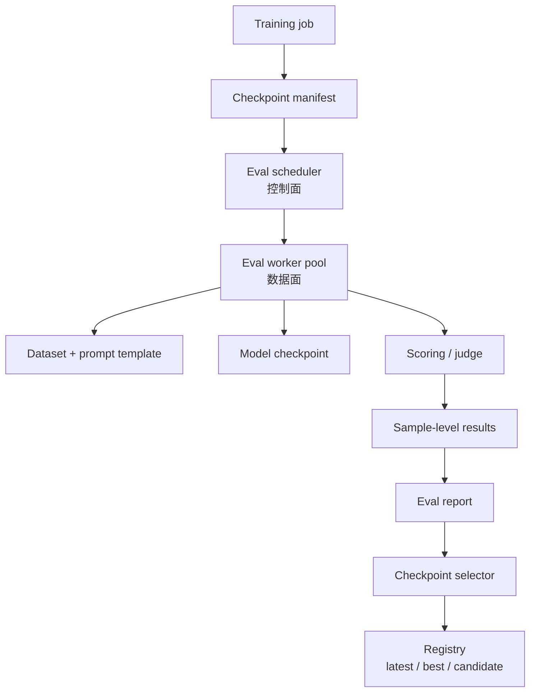
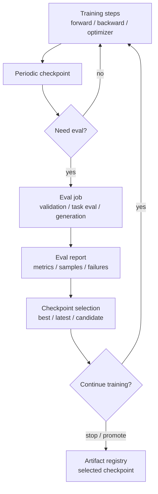

# Evaluation、Validation 与 Checkpoint Selection

训练系统不是只把 loss 降下去就结束。长期训练和微调都需要定期回答几个问题：

- 模型有没有真的变好？
- 当前 checkpoint 是否值得保留？
- 训练是否已经过拟合或退化？
- 某个优化配置虽然更快，但是否损伤质量？
- 如果训练中断，恢复后的模型质量是否连续？
- 哪个 checkpoint 应该进入后训练、评测或部署流程？

这些问题都落到 evaluation、validation 和 checkpoint selection 上。

从系统角度看，评估不是“顺手跑几个指标”。它会消耗 GPU、CPU、存储、数据管线、推理服务、调度队列和人工分析时间。评估太频繁会拖慢训练，评估太少会让问题发现太晚。评估不可复现，则无法比较不同实验。

本篇关注训练系统里的评估流程：如何安排、如何测量、如何选 checkpoint，以及如何把评估纳入端到端训练效率。

## 先给结论

训练中的评估系统要解决三类问题：

1. **质量判断**：模型是否在验证集、下游任务或人工偏好指标上变好。
2. **系统调度**：评估何时运行、占用哪些资源、是否阻塞训练、是否复用 checkpoint。
3. **可复现治理**：评估数据、代码、指标、prompt、采样参数、checkpoint 版本和结果记录是否可追溯。

最常见的系统错误是：

- 只看 training loss，不看 validation。
- eval 太频繁，吞掉大量训练时间。
- eval 太少，坏训练跑了很多天才发现。
- eval 和训练共用 GPU，导致 step time 抖动。
- eval batch、precision、context length 和训练配置混在一起不可比较。
- checkpoint 只按时间保存，不按质量选择。
- 多个实验的 eval 数据版本、prompt 模板、采样参数不一致。

一个合理的训练评估系统应该把下面几件事固定下来：

```text
what to evaluate
when to evaluate
where to evaluate
which checkpoint to evaluate
how to record results
how to choose best checkpoint
```

## 评估系统的控制面与数据面

把评估当成系统来设计，可以分成控制面和数据面。

控制面回答：

- 哪些 checkpoint 需要评估。
- 什么时候触发评估。
- 评估任务排到哪个资源池。
- 哪些结果算有效。
- 哪个 checkpoint 被标记为 best / candidate / rejected。

数据面回答：

- eval dataset 怎么读取。
- prompt / chat template 怎么渲染。
- 模型怎么加载。
- loss 或 generation 怎么运行。
- scoring 怎么计算。
- raw prediction 和 sample-level result 怎么保存。



这个拆分很重要。很多训练平台一开始把 eval 写在训练脚本里，后来会遇到：

- eval 失败阻塞训练。
- eval 结果无法重试。
- eval 代码和训练代码耦合太深。
- checkpoint 被删除后，eval report 无法追溯。
- 多个实验的 eval 配置不可比较。

更稳妥的方式是：训练只负责定期产出 checkpoint manifest；评估系统根据 manifest 独立调度 eval；checkpoint selector 根据 eval report 更新模型状态。

## Evaluation、Validation、Benchmark 的区别

这几个词经常混用，但系统设计时最好分清。

| 概念 | 主要目的 | 常见对象 |
| --- | --- | --- |
| validation | 训练过程中监控泛化和过拟合 | held-out validation set、validation loss、perplexity。 |
| evaluation | 评估模型能力或任务指标 | QA、MMLU、代码、数学、偏好评测、安全评测。 |
| benchmark | 对系统性能或能力做可比较测试 | tokens/s、step time、eval score、成本、能效。 |
| checkpoint selection | 从多个 checkpoint 里选模型版本 | best validation loss、best eval score、Pareto frontier。 |

训练系统里通常会同时存在：

- 高频轻量 validation。
- 低频重型 evaluation。
- 系统性能 benchmark。
- checkpoint retention / selection 策略。

不要把它们都塞进一个“eval step”概念里。

## 评估在训练生命周期中的位置

一个训练任务可能这样运行：



评估可以有两种执行方式：

1. **同步评估**：训练停下来，当前进程或同一组 GPU 跑 eval。
2. **异步评估**：训练继续，另一个作业从 checkpoint 读取模型并跑 eval。

同步评估简单，但会阻塞训练。异步评估吞吐更好，但需要处理 checkpoint 可见性、版本追踪、资源调度和结果回写。

## Validation Loss

Validation loss 是训练中最基础的质量信号之一。

做法是保留一部分数据不参与训练，只用来评估模型在未见数据上的 loss。

它能回答：

```text
模型是否在 held-out data 上继续变好？
```

常见指标包括：

- validation loss。
- perplexity。
- per-token negative log likelihood。
- 不同数据域的分组 loss。
- 多模态任务里的分模态 loss。

Validation loss 的优点是：

- 和训练目标接近。
- 可自动化。
- 成本相对下游评测低。
- 适合高频监控趋势。

局限是：

- 不一定代表真实任务能力。
- 对数据分布很敏感。
- 如果 validation set 泄漏或污染，会误导判断。
- 对生成质量、指令遵循、推理能力、安全性、工具使用不够充分。

因此 validation loss 是必要信号，但不是全部。

## Metric Taxonomy：指标要分层

训练中的评估指标可以分成几类。它们回答的问题不同。

| 指标类型 | 例子 | 回答的问题 |
| --- | --- | --- |
| Loss 指标 | validation loss、perplexity、NLL | 模型是否更好地预测 held-out token。 |
| Task 指标 | accuracy、F1、EM、pass@k | 模型在具体任务上表现如何。 |
| Generation 指标 | win rate、judge score、format success | 生成结果是否符合要求。 |
| Safety / policy 指标 | unsafe rate、refusal accuracy、toxicity | 是否符合安全或合规边界。 |
| System 指标 | eval time、GPU hours、throughput、OOM rate | 评估本身消耗多少资源。 |
| Stability 指标 | score variance、retry variance、seed variance | 评估结果是否可靠。 |

不要把所有指标压成一个总分。更好的做法是保留分层指标，然后由 checkpoint selection policy 明确如何取舍。

例如：

```yaml
metrics:
  validation:
    loss: 1.72
    perplexity: 5.58
  task:
    mmlu_acc: 0.72
    gsm8k_pass1: 0.61
  generation:
    instruction_following: 0.83
    format_success: 0.96
  system:
    eval_gpu_hours: 14.2
    eval_wall_clock_minutes: 47
```

如果只保存一个 `score=0.78`，后续很难判断模型到底是 loss 变好、推理变强、格式更稳定，还是评估集换了。

## Eval Dataset 的版本治理

评估数据必须像训练数据一样治理。

至少要记录：

| 项目 | 说明 |
| --- | --- |
| dataset name | 评估集名称。 |
| dataset version | 数据版本、commit、hash 或 manifest。 |
| split | validation、test、dev、held-out。 |
| sample count | 样本数量。 |
| token count | 输入/输出 token 数估计。 |
| filtering rules | 去重、清洗、语言过滤、长度过滤。 |
| contamination check | 是否和训练集重叠。 |
| prompt template | 评估 prompt 或 chat template。 |
| scoring method | exact match、loss、judge、pass@k 等。 |

如果两个实验用的 eval set 不同，分数不可直接比较。

如果 prompt template 变了，分数也可能变。

如果 tokenizer 变了，loss / perplexity 也可能变。

### Eval 数据污染与泄漏

训练集和评估集重叠会让分数虚高。大模型训练里，污染检查很难做到绝对完整，但至少要有治理意识。

常见污染来源：

- 评估题目出现在预训练语料中。
- SFT / DPO 数据包含 benchmark 答案。
- 自动生成数据引用了 eval set。
- 多轮实验中把失败样例修进训练集后，仍然用同一 eval set 汇报分数。
- 人工调 prompt 时反复看 test set。

系统上可以做几件事：

- 对 eval prompt / answer 做 hash 和 n-gram 检索。
- 区分 dev、validation、test、hidden test。
- 记录某个 eval set 是否被用于调参。
- 对关键 benchmark 保留 holdout 或 blind split。
- 在报告中标注 contamination check 版本。

评估污染不是单纯数据科学问题，也影响训练系统决策。一个被污染的 best checkpoint 可能会进入后训练或部署，带来错误的资源投入。

### 样本级结果比总分更重要

Eval report 不能只保存 aggregate metric。至少对重要评估保存 sample-level result：

```json
{
  "sample_id": "gsm8k-000123",
  "prompt_hash": "...",
  "checkpoint_id": "step-120000",
  "prediction": "...",
  "score": 1,
  "latency_ms": 842,
  "tokens_in": 512,
  "tokens_out": 128,
  "error": null
}
```

sample-level result 的价值是：

- 可以复盘失败样例。
- 可以比较两个 checkpoint 在同一批样本上的差异。
- 可以发现某个数据域退化。
- 可以重新计算新指标。
- 可以给 AI 或人做错误聚类。

长期看，样本级记录比单个排行榜分数更有知识库价值。

## Eval Cadence：多久评一次

评估频率是系统取舍。

常见触发方式：

- 每 N 个 optimizer steps。
- 每 N 个 tokens。
- 每 N 小时。
- 每个 epoch 结束。
- 每个 checkpoint 生成后。
- 训练异常或 loss spike 后。
- 手动触发。

对于大模型训练，用 token 数触发通常比 step 数更稳，因为不同实验可能改变 batch、sequence length、gradient accumulation。

例子：

```text
每 10B train tokens 跑一次轻量 validation
每 100B train tokens 跑一次完整 eval suite
每 6 小时保存一次 latest checkpoint
validation 改善时保存 best checkpoint
```

评估太频繁的问题：

- 训练被频繁打断。
- eval 占用 GPU，降低总 tokens/day。
- 产生大量 checkpoint 和报告。
- 统计噪声可能导致过度反应。

评估太少的问题：

- 数据 bug、loss mask bug、数值问题发现晚。
- 过拟合或退化发现晚。
- 浪费大量算力在坏实验上。
- checkpoint selection 粒度太粗。

合理 cadence 通常分层：

| 层级 | 频率 | 内容 |
| --- | --- | --- |
| high-frequency | 频繁 | 小 validation set、少量 loss、sanity samples。 |
| medium-frequency | 中等 | 主要 validation set、领域分组指标。 |
| low-frequency | 较低 | 完整 task eval、生成式评估、安全评估、人工评审。 |

### 按 Token 而不是按 Step 触发

大模型训练里，按 step 触发 eval 经常不可比。原因是 step 的含义会因为这些配置变化：

- micro-batch size。
- gradient accumulation。
- sequence length。
- data packing。
- world size。
- curriculum 或数据混合比例。

两个实验都“每 1000 step eval”，但每个 step 消耗的 token 数可能不同。

更稳妥的触发方式是：

```text
eval every N consumed train tokens
```

同时记录：

```yaml
eval_trigger:
  type: "train_tokens"
  interval: 10000000000
  current_train_tokens: 120000000000
```

如果是小规模微调，按 epoch 或 sample count 触发也可以，但要记录清楚。

## 同步 Eval 与异步 Eval

### 同步 Eval

同步 eval 的流程：

```text
train reaches eval step
pause training
switch model to eval mode
run validation / evaluation
log results
resume training
```

优点：

- 实现简单。
- 使用当前内存中的模型状态。
- 不需要额外 checkpoint 读取。
- 结果和当前 step 对齐清楚。

缺点：

- 训练吞吐下降。
- eval 的 batch / generation 可能改变显存峰值。
- eval 失败可能阻塞训练。
- 长 eval suite 会让 GPU 空转在非训练路径上。

### 异步 Eval

异步 eval 的流程：

```text
training writes checkpoint
eval scheduler detects new checkpoint
eval job loads checkpoint
eval job runs metrics
eval job writes report
training / dashboard consumes result
```

优点：

- 训练不必等待完整 eval。
- 可以用独立资源池。
- 可以排队、重试和并行跑多个 eval suite。
- 更适合长周期预训练和频繁微调平台。

缺点：

- checkpoint 必须完整可读。
- 结果有延迟。
- eval 资源也需要容量规划。
- 需要 artifact registry 和 run manifest。
- 需要处理训练继续推进后，eval 结果才回来。

长期训练更适合异步 eval，短小微调任务可能同步 eval 更简单。

## 异步 Eval Scheduler

异步 eval 的核心是 scheduler。它接收 checkpoint manifest，决定是否创建 eval job。

一个简单规则：

```text
每个 latest checkpoint 跑 smoke eval
每 N 个 token 的 checkpoint 跑 validation-lite
每 M 个 token 的 checkpoint 跑 full eval
validation 改善的 checkpoint 跑 downstream eval
```

Scheduler 需要处理：

| 问题 | 处理方式 |
| --- | --- |
| checkpoint 还没写完 | 只读取 status=complete 的 manifest。 |
| eval backlog 太长 | 跳过低优先级旧 checkpoint，只保留候选。 |
| eval 失败 | 按错误类型重试，超过次数标记 failed。 |
| 训练已经继续很多 step | eval report 仍绑定原 checkpoint，不覆盖当前状态。 |
| 资源不足 | eval 分层排队，full eval 低频运行。 |

异步 eval report 要带状态：

```yaml
eval_job:
  checkpoint_id: "step-120000"
  suite: "validation-lite"
  status: "succeeded"  # queued / running / succeeded / failed / skipped
  retry_count: 1
  started_at: ""
  finished_at: ""
```

这样 dashboard 和 checkpoint selector 才能区分“分数低”和“评估没跑完”。

## Eval Backlog 和跳过策略

长期训练中，eval 可能追不上训练。如果每个 checkpoint 都跑完整评估，队列会越来越长。

需要明确跳过策略：

- full eval 只跑 milestone checkpoint。
- 如果新 checkpoint 已经显著更优，跳过旧 checkpoint 的重型 eval。
- 如果 smoke eval 失败，暂不跑 full eval。
- 如果 eval backlog 超过阈值，降低 full eval 频率。
- 对 best candidate 重新排高优先级。

这些策略要写进系统配置，而不是临时人工决定。

```yaml
eval_backlog_policy:
  max_full_eval_queue: 4
  skip_full_eval_if_newer_best_exists: true
  always_eval_milestones: true
  smoke_failure_blocks_full_eval: true
```

否则 eval 系统会在长期训练中变成隐藏的资源黑洞。

## Eval 资源池

评估资源不要默认和训练资源混在一起。

可以考虑三类资源：

| 资源池 | 适合任务 | 特点 |
| --- | --- | --- |
| training GPUs | 高频小 validation | 简单，但会阻塞训练。 |
| dedicated eval GPUs | 周期性完整 eval | 可控、可排队、不直接影响训练 step。 |
| inference serving pool | 生成式 eval、judge、agent eval | 更接近推理形态，可复用 serving stack。 |

如果 eval 需要生成长回答，它的负载更像推理服务：

- Prefill / Decode。
- KV Cache。
- batching。
- sampling。
- judge model。
- tool calls。

这类 eval 不应简单当作训练 forward。

### 评估资源池容量估算

Eval pool 也需要容量模型。最简单的估算：

```text
eval_gpu_hours_per_day =
  checkpoints_per_day
  * eval_suites_per_checkpoint
  * gpu_hours_per_suite
```

如果训练每天产出 12 个候选 checkpoint，每个跑 lite eval 需要 0.5 GPU hour：

```text
12 * 0.5 = 6 GPU hours/day
```

如果 full eval 每天跑 2 次，每次 16 GPU hours：

```text
2 * 16 = 32 GPU hours/day
```

总 eval 资源就是 38 GPU hours/day，还不算失败重试和人工评估。

因此 eval cadence 不能只由研究需求决定，也要和资源池容量匹配。

## Eval Mode 与 Train Mode

评估前通常要切换：

```python
model.eval()
```

训练继续时再切回：

```python
model.train()
```

差异包括：

- dropout 关闭。
- batch norm 使用 running stats。
- 某些随机增强关闭。
- gradient 不需要记录。

常见评估写法：

```python
model.eval()
with torch.no_grad():
    for batch in eval_loader:
        output = model(batch)
        metrics.update(output, batch)
model.train()
```

错误包括：

- eval 时忘记 `no_grad()`，导致显存暴涨。
- eval 后忘记切回 `train()`。
- eval 使用了训练时 dropout。
- eval 路径产生不必要 gradient。
- eval batch 太大导致 OOM。

## Validation Batch 与训练 Batch

Eval batch 不一定等于 train batch。

训练 batch 受 backward、activation、optimizer state 约束。

Eval 通常没有 backward，因此可以更大：

```text
train batch: 受 activation + gradients + optimizer state 限制
eval batch: 主要受 forward activation / KV cache / logits 限制
```

但不能盲目加大 eval batch：

- 长 context 会增大 activation 或 KV cache。
- 生成式 eval decode 会积累 KV cache。
- 大词表 logits 仍然可能占显存。
- 多选题 scoring 可能一次构造多个候选。
- eval batch 太大可能和训练配置不可比。

建议单独配置：

```yaml
train_micro_batch_size: 4
eval_micro_batch_size: 8
eval_max_seq_len: 4096
eval_generation_max_tokens: 512
```

## Loss Eval 与 Generation Eval

LLM 评估常见两类路径。

### Loss Eval

Loss eval 直接计算目标 token 的 loss 或 logprob。

适合：

- language modeling validation。
- perplexity。
- classification by likelihood。
- DPO / SFT 数据质量检查。

特点：

- 可批量化。
- 相对稳定。
- 不依赖采样。
- 与训练目标接近。

### Generation Eval

Generation eval 让模型生成答案，再评分。

适合：

- 指令遵循。
- QA。
- 代码生成。
- 数学推理。
- 多轮对话。
- Agent / tool use。

特点：

- 更接近真实使用。
- 成本更高。
- 受 decoding 参数影响。
- 需要处理非确定性。
- 可能需要 judge model 或规则评分。

两者都需要，但不要混淆。Loss 变好不一定代表生成质量变好；生成分数波动也不一定说明训练退化。

## 常见 Eval 任务形态

不同 eval 任务的系统负载差异很大。

| 任务形态 | 例子 | 系统特点 |
| --- | --- | --- |
| Perplexity / loss | held-out corpus、领域验证集 | forward + loss，批量化好，成本可控。 |
| Multiple choice | MMLU 类任务 | 可以用 logprob scoring，也可以生成答案；prompt 模板敏感。 |
| Open QA | Natural Questions、领域 QA | 需要生成和文本匹配，评分规则复杂。 |
| Math reasoning | GSM8K、数学推理 | response 较长，可能需要 exact answer extraction 或 verifier。 |
| Code generation | HumanEval 类任务 | 需要运行测试，sandbox 和 timeout 成本高。 |
| Chat / instruction | 指令遵循、多轮对话 | 常用 judge model 或人工评估，非确定性更强。 |
| Agent / tool use | 工具调用、浏览器、代码执行 | 最像端到端系统测试，成本和失败模式复杂。 |

这说明 eval suite 不是一个统一算子。它可能是：

- 纯 forward loss。
- 生成式推理。
- 多次采样。
- 外部程序执行。
- judge model 推理。
- 人工流程。

因此 eval report 必须同时记录质量指标和系统指标。否则很难解释为什么某个 eval suite 从 30 分钟变成 3 小时。

## Scoring 方法

常见 scoring 方法包括：

| 方法 | 说明 | 风险 |
| --- | --- | --- |
| exact match | 生成结果必须完全匹配答案 | 对格式敏感。 |
| F1 / token overlap | 看答案 token 重叠 | 对开放问答有限。 |
| multiple choice accuracy | 在选项中选最高分或生成答案 | prompt 和 scoring 方式影响大。 |
| perplexity / loss | 目标 token 平均负 log probability | 不一定对应任务能力。 |
| pass@k | 代码或数学多次采样通过率 | 成本高，依赖测试用例。 |
| judge model | 用另一个模型打分 | judge bias、版本漂移。 |
| human eval | 人工偏好或安全审核 | 成本高、速度慢、一致性要治理。 |

系统设计里要记录 scoring 代码版本。指标计算函数变了，历史结果可能不可比较。

## Judge Model 治理

生成式评估常用 judge model。它可以是内部模型、外部 API 或专门训练的 reward/evaluator 模型。

Judge model 是评估系统的一部分，不是透明真理源。必须记录：

| 字段 | 说明 |
| --- | --- |
| judge model id/revision | judge 自身版本。 |
| judge prompt/template | 打分指令会影响结果。 |
| judge decoding config | temperature、max tokens、seed。 |
| rubric | 打分标准。 |
| calibration set | 用来检查 judge 是否稳定的小集合。 |
| retry policy | judge 输出格式错误时怎么重试。 |
| aggregation | 多 judge、多 sample 如何合并。 |

常见风险：

- judge 偏好某种表达风格。
- judge 版本升级后历史分数不可比。
- judge prompt 改动导致分数漂移。
- judge 对长答案位置偏置。
- judge 不能可靠评分某些领域。
- 使用待评模型自己当 judge，产生自评偏差。

实践上可以给 judge 做 smoke test：

```text
固定 100 条 calibration samples
每次 judge 版本变化都重跑
比较 score distribution 和 disagreement cases
```

如果 judge 本身不稳定，checkpoint selection 就不能依赖它作为唯一指标。

## 多次采样与 pass@k

代码、数学和推理任务经常使用多次采样：

```text
同一个 prompt -> 生成 k 个候选 -> 任意一个通过则 pass@k
```

这类指标对 decoding 配置和随机种子高度敏感。

必须记录：

- `k`。
- temperature。
- top_p。
- max_new_tokens。
- stop sequences。
- 每个样本的随机种子。
- 是否去重候选。
- 失败和 timeout 如何计数。

系统成本也会按 `k` 放大：

```text
eval_generation_tokens ~= prompts * k * avg_output_tokens
```

如果 `k=32`，一次 eval 的 decode 成本可能比 `pass@1` 高几十倍。不要把 pass@k 和普通 accuracy 放在同一个成本假设里。

## Decoding 参数必须固定

Generation eval 对 decoding 参数敏感。

必须记录：

- temperature。
- top_p / top_k。
- max_new_tokens。
- repetition penalty。
- stop sequences。
- random seed。
- number of samples。
- chat template。
- system prompt。
- tool schema。

例如：

```yaml
generation:
  temperature: 0.0
  top_p: 1.0
  max_new_tokens: 512
  stop:
    - "<|end|>"
  seed: 1234
```

如果 temperature 从 0 变成 0.7，评估分数变化可能来自采样，而不是模型能力变化。

### Deterministic Eval 不等于完全可复现

即使 temperature=0，评估也未必完全 bitwise 可复现。原因包括：

- 分布式推理的浮点非确定性。
- 不同 kernel 或不同 GPU 型号。
- tokenizer / chat template 版本。
- stop sequence 处理差异。
- judge model 非确定性。
- 外部工具或 sandbox 环境变化。

因此 eval report 中除了 seed，还要记录：

```text
software version
hardware type
inference engine
precision
parallelism layout
tokenizer revision
chat template revision
```

对关键 checkpoint，可以重跑 eval 估计 variance，而不是把一次分数当绝对真值。

## Checkpoint Selection

训练会产生多个 checkpoint：

```text
ckpt_0001000
ckpt_0002000
ckpt_0003000
...
```

Checkpoint selection 要决定：

- 哪个用于继续训练。
- 哪个作为 best checkpoint 保留。
- 哪个进入完整 eval。
- 哪个进入后训练或部署。
- 哪些可以删除。

常见策略：

| 策略 | 说明 | 风险 |
| --- | --- | --- |
| latest | 保留最新 checkpoint | 最新不一定最好。 |
| best validation loss | validation loss 最低 | 可能不代表下游任务最好。 |
| best task score | 某个 eval suite 分数最高 | 可能过拟合 eval。 |
| Pareto selection | 质量、速度、大小、稳定性综合 | 需要更多治理。 |
| milestone | 固定 token 间隔保留 | 存储成本高。 |

预训练中，常保留：

- latest checkpoint。
- best validation checkpoint。
- milestone checkpoint。
- before/after instability checkpoint。

微调平台中，常保留：

- base model reference。
- adapter checkpoint。
- final checkpoint。
- best eval checkpoint。
- eval report。

## Checkpoint Selection Policy

Checkpoint selection 应该是一段明确策略，而不是“看哪个分数顺眼”。

一个简单 policy：

```yaml
selection_policy:
  primary_metric: "validation.loss"
  mode: "min"
  require_smoke_pass: true
  require_no_nan: true
  tie_breakers:
    - "lower_eval_gpu_hours"
    - "newer_checkpoint"
  keep_top_k: 3
```

更复杂的 policy 可以是多指标门控：

```yaml
candidate_rules:
  - validation.loss must improve by 0.01
  - mmlu_acc must not drop by more than 0.5%
  - safety_unsafe_rate must be below threshold
  - eval must finish without timeout rate > 1%
```

这样可以避免某个单一指标变好，但其他关键能力退化。

### Pareto Frontier

很多时候不存在单一最好 checkpoint。一个 checkpoint 可能质量最高但推理慢，另一个质量略低但更稳定。

可以维护 Pareto frontier：

| 维度 | 越大/越小越好 |
| --- | --- |
| validation loss | 越小越好 |
| task score | 越大越好 |
| unsafe rate | 越小越好 |
| checkpoint size | 越小越好 |
| eval cost | 越小越好 |
| inference latency | 越小越好 |

Pareto frontier 的意义是保留多个有价值候选，而不是过早删除。后训练、部署、压缩和安全评估可能会从不同候选出发。

### 防止 Eval Overfitting

如果反复根据同一个 eval suite 选 checkpoint，就可能对 eval 过拟合。

治理方式：

- 区分 tuning eval 和 final eval。
- 对 final test 限制使用频率。
- 对关键模型使用 hidden eval 或人工评审。
- 记录每个 eval suite 被用于 selection 的次数。
- 不把一次小幅波动当成真实提升。

训练系统要把“谁用哪个指标做过选择”记录下来。这是模型治理的一部分。

## Early Stopping 与停止条件

评估可以用于停止训练。

常见停止条件：

- validation loss 连续 N 次不改善。
- eval score 达到目标。
- loss spike 或 eval 退化触发人工检查。
- 预算耗尽。
- 训练达到目标 token 数。

系统上要注意：

- 单次 eval 噪声可能误导 early stopping。
- 不同指标可能冲突。
- 长周期预训练通常不只靠 validation loss 停止。
- 后训练任务更常用 eval score 或人工偏好作为停止信号。

停止条件最好写进 run config，而不是靠人临时判断。

### Stop、Pause、Rollback

评估结果触发的动作不只有 stop。

| 动作 | 场景 |
| --- | --- |
| continue | 指标正常，继续训练。 |
| pause | 指标异常，需要人工检查。 |
| rollback | 最新 checkpoint 退化，回到 last good checkpoint。 |
| branch | 从某个好 checkpoint 开多个后续实验。 |
| promote | 标记为后训练或部署候选。 |
| stop | 达到目标或确认无收益。 |

这些动作最好由状态机表达：

```text
latest -> candidate -> best -> promoted
latest -> failed_eval -> quarantine
latest -> regression_detected -> rollback_candidate
```

这样训练平台不会把所有 checkpoint 都当成同一种文件。

## 分布式 Eval

Eval 也可以分布式运行。

常见方式：

- 多 rank 分片 eval dataset。
- 每个 rank 独立生成或 scoring。
- 汇总 metrics。
- rank 0 写 report。

分布式 eval 要处理：

- 样本不能重复。
- 样本顺序可追溯。
- 每个样本结果要能还原。
- metric reduce 要按样本数或 token 数加权。
- generation 结果要 gather 或写分片文件。
- 失败重试不能导致重复计数。

示例：

```text
rank 0 evaluates samples 0, 4, 8, ...
rank 1 evaluates samples 1, 5, 9, ...
rank 2 evaluates samples 2, 6, 10, ...
rank 3 evaluates samples 3, 7, 11, ...
```

最终汇总时不能只平均每个 rank 的分数。如果每个 rank 样本数不同，要按样本数加权。

### 分布式 Generation Eval 的额外问题

Loss eval 的分布式汇总相对简单，generation eval 更复杂。

每个 rank 可能生成不同长度输出，出现不同耗时。长输出样本会形成 straggler。

需要记录：

- 每个 rank 处理了哪些 sample id。
- 每个 sample 的 prompt token 和 output token。
- 每个 sample 的 stop reason。
- timeout 是否计入失败。
- 生成结果写到哪个 shard 文件。
- 汇总时是否去重。

如果某个 rank 失败，不能简单重跑整个 eval 后把结果合并，否则可能重复计数。更好的方式是 sample-level idempotent 写入：

```text
result key = eval_run_id + checkpoint_id + sample_id + generation_index
```

这样重试时同一个 sample 的结果可以覆盖或跳过，而不会重复进入指标。

### 分布式 Eval 的加权指标

不同样本权重可能不同：

- 有些指标按 sample 平均。
- loss/perplexity 应按 token 数加权。
- pass@k 按 prompt 聚合，而不是按 generation 数平均。
- 多领域 eval 要先领域内聚合，再按策略合并。

示例：

```text
validation loss = total_negative_log_likelihood / total_loss_tokens
accuracy = correct_samples / total_samples
domain score = weighted_mean(domain_scores, domain_weights)
```

如果 rank 0 只平均各 rank 的 loss，而每个 rank token 数不同，结果会偏。

## Eval 对训练吞吐的影响

端到端训练时间应包含 eval。

例如：

```text
pure training time: 100 hours
checkpoint time: 5 hours
eval time: 8 hours
failure/restart: 2 hours

wall-clock time = 115 hours
```

如果只报告 pure training tokens/s，会高估系统效率。

评估开销可以用：

```text
eval_overhead_ratio = eval_time / wall_clock_time
```

也可以看：

```text
effective_tokens_per_day =
  total_train_tokens / (training + checkpoint + eval + failure + queue time)
```

如果 eval 很重，优化方向不一定是训练 kernel，而可能是：

- 降低完整 eval 频率。
- 分层 eval suite。
- 异步 eval。
- 更高效的 serving engine 跑 generation eval。
- 缓存 reference logprob。
- 只对候选 checkpoint 跑重型 eval。

## Eval Cost Model

评估成本可以用分层模型估算。

Loss eval 成本大致是：

```text
loss_eval_cost ~= eval_tokens / forward_tokens_per_second
```

Generation eval 成本大致是：

```text
generation_eval_cost ~=
  prefill_tokens / prefill_tokens_per_second
  + output_tokens / decode_tokens_per_second
```

Judge eval 成本还要加：

```text
judge_cost =
  judge_input_tokens / judge_prefill_rate
  + judge_output_tokens / judge_decode_rate
```

如果有 pass@k：

```text
output_tokens ~= prompts * k * avg_output_tokens
```

因此降低 eval 成本可以从几处下手：

- 减少 eval 样本数。
- 分层 eval，只让少数 checkpoint 跑 full eval。
- 降低 `k` 或 max_new_tokens。
- 用更高吞吐的 serving engine。
- 缓存 prompt rendering / tokenized dataset。
- 只对模型差异明显的样本做 targeted eval。

评估系统最好定期报告：

```text
eval_gpu_hours_by_suite
eval_wall_clock_by_suite
eval_cost_per_checkpoint
eval_queue_wait_time
eval_failure_retry_cost
```

这样才能知道评估成本是否已经吞掉训练收益。

## Eval 与 Checkpoint 存储

异步 eval 通常依赖 checkpoint。

需要处理：

- checkpoint 写入是否原子。
- eval 是否可能读到未完成 checkpoint。
- sharded checkpoint 是否需要 reshard。
- eval 使用 full checkpoint 还是 sharded checkpoint。
- checkpoint 删除是否会影响正在运行的 eval。
- eval report 如何绑定 checkpoint hash。

建议使用 manifest：

```yaml
checkpoint:
  run_id: pretrain-001
  global_step: 120000
  train_tokens: 245760000000
  path: s3://bucket/checkpoints/step-120000/
  status: complete
  sha256_manifest: ...

eval:
  suite: validation-lite
  dataset_version: val-v3
  code_version: eval-commit-abc123
  result_path: s3://bucket/evals/run-001-step-120000/
```

没有 manifest 的 eval 结果，很难长期信任。

## Eval Artifact 分层

建议把 eval 产物分成四层：

| 层次 | 内容 | 用途 |
| --- | --- | --- |
| Manifest | checkpoint、dataset、config、代码版本 | 证明这次 eval 是什么。 |
| Raw outputs | predictions、logprobs、judge outputs | 复盘和重新打分。 |
| Sample metrics | 每个样本的 score、错误、耗时 | 错误分析、diff、聚类。 |
| Summary report | aggregate metrics、图表、结论 | 人阅读和 checkpoint selection。 |

目录可以类似：

```text
evals/
  run-001/
    step-120000/
      manifest.yaml
      predictions.jsonl
      sample_metrics.jsonl
      summary.json
      report.md
```

不要只保存 Markdown report。Markdown 对人友好，但 AI 和系统更需要结构化 JSON/JSONL。

## Eval Report 应该记录什么

一个 eval report 至少应包含：

| 字段 | 说明 |
| --- | --- |
| run id | 训练任务 id。 |
| checkpoint id | checkpoint 路径、step、hash。 |
| train tokens | 评估时已经训练的 token 数。 |
| eval suite | 评估集合名称和版本。 |
| dataset version | 数据版本和样本数量。 |
| model config | 模型结构、tokenizer、context length。 |
| eval config | batch、precision、generation 参数。 |
| scoring code version | 指标代码版本。 |
| metrics | 总体指标和分组指标。 |
| failed samples | 失败、timeout、格式错误样本。 |
| raw predictions | 可选，便于复盘。 |
| system metrics | eval time、GPU hours、throughput、peak memory。 |

建议保存机器可读格式：

- JSON。
- JSONL。
- YAML manifest。
- Markdown summary。

Markdown 给人看，JSON/JSONL 给系统和 AI 查。

### Eval Report 模板

一个简化模板：

```yaml
eval_report:
  run_id: ""
  checkpoint:
    id: ""
    path: ""
    global_step: null
    train_tokens: null
    hash: ""
  eval_suite:
    name: ""
    version: ""
    type: "loss"  # loss / generation / judge / agent
  data:
    dataset_id: ""
    dataset_version: ""
    sample_count: null
    loss_tokens: null
  model_runtime:
    precision: "bf16"
    inference_engine: ""
    parallelism: {}
  generation:
    enabled: false
    temperature: 0.0
    top_p: 1.0
    max_new_tokens: null
  scoring:
    method: ""
    code_version: ""
    judge_model: null
  metrics:
    aggregate: {}
    by_domain: {}
  system:
    wall_clock_seconds: null
    gpu_hours: null
    peak_memory_gb: null
    failures: {}
  artifacts:
    predictions: ""
    sample_metrics: ""
```

这个模板不需要一次全部填满，但字段越完整，越容易长期比较。

## 常见故障

### Eval 结果不可复现

可能原因：

- 数据版本变了。
- prompt template 变了。
- decoding 参数变了。
- judge model 版本变了。
- 随机种子没固定。
- tokenizer 或 chat template 变了。

排查：

- 比较 eval manifest。
- 固定生成参数。
- 保存 raw prediction。
- 记录 evaluator 代码 commit。

### Eval OOM

可能原因：

- eval batch 太大。
- generation max tokens 太长。
- KV cache 过大。
- 多选题 scoring 一次展开太多候选。
- eval 时忘记 `no_grad()`。
- 大词表 logits 或 loss temporary 太大。

排查：

- 单独记录 eval peak memory。
- 降低 eval batch。
- 分开 loss eval 和 generation eval。
- 检查 `model.eval()` 和 `no_grad()`。

### Eval 阻塞训练

可能原因：

- 同步 eval suite 太重。
- checkpoint 写入和 eval 共享存储带宽。
- eval 和 training 抢同一批 GPU。
- rank 0 生成 report 太慢。

排查：

- 记录 eval overhead ratio。
- 改成异步 eval。
- 分层 eval cadence。
- 给 eval 独立资源池。
- 限制完整 eval 的触发频率。

### Best Checkpoint 选错

可能原因：

- 只按 latest 选。
- 指标噪声大。
- validation set 与目标任务不一致。
- 多指标冲突没有规则。
- eval 结果延迟，训练继续推进后才回来。

排查：

- 明确 selection policy。
- 保存多个候选 checkpoint。
- 使用分层指标。
- 记录 Pareto 维度。
- 对候选 checkpoint 重跑关键 eval。

### Eval 指标回归但训练 loss 正常

可能原因：

- validation loss 与任务能力不一致。
- prompt template 或 chat template 变化。
- 训练数据混合比例改变。
- 后训练数据过拟合。
- 生成式 eval decoding 改了。
- judge model 漂移。

排查：

- 对同一 checkpoint 重跑旧 eval config。
- 比较 sample-level diff。
- 按领域拆分指标。
- 固定 decoding，排除采样噪声。
- 检查训练数据版本和模板版本。

### Eval 结果延迟导致错误决策

异步 eval 可能在训练继续很久后才返回。如果系统直接用迟到结果覆盖当前状态，可能误导 dashboard 或 selector。

解决：

- eval report 永远绑定 checkpoint id。
- dashboard 显示 result age。
- selector 只处理对应 checkpoint 的状态。
- 对过旧 checkpoint 的 full eval 可以标记为 stale。

### Judge 输出格式错误

可能原因：

- judge prompt 不稳定。
- model judge 输出自然语言而不是结构化 JSON。
- temperature 非零导致格式漂移。
- response 太长，judge 截断。

排查：

- 给 judge 输出加 schema 校验。
- 失败时有限重试。
- 保存原始 judge response。
- 统计 judge_format_error_rate。

## 常见优化方向

### 分层 Eval Suite

把 eval 拆成：

- smoke eval：几分钟内完成，检查明显错误。
- lite validation：高频趋势监控。
- domain eval：中频领域指标。
- full eval：低频完整评估。
- human / judge eval：只对候选模型运行。

### 异步化

长期训练中，完整 eval 尽量异步：

- checkpoint 完成后触发 eval。
- eval 失败可重试。
- 训练继续推进。
- dashboard 后续补齐结果。

### 缓存与复用

可缓存：

- tokenized eval dataset。
- prompt rendering。
- reference model logprob。
- judge input。
- deterministic generation result。

但缓存必须带版本 key：

```text
dataset version + tokenizer version + prompt template + model checkpoint + generation config
```

### 控制评估成本

如果 eval 成本很高，可以：

- 对所有 checkpoint 跑 lite eval。
- 只对 top-k checkpoint 跑 full eval。
- 对长生成任务限制 max tokens。
- 用 serving engine 跑 generation eval。
- 评估样本分层抽样。

### 让结果可审查

不要只保存一个分数。还要保存：

- raw predictions。
- sample-level scores。
- failure cases。
- prompt。
- judge rationale，如果使用 judge。
- system metrics。

这样后续才能解释分数变化。

### Regression Detection

评估系统应该能自动发现回归，而不是只展示分数。

常见规则：

```yaml
regression_rules:
  - metric: "validation.loss"
    mode: "max_increase"
    threshold: 0.02
  - metric: "mmlu.acc"
    mode: "max_drop"
    threshold: 0.005
  - metric: "format_success"
    mode: "max_drop"
    threshold: 0.02
  - metric: "unsafe_rate"
    mode: "max_increase"
    threshold: 0.001
```

回归检测要考虑噪声：

- 小样本 eval 需要更大阈值。
- generation eval 最好看多次运行方差。
- pass@k 需要固定 seed 或记录置信区间。
- judge model 分数要监控 judge 自身稳定性。

一旦触发回归，可以自动：

- 标记 checkpoint 为 quarantine。
- 保留相关 raw predictions。
- 触发更完整 eval。
- 通知训练 owner。
- 暂停删除前一个 good checkpoint。

## 实践检查清单

训练评估系统至少确认：

1. eval dataset 是否有版本、manifest 和污染检查。
2. eval cadence 是按 step、token、时间还是 checkpoint。
3. high-frequency 和 full eval 是否分层。
4. eval 是否同步阻塞训练。
5. eval 资源是否和训练资源隔离。
6. eval batch、precision、context length 是否单独配置。
7. generation 参数是否固定并记录。
8. scoring code 是否有版本。
9. checkpoint selection policy 是否明确。
10. eval report 是否绑定 checkpoint hash。
11. raw predictions 是否保存。
12. eval overhead 是否计入端到端训练时间。

## 与本章其他主题的关系

建议把本篇和这些内容连起来读：

- [训练任务生命周期](training-lifecycle.md)：把 eval 放回完整训练 step / job 生命周期。
- [Batch、Micro-batch 与 Gradient Accumulation](batch-gradient-accumulation.md)：理解 eval interval 和 step/token 语义。
- [显存组成与优化总览](memory-composition-optimization.md)：理解 eval batch、KV cache 和 logits 可能造成额外显存峰值。
- [大词表输出层、Logits 与 Cross Entropy 系统优化](vocab-output-cross-entropy.md)：理解 loss eval 和 logprob eval 的成本。
- [Checkpoint、Resume 与容错](checkpoint-resume-fault-tolerance.md)：理解 checkpoint manifest、best checkpoint 和恢复验证。
- [训练性能指标与扩展效率](training-performance-metrics-scaling.md)：把 eval overhead 纳入 wall-clock time 和 cost。
- [训练性能剖析与 Benchmark](training-benchmark-profiling.md)：用 profiler 和 benchmark 区分训练、checkpoint、eval 的时间。

## 参考资料

- [EleutherAI LM Evaluation Harness](https://github.com/EleutherAI/lm-evaluation-harness)
- [Hugging Face Evaluate](https://huggingface.co/docs/evaluate/index)
- [OpenAI Evals](https://github.com/openai/evals)
- [HELM: Holistic Evaluation of Language Models](https://arxiv.org/abs/2211.09110)
