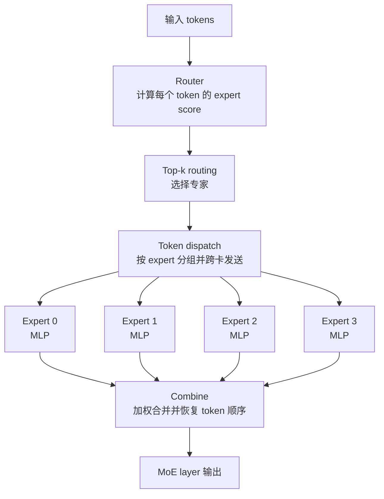
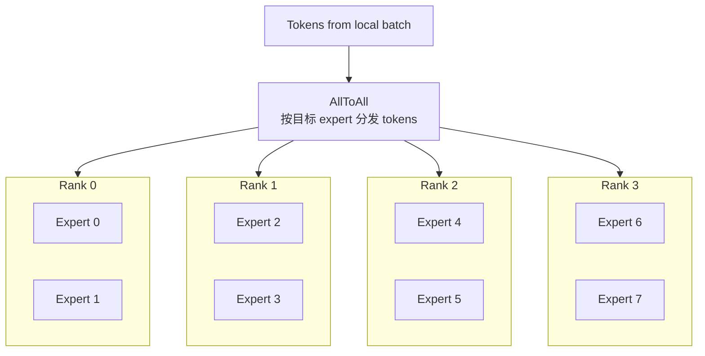

# Expert Parallel 与 MoE 训练

Dense Transformer 中，每个 token 都经过同一套 MLP 参数。MoE Transformer 中，MLP 被替换成多个 expert，每个 token 只选择其中少数几个 expert 计算。

一句话理解：

> MoE 训练用“条件计算”扩大模型参数量：模型里有很多 expert，但每个 token 只激活少数 expert；Expert Parallel 则把这些 expert 分布到多张 GPU 上，并负责 token 的跨卡分发和回收。

MoE 的诱惑很明显：参数量可以大幅增加，但每个 token 的计算量不按专家总数线性增长。MoE 的系统难点也很明显：token 路由是动态的，不同 expert 收到的 token 数不稳定，训练时还要处理前向、反向、梯度、负载均衡和通信。

## Dense MLP 和 MoE MLP 的差别

普通 Transformer block 里的 MLP 大致是：

```text
X -> Linear up/gate -> activation -> Linear down -> Y
```

所有 token 都走同一个 MLP。

MoE 把这个 MLP 换成多个 expert：

```text
Expert 0: 一个 MLP
Expert 1: 一个 MLP
Expert 2: 一个 MLP
...
Expert E-1: 一个 MLP
```

每个 token 先经过 router，router 决定它送到哪些 expert：

```text
token -> router -> top-k experts -> expert MLP -> combine -> output
```

最常见的是 top-1 或 top-2 routing：

- top-1：每个 token 只送到 1 个 expert。
- top-2：每个 token 送到 2 个 expert，再按权重组合结果。

## MoE 层的前向流程

一个 MoE layer 的 forward 可以拆成 6 步：

1. Router 为每个 token 计算 expert score。
2. 选择 top-k expert。
3. 按 expert 把 token 分组。
4. 把 token dispatch 到对应 expert 所在 GPU。
5. 每个 expert 对收到的 token 做 MLP。
6. 把 expert 输出 combine 回原 token 顺序。



Dense MLP 的计算形状通常比较规整。MoE 的麻烦在于：每个 expert 收到多少 token，是由当前 batch 的 router 结果决定的。

## Expert Parallel 是什么

如果所有 expert 都放在每张 GPU 上，参数会大量重复，显存浪费很大。

Expert Parallel 的思路是把 expert 切到不同 GPU：

```text
Rank 0: Expert 0, Expert 1
Rank 1: Expert 2, Expert 3
Rank 2: Expert 4, Expert 5
Rank 3: Expert 6, Expert 7
```

每个 rank 只保存自己负责的 expert。token 如果被路由到远端 expert，就要通过通信发过去。



Expert Parallel 的核心通信通常是 AllToAll：

- 每个 rank 有一批本地 token。
- router 决定这些 token 应该去哪些 expert。
- expert 分布在不同 rank 上。
- 所以每个 rank 都可能给其他 rank 发送 token。
- expert 计算完成后，还要把结果发回原来的 token 位置。

## EP size 和每卡专家数

EP size 是一个 expert parallel group 里的 rank 数。

假设总专家数是 `num_experts = 64`：

```text
EP size = 8
每个 rank 保存 64 / 8 = 8 个 experts
```

如果：

```text
EP size = 64
每个 rank 保存 1 个 expert
```

EP size 影响几个关键问题：

| 项 | EP size 小 | EP size 大 |
| --- | --- | --- |
| 每卡专家参数 | 多 | 少 |
| 单卡 expert 显存 | 高 | 低 |
| AllToAll 通信范围 | 小 | 大 |
| 每个 expert 的本地 batch | 可能较大 | 可能较小 |
| 负载不均影响 | 相对缓和 | 更明显 |
| 跨节点风险 | 较低 | 更高 |

所以“大 EP”不是天然更好。它降低每卡 expert 权重，但扩大通信域，可能让 AllToAll 成为瓶颈。

## Router 做了什么

Router 通常是一个很小的线性层或打分模块：

```text
scores = X W_router
```

它给每个 token 产生对每个 expert 的分数，然后选择 top-k。

例如 top-2 routing：

```text
token A -> Expert 3, Expert 9
token B -> Expert 1, Expert 3
token C -> Expert 7, Expert 2
```

Router 的输出不只是 expert id，还包括 combine 权重。top-2 时，一个 token 的两个 expert 输出通常会按 router 权重加权求和。

系统上，router 会带来几个问题：

- top-k 选择会产生动态 token 分布。
- 不同 expert 负载可能差异很大。
- token 需要按目标 expert 排序或分桶。
- dispatch/combine 需要保存映射关系，backward 时还要反向使用。
- router 本身也要训练，且容易不稳定。

## 为什么需要负载均衡

如果 router 总是把 token 送到少数几个 expert，就会出现两类问题。

第一，系统问题：

```text
Expert 0: 5000 tokens
Expert 1: 4800 tokens
Expert 2: 100 tokens
Expert 3: 80 tokens
```

负责 Expert 0/1 的 GPU 会非常忙，其他 GPU 在等。MoE layer 的时间由最忙 expert 决定。

第二，训练问题：

- 热门 expert 更新很多。
- 冷门 expert 很少被训练。
- 模型容量没有被充分利用。
- router 可能越来越偏向少数 expert。

因此 MoE 训练通常会引入 load balancing loss 或 auxiliary loss，让 router 更均匀地使用 expert。

这不是为了“形式上平均”，而是为了让系统吞吐和模型训练都稳定。

## Capacity factor 和 token dropping

为了避免某个 expert 被无限多 token 塞满，MoE 常设置 expert capacity。

可以粗略理解为：

```text
每个 expert 最多接收多少 token
  = 理想平均 token 数 * capacity factor
```

如果某个 expert 超过容量，多出来的 token 可能被：

- drop。
- reroute 到其他 expert。
- 保留但触发 padding/溢出处理。
- 在 dropless MoE 中通过动态形状或更复杂调度处理。

capacity factor 的取舍：

| 设置 | 结果 |
| --- | --- |
| 太小 | token 容易被 drop，影响训练质量 |
| 太大 | padding 和显存浪费增加，最忙 expert 仍可能拖慢系统 |
| dropless | 保留 token，但需要更复杂的动态调度和通信 |

对于刚入门的系统工程师，先记住：capacity 是 MoE 在“训练质量、负载均衡、显存、通信和实现复杂度”之间的一个控制阀。

## Token dispatch 和 combine

MoE layer 里最系统化的部分就是 dispatch/combine。

Forward：

1. 记录每个 token 的原始位置。
2. 根据 router 结果计算目标 expert。
3. 按目标 expert 重排 token。
4. 跨 rank AllToAll 发送 token。
5. 每个 expert 计算输出。
6. 把输出 AllToAll 发回。
7. 按原始 token 顺序 combine。

Backward：

1. 从输出 gradient 开始。
2. 按 forward 保存的映射拆分到 expert 输出。
3. 反向 AllToAll 发送 gradient。
4. 计算 expert 参数梯度和输入梯度。
5. 把输入梯度 combine 回原 token 位置。
6. 计算 router 相关梯度。

所以 MoE 不是只有 forward AllToAll。训练时 forward 和 backward 都会受到 dispatch/combine 的影响。

## AllToAll 为什么容易成为瓶颈

AllToAll 和 AllReduce 的形态不同。

AllReduce 里，大家通常对同形状数据做规约。AllToAll 里，每个 rank 要给每个其他 rank 发送不同片段的数据。

MoE AllToAll 还有几个额外难点：

- 每个 expert 的 token 数可能不同。
- token 分布随 batch 动态变化。
- 消息大小可能不均匀。
- 跨节点 AllToAll 对网络拓扑敏感。
- AllToAll 前后常伴随 permute/unpermute。
- expert 计算可能因为 token 数不均而出现 straggler。

这就是为什么 MoE 训练经常需要专门优化 dispatcher，而不是简单调用一次 collective 就结束。

## Expert 计算的形状问题

每个 expert 本质上通常是一个 MLP。但每个 expert 收到的 token 数可能不同：

```text
Expert 0: [tokens_0, hidden]
Expert 1: [tokens_1, hidden]
Expert 2: [tokens_2, hidden]
```

如果 `tokens_i` 很小，单个 expert GEMM 可能太小，GPU 利用率不好。

常见处理方向：

- 把多个 expert 的计算合并成 grouped GEMM。
- 对 token 做排序和 padding，让形状更规整。
- 使用 fused permute / unpermute。
- 对 expert 进行合理放置，减少跨节点通信。
- 调整 batch、sequence length、EP size、top-k，让每个 expert 有足够 token。

MoE 的性能经常不是卡在单个 MLP FLOPs，而是卡在“token 太碎、通信太乱、expert 负载不均”。

## Top-1 和 Top-2 的系统取舍

Top-1 routing：

- 每个 token 只去一个 expert。
- dispatch 通信量较小。
- expert 计算量较低。
- combine 更简单。
- 但表达能力和路由冗余较低。

Top-2 routing：

- 每个 token 去两个 expert。
- 通信和计算大致增加。
- combine 更复杂。
- 但每个 token 有更多 expert 参与，训练可能更稳。

从系统角度，top-k 直接影响：

```text
发送 token 数量
expert MLP 计算量
combine 成本
activation 显存
backward 通信
```

所以 MoE 配置中的 `top_k` 不是纯模型结构参数，也是训练系统参数。

## MoE 和 Data Parallel 的关系

Data Parallel 下，每个 DP rank 处理不同数据。MoE 下，每个 rank 内的 token 又会被路由到不同 expert。

常见组合是：

```text
DP group:
  多个模型副本处理不同数据

EP group:
  每个副本内部，experts 分布在多个 rank
```

如果 EP group 内的 expert 是一份模型副本的一部分，那么多个 DP 副本之间仍然需要同步梯度或使用 sharded optimizer。

需要注意：

- Expert 参数只在拥有该 expert 的 rank 上计算梯度。
- 非 expert 参数，例如 attention、router、layernorm，可能仍然按 DP/TP/FSDP 方式处理。
- 不同并行组的交叉关系会影响 optimizer state、checkpoint 和通信。

## MoE 和 Tensor Parallel 的关系

Expert 本身也可以很大。一个 expert MLP 内部仍然可能需要 Tensor Parallel。

常见组合：

```text
EP:
  把不同 expert 放到不同 rank

TP:
  把单个 expert 的 MLP 矩阵再切到多个 rank
```

这会带来更复杂的通信：

- EP 需要 token AllToAll。
- TP 需要层内 AllReduce / AllGather / ReduceScatter。
- 两者的 rank group 需要精心设计。

如果 expert MLP 不大，可能不需要对 expert 内部再做 TP。否则 TP 可以降低单 expert 显存和计算压力。

## MoE 和 Pipeline Parallel 的关系

MoE 层可以放在某些 pipeline stage 内。

问题在于：MoE 层的耗时不稳定，取决于当前 batch 的 token 路由。如果某个 stage 包含重 MoE 层，它可能成为 pipeline straggler。

设计时要考虑：

- 每个 PP stage 有多少 MoE 层。
- MoE 层是否和 dense 层均匀分布。
- 不同 stage 的 AllToAll 是否跨节点。
- MoE dispatch 是否和 pipeline send/recv 争用网络。
- MoE 层的动态耗时是否放大 pipeline bubble。

MoE + PP 的难点不只是把层放下，还要控制每个 stage 的时间波动。

## 训练稳定性问题

MoE 训练比 dense model 更容易出现不稳定，原因包括：

- router 早期偏向少数 expert。
- 某些 expert 训练不足。
- load balancing loss 权重不合适。
- capacity 太小导致 token dropping 太多。
- top-k、router softmax、噪声策略影响梯度。
- mixed precision 下 router 或 expert 计算数值不稳。

系统工程师不一定要设计新的 router，但要知道这些现象会反映到系统指标里：

- 某些 expert token count 长期过高。
- 某些 expert 几乎没有 token。
- step time 波动很大。
- loss spike 和 token dropping 相关。
- 某个 rank 长期成为 straggler。

因此 MoE 训练需要同时记录模型侧指标和系统侧指标。

## 常见优化方向

### 拓扑感知 expert placement

把频繁通信的 EP group 放在合适的网络拓扑内。小规模时尽量节点内；大规模时要考虑节点、交换机、rail、NIC 和 rank mapping。

### 优化 token dispatcher

dispatch/combine 经常包含 permute、split、AllToAll、grouped GEMM、unpermute。优化方向包括 fused permute/unpermute、减少中间拷贝、动态 shape 支持和更高效的通信分块。

### 使用 grouped GEMM

多个 expert 各自做小 GEMM 可能效率很差。Grouped GEMM 可以把多个不同 expert 的 GEMM 合并调度，提高 GPU 利用率。

### 调整 EP size

EP size 太小，每卡 expert 参数多。EP size 太大，AllToAll 通信范围变大，每个 expert 的 token 可能更少。需要结合显存、网络和 expert GEMM 效率调。

### 负载均衡调参

关注 load balance loss、router z-loss、capacity factor、token dropping rate、每 expert token count。MoE 性能问题经常来自路由分布，而不是单纯 kernel 慢。

### 避免跨节点小消息碎片

如果每个 expert token 数很小，但 EP group 跨了很多节点，AllToAll 会变成大量小消息，延迟和调度开销很高。需要调整 batch、sequence、EP size 或 placement。

## Benchmark 时看什么

MoE 训练 benchmark 至少要记录：

| 指标 | 作用 |
| --- | --- |
| Step time | 总训练速度 |
| MoE layer time | MoE 是否成为瓶颈 |
| AllToAll time | token dispatch/combine 通信成本 |
| Permute/unpermute time | token 重排开销 |
| Grouped GEMM efficiency | expert 计算是否足够大 |
| Tokens per expert | 负载是否均衡 |
| Dropped token rate | capacity 是否太小 |
| Load balance loss | router 是否均匀使用 expert |
| Expert straggler | 是否某些 expert 拖慢整体 |
| Peak memory | expert 权重、activation、buffer 是否顶满 |

还要固定：

- `num_experts`。
- `top_k`。
- `EP size`。
- `TP size`。
- `PP size`。
- global batch 和 micro-batch。
- sequence length。
- capacity factor。
- 是否 dropless。
- router loss 权重。
- rank mapping。

否则不同 MoE 配置之间很难公平比较。

## 常见误区

### 误区一：MoE 参数多，所以计算也一定按参数量线性增加

MoE 是 sparse activation。总参数很多，但每个 token 只激活少数 expert。计算量主要看 top-k、hidden/intermediate size 和 token 数，而不是 expert 总数本身。

### 误区二：EP size 越大越好

EP size 大可以降低每卡 expert 参数，但 AllToAll 通信范围变大，expert token 可能变少，跨节点代价会上升。

### 误区三：只看平均 tokens per expert

平均值不够。最慢 expert 和最慢 rank 才决定 step time。要看分布、最大值、尾部和随时间变化。

### 误区四：load balance loss 只是模型指标

它也是系统指标。router 不均衡会直接造成 straggler、AllToAll 不均和 GPU idle。

### 误区五：MoE 只需要优化 AllToAll

AllToAll 很重要，但 permute/unpermute、grouped GEMM、padding、capacity、router、backward、checkpoint 都会影响端到端训练。

## 设计检查表

设计 MoE 训练系统时，可以逐项检查：

- MoE 层替换的是哪些 dense MLP？每隔几层一个 MoE？
- `num_experts`、`top_k`、capacity factor 如何设置？
- EP group 多大？是否跨节点？
- 每个 rank 保存几个 expert？
- 每个 expert 的 token 数是否足够让 GEMM 高效？
- token dispatch/combine 是否使用高效 AllToAll 和 fused 重排？
- 是否记录 tokens per expert、drop rate、load balance loss？
- MoE 层是否造成 PP stage 不均？
- Expert 参数是否还需要 TP 或 FSDP？
- checkpoint 是否正确保存 expert、router 和 optimizer states？
- profiler 中 MoE 时间主要花在 AllToAll、permute 还是 GEMM？

## 小结

MoE 训练的核心是条件计算：模型拥有很多 expert，但每个 token 只走少数 expert。Expert Parallel 把 expert 分布到多张 GPU 上，让每张 GPU 只保存一部分 expert 权重。

系统上，MoE 的关键难点是动态 token 分发：

- router 决定每个 token 去哪里。
- dispatch/combine 把 token 发到 expert 并收回结果。
- AllToAll 和 token 重排可能成为瓶颈。
- expert 负载不均会造成 straggler。
- capacity、drop、load balance loss 同时影响质量和性能。
- EP 要和 TP、PP、DP/FSDP 一起设计。

判断 MoE 训练系统好坏，不能只看参数规模。要看 step time、AllToAll、tokens per expert、drop rate、expert GEMM 效率、负载均衡和长期训练稳定性。

## 参考资料

- [GShard: Scaling Giant Models with Conditional Computation and Automatic Sharding](https://arxiv.org/abs/2006.16668)
- [Switch Transformers: Scaling to Trillion Parameter Models with Simple and Efficient Sparsity](https://arxiv.org/abs/2101.03961)
- [Megatron Core: Mixture of Experts package](https://docs.nvidia.com/megatron-core/developer-guide/latest/api-guide/moe.html)
- [DeepSpeed: Mixture of Experts Tutorial](https://www.deepspeed.ai/tutorials/mixture-of-experts/)
