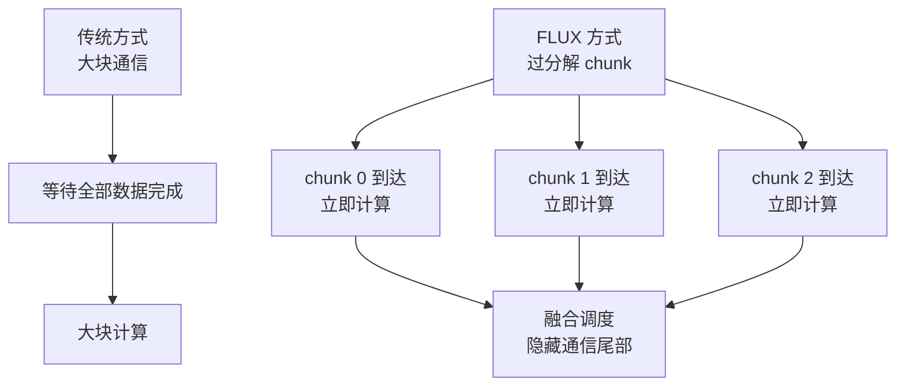

# FLUX 通信重叠与 Kernel Fusion

前一节讲的通信重叠，多数是 stream-level 或 bucket-level 的：一个通信 collective 启动后，系统希望还有其他计算可以继续执行。

FLUX 关注的是更难的一类问题：通信结果本身就是后续计算的输入，普通异步通信很难隐藏。

一句话理解：

> FLUX 的核心目标，是把依赖通信和依赖计算拆成更细粒度，再融合进更大的 GPU kernel，让一部分数据到达后就能立刻继续计算，从而隐藏原本暴露在关键路径上的通信。

它不是简单地“把 AllReduce 放到另一个 stream”。它更接近 kernel-level 的通信计算协同。

## 为什么传统 overlap 不够

普通 overlap 的理想情况是：

```text
通信 A 正在进行
同时计算 B
计算 B 不依赖通信 A 的结果
```

这很好理解。问题是 Tensor Parallel、某些 MoE dispatch、分布式 GEMM 等场景里，后续计算往往依赖通信结果。

例如 Tensor Parallel 中一个简化模式：

```text
local GEMM -> collective communication -> next GEMM / activation
```

如果下一个计算必须等 collective 全部完成，timeline 会变成：

```text
compute:       [======]
communication:       [----------]
next compute:                   [======]
```

这时即使用 async collective，后续计算也不能提前开始，因为它需要通信结果。

## FLUX 解决的是什么问题

FLUX 针对的是“有依赖的通信-计算链路”。

传统做法把通信和计算看成大块：

```text
整个 tensor 通信完成 -> 整个 tensor 继续计算
```

FLUX 的思路是把它拆小：

```text
chunk 0 通信完成 -> chunk 0 继续计算
chunk 1 通信完成 -> chunk 1 继续计算
chunk 2 通信完成 -> chunk 2 继续计算
...
```

然后进一步把这些细粒度操作融合到一个更大的 kernel 调度里，减少大量小 kernel 和小通信带来的额外开销。



关键变化是：不是等整块通信完成，而是让可用数据尽早进入后续计算。

## Over-decomposition 是什么

Over-decomposition 可以理解为“过分解”。

原本一个大操作：

```text
Collective(Tensor) + GEMM(Tensor)
```

被拆成多个更小单元：

```text
Collective(chunk 0) + GEMM(chunk 0)
Collective(chunk 1) + GEMM(chunk 1)
Collective(chunk 2) + GEMM(chunk 2)
...
```

这样做的好处：

- 通信不必等整块 tensor 全部完成。
- 后续计算可以按 chunk 提前启动。
- 通信尾部更容易被计算覆盖。
- 更适合处理依赖路径上的通信。

坏处也明显：

- chunk 太小会降低 kernel 效率。
- 调度开销可能变大。
- 需要管理更多同步和 buffer。
- 需要对数据布局和硬件拓扑更敏感。

所以 FLUX 不只是“拆小”，还要再通过 kernel fusion 把细粒度操作重新组织起来。

## Kernel Fusion 为什么重要

如果只把通信和计算拆成很多小块，但每个小块都单独 launch kernel，性能可能反而变差。

原因包括：

- kernel launch 开销增加。
- 小 GEMM 或小 copy 效率低。
- GPU occupancy 不稳定。
- 调度器和通信库开销上升。
- 中间结果频繁读写 global memory。

Kernel fusion 的目标是把这些细碎操作合并到更大的 GPU kernel 中，让 GPU 以更高效率执行。

FLUX 的论文标题里强调 “Through Kernel Fusion”，原因就在这里：细粒度 overlap 需要 fusion 来避免碎片化开销。

## 和普通 fused kernel 的区别

普通 kernel fusion 常见目标是减少内存读写：

```text
matmul -> bias -> activation
```

融合后避免中间 tensor 落到 global memory。

FLUX 关注的不只是本地算子融合，而是分布式通信和后续计算之间的融合：

```text
communication chunk arrival -> dependent compute chunk
```

也就是说，它把通信进度纳入 kernel 级别的执行安排。

这对训练系统很重要，因为传统编译器或算子融合通常只看到单卡算子，不一定能跨 collective 做优化。

## 典型适用场景

### Tensor Parallel

Tensor Parallel 是 FLUX 的典型场景。TP 中每层可能有 AllReduce、AllGather、ReduceScatter，这些通信常处在依赖路径上。

例如：

```text
partial output -> AllReduce -> next operation
```

如果必须等整个 AllReduce 完成，通信暴露明显。FLUX 类方法希望更细粒度地让 partial result 到达后继续后续计算。

### MoE / Expert Parallel

MoE 中 token dispatch/combine 可能用 AllToAll。token 分发后要进入 expert GEMM，expert 输出还要 combine 回去。

如果可以让部分 token 到达后先执行 expert compute，就有机会隐藏 AllToAll 的一部分尾部。

FLUX 仓库也提到它支持 dense/MoE 场景，后续还发布了面向 MoE 的 COMET。

### 推理 Prefill / Decode

虽然本章关注训练，FLUX 论文也评估了推理场景。推理里的 TP 通信、prefill 大 GEMM、decode 小 batch/低延迟路径都可能受到通信暴露影响。

这说明 FLUX 的思想不是训练专属，而是面向 GPU 分布式执行的一类优化。

## 它和前一节 overlap 的关系

前一节讲的是通用层次：

```text
bucket / stream / async collective / profiler timeline
```

FLUX 更靠近底层：

```text
chunk / fused kernel / dependent communication-computation overlap
```

可以这样区分：

| 层次 | 优化对象 | 典型问题 |
| --- | --- | --- |
| Bucket-level overlap | DDP/FSDP 梯度 bucket | backward 还有计算可做时提前通信 |
| Stream-level overlap | 通信 stream 与计算 stream | async 后是否有独立计算 |
| Kernel-level overlap | 通信和依赖计算的细粒度融合 | 后续计算依赖通信结果 |
| FLUX 类方法 | chunk + fused kernel + 分布式依赖 | TP/MoE 等依赖通信暴露 |

FLUX 不是替代所有 overlap 方法，而是在传统 overlap 不够时提供更细粒度的方向。

## 为什么它依赖硬件和实现

FLUX 类优化对硬件和软件栈要求高。

需要考虑：

- GPU 架构。
- NVLink / NVSwitch / PCIe / IB 拓扑。
- 通信库能力。
- kernel 中如何等待或消费远端数据。
- buffer layout。
- dtype。
- GEMM tile shape。
- occupancy。
- register/shared memory 压力。
- 是否使用 NVSHMEM 或类似机制。

这类优化不是简单 Python 层调参。它通常需要 CUDA/C++ kernel、通信原语、调度策略和框架集成。

## 为什么不能无脑使用

FLUX 解决的是特定瓶颈：依赖通信暴露。

如果训练瓶颈是：

- 数据管线慢。
- optimizer step 慢。
- activation checkpointing 重算太多。
- GEMM 本身算力不足。
- FSDP 参数 all-gather 太碎。
- PP stage 不均。

那么 FLUX 不一定解决根因。

即使瓶颈是通信，也要看它是否属于 FLUX 擅长的通信：

- 是否在 TP/MoE 等依赖路径上？
- 通信尾部是否明显？
- 有无足够计算可以覆盖通信？
- chunk 后的计算是否仍然高效？
- 融合后是否增加太多寄存器、共享内存或同步开销？

## Benchmark 时看什么

评估 FLUX 类优化，不能只看单个 kernel 加速。至少要看：

| 指标 | 作用 |
| --- | --- |
| End-to-end step time | 训练是否真的变快 |
| Exposed communication time | 通信暴露是否下降 |
| Fused kernel time | 融合 kernel 是否高效 |
| GEMM efficiency | chunk 后计算效率是否受损 |
| Occupancy | kernel 是否因资源压力下降 |
| Network utilization | 通信是否仍是瓶颈 |
| Memory bandwidth | fusion 是否减少或增加访存压力 |
| TP/MoE layer time | 目标层是否改善 |
| MFU | 全局模型 FLOPs 利用率 |
| Correctness | 数值是否和 baseline 对齐 |

还要做 ablation：

- 原始 Megatron/vLLM 或框架 baseline。
- 只开普通 overlap。
- 开 FLUX fused kernel。
- 不同 TP/EP size。
- 不同 batch/sequence。
- 不同互连拓扑。

如果只在单个 microbenchmark 上变快，但端到端 step time 没变，就不能说明训练系统真的受益。

## 常见优化方向

### 找准依赖通信

先用 profiler 找出通信是否在关键路径上。FLUX 适合处理后续计算依赖通信结果的场景，而不是所有通信。

### 控制 chunk 粒度

chunk 太大，overlap 空间不足。chunk 太小，kernel 和通信效率下降。合理 chunk 粒度是性能关键。

### 保持 GEMM 形状高效

过分解后，单个计算片段不能小到 Tensor Core 跑不起来。chunk 划分要兼顾通信隐藏和矩阵乘效率。

### 减少中间内存读写

Fusion 应该尽量避免把中间结果反复写回 global memory。否则通信隐藏的收益可能被访存开销抵消。

### 做拓扑感知

FLUX 类优化常用于高频通信场景。TP group、EP group、节点内互连和跨节点网络都会影响收益。

## 常见误区

### 误区一：FLUX 就是异步通信

不对。异步通信只是普通 overlap 的基础。FLUX 强调细粒度分解和 kernel fusion，用来处理依赖通信。

### 误区二：kernel fusion 一定更快

不一定。fusion 可能增加寄存器压力、降低 occupancy、破坏高效 GEMM 形状。要看实际 profiler。

### 误区三：FLUX 能解决所有分布式训练通信

不能。它更适合 TP/MoE 等依赖通信明显的路径。DP/FSDP bucket overlap、PP stage balance、网络拓扑等问题仍要单独处理。

### 误区四：只看 overlap 百分比

overlap 百分比高不代表端到端训练快。要看 step time、MFU、目标层耗时和数值正确性。

### 误区五：训练和推理收益可以直接类比

训练有 backward、optimizer、gradient sync 和 activation 保存；推理有 prefill/decode、KV cache 和调度。FLUX 思想可复用，但收益路径不同。

## 设计检查表

考虑 FLUX 类优化前，可以逐项检查：

- 当前瓶颈是否是 TP/MoE 等依赖通信？
- profiler 中是否有明显 exposed communication tail？
- 普通 bucket/stream overlap 是否已经尝试？
- 通信和后续计算是否能按 chunk 分解？
- chunk 后 GEMM 是否仍然高效？
- fused kernel 是否增加过多资源压力？
- 是否需要 NVSHMEM 或特定 GPU/互连支持？
- 和现有框架的 TP/EP/FSDP 进程组是否兼容？
- 数值结果是否和 baseline 对齐？
- 端到端 step time 是否真的下降？

## 小结

FLUX 是通信重叠里更底层、更激进的一类方法。它针对的是传统 async overlap 很难处理的依赖通信：后续计算必须等通信结果。

核心思想是：

- 把通信和计算拆成更细粒度 chunk。
- 让部分数据到达后尽早计算。
- 通过 kernel fusion 避免细粒度操作碎片化。
- 重点隐藏 TP/MoE 等路径上的 exposed communication。

学习 FLUX 的意义，不是立刻手写类似 kernel，而是建立一个判断框架：当普通 overlap 不够时，可以从 bucket/stream 层继续下探到 chunk/kernel 层，分析通信和计算是否有更细粒度交错空间。

## 参考资料

- [FLUX: Fast Software-based Communication Overlap On GPUs Through Kernel Fusion](https://arxiv.org/abs/2406.06858)
- [bytedance/flux GitHub repository](https://github.com/bytedance/flux)
- [通信与计算重叠](communication-computation-overlap.md)
