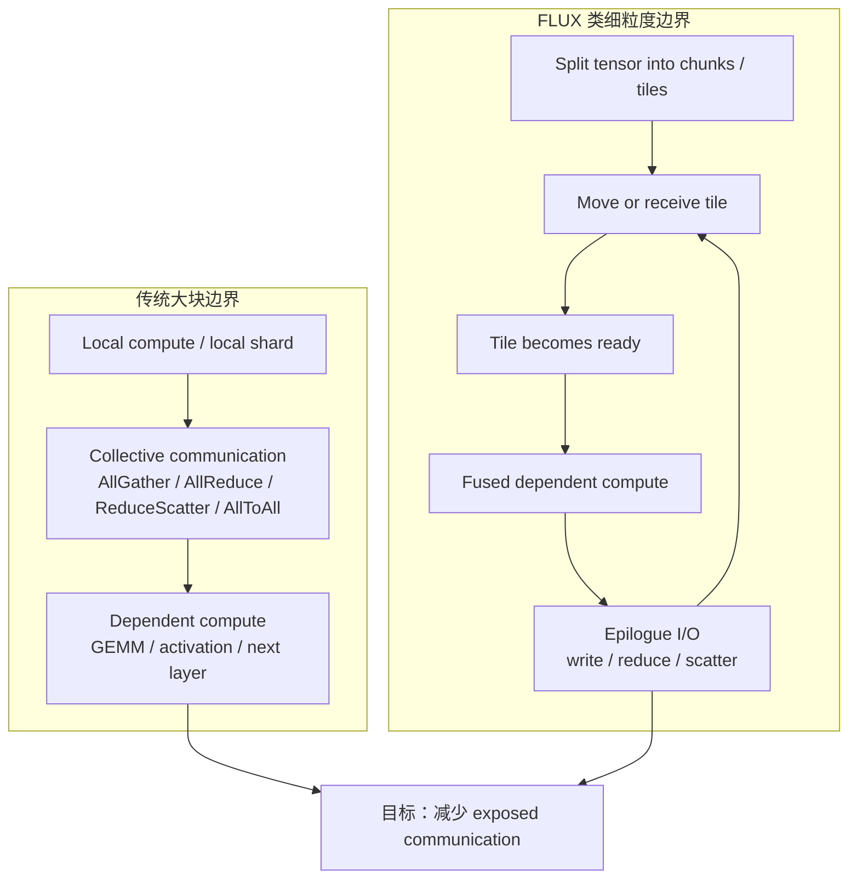

# FLUX 通信重叠与 Kernel Fusion

前一篇 [通信与计算重叠](communication-computation-overlap.md) 讲的是通用 overlap：

- DDP gradient bucket 和 backward 计算重叠。
- FSDP / ZeRO 参数 all-gather 和模块 forward 重叠。
- async collective 和不同 CUDA stream 重叠。
- 用 profiler 看 exposed communication time。

这些方法的前提通常是：

```text
通信正在进行时，还有另一段不依赖通信结果的计算可以执行。
```

FLUX 关注的是更难的一类问题：

```text
后续计算本身依赖通信结果。
```

例如 Tensor Parallel 中常见的链路：

```text
local GEMM -> AllGather / AllReduce / ReduceScatter -> next GEMM
```

如果下一个 GEMM 必须等通信完全结束，普通 async collective 很难把等待隐藏掉。

FLUX 的思路是：不要把通信和计算都看成一个大块，而是把它们拆成更细粒度的 chunk / tile，再把通信 I/O 和 GEMM 放进更紧密的 kernel 级协同里。

一句话理解：

> FLUX 是一种面向 GPU 分布式训练/推理的通信计算融合思路：把依赖通信和依赖计算细粒度化，并通过 kernel fusion / tile scheduling 让部分数据到达后尽快参与计算，从而减少关键路径上的通信等待。

它不是简单地“把 NCCL 放到另一个 stream”。它更接近：

```text
communication-aware GEMM kernel
```

或者：

```text
把通信进度纳入 GPU kernel 级执行计划
```

本篇从训练系统视角解释 FLUX：它解决什么问题，dense MLP 和 MoE 中分别怎么理解，为什么它依赖硬件/互连/实现，以及如何 benchmark。

## 先给结论

FLUX 适合下面这类瓶颈：

| 条件 | 含义 |
| --- | --- |
| 通信在关键路径上 | profiler 中能看到 AllGather、ReduceScatter、AllToAll 等等待暴露。 |
| 后续计算依赖通信结果 | 普通 stream overlap 没有足够独立计算可覆盖通信。 |
| 通信对象能切成 chunk / tile | 数据到达一部分后，可以先处理一部分。 |
| chunk 后的 GEMM 仍然高效 | 不能因为拆太小让 Tensor Core 利用率崩掉。 |
| 实现能把 I/O 和 GEMM 融合 | 否则大量小 kernel / 小通信会吞掉收益。 |

它不适合把所有训练瓶颈都往里面套。

如果瓶颈是：

- DataLoader 慢。
- optimizer step 慢。
- checkpoint 保存慢。
- activation checkpointing 重算过多。
- pipeline stage 不均衡。
- GPU 本地 GEMM 已经 compute-bound 且通信不暴露。

FLUX 类方法通常不是第一优先级。

学习 FLUX 的价值在于建立一个更底层的分析框架：

```text
当 bucket-level / stream-level overlap 不够时，
是否可以继续下探到 tile-level / kernel-level overlap？
```

## 传统 Overlap 的边界

普通 overlap 可以理解为时间轴上的并行。

理想情况：

```text
compute A:       [================]
communication B:      [----------]
```

只要通信 B 期间还有 compute A 可以继续，通信就有机会被隐藏。

训练里常见例子是 DDP backward：

```text
layer N backward
ready gradient bucket -> AllReduce starts
layer N-1 backward continues
```

AllReduce 还在跑时，backward 继续计算前面层的梯度。

但 TP / MoE / distributed GEMM 里经常出现另一种时间轴：

```text
local compute:   [=======]
communication:          [-----------]
dependent compute:                  [=======]
```

dependent compute 必须等待通信结果。

这时，即使 communication 是 async launch，也没有足够的独立计算覆盖它。

通信就暴露在关键路径上。

## 一个简单例子：AllGather 后接 GEMM

假设一个张量按 hidden 维度切在多个 GPU 上。

每张 GPU 只有输入的一部分：

```text
rank 0: X0
rank 1: X1
rank 2: X2
rank 3: X3
```

后面的 GEMM 需要完整输入：

```text
X = concat(X0, X1, X2, X3)
Y = X @ W
```

传统执行方式：

```text
AllGather X0..X3 -> 得到完整 X -> GEMM
```

时间轴是：

```text
AllGather: [-------------]
GEMM:                   [================]
```

如果 AllGather 很慢，GEMM 只能等。

FLUX 类思路会问：

```text
能不能 X 的一部分 gather 完，就先让对应 GEMM tile 开始？
```

也就是说：

```text
gather tile 0 -> compute tile 0
gather tile 1 -> compute tile 1
gather tile 2 -> compute tile 2
...
```

这样时间轴可能变成：

```text
AllGather tiles: [----][----][----][----]
GEMM tiles:           [====][====][====][====]
```

通信仍然存在，但不再完全挡在 GEMM 前面。

## 一个简单例子：GEMM 后接 ReduceScatter

另一个常见链路是：

```text
GEMM -> ReduceScatter
```

传统方式：

```text
完整 GEMM 输出完成 -> ReduceScatter 整个输出
```

时间轴：

```text
GEMM:          [================]
ReduceScatter:                 [-----------]
```

如果 GEMM 产生的是一块一块 tile，理论上每个 tile 计算完后，就可以把它写到对应 rank 或触发局部规约/散发逻辑。

FLUX 类实现会把通信 I/O 融合到 GEMM epilogue 或附近阶段：

```text
GEMM tile computed -> epilogue writes / reduces / scatters tile
```

这样可以减少：

- 完整输出 tensor 落地后的等待。
- 中间结果写回再读出的访存。
- GEMM 和 ReduceScatter 之间的大块同步边界。

## FLUX 的核心思想

可以把 FLUX 拆成三个关键词：

1. **Over-decomposition**：把原本大块通信和大块计算拆成更细粒度的 tile / chunk。
2. **Rescheduling**：调整 tile 的执行顺序，让依赖数据一到达就能被消费。
3. **Kernel Fusion**：把通信 I/O、copy、scatter/gather、GEMM epilogue 等融合进更少、更高效的 GPU kernel。

这三件事缺一不可。

只拆小而不融合，会产生大量小 kernel、小通信和同步，可能更慢。

只融合而不重排，可能仍然要等完整通信完成。

只重排而不考虑 GEMM tile shape，可能让 Tensor Core 跑不满。

FLUX 真正难的地方不是“有 overlap 这个想法”，而是在不破坏计算效率的前提下做细粒度 overlap。

## 总体数据流

下面的图对比传统执行和 FLUX 类执行。



核心不是消灭通信量。

通信量通常仍然存在。

目标是改变时间安排：

```text
减少通信等待暴露在关键路径上的比例。
```

## Dense MLP 场景

Transformer 的 MLP 通常包含两层大矩阵：

```text
hidden -> intermediate -> hidden
```

在 Tensor Parallel 中，这两层可能会引入 AllGather 或 ReduceScatter。

不同框架实现细节不同，但可以抽象成两个常见模式：

```text
MLP layer0: AllGather + GEMM
MLP layer1: GEMM + ReduceScatter
```

### MLP Layer0：AllGather + GEMM

传统写法：

```text
full_input = all_gather(input_shard)
output = gemm(full_input, weight)
```

问题：

- GEMM 要等 full_input。
- AllGather 和 GEMM 之间有大块同步边界。
- full_input 可能带来额外显存峰值。

FLUX 类思路：

```text
GEMM kernel 按 tile 工作
通信/拷贝在另一路径推进
某个 tile 依赖的数据 ready 后，相关 thread block 再计算
```

也就是说，GEMM 不必等整个 AllGather 结束才开始。

它可以对已经 ready 的 tile 先计算。

### MLP Layer1：GEMM + ReduceScatter

传统写法：

```text
partial_output = gemm(input, weight)
output_shard = reduce_scatter(partial_output)
```

问题：

- ReduceScatter 等完整 GEMM 结束。
- partial_output 可能先完整写入 global memory。
- 通信在 GEMM 后面暴露。

FLUX 类思路：

```text
GEMM tile 完成后，在 epilogue 或融合逻辑中直接处理远端写入 / reduce / scatter
```

这类融合可以让数据一产生就进入通信或规约路径。

它既减少同步边界，也可能减少中间 tensor 的读写。

## MoE 场景

MoE 层比 dense MLP 更复杂。

一个简化 MoE MLP 可能包含：

```text
router -> token dispatch -> grouped GEMM -> activation
-> grouped GEMM -> gather/combine -> reduce/scatter
```

通信主要来自：

- token dispatch。
- expert parallel group 内 AllToAll / AllGather。
- expert 输出 combine。
- top-k reduce。
- ReduceScatter。

传统 MoE 执行常常是多个大块顺序阶段：

```text
route tokens
communicate tokens
scatter tokens to experts
grouped GEMM
activation
grouped GEMM
gather expert outputs
combine top-k outputs
communicate back
```

问题是：

- token 分布不均会导致某些 expert 或 rank 拖尾。
- dispatch/combine 和 grouped GEMM 之间有大块边界。
- 细粒度 token 到达后不能及时被专家计算消费。
- coarse-grained overlap 可能损伤 GEMM 效率。

FLUX / COMET 这类 MoE 优化会把问题进一步拆开：

```text
部分 token 到达 -> 对应 expert tile 先算
部分 expert 输出完成 -> 尽早 gather / reduce
```

并通过调度把通信、scatter/gather、grouped GEMM 和 reduce 组织得更紧。

## MoE Layer0 与 Layer1 的直觉

可以把 MoE MLP 拆成两段。

### MoE Layer0

Layer0 大致是：

```text
tokens from ranks -> gather/scatter to experts -> grouped GEMM
```

传统方式：

```text
先把 token 都搬到位
再按 expert 分组
再执行 grouped GEMM
```

FLUX 类思路：

```text
token 分批到达
按 expert 分组的 tile 逐步 ready
ready 的 tile 先进入 grouped GEMM
```

关键是把 token 到达顺序、expert 分组和 GEMM tile 调度结合起来。

### MoE Layer1

Layer1 大致是：

```text
grouped GEMM -> gather expert outputs -> top-k combine -> reduce/scatter back
```

传统方式：

```text
所有 expert GEMM 完成
再 gather
再 combine
再通信回原 rank
```

FLUX 类思路：

```text
某些 expert output tile 完成后
尽早进入 gather / top-k reduce / reduce-scatter
```

这里更容易遇到异构负载和长尾：

- 不同 expert token 数不同。
- top-k 可能让一个 token 对应多个 expert 输出。
- combine 需要按原 token 顺序还原。
- token dropping / capacity limit 会影响形状。

因此 MoE 里的 fine-grained overlap 不只是通信优化，也是负载调度问题。

## FLUX、COMET 与 MoE

FLUX 项目本身支持 dense / MoE 模型的通信重叠 kernel。

项目 README 提到它提供可插拔 kernel，支持训练和推理中的多种 parallelism，也给出了 dense all-gather+GEMM、GEMM+reduce-scatter，以及 MoE grouped GEMM 相关示例。

COMET 可以看作更专门面向 MoE 的 fine-grained computation-communication overlap 系统。

从学习角度可以这样理解：

| 对象 | 关注重点 |
| --- | --- |
| FLUX | 通信 I/O 与 dense/MoE GEMM 的 kernel-level overlap。 |
| COMET | MoE 层里通信、dispatch、grouped GEMM、负载分配的细粒度重排。 |

不需要把它们记成两个孤立名词。

更重要的是掌握这类方法共同的系统思想：

```text
依赖通信不一定只能大块等待，
可以通过数据依赖分析、tile 调度和 fused kernel 把等待拆散。
```

## 为什么 Kernel Fusion 关键

假设你把一个大 tensor 拆成 128 个 chunk。

如果每个 chunk 都单独：

```text
launch communication
launch copy
launch GEMM
launch scatter
launch reduce
```

那就会出现大量开销：

- kernel launch 开销。
- 小 GEMM 效率差。
- 小通信效率差。
- 同步点变多。
- 中间 tensor 频繁读写 global memory。
- Python / framework 调度开销上升。

所以 fine-grained overlap 必须配合 fusion。

Fusion 的目标是：

- 让细粒度 I/O 不破坏 GEMM 主体效率。
- 减少中间结果落地。
- 减少 launch 和同步。
- 让 thread block / warp 调度能自然隐藏远端 I/O latency。

这也是为什么 FLUX 不是普通训练脚本层面的优化。

它通常需要 CUDA/C++、CUTLASS、NCCL、NVSHMEM、TMA、异步 copy、epilogue fusion 等底层能力。

## 它和普通 Fused Kernel 的区别

普通 fused kernel 常见形式：

```text
matmul -> bias -> activation
```

它的主要目标是减少本地 GPU 上的内存读写。

FLUX 类 fusion 的特殊点是：

```text
communication / remote I/O -> dependent GEMM
GEMM -> communication / remote I/O
```

它不是只融合本地算子，而是把分布式数据移动也纳入 kernel 设计。

这对编译器和 runtime 都更难。

原因是 collective 通信涉及：

- 多 rank 同步。
- process group。
- network topology。
- remote memory。
- 数据到达顺序。
- buffer 生命周期。
- 算法选择。

单卡编译器通常不天然掌握这些信息。

## 和 NCCL / NVSHMEM / CUTLASS 的关系

学习 FLUX 时容易把几个名字混在一起。

可以这样分：

| 名称 | 角色 |
| --- | --- |
| NCCL | 常用 GPU collective 通信库，提供 AllReduce、AllGather、ReduceScatter、AllToAll 等能力。 |
| NVSHMEM | GPU 端远程内存访问和 PGAS 编程模型，可用于更细粒度的远端 I/O。 |
| CUTLASS | NVIDIA 的高性能 GEMM / kernel 模板库，可用于构造高效矩阵乘 kernel。 |
| FLUX | 把通信 I/O 和 GEMM 等计算融合、重排、封装成可用 kernel 的库。 |

普通框架代码通常是：

```text
NCCL collective kernel
then CUTLASS/cuBLAS GEMM kernel
```

FLUX 类设计希望更紧：

```text
GEMM kernel 中感知或触发通信 I/O
通信 ready 后对应 tile 继续执行
```

具体实现会因 GPU 代际和互连方式不同而不同。

## Ampere 与 Hopper 的差异

这类优化高度依赖 GPU 架构。

以直觉理解：

Ampere 上，一个 kernel 往往有较多 thread blocks 可由 SM 调度器切换。当某些 thread block 遇到长延迟 I/O 时，SM 还有机会切到其他 ready block。

Hopper 上，TMA、warp specialization、cluster 等机制让高性能 GEMM 形成更精细的 producer/consumer pipeline。此时如果把长延迟远端 I/O 粗暴插进 epilogue，可能破坏原本高效的异步流水。

因此同一个“通信融合”想法，在不同 GPU 上可能需要不同实现：

- Ampere 可能更适合某些 epilogue 融合路径。
- Hopper 需要更注意 TMA pipeline、persistent kernel 和 warp specialization。
- 不同 dtype、tile shape 和 occupancy 会改变最优策略。

结论是：

```text
FLUX 类优化必须实测，不能只凭“融合更多就更快”判断。
```

## 它为什么和 Tensor Parallel 关系密切

Tensor Parallel 直接把单层矩阵运算切到多 GPU。

它的收益：

- 单卡放不下的层可以切开。
- 大 GEMM 可以并行。
- 单卡计算延迟可以降低。

代价：

- 每层或每几层会引入高频通信。
- 通信通常处在 forward/backward 关键路径上。
- TP group 内 GPU 互连质量直接影响收益。

传统 TP 里，通信可能是：

- Column Parallel 后的 AllGather / ReduceScatter。
- Row Parallel 后的 AllReduce。
- vocab parallel cross entropy 的 AllReduce。
- sequence parallel 的 AllGather / ReduceScatter。

这些通信不是偶尔发生，而是每层都会发生。

所以 TP 是 FLUX 这类方法最自然的场景之一。

如果 TP 通信不能隐藏，扩大 TP size 可能出现：

```text
单卡 GEMM 变小
通信占比上升
扩展效率下降
```

FLUX 试图缓解的就是这种 TP 通信暴露。

## 它为什么和 MoE 关系密切

MoE 的目标是扩大参数量，但每个 token 只激活部分 expert。

系统代价是 token routing 和 expert parallel 通信。

MoE 的典型问题：

- token dispatch/combine 通信重。
- expert token 分布不均。
- grouped GEMM 形状不稳定。
- AllToAll 或 gather/scatter 长尾明显。
- EP size 越大，通信范围和负载问题越突出。

这类问题非常适合 fine-grained overlap 的思想。

因为 MoE 的数据本来就是按 token / expert 分组，存在天然的细粒度任务：

```text
expert 0 的 token
expert 1 的 token
expert 2 的 token
...
```

如果等所有 expert 数据都到齐再算，就会被最慢路径拖住。

如果某些 expert 的 token ready 后就能先算，就有机会减少长尾。

但 MoE 也更难，因为它还要处理：

- top-k routing。
- token 排序和还原。
- capacity。
- dropped token。
- combine 权重。
- expert load imbalance。
- grouped GEMM tile shape。

因此 MoE 里的 FLUX/COMET 类优化，通常比 dense MLP 更依赖调度设计。

## 和大 EP / 小 EP 的关系

EP size 会影响 FLUX 类优化的收益路径。

小 EP：

- 通信范围小。
- 每个 rank 上 expert 权重更多。
- 通信压力较低，但显存压力较高。
- fine-grained overlap 的收益可能没那么明显。

大 EP：

- 每个 rank 放的 expert 更少。
- expert 权重显存下降。
- token dispatch 范围扩大。
- AllToAll / gather / scatter 更容易暴露。
- expert load imbalance 更明显。

因此大 EP 场景更容易需要 fine-grained MoE overlap。

但不能简单说“大 EP 一定要 FLUX”。

仍然要看：

- expert token 数分布。
- batch size。
- sequence length。
- top-k。
- capacity factor。
- GPU 互连。
- EP group 是否跨节点。
- grouped GEMM 是否还能高效。

相关内容见：[Expert Parallel 与 MoE 训练](expert-parallel-moe-training.md)

## 训练与推理中的差异

FLUX 论文和项目都覆盖训练和推理场景，但两者收益路径不完全一样。

训练中有：

- forward。
- backward。
- activation 保存或重算。
- gradient communication。
- optimizer step。
- mixed precision state。
- checkpoint。

推理中有：

- prefill。
- decode。
- KV cache。
- batching。
- SLO。
- streaming。
- request scheduling。

同样是 TP 通信暴露，训练和推理的优化目标不同：

| 场景 | 主要目标 |
| --- | --- |
| 训练 | 降低 step time，提高 MFU / tokens/s，保持数值正确。 |
| Prefill 推理 | 降低大 prompt 的批处理耗时，提高吞吐和 TTFT。 |
| Decode 推理 | 降低逐 token latency，提高小 batch 下的通信隐藏。 |

训练系统文章关注的是训练。

但推理里的 prefill/decode 也能帮助理解为什么 dependent communication 是一个普遍问题。

## 与上一层 Overlap 的关系

FLUX 不替代 bucket-level 或 stream-level overlap。

它是更底层的一层。

可以按层级理解：

| 层级 | 典型手段 | 解决的问题 |
| --- | --- | --- |
| 调度层 | 训练任务排队、资源隔离、eval 异步 | 集群资源等待。 |
| 框架层 | gradient bucket、prefetch、async collective | 通信和独立计算重叠。 |
| 并行策略层 | DP/FSDP/TP/PP/EP/SP/CP 组合 | 改变计算、显存、通信分布。 |
| kernel 层 | tile scheduling、epilogue fusion、remote I/O | 依赖通信和依赖计算的细粒度重叠。 |
| FLUX 类方法 | communication-aware GEMM / MoE kernel | TP/MoE 等通信暴露。 |

如果框架层 overlap 已经把通信盖住，FLUX 收益可能有限。

如果通信暴露来自依赖路径，FLUX 才更有意义。

## Profiler 里应该怎么看

考虑 FLUX 前，先用 profiler 证明问题存在。

重点看：

- TP / EP layer time。
- NCCL collective 是否在关键路径上。
- collective 后是否有明显空白等待。
- GEMM 是否被通信推迟。
- GPU kernel timeline 中是否存在大块同步边界。
- SM utilization 是否因等待通信下降。
- 网络 utilization 是否有长尾。
- 不同 rank 的 layer time 是否不均。

一个典型信号：

```text
AllGather 完成前，dependent GEMM 没法启动。
ReduceScatter 在 GEMM 后暴露，且后面没有足够计算覆盖。
MoE dispatch/combine 拖住 grouped GEMM。
```

如果 profiler 显示主要时间花在本地 GEMM，而且通信不暴露，那么先优化 GEMM、shape、batch 或 precision。

## Benchmark 设计

评估 FLUX 类优化不能只看一个 microbenchmark。

至少要分三层：

### 1. Kernel / Layer Microbenchmark

回答：

```text
目标 kernel 或目标层是否变快？
```

指标：

- fused kernel latency。
- GEMM TFLOPs。
- communication latency。
- exposed communication。
- occupancy。
- memory bandwidth。
- remote I/O time。
- register / shared memory pressure。
- correctness error。

### 2. Model Step Benchmark

回答：

```text
一个训练 step 是否变快？
```

指标：

- step time。
- tokens/s。
- MFU。
- TP/EP layer time。
- forward time。
- backward time。
- communication time。
- optimizer time。
- peak memory。

### 3. End-to-end Training Benchmark

回答：

```text
长期训练是否真的更划算？
```

指标：

- tokens/day。
- cost per token。
- stability。
- checkpoint overhead。
- eval cadence 下的有效吞吐。
- failure rate。
- run-to-run variance。

如果 microbenchmark 变快，但 step time 没变，需要继续定位是否被其他瓶颈掩盖。

## A/B 实验矩阵

建议至少比较：

| 实验 | 目的 |
| --- | --- |
| baseline framework | 原始 Megatron / vLLM / 自研框架路径。 |
| normal async overlap | 排除普通 overlap 已经足够的情况。 |
| FLUX dense kernel | 验证 dense MLP / TP 路径收益。 |
| FLUX MoE kernel | 验证 expert dispatch / grouped GEMM 路径收益。 |
| different TP sizes | 看 TP 通信暴露是否随 TP size 变化。 |
| different EP sizes | 看 MoE 通信和 expert load 是否改变收益。 |
| intra-node only | 区分 NVLink / NVSwitch 场景。 |
| cross-node | 检查 IB/RoCE 下收益是否仍成立。 |
| different sequence lengths | 看 prefill/long context 或训练 token shape 影响。 |
| different micro-batch | 看 GEMM shape 和 token count 对收益影响。 |

所有 benchmark 必须固定：

- model config。
- data shape。
- batch / sequence。
- precision。
- parallelism。
- rank mapping。
- warmup。
- measurement window。
- environment。
- commit。
- manifest。

## 数值正确性

FLUX 类优化会改变计算和通信的执行顺序。

它可能改变：

- 浮点规约顺序。
- epilogue 中的舍入时机。
- 中间结果写回时机。
- reduce / scatter 顺序。
- grouped GEMM 的 token 排列。

因此必须验证数值正确性。

常见检查：

- 与 baseline 输出做 `max_abs_diff` / `mean_abs_diff`。
- 对 forward output 比较。
- 对 backward gradient 比较。
- 对 optimizer step 后参数比较。
- 小模型短训练 loss 曲线对齐。
- MoE token combine 后 token 顺序正确。
- top-k combine 权重正确。
- dropped token / padding token 处理正确。

对于 BF16/FP16/FP8，不要期待每个 bit 都一样。

但误差必须在可解释范围内，并且长期训练稳定性不能下降。

相关内容见：[训练稳定性与数值异常](training-stability-numerical-debugging.md)

## 显存与 Buffer 生命周期

FLUX 类方法不只是算快，还可能改变显存结构。

需要关注：

- all-gather buffer 是否还需要完整保存。
- reduce-scatter buffer 是否减少。
- fused kernel 是否需要额外 staging buffer。
- remote I/O buffer 如何分配。
- MoE token scatter/gather buffer 是否复用。
- allocator 是否产生碎片。
- peak memory 是否下降或上升。

有时 fusion 会减少中间 tensor。

也有时为了 pipeline 和远端 I/O，需要额外 buffer。

所以 benchmark 里必须记录 peak memory 和 allocator 行为。

相关内容见：[显存组成与优化总览](memory-composition-optimization.md)

## 与编译器的关系

TorchInductor、XLA、TVM、Triton 等编译器擅长做本地图优化和算子融合。

但 FLUX 类问题跨越了：

- 多 rank。
- collective。
- remote I/O。
- process group。
- topology。
- CUDA stream。
- GEMM tile schedule。

这比普通 graph fusion 更复杂。

未来编译器可能会更好地表达 distributed tensor 和 collective schedule。

但在当前工程实践里，很多通信计算融合仍然需要专门库或手写 kernel。

相关内容见：

- [Triton Kernel 编程](../05-kernels-compilers/triton.md)
- [TorchInductor 与 PyTorch 编译栈](../05-kernels-compilers/torchinductor.md)

## 与硬件互连的关系

FLUX 的收益和互连强相关。

需要区分：

- PCIe。
- NVLink。
- NVSwitch。
- InfiniBand。
- RoCE。
- 跨机架网络。

一般来说：

- 节点内高速互连更适合高频 TP。
- 跨节点 TP/EP 通信更容易暴露网络长尾。
- 网络拥塞会放大 fine-grained schedule 的不稳定性。
- rank mapping 错误会吞掉所有 kernel 层优化收益。

因此 FLUX benchmark 不应该只报告 GPU 型号。

还要报告：

- 每节点 GPU 数。
- TP/EP group 是否跨节点。
- NVLink / NVSwitch 拓扑。
- IB/RoCE 带宽。
- NCCL 拓扑检测。
- rank mapping。
- 是否有其他任务竞争网络。

相关内容见：[RDMA 网络与 NCCL 拓扑](../07-cluster-infra/rdma-network-nccl-topology-congestion.md)

## 常见优化方向

### 1. 先定位依赖通信

不要一上来就集成 FLUX。

先回答：

```text
哪个 layer 的哪个 collective 暴露？
这个 collective 后面的计算是否依赖它？
```

如果只是普通 DDP gradient AllReduce 暴露，可能先调整 bucket size、backward overlap、网络和 rank mapping。

### 2. 控制 Chunk / Tile 粒度

chunk 太大：

- overlap 空间不足。
- 仍然接近大块等待。

chunk 太小：

- GEMM tile 低效。
- launch / synchronization 开销上升。
- remote I/O 太碎。
- metadata 管理复杂。

合理粒度要同时看通信隐藏和 Tensor Core efficiency。

### 3. 保持 GEMM 形状高效

过分解不能破坏核心 GEMM。

要关注：

- M/N/K 是否符合 Tensor Core tile。
- grouped GEMM 是否有太多小 expert。
- micro-batch 是否太小。
- sequence length 是否导致 token 数不足。
- MoE expert token 分布是否极不均。

### 4. 做 Rank Mapping

FLUX 类优化经常作用在 TP/EP group 内。

如果 TP/EP group 跨了不该跨的网络层级，kernel 层优化很难救。

建议：

- TP 优先放在节点内高速互连。
- EP 根据 expert 权重和 token dispatch 范围权衡。
- 大 EP 跨节点时重点看 AllToAll 长尾。
- 记录 rank mapping 到 Run Manifest。

### 5. 限制融合范围

不要把所有逻辑都塞进一个巨大 kernel。

过度 fusion 可能导致：

- register pressure 上升。
- occupancy 下降。
- 编译时间上升。
- debug 困难。
- dtype / shape 支持变窄。
- 硬件代际适配困难。

好的 fusion 是围绕关键路径做局部融合。

### 6. 保留 Baseline 路径

FLUX 类优化应该可以开关。

原因：

- 不同 shape 收益不同。
- 不同 GPU 代际收益不同。
- Debug 时需要回到 baseline。
- 数值异常时需要二分定位。
- 新框架版本可能改变原有瓶颈。

建议配置项清楚记录：

```yaml
flux:
  enabled: true
  dense_ag_gemm: true
  dense_gemm_rs: true
  moe_grouped_gemm: true
  min_tokens_per_expert: 128
  fallback_to_baseline: true
```

这只是示例，真实字段以具体实现为准。

## 常见误区

### 误区一：FLUX 就是异步通信

不是。

异步通信是 stream-level overlap 的基础。

FLUX 更强调：

- fine-grained data dependency。
- tile / chunk rescheduling。
- GEMM 与通信 I/O 的 kernel-level fusion。

### 误区二：只要通信占比高就适合 FLUX

不一定。

通信占比高要先看通信是否在 FLUX 擅长的依赖路径上。

例如：

- checkpoint 上传慢不是 FLUX 解决的问题。
- 数据加载慢不是 FLUX 解决的问题。
- DDP bucket 没和 backward 重叠好，优先调 bucket 和 overlap。
- 网络拥塞严重，先看拓扑和调度。

### 误区三：Fusion 一定更快

不一定。

Fusion 可能：

- 降低 occupancy。
- 增加寄存器压力。
- 破坏 GEMM tile。
- 增加编译复杂度。
- 缩小可支持 shape 范围。

必须用 profiler 证明。

### 误区四：Microbenchmark 变快就是训练变快

不一定。

训练 step 可能仍然被：

- data pipeline。
- activation recompute。
- optimizer。
- checkpoint。
- pipeline bubble。
- MoE load imbalance。

其他环节限制。

### 误区五：训练和推理收益可以直接照搬

不能。

推理 decode 常常是小 batch、低 latency。

训练常常是大 batch、大 GEMM、forward/backward 成对出现。

同一个 kernel 在两者中的收益路径不同。

### 误区六：忽略数值和可复现性

通信和计算顺序变化可能带来数值差异。

需要记录：

- kernel 版本。
- dtype。
- shape。
- rank mapping。
- random seed / RNG state。
- baseline diff。
- loss 曲线。

相关内容见：[训练可复现性、随机性与 Run Manifest](training-reproducibility-randomness-run-manifest.md)

## 落地检查表

考虑 FLUX 类优化前：

- [ ] profiler 确认通信暴露在关键路径上。
- [ ] 确认后续计算依赖通信结果。
- [ ] 确认普通 async / bucket overlap 不足。
- [ ] 确认目标层是 TP / MoE / distributed GEMM 等高频路径。
- [ ] 记录 baseline step time、layer time、MFU、tokens/s。
- [ ] 记录 TP/EP group 和 rank mapping。
- [ ] 记录 GPU、互连、CUDA、NCCL、CUTLASS、NVSHMEM、PyTorch 版本。

集成时：

- [ ] 保留 baseline fallback。
- [ ] 小 shape 和目标 shape 都测试。
- [ ] forward output 与 baseline 对齐。
- [ ] backward gradient 与 baseline 对齐。
- [ ] MoE token 顺序、top-k combine、padding/dropped token 正确。
- [ ] 记录 peak memory。
- [ ] 记录 compile/build flags。
- [ ] 记录 kernel 开关到 Run Manifest。

Benchmark 时：

- [ ] 做 kernel/layer microbenchmark。
- [ ] 做 model step benchmark。
- [ ] 做短训练稳定性验证。
- [ ] 比较不同 TP size。
- [ ] 比较不同 EP size。
- [ ] 比较节点内和跨节点。
- [ ] 比较不同 batch/sequence/token distribution。
- [ ] 用 profiler 证明 exposed communication 降低。
- [ ] 用端到端 step time 证明训练真正变快。

上线前：

- [ ] 明确 fallback 条件。
- [ ] 明确不支持 shape / dtype / GPU 架构。
- [ ] 明确异常时如何回退 baseline。
- [ ] 记录版本和 artifact。
- [ ] 监控 kernel error、NCCL error、NaN/Inf、tokens/s 回退。

## 小结

FLUX 的核心不是“多开一个通信 stream”，而是把依赖通信和依赖计算放到更细的粒度上重新组织。

它的关键思想是：

- 通信不一定只能大块等待。
- 数据到达一部分，就可以尝试处理一部分。
- 细粒度 overlap 必须配合 kernel fusion，否则开销会反噬。
- Dense MLP 中典型是 AllGather+GEMM、GEMM+ReduceScatter。
- MoE 中典型是 token dispatch、grouped GEMM、gather/combine、reduce/scatter 的细粒度重排。
- 收益高度依赖 TP/EP size、shape、互连、GPU 架构和实现质量。

对训练系统工程来说，FLUX 提供的是一个重要判断框架：

```text
当通信已经在依赖路径上暴露，且普通 overlap 不够时，
可以从框架层继续下探到 tile/kernel 层，
重新设计通信 I/O 和计算 tile 的执行关系。
```

## 参考资料

- [FLUX: Fast Software-based Communication Overlap On GPUs Through Kernel Fusion](https://arxiv.org/abs/2406.06858)
- [bytedance/flux GitHub repository](https://github.com/bytedance/flux)
- [bytedance/flux Design Doc](https://github.com/bytedance/flux/blob/main/docs/design.md)
- [bytedance/flux MoE Usage](https://github.com/bytedance/flux/blob/main/docs/moe_usage.md)
- [COMET: Fine-grained Computation-communication Overlapping for Mixture-of-Experts](https://arxiv.org/abs/2502.19811)
- [通信与计算重叠](communication-computation-overlap.md)
