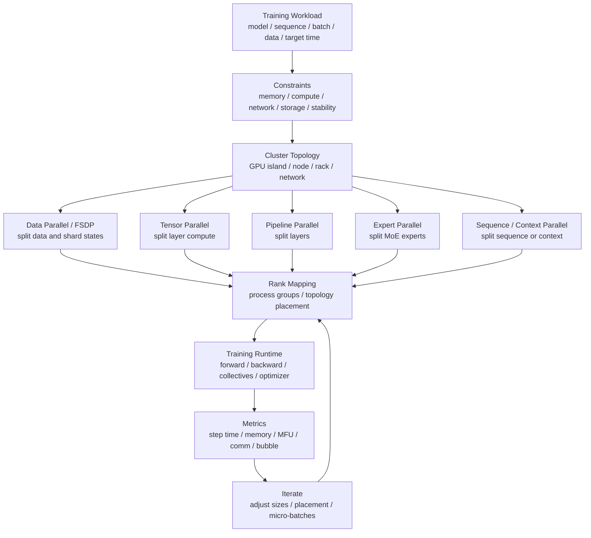

# 并行策略组合：3D/4D/5D Parallelism

前面几篇分别介绍了 Data Parallel、ZeRO/FSDP、Tensor Parallel、Pipeline Parallel、Expert Parallel、Activation Checkpointing、混合精度和通信重叠。

真实的大模型训练通常不是只用其中一种。

例如一个训练任务可能同时使用：

```text
Tensor Parallel + Pipeline Parallel + FSDP + Expert Parallel + Activation Checkpointing
```

这时最容易出错的问题不是“某一种并行策略是什么意思”，而是：

```text
这些并行维度应该怎么组合？
每个维度放多大？
哪些通信可以跨节点？
哪些通信必须尽量留在节点内？
为什么同样 256 张 GPU，一种配置很快，另一种配置很慢？
```

本篇重点回答这些问题。

## 一张总图



这张图想表达：

```text
并行策略组合不是数学排列组合，而是 workload 约束和硬件拓扑共同决定的工程设计。
```

## 先理解每个维度切的是什么

不同并行策略切分的是不同对象。

| 维度 | 切分对象 | 主要解决 | 主要代价 |
| --- | --- | --- | --- |
| Data Parallel | 数据 batch | 扩展吞吐 | 梯度同步、状态重复 |
| ZeRO / FSDP | 参数、梯度、optimizer state | 降低重复显存 | all-gather / reduce-scatter |
| Tensor Parallel | 层内矩阵、attention head、词表 | 单层计算和权重太大 | 高频 collective |
| Pipeline Parallel | 模型层 | 单卡放不下全部层 | pipeline bubble、stage 通信 |
| Expert Parallel | MoE experts | 专家权重和专家计算分布 | token dispatch、AllToAll、负载不均 |
| Sequence / Context Parallel | sequence 或 context 维度 | 长上下文 activation 和 attention 压力 | 序列相关通信、实现复杂 |

这几个维度不要混在一起理解。

Data Parallel 切的是“样本”。

Tensor Parallel 切的是“一层里面的矩阵计算”。

Pipeline Parallel 切的是“层”。

Expert Parallel 切的是“专家”。

Sequence / Context Parallel 切的是“序列维度或上下文状态”。

ZeRO / FSDP 更像 Data Parallel 维度上的状态切分方式：它不改变每个样本如何经过模型，但改变参数、梯度和 optimizer state 在 data-parallel group 里的存放方式。

## 3D Parallelism 是什么

很多资料会把下面三种并行组合称为 3D parallelism：

```text
Data Parallel x Tensor Parallel x Pipeline Parallel
```

直觉上：

- Data Parallel 复制或切分训练副本，用不同数据扩展吞吐。
- Tensor Parallel 把单层计算拆到多卡，解决层内矩阵太大或单卡算力不够。
- Pipeline Parallel 把不同层放到不同卡，解决模型深度和权重显存压力。

一个简化公式是：

```text
world_size = DP_size x TP_size x PP_size
```

例如 64 张 GPU：

```text
64 = DP 4 x TP 4 x PP 4
```

这表示：

- 4 个 data-parallel 副本。
- 每个副本内部有 4 个 pipeline stage。
- 每个 stage 内部用 4 张 GPU 做 tensor parallel。

但这个公式只是帮助沟通，真实框架还要创建多个 process group：

- TP group。
- PP group。
- DP / FSDP group。
- 有时还有 sequence parallel group、expert parallel group、context parallel group。

只会算乘法不够，关键是 rank group 怎么映射到物理 GPU。

## 4D / 5D Parallelism 为什么没有统一定义

3D 之后，不同系统对“第 4 维、第 5 维”的命名并不完全统一。

常见说法包括：

- 3D：DP + TP + PP。
- 4D：再加 Expert Parallel，用于 MoE。
- 4D：再加 Sequence Parallel 或 Context Parallel，用于长上下文。
- 5D：DP + TP + PP + EP + CP。
- 有些资料还会把 ZeRO/FSDP sharding 也作为一个重要维度讨论。

因此不要死记“4D 一定是什么”。

更好的理解方式是：

```text
多出来的维度，是为了解决新的瓶颈：
MoE 专家太多，就需要 EP；
上下文太长，就需要 SP/CP；
状态重复太大，就需要 ZeRO/FSDP。
```

## 一个 rank map 直觉

假设有 8 个节点，每个节点 8 张 GPU，共 64 张 GPU。

一个常见设计思路是：

```text
TP 尽量放在节点内高速互联中。
PP 可以跨节点，但要避免 stage 边界太差。
DP/FSDP 可以跨多个副本扩展。
```

例如：

```text
Node 0: pipeline replica A, stage 0, TP group 0..3
Node 0: pipeline replica A, stage 1, TP group 4..7

Node 1: pipeline replica A, stage 2, TP group 0..3
Node 1: pipeline replica A, stage 3, TP group 4..7

Node 2-3: pipeline replica B
Node 4-5: pipeline replica C
Node 6-7: pipeline replica D
```

这只是一个示意。

它背后的原则是：

- TP 通信频繁，尽量放在同节点高速 GPU fabric。
- PP 通信发生在 stage 边界，频率受 micro-batch 数量影响。
- DP/FSDP 通信发生在 backward 或参数 all-gather/reduce-scatter，可通过 bucket 和 overlap 隐藏一部分。
- 如果是 MoE，EP 的 AllToAll 对网络拓扑更敏感，不能随便跨慢链路。

## 选择组合前先问四个问题

不要先问：

```text
TP size 应该设几？
```

应该先问：

### 问题一：单卡显存能不能放下

估算：

- parameters。
- gradients。
- optimizer states。
- master weights。
- activations。
- temporary buffers。
- allocator overhead。

如果权重和 optimizer state 太大，先考虑：

- ZeRO/FSDP。
- mixed precision。
- activation checkpointing。
- optimizer state sharding。

如果单层矩阵本身太大，才需要更强的 TP。

如果模型层数和权重总量太大，PP 可能更合适。

### 问题二：单步计算是否能把 GPU 喂饱

如果每张 GPU 上的 GEMM 太小，GPU 利用率会低。

过大的 TP、过细的 EP、过小的 micro-batch，都可能让矩阵变小。

此时不是并行越多越好，而是要让每张 GPU 仍然执行足够大的 kernel。

### 问题三：通信能不能被隐藏

训练通信包括：

- DP/FSDP 的 gradient reduce-scatter / all-reduce。
- FSDP 的 parameter all-gather。
- TP 的 all-reduce / all-gather / reduce-scatter。
- PP 的 send/recv。
- EP 的 all-to-all。
- CP/SP 的序列相关通信。

通信是否可接受，要看：

- 通信量。
- 通信频率。
- 是否在关键路径上。
- 是否可以和计算重叠。
- 是否跨节点。
- 是否遇到网络拥塞。

### 问题四：拓扑是否匹配

同样的并行配置，在不同拓扑上差异可能很大。

例如：

- 8 卡 NVSwitch 节点内 TP=8 可能合理。
- 跨两个普通 PCIe 节点做 TP=16 可能很差。
- EP all-to-all 如果跨低带宽网络，可能拖垮 MoE。
- PP stage 如果跨节点，需要看激活传输大小和 micro-batch 数量。

并行策略不是只看 GPU 数量，还要看 GPU 怎么连。

## 各维度的放置原则

### Tensor Parallel 尽量留在高速 GPU 岛内

TP 通常在每个 Transformer layer 都要通信。

例如：

- Row Parallel 之后可能需要 all-reduce。
- Column Parallel 之后可能需要拼接或在下一层配合消化。
- Attention head、MLP、vocab parallel 都可能触发 collective。

因此 TP 通信频率高，最好放在：

- 同一节点。
- NVLink / NVSwitch 范围内。
- 拓扑对称的 GPU 组内。

跨节点 TP 不是绝对不能做，但通常是需要非常强网络和明确收益才值得。

### Pipeline Parallel 更关注 stage 平衡和 bubble

PP 的关键不是只把层平均分。

还要考虑：

- 每个 stage 的计算量。
- 每个 stage 的 activation 大小。
- embedding 和 lm head 是否特别重。
- MoE 层是否集中在某些 stage。
- micro-batch 数量是否足够。
- stage 边界通信是否跨节点。

PP 的典型问题是 pipeline bubble。

micro-batch 太少，stage 等待时间就明显。

micro-batch 太多，又会增加调度和 activation 压力。

### Data Parallel / FSDP 适合扩展副本，但不要忘记 global batch

DP 扩大后，global batch 通常也会变大：

```text
global_batch = micro_batch_per_gpu x gradient_accumulation x DP_size
```

如果保持 global batch 不变，DP 变大就要降低 micro-batch 或 gradient accumulation，这可能影响 GPU 利用率。

如果 global batch 跟着变大，又可能影响训练稳定性和收敛。

因此 DP 不是只看吞吐，还要和优化算法、学习率 schedule、warmup、梯度噪声一起看。

FSDP/ZeRO 还会引入：

- parameter all-gather。
- gradient reduce-scatter。
- sharded optimizer state。
- sharded checkpoint。
- wrap 粒度。
- prefetch 策略。

所以 FSDP/ZeRO 的问题不是“省显存就完了”，而是“省下的显存是否值得增加的通信和 runtime 复杂度”。

### Expert Parallel 要控制 AllToAll 范围

MoE 的 EP 不是普通的模型切分。

每个 token 会被 router 分配给专家，然后系统要把 token 发到对应专家所在 GPU，再把结果收回来。

这会带来 AllToAll。

EP 的关键问题：

- expert 数量。
- top-k。
- capacity factor。
- token dropping。
- load balance loss。
- dispatch/combine kernel。
- AllToAll 范围。
- 每个专家的 batch size。
- 专家放置和拓扑。

EP size 变大后，每张 GPU 上专家更少，显存压力下降，但 AllToAll 范围可能扩大。

EP size 不是越大越好。

### Sequence / Context Parallel 用于长上下文

当 sequence length 很长时，activation、attention 中间状态和 KV 相关内存会明显增加。

Sequence Parallel 和 Context Parallel 试图把序列维度也切开。

直觉上：

- Sequence Parallel 更常用于把某些 activation 在 sequence 维度切分，降低每卡 activation 显存。
- Context Parallel 更常用于长上下文 attention，把上下文分到多个 GPU，并在 attention 中交换必要的 K/V 或中间结果。

它们解决的问题是：

```text
模型不一定更大，但上下文太长，单卡 activation 和 attention 压力太高。
```

代价是：

- 额外通信。
- attention 实现复杂。
- 和 TP/FSDP/checkpointing 的组合更难。
- 对 rank mapping 更敏感。

长上下文训练中，只靠 activation checkpointing 可能会让重计算成本过高，这时 CP/SP 才变得重要。

## 常见组合模式

### 模式一：中等规模 Dense 模型

可能配置：

```text
FSDP + activation checkpointing + mixed precision
```

适合：

- 单层不太大。
- 模型主要是 dense Transformer。
- 不需要复杂 TP/PP。
- 团队希望使用较通用的 PyTorch 原生路径。

关注点：

- FSDP wrap 粒度。
- all-gather/reduce-scatter 是否重叠。
- activation checkpointing 粒度。
- global batch 是否合理。
- checkpoint 读写是否可靠。

### 模式二：大 Dense 模型

可能配置：

```text
TP + PP + DP/FSDP + activation checkpointing
```

适合：

- 单层矩阵很大。
- 模型层数很多。
- 单卡无法容纳足够大的 micro-batch。
- 集群有较好的节点内 GPU 互联。

关注点：

- TP size 是否仍保持大 GEMM。
- PP stage 是否平衡。
- micro-batch 数量是否降低 bubble。
- TP 是否跨节点。
- FSDP 是否只在合理范围内 sharding。

### 模式三：MoE 模型

可能配置：

```text
TP + PP + EP + DP/FSDP
```

适合：

- expert 权重很多。
- 每个 token 只激活少量 expert。
- 需要把 expert 分布到多 GPU。

关注点：

- EP size。
- 每卡专家数。
- AllToAll 范围。
- token load balance。
- expert batch size。
- MoE layer 与 pipeline stage 的分布。
- router loss 和 token dropping。

MoE 的难点是：总参数很多，但每个 token 的有效计算不一定同比增加。系统瓶颈常常从 GEMM 变成 dispatch、AllToAll 和负载不均。

### 模式四：长上下文训练

可能配置：

```text
TP + CP/SP + FSDP + activation checkpointing
```

适合：

- sequence length 很长。
- activation 和 attention memory 成为主瓶颈。
- 只做 checkpointing 会引入太多重计算。

关注点：

- attention 的通信模式。
- CP/SP 与 TP group 是否冲突。
- activation checkpointing 是否仍需要。
- micro-batch 是否被压得过小。
- 长上下文下数据 packing 是否有效。

### 模式五：超大规模训练

可能配置：

```text
DP/FSDP + TP + PP + EP + CP/SP + checkpointing + communication overlap
```

这时真正的工作不是“打开所有开关”，而是建立一套可解释的配置搜索和 benchmark 流程。

每加一个维度，都要回答：

- 它解决了哪个瓶颈？
- 它增加了哪个通信？
- 它降低了哪类显存？
- 它是否让 kernel 变小？
- 它是否让 rank mapping 更脆弱？
- 它是否增加 checkpoint 和恢复复杂度？

## 组合策略的决策顺序

可以按下面顺序思考。

### 第一步：先让单卡路径健康

在小规模上确认：

- 模型 forward/backward 正确。
- mixed precision 稳定。
- optimizer 正确。
- data pipeline 不明显阻塞。
- batch 和 loss scaling 正确。
- profiler 能看到 step breakdown。

如果单卡都不健康，扩大并行只会放大问题。

### 第二步：解决显存硬约束

先判断显存不够来自哪里：

- parameters。
- optimizer states。
- activations。
- temporary buffers。
- fragmentation。

不同来源对应不同手段：

| 显存来源 | 常见手段 |
| --- | --- |
| parameters | TP、PP、FSDP/ZeRO-3 |
| gradients | ZeRO-2/3、FSDP |
| optimizer states | ZeRO-1/2/3、FSDP、optimizer offload |
| activations | micro-batch、activation checkpointing、SP/CP、PP |
| temporary buffers | kernel/workspace 调优、shape 调整、fragmentation 控制 |

不要用一个工具解决所有显存问题。

### 第三步：把高频通信放到最快链路

一般优先级：

```text
TP / CP / EP 高频通信
  -> 尽量节点内或高带宽组内

PP stage 通信
  -> 可以跨节点，但要看 activation 大小和频率

DP/FSDP 通信
  -> 可跨节点，但要 bucket、overlap、拓扑感知
```

这不是绝对规则，但很实用。

### 第四步：用 DP/FSDP 扩展吞吐

当单个模型副本已经能运行，再扩大 data-parallel 副本数。

需要同步检查：

- global batch。
- gradient accumulation。
- learning rate scaling。
- optimizer step 语义。
- checkpoint 大小。
- data sharding。
- evaluation 和 logging。

### 第五步：用 benchmark 校验

每次改变一个主要维度：

- TP size。
- PP size。
- DP/FSDP group。
- EP size。
- CP size。
- micro-batch。
- gradient accumulation。
- checkpointing 粒度。

记录：

- step time。
- tokens/s。
- MFU/HFU。
- peak memory。
- exposed communication time。
- pipeline bubble。
- AllToAll imbalance。
- data wait。
- checkpoint overhead。

只看 tokens/s 容易误判。

## 一个 64 GPU Dense 例子

假设：

- 8 个节点。
- 每个节点 8 张 GPU。
- dense Transformer。
- 单层较大。
- 长度中等。
- 没有 MoE。

可以先试：

```text
TP=4
PP=4
DP=4
world_size=64
```

一种可能映射：

- 每个 TP group 放在同节点内 4 张 GPU。
- 每个节点放两个 TP group。
- 每个 pipeline replica 占 2 个节点。
- 4 个 pipeline replica 形成 DP 维度。

要观察：

- 每个 TP group 内通信是否走高速链路。
- PP stage 是否平衡。
- pipeline bubble 是否被 micro-batch 数量压低。
- DP 梯度同步是否和 backward 重叠。
- 每张 GPU 上 GEMM 是否仍然足够大。
- global batch 是否过大。

如果 PP bubble 高，可以增加 micro-batch 或重新切 stage。

如果 TP 通信高，可以降低 TP size 或换 rank mapping。

如果显存压力仍高，可以加强 FSDP 或 checkpointing。

如果 GPU 利用率低但通信不高，可能是 micro-batch 太小、data pipeline 慢或 kernel shape 不好。

## 一个 256 GPU MoE 例子

假设：

- MoE Transformer。
- expert 权重很大。
- top-2 routing。
- 32 个节点，每节点 8 GPU。

一个示意配置：

```text
TP=2
PP=4
EP=8
DP=4
world_size=256
```

这表示可以从四个角度拆：

- TP 处理 dense 层和专家内矩阵切分。
- PP 处理层数和整体权重分布。
- EP 分布专家。
- DP 扩展训练样本吞吐。

但 MoE 的真实映射通常更复杂。

需要重点看：

- EP group 是否跨太多节点。
- AllToAll 是否成为关键路径。
- 每个 expert 的 token 数是否均衡。
- top-2 是否让 dispatch/combine 成本过高。
- PP stage 是否因为 MoE 层分布不均而失衡。
- expert parallel 和 data parallel 是否在同一批 rank 上产生冲突。

MoE 训练不是“把 expert 切出去”就结束，router 和网络拓扑会共同决定性能。

## 一个长上下文例子

假设：

- dense Transformer。
- sequence length 从 8K 增加到 64K。
- 参数量不变。
- activation 和 attention memory 急剧上升。

此时继续增大 TP 或 PP 不一定最有效。

可以考虑：

```text
TP=4
CP=2
PP=4
DP=8
world_size=256
```

核心思路：

- TP 保持层内大矩阵并行。
- CP 把长 context 分到多个 GPU。
- PP 处理层数。
- DP 扩展吞吐。

观察重点：

- CP 引入的 attention 通信是否可接受。
- checkpointing 是否仍然需要。
- long sequence 下 micro-batch 是否太小。
- FlashAttention 或其他 attention kernel 是否支持对应 parallel mode。
- data packing 是否避免大量 padding。

长上下文训练常见误区是只看参数量。参数量没变，不代表训练系统压力没变。

## 和 Activation Checkpointing 的关系

Activation Checkpointing 可以减少 activation 显存，但会增加重计算。

并行策略组合时，它经常和 PP、TP、CP 一起出现。

需要判断：

- 如果 activation 显存是主瓶颈，checkpointing 可能先解决问题。
- 如果 checkpointing 后 step time 增加太多，可能需要 SP/CP 或改变 micro-batch。
- 如果 PP stage activation 很大，checkpointing 粒度要按 stage 设计。
- 如果 TP 改变 activation shape，checkpointing 的重计算通信也会变化。

Checkpointing 不是免费显存。

它会改变 forward/backward timeline，也会影响 profiler 中 compute 与 communication 的重叠关系。

## 和混合精度的关系

混合精度通常是所有并行策略之前就应该考虑的基础优化。

原因很简单：

- 减少权重、activation、gradient 显存。
- 提高 Tensor Core 等矩阵单元吞吐。
- 降低通信量。

但低精度也会影响：

- loss scaling。
- optimizer state。
- gradient clipping。
- reduce dtype。
- FSDP/ZeRO 的通信 dtype。
- checkpoint dtype。

如果低精度不稳定，扩大并行会让排查更难。

## 和 Optimizer 的关系

Optimizer 决定 optimizer state 的大小和 optimizer step 的成本。

AdamW 通常有两个状态：

```text
momentum + variance
```

再加上可能的 master weights，显存压力会很大。

Muon 这类矩阵级 optimizer 还可能引入额外矩阵乘、参数分组和分布式切分问题。

并行组合时要检查：

- optimizer state 是否被 sharded。
- optimizer step 是否成为瓶颈。
- fused optimizer 是否可用。
- gradient clipping 是否全局一致。
- scheduler step 语义是否和 gradient accumulation 对齐。
- checkpoint 是否保存完整 optimizer state。

有些配置 forward/backward 很快，最后却卡在 optimizer step 或 checkpoint。

## 和 Checkpoint 的关系

并行维度越多，checkpoint 越复杂。

原因是每个 rank 可能只持有：

- 一部分参数。
- 一部分梯度。
- 一部分 optimizer state。
- 一部分 layer。
- 一部分 expert。
- 一部分 sequence/context 状态。

因此 checkpoint 需要记录：

- parallelism config。
- rank mapping。
- shard metadata。
- model partition。
- optimizer shard。
- RNG state。
- data loader state。
- framework version。

如果未来恢复时 TP/PP/EP/DP size 改变，还需要 resharding。

所以大规模训练中，checkpoint 不是简单的 `torch.save(model.state_dict())`。

## 和拓扑的关系

并行策略组合必须和硬件拓扑一起设计。

需要知道：

- 每个节点几张 GPU。
- GPU 间是 PCIe、NVLink 还是 NVSwitch。
- NIC 连接到哪些 NUMA domain。
- 节点间网络是 IB 还是 RoCE。
- 跨 rack bisection bandwidth。
- 是否存在 oversubscription。
- storage 和 checkpoint 路径是否共享网络。

一个实用原则：

```text
通信频率越高、延迟越敏感，越应该放在更近的拓扑层级。
```

大致可以这样排：

| 通信 | 拓扑偏好 |
| --- | --- |
| TP layer collective | 节点内高速 GPU fabric |
| CP/SP attention 相关通信 | 高带宽低延迟 GPU 组 |
| EP AllToAll | 高 bisection bandwidth，尽量控制范围 |
| PP activation send/recv | 可跨节点，但要控制 stage 边界 |
| DP/FSDP gradient/state sync | 可跨节点，但要 bucket、overlap、分层通信 |

## 为什么同样 GPU 数量结果差很多

假设都是 256 张 GPU。

配置 A：

```text
TP=8, PP=8, DP=4
```

配置 B：

```text
TP=4, PP=4, DP=16
```

配置 C：

```text
TP=2, PP=8, DP=16
```

它们的 world size 都可能对，但性能差异很大。

原因包括：

- TP size 改变矩阵大小和层内通信。
- PP size 改变 stage 数和 pipeline bubble。
- DP size 改变 global batch 和梯度同步。
- 每个配置的 rank mapping 不同。
- FSDP group 可能不同。
- checkpoint 和 eval 的分布不同。
- 数据读取压力不同。

所以并行策略组合必须 benchmark，不能只靠公式。

## Benchmark 方法

建议分层验证。

### 单维度扫描

固定其他配置，只改一个维度：

```text
TP=1,2,4,8
PP fixed
DP fixed
micro-batch fixed
```

观察：

- step time。
- memory。
- TP communication。
- GEMM shape。
- MFU。

### 小规模组合扫描

用较小 GPU 数先验证组合趋势：

```text
TP x PP x FSDP
```

不要一开始就在最大规模上盲测。

### 真实规模确认

最终必须在目标规模上确认：

- network congestion。
- straggler。
- checkpoint overhead。
- data pipeline。
- node variance。
- failure recovery。

小规模趋势不一定完全外推到大规模。

## 应该记录哪些配置

每次训练或 benchmark 至少记录：

```yaml
parallelism:
  data_parallel_size: 4
  tensor_parallel_size: 4
  pipeline_parallel_size: 4
  expert_parallel_size: 1
  context_parallel_size: 1
  fsdp_enabled: true
  fsdp_sharding_strategy: "full_shard"
  sequence_parallel_enabled: true
  activation_checkpointing: "per_transformer_block"

batch:
  micro_batch_per_gpu: 2
  gradient_accumulation_steps: 8
  global_batch_tokens: 4194304

topology:
  nodes: 8
  gpus_per_node: 8
  rank_mapping: "tp_within_node_pp_across_nodes_dp_replicas"
```

没有这些记录，后面很难解释性能结果。

## 常见误区

### 误区一：world size 乘起来对就行

不对。

乘法只说明 GPU 数量匹配，不说明通信路径、group 映射、micro-batch、global batch 和 checkpoint 是否合理。

### 误区二：TP 越大越好

不对。

TP 变大会降低每张 GPU 上的矩阵大小，并增加层内 collective。过大的 TP 可能让计算变碎、通信变重。

### 误区三：PP 只要平均分层

不够。

不同层计算量、activation 大小、MoE 层、embedding、lm head 都可能让 stage 不平衡。

### 误区四：EP 只解决显存

不对。

EP 会改变 token dispatch、AllToAll、专家负载和 kernel shape。MoE 性能常常卡在专家负载不均和通信。

### 误区五：FSDP/ZeRO 只会省显存

不对。

它们也会改变通信模式、checkpoint 格式、恢复流程、prefetch 行为和 profiler timeline。

### 误区六：长上下文只是 activation checkpointing 问题

不一定。

当 sequence length 很长时，attention 和上下文相关通信也可能成为主瓶颈。只靠 checkpointing 可能让重计算成本过高。

### 误区七：忽略 rank mapping

这是大规模训练里很常见的性能问题。

同样的 TP/PP/DP 数值，rank 映射不同，可能导致 TP 跨节点、EP 跨慢链路、PP stage 边界不合理。

## 设计检查清单

配置并行策略前：

- 模型参数量、层数、hidden size、head 数是否明确？
- sequence length 和 batch 目标是否明确？
- 单卡显存拆解是否完成？
- 单卡或小规模 step breakdown 是否健康？
- 集群拓扑是否明确？

选择并行维度时：

- TP 是否放在高速 GPU 组内？
- PP stage 是否平衡？
- DP/FSDP size 是否和 global batch 匹配？
- EP AllToAll 范围是否可控？
- CP/SP 是否真的解决长上下文瓶颈？
- activation checkpointing 粒度是否合理？

Benchmark 时：

- 是否记录 rank mapping？
- 是否记录 micro-batch 和 gradient accumulation？
- 是否记录 MFU、memory、comm、bubble、data wait？
- 是否做过 A/B 或单维度扫描？
- 是否保存 profiler trace？

上线长期训练前：

- checkpoint 是否能恢复？
- 并行度变化后是否能 reshard？
- 节点失败后是否能定位和重启？
- data loader sharding 是否正确？
- 监控是否能按 TP/PP/DP/EP group 聚合？

## 小结

并行策略组合的核心不是记住 3D、4D、5D 这些名字。

更重要的是理解：

```text
每个并行维度切的对象不同，
解决的瓶颈不同，
引入的通信不同，
适合的拓扑层级也不同。
```

一个实用判断顺序是：

1. 先让单卡和小规模路径正确。
2. 再用混合精度、checkpointing、FSDP/ZeRO 处理显存。
3. 把 TP、CP、EP 这类高频通信放到高速拓扑里。
4. 用 PP 处理模型层数和权重分布，但控制 bubble。
5. 用 DP/FSDP 扩展吞吐，同时约束 global batch。
6. 用 profiler 和 benchmark 证明确实更快，而不是只看 GPU 数量更多。

训练系统优化最终不是“并行维度越多越高级”，而是用最少的复杂度让 GPU 持续做有效计算。

## 参考资料

- [Megatron-LM: Training Multi-Billion Parameter Language Models Using Model Parallelism](https://arxiv.org/abs/1909.08053)
- [Efficient Large-Scale Language Model Training on GPU Clusters Using Megatron-LM](https://arxiv.org/abs/2104.04473)
- [Megatron Core Tensor Parallel API](https://docs.nvidia.com/megatron-core/developer-guide/latest/api-guide/tensor_parallel.html)
- [Megatron Core Pipeline Parallel API](https://docs.nvidia.com/megatron-core/developer-guide/latest/api-guide/pipeline_parallel.html)
- [PyTorch Fully Sharded Data Parallel](https://docs.pytorch.org/docs/stable/fsdp.html)
- [DeepSpeed Pipeline Parallelism](https://www.deepspeed.ai/tutorials/pipeline/)
