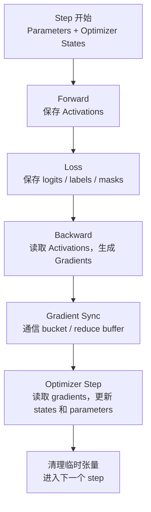

# 显存组成与优化总览

训练大模型时，显存不只是“模型参数占多少”。一次训练 step 里，GPU 显存会同时放权重、梯度、优化器状态、activation、临时 buffer、通信 buffer，以及框架分配器保留的缓存空间。

一句话理解：

> 训练显存优化不是简单地“省显存”，而是先判断峰值显存来自哪一类对象，再选择能减少那一类对象的技术。

如果显存瓶颈来自 activation，单纯切 optimizer state 收益有限。如果显存瓶颈来自 Adam state，activation checkpointing 也救不了根本问题。显存优化必须先做 breakdown。

## 为什么训练显存比推理复杂

推理通常只需要：

- 模型权重。
- 当前请求的输入输出张量。
- KV Cache。
- 临时计算 buffer。

训练需要更多状态：

- 模型权重要参与 forward。
- forward 中间结果要保存给 backward。
- backward 要生成每个参数的 gradient。
- optimizer 要维护动量、二阶矩等状态。
- mixed precision 可能需要 FP32 master weight。
- 多 GPU 训练需要通信 buffer。
- checkpoint、评估、日志也可能短时间增加额外内存。

所以同一个模型，训练通常比推理显存压力大很多。推理关注 KV Cache 和并发，训练关注 activation、gradient、optimizer state 和分布式切分。

## 训练显存的主要组成

可以把训练显存分成七类：

| 类型 | 作用 | 常见特点 |
| --- | --- | --- |
| Parameters | 模型权重 | 模型规模决定基础占用 |
| Gradients | 参数梯度 | backward 后产生，optimizer step 前使用 |
| Optimizer states | Adam 动量、二阶矩等 | Adam/AdamW 通常显存很高 |
| Master weights | 混合精度下的高精度权重副本 | 取决于 optimizer 和框架实现 |
| Activations | forward 保存给 backward 的中间结果 | 和 batch、sequence length、layer 数强相关 |
| Temporary buffers | 算子 workspace、attention buffer、fused kernel buffer | 峰值明显，生命周期短 |
| Runtime / allocator overhead | CUDA caching allocator、碎片、通信 buffer、框架元数据 | 不一定等于 tensor 实际占用 |

这些对象的生命周期不同。有些从训练开始到结束都存在，有些只在某个阶段短暂存在。

## 一个训练 step 的显存时间线

训练显存不是静态数字。一次 step 中，显存会随着 forward、backward 和 optimizer step 变化。



粗略看：

- forward 阶段 activation 不断增加。
- backward 阶段 activation 逐步释放，gradient 逐步产生。
- gradient sync 阶段可能出现通信 bucket。
- optimizer step 阶段会访问 optimizer state 和参数。
- 某些临时 buffer 只在算子执行时出现，但可能决定峰值。

OOM 发生在哪个阶段很关键。不同阶段 OOM，对应的优化方向不同。

## Parameters：模型权重

Parameters 是模型本身的权重。

如果模型有 `N` 个参数，参数显存大致是：

```text
parameter memory = N * bytes_per_parameter
```

常见精度下：

| 精度 | 每个参数字节数 | 说明 |
| --- | --- | --- |
| FP32 | 4 bytes | 传统训练和某些高精度状态 |
| FP16 | 2 bytes | 低精度训练常用 |
| BF16 | 2 bytes | 大模型训练常用，动态范围更好 |
| FP8 | 1 byte | 依赖硬件、框架和数值策略 |

例如 7B 参数模型，如果权重用 BF16：

```text
7B * 2 bytes = 14GB
```

这只是权重本身，不包括 gradient、optimizer state 和 activation。

降低 parameter memory 的常见方法：

- 使用低精度权重。
- Tensor Parallel 切分层内矩阵。
- Pipeline Parallel 把不同层放到不同 GPU。
- ZeRO-3 / FSDP shard 参数。
- 参数 offload 到 CPU/NVMe。

注意，参数显存只是训练显存的一部分。能放下权重不代表能训练。

## Gradients：参数的更新方向

Backward 会计算 loss 对每个参数的梯度。optimizer 用梯度决定参数如何更新。

如果每个参数都有一个同精度 gradient，那么 gradient memory 大致和参数权重同量级：

```text
gradient memory ≈ N * bytes_per_gradient
```

例如 7B 参数模型，如果 gradient 用 BF16：

```text
7B * 2 bytes = 14GB
```

在 Data Parallel 中，每个 GPU 默认持有完整模型副本，因此也会持有完整 gradient。梯度同步会在 backward 中通过 AllReduce 或 ReduceScatter 完成。

降低 gradient memory 的常见方法：

- ZeRO-2 / ZeRO-3 或 FSDP shard gradients。
- 使用 ReduceScatter 让每个 rank 只保留梯度分片。
- 用梯度累积时谨慎管理同步时机。
- 避免保留不必要的 `.grad`。
- 对冻结参数不计算梯度。

Gradient accumulation 不会自动减少 gradient memory。某些场景下，如果中间 micro-step 不同步，梯度还会在本地累积，显存占用可能更高。

## Optimizer States：优化器状态

Optimizer states 是训练显存里最容易被低估的一类。

SGD 可能只需要少量状态。Adam/AdamW 通常需要为每个参数保存：

- 一阶动量 `m`。
- 二阶动量 `v`。
- 有时还需要 FP32 master weight。

如果 `m` 和 `v` 都是 FP32：

```text
Adam states = 4 bytes + 4 bytes = 8 bytes per parameter
```

如果还保存 FP32 master weight：

```text
master weight = 4 bytes per parameter
```

混合精度 AdamW 的粗略估算可能是：

| 项 | 每参数字节数 |
| --- | --- |
| BF16/FP16 parameter | 2 |
| BF16/FP16 gradient | 2 |
| FP32 master weight | 4 |
| Adam first moment | 4 |
| Adam second moment | 4 |
| 合计 | 16 |

也就是说，一个 7B 模型训练时，模型状态可能达到：

```text
7B * 16 bytes = 112GB
```

这个数字不包括 activation、临时 buffer 和通信 buffer。

实际框架实现可能不同。有些 BF16 训练配置不保留单独 FP32 master weight，有些优化器状态可以低精度化，有些参数被冻结或用不同 optimizer。估算时要以实际实现为准。

降低 optimizer state memory 的常见方法：

- ZeRO-1 shard optimizer states。
- ZeRO-Offload / ZeRO-Infinity 把 optimizer states offload 到 CPU/NVMe。
- FSDP shard optimizer state dict。
- 使用低精度 optimizer state。
- 使用更省状态的 optimizer。
- 冻结部分参数或使用 LoRA 等参数高效微调方法。

## Master Weights：混合精度下的高精度副本

Mixed precision 训练常用 FP16/BF16 做大部分计算，但 optimizer 更新可能仍希望在更高精度下进行。

因此一些训练栈会保留 FP32 master weight：

```text
low precision parameter: forward/backward 使用
FP32 master weight: optimizer step 更新使用
```

这样做有助于数值稳定，但显存更高。

并不是所有 BF16 训练都一定有显式 master weight。不同框架、优化器和 FSDP/ZeRO 配置会不同。写容量模型时，应该实际检查 optimizer state，而不是只按经验估算。

## Activations：forward 留给 backward 的中间结果

Activation 是训练和推理显存差异最大的来源之一。

Forward 时，模型会产生很多中间结果。为了 backward 计算梯度，系统不能全部丢掉，需要保存一部分 activation。

Activation 大小通常和这些因素相关：

- micro-batch size。
- sequence length。
- hidden size。
- layer 数。
- attention 实现。
- MLP 中间维度。
- 是否保存 attention scores。
- 是否使用 activation checkpointing。
- 是否使用 mixed precision。

在 Transformer 训练中，长上下文尤其容易让 activation 爆炸。sequence length 增加，不只输入 token 多了，attention 和每层中间状态也会增加。

降低 activation memory 的常见方法：

- 减小 micro-batch size。
- 减小 sequence length。
- 使用 activation checkpointing。
- 使用 FlashAttention 等更省显存的 attention 实现。
- 使用 sequence parallel。
- 使用 mixed precision。
- 对不需要梯度的分支使用 `no_grad` 或冻结。

Activation checkpointing 的本质是：forward 不保存所有中间结果，backward 时重新计算一部分 forward。它用更多计算换更少显存。

## Temporary Buffers：临时工作区

Temporary buffers 是训练显存里最容易被忽略的一类。

常见来源包括：

- cuBLAS / cuDNN workspace。
- attention kernel 的临时 buffer。
- fused optimizer 的临时 tensor。
- 通信 bucket。
- all-gather / reduce-scatter buffer。
- logits、mask、position ids、packed sequence metadata。
- 编译器生成的中间 buffer。

这些 buffer 生命周期短，但可能决定峰值显存。

例如某个模型平时看起来只用 70GB，但某个 attention kernel 或 all-gather 短时间需要额外 12GB，80GB GPU 就会 OOM。

这就是为什么只看“稳定状态下的参数 + 梯度 + optimizer state”不够。真正决定能不能跑的是峰值显存。

## Runtime、缓存和碎片

框架为了提高性能，通常不会每次 tensor 释放后立刻把显存还给系统。以 PyTorch 为例，CUDA caching allocator 会缓存显存块，以便后续快速复用。

这会导致几个概念容易混淆：

| 指标 | 含义 |
| --- | --- |
| allocated memory | 当前 tensor 实际占用的显存 |
| reserved memory | 框架分配器从 CUDA 申请并保留的显存 |
| peak allocated | 一段时间内 tensor 实际占用峰值 |
| peak reserved | 一段时间内分配器保留显存峰值 |
| `nvidia-smi` 显示 | 通常更接近进程占用和保留，不等于活跃 tensor 总量 |

所以看到 `nvidia-smi` 显示显存高，不一定代表当前所有显存都被活跃 tensor 使用。可能有一部分是 caching allocator 保留的空闲块。

但这不代表可以忽略它。碎片和保留策略会影响后续大块分配是否成功。

常见现象：

- allocated 不高，但 reserved 很高。
- 有足够总空闲显存，但申请大块 tensor 失败。
- sequence length 动态变化导致分配尺寸不稳定，碎片增加。
- activation checkpointing、offload、动态 shape 让分配释放更频繁。

优化方向包括：

- 固定或减少动态 shape。
- 减少训练循环里的临时大 tensor。
- 使用更稳定的 batch/sequence packing 策略。
- 观察 memory snapshot / memory summary。
- 必要时调整 allocator 配置。
- 不要把 `empty_cache()` 当作常规训练加速方法。

## 显存峰值通常在哪里出现

OOM 出现的位置能提示问题来源。

| OOM 位置 | 可能原因 | 优先排查 |
| --- | --- | --- |
| 模型初始化 | 权重本身太大，初始化方式占额外内存 | meta init、ZeRO-3 init、FSDP、TP/PP |
| 第一次 forward | activation 或临时 buffer 太大 | micro-batch、sequence length、attention 实现 |
| backward 中段 | activation + gradient + 临时 buffer 峰值 | activation checkpointing、gradient sharding |
| gradient sync | 通信 bucket 或 all-gather buffer 太大 | bucket size、FSDP/ZeRO 配置 |
| optimizer step | optimizer state 或 fused optimizer buffer 太大 | ZeRO-1、offload、低精度 optimizer |
| checkpoint 保存 | state_dict 聚合导致额外副本 | sharded checkpoint、rank0-only 策略 |
| evaluation | eval batch 或生成缓存不同 | 单独设置 eval batch、关闭不必要缓存 |

先定位 OOM 阶段，比盲目降低 batch size 更有效。

## 一个粗略显存估算例子

假设一个 7B 参数 dense Transformer，用 BF16 权重、BF16 gradient、AdamW，并保留 FP32 master weight。

模型状态粗略估算：

```text
parameters:      7B * 2 bytes = 14GB
gradients:       7B * 2 bytes = 14GB
master weights:  7B * 4 bytes = 28GB
Adam m:          7B * 4 bytes = 28GB
Adam v:          7B * 4 bytes = 28GB
----------------------------------
model states total ≈ 112GB
```

这已经超过一张 80GB GPU，而且还没有算 activation。

如果用 8 张 GPU 做普通 Data Parallel，每张 GPU仍然会保存完整模型状态，单卡仍然放不下。

如果用 ZeRO/FSDP shard model states，假设理想情况下按 8 张 GPU 切分：

```text
112GB / 8 ≈ 14GB per GPU
```

这时模型状态变得可控，但 activation、临时 buffer、通信 buffer 仍然存在。实际占用不会只有 14GB。

这个例子说明：大模型训练不能只问“模型权重多大”，还要问“训练状态怎么切分”。

## 不同优化技术省的是哪块显存

显存优化方法很多，但每种方法针对的对象不同。

| 方法 | 主要节省 | 主要代价 |
| --- | --- | --- |
| 减小 micro-batch | activations | GPU 算子效率可能下降 |
| 减小 sequence length | activations、attention buffer | 训练任务或上下文能力改变 |
| Mixed precision | parameters、gradients、activations、临时 buffer | 数值稳定性风险 |
| Activation checkpointing | activations | backward 重算，step time 增加 |
| FlashAttention | attention 中间显存、IO | 依赖 kernel 和 shape 支持 |
| ZeRO-1 | optimizer states | 通信和实现复杂度 |
| ZeRO-2 | optimizer states、gradients | 通信模式变化 |
| ZeRO-3 / FSDP | parameters、gradients、optimizer states | all-gather、prefetch、checkpoint 复杂度 |
| Tensor Parallel | parameters、activations、计算切分 | 层内通信频繁 |
| Pipeline Parallel | parameters 分布到不同 stage | pipeline bubble、调度复杂 |
| Offload | GPU 上的参数或 optimizer states | PCIe/NVMe 带宽和延迟 |
| 低精度 optimizer | optimizer states | 收敛和数值风险 |
| Fused kernels | temporary buffers、kernel launch | 可调试性和兼容性 |
| Sharded checkpoint | checkpoint 峰值和存储压力 | 恢复逻辑更复杂 |

选择显存优化技术时，先问：

```text
我现在超的是哪一类显存？
```

如果不知道，就先做显存观测。

## 显存优化的决策顺序

比较稳妥的排查顺序是：

1. 记录 OOM 出现阶段。
2. 记录 `max_memory_allocated` 和 `max_memory_reserved`。
3. 固定 batch、sequence length、precision，做可复现实验。
4. 用较小模型或 synthetic data 验证是否是数据侧或模型侧问题。
5. 先估算 model states：parameters、gradients、optimizer states。
6. 再估算 activation：micro-batch、sequence length、layer 数。
7. 看 profiler / memory snapshot 里是否有大临时 buffer。
8. 根据瓶颈选择对应优化技术。

不要一开始就上最复杂的 ZeRO-3、offload 或多维并行。复杂技术会引入通信、checkpoint、debug 和稳定性成本。

## 如何观测显存

显存观测至少要区分三层：

第一层是系统层，例如 `nvidia-smi`。它能看到进程显存占用，但不能告诉你哪些 tensor 占用显存。

第二层是框架层，例如 PyTorch 的：

- `torch.cuda.memory_allocated()`
- `torch.cuda.max_memory_allocated()`
- `torch.cuda.memory_reserved()`
- `torch.cuda.max_memory_reserved()`
- `torch.cuda.memory_summary()`
- `torch.cuda.memory_snapshot()`

第三层是训练语义层。你需要知道当前处在 forward、backward、gradient sync、optimizer step 还是 checkpoint 阶段。

一个简单做法是，在关键阶段打点：

```python
torch.cuda.reset_peak_memory_stats()

loss = model(batch)
print("after forward", torch.cuda.max_memory_allocated())

loss.backward()
print("after backward", torch.cuda.max_memory_allocated())

optimizer.step()
print("after optimizer", torch.cuda.max_memory_allocated())
```

真实分布式训练中还要记录每个 rank，因为 OOM 可能只发生在某个 rank。

## 显存和吞吐的关系

显存优化经常会影响吞吐。

一些方法节省显存但增加计算：

- activation checkpointing 会重算 forward。
- offload 会引入 CPU/GPU 或 NVMe/GPU 数据搬运。
- ZeRO-3 / FSDP 会增加 all-gather 和 reduce-scatter。

一些方法节省显存也可能提升吞吐：

- mixed precision 降低带宽和提升 Tensor Core 利用率。
- FlashAttention 减少显存 IO。
- fused optimizer 减少 kernel launch 和内存读写。

所以评价显存优化不能只看“能不能跑”，还要看：

- step time。
- tokens/s。
- MFU。
- communication time。
- recompute overhead。
- offload bandwidth。
- OOM margin。

工程上常见目标不是把显存用到最低，而是在稳定不 OOM 的前提下，让吞吐和扩展效率尽量高。

## 显存余量为什么重要

训练不要只追求刚好跑满显存。

需要留余量的原因包括：

- 动态 shape 可能让某些 batch 更大。
- checkpoint 或 eval 可能短时间增加显存。
- 通信 bucket 和 all-gather 峰值可能波动。
- allocator fragmentation 会增加失败概率。
- 不同 driver、CUDA、框架版本的 workspace 策略可能不同。
- 长时间训练中偶发异常 batch 更难处理。

如果 80GB GPU 长期跑到 79.8GB，系统可能非常脆弱。稳定训练通常需要一定 OOM margin。

## 常见优化方向

### 1. 先降低 activation

如果 OOM 发生在 forward/backward，并且随 micro-batch 或 sequence length 明显变化，优先考虑 activation。

常见手段：

- 降低 micro-batch。
- 使用 activation checkpointing。
- 使用更省显存的 attention kernel。
- 降低 sequence length 或分桶训练。
- 使用 sequence parallel。

这类方法对长上下文训练很重要。

### 2. 再切分 model states

如果模型状态本身已经超过单卡能力，就需要切分 parameters、gradients 和 optimizer states。

常见手段：

- ZeRO-1：切 optimizer states。
- ZeRO-2：切 optimizer states 和 gradients。
- ZeRO-3 / FSDP：切 parameters、gradients 和 optimizer states。
- Tensor Parallel / Pipeline Parallel：切模型计算和权重放置。

这类方法让更大模型能训练，但也带来通信和 checkpoint 复杂性。

### 3. 控制 optimizer state

如果 Adam state 占用太高，可以考虑：

- ZeRO-1 或 FSDP optimizer state sharding。
- optimizer offload。
- 低精度 optimizer。
- 更省状态的 optimizer。
- 参数高效微调，只训练少量参数。

这类优化对全参数训练尤其关键。

### 4. 处理临时 buffer 和碎片

如果 allocated 不高但 reserved 高，或者峰值来自短生命周期 buffer，重点看：

- bucket size。
- all-gather prefetch。
- fused kernel workspace。
- 动态 sequence length。
- allocator fragmentation。
- checkpoint 保存时的 state_dict 聚合。

这种问题不能只靠减 batch。需要看 memory snapshot、timeline 和框架配置。

### 5. 最后考虑 offload

Offload 可以把部分状态放到 CPU 或 NVMe，但它不是免费扩显存。

代价包括：

- PCIe 或 NVMe 带宽限制。
- 数据搬运和计算重叠困难。
- step time 增加。
- checkpoint 和恢复更复杂。
- 对 NUMA、存储和 I/O 调度更敏感。

Offload 更适合“必须训练更大模型，但 GPU 显存不够”的场景，而不是首选性能优化手段。

## 常见误区

### 1. 模型权重能放下，就能训练

不对。训练还需要 gradient、optimizer state 和 activation。一个 14GB 权重的模型，训练状态可能超过 100GB。

### 2. OOM 就一定减 batch

不一定。如果 OOM 来自 optimizer state，减 batch 收益很小。如果 OOM 来自 checkpoint 聚合，减 batch 也不一定有用。

### 3. `nvidia-smi` 显示显存高，就一定是 tensor 没释放

不一定。框架 caching allocator 可能保留了显存。要区分 allocated 和 reserved。

### 4. `empty_cache()` 是常规显存优化手段

不应该依赖它。它可能让其他进程看到更多空闲显存，但不会释放仍被 tensor 占用的显存，也可能影响性能。

### 5. Activation checkpointing 总是提升训练能力

它省 activation，但增加重算。对于 activation 不是瓶颈的场景，收益可能有限，还会拉长 step time。

### 6. ZeRO/FSDP 只省显存，不影响性能

不对。它们通过通信换显存，会引入 all-gather、reduce-scatter、prefetch、bucket 和 checkpoint 复杂性。

### 7. 显存越接近满载越好

不对。训练需要峰值余量。没有余量的配置容易被动态 shape、碎片、checkpoint 或版本差异击穿。

## 排查清单

遇到显存问题时，可以按下面顺序排查：

1. 记录 OOM 出现在初始化、forward、backward、sync、optimizer 还是 checkpoint。
2. 记录每个 rank 的 peak allocated 和 peak reserved。
3. 估算 parameters、gradients、optimizer states、master weights。
4. 改 micro-batch，观察显存是否近似线性变化。
5. 改 sequence length，观察 activation 是否是主要瓶颈。
6. 打开或关闭 activation checkpointing，对比显存和 step time。
7. 检查 optimizer state 是否被完整复制。
8. 检查 DDP/FSDP/ZeRO 的 bucket、prefetch 和 sharding 策略。
9. 检查 checkpoint 保存是否聚合完整 state_dict。
10. 使用 memory summary / snapshot 分析 allocator 和碎片。
11. 记录优化前后的 tokens/s、step time 和 OOM margin。

## 小结

训练显存可以分成两大类：

- 模型状态：parameters、gradients、optimizer states、master weights。
- 执行状态：activations、temporary buffers、communication buffers、allocator overhead。

模型状态决定“这个模型的训练状态有多大”，执行状态决定“一次 step 的峰值有多高”。

显存优化的核心方法是先定位瓶颈：

- activation 高，就考虑 micro-batch、sequence length、checkpointing、attention kernel。
- optimizer state 高，就考虑 ZeRO/FSDP、offload、低精度 optimizer。
- 参数本身高，就考虑 TP/PP/FSDP/ZeRO-3。
- 临时 buffer 或碎片高，就看 bucket、workspace、动态 shape 和 allocator。

理解这些分类后，后续学习 ZeRO、FSDP、Tensor Parallel、Pipeline Parallel、Activation Checkpointing 和混合精度时，就能明确它们各自解决的是哪块显存问题。

## 参考资料

- [PyTorch CUDA semantics: Memory management](https://docs.pytorch.org/docs/2.12/notes/cuda.html#cuda-memory-management)
- [PyTorch `torch.utils.checkpoint`](https://docs.pytorch.org/docs/2.12/checkpoint.html)
- [PyTorch FullyShardedDataParallel](https://docs.pytorch.org/docs/2.12/fsdp.html)
- [DeepSpeed ZeRO Tutorial](https://www.deepspeed.ai/tutorials/zero/)
