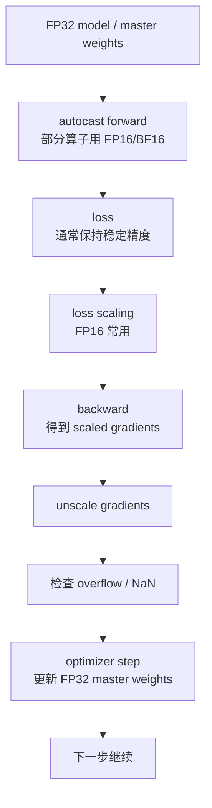

# 混合精度训练

训练大模型时，很多计算并不一定都要用 FP32。现代 GPU 对 FP16、BF16、FP8 等低精度格式有更高吞吐和更低带宽压力。

一句话理解：

> 混合精度训练的核心目标，是让适合低精度的计算用低精度跑得更快、更省显存，同时让容易数值不稳定的部分保留更高精度。

它不是“把所有 tensor 都改成半精度”。真正的混合精度，是在速度、显存、带宽和数值稳定之间做分工。

## 为什么低精度能加速

低精度训练有三个直接收益。

第一，单个数更小：

| dtype | 常见大小 |
| --- | --- |
| FP32 | 4 bytes |
| FP16 | 2 bytes |
| BF16 | 2 bytes |
| FP8 | 1 byte |

这会降低参数、activation、gradient 和通信 buffer 的显存压力。

第二，内存带宽压力更低。同样一条内存通道，低精度能搬更多元素。

第三，现代 GPU Tensor Core 对低精度矩阵乘有专门加速。大模型训练里的 Linear、Attention、MLP 都大量依赖 GEMM，因此低精度能显著提高吞吐。

## 为什么不能全部低精度

低精度的问题是表示能力更弱。

浮点数可以简单理解为：

```text
value = sign * mantissa * 2^exponent
```

其中：

- exponent 决定能表示多大、多小的数。
- mantissa 决定有效数字精度。

低精度通常意味着 exponent 或 mantissa 更少，容易出现：

- overflow：数太大，表示不了，变成 inf。
- underflow：数太小，表示不了，变成 0。
- rounding error：有效数字不够，细小变化丢失。
- accumulation error：很多数相加时误差累积。

训练比推理更敏感，因为训练不仅要算 forward，还要算 loss、backward、梯度、optimizer state 和参数更新。某些小梯度如果被冲成 0，参数就失去更新；某些大梯度如果溢出，loss 可能变成 NaN。

## FP32、FP16、BF16、FP8 的直觉

### FP32

FP32 是传统训练默认格式。它范围大、精度高，数值稳定性好，但显存和带宽成本高，低精度 Tensor Core 性能也用不上。

常见用途：

- optimizer state。
- master weights。
- 某些归一化、loss、softmax 等敏感操作。
- debug baseline。

### FP16

FP16 占 2 bytes，精度和范围都比 FP32 小。它的优势是硬件加速成熟，显存和带宽都省。

问题是 FP16 数值范围有限，训练中容易出现：

- 小梯度 underflow。
- 大 activation 或 gradient overflow。
- loss scaling 配置不当导致 NaN/Inf。

FP16 训练通常需要 loss scaling，也经常保留 FP32 master weights。

### BF16

BF16 也是 2 bytes，但它保留了和 FP32 类似的 exponent 位数，牺牲的是 mantissa 精度。

直觉上：

```text
FP16: 有效数字相对多一点，但范围小
BF16: 有效数字少一点，但范围接近 FP32
```

所以 BF16 对大模型训练通常更稳，很多 LLM 训练默认优先用 BF16。它通常不需要像 FP16 那样依赖 loss scaling。

### FP8

FP8 更激进，只有 1 byte。它能进一步降低显存、带宽和计算成本，但数值范围和精度都更紧，需要更复杂的 scaling 策略。

常见 FP8 格式包括：

- E4M3：更多 mantissa，精度更好，范围较小，常用于 forward 的 activations/weights。
- E5M2：更多 exponent，范围更大，精度较低，常用于 backward gradients。

FP8 不是简单把模型 `.to(fp8)`。它通常需要框架或库维护每个 tensor 的 scale、amax history、格式选择和 fallback 策略。

## 混合精度训练的基本流程

以 FP16 AMP 为例，一个简化流程是：



真正系统里，不同 tensor 的 dtype 会更复杂：

- GEMM 输入可能是 FP16/BF16/FP8。
- accumulation 可能是 FP32 或更高精度。
- LayerNorm/Softmax 可能保留 FP32 或 BF16。
- optimizer state 常常是 FP32。
- 通信可能用低精度 gradient，也可能先 unscale 再同步。

## Autocast 做了什么

Autocast 的作用是自动选择某些算子用低精度，某些算子保留高精度。

例如：

- `matmul`、`linear`、`conv` 这类算子适合低精度加速。
- `softmax`、`layer_norm`、`cross_entropy`、`log`、`exp` 等可能更敏感，常常保留更高精度。

这比手动把所有 tensor 转成 `half()` 更安全。

需要注意：

- autocast 通常只包 forward 和 loss。
- backward 会根据 forward 对应算子的 dtype 运行。
- 不应该随意对模型和输入手动 `.half()`，否则可能绕开 autocast 的安全策略。
- 自定义算子需要自己处理 dtype 和 backward 精度。

## Loss Scaling 为什么必要

FP16 的一个主要问题是小梯度 underflow。

假设某个真实梯度是：

```text
0.00000001
```

它可能太小，FP16 表示不了，变成 0。这样参数就不会被这部分梯度更新。

Loss scaling 的做法是：

1. 把 loss 乘以一个 scale，例如 `65536`。
2. backward 得到的梯度也随之放大。
3. 在 optimizer step 前，把梯度除回同样的 scale。
4. 如果发现 overflow，就跳过这次 step，并降低 scale。

简化表示：

```text
scaled_loss = loss * scale
scaled_grad = grad * scale
unscaled_grad = scaled_grad / scale
```

这样小梯度在 backward 过程中更不容易 underflow。关键是 optimizer 更新前必须 unscale，否则等价于把学习率放大了。

## Dynamic Loss Scaling

固定 scale 不一定合适。

- scale 太小，防不住 underflow。
- scale 太大，容易 overflow。

Dynamic loss scaling 会动态调整 scale：

- 一段时间没有 overflow，就增大 scale。
- 检测到 overflow，就降低 scale，并跳过当前 optimizer step。

这就是很多 AMP 实现里 `GradScaler` 的作用。

对系统工程师来说，loss scale 的日志很有价值：

- scale 频繁下降：可能数值不稳定或 FP16 不适合。
- scale 长期很低：可能模型数值范围超过 FP16。
- scale 正常增长但 loss NaN：问题可能在某个高风险算子或数据。

## Master Weights 是什么

FP16 训练中，参数更新如果直接在 FP16 权重上做，小更新可能因为精度不够被舍入掉。

所以经典做法是保留一份 FP32 master weights：

```text
FP16 weights:
  用于 forward/backward 计算

FP32 master weights:
  optimizer 真正更新的参数副本
```

每次 optimizer step：

1. 用 unscaled gradients 更新 FP32 master weights。
2. 把更新后的 FP32 weights cast 成 FP16/BF16，供下一步 forward/backward 使用。

这会增加一份参数显存，但能显著提高训练稳定性。

BF16 因为范围更大，很多训练栈仍会在 optimizer state 或 master 参数上保留 FP32，但对 loss scaling 的依赖通常小很多。

## 哪些操作应该保留高精度

不是所有操作都适合低精度。

常见需要谨慎的部分：

| 操作 | 风险 |
| --- | --- |
| Softmax | exp 和归一化可能溢出或损失精度 |
| LayerNorm / RMSNorm | 均值、方差、rsqrt 对误差敏感 |
| Loss / Cross Entropy | 直接影响梯度源头 |
| Gradient norm / clipping | 溢出检测和裁剪需要可靠 |
| Optimizer state update | Adam 的动量和二阶矩需要长期累计 |
| Router / gating | MoE 路由分数不稳会影响负载和训练 |

成熟 AMP 系统会对不同 op 做白名单、黑名单或 op-specific dtype 策略。

## FP8 训练多了什么

FP8 比 FP16/BF16 更复杂，因为单个 FP8 tensor 的动态范围很小。

FP8 通常需要为 tensor 维护 scale：

```text
真实值 ≈ FP8_value * scale
```

训练时还要记录 amax，也就是一段时间内 tensor 绝对值最大值，用来决定后续 scale。

常见策略：

- per-tensor scaling：一个 tensor 一个 scale。
- delayed scaling：用前几个 iteration 的 amax history 估计下一步 scale。
- block scaling：一个 tensor 分成多个 block，每个 block 有自己的 scale。

FP8 的系统成本包括：

- amax 统计。
- scale 更新。
- FP8 cast / dequant。
- shape 对齐限制。
- 某些层或算子 fallback 到 BF16/FP16/FP32。

所以 FP8 训练应该看端到端收益，而不是只看某个 GEMM 理论吞吐。

## 和分布式训练的关系

混合精度会影响通信和并行策略。

### Data Parallel

梯度同步前，要明确同步的是 scaled gradients 还是 unscaled gradients。通常需要在 optimizer step 前 unscale，并处理 overflow 检测。

如果使用 gradient clipping，也应该在 unscale 后做，否则裁剪阈值不对应真实梯度。

### FSDP / ZeRO

FSDP/ZeRO 会切 parameters、gradients、optimizer states。混合精度下要分别定义：

- 参数计算 dtype。
- 参数保存 dtype。
- 梯度 reduce dtype。
- optimizer state dtype。
- master weight dtype。

这些配置会影响显存、通信和数值稳定性。

### Tensor Parallel

TP 中的 AllReduce / ReduceScatter / AllGather 可能使用低精度通信，也可能需要 FP32 accumulation。低精度通信能省带宽，但可能影响数值。

### Pipeline Parallel

不同 stage 必须保持 dtype 约定一致。stage 间传 activation 时，如果 dtype 不一致，会产生额外 cast 或错误。

## Benchmark 时看什么

评估混合精度不能只看是否 OOM。至少看：

| 指标 | 作用 |
| --- | --- |
| Step time | 低精度是否真的加速 |
| Tokens/s | 端到端吞吐 |
| MFU | Tensor Core 是否被有效利用 |
| Peak memory | 是否降低显存 |
| Loss curve | 是否和高精度 baseline 对齐 |
| NaN/Inf 次数 | 是否数值不稳定 |
| Loss scale 曲线 | FP16 下是否频繁 overflow |
| Grad norm | 梯度是否异常 |
| Kernel dtype 分布 | 关键 GEMM 是否跑到低精度 |
| Communication dtype | 通信是否省带宽且不影响收敛 |

实验要固定：

- 模型结构。
- batch 和 sequence。
- 学习率和 warmup。
- optimizer。
- gradient clipping。
- activation checkpointing。
- 并行策略。
- 随机种子。

混合精度的风险是：短期 loss 看起来正常，长训练后才出现质量偏差。因此重要配置最好和 FP32/BF16 baseline 做对照。

## 常见优化方向

### 优先 BF16 作为大模型默认选择

如果硬件支持 BF16，LLM 训练通常优先考虑 BF16。它比 FP16 更稳，通常不需要复杂 loss scaling。

### 用 AMP 而不是手动全模型 half

AMP 会按算子选择 dtype。手动 `.half()` 容易让 sensitive ops 也落到 FP16，增加 NaN 风险。

### 记录 loss scale 和 NaN 位置

不要只在 loss NaN 后重启。应记录 loss scale、grad norm、overflow step、触发层和输入 batch，定位是数据、模型、学习率还是 dtype 问题。

### 对敏感模块使用高精度

LayerNorm、Softmax、loss、router、部分 reduction 可以保留 BF16/FP32。混合精度不是越低越好。

### FP8 从成熟模块开始

FP8 优先在 Transformer Engine 等成熟库支持的 Linear/Attention/MLP 模块中使用。自定义算子要谨慎，因为 scaling、amax 和 backward 精度都需要处理。

## 常见误区

### 误区一：混合精度等于全 FP16

不对。混合精度强调不同算子、状态和通信使用不同 dtype。全 FP16 往往更不稳定。

### 误区二：BF16 一定比 FP16 更精确

不准确。BF16 范围大，但 mantissa 少；FP16 mantissa 多一些，但范围小。训练中 BF16 常更稳，不代表每个数都更精确。

### 误区三：loss scaling 能解决所有 FP16 问题

loss scaling 主要解决小梯度 underflow。它不能解决所有 overflow、敏感算子误差或模型本身不适合 FP16 的问题。

### 误区四：FP8 只是更小的 FP16

FP8 需要 scale、amax、格式选择和 fallback 策略。它更接近“低精度量化训练系统”，不是简单 dtype 替换。

### 误区五：只要 step time 变快就是成功

如果 loss curve、eval 指标或长期稳定性变差，低精度收益可能不成立。训练系统必须同时看性能和收敛。

## 设计检查表

使用混合精度训练前，可以检查：

- 硬件是否支持 BF16、FP16、FP8 Tensor Core？
- 默认训练 dtype 是 BF16 还是 FP16？
- FP16 是否启用 dynamic loss scaling？
- master weights 和 optimizer states 用什么 dtype？
- LayerNorm、Softmax、loss、router 是否保留高精度？
- gradient clipping 是否在 unscale 后执行？
- FSDP/ZeRO 的 param、reduce、buffer dtype 是否一致？
- TP/PP stage 间 activation dtype 是否一致？
- 是否记录 NaN/Inf、grad norm、loss scale、kernel dtype？
- 是否有高精度 baseline 对照？

## 小结

混合精度训练是大模型训练的基础能力。它让适合低精度的矩阵计算使用 FP16、BF16 或 FP8，以降低显存和带宽压力、提高 Tensor Core 吞吐；同时让敏感操作和长期状态保留更高精度，维持训练稳定。

核心判断是：

- FP16 快但范围小，常需要 loss scaling 和 FP32 master weights。
- BF16 范围接近 FP32，通常更适合 LLM 默认训练。
- FP8 潜力更大，但需要 scaling、amax history 和成熟库支持。
- 性能收益必须和 loss curve、NaN/Inf、grad norm、长期质量一起评估。

真正的混合精度不是把 dtype 改小，而是让每类计算和状态用合适的精度。

## 参考资料

- [Mixed Precision Training](https://arxiv.org/abs/1710.03740)
- [PyTorch: Automatic Mixed Precision package](https://docs.pytorch.org/docs/2.12/amp.html)
- [NVIDIA Transformer Engine documentation](https://docs.nvidia.com/deeplearning/transformer-engine/user-guide/index.html)
- [NVIDIA Transformer Engine: Using FP8 and FP4](https://docs.nvidia.com/deeplearning/transformer-engine/user-guide/examples/fp8_primer.html)
