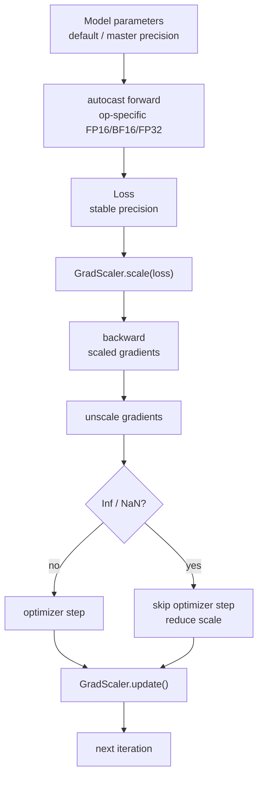

# 混合精度训练

训练大模型时，并不是所有计算都必须用 FP32。

现代 GPU 对 FP16、BF16、TF32、FP8 等格式提供了更高吞吐、更低显存占用和更低带宽压力。大模型训练里的矩阵乘、attention、MLP、通信 buffer、activation 保存，都可能从低精度受益。

但混合精度不是：

```text
model.half()
```

也不是：

```text
把所有 tensor 都换成最低精度
```

真正的混合精度训练，是把训练系统里的不同对象分配到合适精度：

- 适合低精度的 GEMM 用低精度跑快。
- 容易数值不稳定的 softmax / norm / loss 保留更高精度。
- optimizer state 通常保留 FP32 或更稳定格式。
- FP16 训练需要 loss scaling 防止梯度 underflow。
- FP8 训练需要 per-tensor 或 block scale、amax history 和 recipe。
- 分布式通信要决定梯度、参数、activation 和 scale metadata 用什么 dtype 传。

一句话理解：

> 混合精度训练的核心目标，是让适合低精度的计算、存储和通信更快更省，同时让数值敏感路径保留足够精度，最终提高 tokens/s、MFU、显存容量和单位成本效率。

本篇关注训练系统视角：dtype 各自适合什么，AMP 怎么工作，FP16/BF16/FP8 的系统差异，哪些状态不能随便低精度，分布式并行里 dtype 如何影响通信和稳定性，以及如何 benchmark。

## 先给结论

混合精度训练要回答五个问题：

| 问题 | 例子 |
| --- | --- |
| compute 用什么精度 | GEMM 用 FP16/BF16/FP8，accumulation 用 FP32 或更高精度。 |
| storage 用什么精度 | parameters、activations、gradients、optimizer states、master weights。 |
| communication 用什么精度 | gradient AllReduce、FSDP all-gather、TP activation、MoE dispatch。 |
| stability 用什么保护 | loss scaling、overflow check、grad norm、amax、scale history、fallback。 |
| benchmark 看什么 | tokens/s、MFU、step time、memory、NaN/Inf、eval score、cost per token。 |

实用原则：

```text
优先 BF16 baseline
再根据硬件和框架能力尝试 FP8
FP16 需要认真处理 loss scaling
敏感算子和长期累计状态不要盲目低精度
```

对大模型训练来说，常见路线是：

```text
FP32 debug baseline
-> BF16 training baseline
-> BF16 + fused kernels / sharding / checkpointing
-> FP8 for selected Linear/Attention/MLP paths
```

不要一开始就追求最激进低精度。

先建立稳定 baseline，再逐步降低精度，才能知道速度收益来自哪里，质量损失是否可接受。

## 为什么低精度能加速

低精度训练有三个直接收益。

### 1. 单个数更小

| dtype | 常见大小 | 直觉 |
| --- | --- | --- |
| FP32 | 4 bytes | 稳定但贵。 |
| TF32 | 存储仍是 FP32，计算使用 Tensor Core 路径 | 更快的 FP32-like matmul。 |
| FP16 | 2 bytes | 快、省，但范围小。 |
| BF16 | 2 bytes | 范围接近 FP32，精度较低。 |
| FP8 | 1 byte | 更省，但需要 scale recipe。 |

低精度可以降低：

- activation memory。
- gradient memory。
- communication buffer。
- temporary buffer。
- 某些参数副本。

### 2. 带宽压力更低

同样的 HBM 带宽，低精度能搬更多元素。

很多训练瓶颈不是纯算力，而是：

- 读写 activation。
- 读写 optimizer state。
- 写 gradient。
- 通信前后 pack/unpack。
- kernel fusion 前后的 global memory traffic。

低精度能降低这些路径的 bytes。

### 3. Tensor Core 吞吐更高

Transformer 大量时间花在 GEMM：

- QKV projection。
- attention output projection。
- MLP up/gate/down projection。
- LM head。
- MoE expert GEMM。

现代 GPU 对 FP16/BF16/FP8 Tensor Core 有专门加速。

如果 GEMM shape 合适，低精度能明显提高吞吐。

但如果瓶颈在数据加载、pipeline bubble、通信、checkpoint 保存或小 shape kernel launch，低精度不一定带来同等端到端收益。

## 为什么不能全部低精度

浮点数可以粗略理解为：

```text
value = sign * mantissa * 2^exponent
```

其中：

- exponent 决定动态范围。
- mantissa 决定有效数字。

低精度会减少 exponent 或 mantissa，带来：

- overflow：数太大，变成 inf。
- underflow：数太小，变成 0。
- rounding error：有效数字不足。
- accumulation error：大量求和误差累积。
- saturation：量化后卡在最大/最小可表示值。

训练比推理更敏感。

原因是训练还包括：

- loss。
- backward。
- gradient accumulation。
- optimizer state 长期累计。
- learning rate schedule。
- gradient clipping。
- distributed reduction。
- checkpoint/resume。

某一步小误差可能在长训练中逐渐放大。

所以混合精度必须是策略，而不是全局 cast。

## Dtype 直觉

### FP32

FP32 是传统训练默认格式。

优点：

- 动态范围大。
- 有效数字多。
- 数值稳定。
- 适合作为 debug baseline。

缺点：

- 显存占用高。
- 带宽压力高。
- 在现代 GPU 上不能充分利用低精度 Tensor Core。

常见用途：

- optimizer state。
- master weights。
- 某些 loss / norm / softmax / reduction。
- metric / debug。
- scale / amax metadata。

### TF32

TF32 是 NVIDIA Ampere 及之后 GPU 上常见的 matmul 加速路径。

它不是一种新的 tensor storage dtype。tensor 仍然可以是 FP32，但矩阵乘内部使用 TF32-like precision，在速度和精度之间折中。

直觉：

```text
storage: FP32
matmul internal compute: TF32
accumulation: 通常仍保留较高精度路径
```

TF32 适合：

- 希望保持 FP32 代码路径。
- 但想提高 matmul / conv 性能。
- 对低位精度变化可接受。

需要记录：

- 是否开启 TF32。
- matmul/cudnn precision policy。
- 不同实验是否一致。

否则两个看似 FP32 的训练可能数值和性能都不同。

### FP16

FP16 占 2 bytes，Tensor Core 加速成熟。

优点：

- 显存省。
- 带宽省。
- GEMM 快。

主要问题：

- 动态范围小。
- 小梯度容易 underflow。
- 大 activation / gradient 容易 overflow。
- 通常需要 loss scaling。

FP16 更适合：

- 模型和数据范围经过验证。
- 有成熟 AMP / GradScaler。
- 能监控 overflow / skipped step。

### BF16

BF16 也是 2 bytes，但 exponent 位数接近 FP32。

直觉：

```text
FP16: 精度稍好，范围小
BF16: 精度较低，范围大
```

大模型训练中，BF16 通常比 FP16 更稳。

原因是：

- 大 activation 不容易 overflow。
- 不太依赖 loss scaling。
- 对 LLM 训练更常见。

代价是：

- mantissa 更少，低位精度更粗。
- 某些对精细差异敏感的路径仍需要更高精度。

### FP8

FP8 占 1 byte，比 FP16/BF16 更激进。

常见格式：

| 格式 | 直觉 | 常见用途 |
| --- | --- | --- |
| E4M3 | mantissa 更多，精度较好，范围较小 | forward activations / weights。 |
| E5M2 | exponent 更多，范围较大，精度较低 | backward gradients。 |

FP8 的难点是动态范围太小，不能靠单个 global loss scale 解决。

它通常需要：

- tensor scale。
- scale inverse。
- amax 记录。
- delayed scaling。
- current scaling。
- block scaling。
- per-tensor 或 per-block recipe。
- 高精度 fallback。

FP8 不是普通 AMP 的简单延伸，而是更接近“训练时量化系统”。

## 训练系统里的对象和 Dtype

混合精度要区分不同对象：

| 对象 | 常见 dtype | 说明 |
| --- | --- | --- |
| model parameters | BF16/FP16/FP8 compute copy + FP32 master 可选 | 取决于框架和 optimizer。 |
| activations | BF16/FP16/FP8 或高精度局部保留 | 影响显存和 bandwidth。 |
| gradients | BF16/FP16/FP32/FP8 相关路径 | 同步和 optimizer 前要谨慎。 |
| optimizer states | FP32 常见 | Adam m/v 长期累计，低精度风险更高。 |
| master weights | FP32 常见 | 防止小更新被舍入。 |
| loss | FP32/BF16 常见 | 梯度源头，通常更敏感。 |
| norm / softmax | FP32/BF16 常见 | 对 overflow/underflow 敏感。 |
| communication buffer | BF16/FP16/FP32/FP8 | 影响通信量和数值误差。 |
| scale / amax metadata | FP32 或专门格式 | FP8 recipe 关键状态。 |

不要只说：

```text
我们用了 BF16
```

应该说清楚：

```text
compute dtype = BF16
parameter storage = BF16
optimizer state = FP32
gradient communication = BF16
norm/loss = FP32
TF32 = disabled
```

## AMP 的基本数据流

以 PyTorch AMP 的 FP16 路径为例：



关键点：

- autocast 通常包 forward 和 loss。
- backward 不建议放在 autocast context 里。
- backward op 的 dtype 通常跟 forward 选择有关。
- GradScaler 负责 scale、unscale、overflow check、skip step 和 update scale。

## PyTorch AMP 示例

典型 FP16 AMP 训练循环：

```python
import torch

model = model.cuda()
optimizer = torch.optim.AdamW(model.parameters(), lr=lr)
scaler = torch.amp.GradScaler("cuda")

for batch in loader:
    optimizer.zero_grad(set_to_none=True)

    with torch.amp.autocast("cuda", dtype=torch.float16):
        outputs = model(batch["input_ids"])
        loss = loss_fn(outputs, batch["labels"])

    scaler.scale(loss).backward()

    # If gradient clipping is needed, unscale first.
    scaler.unscale_(optimizer)
    torch.nn.utils.clip_grad_norm_(model.parameters(), max_norm)

    scaler.step(optimizer)
    scaler.update()
```

BF16 路径常常不需要 GradScaler：

```python
for batch in loader:
    optimizer.zero_grad(set_to_none=True)

    with torch.amp.autocast("cuda", dtype=torch.bfloat16):
        outputs = model(batch["input_ids"])
        loss = loss_fn(outputs, batch["labels"])

    loss.backward()
    optimizer.step()
```

是否需要 GradScaler 取决于 dtype、硬件、模型和框架策略。

对 LLM 训练来说，BF16 baseline 通常是更稳妥的默认选择。

## Autocast 做了什么

Autocast 会在指定区域内按 op 选择 dtype。

它的目标是：

```text
能安全低精度的 op 用低精度
需要稳定性的 op 保留高精度
```

常见倾向：

| Op | 常见策略 |
| --- | --- |
| Linear / matmul / conv | 低精度。 |
| attention projection | 低精度。 |
| MLP GEMM | 低精度。 |
| softmax | 更高精度或专门稳定 kernel。 |
| layernorm / RMSNorm | 更高精度或 mixed path。 |
| cross entropy | 更高精度或 fused stable kernel。 |
| reduction / norm / clipping | 更高精度。 |

Autocast 比手动 `.half()` 更安全，因为它是 op-specific。

手动 `.half()` 的风险：

- 敏感 op 被迫低精度。
- input dtype 和 parameter dtype 不匹配。
- 自定义 op 未正确处理。
- optimizer / master weights 逻辑被绕开。
- debug 困难。

## GradScaler 与 Loss Scaling

FP16 的主要问题是小梯度 underflow。

如果梯度太小，FP16 表示不了，会变成 0：

```text
small gradient -> flush to zero -> parameter update lost
```

Loss scaling 的做法：

1. 把 loss 乘以 scale。
2. backward 得到 scaled gradients。
3. optimizer step 前把 gradients 除回去。
4. 如果发现 inf/NaN，跳过 step 并调整 scale。

简化公式：

```text
scaled_loss = loss * scale
scaled_grad = grad * scale
unscaled_grad = scaled_grad / scale
```

系统上必须注意：

- gradient clipping 要在 unscale 后做。
- gradient norm 监控要看 unscaled gradient。
- DDP/FSDP 同步前后要明确同步的是 scaled 还是 unscaled gradient。
- 如果 overflow 导致 step skipped，scheduler 是否 step 要谨慎。
- GradScaler state 需要 checkpoint/resume。

## Dynamic Loss Scaling

固定 scale 不一定合适。

Dynamic loss scaling 会根据 overflow 情况调整：

- 一段时间没有 overflow，scale 增大。
- 检测到 overflow，scale 降低，并跳过当前 optimizer step。

需要监控：

| 现象 | 可能含义 |
| --- | --- |
| scale 偶尔下降 | 正常，可能遇到尖峰 batch。 |
| scale 频繁下降 | 数值不稳定或 FP16 不适合。 |
| scale 长期很低 | 模型范围超过 FP16 可承受范围。 |
| scale 下降后 loss 仍 NaN | 可能有高风险 op、数据 bug 或 optimizer state 污染。 |
| skipped step 太多 | 有效训练吞吐下降。 |

PyTorch 文档提醒，GradScaler 不保证 scale 一定大于 1；如果模型不适合 FP16 范围，scale 可能降到 1 以下来尝试避免 overflow。

## Master Weights

FP16 参数更新的另一个问题是小更新被舍入。

例如：

```text
weight = 1.0
update = 1e-6
```

在低精度参数上直接更新，可能没有任何可见变化。

经典混合精度训练会保留 FP32 master weights：

```text
compute weights: FP16/BF16
master weights: FP32
optimizer updates: FP32 master weights
```

step 流程：

1. 用低精度权重 forward/backward。
2. 得到 gradient。
3. unscale / clip / sync。
4. optimizer 更新 FP32 master weights。
5. cast 回低精度权重用于下一步计算。

这会增加一份参数显存，但提升训练稳定性。

在 FSDP/ZeRO 中，master weights、optimizer state 和 parameter shard 的 dtype 还会和 sharding 策略耦合。

## 哪些部分应该保留高精度

不是所有算子都适合低精度。

常见需要谨慎的路径：

| 路径 | 风险 |
| --- | --- |
| softmax | exp 和归一化可能 overflow/underflow。 |
| attention score | mask、scale、large negative value 可能出问题。 |
| layernorm / RMSNorm | 方差、rsqrt、统计量敏感。 |
| loss / cross entropy | 梯度源头，影响整个 backward。 |
| gradient norm / clipping | stability guardrail 必须可靠。 |
| optimizer state update | Adam m/v 长期累计，误差会延续。 |
| scheduler / lr math | 影响所有参数更新。 |
| MoE router / gating | 路由不稳会改变 expert load。 |
| FP8 scale / amax | 直接决定量化范围。 |

一些 fused kernel 会在内部做 mixed accumulation，例如输入低精度，accumulation 高精度，输出再 cast。

因此文档里要记录的不只是外部 tensor dtype，还要记录关键 kernel 的 accumulation dtype。

## FP8 训练多了什么

FP8 不能只靠 loss scaling。

原因是 FP8 动态范围太小：

```text
同一个 global scale 不能同时适配所有 activation、weight、gradient tensor。
```

FP8 通常需要为每个 tensor 或每个 block 维护 scale：

```text
real_value ≈ fp8_value * scale
```

常见状态：

- scale。
- scale inverse。
- amax。
- amax history。
- format recipe。
- transpose / columnwise representation。
- block scale metadata。

这些状态是训练状态的一部分。

它们会影响：

- forward output。
- backward gradient。
- checkpoint/resume。
- distributed synchronization。
- reproducibility。

## FP8 Scaling 策略

常见 FP8 scaling 包括：

| 策略 | 直觉 | 代价 |
| --- | --- | --- |
| just-in-time scaling | 当前 tensor 产出后马上统计 amax 再量化 | 需要额外 pass，性能代价高。 |
| delayed scaling | 用前几步 amax history 决定当前 scale | 性能好，需要保存 history，可能滞后。 |
| current scaling | 用当前信息决定 per-tensor scale | 具体代价取决于实现。 |
| block scaling | 每个 block 一个 scale | 更细粒度，metadata 和 layout 更复杂。 |
| MXFP8 | block 级 scale，常配合 E8M0 scale 表示 | 依赖硬件/库支持。 |

FP8 recipe 不是小细节。

两个实验都写“FP8”，但如果一个用 delayed scaling，另一个用 block scaling，结果不能直接比较。

## FP8 与 Transpose Handling

训练 Linear 层时，forward 和 backward 往往需要不同方向的数据：

```text
forward: X @ W
backward input grad: dY @ W.T
backward weight grad: X.T @ dY
```

FP8 tensor 量化后，如果直接转置一个已经量化的 tensor，可能会引入额外误差或不适合 GEMM layout。

一些库会从高精度源数据生成 rowwise 和 columnwise 两种表示，或者维护转置副本。

这会影响：

- 显存。
- bandwidth。
- checkpoint。
- FP8 state。
- distributed all-gather。
- kernel fusion。

因此 FP8 训练不是只有 compute dtype，还包含数据 layout 和 metadata 管理。

## BF16、FP16、FP8 怎么选

可以按下面顺序判断：

| 条件 | 建议 |
| --- | --- |
| 新模型、新数据、新训练栈 | 先用 BF16 建立稳定 baseline。 |
| GPU 不支持 BF16 或 FP16 性能路径更成熟 | 使用 FP16 + GradScaler。 |
| BF16 已稳定且瓶颈在 GEMM/activation/通信 | 尝试 FP8。 |
| 训练频繁 NaN/Inf | 回退 BF16/FP32 路径定位。 |
| 后训练小规模微调 | BF16 往往足够，FP8 需要看收益是否覆盖复杂度。 |
| MoE 大规模训练 | FP8 可能收益大，但 router/expert/drop/token dispatch 要单独验证。 |

对系统工程来说，选择 dtype 不是只看理论峰值。

还要看：

- shape 是否适合 Tensor Core。
- kernel 是否成熟。
- 数据分布是否稳定。
- 框架是否支持 optimizer / checkpoint / distributed。
- 是否能监控数值状态。
- 是否有 fallback。

## Distributed Dtype 策略

分布式训练里，dtype 决策会影响通信。

常见通信对象：

- DDP gradient AllReduce。
- FSDP/ZeRO ReduceScatter gradients。
- FSDP/ZeRO AllGather parameters。
- Tensor Parallel activation AllGather / ReduceScatter / AllReduce。
- Pipeline Parallel activation send/recv。
- Expert Parallel token AllToAll。
- FP8 scale / amax metadata sync。

每类通信都要回答：

```text
通信前是否 cast？
通信中是什么 dtype？
通信后是否 cast 回去？
reduction accumulation 用什么 dtype？
误差是否可接受？
```

低精度通信能降低带宽，但可能带来数值误差。

典型取舍：

| 通信 | 低精度收益 | 风险 |
| --- | --- | --- |
| gradient sync | 带宽下降 | 梯度规约误差、overflow/underflow。 |
| parameter all-gather | 参数传输更小 | 参数精度损失。 |
| TP activation | 高频通信变小 | 后续层输入误差。 |
| MoE token dispatch | token buffer 更小 | router/expert 输出误差。 |
| FP8 scale metadata | metadata 较小 | scale 不一致会破坏正确性。 |

## FSDP / ZeRO 下的混合精度

FSDP / ZeRO 会切分参数、梯度和 optimizer state。

混合精度下需要区分：

- parameter storage dtype。
- parameter compute dtype。
- gradient reduction dtype。
- buffer dtype。
- optimizer state dtype。
- master parameter dtype。
- checkpoint save dtype。

常见配置可能是：

```text
parameters: BF16 shard
compute: BF16
gradient reduce: FP32 or BF16
optimizer states: FP32 shard
master weights: FP32 shard
```

如果使用 FP8，还要考虑：

- all-gather 后是否量化。
- FP8 scale 是否随 shard 保存。
- scale/amax 是否跨 rank 同步。
- checkpoint 是否能恢复 FP8 metadata。

错误配置可能导致：

- 显存没有按预期下降。
- optimizer state 占比仍很高。
- gradient sync 精度不足。
- resume 后 scale 不连续。

相关内容见：[ZeRO 与 FSDP](zero-fsdp.md)

## Tensor Parallel 下的混合精度

Tensor Parallel 会把层内 GEMM 切到多个 GPU。

混合精度影响：

- 每个 TP shard 的 GEMM dtype。
- AllReduce / AllGather / ReduceScatter dtype。
- vocab parallel cross entropy dtype。
- sequence parallel activation dtype。
- TP communication buffer。

TP 场景有一个重要问题：

```text
通信和低精度 kernel 的收益可能互相影响。
```

例如：

- GEMM 用 FP8 变快后，TP 通信占比可能变高。
- 低精度通信减少带宽，但规约误差可能影响 loss。
- FP8 scale metadata 在 TP shard 间要一致可解释。

因此混合精度 benchmark 要和 TP size 一起做。

不能只在 `TP=1` 上验证 FP8，然后直接推广到 `TP=8`。

相关内容见：[Tensor Parallel](tensor-parallel.md)

## Pipeline Parallel 下的混合精度

Pipeline Parallel 中，每个 stage 可能有不同层、不同显存压力和不同 compute/communication 比例。

混合精度会影响：

- stage activation send/recv dtype。
- stage 内 GEMM dtype。
- loss stage 的 logits/loss dtype。
- pipeline bubble。
- stage balance。
- activation checkpointing recompute dtype。

如果某个 stage 包含 LM head 或 MoE layer，它可能比其他 stage 更数值敏感。

需要确保：

- 所有 stage 的 dtype policy 一致或显式配置。
- PP send/recv dtype 和 receiver 期望一致。
- loss stage 保留稳定精度。
- pipeline stage benchmark 不只看全局 tokens/s。

相关内容见：[Pipeline Parallel](pipeline-parallel.md)

## MoE 下的混合精度

MoE 训练有额外风险。

需要关注：

- router logits dtype。
- top-k selection dtype。
- load balance loss dtype。
- expert GEMM dtype。
- token dispatch dtype。
- combine weights dtype。
- dropped token / capacity 逻辑。
- expert gradient sync dtype。

Router 通常比 expert GEMM 更敏感。

如果 router 低精度导致 top-k 改变，系统行为会改变：

- expert load 分布变化。
- AllToAll 通信量变化。
- dropped token 变化。
- load balance loss 变化。
- loss 曲线变化。

因此 MoE 里常见策略是：

```text
expert GEMM 低精度
router / load balance / top-k 保留更高精度
```

具体要看模型、框架和硬件。

相关内容见：[Expert Parallel 与 MoE 训练](expert-parallel-moe-training.md)

## Activation Checkpointing 与 FP8

Activation checkpointing 会在 backward 中重算 forward。

如果 forward 中有 FP8 量化和 amax 更新，需要特别小心：

- recompute 是否再次更新 amax？
- recompute 是否污染 scale history？
- recompute 是否使用和原 forward 相同 recipe？
- dropout RNG 是否一致？
- autocast / FP8 context 是否一致？

合理实现应该区分：

```text
真正 forward 的 FP8 metadata update
backward recompute 的临时计算
```

否则 checkpointing 可能改变 FP8 scale 状态，导致训练不可复现。

相关内容见：[Activation Checkpointing](activation-checkpointing.md)

## 大词表 Loss 与混合精度

LM head 和 cross entropy 是混合精度训练中的敏感路径。

原因：

- logits 维度巨大。
- softmax / logsumexp 对数值稳定敏感。
- loss mask 和 ignore_index 影响归一化。
- vocab parallel CE 需要跨 rank 规约。
- 后训练 DPO/RLHF 需要稳定 logprob。

常见策略：

- LM head GEMM 可低精度。
- logits 不一定长期保存。
- softmax / logsumexp / CE 用 fused stable kernel。
- loss reduction 用更高精度。
- DPO/reference logprob 需要固定 dtype policy。

相关内容见：[大词表输出层、Logits 与 Cross Entropy 系统优化](vocab-output-cross-entropy.md)

## Checkpoint / Resume 要保存什么

混合精度训练的 checkpoint 不只是模型权重。

需要保存：

- model weights。
- master weights。
- optimizer states。
- GradScaler state。
- FP8 scale。
- FP8 amax history。
- FP8 recipe。
- dtype policy。
- TF32 setting。
- gradient clipping state，如果有。
- framework/kernel版本。

如果 GradScaler state 丢失：

- resume 后 loss scale 重新开始。
- 短期可能 overflow 或 underflow。
- skipped step 行为改变。

如果 FP8 scale/amax 丢失：

- resume 后 FP8 量化范围不连续。
- loss 可能跳变。
- eval 对比不可解释。

相关内容见：[Checkpoint、Resume 与容错](checkpoint-resume-fault-tolerance.md)

## 数值异常怎么排查

混合精度训练常见异常：

- loss NaN。
- loss spike。
- grad norm 突增。
- GradScaler scale 频繁下降。
- FP8 amax 饱和。
- FP8 scale 异常跳变。
- 某些 rank 出现 inf/NaN。
- eval score 突然下降。

排查顺序：

1. 回退 BF16 或 FP32 小规模复现。
2. 检查 bad batch、loss mask、labels。
3. 检查 grad norm、activation statistics、parameter norm。
4. 检查 AMP loss scale 或 FP8 amax/scale。
5. 检查 softmax/norm/loss/router 是否低精度。
6. 检查 distributed reduction dtype。
7. 检查 optimizer state 是否被 NaN 污染。
8. 回滚到 latest good checkpoint。

不要只看到 NaN 就调小学习率。

低精度路径、mask bug、bad data、router saturation、FP8 scale drift 都可能是根因。

相关内容见：[训练稳定性与数值异常](training-stability-numerical-debugging.md)

## Benchmark 应该怎么做

混合精度 benchmark 至少比较：

| 配置 | 目的 |
| --- | --- |
| FP32 / TF32 | debug 或性能参考。 |
| BF16 | 大模型训练稳定 baseline。 |
| FP16 + GradScaler | 对比 FP16 路径收益和稳定性。 |
| FP8 selected layers | 看核心 GEMM 是否受益。 |
| FP8 wider coverage | 看更激进策略的质量/稳定风险。 |
| BF16 + same kernels | 排除 kernel fusion 不是 dtype 本身带来的收益。 |

指标：

- step time。
- tokens/s。
- tokens/s/GPU。
- MFU。
- HBM bandwidth。
- communication time。
- peak memory。
- activation memory。
- optimizer memory。
- skipped steps。
- loss scale。
- FP8 amax/scale distribution。
- NaN/Inf count。
- eval score。
- time to target quality。
- cost per token。

必须记录：

- dtype policy。
- TF32 setting。
- AMP / FP8 recipe。
- loss scaling config。
- accumulation dtype。
- communication dtype。
- kernel/library version。
- hardware generation。
- rank mapping。

## Profiler 里怎么看

混合精度 profiler 重点看：

- GEMM 是否走 Tensor Core。
- dtype conversion 是否过多。
- cast kernel 是否碎片化。
- FP8 quantize/dequantize 开销。
- amax reduce 是否暴露。
- communication buffer 是否变小。
- fused kernel 是否真正生效。
- memory bandwidth 是否下降。
- occupancy 是否受 dtype/layout 影响。
- small GEMM 是否没有吃到低精度收益。

常见现象：

| 现象 | 可能原因 |
| --- | --- |
| 理论 TFLOPs 高，tokens/s 没变 | 其他瓶颈主导。 |
| FP8 microbenchmark 快，训练不快 | quantize/scale/communication/optimizer 抵消收益。 |
| BF16 比 FP16 稳很多 | FP16 动态范围不够。 |
| FP8 后通信占比上升 | GEMM 变快后暴露通信。 |
| cast kernel 很多 | dtype policy 不统一或模块边界频繁转换。 |

## 常见优化方向

### 1. 先建立 BF16 Baseline

BF16 是大模型训练最常见的稳定起点。

先确认：

- loss 曲线稳定。
- eval 正常。
- step time 可解释。
- profiler 没有明显 dtype/cast 异常。

再尝试 FP8 或更激进策略。

### 2. 控制 Cast 边界

频繁 cast 会吞掉收益。

要避免：

- block 内 dtype 来回切换。
- 自定义 op 强制 FP32 导致周围频繁转换。
- communication 前后重复 cast。
- FP8 quantize/dequantize 过碎。

dtype policy 应按模块边界设计。

### 3. 保护敏感路径

优先保护：

- loss。
- norm。
- softmax。
- router。
- gradient clipping。
- optimizer update。
- FP8 scale/amax。

这些路径的计算占比不一定最高，但出错成本最高。

### 4. 把 Dtype 写入 Manifest

Run Manifest 应记录：

```yaml
precision:
  compute_dtype: bf16
  autocast: true
  grad_scaler: false
  tf32:
    matmul: false
    cudnn: false
  optimizer_state_dtype: fp32
  master_weight_dtype: fp32
  gradient_reduce_dtype: bf16
  fp8:
    enabled: false
    recipe: null
```

FP8 时还要记录：

```yaml
fp8:
  enabled: true
  format: hybrid
  scaling: delayed
  amax_history_len: 16
  block_scaling: false
  fp8_layers:
    - attention_projection
    - mlp
```

相关内容见：[训练可复现性、随机性与 Run Manifest](training-reproducibility-randomness-run-manifest.md)

### 5. 把 Precision 和 Parallelism 联合调

低精度会改变瓶颈。

例如：

- GEMM 变快后，TP 通信更显眼。
- activation 变小后，micro-batch 可以增大。
- FP8 后，scale metadata 和 all-gather 变重要。
- MoE expert GEMM 变快后，dispatch/combine 成瓶颈。

因此不要孤立 benchmark dtype。

要和：

- TP size。
- EP size。
- FSDP/ZeRO stage。
- micro-batch。
- sequence length。
- activation checkpointing。

一起看。

## 常见误区

### 误区一：BF16 一定比 FP16 慢

不一定。

取决于 GPU、kernel、shape 和框架。

BF16 更稳，减少 loss scaling 和 overflow 处理，端到端训练可能更划算。

### 误区二：FP8 就是把权重存成 8 bit

不对。

FP8 训练涉及：

- compute tensor。
- scale。
- amax。
- recipe。
- transpose handling。
- distributed metadata。
- checkpoint/resume。

它是训练时低精度系统，不只是权重量化。

### 误区三：Autocast 会自动解决所有数值问题

不会。

Autocast 只按 op 做 dtype 选择。

它不能修复：

- bad data。
- loss mask bug。
- optimizer state 污染。
- router saturation。
- FP8 scale 配置错误。
- distributed reduction dtype 不合理。

### 误区四：只看显存下降

显存下降不等于训练更快。

要看：

- tokens/s。
- MFU。
- step time。
- skipped step。
- eval score。
- stability。

### 误区五：FP8 覆盖越多越好

不一定。

最后几层、router、loss、norm、某些 attention 路径可能更敏感。

更好的策略是：

```text
从 Linear/MLP/attention projection 开始
逐步扩大覆盖
每一步都做 quality 和 stability check
```

### 误区六：不同 Precision 实验可直接比较

只有在记录完整条件时才可比较。

必须固定：

- dtype policy。
- TF32。
- AMP/FP8 recipe。
- scale state。
- kernel version。
- parallelism。
- eval pipeline。

## 落地检查表

配置前：

- [ ] 当前硬件支持哪些 dtype？
- [ ] BF16 baseline 是否稳定？
- [ ] 是否需要 FP16 GradScaler？
- [ ] 是否开启 TF32？
- [ ] 主要瓶颈是 compute、memory 还是 communication？
- [ ] 哪些 op 是数值敏感路径？

配置时：

- [ ] autocast scope 是否只包 forward/loss？
- [ ] backward 是否避免放在 autocast context 中？
- [ ] gradient clipping 是否在 unscale 后？
- [ ] optimizer state 是否保留高精度？
- [ ] master weights 是否需要 FP32？
- [ ] communication dtype 是否明确？
- [ ] FP8 recipe、scale、amax history 是否明确？
- [ ] activation checkpointing recompute 是否会污染 FP8 state？
- [ ] checkpoint 是否保存 GradScaler / FP8 state？

验证时：

- [ ] loss 曲线和 baseline 对齐。
- [ ] eval score 无异常退化。
- [ ] NaN/Inf count 可控。
- [ ] GradScaler skipped step 不异常。
- [ ] FP8 amax/scale 分布合理。
- [ ] grad norm / update norm 正常。
- [ ] profiler 显示 Tensor Core path 生效。
- [ ] cast / quantize / dequantize overhead 可接受。
- [ ] communication time 没有成为新瓶颈。

Benchmark 报告：

- [ ] dtype policy。
- [ ] hardware / driver / CUDA / framework 版本。
- [ ] model shape / batch / sequence。
- [ ] parallelism 配置。
- [ ] step time / tokens/s / MFU。
- [ ] peak memory。
- [ ] stability metrics。
- [ ] eval metrics。
- [ ] run manifest。

## 小结

混合精度训练的核心不是“降低位宽”，而是“按训练系统对象分配合适精度”。

要抓住几件事：

- FP16 快但范围小，通常需要 loss scaling。
- BF16 范围大，是 LLM 训练常用稳定 baseline。
- TF32 是 FP32 storage 下的 matmul 加速路径，必须记录是否开启。
- FP8 需要 scale、amax、recipe 和 metadata，是更复杂的训练时量化系统。
- optimizer state、loss、norm、softmax、router、gradient clipping 通常更敏感。
- 分布式训练里，communication dtype 和 accumulation dtype 会影响性能和数值。
- checkpoint/resume 必须保存 GradScaler 和 FP8 state。
- benchmark 要同时看速度、显存、稳定性和质量。

一个保守而有效的工程路径是：

```text
FP32/TF32 debug
-> BF16 stable baseline
-> FP16 only when needed and with GradScaler
-> FP8 selected layers
-> FP8 broader coverage after quality/stability proof
```

## 参考资料

- [PyTorch: Automatic Mixed Precision package - torch.amp](https://docs.pytorch.org/docs/2.12/amp.html)
- [PyTorch: Automatic Mixed Precision examples](https://docs.pytorch.org/docs/2.12/notes/amp_examples.html)
- [PyTorch: CUDA semantics - TF32 and reduced precision reductions](https://docs.pytorch.org/docs/2.12/notes/cuda.html)
- [NVIDIA Transformer Engine: Using FP8 and FP4](https://docs.nvidia.com/deeplearning/transformer-engine/user-guide/examples/fp8_primer.html)
- [NVIDIA Transformer Engine: Low precision training](https://docs.nvidia.com/deeplearning/transformer-engine/user-guide/features/low_precision_training.html)
- [训练稳定性与数值异常](training-stability-numerical-debugging.md)
- [显存组成与优化总览](memory-composition-optimization.md)
