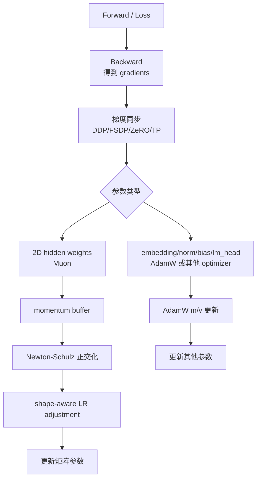
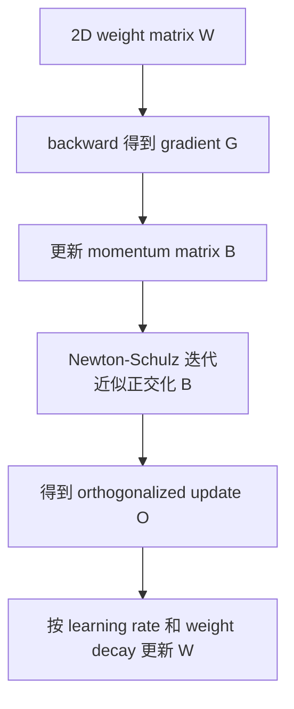
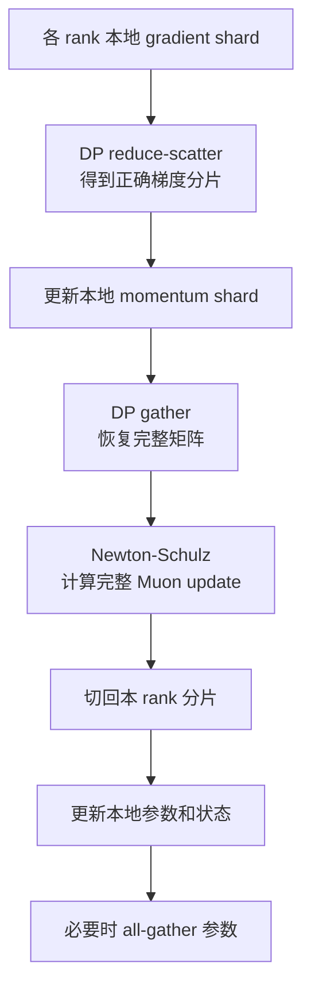

# Muon 优化器

Muon 是一种面向矩阵参数的优化器。它的核心不是给所有参数都换一个 optimizer，而是对神经网络 hidden layers 里的二维权重矩阵，用“动量 + 矩阵正交化”的方式产生更新方向。

如果只从训练系统角度记一句话：

> Muon 把 optimizer step 从逐元素更新，变成了矩阵级更新；它可能减少 optimizer state 并改善训练效率，但会引入 Newton-Schulz 矩阵乘、参数分组、分布式 gather、更新尺度和 checkpoint 语义问题。

这篇不深入证明 Muon 的优化理论。重点回答：

- Muon 和 SGD Momentum、AdamW 的差别是什么。
- 为什么它只适合部分矩阵参数。
- Newton-Schulz 正交化在系统里带来什么成本。
- Muon 和 ZeRO、FSDP、TP、MoE 训练如何互相影响。
- 评估 Muon 时不能只看 loss，还要看 wall-clock time、step time 和稳定性。

## Muon 在训练 step 里的位置

普通训练 step 的主链路是：

```text
data -> forward -> loss -> backward -> gradient sync -> optimizer step -> zero_grad
```

Muon 改变的是最后的 optimizer step。forward、loss、backward 的大部分结构不因为 Muon 改变；真正变化发生在“梯度已经算出来之后，如何把梯度变成参数更新”。



这张图说明了两个系统事实：

1. Muon 通常不是替换整个 optimizer，而是和 AdamW 组成混合 optimizer。
2. Muon optimizer step 里会出现矩阵乘、临时 buffer 和可能的 full-matrix gather，因此它应该被当成一个独立的训练子系统分析。

如果日志只记录“optimizer=muon”，信息是不够的。至少要记录：

```text
muon_param_count
muon_param_elements
adamw_param_count
adamw_param_elements
ns_steps
adjust_lr_fn
weight_decay
momentum
nesterov
distributed_matrix_semantics
```

这样才能在 loss、显存或速度异常时定位问题。

## 先从普通 optimizer step 说起

训练时，backward 得到每个参数的 gradient。Optimizer 用这些 gradient 更新权重。

最简单的 SGD 可以理解成：

```text
new_weight = old_weight - lr * gradient
```

SGD Momentum 会额外维护一个动量：

```text
momentum = beta * old_momentum + gradient
new_weight = old_weight - lr * momentum
```

AdamW 会维护一阶矩和二阶矩：

```text
m = beta1 * old_m + (1 - beta1) * gradient
v = beta2 * old_v + (1 - beta2) * gradient^2
update = m / sqrt(v + eps)
new_weight = weight_decay_then(old_weight) - lr * update
```

从系统角度看，AdamW 的特点是：

- 对每个参数元素维护 `m` 和 `v`。
- 混合精度训练里还可能维护 FP32 master weight。
- 更新主要是逐元素操作，适合 foreach/fused optimizer。
- optimizer state 显存很高，但更新逻辑对参数形状不敏感。

Muon 的不同点在于：它不只是逐元素缩放 gradient，而是把二维权重矩阵的动量看成一个矩阵，再对这个矩阵做近似正交化。

## Muon 的核心流程

一个简化的 Muon step 可以理解成：

```text
gradient matrix G
-> momentum matrix B
-> Newton-Schulz approximate orthogonalization
-> orthogonalized update O
-> update weight matrix W
```

用图表示：



这里的“正交化”可以先用直觉理解：

- 普通动量矩阵可能被少数方向主导，更新看起来像“主要沿几个方向动”。
- 正交化会把矩阵更新方向变得更均衡，避免所有神经元或通道过度挤在少数方向上更新。
- Muon 实际使用 Newton-Schulz 迭代近似这个过程，而不是每一步都做昂贵的精确 SVD。

Keller Jordan 的原始介绍把 Muon 定义为 MomentUm Orthogonalized by Newton-Schulz。PyTorch 2.12 的 `torch.optim.Muon` 也把 Newton-Schulz steps、momentum、Nesterov、weight decay、update scale adjustment 暴露为 optimizer 参数。

## PyTorch Muon 暴露了哪些系统旋钮

PyTorch 2.12 的 `torch.optim.Muon` 已经把 Muon 的关键设计点放到 optimizer 参数里。重要参数可以按系统含义理解：

| 参数 | 直觉 | 系统影响 |
| --- | --- | --- |
| `lr` | Muon 参数组学习率 | 不能盲目照搬 AdamW，除非 update scale 策略支持这种比较。 |
| `weight_decay` | decoupled weight decay | 大规模训练中约束权重 RMS 和稳定性。 |
| `momentum` | momentum buffer 系数 | 长期 optimizer state；影响更新平滑程度。 |
| `nesterov` | 是否使用 Nesterov-style momentum | 改变正交化前的动量矩阵。 |
| `ns_coefficients` | Newton-Schulz 多项式系数 | 影响少量迭代后接近正交化方向的速度和数值行为。 |
| `eps` | 数值稳定项 | 防止归一化时除以过小范数。 |
| `ns_steps` | Newton-Schulz 迭代次数 | 直接影响 optimizer step 的矩阵乘次数。 |
| `adjust_lr_fn` | 按矩阵 shape 调整学习率 | 让不同形状矩阵的正交化更新 RMS 更一致。 |

其中最容易被忽略的是 `adjust_lr_fn`。Muon 的正交化更新不是 AdamW 的逐元素归一化，矩阵长宽不同会让更新 RMS 不一致。PyTorch 文档给出两个方向：

- `original`：接近 Keller 原始实现的尺度策略。
- `match_rms_adamw`：参考 Moonshot 实现，目标是让 Muon 的更新尺度更接近 AdamW 的 RMS 行为。

工程上，`adjust_lr_fn` 应该被当作实验配置的一部分。两个实验即使都叫 Muon，`adjust_lr_fn` 不同，学习率语义也可能不同。

## 正交化到底改变了什么

Muon 的关键不是“动量”本身，而是对动量矩阵做正交化。一个矩阵更新可以用奇异值分解理解：

```text
B = U S V^T
```

普通动量更新会保留奇异值 `S` 的大小差异。若少数奇异值很大，更新会被少数方向主导。

正交化近似做的是：

```text
O ~= U V^T
```

直觉上，它把“哪些方向要动”保留下来，但把不同方向的尺度拉得更均衡。Keller 的原始说明把这解释为把 SGD-momentum 的矩阵更新替换为最近的半正交矩阵；后续理论工作也在解释少量 Newton-Schulz step 为什么能接近这个极分解方向。

对训练系统来说，这个理论直觉转化成几个工程问题：

- update RMS 需要按矩阵形状校准。
- weight RMS 和 update RMS 要长期监控。
- 学习率可能和 AdamW 不同。
- TP/FSDP 切分改变矩阵形状时，更新语义可能改变。
- 小矩阵和大矩阵的 optimizer time 不同。

所以 Muon 不是“换一行 optimizer”。它把优化器从 element-wise update 推向 matrix-aware update。

## 为什么是矩阵参数

Muon 关心的是二维权重矩阵，例如 Transformer 里的很多线性层：

- attention 的 `q_proj`、`k_proj`、`v_proj`、`o_proj`。
- MLP 的 up projection、gate projection、down projection。
- MoE expert 里的 FFN 矩阵。

这些参数天然是矩阵。矩阵有行、列和方向结构，正交化才有明确含义。

不适合直接交给 Muon 的参数通常包括：

- bias。
- LayerNorm / RMSNorm 权重。
- embedding。
- LM head / output projection，具体是否纳入要看实现和实验设计。
- 标量、向量或非典型 shape 参数。

这也是为什么实践中常见做法不是“全模型 Muon”，而是：

```text
2D hidden layer weights -> Muon
other params             -> AdamW
```

PyTorch 文档示例也是按 `p.ndim == 2` 和 `p.ndim != 2` 把参数分到 Muon 与 AdamW 两组。

### QKV 合并矩阵要特别小心

很多 Transformer 实现会把 Q、K、V 合成一个大线性层：

```text
qkv_proj: hidden -> 3 * hidden
```

也有实现把它们拆成：

```text
q_proj
k_proj
v_proj
```

Muon 对完整矩阵做正交化，所以“合在一起”和“拆开处理”不是完全等价的。Keller 的经验说明里也提到，Transformer 里分别对 Q、K、V 参数应用 Muon 可能比把 QKV 当成一个拼接矩阵更好。

系统含义是：

- 参数名和模块结构会影响 Muon 分组。
- 同一模型的 fused QKV 和 split QKV 实现，Muon 结果可能不同。
- TP 切分 QKV 后，本地 shard 的矩阵形状又会改变。
- checkpoint 从 fused 迁移到 split 时，optimizer state 不能简单复用。

如果要比较 Muon 实验，应把 QKV 结构写进 run manifest：

```yaml
attention_projection:
  qkv_layout: "split"  # split / fused
  muon_applied_separately_to_qkv: true
  tensor_parallel_sharding: "column"
```

这不是小细节。对矩阵级 optimizer 来说，矩阵边界就是优化语义的一部分。

## 和 AdamW 的系统差异

AdamW 对每个元素保存两个状态：

```text
parameter p
gradient g
first moment m
second moment v
optional master weight
```

Muon 更像：

```text
matrix parameter W
gradient matrix G
momentum matrix B
optional master weight
temporary matrices for Newton-Schulz
```

重要差异有三类。

### 状态数量不同

AdamW 通常有 `m` 和 `v` 两个长期状态。Muon 至少需要 momentum buffer，但不一定需要 AdamW 那样的二阶矩状态。

所以在某些实现里，Muon 的长期 optimizer state 可能比 AdamW 少。Moonshot 的 Muon scaling 报告也强调，Distributed Muon 使用一个 momentum buffer，而 AdamW 有两个 momentum buffers。

但这不等于 Muon 一定更省显存。原因是：

- 可能仍有 FP32 master weight。
- Newton-Schulz 会产生临时矩阵。
- foreach/fused 实现可能有临时 buffer。
- 分布式 gather 可能在 optimizer step 中短暂形成 full matrix。

评估显存时要看 peak memory，而不是只看长期 optimizer state。

### 更新粒度不同

AdamW 是逐元素更新：

```text
update[i, j] depends mostly on g[i, j], m[i, j], v[i, j]
```

Muon 是矩阵级更新：

```text
update matrix O depends on the whole momentum matrix B
```

这意味着 Muon 对参数矩阵完整形状更敏感。如果一个矩阵被分布式切碎，只在本地 shard 上做 Muon，结果未必等价于在完整矩阵上做 Muon。

### 更新尺度不同

正交化会改变更新矩阵的谱结构，也会让不同 shape 的矩阵更新 RMS 不一致。Muon scaling 工作提出要用 weight decay 和 per-parameter update scale adjustment 来让 Muon 更稳定地扩展到大模型训练。

工程含义是：

- Muon 的 `lr` 不能简单照搬所有 AdamW 配置。
- 如果实现提供 `adjust_lr_fn`，要明确选择哪种尺度策略。
- 不同矩阵 shape、GQA/MLA 切法、MoE expert shape 都可能影响更新尺度。

## Newton-Schulz 迭代是什么

严格说，正交化可以通过 SVD 得到。如果动量矩阵 `B` 的 SVD 是：

```text
B = U S V^T
```

正交化更新方向可以近似看成：

```text
O = U V^T
```

但每个 optimizer step 对大量权重矩阵做 SVD 太贵。Muon 使用 Newton-Schulz 迭代，用少量矩阵乘近似这个正交化方向。

这就是系统上最重要的点：

> Muon 把一部分 optimizer step 变成了小到中等规模的矩阵乘。

这和 AdamW 的逐元素更新完全不同。

### Newton-Schulz 的成本

一次 Newton-Schulz 迭代大致包含：

- 矩阵乘 `X @ X.T`。
- 多项式组合。
- 再乘回 `X`。

如果做 5 次迭代，就会增加多轮矩阵乘。矩阵很大时，这些计算不可忽略；矩阵很小时，kernel launch 和调度开销可能更明显。

所以 Muon 的性能不只取决于 FLOPs，还取决于：

- 每个矩阵 shape。
- 参数矩阵数量。
- 是否有 fused / batched 实现。
- 临时矩阵 dtype。
- optimizer step 是否能与通信或其他计算重叠。
- small GEMM 是否能吃满 GPU。

### 为什么不是直接 SVD

SVD 更精确，但系统成本通常太高：

- 延迟更高。
- 实现复杂。
- 对大量不同 shape 的小矩阵不友好。
- 分布式训练中更难组合。

Newton-Schulz 的意义是用固定次数的矩阵乘换取足够好的近似。2026 年 ICLR 接收的 Muon with Newton-Schulz 收敛分析，也正是在解释“少量 Newton-Schulz step 为什么在理论上接近精确极分解方向”。

## Newton-Schulz 的 shape 成本模型

Muon 的额外成本主要来自 Newton-Schulz。对一个 `n x m` 矩阵，如果假设 `m <= n`，每一步大致会做：

```text
X @ X.T
(X @ X.T) @ X
```

实际实现会用多项式组合减少一些开销，但核心仍然是矩阵乘。Keller 的运行时分析给出的直觉是：语言模型训练中，如果每个 step 的 token batch `B` 足够大，Muon 的额外 FLOPs 相对 forward/backward 可能很小；但这不代表所有场景都小。

Muon overhead 更容易变大的场景：

| 场景 | 原因 |
| --- | --- |
| micro-batch 很小 | forward/backward 计算量小，optimizer 矩阵乘占比上升。 |
| 矩阵很多且偏小 | small GEMM 和 kernel launch overhead 明显。 |
| `ns_steps` 增大 | 每多一次 Newton-Schulz 都会增加矩阵乘。 |
| 分布式 full-matrix gather | 通信和临时显存进入 optimizer step。 |
| 矩阵 shape 很不规则 | batched/grouped GEMM 更难高效。 |

因此 Muon benchmark 不能只报告总 step time，最好拆出：

```text
optimizer_total_time
muon_ns_matmul_time
muon_gather_time
adamw_time
optimizer_temp_memory
```

如果 Muon 的 sample efficiency 提升明显，optimizer step 稍慢可能仍然划算；如果 sample efficiency 没提升，额外 optimizer time 就是纯成本。

## `ns_steps` 如何选择

`ns_steps` 是最直接的性能/近似精度旋钮。默认常见值是 5。

可以把它理解为：

```text
更多 ns_steps -> 更接近理想正交化 -> optimizer step 更慢
更少 ns_steps -> 近似更粗 -> optimizer step 更快
```

但是它不一定线性影响最终训练质量。实际应该做小规模 ablation：

| 对比 | 观察 |
| --- | --- |
| `ns_steps=3` | 是否明显更快，loss 是否变差。 |
| `ns_steps=5` | 默认或常用基线。 |
| `ns_steps=7` | 是否有质量收益，是否值得额外 step time。 |

还要同时记录：

- `ns_coefficients`。
- temporary dtype。
- matrix shape 分布。
- step time breakdown。
- NaN/Inf 次数。
- weight/update RMS。

不要只把 `ns_steps` 当成算法超参。它也是优化器算子成本配置。

## 一个极简训练循环

Muon 与 AdamW 混用时，训练循环通常会出现两组 optimizer：

```python
muon_params = []
adamw_params = []

for name, p in model.named_parameters():
    if p.ndim == 2 and "embed" not in name and "lm_head" not in name:
        muon_params.append(p)
    else:
        adamw_params.append(p)

optim_muon = torch.optim.Muon(muon_params, lr=muon_lr, weight_decay=muon_wd)
optim_adamw = torch.optim.AdamW(adamw_params, lr=adamw_lr, weight_decay=adamw_wd)

loss.backward()
optim_muon.step()
optim_adamw.step()
optim_muon.zero_grad(set_to_none=True)
optim_adamw.zero_grad(set_to_none=True)
```

实际系统还要加上：

- gradient accumulation。
- gradient clipping。
- mixed precision / GradScaler。
- distributed gradient sync。
- scheduler。
- checkpoint。
- parameter group 日志。

关键不是这段代码，而是参数分组必须可解释、可复现、可 checkpoint。

## 参数分组怎么做

Muon 的参数分组比 AdamW 更重要。因为一旦分错，优化语义就变了。

一个保守策略是：

| 参数类型 | 建议 |
| --- | --- |
| Transformer hidden linear weights | 优先考虑 Muon |
| Attention Q/K/V/O projection | 可考虑 Muon |
| MLP / FFN projection | 可考虑 Muon |
| MoE expert FFN weights | 可考虑 Muon，但要关注 expert 分布式切分 |
| embedding | 通常 AdamW |
| LM head | 通常 AdamW 或单独实验 |
| bias | AdamW 或不 decay |
| RMSNorm / LayerNorm | AdamW 或不 decay |
| rope / scalar 参数 | 不交给 Muon |

参数分组最好不要只靠 `ndim == 2`，因为 embedding 和 LM head 也可能是二维矩阵。

更稳妥的方式是按模块名、模块类型和参数名共同判断：

```text
include:
  transformer.blocks.*.attn.*_proj.weight
  transformer.blocks.*.mlp.*_proj.weight
  transformer.blocks.*.experts.*.weight

exclude:
  *.embed*
  *.lm_head*
  *.norm*
  *.bias
```

每次实验都应把最终参数分组打印出来：

```text
Muon params:
  count
  total elements
  dtype
  top modules

AdamW params:
  count
  total elements
  dtype
  excluded reasons
```

否则 loss 出问题时很难判断是 optimizer 本身、参数分组，还是学习率配置的问题。

## 参数分组的自动化校验

Muon 引入后，参数分组必须有自动校验。建议训练启动时输出并保存一份 parameter group manifest：

```yaml
parameter_groups:
  muon:
    total_params: 123456789
    total_tensors: 180
    include_patterns:
      - "blocks.*.attn.q_proj.weight"
      - "blocks.*.mlp.up_proj.weight"
    exclude_patterns:
      - "embed"
      - "lm_head"
      - "norm"
  adamw:
    total_params: 9876543
    reasons:
      embedding: 1
      norm: 96
      bias: 96
```

启动时可以加几条硬性检查：

- `Muon params` 里不能出现 `embed`、`lm_head`、`norm`、`bias`。
- 所有 trainable parameter 必须且只能属于一个 optimizer group。
- Muon 参数必须是二维矩阵。
- 每类参数数量和上一次 baseline 的 manifest 差异过大时报警。
- 恢复 checkpoint 时，param group manifest 必须匹配或显式迁移。

这类检查很朴素，但能避免很多“跑了几天才发现 LM head 被 Muon 训练了”的问题。

## Weight Decay 和更新尺度

早期 Muon 实现并不一定使用 decoupled weight decay。但大规模 LLM 训练报告指出，weight decay 对 Muon 扩展到大模型很重要。

直觉是：

- 正交化更新可能让某些权重范数长期增长。
- 大模型长时间训练时，权重 RMS 或层输出 RMS 失控会影响 BF16 数值范围和稳定性。
- Decoupled weight decay 给权重规模一个持续约束。

更新尺度同样关键。正交化后的矩阵更新不是 AdamW 那种逐元素归一化，它的 RMS 会受矩阵 shape 影响。

工程上要记录：

- Muon learning rate。
- AdamW learning rate。
- Muon weight decay。
- AdamW weight decay。
- `adjust_lr_fn` 或等价 scaling 规则。
- Newton-Schulz steps。
- momentum / nesterov。
- 哪些参数使用 Muon。

如果只记录“用了 Muon”，实验不可复现。

## 学习率和 Scheduler 语义

Muon + AdamW 混用时，学习率配置有三层含义：

```text
Muon base lr
AdamW base lr
per-parameter update scale adjustment
```

不能默认两组 optimizer 一定共享同一个 lr。常见策略有三种：

| 策略 | 做法 | 风险 |
| --- | --- | --- |
| 共享 scheduler，不同 base lr | Muon 和 AdamW 用同一个 warmup/cosine 形状，但 base lr 不同 | 简单，但需要调两个 base lr。 |
| 完全独立 scheduler | Muon/AdamW 各自 warmup、decay | 灵活，但实验空间变大。 |
| 共享 base lr，依赖 `adjust_lr_fn` | 让 Muon update scale 尽量匹配 AdamW | 依赖实现语义，换实现可能不可比。 |

从系统记录角度，至少要保存：

```yaml
scheduler:
  global_step_semantics: "optimizer_step"
  warmup_steps: 2000
  decay: "cosine"
  muon_lr: 0.02
  adamw_lr: 0.003
  adjust_lr_fn: "match_rms_adamw"
```

还要确认 gradient accumulation 下 scheduler step 的语义：

```text
micro-step != optimizer-step
```

Muon 的 optimizer step 比 AdamW 更重，如果因为 AMP overflow 或稳定性 guardrail 跳过某次 optimizer step，Muon 和 AdamW 的 scheduler、momentum、global step 必须保持一致。

## Weight RMS 与 Update RMS 监控

Muon 是否稳定，不能只看 loss。建议每隔固定 step 采样一批参数，记录：

```text
weight_rms
grad_rms
momentum_rms
muon_update_rms
update_to_weight_ratio
```

按模块类型聚合：

| 模块 | 重点 |
| --- | --- |
| attention q/k/v/o | 看 QKV 更新尺度是否异常。 |
| MLP gate/up/down | 参数量大，影响整体 optimizer 成本。 |
| MoE experts | hot/cold expert 是否出现不同 RMS。 |
| AdamW group | embedding/norm/lm_head 是否稳定。 |

如果出现 loss spike，可以回看：

- 是所有 Muon 参数 update 变大，还是某一类矩阵异常。
- 是 weight RMS 持续增长，还是某个 step 突然跳变。
- 是 Muon group 异常，还是 AdamW group 异常。
- 是否与 scheduler warmup、ns_steps、dtype、checkpoint resume 有关。

大模型训练中，这类 RMS 指标比单个 global grad norm 更容易定位 Muon 问题。

## 混合精度与数值稳定性

Muon 常见实现会在 Newton-Schulz 中使用 BF16，以降低成本。但这并不表示所有状态都可以随便低精度。

需要区分：

- 模型权重 dtype。
- gradient dtype。
- momentum buffer dtype。
- Newton-Schulz temporary dtype。
- master weight dtype。
- reduce-scatter / all-gather dtype。

几个常见风险：

- BF16 下矩阵范数过大或过小，正交化输入尺度不稳定。
- 临时矩阵乘产生 NaN/Inf。
- update scale 对某些矩阵过大，训练早期 loss spike。
- 混合 Muon + AdamW 时，两组参数的 LR scheduler 语义不一致。
- checkpoint 恢复后 optimizer state dtype 或 param group 顺序错位。

监控项至少包括：

- loss / grad norm。
- weight RMS。
- update RMS。
- Muon update norm。
- Newton-Schulz 输出是否出现 NaN/Inf。
- 各 parameter group 的 learning rate。

### FP8 训练中要更谨慎

如果训练系统已经使用 FP8 activation 或 FP8 weight/gradient 路径，Muon 还会增加一层数值复杂度。

需要明确：

- Newton-Schulz temporary 是否仍用 BF16/FP32，而不是 FP8。
- momentum buffer 用什么 dtype。
- FP8 amax/scale 更新是否受 Muon update RMS 影响。
- Muon 参数和 AdamW 参数是否使用相同 mixed precision policy。
- checkpoint 是否保存 FP8 scale state 和 Muon momentum state。

Muon 本身不是 FP8 技术。它可以和 FP8 训练组合，但不要把两种不稳定来源同时打开后再调试。更稳妥的路线是：

```text
AdamW BF16 baseline
-> Muon BF16 baseline
-> AdamW FP8 baseline
-> Muon + FP8
```

每一步都记录 loss spike、NaN/Inf、weight RMS、update RMS 和 step time。

## 和 ZeRO/FSDP 的关系

AdamW 的更新是逐元素的，所以 ZeRO-1 / FSDP shard optimizer state 很自然：每个 rank 只更新自己负责的一段参数和状态。

Muon 麻烦在于：正交化需要看到完整矩阵，至少需要看到一个语义完整的矩阵块。

如果一个矩阵 `W` 被 DP 维度切成 shard：

```text
rank 0: W_part_0
rank 1: W_part_1
rank 2: W_part_2
rank 3: W_part_3
```

对每个 shard 单独做 Newton-Schulz，和对完整 `W` 做 Newton-Schulz 再切回 shard，结果通常不同。

所以分布式 Muon 需要明确选择：

1. gather full gradient / momentum matrix，再计算 Muon update。
2. 只对本地 shard 做近似 Muon，接受语义变化。
3. 按参数切分方式设计矩阵块，使每个块仍然有合理语义。

Moonshot 的 Distributed Muon 方案采用类似 ZeRO-1 的状态切分，同时增加 DP gather 来恢复 full gradient matrix，再做 Newton-Schulz update，然后只保留本 rank 负责的分片。

这带来一个典型流程：



系统代价包括：

- 额外 gather。
- full matrix 临时显存。
- Newton-Schulz 计算。
- update 分片丢弃带来的中间结果浪费。
- 与已有 FSDP/ZeRO 状态机的集成复杂度。

## Full-matrix Muon 与 Shard-local Muon

分布式 Muon 需要先决定语义，而不是先写代码。

| 方案 | 语义 | 系统代价 |
| --- | --- | --- |
| Full-matrix Muon | 先恢复完整矩阵，再做正交化 | 通信和临时显存高，但更接近单卡语义。 |
| Shard-local Muon | 每个 shard 独立做正交化 | 简单、便宜，但 TP/FSDP world size 会影响优化行为。 |
| Block-wise Muon | 按有意义的矩阵块做正交化 | 折中，但需要设计块边界和记录规则。 |

推荐在实验名和 manifest 中明确写：

```yaml
muon_distributed_semantics: "full_matrix"  # full_matrix / shard_local / blockwise
matrix_boundary_rule: "split_qkv_and_ffn_projection"
dp_gather_for_muon: true
tp_local_muon: false
```

否则未来对比两个 Muon 实验时，很可能一个是 full-matrix，一个是 shard-local，结果却被误认为是学习率或数据差异。

### ZeRO / FSDP 的状态切分细节

在 ZeRO/FSDP 场景里，Muon 状态至少涉及三类对象：

```text
parameter shard
gradient shard
momentum shard
```

如果要做 full-matrix Muon，还会有：

```text
full momentum / gradient temporary
full orthogonalized update temporary
```

因此 memory accounting 要分成：

| 项目 | 长期存在 | 峰值存在 |
| --- | --- | --- |
| parameter shard | 是 | 是 |
| momentum shard | 是 | 是 |
| full matrix temporary | 否 | 是 |
| Newton-Schulz temporary | 否 | 是 |
| update shard | 可能 | 是 |

很多 OOM 不会出现在 forward/backward，而会出现在 optimizer step。排查时要单独记录 optimizer-step peak memory。

## 和 Tensor Parallel 的关系

Tensor Parallel 会把一个线性层的矩阵按行或列切开。例如 column parallel linear：

```text
W = [W0, W1, W2, W3]
```

每个 rank 只持有一部分输出列。此时 Muon 有几种可能：

- 在每个 TP shard 上单独做 Muon。
- gather TP shard 后对完整矩阵做 Muon。
- 把 TP shard 视为独立矩阵，承认语义和 full matrix Muon 不同。

没有免费的选择。

如果 gather：

- 语义更接近完整矩阵。
- 通信和临时显存增加。
- optimizer step 更复杂。

如果 shard-local：

- 实现简单。
- 通信少。
- 更新方向依赖切分方式，TP size 改变可能导致优化行为改变。

所以使用 Muon 做 TP 训练时，benchmark 必须固定 TP size 和切分策略。不能假设 `TP=1` 的调参结果直接搬到 `TP=8`。

### Column Parallel 与 Row Parallel 的差异

Transformer 里的 TP 常见两类线性层：

```text
Column Parallel: W 按输出维切分
Row Parallel:    W 按输入维切分
```

对 AdamW 来说，两者主要影响通信位置；对 Muon 来说，两者还影响矩阵正交化看到的形状。

Shard-local Muon 下：

- Column parallel rank 看到的是 `out_shard x in`。
- Row parallel rank 看到的是 `out x in_shard`。
- TP size 改变时，本地矩阵长宽比改变。
- `adjust_lr_fn` 对长宽比敏感，更新尺度可能变化。

Full-matrix Muon 下：

- 需要额外 gather。
- 可能破坏 TP optimizer step 的简单性。
- 需要把 full update 切回 TP shard。

所以 TP + Muon 实验要固定并记录：

```yaml
tensor_parallel:
  size: 8
  column_parallel_muon: "shard_local"
  row_parallel_muon: "shard_local"
  qkv_layout: "split"
  adjust_lr_fn: "match_rms_adamw"
```

如果未来换 TP size 或换 fused QKV 实现，应重新验证 Muon 学习率和稳定性。

## 和 Pipeline Parallel 的关系

Pipeline Parallel 对 Muon 的影响相对间接。

主要问题是：

- 不同 stage 的参数 shape 不同，Muon optimizer time 可能不均衡。
- 某些 stage 有 embedding / lm_head，Muon 参数比例较低。
- optimizer step 通常发生在一次 global batch 完成后，可能造成 stage 间等待。
- 如果 optimizer step 很重，pipeline bubble 之外还会出现 optimizer tail。

排查方式：

- 分 stage 统计 optimizer step time。
- 分 stage 统计 Muon 参数量。
- 看 optimizer step 是否成为 iteration 末尾的 exposed time。
- 对 embedding-heavy stage 单独处理 AdamW 参数和 checkpoint。

## 和 MoE 训练的关系

MoE 模型里，专家 FFN 是大量二维矩阵，理论上很适合 Muon。但 MoE 训练本身已经有 Expert Parallel、AllToAll、load balance、token dispatch/combine 等复杂性，Muon 会叠加新的系统问题。

需要重点关注：

- expert weight 是否按 EP 切分。
- 每个 rank 持有哪些 expert。
- expert matrix 是否完整在单卡上。
- Muon momentum state 是否随 expert 放置。
- expert 迁移、checkpoint、resume 是否保持 optimizer state 对齐。
- 大 EP / 小 EP 改变后，Muon 的参数分组和更新语义是否变化。

如果每个 expert 的矩阵完整放在某个 rank 上，Muon 实现会简单很多。如果 expert 矩阵还被 TP 或 FSDP 切开，就要处理 full matrix 语义。

MoE 场景还要监控：

- router 是否稳定。
- expert load balance loss。
- 不同 expert 的 weight RMS / update RMS。
- hot expert 和 cold expert 的 optimizer state 是否有异常。

### Expert 负载不均会影响 Muon 状态

MoE 里不同 expert 被选中的频率可能不同。hot expert 经常收到梯度，cold expert 很少更新。Muon momentum 是长期状态，这会让 expert 之间出现不同的 update 历史。

需要关注：

- 每个 expert 的 token count。
- 每个 expert 的 grad RMS。
- 每个 expert 的 momentum RMS。
- 每个 expert 的 update-to-weight ratio。
- load balance loss 与 Muon update 是否同时异常。

如果 cold expert 长时间没有有效梯度，momentum buffer 的行为要明确：

- 没有梯度时是否跳过 step？
- momentum 是否 decay？
- expert 被重新激活时 update 是否突变？

这类问题在 dense 模型里不明显，但在 MoE 中会成为 optimizer state lifecycle 问题。

## Muon 适合哪些训练阶段

Muon 最值得关注的场景通常是大规模预训练或继续预训练，因为这些场景：

- hidden layer 2D 参数占比高。
- optimizer state 成本大。
- tokens to target loss 很重要。
- 长时间训练能摊薄调参成本。

不一定优先使用 Muon 的场景：

| 场景 | 原因 |
| --- | --- |
| 很小的 LoRA 微调 | trainable adapter 很少，Muon 的矩阵级优势有限。 |
| 只训练 embedding/head 的任务 | 这些参数通常不适合直接交给 Muon。 |
| 短周期 SFT 实验 | 调参和稳定性验证成本可能超过收益。 |
| 已经被数据/rollout/verifier 限制的后训练 | optimizer 不是主要瓶颈。 |
| 高风险生产训练首轮 | Muon 引入新的分布式和 checkpoint 变量。 |

可以把 Muon 的引入顺序设计成：

```text
小模型 dense pretraining ablation
-> 中等模型继续预训练
-> 大模型 pretraining
-> MoE / TP / FSDP 组合
-> 后训练特定场景
```

这样每一步都能定位问题，而不是一开始就在最复杂系统里叠加所有变量。

## Checkpoint 与恢复

Muon checkpoint 不能只保存模型权重。

至少要保存：

- Muon optimizer param groups。
- momentum buffers。
- AdamW param groups。
- AdamW `m/v` states。
- master weights，如果有。
- scheduler state。
- gradient scaler state，如果用 FP16 AMP。
- global step / consumed tokens。
- 参数分组规则版本。

对于 Muon 特别要注意：

- 参数顺序变了，momentum buffer 会错位。
- 模块重命名后，state dict 可能加载到错误参数。
- Muon 与 AdamW 参数组划分改变，会导致老 checkpoint 难以恢复。
- TP/FSDP/ZeRO world size 改变时，sharded optimizer state 需要 reshard。
- `adjust_lr_fn`、`ns_steps`、momentum 等配置应写进 checkpoint metadata。

推荐在 checkpoint metadata 中记录：

```yaml
optimizer:
  muon:
    enabled: true
    param_rule_version: v1
    ns_steps: 5
    momentum: 0.95
    nesterov: true
    adjust_lr_fn: match_rms_adamw
    weight_decay: 0.1
  adamw:
    used_for:
      - embedding
      - lm_head
      - norm
      - bias
```

这能避免半年后只剩一个 checkpoint，却不知道哪些参数当时到底用了哪个 optimizer。

## Benchmark 应该怎么做

Muon 的 benchmark 不能只比较“相同步数下 loss 更低”。训练系统关心的是更快、更省、更稳定。

至少做四组对比：

| 对比项 | 目的 |
| --- | --- |
| AdamW baseline | 有强基线，避免把弱 AdamW 调参当成 Muon 优势 |
| Muon sample efficiency | 看相同 token / step 下 loss |
| Muon wall-clock efficiency | 看达到目标 loss 的真实时间 |
| Muon system overhead | 看 optimizer step time、显存、通信和稳定性 |

### 关键指标

训练指标：

- training loss。
- validation loss。
- downstream eval，如果有。
- tokens to target loss。
- steps to target loss。

系统指标：

- step time。
- optimizer step time。
- forward time。
- backward time。
- communication time。
- peak memory。
- tokens/s。
- MFU。
- checkpoint size。
- checkpoint save/load time。

稳定性指标：

- NaN/Inf 次数。
- loss spike。
- grad norm。
- weight RMS。
- update RMS。
- resume 后 loss 是否连续。

### 需要固定的变量

如果比较 AdamW 和 Muon，必须固定：

- 模型结构。
- dataset 和 tokenization。
- sequence length。
- global batch tokens。
- warmup steps。
- scheduler。
- precision。
- parallelism layout。
- hardware。
- profiler 采样窗口。
- checkpoint/resume 策略。

否则很容易比较到别的变量。

## 推荐实验路线

Muon 的实验不要直接从最大模型开始。推荐分阶段推进。

### 阶段一：单机小模型语义验证

目标是证明实现没错。

检查：

- Muon/AdamW 参数分组符合预期。
- loss 能正常下降。
- checkpoint/resume 后 loss 连续。
- `ns_steps`、`adjust_lr_fn`、weight decay 能被记录。
- 没有 NaN/Inf。

这阶段不要追求最终质量，只验证训练语义。

### 阶段二：同等 token 的 sample efficiency

目标是比较相同 token 数下，Muon 是否更快降低 loss。

固定：

- dataset。
- tokenization。
- batch tokens。
- scheduler。
- precision。
- eval cadence。

报告：

```text
loss at same tokens
eval at same tokens
tokens to target loss
```

如果同等 token 没有优势，继续扩大规模前要谨慎。

### 阶段三：同等 wall-clock 的系统效率

目标是比较真实时间成本。

报告：

```text
wall-clock to target loss
tokens/s
step time
optimizer step time
peak memory
checkpoint time
```

Muon 可能用更少 token 达到目标，但每 step 更慢；也可能 optimizer step 变慢，但总体 wall-clock 仍更短。必须用 wall-clock 结论判断系统价值。

### 阶段四：分布式扩展

目标是验证 Muon 与 DP/FSDP/ZeRO/TP/PP/EP 组合是否稳定。

固定并记录：

- DP/TP/PP/EP size。
- full-matrix 或 shard-local Muon。
- gather 通信量。
- optimizer-step peak memory。
- world size 变化后的 checkpoint 恢复。

如果 `TP=1` 调通，不代表 `TP=8` 行为一致；如果单机调通，也不代表 ZeRO/FSDP 没有 optimizer step 峰值问题。

## 运行时告警

训练平台可以给 Muon 增加专门告警：

| 告警 | 可能原因 |
| --- | --- |
| Muon group 出现 embedding/lm_head/norm | 参数分组规则过宽。 |
| optimizer step time 突然上升 | full-matrix gather、small GEMM、临时 buffer 或通信尾巴。 |
| update-to-weight ratio 激增 | learning rate、adjust_lr_fn、weight decay 或 NS 输出异常。 |
| Muon update NaN/Inf | NS temporary 数值异常或输入范数异常。 |
| resume 后 loss 跳变 | momentum buffer、param group 顺序或 scheduler state 错。 |
| TP size 改变后 loss 曲线不同 | shard-local Muon 语义改变。 |
| MoE hot expert RMS 异常 | expert load imbalance 影响 optimizer state。 |

这些告警最好按 parameter group 和模块类型聚合，不要只给一个全局数字。

## 性能剖析重点

Profiler 里要单独看 Muon optimizer step。

重点问题：

1. Newton-Schulz 的 GEMM 是否占明显时间。
2. small GEMM 是否过碎。
3. 是否有大量 tensor reshape / transpose / clone。
4. gather full matrix 是否造成通信尾巴。
5. temporary buffer 是否造成 peak memory。
6. Muon step 是否可以和参数 all-gather 或其他通信重叠。
7. checkpoint 保存 optimizer state 是否明显变大或变慢。

如果看到 optimizer step time 上升，不一定表示 Muon 不值得。还要看：

- 是否更少 token 达到目标 loss。
- 是否总体 wall-clock 更短。
- 是否降低长期 optimizer state 显存。
- 是否允许更大 batch 或更长 context。

系统评估要以“达到目标质量的总成本”为准。

## 和编译、CUDA Graph 的关系

Muon 的 optimizer step 包含动态参数列表、矩阵乘、可能的 gather 和临时 buffer。它和 `torch.compile`、CUDA Graph、fused optimizer 的关系要单独验证。

常见风险：

- 参数 shape 多样，难以形成稳定 graph。
- `ns_steps` 固定但参数列表很长，capture 成本高。
- 分布式 gather 或异步通信不容易 graph capture。
- 临时 buffer 分配导致 allocator 峰值。
- Python 层循环遍历大量矩阵，kernel launch 过碎。

优化方向：

- 按 shape 对矩阵分组。
- 使用 batched/grouped GEMM。
- 复用 temporary buffer。
- 把过小矩阵回退到 AdamW。
- 对 optimizer step 加 NVTX range，独立看 trace。

不要假设 AdamW fused optimizer 的经验可以直接迁移到 Muon。Muon 的核心计算已经从逐元素 kernel 变成矩阵乘和分布式矩阵语义。

## 常见优化方向

### 使用成熟实现

优先使用框架或经过验证的实现。Muon 涉及参数分组、Newton-Schulz、dtype、weight decay、update scale、checkpoint 和分布式切分，手写很容易漏细节。

成熟实现也要锁定版本。Muon 仍是快速演进中的 optimizer，不同实现对：

- `adjust_lr_fn`
- `ns_coefficients`
- weight decay
- QKV 分组
- distributed gather
- momentum dtype

可能有细微差异。实验报告里要写清楚实现来源和 commit/version。

### 减少小矩阵碎片

大量小矩阵逐个做 Newton-Schulz 会产生明显 launch overhead。可以考虑：

- batched GEMM。
- grouped kernel。
- fused optimizer step。
- 对过小矩阵回退 AdamW。

### 控制临时显存

Newton-Schulz 临时矩阵可能造成峰值显存上升。优化方向包括：

- BF16 temporary。
- in-place buffer reuse。
- 按参数分组分批执行。
- 避免在同一时间保留 full update 和 full gradient。

### 和分布式通信重叠

Distributed Muon 可能需要 gather。可以探索：

- gather 和局部 momentum update 重叠。
- optimizer reduce-scatter 和 parameter all-gather 重叠。
- 按 layer 顺序流水执行 optimizer step。
- 把 Muon step 放进更大的训练 runtime 调度里。

### 保守选择参数范围

初次引入 Muon 时，不建议一次性覆盖所有二维参数。更稳妥路线：

1. 只覆盖 Transformer hidden linear weights。
2. embedding、norm、bias、lm_head 保持 AdamW。
3. 记录每类参数的 loss、update RMS、weight RMS。
4. 稳定后再探索更多参数。

## 常见误区

### 误区一：Muon 就是 AdamW 的直接替代

不完全是。Muon 主要面向二维 hidden layer 参数，实践中经常和 AdamW 混用。

### 误区二：只要 `p.ndim == 2` 就全部用 Muon

不稳妥。Embedding 和 LM head 也可能是二维矩阵，但它们的训练语义和 hidden layer weight 不同。

### 误区三：Muon state 少，所以一定更快

不一定。Muon 可能减少长期状态，但 Newton-Schulz、临时矩阵、gather 和 small GEMM 都会增加 optimizer step 成本。

### 误区四：在 shard 上做 Muon 等价于 full matrix Muon

通常不等价。Muon 是矩阵级操作，切分方式会影响更新方向。

### 误区五：只看 step loss 就能判断 Muon 是否更好

不够。要看 tokens to target loss、wall-clock to target loss、系统开销和稳定性。

## 设计检查清单

引入 Muon 前，可以逐项确认：

- 哪些参数使用 Muon？
- 哪些参数继续使用 AdamW？
- 参数分组是否按名字和模块类型记录？
- Muon LR、AdamW LR 是否分别记录？
- weight decay 是否启用？
- `adjust_lr_fn` 或更新尺度策略是什么？
- Newton-Schulz steps 是多少？
- momentum / nesterov 配置是什么？
- Muon momentum dtype 是什么？
- Newton-Schulz temporary dtype 是什么？
- 是否有 FP32 master weight？
- FSDP/ZeRO/TP 下是否需要 full matrix gather？
- world size 改变后 checkpoint 能否恢复？
- profiler 是否单独统计 optimizer step？
- benchmark 是否比较 wall-clock to target loss？

## 小结

Muon 的价值不只是“换一个优化器”。它代表一种训练系统趋势：optimizer 不再只是逐元素更新参数，而是利用矩阵结构改变更新方向。

对训练系统来说，Muon 的关键点是：

- 它主要适合 hidden layer 的二维矩阵参数。
- 它通过 momentum matrix 的 Newton-Schulz 正交化产生更新方向。
- 它可能减少 AdamW 二阶矩状态，但会增加矩阵乘、临时 buffer 和分布式 gather。
- 它和 ZeRO/FSDP/TP 的组合必须明确 full matrix 语义。
- 它的 benchmark 必须同时看收敛、wall-clock、显存、通信和稳定性。

如果只把 Muon 当成一行 optimizer 替换，很容易踩坑。把它当成“矩阵级 optimizer subsystem”来设计，才更接近大模型训练系统里的真实问题。

## 参考资料

- [Muon: An optimizer for hidden layers in neural networks](https://kellerjordan.github.io/posts/muon/)
- [PyTorch: torch.optim.Muon](https://docs.pytorch.org/docs/2.12/generated/torch.optim.Muon.html)
- [Muon is Scalable for LLM Training](https://arxiv.org/abs/2502.16982)
- [Convergence of Muon with Newton-Schulz](https://arxiv.org/abs/2601.19156)
- [The Newton-Muon Optimizer](https://arxiv.org/abs/2604.01472)
