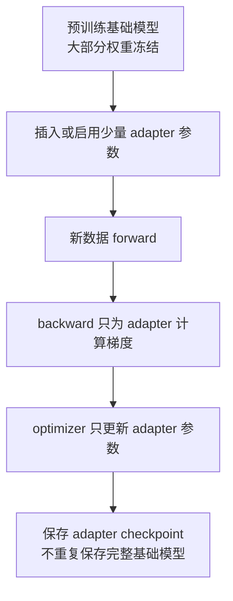
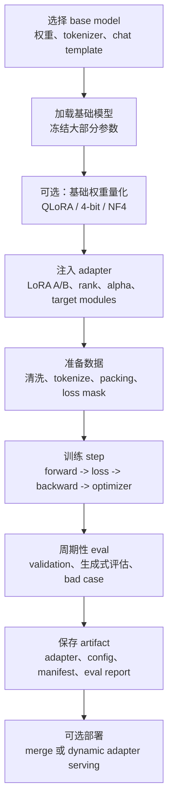
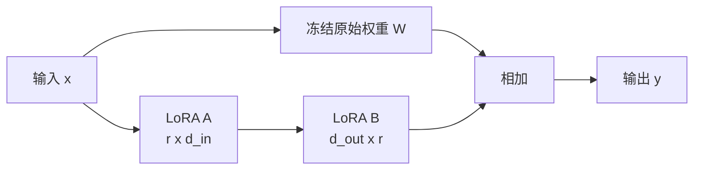
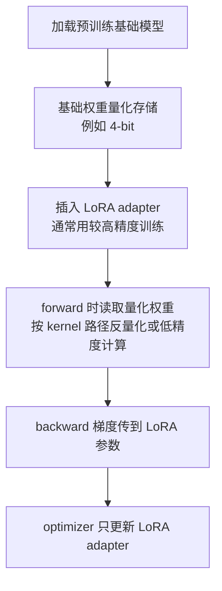
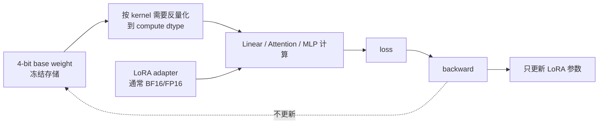
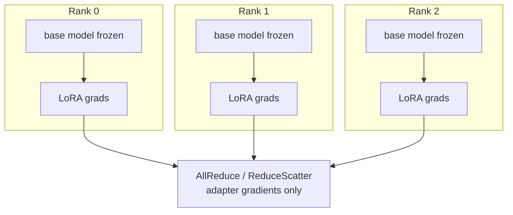

# 参数高效微调：LoRA、QLoRA 与 Adapter 系统优化

参数高效微调，英文常叫 Parameter-Efficient Fine-Tuning，简称 PEFT。它解决的问题不是“怎么从零训练一个更强模型”，而是：

> 已经有一个很大的预训练模型时，如何用更少显存、更短时间、更小 checkpoint 和更低平台成本，让它适配一个新任务或新数据域。

从训练系统角度看，PEFT 的核心价值在于改变训练状态的规模。全量微调会让几乎所有参数都需要 gradient、optimizer state 和 checkpoint；LoRA / QLoRA 这类方法则冻结大部分基础权重，只训练很小的一组 adapter 参数。

这篇不重点比较模型效果，也不深入讲各种 PEFT 论文变体。重点回答系统问题：

- 全量微调为什么贵。
- LoRA 为什么能大幅减少 trainable parameters。
- QLoRA 为什么能进一步降低基础权重显存。
- Adapter checkpoint 应该怎样管理。
- LoRA / QLoRA 与 activation、optimizer、FSDP/ZeRO、推理服务和 benchmark 有什么关系。

## 先理解全量微调为什么贵

全量微调的流程很直观：

```text
加载预训练模型
-> 用新数据做 forward
-> 计算 loss
-> backward 得到所有可训练参数的 gradient
-> optimizer 更新所有可训练参数
-> 保存新的完整模型权重和训练状态
```

如果模型有 `N` 个参数，并且所有参数都参与训练，那么系统要承担这些成本：

| 对象 | 是否接近 `N` 规模 | 说明 |
| --- | --- | --- |
| Parameters | 是 | 模型权重本身。 |
| Gradients | 是 | 每个可训练参数都要有梯度。 |
| Optimizer states | 是 | AdamW 通常有一阶矩和二阶矩。 |
| Master weights | 可能是 | 混合精度训练里可能保留 FP32 副本。 |
| Checkpoint | 是 | 常常保存完整模型和 optimizer state。 |

以 AdamW 混合精度训练粗略估算，如果每个参数有 BF16 parameter、BF16 gradient、FP32 master weight、FP32 `m`、FP32 `v`：

```text
2 + 2 + 4 + 4 + 4 = 16 bytes / parameter
```

7B 参数模型就是：

```text
7B * 16 bytes = 112GB
```

这还没有算 activation、temporary buffer、通信 buffer、allocator 碎片和 checkpoint 峰值。

所以全量微调贵，不只是因为模型权重大，而是因为“每个可训练参数”都会拖出 gradient、optimizer state、通信和保存成本。

## PEFT 的基本思想

PEFT 的思路是：不要动大部分基础权重，只训练少量新增参数或少量被选中的参数。



这会带来几个直接变化：

- trainable parameters 下降。
- gradients 下降。
- optimizer states 下降。
- checkpoint 变小。
- 单个微调任务更容易放进较少 GPU。
- 同一个基础模型可以挂很多个任务 adapter。

但也要立刻补一句：PEFT 不是把训练成本全部消掉。Forward/backward 仍然要穿过基础模型，activation 仍然会随 batch size、sequence length 和模型深度增长。

一句话：

> PEFT 主要减少参数相关状态，不自动减少所有 activation 成本。

## PEFT 训练请求生命周期

把 PEFT 看成一次训练作业，而不是一个模型技巧，会更容易理解它的系统边界。一个 LoRA / QLoRA 微调任务通常经历下面这些阶段：



这条链路说明了一个关键事实：PEFT 降低的是训练状态规模，但没有消除训练系统本身。数据、评估、checkpoint、资源调度、推理上线仍然都要被设计。

对平台来说，PEFT 任务至少有三层输入：

| 层次 | 例子 | 如果记录不清会怎样 |
| --- | --- | --- |
| Base model 层 | 模型 id、revision、权重 hash、tokenizer、chat template | adapter 无法解释，推理时可能加载到错误基础模型。 |
| Adapter 层 | 方法、rank、alpha、target modules、初始化、dtype | trainable 参数量不可复现，checkpoint 兼容性不清楚。 |
| Run 层 | 数据版本、batch、学习率、precision、硬件、代码 commit | 结果不可比较，resume 和复现实验困难。 |

因此 PEFT 实验不是“保存一个 adapter 文件”就结束。更完整的产物是：

```text
base model reference
+ adapter weights
+ adapter config
+ tokenizer/chat template reference
+ quantization config
+ training manifest
+ eval report
+ serving compatibility notes
```

这也是 PEFT 很适合知识库化的原因：它天然需要把模型版本、数据版本、训练配置、评估结果和部署状态串起来。

## LoRA 在做什么

LoRA 是 Low-Rank Adaptation。它的直觉是：微调时对一个大权重矩阵的改动，不一定需要重新学习一个完整的大矩阵，可以用两个小矩阵表示这次改动。

假设原始线性层权重是：

```text
W: d_out x d_in
```

全量微调会直接更新 `W`。LoRA 冻结 `W`，只学习一个低秩增量：

```text
W' = W + ΔW
ΔW = B @ A
```

其中：

```text
A: r x d_in
B: d_out x r
```

`r` 是 rank，通常远小于 `d_in` 和 `d_out`。

用图表示：



原始大矩阵参数量是：

```text
d_out * d_in
```

LoRA 新增参数量是：

```text
r * d_in + d_out * r
= r * (d_in + d_out)
```

如果 `d_in = d_out = 4096`，原始矩阵参数量是：

```text
4096 * 4096 = 16,777,216
```

如果 LoRA rank `r = 16`，新增参数量是：

```text
16 * (4096 + 4096) = 131,072
```

这一层只训练原来的约 0.78% 参数。

## LoRA 为什么成立

LoRA 的理论直觉可以浅显理解成两点。

第一，预训练模型已经学到了大量通用能力。微调不是从零学语言、世界知识或代码模式，而是在已有能力上做偏移。这个偏移往往比完整模型小得多。

第二，很多任务适配可能不需要在所有方向上自由改变权重。用低秩矩阵表示 `ΔW`，相当于限制“本次微调能改变的方向”。如果 rank 足够覆盖任务需要的主要变化，就能用少量参数完成适配。

这不是说所有任务都适合低秩更新，也不是说 rank 越低越好。它只是说明：对很多微调场景，完整更新空间过大，低秩更新是一个有效的系统折中。

## LoRA 常见插入位置

Transformer 里 LoRA 通常挂在线性层上。

常见目标模块包括：

| 模块 | 常见名字 | 系统影响 |
| --- | --- | --- |
| Attention Q projection | `q_proj`、`query` | 影响查询向量生成。 |
| Attention K projection | `k_proj`、`key` | 影响 key 表示。 |
| Attention V projection | `v_proj`、`value` | 常见 LoRA 目标。 |
| Attention output projection | `o_proj`、`out_proj` | 影响 attention 输出回写。 |
| MLP up / gate | `up_proj`、`gate_proj` | 参数量大，训练成本也会增加。 |
| MLP down | `down_proj` | 常见扩展目标。 |
| Embedding / LM head | `embed_tokens`、`lm_head` | 是否训练要谨慎，checkpoint 和推理兼容性更复杂。 |

只挂 attention 的 LoRA 参数少、速度快、显存低；同时挂 attention 和 MLP，表达能力更强，但训练参数、optimizer state、通信和 checkpoint 都会增加。

从系统角度看，`target_modules` 不是一个纯算法配置，而是资源配置：

- 目标模块越多，trainable parameters 越多。
- LoRA rank 越高，adapter 权重越大。
- 可训练模块越多，optimizer step 和 gradient sync 越重。
- checkpoint 越大，adapter 加载和多租户管理越复杂。

## LoRA 的关键配置

常见 LoRA 配置包括：

| 配置 | 含义 | 系统视角 |
| --- | --- | --- |
| `r` | 低秩矩阵 rank | 直接决定新增参数量和 adapter 大小。 |
| `lora_alpha` | LoRA 缩放系数 | 影响更新尺度，通常和 rank 一起调。 |
| `lora_dropout` | LoRA 分支 dropout | 训练正则化，可能略影响训练吞吐。 |
| `target_modules` | 插入 LoRA 的模块 | 决定哪些矩阵增加可训练分支。 |
| `bias` | 是否训练 bias | 会影响 checkpoint 和参数分组。 |
| `modules_to_save` | 额外保存的模块 | 常用于分类头、特殊 head、embedding 等。 |

最容易犯的错误是只记住 `r`，忽略 `target_modules`。两个实验都叫 LoRA rank 16，但一个只训练 `q_proj/v_proj`，另一个训练 attention + MLP，系统成本和效果都可能完全不同。

## LoRA 参数量如何估算

LoRA 的系统收益首先来自参数量变小。对一个线性层：

```text
W: d_out x d_in
LoRA A: r x d_in
LoRA B: d_out x r
```

新增参数量是：

```text
r * (d_in + d_out)
```

如果一个 Transformer block 里有多个线性层都挂 LoRA，总新增参数量就是每个目标矩阵的 LoRA 参数量求和，再乘以层数。

举一个简化估算。假设模型 hidden size 是 `4096`，有 `32` 层，只给 attention 的 `q_proj` 和 `v_proj` 加 LoRA，rank 是 `16`：

```text
单个 q_proj LoRA 参数 = 16 * (4096 + 4096) = 131,072
单层 q_proj + v_proj = 262,144
32 层总计 = 8,388,608
```

也就是约 8.4M trainable parameters。这个数量和 7B 基础模型相比很小。

但如果把 `q/k/v/o + gate/up/down` 都加上 LoRA，参数量会明显增加。粗略看：

```text
目标矩阵数从 2 个变成 7 个
trainable parameters 约增加到 3.5 倍
```

这就是为什么 `target_modules` 是资源配置，而不只是效果配置。

## LoRA 参数量、显存和通信量的关系

LoRA trainable parameters 变少以后，三个系统项会一起下降：

```text
adapter parameters
+ adapter gradients
+ adapter optimizer states
```

如果使用 AdamW，粗略估算一个 LoRA 参数可能对应：

```text
parameter: 2 bytes   # BF16/FP16
gradient: 2 bytes
Adam m:    4 bytes
Adam v:    4 bytes
```

即大约：

```text
12 bytes / trainable parameter
```

如果还有 FP32 master weight，则可能再加：

```text
+ 4 bytes / trainable parameter
```

前面例子里的 8.4M LoRA 参数，即使按 16 bytes 估算，也大约是：

```text
8.4M * 16 bytes ~= 134MB
```

这和全量训练 7B 参数时动辄百 GB 的训练状态完全不是一个量级。

通信量也类似。Data Parallel 下同步的通常是可训练参数的梯度。如果只训练 adapter，梯度同步量近似从“全模型参数规模”变成“adapter 参数规模”。

```text
全量微调 DP 通信量 ~= 全模型 gradient
LoRA DP 通信量 ~= adapter gradient
```

所以 LoRA 多卡训练常见现象是：

- gradient sync 不再是最大瓶颈。
- activation、attention、数据 pipeline 或 eval 反而更容易成为瓶颈。
- 多卡扩展收益可能受 batch size、数据吞吐和小任务启动开销限制。

## LoRA 初始化与缩放为什么重要

LoRA 并不是随便加两个矩阵。常见实现会让训练一开始等价于原始模型，避免刚注入 adapter 就改变输出。

一种常见做法是：

```text
A 随机初始化
B 初始化为 0
```

这样初始时：

```text
ΔW = B @ A = 0
W' = W
```

训练刚开始，模型行为仍然是 base model；随着训练进行，`B` 和 `A` 被更新，LoRA 分支逐渐学习任务偏移。

LoRA 还会使用缩放系数：

```text
y = W x + scale * B A x
```

常见原始缩放是：

```text
scale = alpha / r
```

一些实现还支持 rank-stabilized LoRA，把缩放改成与 `sqrt(r)` 相关。系统工程上不需要一开始深入所有变体，但要记录清楚 `alpha`、`r` 和缩放规则，因为它们会影响：

- 训练稳定性。
- 不同 rank 之间是否可比。
- adapter merge 后的数值结果。
- 多个 adapter 组合时的权重尺度。

## Adapter、LoRA 和 Prefix/Prompt Tuning 的区别

PEFT 不是只有 LoRA。常见方法还有 adapter layer、prefix tuning、prompt tuning 等。这里不展开算法细节，但要知道系统差异。

| 方法 | 大致做法 | 系统特点 |
| --- | --- | --- |
| LoRA | 在线性层旁边加低秩增量矩阵 | 参数少，容易 merge，训练和部署生态成熟。 |
| Adapter layer | 在 Transformer 层中插入小 MLP 或瓶颈层 | 表达能力强，但可能增加推理路径和延迟。 |
| Prefix tuning | 给 attention 增加可训练 prefix key/value | 参数少，但会改变有效上下文和 KV 形态。 |
| Prompt tuning | 训练软 prompt embedding | 参数很少，适合部分任务，但能力边界更明显。 |

从系统角度看，最重要的不是名字，而是它改变了什么：

- 是否新增 forward 分支。
- 是否改变 KV Cache。
- 是否能 merge 到基础权重。
- 是否需要 serving engine 原生支持。
- adapter checkpoint 是否可以独立保存。
- 多 adapter batching 时是否容易混合。

LoRA 受欢迎的一个工程原因是它和线性层结构贴合，合并/拆分语义比较清楚，推理部署更容易工程化。

## QLoRA 在 LoRA 上又做了什么

LoRA 冻结基础模型，但基础模型权重仍然要放进显存。对于更大模型，单是加载 BF16/FP16 基础权重就可能很贵。

QLoRA 的思路是：

> 把冻结的基础模型权重量化到低 bit，常见是 4-bit；训练时梯度通过量化基础模型回传到 LoRA adapter，只更新 LoRA 参数。

简化流程是：



QLoRA 减少的是冻结基础权重的显存占用，同时保留 LoRA 的小训练状态。原始 QLoRA 工作还引入了 NF4、double quantization 和 paged optimizer 等技术，用来进一步减少显存占用和管理显存峰值。

但是 QLoRA 不应该被理解成“4-bit 训练全模型”。它更准确地说是：

- 冻结基础权重量化保存。
- LoRA adapter 作为可训练参数。
- 梯度主要用于更新 adapter。
- activation、临时 buffer 和部分反量化计算仍然存在。

## QLoRA 的系统数据流

QLoRA 最容易被误解成“训练时所有东西都是 4-bit”。更准确的数据流是：



这里有几个精确点：

- 4-bit 主要用于保存冻结基础权重。
- 计算时通常需要把低 bit 权重解包或反量化到计算 dtype。
- LoRA adapter 通常用更高精度训练。
- 基础权重不进入 optimizer。
- activation 仍然主要由模型结构、序列长度和 batch 决定。

所以 QLoRA 的收益和代价要分开看：

| 项目 | 变化 |
| --- | --- |
| 基础权重显存 | 大幅下降。 |
| Adapter 训练状态 | 和 LoRA 类似，仍然存在。 |
| Activation | 不会自动按 4-bit 下降。 |
| Kernel 路径 | 可能增加量化/反量化和特殊 kernel 依赖。 |
| 吞吐 | 不保证更快，需要 benchmark。 |
| 兼容性 | 受 quantization backend、dtype、FSDP/ZeRO 支持影响。 |

## NF4、Double Quantization 与 Paged Optimizer

原始 QLoRA 工作里常被一起提到三个关键词：NF4、double quantization、paged optimizer。它们解决的是不同问题。

| 技术 | 解决什么问题 | 系统直觉 |
| --- | --- | --- |
| NF4 | 如何用 4-bit 更好表示常见权重分布 | 让冻结基础权重量化后更接近原权重。 |
| Double quantization | 量化常数本身也占空间 | 连 quantization metadata 也继续压缩。 |
| Paged optimizer | optimizer 或训练过程出现显存峰值 | 用类似分页的方式缓解峰值压力。 |

要注意 paged optimizer 的含义。它不是让数学优化目标变了，而是用内存管理手段处理峰值。如果所有状态都能稳定放进 GPU，paged optimizer 可能没有明显收益；如果频繁发生 GPU/CPU 迁移，wall-clock 可能受到 PCIe 或系统内存带宽影响。

因此 QLoRA 排查性能时要分清楚：

- 是权重装载节省了显存。
- 是 optimizer state 变小了。
- 是 paged optimizer 发生了迁移。
- 是反量化 kernel 限制了吞吐。
- 是 activation 才是真正峰值。

不能只看“4-bit”这个标签。

## LoRA、QLoRA、全量微调对比

| 方式 | 基础权重 | 可训练参数 | Optimizer state | Checkpoint | 典型适用场景 |
| --- | --- | --- | --- | --- | --- |
| 全量微调 | 通常 BF16/FP16/FP32 | 大部分或全部参数 | 大 | 完整模型和 optimizer | 高价值任务、需要深度改写模型能力。 |
| LoRA | 冻结，常用 BF16/FP16 | 少量 adapter | 小 | adapter 为主 | 指令微调、领域适配、多任务 adapter。 |
| QLoRA | 冻结并低 bit 量化 | 少量 adapter | 小 | adapter + quant 配置 | 显存紧张、较大模型微调、实验探索。 |

注意这张表只比较参数状态。Activation 成本仍然由模型结构、sequence length、batch、checkpointing 和 attention 实现决定。

## 显存组成如何变化

PEFT 以后，训练显存大致变成：

```text
frozen base model weights
+ adapter weights
+ adapter gradients
+ adapter optimizer states
+ activations
+ temporary buffers
+ communication buffers
+ quantization metadata / dequant buffers
```

相比全量微调，明显下降的是：

- gradients：只为 trainable adapter 保存。
- optimizer states：只为 adapter 保存。
- trainable checkpoint：只保存 adapter 和少量额外模块。

不一定明显下降的是：

- activation：forward/backward 仍然经过基础模型。
- temporary buffers：attention、MLP、量化反量化 kernel 仍然需要 workspace。
- 数据 pipeline：tokenization、packing、H2D copy 不会因为 LoRA 自动变少。
- eval：完整模型推理评估仍然要跑。

所以当一个 LoRA 任务 OOM 时，不要直接把 rank 降到很低。要先看 OOM 出现在什么阶段：

| OOM 阶段 | 更可能的原因 | 常见处理 |
| --- | --- | --- |
| load model | 基础权重太大 | QLoRA、FSDP、CPU offload、换更小模型。 |
| forward | activation 或 attention buffer | 降 sequence length、micro-batch、开 activation checkpointing。 |
| backward | activation + gradient 峰值 | activation checkpointing、减少 target modules、检查是否错误解冻参数。 |
| optimizer step | adapter optimizer state 或临时 buffer | fused optimizer、低精度 optimizer、减少 trainable modules。 |
| checkpoint | 保存完整模型或聚合状态 | 只保存 adapter、异步保存、manifest 化。 |

## Activation 仍然重要

很多人第一次用 LoRA 会有一个误解：

> 我只训练 1% 参数，训练显存是不是也只剩 1%？

不是。

因为 backward 计算 adapter 梯度时，仍然需要经过基础模型的 forward 计算图。即使基础权重被冻结，系统仍然要保存或重算一部分 activation。

长上下文场景尤其明显。假设 sequence length 从 2K 增加到 16K：

- LoRA 参数量不变。
- Adapter optimizer state 基本不变。
- 但 activation、attention 中间结果、mask、position 相关状态会明显增长。

因此 LoRA / QLoRA 常常仍然需要：

- gradient accumulation。
- activation checkpointing。
- FlashAttention 等 IO-aware attention。
- sequence packing。
- 合理的 max sequence length 过滤。
- 分 bucket 的 batch 组织。

PEFT 降低的是“可训练参数相关显存”，不是“训练一切显存”。

## Optimizer 成本如何变化

全量 AdamW 微调时，optimizer state 通常是显存大头。LoRA 后，AdamW 只需要维护 adapter 参数的状态：

```text
LoRA adapter params -> gradients -> AdamW m/v
Frozen base params  -> no gradients -> no optimizer states
```

这会明显降低：

- optimizer state 显存。
- optimizer step 时间。
- optimizer checkpoint 体积。
- 分布式 optimizer state sharding 的必要性。

但仍要注意几个工程细节。

### 参数分组要干净

训练脚本应该明确检查哪些参数 `requires_grad=True`。

如果基础模型某些大参数误解冻，系统成本会突然变大，甚至 silently 变成半全量微调。

建议日志里打印：

```text
total parameters
trainable parameters
trainable ratio
trainable module name samples
optimizer parameter group summary
```

### Adapter 和基础参数可能需要不同规则

LoRA 参数是否做 weight decay、是否训练 bias、是否保存额外 head，都要明确。不要把全量微调的 optimizer group 原样套到 LoRA 上。

### Paged optimizer 解决的是峰值问题

QLoRA 常提到 paged optimizer。它的重点不是让 optimizer 数学完全不同，而是缓解显存峰值和分页压力。是否有收益取决于实现、GPU、batch shape 和内存压力。

## 分布式训练如何选择

LoRA / QLoRA 让很多微调任务可以在单机甚至单卡上完成，但这不代表分布式训练没用了。选择分布式策略时，要看瓶颈来自哪里。

| 场景 | 常见选择 | 原因 |
| --- | --- | --- |
| 模型能单卡放下，adapter 很小 | 单卡或小规模 Data Parallel | 简单、稳定、调试成本低。 |
| 基础模型单卡放不下 | QLoRA、FSDP、ZeRO-3、Tensor Parallel | 先解决权重装载问题。 |
| batch 或数据吞吐要求高 | Data Parallel | 扩大吞吐，梯度同步只针对 adapter，通信较轻。 |
| 长上下文 activation OOM | Activation checkpointing、Sequence/Context Parallel | LoRA 不解决长序列 activation 压力。 |
| 多机多任务平台 | 调度隔离 + adapter artifact 管理 | 重点变成作业周转和资源碎片。 |

对于小 LoRA 任务，过早引入复杂 FSDP/ZeRO 可能不划算。复杂分布式栈会增加：

- 启动失败概率。
- checkpoint/resume 复杂度。
- frozen 参数和 trainable 参数混合管理复杂度。
- debug 成本。
- 小任务排队和资源碎片。

一个实用原则是：

> 先用最简单的配置跑出稳定、可复现的单机 baseline，再因为明确瓶颈引入分布式。

## FSDP / ZeRO 与 LoRA 的关系

FSDP / ZeRO 的主要价值是切分大模型训练状态。LoRA 的主要价值是减少可训练状态。两者可以组合，但组合目标要清楚。

可能需要组合的情况：

- 基础模型太大，单卡无法加载。
- 长上下文导致 activation 和参数峰值都高。
- 需要多 GPU 提升吞吐。
- 多机环境必须复用统一训练框架。

组合时要检查：

- frozen base weights 是否被不必要地加入 optimizer。
- LoRA adapter 是否被正确 shard、保存和恢复。
- `state_dict` 保存的是 full model 还是 adapter-only。
- FSDP wrap 粒度是否让 tiny adapter 产生过多管理开销。
- QLoRA 的量化模块是否和 FSDP/ZeRO 支持路径兼容。
- resume 后 adapter dtype、rank、target modules 是否一致。

FSDP/ZeRO 对全量训练很有价值，但在 PEFT 任务中，系统复杂度未必总能换来收益。

## DP、FSDP、ZeRO、TP 在 PEFT 中分别解决什么

PEFT 作业选择分布式策略时，最好先把问题拆成三类：

1. 基础模型是否放得下。
2. activation 是否放得下。
3. 吞吐是否足够。

不同并行策略解决的问题不同。

| 策略 | 主要解决 | PEFT 中的典型判断 |
| --- | --- | --- |
| Data Parallel | 提升数据吞吐 | adapter 梯度同步很小，适合模型能单卡放下的 LoRA 任务。 |
| FSDP / ZeRO-3 | 切分参数、梯度、optimizer state | PEFT 中常用于让大 base model 能加载，而不只是减少 adapter state。 |
| Tensor Parallel | 切分单层大矩阵计算和权重 | 当单层权重/计算太大，或推理训练框架统一要求 TP 时使用。 |
| Sequence / Context Parallel | 切分长序列 activation 和 attention 压力 | LoRA 不解决长上下文 activation，长上下文微调仍可能需要。 |

一个常见误区是：看到 LoRA 就认为不需要 FSDP。更准确地说：

- 如果 base model 单卡能加载，LoRA 通常不需要复杂 sharding。
- 如果 base model 单卡加载不了，即使 trainable adapter 很小，也仍然需要权重分片、量化或 offload。
- 如果 OOM 来自长序列 activation，FSDP/ZeRO 未必解决核心问题。
- 如果吞吐不足来自数据 pipeline 或 eval，增加训练 GPU 不一定有效。

可以用下面的决策顺序：

```text
先确认 base model 是否能加载
-> 再确认目标 sequence length 下 forward/backward 是否 OOM
-> 再看单卡 tokens/s 和 GPU 利用率
-> 最后才决定是否扩大 DP 或引入 sharding
```

## PEFT 中的梯度同步模型

Data Parallel 下，每个 rank 有一份模型副本，处理不同 batch，然后同步梯度。全量微调时，通信对象接近全模型梯度；LoRA 时，通信对象主要是 adapter 梯度。



这让 LoRA 的 DP 通信通常很轻，但也带来一个现实问题：通信变轻后，其他开销占比会变高。

常见 step time 可能变成：

```text
data loading / tokenization
+ forward/backward through frozen base
+ activation checkpoint recompute
+ adapter optimizer step
+ eval/checkpoint overhead
```

因此 LoRA 多卡扩展效率差，不一定是网络问题。更常见原因包括：

- per-rank batch 太小，GPU kernel 不饱和。
- 小任务启动、数据准备、eval 占比过高。
- sequence length 分布不均，rank 间 straggler 明显。
- activation checkpointing 重算占比过高。
- adapter 参数太少，optimizer/communication 已经不是瓶颈。

## FSDP-QLoRA 的额外约束

FSDP 和 QLoRA 能组合，但它不是“把两个省显存按钮同时打开”这么简单。组合时至少要确认：

| 检查项 | 为什么重要 |
| --- | --- |
| 量化权重 dtype 是否被 FSDP 正确处理 | 低 bit 权重、scale、zero point 或 metadata 可能不是普通 dense 参数。 |
| adapter 参数是否仍然可训练 | wrap 或 flatten 后不能把 LoRA 参数误冻结。 |
| frozen base 是否进入 optimizer | 否则会失去 PEFT 的 optimizer state 优势。 |
| state dict 类型 | full、sharded、adapter-only 三种保存语义不同。 |
| resume 路径 | 需要同时恢复 base reference、quant config、adapter、optimizer、scheduler。 |
| mixed precision 策略 | quantized base、BF16 adapter、FP32 optimizer state 可能同时存在。 |

如果只是为了“更省显存”，需要用 profiler 和 memory summary 证明组合真的解决了当前瓶颈。否则可能出现：

- 显存降低不明显，因为峰值来自 activation。
- 吞吐下降，因为 sharding 或 offload 增加通信。
- checkpoint/resume 复杂度上升。
- adapter-only 保存路径被破坏。

更务实的路线是：

```text
LoRA BF16 单卡 baseline
-> QLoRA 单卡 baseline
-> LoRA + DP
-> QLoRA + FSDP/ZeRO
```

每一步都保留同样的数据、batch、sequence length 和 eval 配置，避免把多个变量混在一起。

## PEFT 与 Activation Checkpointing

LoRA/QLoRA 和 activation checkpointing 经常同时出现，因为它们解决的是不同显存项。

```text
LoRA/QLoRA: 主要降低参数相关状态
Activation checkpointing: 主要降低 activation 保存
```

二者组合的典型场景是：

- 基础模型很大，需要 LoRA 或 QLoRA 降低训练状态。
- 序列很长，activation 仍然 OOM。
- batch 需要增大，activation 峰值超过显存。

代价也要同时看：

| 优化 | 节省 | 代价 |
| --- | --- | --- |
| LoRA | optimizer state、gradient、checkpoint | 表达能力受 rank/target modules 影响。 |
| QLoRA | 基础权重显存 | 量化/反量化路径和兼容性成本。 |
| Activation checkpointing | activation 显存 | backward 重算 forward，step time 增加。 |

如果三者全开，训练脚本必须清楚记录：

- 哪些层开启 checkpointing。
- base weight quantization 配置。
- adapter dtype。
- optimizer dtype。
- attention kernel。
- compile / graph capture 是否可用。

否则一次“能跑通”的实验很难被复现，也很难解释性能差异。

## Checkpoint 应该怎么保存

PEFT 的 checkpoint 管理是系统收益的关键。如果每个 LoRA 任务都保存一份完整基础模型，就会浪费掉 PEFT 的大部分存储优势。

更合理的 artifact 应该包含：

| Artifact | 内容 |
| --- | --- |
| Base model reference | 基础模型名称、版本、commit、权重 hash。 |
| Adapter weights | LoRA A/B 或其他 adapter 参数。 |
| Adapter config | rank、alpha、target_modules、dropout、bias、modules_to_save。 |
| Tokenizer reference | tokenizer 版本、special tokens、chat template。 |
| Quantization config | QLoRA 的 bit width、quant type、compute dtype 等。 |
| Training manifest | 数据版本、代码版本、超参、硬件、依赖、随机种子。 |
| Eval report | 关键指标、评估集版本、失败样例。 |

推荐保存逻辑：

```text
base_model_id: meta-llama/...
base_model_revision: ...
adapter_id: domain_x_lora_r16_v003
adapter_weights: adapter_model.safetensors
adapter_config: adapter_config.json
tokenizer_revision: ...
training_manifest: run.yaml
eval_report: eval.md
```

这样 AI 或人以后查看时，能回答：

- 这个 adapter 基于哪个模型。
- 它训练了哪些模块。
- 它是否依赖特定 tokenizer 或 chat template。
- 它能否和当前推理 engine 兼容。
- 它是否可以复现或继续训练。

## Adapter-only checkpoint 与可恢复 checkpoint

PEFT checkpoint 有两种不同目标，不能混在一起。

第一种是部署或分享用的 adapter-only checkpoint：

```text
adapter weights
+ adapter config
+ base model reference
+ tokenizer reference
+ quantization config
```

它的目标是让别人能加载 base model，再挂上 adapter 做推理或继续少量实验。

第二种是训练恢复用 checkpoint：

```text
adapter weights
+ adapter config
+ optimizer state
+ scheduler state
+ RNG state
+ dataloader state / consumed tokens
+ global step
+ mixed precision scaler state
+ base model reference
+ quantization config
+ training manifest
```

它的目标是从某个 step 继续训练。只保存 adapter 权重，不足以证明可以 resume。

对长期运行的平台，建议把 artifact 分层：

| 文件/对象 | 用途 |
| --- | --- |
| `adapter_model.safetensors` | 部署或后续加载 adapter。 |
| `adapter_config.json` | 记录 rank、alpha、target modules 等结构信息。 |
| `training_state/` | optimizer、scheduler、RNG、step、dataloader 状态。 |
| `run_manifest.yaml` | 数据、代码、硬件、依赖、随机性和资源信息。 |
| `eval_report.md` | 评估结论和样例。 |

这样既不会为了部署重复分发完整训练状态，也不会为了节省空间导致训练无法恢复。

## Adapter 命名与版本治理

adapter 文件名如果只叫 `checkpoint-1000`，长期看一定会混乱。更稳妥的命名应该把关键语义编码进 registry，而不是全部塞进文件名。

推荐 registry 字段：

```yaml
adapter_id: customer_support_lora_r16_20260612_001
base_model:
  id: ""
  revision: ""
  weight_hash: ""
tokenizer:
  id: ""
  revision: ""
adapter:
  method: "lora"
  rank: 16
  alpha: 32
  target_modules: ["q_proj", "v_proj"]
  dtype: "bf16"
quantization:
  enabled: false
  type: null
training:
  dataset_revision: ""
  code_commit: ""
  global_step: 1000
  consumed_tokens: null
eval:
  status: "passed"
  report: ""
serving:
  status: "candidate"
  compatible_engines: []
```

版本治理的底线是：

- 同一个 adapter 必须能追溯 base model。
- 同一个 adapter 必须能追溯 tokenizer 和 chat template。
- eval 通过前不要进入默认 serving。
- 推理回滚时要能找到上一个 adapter 版本。
- 删除或迁移 artifact 前要知道哪些服务仍在引用它。

PEFT 的规模一旦从单个实验变成平台能力，artifact registry 的重要性会超过单次训练脚本。

## Merge 与 Unmerge

LoRA 训练后有两种常见部署方式。

第一种是合并：

```text
merged_weight = base_weight + lora_delta
```

合并后可以把模型当作普通权重部署。优点是推理路径更简单，某些场景没有额外 adapter 分支。缺点是每个 adapter 都可能变成一份完整模型权重，存储和分发成本上升。

第二种是不合并：

```text
base model + adapter weights
```

服务运行时动态加载 adapter。优点是存储省，多个任务可以共享同一个基础模型。缺点是 serving 系统要支持 adapter 选择、加载、缓存、batching 和隔离。

二者取舍：

| 方式 | 优点 | 代价 |
| --- | --- | --- |
| Merge | 推理路径简单，兼容普通 engine | 重复保存完整权重，多 adapter 切换重。 |
| Unmerge / dynamic adapter | 共享基础模型，adapter 小，适合多租户 | runtime 复杂，cache key 和 batching 更复杂。 |

如果一个 adapter 会长期稳定在线、高 QPS、几乎不切换，merge 可能合适。如果有大量用户、领域或任务 adapter，动态 adapter 更有平台价值。

## 对推理服务的影响

训练 LoRA 不是终点。很多 adapter 最终要进入推理服务。

推理系统必须把 adapter 纳入兼容性和缓存语义。

### Cache key 必须包含 adapter

Prefix Cache、KV Cache 复用、response cache 都不能只看 prompt 文本。至少要区分：

- base model id / revision。
- tokenizer / chat template。
- adapter id / revision。
- quantization / engine config。
- position encoding 和 rope scaling 配置。
- tenant 或权限边界。

同一个 prompt，在不同 adapter 下输出可能不同。如果 cache key 漏掉 adapter，可能返回错误内容。

### Batching 要考虑 adapter 混合

如果一个 batch 里混入很多不同 adapter，请求可能会出现：

- adapter 权重频繁切换。
- kernel 路径复杂。
- batch 内计算不均。
- 显存里 adapter cache 膨胀。

服务系统需要策略：

- 按 adapter 聚合请求。
- 热门 adapter 常驻显存。
- 冷门 adapter 按需加载。
- 给 adapter cache 设置容量和淘汰策略。
- 对 adapter load time 做指标监控。

### Adapter registry 很重要

生产系统需要 adapter registry，而不是靠文件名猜含义。

registry 至少记录：

- adapter id。
- base model compatibility。
- adapter config。
- artifact location。
- owner / task / data lineage。
- eval status。
- serving status。
- rollback version。

这也是“给 AI 查阅”的知识库应该记录的内容。AI 不能只看到一个 `adapter_model.safetensors`，还要看到它的来源、用途、限制和兼容边界。

## 数据与作业形态

PEFT 改变的不只是单个训练脚本，也会改变平台 workload。

全量预训练通常是少数长任务：

```text
少量任务
每个任务 GPU 数很多
运行时间长
排队和容错重点在大作业
```

LoRA / QLoRA 微调更像大量中短任务：

```text
任务数量多
每个任务 GPU 数少
运行时间短到中等
环境和数据版本多
评估频繁
artifact 多
```

这会带来新的系统问题：

- 小任务启动开销占比变大。
- 数据预处理和 eval 可能超过训练本身。
- GPU 碎片和队列策略更重要。
- checkpoint 很多但单个较小。
- 实验可追踪性比单次极限吞吐更重要。
- 多用户共享基础模型和 adapter registry 更重要。

所以 PEFT 平台优化不能只盯 GPU kernel。还要看任务周转时间、排队时间、数据缓存、镜像启动、评估流水线和 artifact 治理。

## Benchmark 应该怎么做

评估 LoRA / QLoRA 不能只报告“能跑起来”或“显存占用低”。建议至少固定这些变量：

- base model。
- tokenizer 和 chat template。
- dataset、样本数、sequence length 分布。
- packing 策略。
- LoRA rank、alpha、target_modules。
- quantization config。
- batch、micro-batch、gradient accumulation。
- precision。
- optimizer。
- activation checkpointing。
- GPU 型号、数量、互连。
- software version。

推荐指标：

| 指标 | 说明 |
| --- | --- |
| tokens/s | 训练吞吐，最好区分有效 token 和 padding token。 |
| samples/s | 数据侧吞吐。 |
| step time breakdown | data、forward、backward、optimizer、eval、checkpoint。 |
| peak GPU memory | 判断瓶颈是否真的下降。 |
| trainable parameters | 检查配置是否符合预期。 |
| checkpoint size | 验证是否 adapter-only。 |
| time to target metric | 到达目标 eval 分数所需时间。 |
| adapter load time | 推理服务上线成本。 |
| cost per fine-tune | 包含训练、eval、失败重试和排队。 |

对比实验建议至少有三组：

```text
full fine-tune baseline
LoRA baseline
QLoRA baseline
```

如果全量微调放不下，也要明确写清楚“无法在该硬件配置下运行”，不要把缺失 baseline 伪装成性能优势。

## 性能剖析应该看哪些阶段

PEFT 性能剖析不要只看整段 wall-clock。建议把一个 step 拆开：

```text
data_time
+ h2d_time
+ forward_time
+ loss_time
+ backward_time
+ grad_sync_time
+ optimizer_time
+ checkpoint_time
+ eval_time
```

不同瓶颈对应不同处理方法：

| 瓶颈 | 可能原因 | 优先排查 |
| --- | --- | --- |
| data_time 高 | 数据读取、tokenization、packing 慢 | 缓存 tokenized data、增加 workers、离线预处理。 |
| forward/backward 高 | base model 计算仍然完整存在 | FlashAttention、compile、减少 sequence length、合理 batch。 |
| backward 高且显存低 | activation checkpointing 重算过多 | 调整 checkpoint 粒度，比较开关实验。 |
| grad_sync 高 | adapter 训练参数太多或网络慢 | 检查 target modules、bucket、DP 规模。 |
| optimizer_time 高 | optimizer 实现不融合、状态迁移 | fused optimizer、foreach、避免不必要 offload。 |
| checkpoint_time 高 | 保存了完整模型或同步写入慢 | adapter-only、异步保存、分层 checkpoint。 |
| eval_time 高 | eval 太频繁或生成式评估慢 | 降低 cadence、异步 eval、抽样评估。 |

最容易误判的是 QLoRA：显存确实下降，但 step time 可能因为低 bit kernel、反量化或分页迁移变慢。判断 QLoRA 是否“更高效”，至少要同时看：

- peak GPU memory。
- tokens/s。
- time to target metric。
- GPU utilization。
- CPU memory 和 PCIe/NVLink 传输。
- checkpoint size。
- 作业成功率和重试率。

如果目标是“在小显存卡上跑起来”，QLoRA 的价值很直接。如果目标是“单位时间训练更多 token”，需要用同一硬件上的 benchmark 证明。

## PEFT 常见优化方向

PEFT 优化可以按系统层分解。

| 层次 | 优化方向 | 说明 |
| --- | --- | --- |
| 数据层 | 预 tokenization、packing、长度分桶 | 避免 LoRA 训练被数据管道拖慢。 |
| 模型层 | 合理 target modules、rank、alpha | 控制 trainable parameters 和表达能力。 |
| 显存层 | QLoRA、activation checkpointing、FlashAttention | 分别处理 base weight、activation、attention IO。 |
| 优化器层 | fused AdamW、低精度 optimizer、paged optimizer | 降低 optimizer step 和峰值。 |
| 分布式层 | 从单卡到 DP，再到 FSDP/ZeRO | 只在明确瓶颈出现时增加复杂度。 |
| Checkpoint 层 | adapter-only、异步保存、manifest | 保留 PEFT 存储优势和可恢复性。 |
| Serving 层 | adapter cache、cache key、batch routing | 让微调产物可以稳定进入推理服务。 |

这些优化不应该一次全部打开。更稳妥的方法是每次只改变一个变量，并记录：

```text
配置变化
peak memory 变化
tokens/s 变化
eval 变化
失败率变化
checkpoint/serving 影响
```

这样才能判断某个优化是真正有效，还是只是在当前日志里看起来更快。

## 常见故障与排查

### 训练参数异常多

症状：

- trainable ratio 明显高于预期。
- optimizer state 显存很大。
- checkpoint 变成完整模型大小。

排查：

- 打印 `requires_grad=True` 的参数名。
- 检查 `target_modules` 是否匹配过宽。
- 检查 embedding、lm_head、bias 是否被额外训练。
- 检查 FSDP/DeepSpeed 配置是否把 frozen 参数加入 optimizer。

### LoRA 任务仍然 OOM

症状：

- adapter 很小，但 forward/backward OOM。

排查：

- 看 sequence length 和 micro-batch。
- 开 activation checkpointing。
- 检查 attention kernel 是否高效。
- 看是否保存了 logits 或 hidden states。
- 检查 eval 是否用了更大的 batch。

### QLoRA 不一定更快

QLoRA 降低基础权重显存，但可能引入量化/反量化开销，具体速度取决于 kernel、GPU、batch shape 和实现。显存更省不等于 wall-clock 一定更快。

如果目标是吞吐而不是能放下模型，要实际 benchmark：

- LoRA BF16。
- QLoRA 4-bit。
- 不同 batch / sequence length。
- 不同 optimizer。
- 是否打开 compile / fused kernel。

### Adapter 推理结果混乱

症状：

- 同一个请求偶尔返回不属于该 adapter 的风格或知识。
- cache 命中后结果不符合当前任务。

排查：

- cache key 是否包含 adapter id。
- adapter hot swap 是否线程安全。
- batch 内不同 adapter 是否正确路由。
- prefix cache 是否区分 base model 和 tokenizer。
- adapter registry 是否指向错误版本。

### Resume 后结果不可复现

PEFT checkpoint 也要保存完整训练语义。只保存 adapter 权重不一定能 resume。

要检查：

- optimizer state。
- scheduler state。
- random state。
- dataloader position。
- global step / consumed tokens。
- LoRA config。
- quantization config。
- base model revision。

如果只是为了部署，可以只保存 adapter weights；如果为了继续训练，必须保存训练状态。

## 设计一个 PEFT 微调平台时看什么

如果把 LoRA / QLoRA 作为平台能力，而不是单个脚本，需要关注这些模块：

| 模块 | 关键问题 |
| --- | --- |
| 作业提交 | 用户如何选择 base model、adapter 配置、数据和 eval。 |
| 资源调度 | 单卡、小多卡、长上下文、大 batch 如何排队。 |
| 数据流水线 | 数据版本、清洗、packing、缓存、隐私边界。 |
| 训练 runtime | LoRA/QLoRA/FSDP/ZeRO/activation checkpointing 配置组合。 |
| 指标采集 | tokens/s、peak memory、trainable ratio、eval、checkpoint 时间。 |
| Artifact registry | base model、adapter、tokenizer、manifest、eval report。 |
| Serving 集成 | adapter load、cache key、multi-adapter batching、rollback。 |
| 复现治理 | run manifest、环境版本、随机性、代码 commit。 |

PEFT 平台的核心不是把一个 notebook 跑通，而是让大量微调任务低成本、可复现、可比较、可部署。

## 学习顺序建议

建议按这个顺序理解：

1. 先掌握全量微调的显存组成：parameters、gradients、optimizer states、activations。
2. 再理解 LoRA 的低秩更新：冻结 `W`，训练 `A/B`，用 `ΔW` 适配任务。
3. 然后理解 QLoRA：基础权重量化，adapter 仍然训练。
4. 接着看 checkpoint：不要重复保存完整基础模型。
5. 最后看 serving：adapter 必须进入 cache key、batching 和 registry。

最重要的判断句：

> LoRA / QLoRA 降低的是可训练参数相关的系统成本；它们不会自动消除 activation、数据、评估、推理服务和 artifact 管理成本。

## 实验记录模板

每次 PEFT 实验至少记录：

```yaml
base_model:
  id: ""
  revision: ""
  dtype: "bf16"
adapter:
  method: "lora"
  rank: 16
  alpha: 32
  dropout: 0.05
  target_modules: ["q_proj", "v_proj"]
quantization:
  enabled: false
  bits: null
training:
  dataset_revision: ""
  max_sequence_length: 2048
  micro_batch_size: 1
  gradient_accumulation_steps: 16
  optimizer: "adamw"
  learning_rate: 0.0002
  activation_checkpointing: true
runtime:
  gpus: 1
  gpu_type: ""
  framework_versions: {}
metrics:
  trainable_parameters: null
  trainable_ratio: null
  peak_gpu_memory_gb: null
  tokens_per_second: null
  checkpoint_size_mb: null
  eval_score: null
```

这个模板不只是给人看，也方便 AI 之后检索和比较不同微调实验。

## 参考资料

- [LoRA: Low-Rank Adaptation of Large Language Models](https://arxiv.org/abs/2106.09685)
- [QLoRA: Efficient Finetuning of Quantized LLMs](https://arxiv.org/abs/2305.14314)
- [Hugging Face PEFT documentation](https://huggingface.co/docs/peft/index)
- [Hugging Face PEFT LoRA conceptual guide](https://huggingface.co/docs/peft/main/en/conceptual_guides/lora)
- [Hugging Face bitsandbytes documentation](https://huggingface.co/docs/bitsandbytes/index)
- [Hugging Face bitsandbytes FSDP-QLoRA guide](https://huggingface.co/docs/bitsandbytes/main/en/fsdp_qlora)
